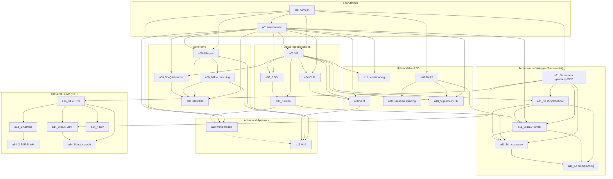

# nanovision

An implement-the-mechanism course in modern computer vision, covering the methods
that shaped the field from 2020 to 2026 (ViT, self-supervised pretraining, CLIP,
diffusion and flow matching, latent DiT, VLMs, NeRF and Gaussian splatting,
detection and segmentation, autonomous-driving BEV and occupancy, world models, and
VLA) by writing the core mechanism of each one from scratch in PyTorch.

The premise is that you understand a method when you can build the piece that does
the actual work yourself, not when you can call a library. So each topic leaves a
hole to fill in for the
mechanism (scaled dot-product attention, the diffusion noise schedule, the lift-splat
projection, the Gaussian rasterizer forward, the RSSM transition) on a tiny problem
where correctness is checkable on a CPU in seconds. Training at real scale is never
the point. Every mechanism ships with tests that prove the forward and backward
passes are right before any training runs.

The intended reader is an experienced perception or robotics engineer who last
implemented vision systems around the DETR/EfficientDet era and wants to internalize
what changed since. The material assumes you can read a paper and write PyTorch; it
does not assume you remember the 2020-2026 literature.

## How the repo is organized

```
nanovision/
├── README.md                 # this file
├── Makefile                  # the test / verify / viz commands
├── pyproject.toml            # dependency list + pytest config (NOT pip-installed)
├── environment.yml           # conda env (Python 3.11, PyTorch, CUDA 12.x)
├── nanovision/               # shared library: thin shims + provided infra
├── assignments/              # the 28 assignments you work through
├── notes/                    # reading-only notes for topics that are not built
└── claude_notes/             # build plans, research notes, and scaffolding docs
```

There is no install step. The repo runs from its root: pytest puts the root on
`sys.path` via `pythonpath = ["."]` in `pyproject.toml`, and scripts run as modules
(`python -m assignments.aXX.viz`). `pyproject.toml` documents the dependency set; it
is not pip-installed.

The shared `nanovision/` package is built by you as you go. Each module there is a
thin shim that imports its symbols back from the assignment that owns them, so once
attention is implemented in the transformer assignment, every later assignment that
does `from nanovision.attention import MultiHeadAttention` gets that code. The full
import-path contract is in `claude_notes/ARCHITECTURE.md`.

## How to approach the material

For each assignment:

1. Read the papers it points to. Each assignment names the originating papers with
   links; read them first so the mechanism has context.
2. Read the assignment's `README.md`. Every per-assignment README is written as
   standalone lecture notes, not a terse handout: the historical setting, why the
   paper mattered, the math to implement with every shape stated, and how this
   mechanism feeds later assignments. This is the primary thing you read.
3. Implement. Fill the `raise NotImplementedError` holes, then run the tests.

## How to complete an assignment

The files to edit are the top-level files in `assignments/<id>/` (for example
`vit.py`, `mae.py`, `attention.py`). The lines that carry the actual mechanism are replaced
with `raise NotImplementedError("...")` and a docstring stating the contract: input
and output shapes, what to implement, and which formula. Fill those holes.

`assignments/<id>/solution/` holds the filled-in answer key for every top-level
file. It sits in plain sight, with no gating. The point is for you to write the code
yourself and read `solution/` when stuck, not to avoid looking.

Each hole has a matching test, and the test order encodes the intended workflow:
shape tests first, then `torch.autograd.gradcheck` on a tiny double-precision
instance, then a reference-value check where one exists, then overfit-one-batch to
near-zero loss. Getting the forward and backward right comes before any training.

## Running tests and visualizations

Activate the environment first (`conda activate nanovision`), then use the `make`
targets. `A` is the assignment directory id (for example `a00_harness`). As a smoke
test that the environment is set up, run `make verify A=a00_harness` and confirm a
green bar before starting any work.

```
make test     A=a02_vit  # run YOUR code against the tests (red until the holes are filled)
make verify   A=a02_vit  # run the solution/ reference (must be green)
make viz      A=a02_vit  # render the result from solution/ to assignments/a02_vit/out/
make viz-mine A=a02_vit  # render the result from YOUR code (once the holes are filled)
make test-all            # your code across every assignment (unfilled ones fail; expected)
make verify-all          # every solution/ in its own process (the green bar)
```

Both `viz` targets write PNGs to `out/` (headless by default). Add `SHOW=1` to either
(`make viz-mine A=a02_vit SHOW=1`) to also open the figures in interactive windows.

The student-versus-solution switch is the `NANOVISION_IMPL` environment variable,
which the `make` targets set for you. Unset (the default, `make test`) imports your
top-level files; `NANOVISION_IMPL=solution` (`make verify`, `make viz`) imports the
answer key in `solution/`. The switch flips both the shared-library shims and the
assignment-local imports together, so the whole graph stays on one side. Before you
start an assignment, `make test` should fail cleanly at the holes with a contract
message; after you finish, it should match `make verify`.

## Compute

The ceiling is a single 12GB laptop GPU (an RTX 4080). Every "train it for real"
target fits in 12GB with small models, small images, and small batches. Where a
topic genuinely cannot fit (video generation, real BEV training), the assignment
says so and targets correctness plus single-batch overfitting instead, so a flat
loss curve is not mistaken for a bug. `viz.py` and heavy demos use the GPU when one
is present and fall back to CPU otherwise.

The graded tests are CPU-only and deterministic on purpose: gradcheck and
exact-equality checks break under CUDA nondeterminism. They run in seconds. A GPU
helps only the optional real-training and visualization runs.

## Assignments

28 assignments across seven modules. Build them in order, top to bottom: a later
assignment imports primitives from earlier ones, so its dependencies must exist
first. The "Depends on" column lists the assignments whose code or shared-library
symbols this one imports (the study order, drawn as a graph below). The "Deps"
column lists the external libraries each one needs on top of the base stack.

Every assignment needs the base stack: `torch`, `torchvision`, `numpy`, `scipy`,
`einops`, `matplotlib`, `tqdm`, and `pytest`. The "Deps" column names only what an
assignment adds beyond that, with `—` for none. The extra groups:

- **probe** - `timm`, `open_clip_torch`, `transformers`: pretrained-weight libraries,
  used only in clearly marked probe/survey notebooks, never in graded mechanism code.
- **av** - `nuscenes-devkit`, `pyquaternion`, `shapely`, plus the nuScenes `v1.0-mini`
  dataset (~4GB, account and license click-through).
- **C++** - a C++17 compiler, `eigen`, `cmake`, `pybind11`, `rerun-sdk`. The a14
  mechanism is C++17 with Eigen, built on demand by CMake and exposed to the same
  pytest bar through pybind11; visualization is Rerun (interactive plus a headless
  export). `gtsam` and `open3d` are optional comparison oracles (tests skip when absent).

| Id | Title | What to build | Depends on | Deps |
|----|-------|----------------|------------|------|
| a00_harness | Harness and primitives | LayerNorm, GELU, MLP, the generic `Trainer`, gradcheck and determinism helpers, toy datasets | none | — |
| a01_transformer | Transformer from scratch | Scaled dot-product and multi-head attention, the LLaMA-style block (RMSNorm, RoPE, SwiGLU), encoder/decoder, GQA/MQA | a00 | — |
| a02_vit | Vision transformers | Patch embedding, class and register tokens, a ViT assembled from the transformer block, a ConvNeXt block for the conv-vs-transformer contrast | a00, a01 | probe (`timm`) |
| a03_0_ssl | Self-supervised pretraining | Masked autoencoder (MAE), DINO self-distillation, iBOT | a01, a02 | probe (`timm`) |
| a03_5_video | Video and temporal modeling | Tubelet embedding, tube masking, video MAE | a02, a03_0 | — |
| a04_clip | CLIP and open-vocabulary | Contrastive image-text training, the SigLIP sigmoid loss as the primary variant | a01, a02 | probe (`open_clip_torch`) |
| a05_diffusion | Diffusion | DDPM and DDIM, the noise schedule, v-prediction | a00, a01 | — |
| a06_0_flow_matching | Flow matching | Rectified flow, the conditional flow-matching objective, optimal-transport coupling | a05 | — |
| a06_5_vq_tokenizer | VQ tokenizer | Vector quantization with the straight-through estimator and the commitment loss | a01, a02 | — |
| a07_latent_dit | Latent diffusion and DiT | A diffusion transformer trained in a VQ latent, with a flow-matching DiT variant | a01, a05, a06_0, a06_5 | — |
| a08_vlm | Vision-language model | A LLaVA-style VLM: ViT features projected into a language model | a01, a02, a04 | — |
| a09_nerf | NeRF | Volume rendering, ray generation, positional encoding of coordinates | a00 | — |
| a10_gaussian_splatting | Gaussian splatting | The splatting rasterizer forward and the alpha-compositing blend | a09 | — |
| a10_5_geometry_fm | Geometry foundation models | Pointmap and depth utilities, a survey of DepthAnything / Marigold / VGGT with a few fill-ins | a01, a02, a09 | probe (`timm`/`transformers`, survey) |
| a11_detection_segmentation | Detection and segmentation | A DETR-style set-prediction head and a mask head, mixed implement-and-survey | a01, a02 | probe (`transformers`, survey) |
| a11_5a_camera_geometry_bev | Camera geometry and BEV | Pinhole projection, SE(3) primitives, the `CameraRig`, inverse perspective mapping to a BEV grid; owns the nuScenes-mini loader | a00 | av + dataset |
| a11_5b_lift_splat_shoot | Lift-Splat-Shoot | Depth-distribution lift, the camera frustum, the cumsum-trick BEV splat | a11_5a, a02 | av + dataset |
| a11_5c_bevformer | BEVFormer attention | Spatial cross-attention, temporal self-attention, the dense BEV query grid | a11_5a, a01, a11_5b, a03_5 | av + dataset |
| a11_5d_occupancy | 3D occupancy | Render-supervised occupancy from the BEV features | a11_5a, a09, a11_5b, a11_5c | av + dataset |
| a11_5e_pred_planning | Prediction and planning | A motion-prediction head feeding a planning objective (leaf assignment) | a11_5b, a11_5c, a11_5d | av + dataset |
| a12_world_models | World models | A DreamerV3-style RSSM trained on cartpole-from-pixels, with a dynamics-backprop actor | a00, a01, a03_5 | — |
| a13_vla | VLA capstone | A vision-language-action model with a flow-matching action head (leaf assignment) | a05, a06_0, a08, a12 | — |
| a14_0_lie_se3 | Lie groups for state estimation (C++) | SO(3)/SE(3) exp/log, hat/vee, left/right Jacobians, the adjoint, box-plus/box-minus | a11_5a | C++ |
| a14_1_kalman | KF / EKF / UKF (C++) | Linear KF (Joseph form), EKF with a unicycle model, the UKF unscented transform, the information form | a14_0 | C++ |
| a14_2_ekf_slam | EKF-SLAM (C++) | State augmentation on landmark init, the joint O(n²) update, NN + Mahalanobis-gate data association | a14_1 | C++ |
| a14_3_multiview | Multi-view geometry (C++) | Triangulation, the normalized eight-point algorithm, essential-matrix decomposition, PnP, RANSAC, a two-view front-end | a14_0, a11_5a | C++ |
| a14_4_icp | Point-cloud registration (C++) | Point-to-point (Umeyama SVD) and point-to-plane ICP, and the associate/reject/solve outer loop | a14_0 | C++ (opt. `open3d`) |
| a14_5_factor_graph | Pose-graph / bundle adjustment (C++) | The SE(3) between-factor residual and edge Jacobians, the Gauss-Newton loop, the BA Schur complement | a14_0, a14_3 | C++ (opt. `gtsam`) |

The seven modules: foundations (a00, a01); visual representations (a02, a03_0,
a03_5, a04); generative (a05, a06_0, a06_5, a07); multimodal and 3D (a08, a09,
a10, a10_5, a11); autonomous-driving perception on nuScenes-mini (a11_5a through
a11_5e); action and dynamics (a12, a13); classical SLAM in C++ (a14_0 through a14_5).

The autonomous-driving chain (a11_5a through a11_5e) runs on the nuScenes-mini
dataset (~4GB). The camera-geometry assignment documents the account click-through
and download as step zero; the loader fails with a clear message if the dataset path
is unset.

The classical-SLAM module (a14_0 through a14_5) fills the geometric SLAM and
localization canon the deep-learning assignments skip: Lie groups, Kalman filtering,
EKF-SLAM, multi-view geometry, ICP, and factor-graph/bundle adjustment. Its mechanism
code is C++17 with Eigen rather than Python, because that is what SLAM ships in and
what interviews ask for, but the `make test` / `verify` / `viz` surface is unchanged
(CMake builds on demand, pybind11 exposes the code to the same pytest bar, Rerun draws
the visualization). It is visualization-first and each README ends with an "In
interviews" section; the full design is in `claude_notes/a14_classical_slam_plan.md`.
A reading-only `notes/classical_slam_frontiers.md` covers IMU pre-integration and VIO,
calibration, loop-closure detection, and the bridge to the learned geometry models.

### Study-order dependency graph

An arrow `x → y` means y imports code or shared-library symbols from x, so build x
first. To prepare for any assignment, follow the arrows backward to its roots. The
dashed edge into a13 is the only optional dependency (a12 is not strictly required).



`notes/` holds reading-only writeups for topics studied but not built (video
generation, VLA data engines, efficient attention, state-space backbones, MM-DiT and
REPA, video world models). `claude_notes/` holds the build plans, research notes, and
scaffolding docs (`ARCHITECTURE.md`, `BUILD_ORDER.md`, `BUILD_CHECKLIST.md`,
`TEMPLATE.md`) used to author the course.
