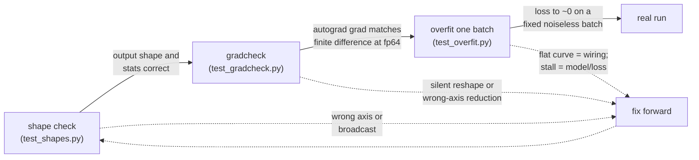
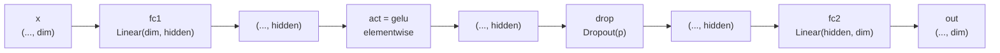
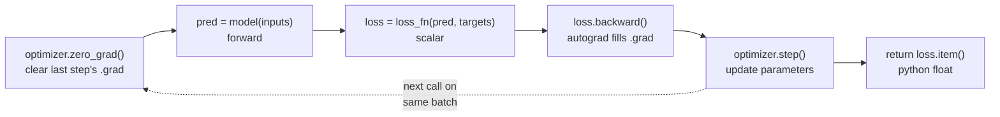

# A0 - Harness and primitives

## Motivation

This course is organized around one rule: prove a mechanism is correct on a tiny
problem before you ever run real training. A0 builds the tools that make that rule
operational, and it builds them on the three primitives every transformer block is
made of. So this first assignment is about the course's method as much as about
LayerNorm and GELU.

The method exists because of how training failures actually present themselves. If
you implement a forward pass with a subtle bug - a normalization over the wrong
axis, a transposed weight, a broadcast that silently does the wrong thing - the
program does not crash. It produces tensors of the right shape and a loss that goes
down a little and then plateaus. You are now staring at a loss curve trying to
infer, from a single scalar per step, which of dozens of lines is wrong. Each
hypothesis costs a training run. This is the most expensive way to debug code that
exists, and it is the default workflow people fall into. The course refuses it: we
make correctness observable directly, at the level of the operation, before any
optimizer touches a parameter.

Two checks carry that weight, and you build both here.

The first is `check_gradients`, a thin wrapper over
[`torch.autograd.gradcheck`](https://pytorch.org/docs/stable/generated/torch.autograd.gradcheck.html).
It casts a tiny instance of your module to float64, then compares the gradients
autograd computes against a numerical estimate obtained by perturbing each input by
a small `eps` and measuring the change in the output (a finite difference). If the
two agree to tight tolerance, your `forward` is differentiably correct: the
function you wrote is the function whose derivative autograd is propagating, with no
silent reshape or wrong-axis reduction in between. The float64 part matters. The
finite-difference estimate has truncation error that shrinks with `eps` and
floating-point error that grows as `eps` shrinks; in float32 those two error
sources leave no `eps` where the estimate is sharp, and the check is too loose to
catch real bugs. In float64 there is a wide window where the numerical gradient is
accurate to many digits, so agreement is close to a proof that your hand-written
forward is correct - and you got there without writing a single line of backward
pass. That is the whole point of leaning on autograd: you implement the mechanism
forward, and gradcheck certifies the gradient for free.

The second is overfit-one-batch, driven by `Trainer.overfit_one_batch`. You take
one fixed batch and train on it, and only it, until the loss reaches approximately
zero. A model with enough capacity to represent the batch *must* be able to
memorize it; if it cannot, something in the model-plus-training-loop wiring is
broken. This is the canonical first signal in the course that an end-to-end system
is correct, and it is diagnostic in a specific way. A loss that falls smoothly to
~0 means the forward pass, the loss, the backward pass, and the optimizer step are
all connected and the gradients point downhill. A loss that stays flat from step
one usually means the optimization step itself is broken - a missing
`zero_grad`, `backward`, or `optimizer.step` - so no parameter is actually moving.
A loss that drops a bit and then stalls points at the model: insufficient capacity,
a dead activation, a detached tensor cutting the graph. Because the batch is fixed
and noiseless, generalization is not a confound; the only thing being tested is
whether the machine can fit data it has full capacity to fit. Throughout the
course, when an assignment says "a flat curve here is expected, not a bug" (the
12GB ceiling means some topics never get a real training run), it is overfit-one-
batch that tells you the difference between a flat curve from a correct-but-
underpowered run and a flat curve from a wiring mistake.

The primitives you build alongside these tools are the right first mechanisms
because every transformer block in the rest of the course is exactly these three
plus attention. LayerNorm normalizes each sample's activations across the feature
dimension to zero mean and unit variance, then rescales by a learned gain and
shift. It is what lets deep stacks train: without it, the scale of activations
drifts layer to layer and gradients explode or vanish. Ba, Kiros and Hinton
introduced it in
[Layer Normalization](https://arxiv.org/abs/1607.06450) (2016) specifically because
batch normalization's per-batch statistics are awkward for recurrent and
sequence models; layer norm computes its statistics per sample, over the features,
so it is independent of batch size and identical at train and test time. That
property is what makes the pre-norm residual block - normalize, sublayer, add -
the standard structure you will build in A1 and reuse everywhere after.

GELU is the activation. Hendrycks and Gimpel proposed it in
[Gaussian Error Linear Units (GELUs)](https://arxiv.org/abs/1606.08415) (2016) as a
smooth gate: instead of ReLU's hard cutoff at zero, GELU multiplies each input by
the probability that a standard Gaussian is below it, `x * Φ(x)`, which weights an
input by how large it is rather than thresholding it. The smoothness gives nonzero
gradient on both sides of the origin, and the exact form uses the error function,
`x * 0.5 * (1 + erf(x / sqrt(2)))`. The paper also gives a tanh approximation that
predates fast vectorized `erf`; we implement the exact form because `torch.erf` is
fast and exact, and because matching the exact definition keeps the primitive
unambiguous. GELU is the activation inside the transformer's MLP.

The MLP is that per-token computation: two linear layers with the activation
between them, applied independently to every position. Attention moves information
between tokens; the MLP is where each token is transformed on its own, and it holds
the majority of a transformer's parameters. Building it here as a reusable
`nn.Module` means A1 can drop it into the block without rewriting it.

Forward connections are concrete. A1 imports `LayerNorm`, `gelu`, and `MLP` from
`nanovision.primitives` to assemble the transformer block (it also adds `RMSNorm`
and `SwiGLU` to the same module for the LLaMA-style default). Every assignment from
A1 onward verifies its new mechanism with `check_gradients` and proves its
model-plus-loop with `overfit_one_batch`, both built here. The `Trainer`, the
determinism helpers, and the loss-curve viz are reused unchanged for the rest of
the course. You are building the instruments before the experiments.

The method is a fixed sequence of cheap-to-expensive checks. Each gate catches a
different class of bug before the next one runs, so you never spend a real training
run finding something a shape assertion would have caught:

## Background

LayerNorm over the last dimension. Given `x` of shape `(..., dim)`, take the mean
and biased variance over the last axis (keeping the dimension for broadcasting):

    mean = x.mean(-1, keepdim=True)              # (..., 1)
    var  = x.var(-1, keepdim=True, unbiased=False)  # (..., 1), divides by dim
    y    = (x - mean) / sqrt(var + eps) * weight + bias

`weight` and `bias` are learned parameters of shape `(dim,)`, initialized to ones
and zeros, so a freshly constructed LayerNorm outputs zero mean and unit standard
deviation over the last axis. `eps` (default `1e-5`) guards the divide. Output
shape equals input shape. Use `unbiased=False`; the biased variance (dividing by
`dim`, not `dim-1`) is the standard layer-norm convention.

Exact GELU, elementwise, same shape in and out:

    GELU(x) = x * 0.5 * (1 + erf(x / sqrt(2)))

`erf` is `torch.erf`, and `sqrt(2)` is `math.sqrt(2.0)`. Note `GELU(0) == 0`.

The MLP, with `x` of shape `(..., dim)`:

    fc1: Linear(dim, hidden)      # (..., hidden)
    act: gelu                     # (..., hidden)
    drop: Dropout(p)              # (..., hidden)
    fc2: Linear(hidden, dim)      # (..., dim)

so `forward(x) = fc2(drop(act(fc1(x))))`. Output shape equals input shape. With
`dropout=0.0` (the A0 default) the dropout layer is the identity. The width goes up
to `hidden` in the middle and back down to `dim`, and every step is elementwise or
position-wise, so the leading `...` dimensions pass through untouched:

The optimization step is the standard rhythm. Given a batch `(inputs, targets)`:

    model.train()
    optimizer.zero_grad()              # clear last step's grads
    pred = model(inputs)               # forward
    loss = loss_fn(pred, targets)      # scalar
    loss.backward()                    # autograd fills .grad
    optimizer.step()                   # update parameters
    return loss.item()                 # python float for logging

`overfit_one_batch` calls `step` on the same batch for a fixed number of steps and
records the loss each time; a correct setup drives it to ~0. The order inside `step`
is what makes it correct: `zero_grad` clears the previous step's gradients before
`backward` accumulates new ones, and `optimizer.step` reads those gradients before
the next `zero_grad` wipes them. Drop or reorder any one of these and the loss stays
flat.

## What you'll implement

`gelu`, `LayerNorm.forward`, and `MLP.forward` in `starter/primitives.py`, and
`Trainer.step` in `starter/trainer.py`. Four small holes. Everything else - the
gradcheck and shape helpers, determinism, the toy datasets, the rest of the
`Trainer`, and the viz - is provided.

## Tasks

1. **gelu** (`starter/primitives.py`, `gelu`) - return the exact erf GELU of `x`,
   same shape in and out. Teaches the activation as a smooth gate, and that
   `gelu(0) == 0`.
2. **LayerNorm.forward** (`starter/primitives.py`, `LayerNorm`) - normalize over
   the last dim using mean and biased variance, then scale and shift by the learned
   `weight` and `bias`. Teaches normalization built from primitive ops rather than
   `nn.LayerNorm`.
3. **MLP.forward** (`starter/primitives.py`, `MLP`) - the two-layer position-wise
   feed-forward, `fc2(drop(act(fc1(x))))`. Teaches the block's per-token
   computation.
4. **Trainer.step** (`starter/trainer.py`, `Trainer.step`) - one optimization step
   returning the scalar loss. Teaches the zero-grad / forward / backward / step
   rhythm that `overfit_one_batch` and `fit` drive.

Each task maps to one `raise NotImplementedError(...)` in `starter/` and to one
test.

## How to verify

Run from the repo root with the `nanovision` conda env active, in this order. The
test order is the workflow: shapes first (cheapest, catches axis and broadcast
mistakes), then gradcheck (certifies the forward is differentiably correct), then
overfit (proves the whole loop).

    make test A=a00_harness      # your starter; red until you fill the holes

That runs, in order:

- `tests/test_shapes.py` - output shapes for Tasks 1-3, plus that a fresh
  LayerNorm produces zero mean and unit std over the last dim, and `gelu(0) == 0`.
- `tests/test_gradcheck.py` - `check_gradients` at float64 on `LayerNorm` and
  `MLP`, plus a smoke test of `assert_shapes`.
- `tests/test_overfit.py` - `Trainer.overfit_one_batch` drives a noiseless
  linear-regression batch to MSE < 1e-4 in 500 steps.

To confirm the reference passes and render the loss curve:

    make verify A=a00_harness    # reference solution; should be green
    make viz    A=a00_harness    # writes out/loss_curve.png

The reference is visible in `nanovision/primitives.py` and `nanovision/trainer.py`;
read it if you get stuck.

## Compute notes

CPU only, seconds to run; no GPU needed. The overfit test uses Adam with lr=0.1 for
500 steps on a noiseless linear-regression batch produced by
`nanovision.data.toy.linreg_batch` (n=64, d=8), which is exactly representable by a
`Linear(8, 1)`, and expects final MSE < 1e-4. With `set_seed(0)` the reference run
starts near MSE 14.5 and reaches about 2e-13 by step 500, so the loss-curve plot
(log y-axis) drops almost straight down. A curve that stays flat from the start
means the step is wired wrong (missing `zero_grad`, `backward`, or `step`), not a
tuning problem; a curve that drops then stalls well above zero on this batch points
at the model or loss, not the optimizer.

## Stretch goals

1. Add `RMSNorm` to `nanovision.primitives` (A1 needs it) and gradcheck it. It is
   already present in the package reference; implement it yourself in the starter
   and confirm `check_gradients` passes.
2. Have `Trainer.fit` log a validation loss when given a `val_loader`.
3. Animate the linreg fit (prediction vs. iteration) from the CSV log the `Trainer`
   writes.

## Further reading

- Ba, Kiros and Hinton,
  [Layer Normalization](https://arxiv.org/abs/1607.06450) (2016) - per-sample
  normalization over features, independent of batch size, identical at train and
  test; the norm in the pre-norm residual block.
- Hendrycks and Gimpel,
  [Gaussian Error Linear Units (GELUs)](https://arxiv.org/abs/1606.08415) (2016) -
  the smooth `x * Φ(x)` activation; introduces both the exact-erf form and the tanh
  approximation.
- Kingma and Ba,
  [Adam: A Method for Stochastic Optimization](https://arxiv.org/abs/1412.6980)
  (2014) - the adaptive optimizer the overfit test and most later assignments use.
