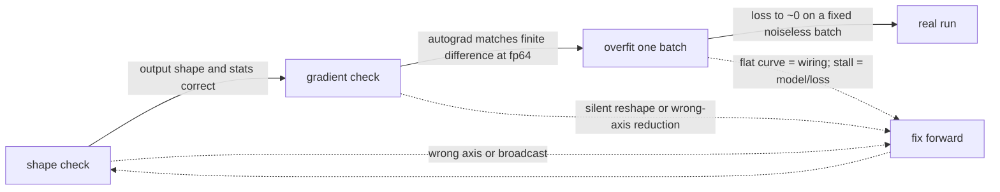
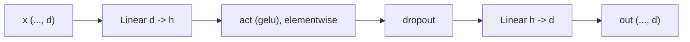
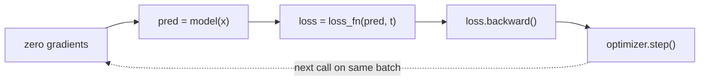

# A0 - Harness and primitives

This course is organized around one rule: prove a mechanism is correct on a tiny problem before
running it in real training. This assignment builds the two correctness checks that make that rule
operational, and builds them alongside the three primitives every transformer block is made of:
layer normalization, the GELU activation, and the position-wise MLP. The first check is a gradient
test that compares autograd against a finite-difference estimate at double precision; the second is
overfit-one-batch, which trains a model on a single fixed batch until the loss reaches zero. The
primitives come first because they are the smallest pieces the rest of the course reuses.

Build the harness and the three primitives from low-level operations. Implement the exact GELU,
layer normalization from mean and variance, the two-layer MLP, and one optimization step of a
generic training loop. The gradient checker, the determinism helpers, the toy datasets, and the
loss-curve plotting are provided. Everything runs on CPU in seconds.

Required reading before starting:
- Ba, Kiros, Hinton 2016, "Layer Normalization",
  [arXiv:1607.06450](https://arxiv.org/abs/1607.06450).
- Hendrycks, Gimpel 2016, "Gaussian Error Linear Units (GELUs)",
  [arXiv:1606.08415](https://arxiv.org/abs/1606.08415).

## Lecture notes

### Why verify before training

Training failures rarely announce themselves. A forward pass with a subtle bug - a normalization
over the wrong axis, a transposed weight, a broadcast that silently does the wrong thing - does not
crash. It produces tensors of the right shape and a loss that drops a little and then plateaus. The
only evidence left is a loss curve, one scalar per step, from which to infer which of dozens of
lines is wrong, and each hypothesis costs a training run. That is the most expensive way to debug
that exists. The alternative is to make correctness observable at the level of the operation, before
any optimizer touches a parameter. Two checks carry that load.

The first is a gradient check, a thin wrapper over
[`torch.autograd.gradcheck`](https://pytorch.org/docs/stable/generated/torch.autograd.gradcheck.html).
It casts a small instance of a module to float64, then compares the gradients autograd computes
against a numerical estimate obtained by perturbing each input by a small $\varepsilon$ and measuring
the change in the output, a finite difference. If the two agree to tight tolerance, the forward is
differentiably correct: the function written is the function whose derivative autograd is
propagating, with no silent reshape or wrong-axis reduction in between. Agreement is close to a proof
that the hand-written forward is correct, and it holds without writing a single line of backward
pass.

Float64 is what makes the check sharp. The finite-difference estimate has two error sources:
truncation error that shrinks as $\varepsilon$ shrinks, and floating-point error that grows as
$\varepsilon$ shrinks. In float32 those two leave no value of $\varepsilon$ where the estimate is
accurate, and the check is too loose to catch real bugs. In float64 there is a wide window where the
numerical gradient is accurate to many digits, so the comparison is tight enough to expose a wrong
reduction axis or a dropped term.

The second check is overfit-one-batch. Take one fixed batch and train on it, and only it, until the
loss reaches approximately zero. A model with enough capacity to represent that batch must be able to
memorize it; if it cannot, something in the model-plus-loop wiring is broken. The signal is
diagnostic in a specific way. A loss that falls smoothly to zero means the forward pass, the loss,
the backward pass, and the optimizer step are all connected and the gradients point downhill. A loss
that stays flat from step one usually means the optimization step itself is broken, a missing
gradient reset, backward call, or optimizer update, so no parameter actually moves. A loss that drops
a bit and then stalls points at the model: insufficient capacity, a dead activation, a detached
tensor cutting the graph. Because the batch is fixed and noiseless, generalization is not a confound;
the only thing tested is whether the machine can fit data it has full capacity to fit.

The two checks form a fixed sequence of cheap-to-expensive gates. A shape check runs first and
catches axis and broadcast mistakes for almost no cost. The gradient check runs next and certifies
the forward is differentiably correct. Overfit-one-batch runs last and proves the whole loop.



### Layer normalization

Layer normalization (Ba, Kiros, Hinton 2016) normalizes each sample's activations across the feature
dimension to zero mean and unit variance, then rescales by a learned gain and shift. For an input $x$
with feature dimension $d$, taking the mean and biased variance over the last axis:

$$\mu = \frac{1}{d}\sum_i x_i, \qquad \sigma^2 = \frac{1}{d}\sum_i (x_i - \mu)^2, \qquad
y = \frac{x - \mu}{\sqrt{\sigma^2 + \varepsilon}}\,\gamma + \beta.$$

The gain $\gamma$ and shift $\beta$ are learned parameters of length $d$, initialized to ones and
zeros, so a freshly constructed layer norm outputs zero mean and unit standard deviation over the
last axis. The small constant $\varepsilon$ guards the divide. The variance is biased, dividing by
$d$ rather than $d-1$, which is the standard convention for this normalization.

It lets deep stacks train. Without it, the scale of activations drifts from layer to layer and
gradients explode or vanish; normalizing each layer's input holds the scale steady. Ba, Kiros, and
Hinton introduced it because batch normalization computes statistics per batch, which is awkward for
recurrent and sequence models where the batch dimension is not the natural one to normalize over.
Layer norm computes its statistics per sample over the features, so it is independent of batch size
and identical at training and test time. That property is what makes the pre-norm residual block, the
standard structure later in the course, work the same way regardless of batch.

### GELU

GELU (Hendrycks, Gimpel 2016) is a smooth activation. Where ReLU applies a hard cutoff at zero, GELU
multiplies each input by the probability that a standard Gaussian draw falls below it, $x\,\Phi(x)$,
which weights an input by how large it is rather than thresholding it. Writing $\Phi$ as the standard
normal cumulative distribution function gives the exact form through the error function:

$$\operatorname{GELU}(x) = x\,\Phi(x) = x\cdot\tfrac{1}{2}\big(1 + \operatorname{erf}(x/\sqrt{2})\big).$$

The smoothness gives a nonzero gradient on both sides of the origin, unlike ReLU's flat left half,
and $\operatorname{GELU}(0) = 0$. The original paper also gives a tanh approximation that predates
fast vectorized error functions; the exact form is the one to implement, because the error function
is now fast and exact and matching the exact definition keeps the primitive unambiguous. GELU is the
activation inside the transformer's MLP.

### The MLP

The MLP is the per-token computation in a transformer block: two linear layers with the activation
between them, applied independently to every position. For an input of feature dimension $d$ and
inner width $h$, the first linear maps $d \to h$, the activation runs elementwise, an optional
dropout follows, and the second linear maps $h \to d$:

$$\operatorname{MLP}(x) = W_2\,\operatorname{drop}\big(\operatorname{act}(W_1 x + b_1)\big) + b_2.$$

Every step is elementwise or position-wise, so any leading batch and sequence dimensions pass through
untouched. Attention moves information between tokens; the MLP is where each token is transformed on
its own, and it holds the majority of a transformer's parameters.



### The optimization step

One step of gradient descent on a batch $(x, t)$ has a fixed rhythm: clear the previous step's
gradients, run the forward pass, compute the scalar loss, backpropagate to fill the gradients, then
let the optimizer update the parameters.



The order is what makes it correct. The gradient reset clears the previous step's gradients before
the backward pass accumulates new ones; the optimizer reads those gradients before the next reset
wipes them. Drop or reorder any one of these and the loss stays flat, which is exactly the
wiring-failure signature overfit-one-batch detects. Adam (Kingma, Ba 2014) is the optimizer used here
and in most later assignments: an adaptive method that scales each parameter's step by a running
estimate of its gradient magnitude.

## The assignment

Implement the three primitives and one optimization step. Each task maps to one
`NotImplementedError` in a top-level file and to one test. The gradient checker, the shape helper,
the determinism helpers, the toy datasets, the rest of the trainer, and the plotting are provided.
The docstrings in each file give the exact formulas, shapes, and conventions; read those in the
files rather than here.

### Files to modify

`primitives.py` holds the three primitives. Implement `gelu` (the exact error-function GELU from the
GELU section), `LayerNorm.forward` (the normalize-then-scale from the layer-normalization section,
built from mean and biased-variance operations rather than `nn.LayerNorm`), and `MLP.forward` (the
two-layer position-wise feed-forward from the MLP section).

`trainer.py` holds the training loop. Implement `Trainer.step`, the single optimization step from the
optimization-step section. The provided `overfit_one_batch` and `fit` both call `step`, so a correct
step is what lets either of them drive a loss down.

### Running and validating

Activate the environment (`conda activate nanovision`), then run from the repo root:

```
make test   A=a00_harness   # run the tests against the top-level files (the ones with holes)
make verify A=a00_harness   # run the same tests against the reference solution/
make viz    A=a00_harness   # render the loss curve from the reference solution
```

`make test` is the command to run while working. It runs the suite in
`assignments/a00_harness/tests/` against the top-level files, and goes from red (the holes raise
`NotImplementedError`) to green as they are filled. `make verify` runs the identical suite against
the reference in `solution/`: it sets `NANOVISION_IMPL=solution`, which makes the tests import the
reference instead of the top-level files, so it is green from the start and shows the target. The
goal is to bring `make test` to the same green as `make verify`. The reference is visible in
`solution/primitives.py` and `solution/trainer.py`; read it if stuck.

The tests run in the cheap-to-expensive order from the notes:

- `tests/test_shapes.py` checks the output shapes for the three primitives, that a fresh layer norm
  produces zero mean and unit standard deviation over the last axis, and that $\operatorname{GELU}(0)
  = 0$.
- `tests/test_gradcheck.py` runs the float64 gradient check on `LayerNorm` and `MLP`, plus a smoke
  test of the shape helper.
- `tests/test_overfit.py` drives a noiseless linear-regression batch to mean-squared error below
  $10^{-4}$ in 500 steps through `Trainer.overfit_one_batch`.

`make viz` overfits the same linear-regression batch and writes `out/loss_curve.png`. It uses the
reference solution, so it works on a fresh checkout before any hole is filled. It writes a PNG rather
than opening a window: the plot uses matplotlib's headless Agg backend, so the command behaves the
same over SSH, in WSL, and in CI with no display attached. `make viz-mine A=a00_harness` runs the
same script against the top-level code instead, for checking a finished implementation, and needs
the holes filled. Add `SHOW=1` to either to also open an interactive window when a display is
available.

What you should see when you run this. The overfit test uses Adam at learning rate 0.1 for 500 steps
on a noiseless linear-regression batch ($n=64$, $d=8$) that a single `Linear(8, 1)` represents
exactly. With the seed fixed, the reference run starts near a mean-squared error of 14.5 and reaches
about $2\times10^{-13}$ by step 500, so the loss curve on a log axis drops almost straight down. A
curve that stays flat from the start means the step is wired wrong (a missing gradient reset,
backward, or optimizer update), not a tuning problem; a curve that drops then stalls well above zero
on this batch points at the model or loss, not the optimizer.

## Additional reference material

Where this goes next:

- The transformer block (A1) imports `LayerNorm`, `gelu`, and `MLP` from `nanovision.primitives` to
  assemble the pre-norm residual block, and adds RMSNorm and the SwiGLU feed-forward to the same
  module for the LLaMA-style default.
- Every assignment from A1 onward verifies its new mechanism with the gradient check and proves its
  model-plus-loop with overfit-one-batch, both built here. The trainer, the determinism helpers, and
  the loss-curve plotting are reused unchanged.

Full reference list:

- Ba, Kiros, Hinton 2016, "Layer Normalization",
  [arXiv:1607.06450](https://arxiv.org/abs/1607.06450). Per-sample normalization over features,
  independent of batch size, identical at train and test.
- Hendrycks, Gimpel 2016, "Gaussian Error Linear Units (GELUs)",
  [arXiv:1606.08415](https://arxiv.org/abs/1606.08415). The smooth $x\,\Phi(x)$ activation; both the
  exact error-function form and the tanh approximation.
- Kingma, Ba 2014, "Adam: A Method for Stochastic Optimization",
  [arXiv:1412.6980](https://arxiv.org/abs/1412.6980). The adaptive optimizer the overfit test and most
  later assignments use.
