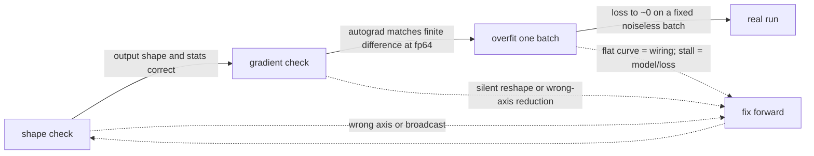
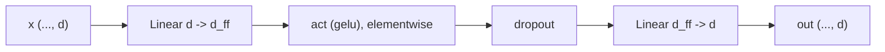
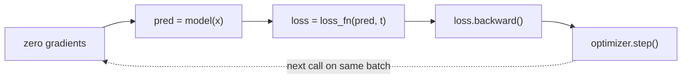

# A0 - Harness and primitives

This course is organized around one rule: prove a mechanism is correct on a tiny problem before
running it in real training. This assignment builds the two correctness checks that make that rule
operational, alongside three of the primitives a transformer block is built from: layer
normalization, the GELU activation, and the position-wise MLP. The first check is a gradient test
that compares autograd against a finite-difference estimate at double precision; the second is
overfit-one-batch, which trains a model on a single fixed batch until the loss reaches zero. The
primitives come first because they are the smallest pieces the rest of the course reuses.

Build the harness and the three primitives from low-level operations. Implement the exact GELU,
layer normalization from mean and variance, the two-layer MLP, and one optimization step of a
generic training loop. The gradient checker, the determinism helpers, the toy datasets, and the
loss-curve plotting are provided. Everything runs on CPU in seconds.

Required reading before starting:
- Ba, Kiros, Hinton 2016, "Layer Normalization",
  [arXiv:1607.06450](https://arxiv.org/abs/1607.06450).
- Hendrycks, Gimpel 2016, "Gaussian Error Linear Units (GELUs)",
  [arXiv:1606.08415](https://arxiv.org/abs/1606.08415).

## Lecture notes

### Where these primitives sit

A transformer operates on a set of tokens. A token is one vector of length $d$: a word piece in a
language model, a 16x16 image patch in a vision transformer, a sampled point along a ray in a 3D
model. A batch of $B$ sequences of $S$ tokens each is a tensor of shape $(B, S, d)$, and $d$ is
fixed for the whole stack, so every layer takes $(B, S, d)$ in and returns $(B, S, d)$ out. Unlike
a Kalman filter or a recurrent network, nothing is carried along the sequence axis from one step to
the next; a transformer rewrites all $S$ token vectors at once, a fixed number of times.

Each layer does two things in turn. Attention mixes information across the token axis: every output
token is a weighted average of all the input tokens, with the weights computed from the token
contents. The other half touches one token at a time. The same two-layer MLP runs on each of the $S$
token vectors independently, with the same weights, and nothing crosses between positions. That is
what position-wise means: a map $\mathbb{R}^d \to \mathbb{R}^d$ broadcast over the leading batch and
sequence axes.

Both halves are wrapped the same way. The layer's input is normalized, the mechanism runs on the
normalized copy, and its result is added back to the un-normalized input:

$$x' = x + \operatorname{Attn}(\operatorname{Norm}(x)), \qquad y = x' + \operatorname{MLP}(\operatorname{Norm}(x')).$$

Those additions leave a path from the input of the stack to its output that no layer multiplies -
the residual stream. Putting the norm inside the branch rather than after the addition makes this a
pre-norm block, which the transformer assignment covers in full.

Three parts of that expression are built here: $\operatorname{Norm}$ (layer normalization), the MLP,
and the GELU nonlinearity inside the MLP. Attention is the transformer assignment's subject. Modern
LLaMA-style stacks swap RMSNorm in for layer normalization and a SwiGLU feed-forward in for the GELU
MLP; both are refinements of the same two slots, added to the same module later.

### Automatic differentiation

Training needs $\partial L / \partial \theta$ for every parameter $\theta$, where $L$ is a single
scalar loss. Nothing in this course writes that derivative by hand; PyTorch's autograd computes it.
Since the first correctness check compares autograd against an independent estimate, it is worth
being concrete about what autograd does.

A network is a chain of maps $u_k = f_k(u_{k-1})$ for $k = 1, \dots, n$, where $u_0$ holds the
inputs and parameters, the intermediate $u_k$ are vectors of activations, and $u_n$ is the scalar
loss. The chain rule for a composition of vector-valued maps is a product of Jacobians: with $J_k =
\partial u_k / \partial u_{k-1}$,

$$\frac{\partial u_n}{\partial u_0} = J_n J_{n-1} \cdots J_1.$$

None of those matrices is ever formed. Forming one would be hopeless: a layer with a million inputs
and a million outputs has a Jacobian with $10^{12}$ entries. What is needed is the product's action
on a vector, and there are two orders in which to evaluate it. Grouping from the right, $J v =
J_n(J_{n-1}(\cdots(J_1 v)))$, pushes one input direction $v$ forward through the chain, one
matrix-vector product per layer, and returns how every output changes along that direction. That is
forward mode, and it costs one pass per input direction. Grouping from the left, $w^\top J = ((w^\top
J_n) J_{n-1}) \cdots J_1$, pulls one output direction $w$ backwards through the chain and returns how
that one output changes with respect to every input. That is reverse mode, one pass per output
direction.

Deep learning has millions of inputs (the parameters) and exactly one output (the scalar loss), so
reverse mode wins by that ratio. A single backward pass, seeded with $w = 1$, yields the gradient
with respect to every parameter at a cost within a small constant factor of the forward pass.
Reverse mode is backpropagation.

Grouping from the left means each layer only ever has to supply one operation: given a row vector
$w^\top$ holding the derivative with respect to $u_k$, return $w^\top J_k$, the derivative with
respect to $u_{k-1}$. This is a vector-Jacobian product, and every PyTorch operation ships one,
written in terms of quantities the forward pass already computed. Elementwise multiplication by a
vector $a$ shows why that matters: its Jacobian is the diagonal matrix $\operatorname{diag}(a)$, but
the vector-Jacobian product is just $w \odot a$, and the $n \times n$ diagonal matrix is never
allocated.

To chain them, autograd records what happened. Every operation on a tensor that requires gradients
appends a node to a directed acyclic graph, storing the operation, its inputs, and whatever it needs
for its vector-Jacobian product. `loss.backward()` walks that graph backwards from the loss,
applying each node's vector-Jacobian product, and accumulates the result into the `.grad` field of
each leaf tensor. The graph is rebuilt by every forward pass, which is why ordinary Python control
flow inside a model is allowed.

Two consequences matter below. First, `.grad` accumulates by adding rather than overwriting. That is
deliberate, because it makes summing gradients over several backward calls work with no special
support, as when a batch too large for memory is split into pieces or when two losses are applied to
one model. It also means the gradients have to be cleared before each step, or the current step is
polluted by the previous one. Second, a tensor can be cut out of the graph with `.detach()`, which
returns the same numbers with no recorded history, so the backward walk stops there. Detaching on
purpose is common, for instance on a target that should not be trained through. Detaching by
accident, or calling `.item()` or converting to NumPy in the middle of a model, silently disconnects
everything upstream and those parameters stop moving.

### Why verify before training

Training failures rarely announce themselves. A forward pass with a subtle bug - a normalization
over the wrong axis, a transposed weight, a broadcast that silently does the wrong thing - does not
crash. It produces tensors of the right shape and a loss that drops a little and then plateaus. The
only evidence left is a loss curve, one scalar per step, from which to infer which of dozens of
lines is wrong, and each hypothesis costs a training run. That is the most expensive way to debug
that exists. The alternative is to make correctness observable at the level of the operation, before
any optimizer touches a parameter. Two checks do that, and the next three sections describe them.

### Checking a gradient against finite differences

The first check is a gradient check. `check_gradients` in `nanovision/gradcheck.py` is a thin wrapper
over [`torch.autograd.gradcheck`](https://pytorch.org/docs/stable/generated/torch.autograd.gradcheck.html),
and it compares the derivatives autograd reports against a second estimate that shares none of
autograd's machinery, obtained by perturbing the input and re-running the forward pass.

The estimate is a central difference. For a scalar function $f$ and a step $h$, subtracting the
Taylor expansion of $f(x - h)$ from that of $f(x + h)$ cancels every even-order term and leaves

$$\frac{f(x + h) - f(x - h)}{2h} = f'(x) + \frac{h^2}{6} f'''(x) + O(h^4).$$

(PyTorch and the helper both call this step `eps`; it is written $h$ here because $\varepsilon$ is
already the layer-norm constant further down.)

`gradcheck` applies that formula one entry at a time. Perturbing input entry $j$ and recording the
change in every output entry $i$ fills column $j$ of the numerical Jacobian $\partial y_i/\partial
x_j$. The analytic Jacobian comes from running the backward pass once per output entry, each seeded
with a one-hot vector. The two matrices are then compared entry by entry with `torch.allclose`, at
`atol=1e-4` and `rtol=1e-3` in this helper. Every entry has to match, so a wrong reduction axis or a
dropped term surfaces as a specific pair of indices rather than as one summary number.

What agreement establishes is narrower than "the code is right", and the boundary is worth being
exact about. It establishes that the derivative autograd propagates is the derivative of the forward
pass as written, with no silent reshape, wrong-axis reduction, or broadcast that quietly sums where
it should not, and it establishes that without a line of backward pass being written. It does not
establish that the forward pass computes the intended function: a layer norm that takes its
statistics over the wrong axis is perfectly self-consistent and passes. The shape-and-statistics
test runs first for that reason. The check also covers only the tensors handed to it, which here are
the module's inputs, so the derivatives with respect to the parameters $\gamma$ and $\beta$ are
exercised through the same graph but not compared directly.

### Why the check runs in float64

Two error sources sit on the finite-difference estimate and they pull in opposite directions.
Truncation error is the $h^2 f'''/6$ term above, and it shrinks as $h$ shrinks. Roundoff error is
the other one: $f(x + h)$ and $f(x - h)$ are each computed to a relative accuracy of about $u$, the
unit roundoff of the floating-point format, so their difference carries an absolute error around
$u|f|$, and dividing by $2h$ inflates that to $u|f|/h$. That grows as $h$ shrinks. The relative
error of the estimate therefore behaves like

$$e(h) \approx \frac{h^2}{6}\frac{|f'''|}{|f'|} + \frac{u}{h}\frac{|f|}{|f'|}.$$

Treating the two ratios as order 1 and setting $de/dh = 0$ puts the best step at $h \sim u^{1/3}$,
where the error is about $u^{2/3}$. That is the entire argument for double precision, because $u$
differs between the formats by nine orders of magnitude: $u = 2^{-53} \approx 1.1\times10^{-16}$ in
float64 and $u = 2^{-24} \approx 6.0\times10^{-8}$ in float32.

Put the two formats through it. Float64 has its optimum near $h \approx 5\times10^{-6}$ with an
error around $2\times10^{-11}$, and the valley is broad, so the helper's default $h = 10^{-6}$ still
gives roughly ten correct digits of the derivative. Comparing at a relative tolerance of $10^{-3}$
is then about seven orders of magnitude looser than the noise floor, which is why a real bug has
nowhere to hide. Float32 cannot do better than about $1.5\times10^{-5}$ relative error at any $h$,
and at the $h = 10^{-6}$ actually configured the roundoff term alone is of order $u/h \approx
6\times10^{-2}$ - a percent-level error on a quantity being compared to a part in a thousand. A
float32 check either fails on correct code or has to be loosened past the point where it can tell a
correct gradient from a wrong one.

Casting the module and its floating-point inputs to double, which `check_gradients` does before
calling `gradcheck`, is the whole fix. It costs nothing here because the checks run on tensors of
shape $(4, 6)$ and $(3, 6)$.

### Overfit one batch

The second check takes one fixed batch and trains on it, and only it, until the loss reaches
approximately zero. Suppose the model has the capacity to represent that batch, meaning the batch's
input-to-output map lies inside the set of functions the parameters can express, so that some
setting of $\theta$ achieves zero loss. A correctly wired training loop then has to find it. The test
uses a noiseless linear-regression batch and a single `torch.nn.Linear(8, 1)`, so representability
holds by construction: `linreg_batch` generates its targets as a fixed linear function of the inputs
plus a bias, and the model's parameters are a weight vector and a bias of matching size.

The shape of the resulting curve names the failure. A loss that falls smoothly to zero means the
forward pass, the loss, the backward pass, and the optimizer step are all connected and the gradients
point downhill. A loss that is flat from step one means no parameter moved at all, which is a wiring
failure: a missing gradient reset, a missing backward call, a missing optimizer step, an optimizer
constructed over the wrong parameter list, or a `.detach()` sitting between the parameters and the
loss.

A loss that drops a little and then stalls well above zero points at the model or the loss rather
than at the loop. Insufficient capacity is one cause. A dead unit is another: a unit whose activation
function has zero derivative across the whole range its pre-activation currently occupies passes zero
gradient to everything upstream of it, and since nothing pushes it back, it stays dead for the rest
of training. ReLU units stuck at negative pre-activation are the standard example, and avoiding them
is part of the argument for GELU below.

Because the batch is fixed and noiseless, generalization - whether the model would do anything
sensible on data it has not seen - is not a confound. The only question is whether the machine can
fit data it has full capacity to fit.

The two checks form a fixed sequence of cheap-to-expensive gates. A shape check runs first and
catches axis and broadcast mistakes for almost no cost. The gradient check runs next and certifies
the forward is differentiably correct. Overfit-one-batch runs last and proves the whole loop.



### Normalization and the scale of activations

A deep stack has a scale problem before it has any other problem. The backward pass is the product
of Jacobians $J_n \cdots J_1$ from the autograd section. Let $\kappa_k$ be the typical factor by
which layer $k$'s Jacobian scales a vector. The gradient arriving at layer 1 has been scaled by
$\prod_k \kappa_k$, so a stack whose gains sit consistently above 1 amplifies it geometrically in
depth and a stack whose gains sit below 1 attenuates it geometrically. At $\kappa = 1.2$ and 40
layers that factor is about 1500; at $\kappa = 0.8$ it is about $1.3\times10^{-4}$. Those are the
exploding and vanishing gradient regimes. The forward pass has the mirror-image problem: activations
that grow or shrink layer over layer eventually overflow, underflow, or land where a nonlinearity is
saturated and its derivative is near zero. Training does not correct this on its own, because the
gains are set by the weights, and training is the thing moving the weights.

Normalizing each layer's input removes the drift by construction: whatever scale the previous layer
produced, the next layer sees a fixed one.

Batch normalization (Ioffe, Szegedy 2015) does this with statistics taken across the batch. For each
feature, subtract that feature's mean and divide by its standard deviation, both computed over the
$B$ examples in the current batch. It works, and it made deep convolutional networks far easier to
train, but the per-batch statistic brings three costs. The output for one example depends on which
other examples happened to share its batch. There are no other examples at inference time, so batch
norm keeps running averages during training and switches to them afterwards, making the training and
test functions two different functions. And small batches give noisy statistics, so the method
degrades exactly where memory is tightest.

Layer normalization (Ba, Kiros, Hinton 2016) takes the same kind of statistic over a different axis:
for each token vector on its own, over its own $d$ features. With the sum running over the feature
axis,

$$\mu = \frac{1}{d}\sum_i x_i, \qquad \sigma^2 = \frac{1}{d}\sum_i (x_i - \mu)^2, \qquad
y_i = \frac{x_i - \mu}{\sqrt{\sigma^2 + \varepsilon}}\,\gamma_i + \beta_i.$$

Each token is normalized alone, so the result does not depend on batch composition, is identical at
training and test time, and is unchanged at batch size 1. Ba, Kiros, and Hinton were after exactly
that for recurrent and sequence models, where the batch axis is not the natural one to normalize
over: sequences in a batch have different lengths, and a recurrent state at a given time step has no
fixed population of comparable states to be normalized against. The same property makes the pre-norm
block behave identically on a batch of 512 sequences and on a batch of one.

The gain $\gamma$ and shift $\beta$ are learned vectors of length $d$, initialized to ones and
zeros, so a freshly constructed layer norm outputs zero mean and unit standard deviation over the
last axis, which `tests/test_shapes.py` asserts, and training is free to move away from that if a
layer wants a different scale. The constant $\varepsilon$, here $10^{-5}$, guards the
divide when a token's features are all equal. The variance is biased, dividing by $d$ rather than
$d - 1$: the $d - 1$ correction exists to make a sample variance an unbiased estimate of a
population variance, and there is no population here, since the $d$ features are the entire thing
being normalized rather than a sample drawn from something larger. The test compares against
`torch.std(..., unbiased=False)` for the same reason.

### GELU

ReLU, $\max(0, x)$, was the standard activation through the 2010s, and it has the dead-unit failure
from the overfit section built into it: its derivative is exactly 0 for every $x < 0$, so a unit
whose pre-activation is pushed negative receives no gradient and has no route back.

GELU (Hendrycks, Gimpel 2016) replaces the hard cutoff with a smooth one. The derivation is worth
following, because the formula looks arbitrary otherwise. Dropout, described below, multiplies an
activation by a Bernoulli mask that is 0 or 1 with a fixed probability. ReLU multiplies it by a mask
that is 0 or 1 depending deterministically on the sign. Hendrycks and Gimpel combine the two:
multiply $x$ by a mask $z \sim \mathrm{Bernoulli}(\Phi(x))$, where $\Phi$ is the standard normal
cumulative distribution function, so the probability of keeping an input rises smoothly with how
large it is. Replacing that random transform by its expectation gives a deterministic function,
$\mathbb{E}[z x] = x\,\Phi(x)$, and that is GELU. Writing $\Phi$ through the error function
$\operatorname{erf}$, available as `torch.erf`, gives the exact form:

$$\operatorname{GELU}(x) = x\,\Phi(x) = x\cdot\tfrac{1}{2}\big(1 + \operatorname{erf}(x/\sqrt{2})\big).$$

The shape follows from that expression. $\operatorname{GELU}(0) = 0$ exactly, since the leading
factor of $x$ vanishes. For large positive $x$, $\Phi(x) \to 1$ and GELU approaches the identity,
matching ReLU; for large negative $x$ it approaches 0 from below, again close to ReLU. In between it
is smooth and slightly non-monotonic, dipping to a minimum of about $-0.170$ near $x = -0.752$ and
climbing back to zero at the origin. Its derivative is $\Phi(x) + x\,\phi(x)$, with $\phi$ the
standard normal density, and it vanishes at exactly one point, the $x \approx -0.752$ minimum. That
is the difference from ReLU that matters for dead units: ReLU's derivative is zero on the whole
half-line $x < 0$, so anything pushed there is stuck, whereas GELU's zero set is a single point and
the derivative stays nonzero on either side of it, decaying toward zero only as $x \to -\infty$
(about $-0.012$ at $x = -3$). A unit driven far negative still gets a small gradient and can climb
back.

The original paper also gives a tanh approximation,

$$\tfrac{1}{2}x\Big(1 + \tanh\big[\sqrt{2/\pi}\,(x + 0.044715\,x^3)\big]\Big),$$

which predates fast vectorized error functions and is still what some frameworks mean by "gelu". The
two forms differ by at most about $5\times10^{-4}$, small enough to be invisible in a loss curve and
far too large to be invisible when comparing two implementations of the same primitive. Implement
the exact form: `torch.erf` is fast now, and the primitive should have one unambiguous definition.

### Dropout

Dropout (Srivastava et al. 2014) is a regularizer. During training each activation is independently
set to zero with probability $p$, and the survivors are divided by $1 - p$ so the output's expected
value matches the input's. At evaluation time the mechanism switches off entirely and activations
pass through unchanged, and the training-time rescaling is there so the two modes agree in
expectation. Zeroing a random subset on every step stops a layer from depending on any particular
unit being present, which is the regularizing effect.

`nn.Dropout` reads the module's `training` flag to pick a mode, and `model.train()` and
`model.eval()` set that flag. Two places here throw that switch. `Trainer.step` calls
`self.model.train()` before the forward pass. And `check_gradients` calls `.eval()` before running
`gradcheck`, because a function that returns different values on repeated calls with the same input
has no meaningful finite difference: the $f(x + h)$ and $f(x - h)$ evaluations would draw different
masks and their difference would be dominated by the mask change rather than by $h$. The `MLP` built
here defaults to `dropout=0.0`, so the tests would pass either way, but the harness has to be right
for the later assignments that set it nonzero.

### The MLP

The MLP is the per-token half of a transformer block: two linear layers with the activation between
them, applied independently at every position. For feature dimension $d$ and inner width
$d_{\mathrm{ff}}$ (the `hidden` argument), the first linear maps $d \to d_{\mathrm{ff}}$, the
activation runs elementwise, dropout follows, and the second linear maps $d_{\mathrm{ff}} \to d$:

$$\operatorname{MLP}(x) = W_2\,\operatorname{drop}\big(\operatorname{gelu}(W_1 x + b_1)\big) + b_2.$$

That formula is written for $x$ a column vector, with $W_1$ of shape $(d_{\mathrm{ff}}, d)$ and $W_2$
of shape $(d, d_{\mathrm{ff}})$. The code stores tokens as rows of a $(B, S, d)$ tensor and
`nn.Linear` computes $xW^\top + b$, the same map transposed for row vectors;
`nn.Linear(dim, hidden)` stores its weight with shape $(d_{\mathrm{ff}}, d)$, matching $W_1$ above.

Every step is elementwise or position-wise, so any leading batch and sequence dimensions pass
through untouched, and `MLP(16, 32)` accepts $(5, 7, 16)$ and returns $(5, 7, 16)$. Attention moves
information between tokens; the MLP transforms each token on its own, and it holds most of a
transformer's parameters. With the usual $d_{\mathrm{ff}} = 4d$ the two MLP matrices hold $8d^2$
weights while attention's four projections hold $4d^2$, so two thirds of a block's parameters sit
here.



### The optimization step

One step of gradient descent on a batch $(x, t)$ has a fixed rhythm: clear the previous step's
gradients, run the forward pass, compute the scalar loss, backpropagate to fill the gradients, then
let the optimizer update the parameters.



The order is dictated by autograd's accumulation rule. `.grad` adds rather than overwrites, so
without the reset the gradient the optimizer reads is the sum of every step so far, and the
parameters follow a direction with no relation to the current batch. The reset has to come before
the backward pass that fills the gradients, and the optimizer has to read them before the next reset
wipes them. Drop the reset, the backward call, or the optimizer step, or put them in the wrong order,
and the loss goes flat, which is the wiring-failure signature overfit-one-batch was built to catch.

### From gradient descent to Adam

Plain gradient descent updates every parameter by the same rule, $\theta \leftarrow \theta - \eta g$
with $g = \partial L/\partial\theta$ and one global step size $\eta$. Two problems appear
immediately. The gradient from one batch is a noisy estimate of the gradient over the whole dataset,
so consecutive steps partly cancel. And the loss is badly scaled: different parameters have
gradients differing by orders of magnitude, so a single $\eta$ is too large for some coordinates and
too small for others. In the language of classical optimization, the Hessian is ill-conditioned and
steepest descent zig-zags across the narrow directions while creeping along the flat ones.

Adam (Kingma, Ba 2014) addresses both with two exponential moving averages of the per-coordinate
gradient, its first and second raw moments:

$$m_t = \beta_1 m_{t-1} + (1 - \beta_1)\,g_t, \qquad v_t = \beta_2 v_{t-1} + (1 - \beta_2)\,g_t^2,$$

with $g_t^2$ taken elementwise and PyTorch's defaults $\beta_1 = 0.9$, $\beta_2 = 0.999$. The first,
$m_t$, is momentum: averaging recent gradients cancels the batch-to-batch noise and keeps the
component that stays consistent across steps. The second, $v_t$, tracks the recent mean squared
gradient per coordinate, so $\sqrt{v_t}$ estimates that coordinate's gradient magnitude.

Both averages start at zero, which biases them toward zero for the first steps: after one step $m_1
= (1 - \beta_1) g_1$, a tenth of the gradient rather than the gradient. Dividing by $1 - \beta_1^t$
and $1 - \beta_2^t$ cancels exactly that bias, and the correction fades as $\beta^t$ does:

$$\hat m_t = \frac{m_t}{1 - \beta_1^t}, \qquad \hat v_t = \frac{v_t}{1 - \beta_2^t}, \qquad
\theta_t = \theta_{t-1} - \eta\,\frac{\hat m_t}{\sqrt{\hat v_t} + \varepsilon}.$$

The $\varepsilon$ here, $10^{-8}$ by default, plays the same guard-the-divide role as layer norm's,
keeping the step finite for a coordinate whose gradient has been zero throughout.

Dividing by $\sqrt{\hat v_t}$ changes the character of the method. It puts each coordinate's step in
units of that coordinate's own recent gradient magnitude, so the update is at most about $\eta$ per
coordinate no matter how large the raw gradients are, and multiplying the whole loss by a constant
leaves the trajectory nearly unchanged. That is why $\eta = 0.1$ is a reasonable setting for the
overfit test even though the mean squared error starts near 14: the step length does not scale with
the gradient's size. Adam is the optimizer used here and in most later assignments.

## The assignment

Fill these holes, in order. Each is one `NotImplementedError` with a matching test; the docstring in each file gives the signature, shapes, and constraints.

1. [`gelu()`](primitives.py) in `primitives.py`
2. [`LayerNorm.forward()`](primitives.py) in `primitives.py`
3. [`MLP.forward()`](primitives.py) in `primitives.py`
4. [`Trainer.step()`](trainer.py) in `trainer.py`

### Running and validating

Activate the environment (`conda activate nanovision`), then run from the repo root:

```
make test   A=a00_harness   # run the tests against the top-level files (the ones with holes)
make verify A=a00_harness   # run the same tests against the reference solution/
make viz    A=a00_harness   # render the loss curve from the reference solution
```

`make test` is the command to run while working. It runs the suite in
`assignments/a00_harness/tests/` against the top-level files, and goes from red (the holes raise
`NotImplementedError`) to green as they are filled. `make verify` runs the identical suite against
the reference in `solution/`: it sets `NANOVISION_IMPL=solution`, which makes the tests import the
reference instead of the top-level files, so it is green from the start and shows the target. The
goal is to bring `make test` to the same green as `make verify`. The reference is visible in
`solution/primitives.py` and `solution/trainer.py`; read it if stuck.

The tests run in the cheap-to-expensive order from the notes:

- `tests/test_shapes.py` checks the output shapes for the three primitives, that a fresh layer norm
  produces zero mean and unit standard deviation over the last axis, and that $\operatorname{GELU}(0)
  = 0$.
- `tests/test_gradcheck.py` runs the float64 gradient check on `LayerNorm` and `MLP`, plus a smoke
  test of the shape helper.
- `tests/test_overfit.py` drives a noiseless linear-regression batch to mean-squared error below
  $10^{-4}$ in 500 steps through `Trainer.overfit_one_batch`. Mean-squared error is the ordinary
  least-squares objective, the mean of $(\text{prediction} - \text{target})^2$ over the batch.

`make viz` overfits the same linear-regression batch and writes `out/loss_curve.png`. It uses the
reference solution, so it works on a fresh checkout before any hole is filled. It writes a PNG rather
than opening a window: the plot uses matplotlib's headless Agg backend, so the command behaves the
same over SSH, in WSL, and in CI with no display attached. `make viz-mine A=a00_harness` runs the
same script against the top-level code instead, for checking a finished implementation, and needs
the holes filled. Add `SHOW=1` to either to also open an interactive window when a display is
available.

What you should see when you run this. The overfit test uses Adam at learning rate 0.1 for 500 steps
on a noiseless linear-regression batch ($n=64$, $d=8$) that a single `Linear(8, 1)` represents
exactly. With the seed fixed, the reference run starts near a mean-squared error of 14.5 and reaches
about $2\times10^{-13}$ by step 500, so the loss curve on a log axis drops almost straight down. A
curve that stays flat from the start means the step is wired wrong (a missing gradient reset,
backward, or optimizer update), not a tuning problem; a curve that drops then stalls well above zero
on this batch points at the model or loss, not the optimizer.

## Additional reference material

Where this goes next:

- The transformer block imports `LayerNorm`, `gelu`, and `MLP` from `nanovision.primitives` to
  assemble the pre-norm residual block, and adds RMSNorm (layer normalization without the mean
  subtraction) and the SwiGLU feed-forward (a gated three-matrix MLP) to the same module for the
  LLaMA-style default.
- Every assignment after this one verifies its new mechanism with the gradient check and proves its
  model-plus-loop with overfit-one-batch, both built here. The trainer, the determinism helpers, and
  the loss-curve plotting are reused unchanged.

Full reference list:

- Ba, Kiros, Hinton 2016, "Layer Normalization",
  [arXiv:1607.06450](https://arxiv.org/abs/1607.06450). Per-sample normalization over features,
  independent of batch size, identical at train and test.
- Hendrycks, Gimpel 2016, "Gaussian Error Linear Units (GELUs)",
  [arXiv:1606.08415](https://arxiv.org/abs/1606.08415). The smooth $x\,\Phi(x)$ activation; both the
  exact error-function form and the tanh approximation.
- Ioffe, Szegedy 2015, "Batch Normalization: Accelerating Deep Network Training by Reducing Internal
  Covariate Shift", [arXiv:1502.03167](https://arxiv.org/abs/1502.03167). The per-batch
  normalization layer norm was proposed as an alternative to.
- Srivastava, Hinton, Krizhevsky, Sutskever, Salakhutdinov 2014, "Dropout: A Simple Way to Prevent
  Neural Networks from Overfitting", Journal of Machine Learning Research 15(56):1929-1958. The
  random zeroing regularizer whose Bernoulli mask the GELU derivation adapts.
- Kingma, Ba 2014, "Adam: A Method for Stochastic Optimization",
  [arXiv:1412.6980](https://arxiv.org/abs/1412.6980). The adaptive optimizer the overfit test and most
  later assignments use.
