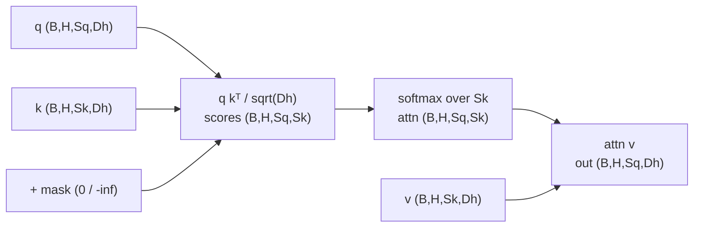
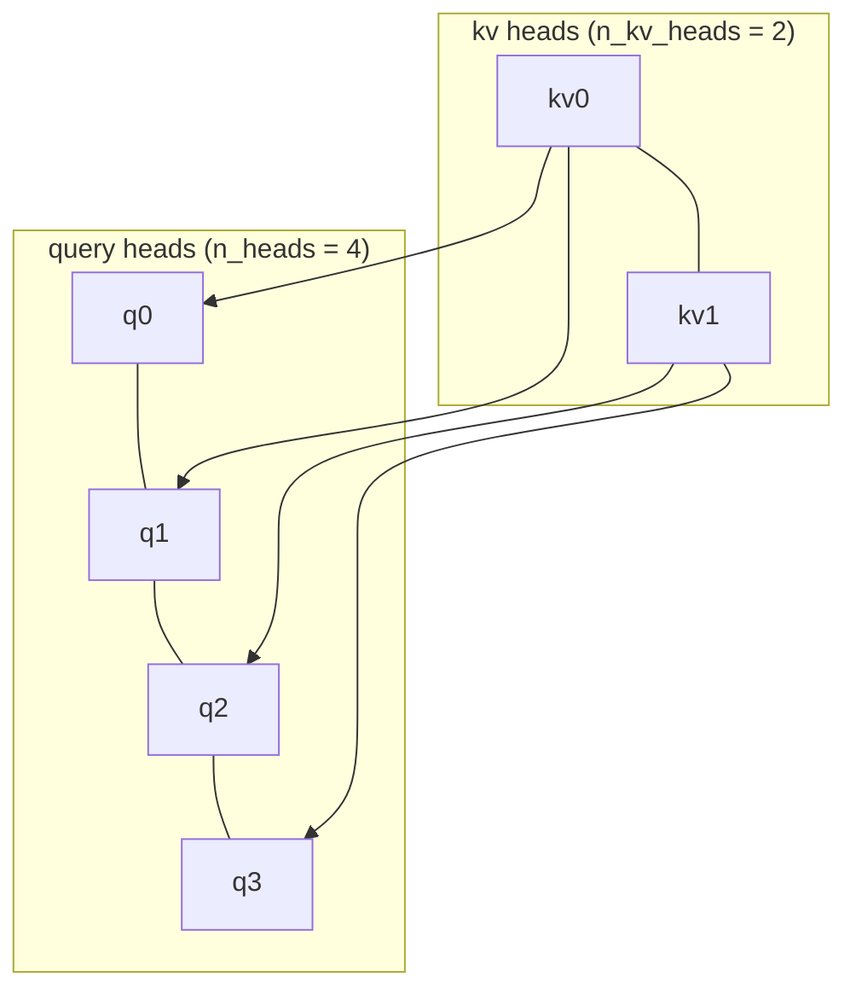
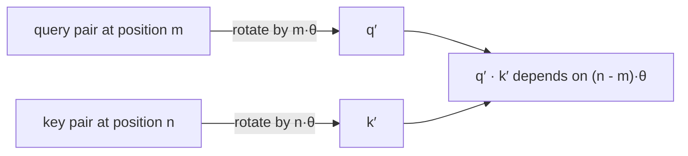
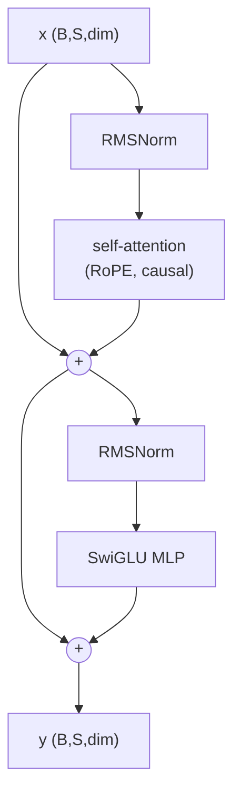

# A1 - The transformer, from scratch (LLaMA-style)

The transformer replaced recurrence with attention, a content-based gather over a set of tokens that
removes the sequential bottleneck of an RNN and puts any two tokens one hop apart. This assignment
covers scaled dot-product attention and the stable softmax, multi-head attention with self-,
cross-, and grouped-query variants, the causal mask, rotary position embedding (RoPE), RMSNorm and
the SwiGLU feed-forward, and the pre-norm residual block that stacks into an encoder or a decoder.

Build the 2026 LLaMA-style transformer stack from scratch and assemble it into a decoder-only
character language model. Implement the attention core, multi-head attention, the causal mask, RoPE,
the two LLaMA-style primitives, and the pre-norm block. The encoder and decoder stacks, the absolute
positional encodings kept for historical contrast, and the language-model assembly are provided.
Everything runs on CPU in seconds to a few minutes.

Required reading before starting:
- Vaswani et al. 2017, "Attention Is All You Need",
  [arXiv:1706.03762](https://arxiv.org/abs/1706.03762).
- Su et al. 2021, "RoFormer: Enhanced Transformer with Rotary Position Embedding",
  [arXiv:2104.09864](https://arxiv.org/abs/2104.09864).
- Touvron et al. 2023, "LLaMA: Open and Efficient Foundation Language Models",
  [arXiv:2302.13971](https://arxiv.org/abs/2302.13971).

## Lecture notes

### Tokens, embeddings, and the shape of the data

A sequence model works on tokens: discrete symbols drawn from a fixed finite vocabulary of size
$V$. Here a token is a single character and $V$ is the number of distinct characters in a small
corpus. Production language models use subword pieces with vocabularies in the tens of thousands,
and the vision transformer later in the course uses fixed-size image patches. The architecture does
not care which; a token is an integer index into a table.

That table is the first layer. An embedding is a learned matrix $E \in \mathbb{R}^{V \times d}$
with one row per vocabulary entry, and embedding a token means selecting its row. A batch of $B$
sequences of length $S$ therefore enters the stack as a tensor of shape $(B, S, d)$: one
$d$-dimensional vector per token. $d$ is the model dimension and its $d$ coordinates are the
channels. Every layer in this assignment maps $(B, S, d)$ to $(B, S, d)$, and that shape invariance
is why blocks can be stacked without any glue between them.

Two kinds of mixing are needed, and the architecture keeps them in separate sub-layers. Mixing
across positions, deciding what token 7 should take from token 2, is attention. Mixing across the
$d$ channels within a single token is the feed-forward network. Everything else in a block is
normalization and residual wiring around those two.

### Why attention replaced recurrence

Before 2017, sequence modeling meant recurrence. A recurrent network carries a hidden state, one
fixed-size vector summarizing everything read so far, and updates it a token at a time:
$h_t = \phi(W h_{t-1} + U x_t)$, with $\phi$ a squashing nonlinearity such as $\tanh$. The LSTM and
the GRU are the same idea plus gates, extra learned vectors with entries in $[0, 1]$ that multiply
the state elementwise and decide at each step how much to keep and how much to overwrite. That
design has two costs that came to dominate.

The computation is inherently sequential. To compute the state at position $t$ the state at $t-1$
must already exist, so a length-$S$ sequence takes $S$ sequential steps regardless of how many GPUs
are available, and the time axis cannot be parallelized.

Information from an early token reaches a late token only by passing through every intermediate
state, an $O(S)$ path. Differentiating the loss at step $S$ with respect to an input at step 1
chains one Jacobian of the update per step, so the gradient carries a product of $S$ matrix
factors. A product of $S$ factors of typical magnitude $\rho$ scales like $\rho^S$: it vanishes for
$\rho < 1$ and explodes for $\rho > 1$, and training does not arrange $\rho = 1$ on its own. Distant
tokens therefore contribute almost nothing to the gradient. The LSTM's gates slow that decay by
giving the state a near-identity route through a step when the gates stay open, and they helped,
but they did not remove the $S$-step bottleneck or shorten the path between distant tokens.

Attention entered as a patch on top of recurrence. In neural machine translation around 2014, an
encoder RNN compressed the whole source sentence into one fixed vector that the decoder had to
unpack, and long sentences overflowed that vector. Bahdanau et al. (2014,
[arXiv:1409.0473](https://arxiv.org/abs/1409.0473)) added a soft alignment: at each decoding step the
decoder computes a weighted average over all encoder states, with weights from a small learned
scoring network, so it can look directly at the relevant source words instead of relying on one
summary. This was attention as content-based lookup, and it worked, but it still sat on top of two
RNNs and kept their sequential bottleneck.

"Attention Is All You Need" (Vaswani et al. 2017) removed the recurrence entirely and kept only the
attention. With no hidden-state chain, every position is computed independently and in parallel, so
a sequence is one matrix multiply instead of $S$ sequential steps, which makes training at scale
practical on GPUs. Any two tokens are one attention hop apart regardless of their distance, a
constant path length, so long-range dependencies are modeled directly. The result was
state-of-the-art translation at a fraction of the training cost of the recurrent and convolutional
systems it beat.

That paper had two stacks, and the names stuck. An encoder reads the whole input at once, every
position attending to every other, and emits one vector per input position; that output is the
memory. A decoder produces its output left to right, each position attending only to positions
already produced and, in translation, also to the encoder memory. Scaled up and trained on raw
text, each half became a family on its own: BERT is an encoder-only stack trained to fill in
deleted tokens, GPT is a decoder-only stack trained to predict the next token, and the decoder-only
form became the backbone of the LLM era. The character language model assembled at the end of this
assignment is a small decoder-only stack.

### The softmax

Attention has to turn a vector of real-valued match scores into weights that are non-negative and
sum to one, so that the output is an average of values rather than an unbounded sum. The softmax is
the standard construction:

$$\operatorname{softmax}(z)_i = \frac{e^{z_i}}{\sum_j e^{z_j}}.$$

Exponentiating makes every entry positive and preserves the ordering of the scores; dividing by the
sum normalizes. Its inputs $z$ are called logits, meaning unnormalized log-probabilities. Adding
the same constant to every logit changes nothing,

$$\frac{e^{z_i - c}}{\sum_j e^{z_j - c}} = \frac{e^{-c}\,e^{z_i}}{e^{-c}\sum_j e^{z_j}}
= \operatorname{softmax}(z)_i,$$

so only differences between logits carry information.

That shift invariance is also the numerical fix. In float32, $e^z$ overflows to infinity somewhere
above $z \approx 88$, and nothing bounds an attention logit. Subtracting the per-row maximum before
exponentiating makes the largest exponent exactly $e^0 = 1$ and every other one smaller, so no term
can overflow, and by the identity above the distribution is unchanged.
Underflow of the very negative entries is harmless: those were going to be near-zero weights
anyway.

Scale matters in the other direction too. Multiplying all logits by a factor larger than one
sharpens the distribution toward one-hot; dividing flattens it toward uniform. The gradient follows
the same trend. The Jacobian of the softmax is $\operatorname{diag}(p) - p\,p^\top$, which goes to
zero entrywise as $p$ approaches a one-hot vector. A saturated softmax puts nearly all weight on one
entry and returns almost no gradient to the others, so the layer stops learning where to look.
Keeping the logits at a moderate scale therefore decides whether the layer learns where to look at
all, and the next section shows where that scale comes from.

### Scaled dot-product attention

Attention is a content-based gather over a set. A dictionary lookup compares a query against stored
keys, finds the one that matches exactly, and returns its value. Attention is the soft version:
every key is scored against the query, every value is returned, and each is weighted by how well
its key matched. Each query position emits a query vector, every position emits a key and a value,
and the output is the weighted sum of the values. For queries $Q \in \mathbb{R}^{S_q \times d_h}$,
keys $K \in \mathbb{R}^{S_k \times d_h}$, and values $V \in \mathbb{R}^{S_k \times d_h}$:

$$\operatorname{Attention}(Q, K, V) = \operatorname{softmax}\!\left(\frac{QK^\top}{\sqrt{d_h}} + M\right)V.$$

Each output row is a convex combination of the value rows, weighted by how well that query matches
each key.

The $1/\sqrt{d_h}$ comes from the variance of a dot product. Take the entries of a query and a key
to be independent, zero-mean, unit-variance, which is roughly true at initialization. Then
$q \cdot k = \sum_{i} q_i k_i$ is a sum of $d_h$ independent zero-mean terms of variance 1, so it
has variance $d_h$ and typical magnitude $\sqrt{d_h}$. For a head of width 64 the raw logits are
spread over roughly $\pm 8$ before training has done anything, and the spread grows as $\sqrt{d_h}$
with head width. Feeding that into a softmax gives the saturation from the previous section, and it
gets worse as the model gets wider. Dividing by $\sqrt{d_h}$ restores unit variance, so the initial
attention pattern is close to uniform no matter what $d_h$ is. Vaswani et al. give this argument in
a footnote.

$M$ is an optional additive mask, 0 to keep a position and $-\infty$ to forbid it, added before the
softmax so that $e^{-\infty} = 0$ gives a forbidden entry exactly zero weight and the remaining
entries renormalize among themselves. Adding before the softmax rather than zeroing after it is
what keeps the rows summing to one. The mask carries causality and padding.



Because attention operates on a set, it is permutation-equivariant. Permute the rows of $K$ and $V$
by any permutation and the scores permute with them; the softmax does not care how its entries are
ordered, and the weighted sum comes out identical. Permute the rows of $Q$ and the output rows
permute the same way. A shuffled sentence therefore produces the same set of outputs as the
original, which means raw attention has no notion of order at all. Order is reintroduced
separately, by positional encoding.

### Multi-head attention

A linear projection here is a learned matrix applied to every token vector independently; all four
projections in this stack are bias-free, following LLaMA. The input $X$ of shape $(S, d)$ is
projected three times, to $Q = XW_q$, $K = XW_k$, $V = XW_v$, and the attention output once more by
$W_o$.

One attention operation over all $d$ channels can only produce one weighting per query position.
Multi-head attention splits the $d$ channels into $h$ heads of width $d_h = d/h$, runs the whole
operation independently inside each head, concatenates the $h$ outputs back to width $d$, and
applies $W_o$. Each head owns its slice of $W_q$, $W_k$, $W_v$, so each compares queries and keys in
its own $d_h$-dimensional subspace and can key on a different relation: one head might match a verb
to a subject several words back while another attends only to the immediately preceding token. The
arithmetic cost is unchanged, since $h$ heads of width $d/h$ do the same number of multiplies as one
head of width $d$; the only thing that changes is the scaling factor, from $1/\sqrt{d}$ to
$1/\sqrt{d_h}$, because the dot products are now over $d_h$ channels.

Self-attention takes $K$ and $V$ from the same $X$ as $Q$, which is the `kv=None` path in the code.
Cross-attention takes them from a different tensor, the `kv` argument: a decoder's queries against
an encoder's memory. The two lengths need not match, so $Q$ has $S_q$ rows while $K$ and $V$ have
$S_k$, and the attention weight matrix is $(S_q, S_k)$. That is the path an image captioner uses to
look at visual features while emitting words, and the path BEVFormer later uses to pull image
features into bird's-eye-view queries.

### Autoregressive decoding and the key/value cache

At training time the whole target sequence is known, so a decoder runs once over all $S$ positions
in parallel. At generation time it is not. The model emits token $t$, appends it to its own input,
and runs again to emit token $t+1$; this is autoregressive decoding. Done naively, step $t$
recomputes the keys and values of all $t$ earlier positions even though none of them changed. The
standard fix is the key/value cache: store $K$ and $V$ for every position already processed, and at
each step compute only the new position's query, key, and value, append the new key and value to the
cache, and attend the single new query against the whole cache.

The cache is not small. It holds two tensors per layer per sequence in the batch, each with
$n_{kv}$ heads, $d_h$ channels, and one row per position produced so far:

$$\text{cache bytes} = 2 \times \text{layers} \times n_{kv} \times d_h \times S \times \text{batch}
\times \text{bytes per element}.$$

It grows linearly in sequence length and in batch size, and unlike the weights it cannot be shared
across concurrent requests. At long context it dominates inference memory, and since every generated
token has to read all of it, it also sets the memory bandwidth per step. Nothing in this assignment
implements a cache; it is the reason the next section exists.

### Grouped-query attention

The cache size is proportional to the number of key/value heads, and nothing forces that number to
equal the number of query heads. Grouped-query attention (Ainslie et al. 2023,
[arXiv:2305.13245](https://arxiv.org/abs/2305.13245)) projects $K$ and $V$ to $n_{kv} < h$ heads,
splits the $h$ query heads into $n_{kv}$ groups, and gives every query head in a group the same
key/value head. In the code this is one `repeat_interleave` along the head axis before the dot
product: `k` and `v` of shape $(B, n_{kv}, S, d_h)$ are expanded to $(B, h, S, d_h)$ by repeating
each head $h/n_{kv}$ times. With four query heads and two key/value heads, the four queries share
two key/value heads and the cache is half the size:



Setting $n_{kv} = h$ recovers ordinary multi-head attention. Setting $n_{kv} = 1$ is multi-query
attention, a single key/value head shared by every query head, which shrinks the cache by a factor
of $h$ but costs quality. Grouped-query attention sits between the two, and Ainslie et al. report
quality close to multi-head attention at a speed close to multi-query. The arithmetic cost of the
attention itself is unchanged, since the repeated heads still perform the full $h$-head dot product;
what shrinks is the cache and the size of $W_k$ and $W_v$.

### The causal mask

A decoder predicts each token from the tokens before it. During training the whole target sequence
is already available, and the efficient thing is to score all $S$ predictions in one forward pass
rather than one at a time. That is only valid if position $i$ cannot see positions after $i$;
otherwise the model can read the answer it is being asked to predict, reaching zero training loss
by copying and learning nothing. The causal mask is the additive mask $M$ that forbids this. As an
$(S, S)$ matrix it is zero on and below the diagonal and $-\infty$ strictly above it, so query $i$
may attend to key $j$ only when $j \le i$. For $S = 5$, with `.` a kept position and `x` a forbidden
one:

```text
          key j
        0  1  2  3  4
query 0 .  x  x  x  x
  i   1 .  .  x  x  x
      2 .  .  .  x  x
      3 .  .  .  .  x
      4 .  .  .  .  .
```

Keeping the strict upper triangle of an all-$-\infty$ matrix produces exactly the forbidden entries;
added to the scores, those positions get zero softmax weight, so position $i$ never sees the future.
Row 0 keeps only its own diagonal entry, which is why every row still has at least one live position
and the softmax never divides by zero. The same machinery covers padding: batching sequences of
unequal length pads the short ones, and $-\infty$ on the pad columns keeps them out of every
softmax.

### Absolute position encodings and their limits

Attention is permutation-equivariant, so position has to be injected somewhere. The 2017 paper
injected it at the input, adding a position vector to every token embedding before the first block.
Both of its variants are in `transformer.py` for the historical contrast.

The sinusoidal encoding is a fixed table, no parameters:

$$PE(\text{pos}, 2i) = \sin\!\left(\frac{\text{pos}}{10000^{2i/d}}\right), \qquad
PE(\text{pos}, 2i+1) = \cos\!\left(\frac{\text{pos}}{10000^{2i/d}}\right).$$

Each channel pair holds a sinusoid whose wavelength grows geometrically with the channel index, so
a position is written in something like a continuous binary code: the fast channels separate
neighbors, the slow channels separate far-apart regions of the sequence. The table extends to any
length because it is a formula.

The learned encoding is an embedding table with one row per position index up to a fixed maximum,
trained like any other parameter. GPT-2 used this. It is simpler, and it is undefined past its
maximum: a table built for 4096 positions has no row for position 4097, so the model cannot run on
a longer sequence at all.

Both encode absolute position, while what a sequence model mostly needs is relative. "Three tokens
back" is the same relation at position 10 and at position 10000, but an absolute code has to learn
it separately in every region of the table, and it has only ever seen positions up to the training
length.

### Rotary position embedding

RoPE (Su et al. 2021) injects position inside attention instead of at the input, and does it with
rotations. Anyone who has composed 2D rotations already has the whole mechanism.

Take one pair of channels of a query vector and read it as a point $a \in \mathbb{R}^2$. Rotate it
by an angle proportional to its position $m$:

$$R(\phi) = \begin{bmatrix}\cos\phi & -\sin\phi \\ \sin\phi & \cos\phi\end{bmatrix},
\qquad a' = R(m\theta)\,a.$$

Do the same to the corresponding pair $b$ of a key at position $n$, with the same rate $\theta$, so
$b' = R(n\theta)\,b$. Now take the dot product, using $R(\phi)^\top = R(-\phi)$ and
$R(\phi)R(\psi) = R(\phi + \psi)$:

$$a'^\top b' = \big(R(m\theta)\,a\big)^\top R(n\theta)\,b = a^\top R(-m\theta)R(n\theta)\,b
= a^\top R\big((n - m)\theta\big)\,b.$$

The absolute positions cancel. Writing it out with $\phi = (n - m)\theta$,

$$a'^\top b' = (a_0 b_0 + a_1 b_1)\cos\phi + (a_1 b_0 - a_0 b_1)\sin\phi,$$

a fixed function of the untouched query pair, the untouched key pair, and the offset $n - m$ alone.
Each vector is rotated using only its own absolute position, which costs one elementwise pass and
needs no $S \times S$ table, and yet every attention score depends only on relative position.
Rotations are also orthogonal, so $\lVert a' \rVert = \lVert a \rVert$: RoPE moves the direction of
a query or key and never its magnitude, which the norm assertion in `test_shapes.py` checks.

A head has $d_h$ channels, so it has $d_h/2$ pairs, and each pair gets its own rate. The head
dimension must be even for the channels to pair up, which `_RoPEAttention` asserts on
construction. The rates are spaced geometrically:

$$\theta_i = \text{base}^{-2i/d_h}, \qquad i = 0, 1, \dots, \tfrac{d_h}{2} - 1,$$

with base $10000$ by default. Pair 0 turns at one radian per position, a full turn every
$2\pi \approx 6.3$ positions. The character language model here uses $d_h = 16$, giving eight pairs
whose periods run from 6.3 positions up to about $2 \times 10^4$ positions, four orders of magnitude
apart. The fast pairs resolve which token is adjacent to which; the slow pairs barely move across a
short sequence and carry coarse, long-range offset. A head reads all of them at once, since its
score is the sum over pairs of the 2D expression above.

In code the rotation is not a matrix multiply. Both channels of a pair share an angle, so the whole
head rotates with two elementwise products:

$$q' = q \odot \cos + \operatorname{rotate-half}(q) \odot \sin,$$

where $\cos$ and $\sin$ are per-position, per-channel tables and rotate-half supplies the
off-diagonal part of the rotation. Numbering channels from 0, rotate-half sends
$[x_0, x_1, x_2, x_3, \dots]$ to $[-x_1, x_0, -x_3, x_2, \dots]$, so channel $2i$ of the result is
$x_{2i}\cos - x_{2i+1}\sin$ and channel $2i+1$ is $x_{2i+1}\cos + x_{2i}\sin$, which is exactly
$R(m\theta_i)$ applied to the pair. The angle tables come from the outer product of positions with
rates, $\text{angles}[m, i] = m\,\theta_i$, with every column duplicated so both channels of a pair
carry the same angle. That duplication is the `repeat_interleave(2)` in `_rope_freqs`, and it has to
agree with the pairing rotate-half uses.

Two conventions are in circulation and they must not be mixed. The one here is the paper's (Su et
al. 2021, eq. 34): pair channel $2i$ with channel $2i+1$, adjacent, and interleave the frequencies.
The provided `_rotate_half` implements this. Production implementations (Llama, GPT-NeoX,
HuggingFace) instead pair channel $i$ with channel $i + d_h/2$, splitting the head into two
contiguous halves and sending $(x_{\text{lo}}, x_{\text{hi}})$ to $(-x_{\text{hi}}, x_{\text{lo}})$,
and they build the angle table by concatenating the rates with themselves rather than interleaving
them. The two differ only by the permutation that sends channel $2i$ to $i$ and channel $2i+1$ to
$i + d_h/2$. Both rotate the same $d_h/2$ pairs by the same angles, so they produce identical
attention scores once the query and key projections are permuted to match, and since those
projections are learned, the two are the same model class. What breaks is mixing them: an
interleaved angle table with a half-split rotate-half rotates mismatched channels by mismatched
angles and silently destroys the relative-position property while leaving every shape correct. The
$\theta$ layout has to match whichever rotate-half is in use, and here that is the adjacent-pair
one.



Because nothing is stored per position, a longer sequence only means larger angles, and the score
still depends on the offset alone, so RoPE extends past the training length where a learned table
simply has no entry. Quality still degrades out there; the usual remedy shrinks the rates
$\theta_i$ so that a longer sequence spans the same range of angles the model was trained on.

### Normalization and RMSNorm

Deep stacks are unstable if the scale of the activations is left free. Each layer's output is the
next layer's input, so a systematic drift in magnitude compounds multiplicatively with depth, and
the gradient inherits the same product. Normalization removes that freedom by rescaling activations
to a fixed size at every layer.

Layer normalization (Ba et al. 2016, [arXiv:1607.06450](https://arxiv.org/abs/1607.06450)) does it
per token, over the $d$ channels of a single position, with no dependence on the batch or on
neighboring positions:

$$\mu = \frac{1}{d}\sum_i x_i, \qquad \sigma^2 = \frac{1}{d}\sum_i (x_i - \mu)^2, \qquad
y = \frac{x - \mu}{\sqrt{\sigma^2 + \varepsilon}}\,\gamma + \beta,$$

where $\gamma$ and $\beta$ are learned per-channel gain and bias, and $\varepsilon$ is a small
constant that keeps the division finite when a token's channels are all equal. Statistics taken per
token make it usable on sequences: a batch of one behaves like a batch of a thousand, and
variable-length inputs cause no coupling between positions.

RMSNorm (Zhang, Sennrich 2019, [arXiv:1910.07467](https://arxiv.org/abs/1910.07467)) keeps the
rescaling and drops the recentering:

$$\operatorname{rms}(x) = \sqrt{\tfrac{1}{d}\textstyle\sum_i x_i^2 + \varepsilon}, \qquad
y = \frac{x}{\operatorname{rms}(x)}\,\gamma.$$

No mean subtraction, no bias. The argument in the paper is that the rescaling does the stabilizing
work while the recentering contributes little, which they check by ablating one against the other;
dropping it removes a pass over the channels, a temporary buffer, and a parameter vector, at
comparable quality. The LLaMA stack normalizes with RMSNorm everywhere, and it is the `norm="rms"`
default here; `norm="layer"` selects layer normalization for the contrast.

### The feed-forward network, gating, and SwiGLU

Attention mixes across positions, but every output channel it produces is a linear combination of
value channels; its only nonlinearity is the softmax over positions. The per-token nonlinear work
happens in the feed-forward network, applied to each position independently and identically: project
up to a wider inner dimension, apply a pointwise nonlinearity, project back down. The 2017 block
used

$$\operatorname{MLP}(x) = \operatorname{act}(x\,W_{\text{up}})\,W_{\text{down}}$$

with inner width $4d$, and $\operatorname{act}$ = ReLU, later GELU. GELU (Hendrycks, Gimpel 2016,
[arXiv:1606.08415](https://arxiv.org/abs/1606.08415)) is $x\,\Phi(x)$, where $\Phi$ is the standard
normal cumulative distribution function; it is a smooth ReLU that lets small negative values through
instead of clipping them to exactly zero, so there is still a gradient there.

A gated linear unit (Dauphin et al. 2016,
[arXiv:1612.08083](https://arxiv.org/abs/1612.08083)) replaces the single up-projection with two.
One branch is squashed through an activation and multiplies the other elementwise:

$$\big(\operatorname{act}(x\,W_{\text{gate}}) \odot (x\,W_{\text{up}})\big)W_{\text{down}}.$$

The elementwise product does the work. Without it, each inner unit is a fixed function of one linear
feature. With it, one linear feature scales another, so the layer can express a multiplicative
interaction, letting a feature through only when some other feature is present, which a
single-branch MLP has to approximate with many units.

SwiGLU (Shazeer 2020, [arXiv:2002.05202](https://arxiv.org/abs/2002.05202)) is that construction
with the SiLU activation:

$$\operatorname{SwiGLU}(x) = \big(\operatorname{silu}(x\,W_{\text{gate}})\odot(x\,W_{\text{up}})\big)W_{\text{down}},
\qquad \operatorname{silu}(z) = z\,\sigma(z), \qquad \sigma(z) = \frac{1}{1 + e^{-z}}.$$

Here $\sigma$ is the logistic sigmoid, which maps the reals into $(0, 1)$, so silu passes $z$
through nearly unchanged when $z$ is large and suppresses it smoothly when $z$ is very negative. All
three linear layers are bias-free.

Gating adds a third matrix, so the inner width has to shrink to keep the parameter count fixed. A
GELU MLP with inner width $4d$ has $W_{\text{up}}$ of shape $d \times 4d$ and $W_{\text{down}}$ of
shape $4d \times d$, so $8d^2$ weights. A SwiGLU with inner width $H$ has three matrices of $dH$
weights each, so $3dH$; setting $3dH = 8d^2$ gives $H = \tfrac{8}{3}d$. That is the 8/3 rule, and
the code computes it as `hidden = int(2 * mlp_ratio * dim / 3)` with `mlp_ratio=4`, then rounds up
to a multiple of 8 so the matrix shapes stay friendly to vectorized kernels. Shazeer's comparison
holds the parameter count fixed exactly this way and finds the gated variants better on the
pretraining objective and on downstream tasks, while offering no mechanism for why.

### Residual connections and the pre-norm block

A residual connection adds a sub-layer's input to its output, $y = x + f(x)$, rather than replacing
it. Two things follow. The sub-layer only has to learn a correction to the identity instead of the
whole map, so a stack of blocks that each do nothing is still a working network. And the derivative
splits: $\partial y / \partial x = I + \partial f / \partial x$, so backpropagating through $L$
blocks expands into a sum of paths, one of which is the identity all the way down and carries
gradient from the loss to any depth without passing through a single weight matrix. That is the
direct fix for the vanishing product described for RNNs above.

The transformer block stacks two sub-layers, attention and the feed-forward, each wrapped in a
residual. Where the normalization sits relative to the addition is a real design choice. The 2017
original normalized after it (post-norm),

$$h = \operatorname{Norm}\big(x + \operatorname{Attn}(x)\big),$$

which puts a normalization directly on the identity path, so the clean route from the loss back to
the early layers no longer exists. Xiong et al. (2020,
[arXiv:2002.04745](https://arxiv.org/abs/2002.04745)) analyzed the gradient scale at initialization
and found that in a post-norm stack the gradient at the layers near the output is large and does not
shrink as depth $L$ grows, while in a pre-norm stack the same quantity is smaller by a factor on the
order of $1/\sqrt{L}$. A post-norm transformer therefore starts training with badly scaled gradients
that get worse the deeper it is, and the standard remedy is a learning-rate warmup: a schedule that
starts the learning rate near zero and ramps it up over the first few thousand steps, so the
earliest updates are too small to wreck the initialization while the gradient scales settle.

Pre-norm normalizes inside the residual branch instead:

$$h = x + \operatorname{Attn}(\operatorname{Norm}(x)), \qquad y = h + \operatorname{FFN}(\operatorname{Norm}(h)).$$

Each sub-layer normalizes its input, runs the mechanism, and adds the result back to the
un-normalized input. The addition is the last thing each sub-layer does, so an unnormalized identity
path runs straight down the stack, the norm only ever touches the branch, and deep stacks train
without warmup. That running sum down the stack is usually called the residual stream: every
sub-layer reads from it, computes, and adds its result back.



With cross-attention enabled, a third sub-layer attending to the encoder memory sits between the
self-attention and the feed-forward, each with its own pre-norm and residual.

### The LLaMA recipe

This assignment builds the 2026 LLaMA-style stack rather than the 2017 original, because the field
converged on a handful of refinements that each fix a concrete problem with the original: pre-norm
for stable training without warmup, RMSNorm for a cheaper norm, RoPE for relative position that
extends to longer contexts, SwiGLU for a stronger feed-forward at equal parameters, and
grouped-query attention for a smaller inference cache. The combination is the LLaMA recipe (Touvron
et al. 2023). The 2017 components (layer normalization, sinusoidal and learned absolute encodings,
the GELU MLP) stay in the code as selectable options for the historical contrast.

Shapes through the stack: tensors are $(\text{batch}, \text{seq}, \text{dim})$ at module boundaries,
$(\text{batch}, \text{heads}, \text{seq}, \text{head dim})$ inside attention, and the attention
weights are $(\text{batch}, \text{heads}, \text{seq}_q, \text{seq}_k)$.

### The character language model

The seven mechanisms assemble into the model in `charlm.py`, which is provided: an embedding table,
a stack of causal blocks with RoPE, RMSNorm, and SwiGLU, a final RMSNorm, and a linear map from $d$
channels to $V$ vocabulary logits. There is no positional-encoding module, because RoPE injects
position inside attention.

Training is next-character prediction. The target $y$ is the input $x$ shifted one position, so
position $i$ predicts the character at $i+1$ from everything up to $i$, and the causal mask makes it
legal to score all $S$ of those predictions from a single forward pass. The loss is
cross-entropy: softmax the $V$ logits at each position into a distribution $p$ and charge
$-\log p_y$, the negative log probability assigned to the correct character. It is zero when the
model is certain and right, and $\log V$ when it spreads its mass uniformly over the vocabulary. The
toy corpus here has 28 distinct characters, so an untrained model sits near $\log 28 \approx 3.3$
and a model that has memorized its batch approaches zero.

## The assignment

Fill these holes, in order. Each is one `NotImplementedError` with a matching test; the docstring in
each file gives the signature, shapes, and constraints.

1. [`scaled_dot_product_attention()`](attention.py) in `attention.py`
2. [`MultiHeadAttention.forward()`](attention.py) in `attention.py`
3. [`build_causal_mask()`](transformer.py) in `transformer.py`
4. [`apply_rope()`](transformer.py) in `transformer.py`
5. [`RMSNorm.forward()`](primitives.py) in `primitives.py`
6. [`SwiGLU.forward()`](primitives.py) in `primitives.py`
7. [`TransformerBlock.forward()`](transformer.py) in `transformer.py`

### Running and validating

Activate the environment (`conda activate nanovision`), then run from the repo root:

```
make test   A=a01_transformer   # run the tests against the top-level files (the ones with holes)
make verify A=a01_transformer   # run the same tests against the reference solution/
make viz    A=a01_transformer   # render the figures from the reference solution
```

`make test` is the command to run while working. It runs the suite in
`assignments/a01_transformer/tests/` against the top-level files and goes from red (the holes raise
`NotImplementedError`) to green as they are filled. `make verify` runs the identical suite against
the reference in `solution/`: it sets `NANOVISION_IMPL=solution`, so it imports the reference instead
of the top-level files and is green from the start, showing the target. The goal is to bring `make
test` to the same green as `make verify`. The reference is visible in `solution/attention.py`,
`solution/transformer.py`, and `solution/primitives.py`; read it if stuck.

The tests run in the order that doubles as the workflow:

- `tests/test_shapes.py` checks the output shapes for all seven holes, plus two properties that come
  for free from correct math: softmax rows sum to 1, and RoPE preserves the norm of each query and
  key vector.
- `tests/test_gradcheck.py` runs a float64 gradient check on attention, multi-head attention
  (including grouped-query), RMSNorm, and SwiGLU. A gradient check perturbs each input entry by a
  small step, measures how the output moves, and compares that finite difference against the
  gradient autograd reports. Double precision makes the comparison sharp enough to be
  conclusive; at float32 the finite-difference noise swamps the signal. It catches sign errors,
  reductions over the wrong axis, and broadcasting mistakes that leave every shape correct.
- `tests/test_attention_reference.py` builds keys that are one-hot vectors (all zeros except a
  single 1, so each key points along its own axis and the dot products separate cleanly), scaled up
  so the softmax is nearly hard, with a query equal to one of them; attention then has to return that
  key's value almost exactly. A second case makes every key identical, so the weights must come out
  uniform and the output must be the mean of the values.
- `tests/test_causal.py` checks that causal attention zeros the upper triangle and matches an
  explicit-mask reference.
- `tests/test_overfit.py` drives the assembled character language model to cross-entropy below 0.05
  in 500 steps on CPU. Memorizing one fixed batch says nothing about generalization and is a sharp
  test of wiring: any model of this size should reach near-zero loss on eight short sequences, so
  failing to means a mechanism is wrong, not that the model is too small.
- `tests/test_forbidden_imports.py` checks that the top-level files, the solution, and the shared-
  library shims use no `nn.MultiheadAttention`, `nn.Transformer*`, or
  `F.scaled_dot_product_attention` in actual code; the point is to build the mechanism, so mentions
  in comments and docstrings are allowed.

`make viz` renders from the reference solution and writes `out/causal_attention.png` (a causal
attention heatmap showing the lower-triangular weight pattern) and `out/charlm_loss.png` (the
overfit loss curve). It writes PNGs rather than opening windows: the plots use matplotlib's headless
Agg backend, so the command behaves the same over SSH, in WSL, and in CI with no display. `make
viz-mine A=a01_transformer` renders the same figures from the top-level code, for checking a finished
implementation; it needs the holes filled. Add `SHOW=1` to either to also open interactive windows
when a display is available.

What you should see when you run this. The overfit test uses dimension 64, 4 heads, depth 2, sequence
length 32, batch 8, Adam (the standard adaptive first-order optimizer, which keeps a running estimate
of the mean and variance of each parameter's gradient and scales the step by them) at learning rate
$3\times10^{-3}$, and 500 steps. The loss starts just above $\log 28 \approx 3.3$, the uniform-guess
value for a 28-character vocabulary, drops steeply, and flattens near zero at about 0.013,
comfortably under the 0.05 threshold. A flat curve usually means a wrong mechanism, most often the
causal mask or a misplaced residual, not a tuning problem. The gradient check runs at float64 with
the module in eval mode, and RoPE requires an even head dimension. These are toy artifacts on a tiny
model and a single batch; they confirm the mechanism runs end to end and say nothing about quality at
scale.

## Additional reference material

The block built here is imported by direct reference to `nanovision.attention` and
`nanovision.transformer` across most of the rest of the course. The vision transformer (A2) applies
this exact block to image patches instead of text tokens. CLIP (A4) uses it as the text tower. The
diffusion transformer (A7) stacks these blocks with conditioning on the diffusion timestep. The
vision-language model (A8) feeds visual tokens into a decoder-only stack like the language model
assembled here. BEVFormer (A11.5c) uses the cross-attention path to pull image features into
bird's-eye-view queries. The vision-language-action policy (A13) is again a transformer over
interleaved vision, language, and action tokens.

Full reference list:

- Bahdanau et al. 2014, "Neural Machine Translation by Jointly Learning to Align and Translate",
  [arXiv:1409.0473](https://arxiv.org/abs/1409.0473). Attention as soft alignment on top of an RNN
  encoder-decoder.
- Vaswani et al. 2017, "Attention Is All You Need",
  [arXiv:1706.03762](https://arxiv.org/abs/1706.03762). The original recurrence-free transformer.
- Ba et al. 2016, "Layer Normalization", [arXiv:1607.06450](https://arxiv.org/abs/1607.06450). The
  per-token normalization RMSNorm simplifies.
- Hendrycks, Gimpel 2016, "Gaussian Error Linear Units (GELUs)",
  [arXiv:1606.08415](https://arxiv.org/abs/1606.08415). The activation in the 2017-style MLP.
- Dauphin et al. 2016, "Language Modeling with Gated Convolutional Networks",
  [arXiv:1612.08083](https://arxiv.org/abs/1612.08083). The gated linear unit SwiGLU is built on.
- Su et al. 2021, "RoFormer", [arXiv:2104.09864](https://arxiv.org/abs/2104.09864). Rotary position
  embedding.
- Zhang, Sennrich 2019, "Root Mean Square Layer Normalization",
  [arXiv:1910.07467](https://arxiv.org/abs/1910.07467). RMSNorm.
- Shazeer 2020, "GLU Variants Improve Transformer",
  [arXiv:2002.05202](https://arxiv.org/abs/2002.05202). SwiGLU.
- Xiong et al. 2020, "On Layer Normalization in the Transformer Architecture",
  [arXiv:2002.04745](https://arxiv.org/abs/2002.04745). Pre-norm versus post-norm.
- Ainslie et al. 2023, "GQA: Training Generalized Multi-Query Transformer Models",
  [arXiv:2305.13245](https://arxiv.org/abs/2305.13245). Grouped-query attention.
- Touvron et al. 2023, "LLaMA", [arXiv:2302.13971](https://arxiv.org/abs/2302.13971). The stack this
  assignment builds.
