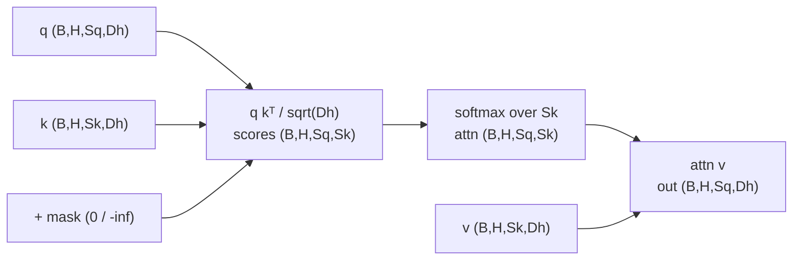
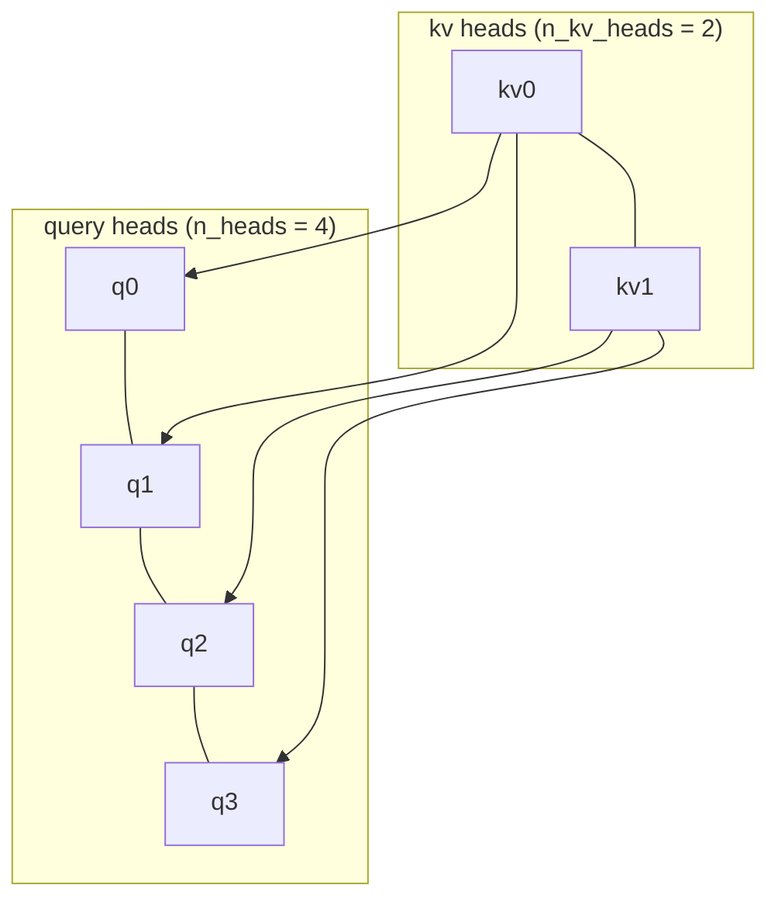
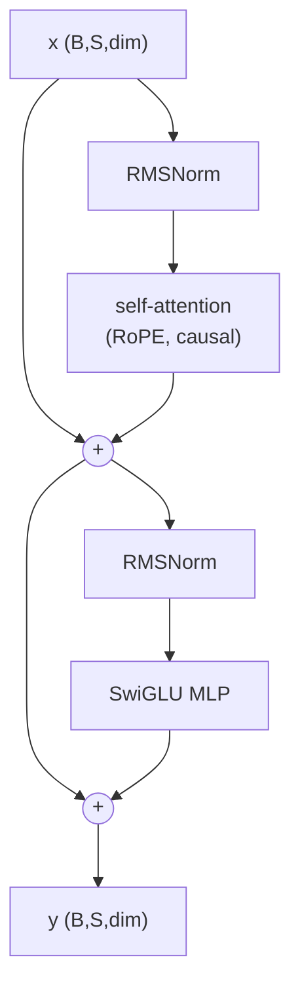

# A1 - The transformer, from scratch (LLaMA-style)

The transformer replaced recurrence with attention, a content-based gather over a set of tokens that
removes the sequential bottleneck of an RNN and puts any two tokens one hop apart. This assignment
covers scaled dot-product attention and the stable softmax, multi-head attention with self-,
cross-, and grouped-query variants, the causal mask, rotary position embedding (RoPE), RMSNorm and
the SwiGLU feed-forward, and the pre-norm residual block that stacks into an encoder or a decoder.

Build the 2026 LLaMA-style transformer stack from scratch and assemble it into a decoder-only
character language model. Implement the attention core, multi-head attention, the causal mask, RoPE,
the two LLaMA-style primitives, and the pre-norm block. The encoder and decoder stacks, the absolute
positional encodings kept for historical contrast, and the language-model assembly are provided.
Everything runs on CPU in seconds to a few minutes.

Required reading before starting:
- Vaswani et al. 2017, "Attention Is All You Need",
  [arXiv:1706.03762](https://arxiv.org/abs/1706.03762).
- Su et al. 2021, "RoFormer: Enhanced Transformer with Rotary Position Embedding",
  [arXiv:2104.09864](https://arxiv.org/abs/2104.09864).
- Touvron et al. 2023, "LLaMA: Open and Efficient Foundation Language Models",
  [arXiv:2302.13971](https://arxiv.org/abs/2302.13971).

## Lecture notes

### Why attention replaced recurrence

Before 2017, sequence modeling meant recurrence. A recurrent network, and its gated successors the
LSTM and GRU, read a sequence one token at a time and carried a hidden state forward. That design has
two costs that came to dominate. The computation is inherently sequential: to compute the state at
position $t$ the state at $t-1$ must already exist, so a length-$n$ sequence takes $n$ sequential
steps regardless of how many GPUs are available, and the time axis cannot be parallelized.
Information from an early token reaches a late token only by passing through every intermediate state,
an $O(n)$ path; each hop multiplies by a recurrent weight and squashes through a nonlinearity, so
gradients along that path shrink or blow up exponentially with distance and long-range dependencies
decay. The LSTM's gates were built specifically to slow that decay, and they helped, but they did not
remove the $n$-step bottleneck or the long path between distant tokens.

Attention entered as a patch on top of recurrence. In neural machine translation around 2014, an
encoder RNN compressed the whole source sentence into one fixed vector that the decoder had to
unpack, and long sentences overflowed that vector. Bahdanau et al. (2014,
[arXiv:1409.0473](https://arxiv.org/abs/1409.0473)) added a soft alignment: at each decoding step the
decoder computes a weighted average over all encoder states, with weights from a small learned
scoring network, so it can look directly at the relevant source words instead of relying on one
summary. This was attention as content-based lookup, and it worked, but it still sat on top of two
RNNs and kept their sequential bottleneck.

"Attention Is All You Need" (Vaswani et al. 2017) removed the recurrence entirely and kept only the
attention. With no hidden-state chain, every position is computed independently and in parallel, so a
sequence is one matrix multiply instead of $n$ sequential steps, which makes training at scale
practical on GPUs. Any two tokens are one attention hop apart regardless of their distance in the
sequence, a constant path length, so long-range dependencies are modeled directly. The result was
state-of-the-art translation at a fraction of the training cost of the recurrent and convolutional
systems it beat. Scaled up and trained on raw text, the same architecture became GPT and BERT, and
the decoder-only variant became the backbone of the LLM era.

### Scaled dot-product attention

Attention is a content-based gather over a set. Each query position emits a query vector, every
position emits a key and a value, the query is compared against all keys by dot product to produce a
weight per position, and the output is the weighted sum of the values. For queries
$Q \in \mathbb{R}^{n\times d}$, keys $K \in \mathbb{R}^{m\times d}$, and values
$V \in \mathbb{R}^{m\times d}$:

$$\operatorname{Attention}(Q, K, V) = \operatorname{softmax}\!\left(\frac{QK^\top}{\sqrt{d}} + M\right)V.$$

Each output row is a convex combination of the value rows, weighted by how well that query matches
each key. The $1/\sqrt{d}$ factor keeps the logits from growing with $d$ and saturating the softmax,
where a saturated softmax would put almost all weight on one position and kill the gradient to the
others. $M$ is an optional additive mask, 0 to keep a position and $-\infty$ to forbid it, added
before the softmax so a forbidden entry gets zero weight; it carries causality and padding.



The softmax has to be computed stably. Exponentiating a large logit overflows; subtracting the
per-row maximum before exponentiating shifts every logit to be at most zero, which changes nothing
about the result (the shift cancels in the normalization) but keeps the exponentials in range.

Because attention operates on a set, it is permutation-equivariant: shuffle the inputs and the
outputs shuffle the same way, so raw attention has no notion of order. Order is reintroduced
separately by positional encoding.

### Multi-head attention

Multi-head attention splits the model dimension into $h$ heads of size $d/h$, runs attention per head
on its own learned projection of the input, concatenates the per-head outputs, and applies an output
projection. Running several attention operations in parallel lets each head specialize in a different
relation (syntactic agreement, coreference, local n-grams) in its own subspace. Self-attention takes
keys and values from the same input as the queries; cross-attention takes them from a separate input,
the encoder memory.

Grouped-query attention (Ainslie et al. 2023,
[arXiv:2305.13245](https://arxiv.org/abs/2305.13245)) projects the keys and values to fewer heads
than the queries, one key/value head per group of query heads, and repeats each key/value head across
its group before attending. With four query heads and two key/value heads, the four queries share two
key/value heads:



When the number of key/value heads equals the number of query heads this is ordinary multi-head
attention; one shared key/value head is the multi-query limit. Fewer key/value heads means a smaller
key/value cache at inference, the running store of past keys and values that dominates memory during
long-context decoding.

### The causal mask

A decoder predicts each token from the tokens before it, so during training it must not attend to
positions ahead of the current one. The causal mask is the additive mask $M$ that forbids this. As an
$(S, S)$ matrix it is zero on and below the diagonal and $-\infty$ strictly above it, so query $i$
may attend to key $j$ only when $j \le i$. For $S = 5$, with `.` a kept position and `x` a forbidden
one:

```text
          key j
        0  1  2  3  4
query 0 .  x  x  x  x
  i   1 .  .  x  x  x
      2 .  .  .  x  x
      3 .  .  .  .  x
      4 .  .  .  .  .
```

Keeping the strict upper triangle of an all-$-\infty$ matrix produces exactly the forbidden entries;
added to the scores, those positions get zero softmax weight, so position $i$ never sees the future.

### Rotary position embedding

The 2017 transformer added position with a fixed sinusoidal table or a learned absolute one. RoPE
(Su et al. 2021) instead rotates pairs of query and key channels by an angle proportional to
position. Each pair of channels becomes a 2D vector, rotated by an angle $m\theta$ that grows with
the position $m$:

$$q' = q\odot\cos + \operatorname{rotate-half}(q)\odot\sin,$$

where rotate-half acts on adjacent channel pairs, following the paper's eq. 34: it sends
$[x_1, x_2, x_3, x_4, \dots]$ to $[-x_2, x_1, -x_4, x_3, \dots]$. The cosine and sine angles come
from an outer product of the positions with the inverse frequencies $\theta_i = \text{base}^{-i/\text{half}}$,
each repeated across its pair so both channels of a pair rotate by the same angle. The head
dimension must be even so the channels pair up.

Transcribe the paper directly: pair channel $2i$ with channel $2i+1$, which is the form the
provided `_rotate_half` helper implements. Many production implementations (Llama, GPT-NeoX,
HuggingFace) instead pair channel $i$ with channel $i+\text{half}$ and split rotate-half into two
contiguous halves $(x_1, x_2)\to(-x_2, x_1)$. The two are the same rotation up to a fixed
permutation of the channels, so both are correct, but the frequency layout has to match whichever
rotate-half you use. Match your $\theta$ layout to the adjacent-pair helper here.

The reason it works is the dot product. A query at position $m$ and a key at position $n$, each
rotated by their own position, have a dot product that depends only on the relative offset $m - n$.
Absolute-position rotation produces relative-position attention scores, which generalizes to longer
contexts better than a fixed-size learned table.


Different channel pairs use different $\theta$, so a head encodes a range of relative-offset
frequencies at once.

### RMSNorm

RMSNorm (Zhang, Sennrich 2019, [arXiv:1910.07467](https://arxiv.org/abs/1910.07467)) drops the mean
subtraction and the bias of layer normalization, rescaling only by the root-mean-square over the last
axis times a learned gain:

$$\operatorname{rms}(x) = \sqrt{\tfrac{1}{d}\textstyle\sum_i x_i^2 + \varepsilon}, \qquad
y = \frac{x}{\operatorname{rms}(x)}\,\gamma.$$

It is cheaper than layer norm and matches its quality. Dropping the mean subtraction rests on the
observation that the rescaling, not the recentering, is what stabilizes training, so the recentering
can go.

### SwiGLU

SwiGLU (Shazeer 2020, [arXiv:2002.05202](https://arxiv.org/abs/2002.05202)) replaces the GELU MLP
with a gated feed-forward. Two linear maps run in parallel on the input; one is passed through SiLU
and multiplies the other elementwise as a gate, and a third linear projects back down:

$$\operatorname{SwiGLU}(x) = \big(\operatorname{silu}(W_{\text{gate}}\,x)\odot(W_{\text{up}}\,x)\big)W_{\text{down}},
\qquad \operatorname{silu}(z) = z\,\sigma(z).$$

The three linear layers are bias-free. The inner width is set to about $8/3$ of the model dimension,
rounded to a multiple of 8, so the parameter count matches a $4\times$ GELU MLP; the gating splits
the usual single up-projection into two, and the $8/3$ factor keeps the total the same. SwiGLU beats
the plain MLP at equal parameter count.

### The pre-norm block

The transformer block stacks two sub-layers, attention and the feed-forward, each wrapped in a
residual connection. The 2017 original normalized after each sub-layer (post-norm), which needed a
learning-rate warmup to train stably. The modern block normalizes inside the residual branch instead
(pre-norm, Xiong et al. 2020, [arXiv:2002.04745](https://arxiv.org/abs/2002.04745)):

$$h = x + \operatorname{Attn}(\operatorname{Norm}(x)), \qquad y = h + \operatorname{FFN}(\operatorname{Norm}(h)).$$

Each sub-layer normalizes its input, runs the mechanism, and adds the result back to the
un-normalized input, so a clean identity path runs straight down the residual stream and the norm only
ever touches the branch. That identity path is what makes deep stacks train without warmup.



With cross-attention enabled, a third sub-layer attending to the encoder memory sits between the
self-attention and the feed-forward, each with its own pre-norm and residual.

### The LLaMA recipe

This assignment builds the 2026 LLaMA-style stack rather than the 2017 original, because the field
converged on a handful of refinements that each fix a concrete problem with the original: pre-norm
for stable training without warmup, RMSNorm for a cheaper norm, RoPE for relative position that
extrapolates to longer contexts, SwiGLU for a stronger feed-forward at equal parameters, and
grouped-query attention for a smaller inference cache. The combination is the LLaMA recipe (Touvron
et al. 2023). The 2017 components (layer norm, sinusoidal and learned absolute encodings, the GELU
MLP) stay in the code as selectable options for the historical contrast.

Shapes through the stack: tensors are $(\text{batch}, \text{seq}, \text{dim})$ at module boundaries,
$(\text{batch}, \text{heads}, \text{seq}, \text{head dim})$ inside attention, and the attention
weights are $(\text{batch}, \text{heads}, \text{seq}_q, \text{seq}_k)$.

## The assignment

Fill these holes, in order. Each is one `NotImplementedError` with a matching test; the docstring in
each file gives the signature, shapes, and constraints.

1. [`scaled_dot_product_attention()`](attention.py) in `attention.py`
2. [`MultiHeadAttention.forward()`](attention.py) in `attention.py`
3. [`build_causal_mask()`](transformer.py) in `transformer.py`
4. [`apply_rope()`](transformer.py) in `transformer.py`
5. [`RMSNorm.forward()`](primitives.py) in `primitives.py`
6. [`SwiGLU.forward()`](primitives.py) in `primitives.py`
7. [`TransformerBlock.forward()`](transformer.py) in `transformer.py`

### Running and validating

Activate the environment (`conda activate nanovision`), then run from the repo root:

```
make test   A=a01_transformer   # run the tests against the top-level files (the ones with holes)
make verify A=a01_transformer   # run the same tests against the reference solution/
make viz    A=a01_transformer   # render the figures from the reference solution
```

`make test` is the command to run while working. It runs the suite in
`assignments/a01_transformer/tests/` against the top-level files and goes from red (the holes raise
`NotImplementedError`) to green as they are filled. `make verify` runs the identical suite against
the reference in `solution/`: it sets `NANOVISION_IMPL=solution`, so it imports the reference instead
of the top-level files and is green from the start, showing the target. The goal is to bring `make
test` to the same green as `make verify`. The reference is visible in `solution/attention.py`,
`solution/transformer.py`, and `solution/primitives.py`; read it if stuck.

The tests run in the order that doubles as the workflow:

- `tests/test_shapes.py` checks the output shapes for all seven holes.
- `tests/test_gradcheck.py` runs the float64 gradient check on attention, multi-head attention
  (including grouped-query), RMSNorm, and SwiGLU.
- `tests/test_attention_reference.py` uses one-hot keys so attention selects a single value, and
  checks the output against the exact expected value.
- `tests/test_causal.py` checks that causal attention zeros the upper triangle and matches an
  explicit-mask reference.
- `tests/test_overfit.py` drives the assembled character language model to cross-entropy below 0.05
  in 500 steps on CPU.
- `tests/test_forbidden_imports.py` checks that the top-level files, the solution, and the shared-
  library shims use no `nn.MultiheadAttention`, `nn.Transformer*`, or
  `F.scaled_dot_product_attention` in actual code; the point is to build the mechanism, so mentions
  in comments and docstrings are allowed.

`make viz` renders from the reference solution and writes `out/causal_attention.png` (a causal
attention heatmap showing the lower-triangular weight pattern) and `out/charlm_loss.png` (the
overfit loss curve). It writes PNGs rather than opening windows: the plots use matplotlib's headless
Agg backend, so the command behaves the same over SSH, in WSL, and in CI with no display. `make
viz-mine A=a01_transformer` renders the same figures from the top-level code, for checking a finished
implementation; it needs the holes filled. Add `SHOW=1` to either to also open interactive windows
when a display is available.

What you should see when you run this. The overfit test uses dimension 64, 4 heads, depth 2, sequence
length 32, batch 8, Adam at learning rate $3\times10^{-3}$, 500 steps, and reaches cross-entropy
about 0.013, comfortably under the 0.05 threshold, so the loss curve drops steeply and flattens near
zero. A flat curve usually means a wrong mechanism, most often the causal mask or a misplaced
residual, not a tuning problem. The gradient check runs at float64 with dropout off, and RoPE
requires an even head dimension. These are toy artifacts on a tiny model and a single batch; they
confirm the mechanism runs end to end and say nothing about quality at scale.

## Additional reference material

The block built here is imported by direct reference to `nanovision.attention` and
`nanovision.transformer` across most of the rest of the course. The vision transformer (A2) applies
this exact block to image patches instead of text tokens. CLIP (A4) uses it as the text tower. The
diffusion transformer (A7) stacks these blocks with conditioning on the diffusion timestep. The
vision-language model (A8) feeds visual tokens into a decoder-only stack like the language model
assembled here. BEVFormer (A11.5c) uses the cross-attention path to pull image features into
bird's-eye-view queries. The vision-language-action policy (A13) is again a transformer over
interleaved vision, language, and action tokens.

Full reference list:

- Bahdanau et al. 2014, "Neural Machine Translation by Jointly Learning to Align and Translate",
  [arXiv:1409.0473](https://arxiv.org/abs/1409.0473). Attention as soft alignment on top of an RNN
  encoder-decoder.
- Vaswani et al. 2017, "Attention Is All You Need",
  [arXiv:1706.03762](https://arxiv.org/abs/1706.03762). The original recurrence-free transformer.
- Su et al. 2021, "RoFormer", [arXiv:2104.09864](https://arxiv.org/abs/2104.09864). Rotary position
  embedding.
- Zhang, Sennrich 2019, "Root Mean Square Layer Normalization",
  [arXiv:1910.07467](https://arxiv.org/abs/1910.07467). RMSNorm.
- Shazeer 2020, "GLU Variants Improve Transformer",
  [arXiv:2002.05202](https://arxiv.org/abs/2002.05202). SwiGLU.
- Xiong et al. 2020, "On Layer Normalization in the Transformer Architecture",
  [arXiv:2002.04745](https://arxiv.org/abs/2002.04745). Pre-norm versus post-norm.
- Ainslie et al. 2023, "GQA: Training Generalized Multi-Query Transformer Models",
  [arXiv:2305.13245](https://arxiv.org/abs/2305.13245). Grouped-query attention.
- Touvron et al. 2023, "LLaMA", [arXiv:2302.13971](https://arxiv.org/abs/2302.13971). The stack this
  assignment builds.
