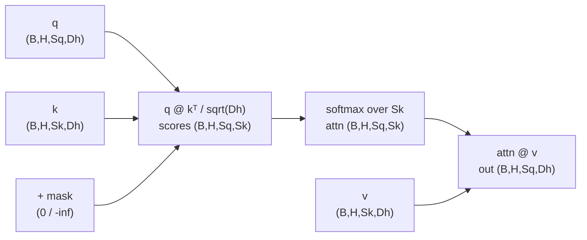
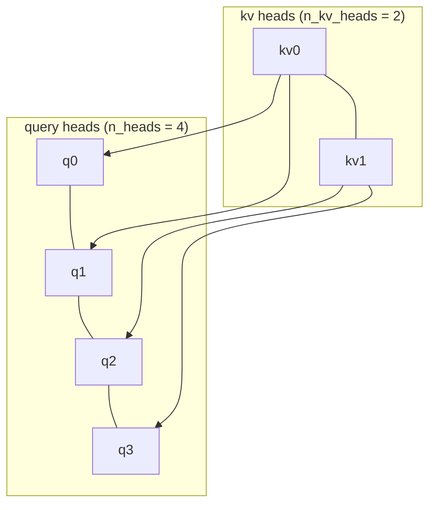
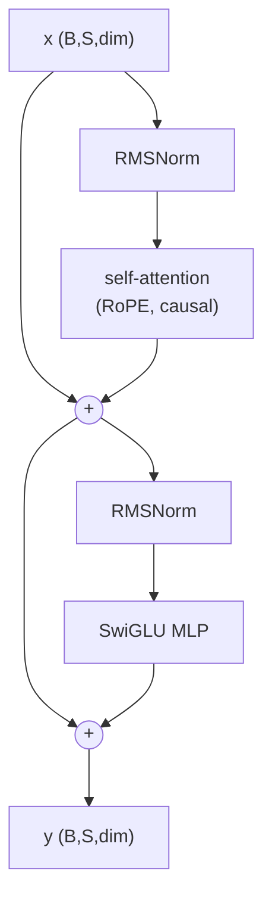
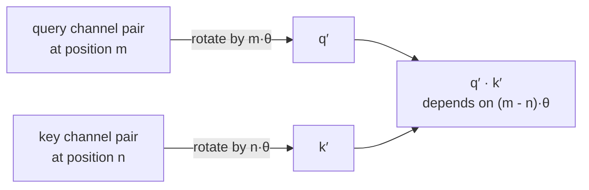

# A1 - The transformer, from scratch (LLaMA-style)

## Motivation

Before 2017, sequence modeling meant recurrence. An RNN, and its gated successors
the LSTM and GRU, read a sequence one token at a time and carried a hidden state
forward. That design has two costs that came to dominate everything. First, the
computation is inherently sequential: to compute the state at position t you must
already have the state at t-1, so you cannot parallelize over the time axis, and a
length-n sequence takes n sequential steps regardless of how many GPUs you have.
Second, information from an early token reaches a late token only by passing
through every intermediate state, an O(n) path. Each hop multiplies by a recurrent
weight and squashes through a nonlinearity, so gradients along that path shrink (or
blow up) exponentially with distance. Long-range dependencies decay. The LSTM gate
machinery was built specifically to slow that decay, and it helped, but it did not
remove the fundamental n-step sequential bottleneck or the long path between
distant tokens.

Attention entered as a patch on top of recurrence, not as a replacement. In
neural machine translation circa 2014, an encoder RNN compressed the whole source
sentence into one fixed vector that the decoder RNN had to unpack; long sentences
overflowed that single vector. Bahdanau et al. (2014,
[arxiv.org/abs/1409.0473](https://arxiv.org/abs/1409.0473)) added a soft alignment:
at each decoding step the decoder computes a weighted average over all encoder
states, with weights produced by a small learned scoring network, so it can look
directly at the relevant source words instead of relying on one summary vector.
This was "attention" as a content-based lookup, and it clearly worked, but it still
sat on top of two RNNs that retained the sequential bottleneck.

"Attention Is All You Need" (Vaswani et al., 2017,
[arxiv.org/abs/1706.03762](https://arxiv.org/abs/1706.03762)) took the obvious next
step that nobody had committed to: throw out the recurrence entirely and keep only
the attention. Removing recurrence bought two things. With no hidden-state chain, every position is
computed independently and in parallel, so a sequence is one big matrix multiply
instead of n sequential steps, which makes training at scale practical on
GPUs. And any two tokens are now one attention hop apart regardless of how far
apart they sit in the sequence, a constant path length, so long-range dependencies
are modeled directly rather than surviving a long gauntlet of recurrent steps. The
result was state-of-the-art BLEU on WMT English-German and
English-French translation at a fraction of the training cost of the recurrent and
convolutional systems it beat. Within a few years the same architecture, scaled up
and trained on raw text, became GPT and BERT, and the decoder-only variant became
the backbone of the entire LLM era.

Attention is a content-based gather over a set. Each
query position emits a query vector, every position emits a key and a value, the
query is compared against all keys by dot product to produce a weight per position,
and the output is the weighted sum of the values. Because it operates on a set,
attention is permutation-equivariant (shuffle the inputs and the outputs shuffle
the same way), so raw attention has no notion of order. Order is
reintroduced separately by positional encoding. Running several attention
operations in parallel on different learned projections of the input gives
multi-head attention, where each head can specialize in a different relation
(syntactic agreement, coreference, local n-grams) in its own subspace.

This assignment builds the 2026 LLaMA-style stack rather than the 2017 original,
because the field converged on a handful of refinements that are now standard, and
each one fixes a concrete problem with the original. Pre-norm (Xiong et al., 2020,
[arxiv.org/abs/2002.04745](https://arxiv.org/abs/2002.04745)) puts the
normalization inside the residual branch instead of after it, which keeps a clean
identity path through the network and makes training stable without the learning-
rate warmup the 2017 post-norm design needed. RMSNorm (Zhang & Sennrich, 2019,
[arxiv.org/abs/1910.07467](https://arxiv.org/abs/1910.07467)) drops the mean
subtraction and bias of LayerNorm, rescaling only by the root-mean-square; it is
cheaper and matches LayerNorm quality. RoPE (Su et al., 2021,
[arxiv.org/abs/2104.09864](https://arxiv.org/abs/2104.09864)) encodes position by
rotating query and key channels by an angle proportional to position, so the
attention score depends only on the relative offset between two tokens; this
generalizes to longer contexts better than the learned absolute position table of
the original. SwiGLU (Shazeer, 2020,
[arxiv.org/abs/2002.05202](https://arxiv.org/abs/2002.05202)) replaces the GELU MLP
with a gated SiLU feed-forward that beats the plain MLP at equal parameter count.
Grouped-query attention (Ainslie et al., 2023,
[arxiv.org/abs/2305.13245](https://arxiv.org/abs/2305.13245)) lets several query
heads share one key/value head, which shrinks the KV-cache that dominates memory at
inference time; one shared KV head is the multi-query limit. The combination of
these in one model is the LLaMA recipe (Touvron et al., 2023,
[arxiv.org/abs/2302.13971](https://arxiv.org/abs/2302.13971)), which is why we call
it LLaMA-style. The 2017 components (LayerNorm, sinusoidal/learned absolute
encodings, GELU MLP) stay in the code as selectable options so you can run the
historical contrast.

The block you write here is reused by direct import of `nanovision.attention` and
`nanovision.transformer` across most of the rest of the course. A2 (ViT) applies
this exact transformer block to image patches instead of text tokens. A4 (CLIP)
uses it as the text tower. A7's DiT denoiser is a stack of these blocks with adaLN
conditioning on the diffusion timestep. A8 (VLM) feeds visual tokens into a
decoder-only stack just like the char-LM you assemble here. A11.5c (BEVFormer)
relies on the cross-attention path to pull image features into BEV queries. A13
(the VLA policy capstone) is again a transformer over interleaved vision, language,
and action tokens. Get the shapes and the gradient flow right once, here, on a
problem small enough to verify exactly, and the rest of the course imports it.

## Background

Scaled dot-product attention for queries Q in R^{n x d}, keys K in R^{m x d},
values V in R^{m x d}:

    Attention(Q, K, V) = softmax(Q K^T / sqrt(d) + M) V

The 1/sqrt(d) scale keeps the logits from growing with d and saturating the
softmax. M is an optional additive mask, 0 to keep a position and -inf to forbid
it, used for causality and padding. Compute the softmax stably by subtracting the
per-row max before exponentiating.

The data flow, with shapes for one head (q is (B,H,Sq,Dh), k and v are
(B,H,Sk,Dh)):



Each output row is a convex combination of the value rows, with weights set by how
well that query matches each key. The mask is added to the scores before the
softmax, so a -inf entry sends its weight to zero.

Multi-head attention splits the model dim into h heads of size d/h, runs attention
per head, concatenates, and applies an output projection. Self-attention takes K
and V from the same input as Q; cross-attention takes K and V from a separate
input (the encoder memory). Grouped-query attention projects K and V to fewer heads
than Q (one KV head per group) and repeats each KV head across its query group
before attending; n_kv_heads == 1 is multi-query.

GQA with n_heads=4 and n_kv_heads=2 groups the four query heads onto two shared
key/value heads. Each KV head is repeated (repeat_interleave) to cover its two
query heads before the dot product:



n_kv_heads == n_heads is ordinary multi-head (one KV head per query head);
n_kv_heads == 1 shares a single KV head across all query heads (multi-query). Fewer
KV heads means a smaller KV-cache at inference, which is the memory that dominates
long-context decoding.

The block is pre-norm:

    h = x + Attn(Norm(x))
    y = h + FFN(Norm(h))

Each sub-layer normalizes its input, runs the mechanism, and adds the result back
to the un-normalized input, so an identity path runs straight down the residual
stream and the norm only ever touches the branch:



With cross-attention enabled, a cross-attention sub-layer (attending to kv) sits
between the self-attention and FFN sub-layers, each with its own pre-norm and
residual.

RMSNorm rescales by the root-mean-square over the last axis with a learned gain and
no mean subtraction or bias:

    rms(x) = sqrt(mean(x^2, last) + eps);   y = x / rms(x) * weight

The causal mask is the additive mask M for a decoder: query i may attend to key j
only when j <= i. As an (S,S) matrix for S=5, with `.` a kept position (0) and `x`
a forbidden one (-inf), it is lower-triangular including the diagonal:

```text
          key j
        0  1  2  3  4
query 0 .  x  x  x  x
  i   1 .  .  x  x  x
      2 .  .  .  x  x
      3 .  .  .  .  x
      4 .  .  .  .  .
```

`torch.triu(full(-inf), diagonal=1)` produces exactly the `x` entries (strictly
above the diagonal); added to the scores, those positions get zero softmax weight,
so position i never sees the future.

RoPE rotates pairs of channels of Q and K by an angle proportional to position, so
the dot product of a rotated query and key depends only on their relative offset:

    q' = q * cos + rotate_half(q) * sin

where rotate_half splits the last dim in two halves (x1, x2) and returns (-x2, x1),
and the cos/sin angles come from inv_freq = base^(-arange(half)/half) outer-product
position. head_dim must be even.

RoPE turns each pair of channels into a 2D vector and rotates it by an angle
mθ that grows with the position m. A query at position m and a key at position n,
each rotated by their own position, have a dot product that depends only on m - n,
which is how absolute-position rotation encodes relative position:



Different channel pairs use different θ (from inv_freq), so the head encodes a range
of relative-offset frequencies at once.

SwiGLU is a gated SiLU feed-forward:

    SwiGLU(x) = (silu(W_gate x) * (W_up x)) W_down,   silu(z) = z * sigmoid(z)

The three linear layers are bias-free. The inner width is set to about 8/3 of dim
(then rounded to a multiple of 8) so the parameter count matches a 4x GELU MLP.

Shapes: tensors are (batch, seq, dim) at module boundaries, (batch, heads, seq,
head_dim) inside attention, and attention weights are (batch, heads, seq_q, seq_k).

## What you'll implement

Seven holes:

- `scaled_dot_product_attention` and `MultiHeadAttention.forward` in
  `attention.py`.
- `build_causal_mask`, `apply_rope`, and `TransformerBlock.forward` in
  `transformer.py`.
- `RMSNorm.forward` and `SwiGLU.forward` in `primitives.py`.

The encoder/decoder stacks, the RoPE attention wrapper, the sinusoidal and learned
absolute positional encodings, and the char-LM assembly are provided. You write
only the seven mechanism bodies.

## Tasks

Each task maps 1:1 to a `raise NotImplementedError(...)` in the top-level module files and 1:1 to a
test.

1. `scaled_dot_product_attention` (`attention.py`): given q,k,v of shape
   (B,H,Sq,Dh)/(B,H,Sk,Dh) and an optional additive mask, return (out, attn) with
   out (B,H,Sq,Dh) and attn (B,H,Sq,Sk). Subtract the row max before exp. The core
   gather and the stable softmax.
2. `MultiHeadAttention.forward` (`attention.py`): project x (and kv if
   cross-attention) to Q,K,V; split heads; repeat_interleave KV heads for GQA; call
   Task 1; merge heads; output projection. Self-vs-cross is just where K,V come
   from; GQA shares KV across query groups.
3. `build_causal_mask` (`transformer.py`): additive (S,S) mask, -inf above
   the diagonal (use torch.triu(..., diagonal=1)). Why a decoder cannot see the
   future.
4. `apply_rope` (`transformer.py`): rotate q,k by position. Relative
   position as rotation; the modern positional scheme.
5. `RMSNorm.forward` (`primitives.py`): rescale by RMS times a learned
   gain. The LLaMA-style norm and why mean subtraction is dropped.
6. `SwiGLU.forward` (`primitives.py`): gated SiLU feed-forward. The gated
   FFN used across the modern stack.
7. `TransformerBlock.forward` (`transformer.py`): the two (or three, with
   cross-attention) pre-norm residual sub-layers. Residual + norm placement; the
   block is the unit reused everywhere.

## How to verify

From the repo root with the `nanovision` env active:

    make test A=a01_transformer     # your top-level code (red until you fill the holes)

The tests run in this order, which is also the intended workflow:

1. `tests/test_shapes.py` - output shapes for Tasks 1-7 (shape).
2. `tests/test_gradcheck.py` - float64 `check_gradients` on SDPA, MHA (including
   GQA), RMSNorm, SwiGLU (gradcheck).
3. `tests/test_attention_reference.py` - one-hot keys so attention selects a single
   value; exact expected output (reference-value).
4. `tests/test_causal.py` - causal attention zeroes the upper triangle and matches
   an explicit-mask reference (reference-value).
5. `tests/test_overfit.py` - the assembled char-LM overfits one batch to
   cross-entropy < 0.05 in 500 steps on CPU (overfit-one-batch).
6. `tests/test_forbidden_imports.py` - the top-level files, the solution, and the
   `nanovision/` shims use no `nn.MultiheadAttention` / `nn.Transformer*` /
   `F.scaled_dot_product_attention` in actual code (mentions in comments and
   docstrings are allowed).

To confirm the reference passes and render the figures:

    make verify A=a01_transformer   # reference solution (should be green)
    make viz    A=a01_transformer   # writes out/causal_attention.png, out/charlm_loss.png

The reference implementation is visible in `solution/attention.py`,
`solution/transformer.py`, and `solution/primitives.py`; read it if you get
stuck.

## Compute notes

CPU only, seconds to a few minutes; no GPU needed. The overfit test uses dim 64, 4
heads, depth 2, seq 32, batch 8, Adam lr 3e-3, 500 steps, and reaches cross-entropy
about 0.013, comfortably under the 0.05 threshold. A flat loss curve usually means
a wrong mechanism (most often the causal mask or a misplaced residual), not a
tuning problem. gradcheck runs at float64 with dropout off; RoPE requires an even
head_dim.

## Stretch goals

1. KV-cache for autoregressive generation; measure the speedup.
2. Pre-norm vs post-norm: train both and plot the stability difference.
3. Swap RoPE for sinusoidal on the copy/sort task and compare.
4. Multi-query vs grouped-query vs full multi-head: parameter count and quality.

## Further reading

- Bahdanau et al., "Neural Machine Translation by Jointly Learning to Align and
  Translate" (2014, [arxiv.org/abs/1409.0473](https://arxiv.org/abs/1409.0473)) -
  attention as soft alignment on top of an RNN encoder-decoder.
- Vaswani et al., "Attention Is All You Need" (2017,
  [arxiv.org/abs/1706.03762](https://arxiv.org/abs/1706.03762)) - the original
  recurrence-free transformer.
- Su et al., "RoFormer" (2021,
  [arxiv.org/abs/2104.09864](https://arxiv.org/abs/2104.09864)) - rotary position
  embedding.
- Zhang & Sennrich, "Root Mean Square Layer Normalization" (2019,
  [arxiv.org/abs/1910.07467](https://arxiv.org/abs/1910.07467)) - RMSNorm.
- Shazeer, "GLU Variants Improve Transformer" (2020,
  [arxiv.org/abs/2002.05202](https://arxiv.org/abs/2002.05202)) - SwiGLU.
- Ainslie et al., "GQA" (2023,
  [arxiv.org/abs/2305.13245](https://arxiv.org/abs/2305.13245)) - grouped-query
  attention.
- Touvron et al., "LLaMA" (2023,
  [arxiv.org/abs/2302.13971](https://arxiv.org/abs/2302.13971)) - the stack this
  assignment builds.
