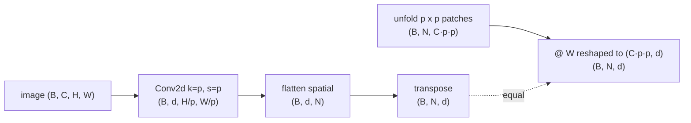
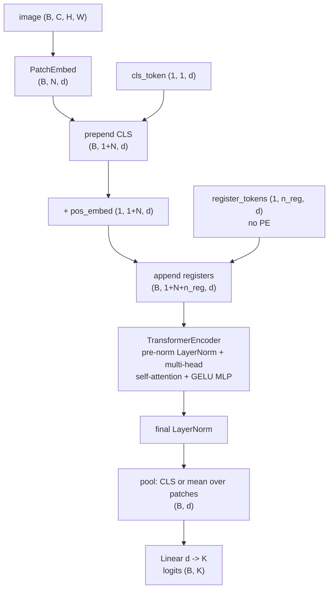
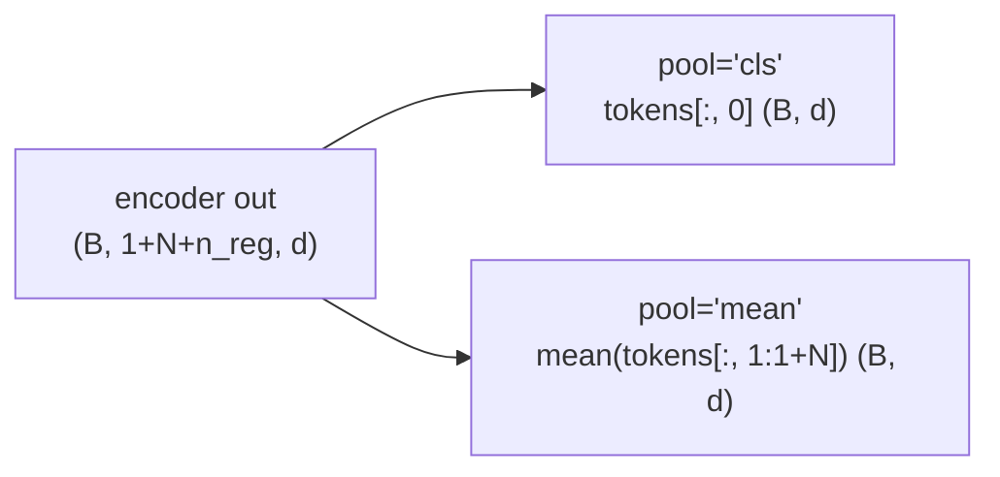

# A2 - Vision transformers, from scratch

The vision transformer applies the transformer encoder to images by cutting each image into a grid of
patches, projecting every patch to a token, and running the same encoder used for text. It drops the
locality and translation-equivariance priors of a convolutional network and learns every spatial
relationship from data. These notes cover what those two priors buy and what giving them up costs,
patch embedding as a strided convolution, the class token and the choice between class-token and mean
pooling, the learned absolute positional embedding and how to interpolate it to a new resolution,
register tokens, and the ConvNeXt block as the convolutional counterpoint.

Build a vision transformer from scratch and overfit it on a small batch of synthetic images.
Implement the patch tokenizer, the token-sequence assembly (class token, positional embedding,
register tokens), the pooling head, the positional-embedding interpolation, and the ConvNeXt block.
The transformer encoder is the pre-norm encoder built earlier in the course, instantiated in the
classic ViT configuration: LayerNorm instead of RMSNorm, a GELU MLP instead of SwiGLU, no causal
mask, and no rotary position, since position arrives here as an absolute table added before the
encoder. The module construction and the CIFAR-10 wiring are provided. Everything runs on CPU in
seconds.

Required reading before starting:
- Dosovitskiy et al. 2020, "An Image is Worth 16x16 Words: Transformers for Image Recognition at
  Scale", [arXiv:2010.11929](https://arxiv.org/abs/2010.11929).
- Liu et al. 2022, "A ConvNet for the 2020s",
  [arXiv:2201.03545](https://arxiv.org/abs/2201.03545).
- Darcet et al. 2024, "Vision Transformers Need Registers",
  [arXiv:2309.16588](https://arxiv.org/abs/2309.16588).

## Lecture notes

### What a convolution assumes

Fitting a model means picking a function out of a family. The family, and the way it is
parameterized, decides what is cheap to express and what is expensive, before a single training
image is seen. That built-in preference is the inductive bias. Least-squares line fitting has a
strong one: the family is straight lines, so two points nearly determine the answer, and no quantity
of data will ever make it produce a curve. A degree-20 polynomial fit has a weak one: it can match
almost any shape, and it needs far more points to pin down which shape. Strong bias means fewer
samples needed and less that can be expressed. That trade runs through this whole assignment.

A convolutional network's inductive bias is two assumptions wired into the shape of its weights.

Locality is the first. A convolution kernel reads a $k \times k$ neighborhood and nothing else, so
one layer can only relate pixels within $k$ of each other. The set of input pixels that can affect a
given output activation is its receptive field. Stack $L$ stride-1 layers with $k \times k$ kernels
and the receptive field is $1 + L(k-1)$ pixels on a side: with $3\times3$ kernels it grows by two
pixels per layer, so relating opposite corners of a 224-pixel image would take over a hundred
layers. Real convolutional networks avoid that by downsampling. Every so often a stride-2
convolution, or a pooling layer that replaces each $2\times2$ block by its maximum or its mean,
halves the spatial resolution, so one step in the next feature map covers two input pixels, then
four, then eight. The receptive field then grows geometrically and four or five such stages cover
the image. This alternation of convolution stages and downsampling steps is the pooling pyramid.
Long-range structure still gets assembled hop by hop, just on a coarser grid each time.

Translation equivariance is the second. The same kernel slides across every position, so shifting
the input shifts the output the same way. Writing $T_\delta$ for a shift by an integer offset
$\delta$,

$$\operatorname{conv}(T_\delta\, x) = T_\delta\, \operatorname{conv}(x)$$

away from the image boundary. Weight sharing buys this: there is one set of kernel weights, not one
per location. A cat seen once in the top-left corner therefore trains the same detector that
will fire in the bottom-right, and the network never has to relearn an object per position.
Downsampling narrows the exact identity to shifts that are multiples of the stride, since a
one-pixel shift changes which pixel a pooling window keeps.

Together the two assumptions make convolutional networks sample-efficient, meaning they reach a
given accuracy from fewer labeled images: a large part of what a general model would have to learn,
that vision is local and roughly shift-invariant, is free. The standard convolutional backbone of
the 2010s was the ResNet (He et al. 2016), a deep stack of convolution blocks with an additive
shortcut $x + f(x)$ around each, the same form the transformer block uses, which lets the stack
reach 50 to 150 layers without the optimization degrading. The ResNet is the baseline the ViT was
measured against and the starting point ConvNeXt modernizes later in these notes.

### Why patches as tokens

Before 2020, vision and language used different architectures: language had moved to the
transformer, vision was still convolutional. The vision transformer (Dosovitskiy et al. 2020) threw
both convolutional priors out. It cuts the
image into a grid of non-overlapping patches ($16\times16$ pixels in the original), flattens each
patch and projects it to a token vector, and feeds the resulting sequence of tokens to a plain
transformer encoder, the same one used for text. There is no convolution after the patch step, no
pooling pyramid, no locality, no translation equivariance. Every spatial relationship the model
uses, including the basic fact that adjacent patches are adjacent, is learned from data through
self-attention and a learned positional embedding. An image becomes a sentence of patch tokens, and
the architecture does not know it is looking at an image.

Two things made this matter. One architecture now covered both modalities: the same transformer
block runs on text tokens and on image patch tokens with no vision-specific layer between, which
later made joint vision-language models straightforward to build because both towers are
transformers. And attention is global from the first layer, so any patch can attend to any other
immediately instead of waiting for a deep stack to grow the receptive field.

### The data cost of dropping the priors

The original ViT only beat strong convolutional networks after pretraining on JFT-300M, a Google
internal dataset of roughly 300 million labeled images. Trained on ImageNet-1k alone, which is about
1.28 million images across 1000 classes and was the standard vision benchmark of the era, it lost to
a comparable ResNet. Without locality and translation equivariance it had to learn those
regularities from the training set, and a million images were not enough.

DeiT (Touvron et al. 2021) closed most of that gap without the giant dataset, training a competitive
ViT on ImageNet-1k alone. The substitute for data is a training recipe that manufactures the missing
prior instead of pretraining it away. The ingredients are worth unpacking, since they reappear
across modern vision training.

Data augmentation applies label-preserving transforms to each training image, so a fixed dataset
yields a fresh variant every epoch and the model is pushed to be invariant to whatever the transform
changed. This is how an invariance the architecture does not have gets paid for in compute rather
than in labels. RandAugment (Cubuk et al. 2020) picks $n$ operations at random from a fixed list
(rotate, shear, translate, posterize, adjust color or contrast, and so on) and applies them in
sequence at a single shared magnitude $m$, which reduces the design space of an augmentation policy
to the two integers $n$ and $m$. MixUp (Zhang et al. 2018) trains on convex combinations of pairs:
draw $\lambda$ from a Beta distribution and train on $\tilde{x} = \lambda x_i + (1-\lambda) x_j$
with the soft target $\tilde{y} = \lambda y_i + (1-\lambda) y_j$, so the model is forced to behave
linearly between examples rather than assigning full confidence everywhere. CutMix (Yun et al. 2019)
does the same idea spatially: cut a rectangle out of one image, paste the corresponding rectangle
from another, and mix the labels in proportion to the pasted area.

Regularization then limits how hard the model can memorize what is left. Label smoothing (Szegedy et
al. 2016) replaces the one-hot target with $1-\varepsilon$ on the true class and
$\varepsilon/(K-1)$ spread over the other $K-1$, which removes the incentive to drive the correct
logit arbitrarily far above the others. Stochastic depth (Huang et al. 2016) drops each residual
branch independently with probability $p$ during training, so the block computes $y = x$ instead of
$y = x + f(x)$ and each step trains a randomly shallower sub-network; all branches are kept at test
time. The CIFAR script in this assignment uses label smoothing 0.1 and weight decay 0.05 and leaves
the rest of the recipe out.

Distillation supplies the prior directly. Knowledge distillation (Hinton et al. 2015) trains a
student against a teacher network's output distribution instead of, or alongside, the hard label;
the teacher's spread over the wrong classes carries information a one-hot label does not. DeiT's
version adds a distillation token, a second learnable token alongside the class token whose output
row is trained against the prediction of a convolutional teacher. The ViT ends up copying a
convolutional network's behavior, which is the locality and translation-equivariance prior arriving
secondhand through the teacher's outputs.

A ViT needs either large data or a strong training recipe to make up for the priors it does not
have.

### Patch embedding

An input image is $(B, C, H, W)$. Patch embedding with patch size $p$ produces
$N = (H/p)(W/p)$ patch tokens of dimension $d$. A `Conv2d` with kernel size and stride both equal to
$p$ applies one shared linear map to each $p\times p$ patch and produces no overlap, which is
exactly "flatten each patch and project it" written as a convolution. The convolution output is
$(B, d, H/p, W/p)$; flattening the two spatial dimensions and transposing gives $(B, N, d)$.



The strided-convolution path and an explicit unfold-then-linear path produce the same tokens. The
convolution weight has shape $(d, C, p, p)$: output channel $j$ of the convolution is the inner
product of the $j$-th of those $(C, p, p)$ kernels with the patch under it, plus a bias. Flatten the
weight to $(d, C p^2)$ and transpose, and that inner product is a matrix product: each flattened
patch, as a row of length $Cp^2$, times a $(Cp^2, d)$ matrix, plus the same bias. The only thing
that has to line up is the flattening order, since the patch and the kernel must be unrolled the
same way. `F.unfold` emits patch entries ordered as (channel, row, column), which matches how the
$(C, p, p)$ kernel flattens, so the two agree to floating-point tolerance.
`tests/test_patch_equivalence.py` checks that equality directly.

### Why position has to be added separately

Attention operates on a set. As the transformer notes showed, the output at query position $i$ is
$\sum_j a_{ij} v_j$, a weighted sum over all positions, and the weights come from comparing content
against content. Permute the input rows and exactly the same terms are summed in a different order,
so the output rows permute the same way and nothing else changes. That is permutation equivariance,
and it means the encoder cannot tell where anything is unless position is supplied inside the token
vectors themselves.

For images the missing information is two-dimensional. The patch grid is flattened row-major, so the
patch at row $r$ and column $c$ of a $g \times g$ grid lands at sequence index $g\,r + c$ (before
the class token is prepended). Tokens $i$ and $i+1$ are horizontal neighbors, tokens $i$ and $i+g$
are vertical neighbors, and none of that reaches the encoder, which sees an unordered bag of
$d$-dimensional rows.

The ViT supplies it with a learned absolute positional embedding: a parameter table with one vector
per sequence position, added elementwise to the tokens before the first block. Here that is
`pos_embed` of shape $(1, 1+N, d)$, initialized from a truncated normal with standard deviation
0.02 and trained like any other weight. Nothing about the table knows the grid is a grid; the
mapping from position to vector is whatever gradient descent finds useful. Dosovitskiy et al. looked
at what it converges to and found the tables recover the geometry on their own, with the embedding
of a patch most similar to the embeddings of its immediate neighbors and clear row and column
structure in the similarity matrix. The model rediscovers 2D adjacency because the task rewards it,
which is the same trade as before: the information is learned rather than assumed.

### The class token

The classifier needs one vector per image, and the encoder produces one row per token. The ViT
borrows the solution from BERT (Devlin et al. 2019), the bidirectional text transformer that
prepended a special classification token, written [CLS], to every input sequence and used its final
row as the sentence representation.

The class token here is a single learned vector `cls_token` of shape $(1, 1, d)$, broadcast across
the batch and placed at sequence index 0. Its input value is the same for every image, so anything
its output row carries had to arrive through attention. Trace one layer: the class row emits a query,
compares it against the keys of all the patch tokens, and its output is $\sum_j a_{0j} v_j$, a
weighted average of the patch value vectors. The token is fixed but the weights are not, since they
depend on each image's patch contents, so the class token acts as a learned query that pools the
image with data-dependent weights. Stacking layers lets the pooled summary feed back into what it
attends to next.

### Register tokens

Register tokens come out of an observation about self-supervised ViTs, which need naming first.
Self-supervised training uses no labels; the training target is manufactured from
the image itself, by predicting patches that were masked out or by forcing two augmented crops of
the same image to produce matching features. DINO and DINOv2 are the family of self-supervised ViTs
this course covers later, and their appeal is that the patch tokens they produce are useful directly:
the map of what the class token attends to, read as an image, lands on object boundaries with no
segmentation labels involved anywhere in training.

Darcet et al. 2024 found that this map is not clean. Trained ViTs, DINOv2 among them, produce a
small number of patch tokens whose feature norm is far above every other token's, and they sit in
patches whose content is redundant, typically flat background. Probing those outlier tokens shows
they hold little information about their own patch and unusually much about the image as a whole.
The reading is that the model appropriates a few low-information patches as scratch storage for
global computation and overwrites their local content in the process.

Two things break as a result. Attention maps go blotchy, since the class token attends heavily to
the scratch patches rather than to the object, which damages object discovery: locating objects in
an image by reading those features, with no bounding-box supervision anywhere. And dense
prediction, meaning any task whose output is per-pixel or per-patch such as segmentation or depth,
reads the patch tokens directly and gets garbage wherever an outlier sits.

The fix is to give the model scratch space it does not have to steal. Register tokens are a few
extra learnable vectors appended at the end of the sequence. They carry no image content, they take
part in attention like any other token, and they are discarded after the encoder, so nothing
downstream reads them. With them in place the high-norm outliers disappear, the attention maps clean
up, and object-discovery and dense-prediction scores improve. They get no positional embedding,
because they have no position in the image; in the code the table is added before the registers are
concatenated on.

### The token sequence

Assembly is patch embedding, then prepend the class token, then add the positional table over the
class row and the $N$ patch rows, then append the registers.



The encoder is non-causal, so every token attends to every other in both directions; a classifier
wants that, and an autoregressive text decoder cannot have it. A provided `forward_features`
method runs the same stack but returns only the $N$ patch rows, dropping the class token and the
registers, for downstream models that want one feature vector per patch.

### Pooling

The pooling head reduces the encoder output to one vector per image, and there are two choices.
Class-token pooling reads the output row at index 0. Mean pooling averages rows $1$ through $N$, the
patch rows, excluding both the class token at index 0 and the register tokens at the tail; averaging
the registers in would mix content-free scratch vectors into the image representation.



The two differ in where the pooling weights come from. Class-token pooling is a weighted average
whose weights are attention scores, learned and recomputed per image; mean pooling is a weighted
average with the weights fixed at $1/N$. Mean pooling asks nothing of the encoder beyond making the
patch rows individually informative, while class-token pooling depends on the encoder having routed
a summary into one particular row. Dosovitskiy et al. ablated the two and reported that they reach
comparable accuracy once the learning rate is tuned separately for each, and later models split both
ways: the masked autoencoder uses average pooling, CLIP's image tower uses the class token. Both
appear here so that either can be swapped in later.

### Positional-embedding interpolation

The learned table is tied to the grid it was trained on. A table of $1 + g^2$ rows has no row to
supply for a $g' \times g'$ grid when $g' \ne g$, so running the backbone at a different input
resolution requires resizing it.

The table is resized as an image. Each of the $d$ channels of the patch part of the table is a
scalar defined on the $g \times g$ grid, that is, a small single-channel image, and resizing a
sampled 2D signal means evaluating it at a new set of sample locations. Bilinear interpolation
computes each new sample as a weighted average of the four surrounding grid samples with weights
linear in distance. Bicubic interpolation fits a cubic polynomial over the surrounding $4\times4$
neighborhood instead, which matches the value and the slope at the grid points and gives a smoother
result without the visible creases bilinear leaves. `F.interpolate` treats dimension 1 as channels
and interpolates the trailing spatial dimensions, which is why the code permutes the table into
$(1, d, g, g)$ first.

Concretely: keep the class row unchanged, since it has no spatial position; reshape the patch rows
from the flat $(1, g^2, d)$ sequence back to the $(1, g, g, d)$ spatial grid; permute to
$(1, d, g, g)$; resize bicubically to $g' \times g'$; permute and reshape back to $(1, g'^2, d)$;
concatenate the kept class row, giving $(1, 1+g'^2, d)$.

The resize runs with `align_corners=False`, which places sample $i$ at normalized coordinate
$(i + 0.5)/g$, treating each sample as the center of a cell rather than pinning the first and last
samples to the edges. The mapping from output to input coordinate is then a pure scale, so resizing
to the same size is the identity up to floating-point round-off. `tests/test_pos_interp.py` checks
exactly that as a cheap way to catch a coordinate-convention mistake.

Interpolation is not optional bookkeeping. Every use of a ViT backbone at a resolution other than
the training one depends on it, which includes CLIP run at varying input sizes and detectors run at
high resolution, and DINOv2 keeps the learned table and interpolates it in the same way.

The learned-table-plus-interpolation design is from 2020, and two later schemes carry position
without a fixed-size table. Fixed 2D sinusoidal embeddings evaluate the 2017 transformer's
$\sin/\cos(\text{pos}/10000^{2i/d})$ formula on the row index for half the channels and on the
column index for the other half, then concatenate. Nothing is learned, so a new grid is handled by
evaluating the formula at new indices and no resize step exists; the masked autoencoder
([arXiv:2111.06377](https://arxiv.org/abs/2111.06377)) uses this. 2D axial rotary embeddings (Heo et
al. 2024, [arXiv:2403.13298](https://arxiv.org/abs/2403.13298)) extend rotary position embedding,
which rotates pairs of query and key channels by an angle proportional to position so that the
attention score depends only on the offset between the two positions. The axial
version assigns half the channel pairs to the row coordinate and half to the column, so the score
depends on the 2D offset $(\Delta r, \Delta c)$ and a larger grid is just larger offsets.

### The ConvNeXt block

The ConvNeXt block (Liu et al. 2022) is the convolutional side's answer to the ViT. Its authors took
a ResNet and changed it toward the transformer one step at a time at a fixed compute budget: the
stage compute ratios and a patchify stem borrowed from Swin, a depthwise $7\times7$ convolution in
place of the $3\times3$, an inverted bottleneck, layer normalization in place of batch
normalization, GELU in place of ReLU, fewer normalization and activation layers per block, and a
learned layer-scale gain on the branch. The result matched the plain ViT and Swin (Liu et al. 2021,
a hierarchical ViT that restores locality and a resolution pyramid by computing attention inside
shifted local windows) at equal compute, with no attention anywhere in it.

Three of those pieces need naming.

A depthwise convolution is a convolution with no cross-channel mixing. An ordinary $k \times k$
convolution from $d$ channels to $d$ channels holds $d^2k^2$ weights, because every output channel
reads every input channel. A depthwise one gives each channel its own $k \times k$ kernel and leaves
the channels separate, so it holds $dk^2$ weights; in PyTorch that is `groups=dim`. At $d = 64$ and
$k = 7$ this is 3136 weights instead of 200704. That saving makes a $7\times7$ kernel affordable at
all, and a $7\times7$ receptive field per layer is the block's nod to the large
effective window of self-attention. Spatial mixing and channel mixing are then done by separate
operators, which is the separable-convolution idea from the MobileNet line.

An inverted bottleneck is the channel-mixing half. The classic ResNet bottleneck squeezes channels
down (a $1\times1$ convolution to $d/4$, a $3\times3$ convolution there, a $1\times1$ back up) to
keep the expensive spatial convolution narrow. The inverted version, from MobileNetV2 (Sandler et
al. 2018), goes the other way and widens instead of squeezing; ConvNeXt expands to $4d$, applies the
nonlinearity, and projects back to $d$. That is the same widen-then-narrow shape as the
transformer's feed-forward network, at the same $4\times$ ratio.
Here the two projections are `nn.Linear` layers, which is the same operation as a $1\times1$
convolution with the channel axis last.

Layer scale (Touvron et al. 2021, the CaiT paper) is a per-channel learned gain
$\gamma \in \mathbb{R}^d$ multiplying the branch output before the residual add, initialized at
$10^{-6}$. At initialization the branch contributes about a millionth of its output, so the block
starts as the identity and each block has to earn its contribution during training. This keeps deep
stacks stable early in training, when many randomly initialized branches adding into one residual
stream would otherwise swamp it.

The block runs the depthwise convolution and the residual add channels-first, $(B, d, H, W)$, and
the normalization and the two pointwise linears channels-last, $(B, H, W, d)$:

$$y = x + \operatorname{LayerScale}\!\Big(W_2\,\operatorname{GELU}\big(W_1\,\operatorname{LN}(\operatorname{DWConv}_{7\times7}(x))\big)\Big).$$

The two permutes in the code are there because of that axis disagreement, not for style: `Conv2d`
wants channels at dimension 1, while LayerNorm normalizes over the last axis and `nn.Linear`
contracts the last axis. The LayerNorm is the one built from scratch earlier in the course, not
`nn.LayerNorm`, which the forbidden-imports test enforces.


Both blocks separate a spatial-mixing operator from a channel-mixing MLP and put each on its own
residual branch. Only the spatial operator differs: the convolution mixes a fixed $7\times7$
neighborhood with weights that do not depend on the input, while attention mixes all positions with
weights computed from the input. Everything else, the $4\times$ expansion ratio, the normalization
placement, GELU, the residual structure, is shared. ConvNeXt's conclusion is that the ViT's accuracy
gains came largely from that shared macro design, the stage layout and block structure, together
with the modern training recipe, rather than from attention beating convolution as an operator.

Shapes at module boundaries: images $(B, C, H, W)$; patch tokens $(B, N, d)$; the encoder input and
output $(B, 1+N+n_{\text{reg}}, d)$; the pooled representation $(B, d)$; the logits $(B, K)$ for $K$
classes.

## The assignment

Fill these holes, in order. Each is one `NotImplementedError` with a matching test; the docstring in each file gives the signature, shapes, and constraints.

1. [`ConvNeXtBlock.forward()`](convnext.py) in `convnext.py`
2. [`PatchEmbed.forward()`](vit.py) in `vit.py`
3. [`ViT._assemble_tokens()`](vit.py) in `vit.py`
4. [`ViT._pool()`](vit.py) in `vit.py`
5. [`interpolate_pos_embed()`](vit.py) in `vit.py`

### Running and validating

Activate the environment (`conda activate nanovision`), then run from the repo root:

```
make test   A=a02_vit   # run the tests against the top-level files (the ones with holes)
make verify A=a02_vit   # run the same tests against the reference solution/
make viz    A=a02_vit   # render the figures from the reference solution
```

`make test` is the command to run while working. It runs the suite in `assignments/a02_vit/tests/`
against the top-level files and goes from red (the holes raise `NotImplementedError`) to green as they
are filled. `make verify` runs the identical suite against the reference in `solution/`: it sets
`NANOVISION_IMPL=solution`, so it imports the reference instead of the top-level files and is green
from the start, showing the target. The goal is to bring `make test` to the same green as `make
verify`. The reference is visible in `solution/vit.py` and `solution/convnext.py`; read it if stuck.

The tests run in the order that doubles as the workflow:

- `tests/test_shapes.py` checks that the ConvNeXt block preserves its shape, that patch embedding maps
  a 32x32 image to 64 tokens, that the full ViT maps an image batch to class logits, and that the
  encoder sequence length is $1 + 64 + n_{\text{reg}}$.
- `tests/test_gradcheck.py` runs the float64 gradient check on the ConvNeXt block and patch embedding,
  comparing each analytic gradient against a finite-difference estimate of the same quantity.
- `tests/test_patch_equivalence.py` checks that the convolutional patch embedding equals the
  unfold-then-linear path with the convolution weight reshaped to $(C\,p\,p, d)$.
- `tests/test_pos_interp.py` checks that an 8x8 table resizes to a 12x12 grid of the right shape, that
  a same-grid resize is near-identity, and that a 32x32-trained ViT runs a 48x48 forward after
  swapping in the interpolated table.
- `tests/test_registers.py` checks that the register tokens enter the sequence, receive gradients
  after a backward pass, and are excluded from mean pooling along with the class token.
- `tests/test_overfit.py` overfits 8 synthetic seeded images to cross-entropy below 0.02 in 500 steps
  for both class-token and mean pooling.
- `tests/test_forbidden_imports.py` checks that the top-level files, the solution, and the
  shared-library shim use no prebuilt attention or transformer module, fused attention, `nn.LayerNorm`,
  `timm`, or `torchvision.models` in actual code; mentions in prose are allowed, and this test passes
  with the holes in place too.

`make viz` renders from the reference solution and writes a ViT overfit loss curve, a class-token
attention rollout over the patch grid on a synthetic image, and, only if `timm` (the PyTorch Image
Models library, the usual source of pretrained vision weights) and DINOv2 weights are reachable, a
comparison of the patch-token norms of DINOv2 with and without register tokens (it falls back
cleanly and prints a message if `timm` or the network is unavailable). It writes PNGs rather than
opening windows: the plots use matplotlib's headless Agg backend, so the command behaves the same over
SSH, in WSL, and in CI with no display. `make viz-mine A=a02_vit` renders the same figures from the
top-level code, for checking a finished implementation; it needs the holes filled. Add `SHOW=1` to
either to also open interactive windows when a display is available.

The attention rollout in that second figure is not a raw attention matrix. One layer's attention
matrix says how much each output row draws on each input row, but by layer two those input rows are
already mixtures, so the class row attending to patch $j$ in layer two says nothing about how much
of its content came from image patch $j$. Rollout (Abnar and Zuidema 2020) approximates the
composition: average the heads to get one $S \times S$ matrix per layer, add the identity and
renormalize each row to account for the residual connection carrying every row's own content past
the attention, then multiply the layer matrices together. Row 0 of the product, restricted to the
patch columns, is the estimated fraction of the class token's final content traceable to each patch,
and it reshapes to the $g \times g$ grid. It ignores the MLP and the value projections, so it is an
estimate of routing rather than an exact accounting.

What you should see when you run this. The overfit test uses dimension 64, patch 4 (so 64 patch
tokens), depth 2, 4 heads, 4 register tokens, batch 8 synthetic images, Adam at learning rate
$3\times10^{-3}$, 500 steps, reaching cross-entropy well under 0.02 for both pooling modes in a few
seconds, so the loss curve drops steeply. A flat curve usually means a wrong mechanism, most often
pooling over the wrong index range or a misshaped positional-embedding add, not a tuning problem. The
class-token attention rollout is on an untrained model, so it is a sanity figure for the rollout
mechanics rather than a meaningful saliency map. The DINOv2 comparison feeds both models a random
noise image, so it shows the norm statistics of the two token maps side by side rather than an
object-centered map. The optional CIFAR-10 run (`solution/train_cifar.py`) is a wiring sanity run,
not a convergence run: a tiny ViT from scratch underfits CIFAR-10 without the full DeiT recipe, and
that gap is the missing inductive bias rather than a bug. These are toy artifacts and say nothing
about quality at scale.

## Additional reference material

This is the visual backbone the rest of the course imports. The masked autoencoder and DINO reuse the
patch embedding and the class-token output. CLIP uses the ViT as its image tower and the class-token
output as the image embedding aligned with text. The vision-language model feeds the per-patch
tokens, not just the class token, into a projector that maps image features into the language
model's token space. Detection and segmentation and the bird's-eye-view lift reshape the patch
tokens from a $(B, N, d)$ sequence back to a $(B, H/p, W/p, d)$ spatial feature map, because a
detector or a lift needs to know which patch sits where.

Full reference list:

- Dosovitskiy et al. 2020, "An Image is Worth 16x16 Words",
  [arXiv:2010.11929](https://arxiv.org/abs/2010.11929). The original ViT: patches as tokens, the plain
  transformer applied to vision, the data-hunger ablation, the class-token versus average-pooling
  ablation, and the learned position tables recovering grid structure.
- Touvron et al. 2021, "Training data-efficient image transformers & distillation through attention"
  (DeiT), [arXiv:2012.12877](https://arxiv.org/abs/2012.12877). The augmentation and distillation
  recipe that trains a competitive ViT on ImageNet-1k alone.
- Liu et al. 2022, "A ConvNet for the 2020s" (ConvNeXt),
  [arXiv:2201.03545](https://arxiv.org/abs/2201.03545). A modernized convolutional network that matches
  ViT at equal compute; the block built here.
- Darcet et al. 2024, "Vision Transformers Need Registers",
  [arXiv:2309.16588](https://arxiv.org/abs/2309.16588). The high-norm background artifacts in
  self-supervised ViTs and the register-token fix.
- He et al. 2022, "Masked Autoencoders Are Scalable Vision Learners",
  [arXiv:2111.06377](https://arxiv.org/abs/2111.06377). 75% patch masking on the same patch embedding;
  2D sinusoidal positional embeddings; average pooling for the classification head.
- Oquab et al. 2023, "DINOv2", [arXiv:2304.07193](https://arxiv.org/abs/2304.07193). Emergent ViT
  features and the model used in the optional viz comparison.
- Heo et al. 2024, "Rotary Position Embedding for Vision Transformer",
  [arXiv:2403.13298](https://arxiv.org/abs/2403.13298). 2D axial rotary position for resolution-agnostic
  ViTs, the modern alternative to an interpolated learned table.
- Caron et al. 2021, "Emerging Properties in Self-Supervised Vision Transformers" (DINO),
  [arXiv:2104.14294](https://arxiv.org/abs/2104.14294). Class-token self-attention that segments
  objects without labels.
- He et al. 2016, "Deep Residual Learning for Image Recognition" (ResNet),
  [arXiv:1512.03385](https://arxiv.org/abs/1512.03385). The convolutional baseline and the residual
  block ConvNeXt starts from.
- Liu et al. 2021, "Swin Transformer: Hierarchical Vision Transformer using Shifted Windows",
  [arXiv:2103.14030](https://arxiv.org/abs/2103.14030). Windowed attention with a resolution pyramid,
  the hybrid ConvNeXt is measured against.
- Devlin et al. 2019, "BERT: Pre-training of Deep Bidirectional Transformers for Language
  Understanding", [arXiv:1810.04805](https://arxiv.org/abs/1810.04805). The origin of the prepended
  classification token.
- Sandler et al. 2018, "MobileNetV2: Inverted Residuals and Linear Bottlenecks",
  [arXiv:1801.04381](https://arxiv.org/abs/1801.04381). The inverted bottleneck.
- Touvron et al. 2021, "Going deeper with Image Transformers" (CaiT). Layer scale, the small
  initialized gain on each residual branch.
- Hinton et al. 2015, "Distilling the Knowledge in a Neural Network",
  [arXiv:1503.02531](https://arxiv.org/abs/1503.02531). Training a student against a teacher's output
  distribution.
- Cubuk et al. 2020, "RandAugment: Practical automated data augmentation with a reduced search
  space", [arXiv:1909.13719](https://arxiv.org/abs/1909.13719).
- Zhang et al. 2018, "mixup: Beyond Empirical Risk Minimization",
  [arXiv:1710.09412](https://arxiv.org/abs/1710.09412).
- Yun et al. 2019, "CutMix: Regularization Strategy to Train Strong Classifiers with Localizable
  Features", [arXiv:1905.04899](https://arxiv.org/abs/1905.04899).
- Huang et al. 2016, "Deep Networks with Stochastic Depth",
  [arXiv:1603.09382](https://arxiv.org/abs/1603.09382).
- Szegedy et al. 2016, "Rethinking the Inception Architecture for Computer Vision",
  [arXiv:1512.00567](https://arxiv.org/abs/1512.00567). Label smoothing.
- Abnar and Zuidema 2020, "Quantifying Attention Flow in Transformers". Attention rollout, used by
  the viz.
