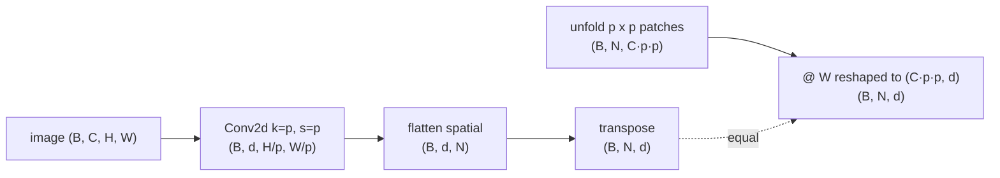
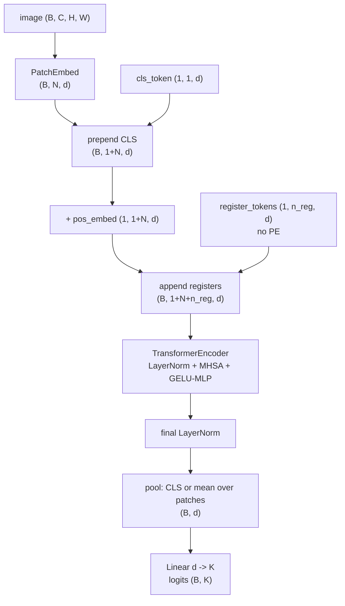
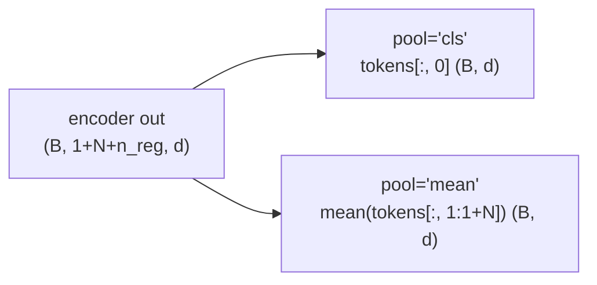
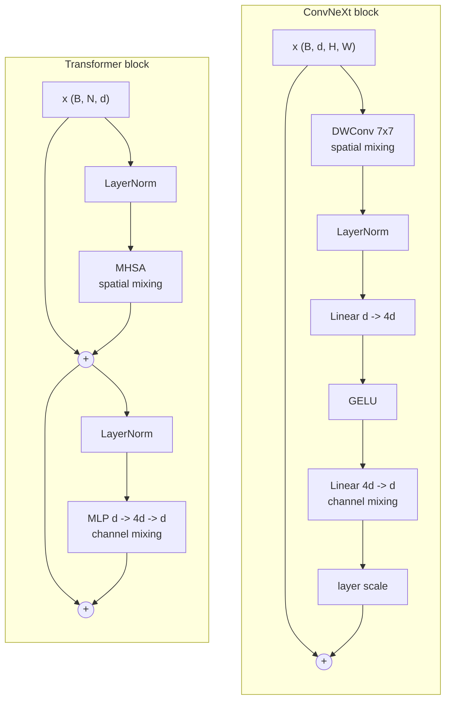

# A2 - Vision transformers, from scratch

The vision transformer applies the transformer encoder to images by cutting each image into a grid of
patches, projecting every patch to a token, and running the same encoder used for text. It drops the
locality and translation-equivariance priors of a convolutional network and learns every spatial
relationship from data. This assignment covers patch embedding as a strided convolution, the class
token and the choice between class-token and mean pooling, the learned absolute positional embedding
and how to interpolate it to a new resolution, register tokens, and the ConvNeXt block as the
convolutional counterpoint.

Build a vision transformer from scratch and overfit it on a small batch of synthetic images.
Implement the patch tokenizer, the token-sequence assembly (class token, positional embedding,
register tokens), the pooling head, the positional-embedding interpolation, and the ConvNeXt block.
The transformer encoder is imported from the transformer assignment in its classic ViT configuration;
the module construction and the CIFAR-10 wiring are provided. Everything runs on CPU in seconds.

Required reading before starting:
- Dosovitskiy et al. 2020, "An Image is Worth 16x16 Words: Transformers for Image Recognition at
  Scale", [arXiv:2010.11929](https://arxiv.org/abs/2010.11929).
- Liu et al. 2022, "A ConvNet for the 2020s",
  [arXiv:2201.03545](https://arxiv.org/abs/2201.03545).
- Darcet et al. 2024, "Vision Transformers Need Registers",
  [arXiv:2309.16588](https://arxiv.org/abs/2309.16588).

## Lecture notes

### Why patches as tokens

Before 2020, vision and language used different architectures. Language had moved to the transformer;
vision was still convolutional. A convolutional network is built around two assumptions baked into
its weights before any data is seen. Locality: a convolution kernel only looks at a small spatial
neighborhood, so early layers can only relate nearby pixels and long-range structure is assembled hop
by hop through a stack of layers. Translation equivariance: the same kernel slides across every
position, so a feature detected in one corner is detected identically in another, and the network
does not relearn an object separately for each location. These two priors are why convolutional
networks are sample-efficient on images, since a lot of what a model would otherwise have to learn,
that vision is local and shift-invariant, is wired into the architecture for free.

The vision transformer (Dosovitskiy et al. 2020) threw both priors out. It cuts the image into a grid
of non-overlapping patches (16x16 pixels in the original), flattens each patch and projects it to a
token vector, and feeds the resulting sequence of tokens to a plain transformer encoder, the same one
used for text. There is no convolution after the patch step, no pooling pyramid, no locality, no
translation equivariance. Every spatial relationship the model uses, including the basic fact that
adjacent patches are adjacent, is learned from data through self-attention and a learned positional
embedding. An image becomes a sentence of patch tokens, and the architecture does not know it is
looking at an image.

Two things made this matter. One architecture now covered both modalities: the same transformer block
runs on text tokens and on image patch tokens with no vision-specific layer between, which later made
joint vision-language models straightforward to build because both towers are transformers. And with
the inductive bias removed, attention is global from the first layer, so any patch can attend to any
other immediately rather than waiting for a deep stack to grow the receptive field.

The cost of dropping the priors is data hunger. The original ViT only beat strong convolutional
networks after pretraining on JFT-300M, a 300-million-image internal dataset; trained on ImageNet-1k
alone it lost to a comparable ResNet, because without locality and translation equivariance it had to
learn those regularities from scratch and there was not enough data. DeiT (Touvron et al. 2021,
[arXiv:2012.12877](https://arxiv.org/abs/2012.12877)) closed most of that gap without the giant
dataset by leaning on strong augmentation and regularization (RandAugment, MixUp, CutMix, label
smoothing, stochastic depth) plus a distillation token, training a competitive ViT on ImageNet-1k
alone. A ViT needs either large data or a strong training recipe to make up for the priors it does not
have.

### Patch embedding

An input image is $(B, C, H, W)$. Patch embedding with patch size $p$ produces
$N = (H/p)(W/p)$ patch tokens of dimension $d$. A `Conv2d` with kernel size and stride both equal to
$p$ applies one shared linear map to each $p\times p$ patch and produces no overlap, which is exactly
"flatten each patch and project it" written as a convolution. The convolution output is
$(B, d, H/p, W/p)$; flattening the two spatial dimensions and transposing gives $(B, N, d)$.



The strided-convolution path and an explicit unfold-then-linear path produce the same tokens, because
a non-overlapping strided convolution is one shared linear map applied per patch. Reshaping the
convolution weight to $(C\,p\,p, d)$ is exactly the matrix that would multiply each flattened patch.

### The token sequence

A learnable class token (the CLS token, borrowed from BERT) is prepended to the patch sequence at
index 0. After the encoder, its output row is taken as the image representation and fed to the
classifier. Because attention is permutation-equivariant, order is supplied separately by a learned
absolute positional embedding: a table with one learned vector per sequence position, added to the
tokens before the encoder. The table covers the class row and the $N$ patch rows.

Register tokens (Darcet et al. 2024) are a few extra learnable vectors appended at the end of the
sequence. They carry no image content and are discarded after the encoder. They exist because
self-supervised ViTs put a handful of background patches to use as scratch storage, giving those
tokens abnormally high norm and blotchy artifacts in the attention maps; dedicating a few content-free
tokens as scratch space makes the high-norm artifacts disappear and improves object-discovery and
dense-prediction quality. They get no positional embedding, because they have no spatial position.



### Pooling

The pooling head reduces the encoder output to one vector per image. Two choices matter. Class-token
pooling reads the output row of the class token at index 0. Mean pooling averages over the patch rows
only, the indices from 1 to $1+N$, excluding both the class token at index 0 and the register tokens
at the tail; averaging the registers in would mix content-free scratch vectors into the image
representation. At small scale, mean pooling matches or beats class-token pooling and is simpler to
reason about, and both are worth understanding.



### Positional-embedding interpolation

The learned positional table is tied to the training grid. To run at a different resolution, the
table has to be resized. Keep the class row unchanged, reshape the patch rows from a flat
$(1, g^2, d)$ sequence back to a $(1, g, g, d)$ spatial grid, permute to $(1, d, g, g)$, bicubically
resize the spatial dimensions to the new grid $g' \times g'$, then permute and reshape back to
$(1, g'^2, d)$ and concatenate the kept class row, giving $(1, 1+g'^2, d)$.

This interpolation is not optional bookkeeping. Every downstream use of a ViT backbone at a resolution
other than the training one (CLIP at varying input sizes, detectors at high resolution) depends on
it. The learned-table-plus-interpolation approach is the 2020 design; the resolution-agnostic modern
choices are 2D sinusoidal embeddings (used in the masked autoencoder,
[arXiv:2111.06377](https://arxiv.org/abs/2111.06377), and DINOv2,
[arXiv:2304.07193](https://arxiv.org/abs/2304.07193)) and 2D axial rotary embeddings (Heo et al. 2024,
[arXiv:2403.13298](https://arxiv.org/abs/2403.13298)), which carry position without a fixed-size table
and transfer across resolution without the bicubic step.

### The ConvNeXt block

The ConvNeXt block (Liu et al. 2022) is the convolutional side's answer to the ViT. It takes a ResNet
and modernizes it piece by piece (a depthwise $7\times7$ convolution for spatial mixing, an inverted
bottleneck MLP for channel mixing, layer norm, GELU, fewer normalization and activation layers, a
learned layer-scale gain) until a pure-convolution network matches Swin and ViT at the same compute.
The block runs the depthwise convolution and the residual add channels-first, $(B, d, H, W)$, and the
layer norm and the two pointwise linears channels-last, $(B, H, W, d)$:

$$y = x + \operatorname{LayerScale}\!\Big(W_2\,\operatorname{GELU}\big(W_1\,\operatorname{LN}(\operatorname{DWConv}_{7\times7}(x))\big)\Big).$$

The depthwise convolution mixes spatially within each channel; the inverted-bottleneck MLP (expand to
$4d$, GELU, project back to $d$) mixes across channels. Layer scale is a per-channel learned gain on
the branch, initialized at $10^{-6}$ so an untrained block starts near the identity.



The structural parallel is the point. Both blocks separate a spatial-mixing operator (depthwise
convolution versus self-attention) from a channel-mixing MLP, each on its own residual branch. The
difference is the spatial operator: the convolution mixes a fixed $7\times7$ neighborhood with fixed
weights, while attention mixes all positions with data-dependent weights. ConvNeXt shows that the
transformer's accuracy gains came largely from the macro design (separate spatial and channel mixing,
large effective kernels, the modern training recipe) rather than from attention itself beating
convolution.

Shapes at module boundaries: images $(B, C, H, W)$; patch tokens $(B, N, d)$; the encoder input and
output $(B, 1+N+n_{\text{reg}}, d)$; the pooled representation $(B, d)$; the logits $(B, K)$ for $K$
classes.

## The assignment

Implement five mechanism bodies and let the provided ViT assembly tie them together. Each task maps
to one `NotImplementedError` in a top-level file and to one test. The docstrings in each file give the
exact signatures, shapes, and step-by-step recipes; read those in the files rather than here.

### Files to modify

`convnext.py` holds the one new shared-library primitive. Implement `ConvNeXtBlock.forward` (the
depthwise convolution, the channels-last inverted-bottleneck MLP, the layer scale, and the residual
add from the ConvNeXt section). It is exposed as `nanovision.primitives.ConvNeXtBlock`.

`vit.py` holds the rest. Implement `PatchEmbed.forward` (the strided convolution then flatten and
transpose from the patch-embedding section), `ViT._assemble_tokens` (prepend the class token, add the
positional embedding, append the register tokens from the token-sequence section),
`ViT._pool` (class-token versus mean pooling from the pooling section), and `interpolate_pos_embed`
(the bicubic resize from the interpolation section). The module construction, the parameter
initialization, the classic-ViT encoder import (layer norm, GELU MLP, no rotary position), and
`forward` are provided.

The CIFAR-10 wiring in `train_cifar.py` is provided for an optional real run and has no holes; the
gating signal is overfit-one-batch.

### Running and validating

Activate the environment (`conda activate nanovision`), then run from the repo root:

```
make test   A=a02_vit   # run the tests against the top-level files (the ones with holes)
make verify A=a02_vit   # run the same tests against the reference solution/
make viz    A=a02_vit   # render the figures from the reference solution
```

`make test` is the command to run while working. It runs the suite in `assignments/a02_vit/tests/`
against the top-level files and goes from red (the holes raise `NotImplementedError`) to green as they
are filled. `make verify` runs the identical suite against the reference in `solution/`: it sets
`NANOVISION_IMPL=solution`, so it imports the reference instead of the top-level files and is green
from the start, showing the target. The goal is to bring `make test` to the same green as `make
verify`. The reference is visible in `solution/vit.py` and `solution/convnext.py`; read it if stuck.

The tests run in the order that doubles as the workflow:

- `tests/test_shapes.py` checks that the ConvNeXt block preserves its shape, that patch embedding maps
  a 32x32 image to 64 tokens, that the full ViT maps an image batch to class logits, and that the
  encoder sequence length is $1 + 64 + n_{\text{reg}}$.
- `tests/test_gradcheck.py` runs the float64 gradient check on the ConvNeXt block and patch embedding.
- `tests/test_patch_equivalence.py` checks that the convolutional patch embedding equals the
  unfold-then-linear path with the convolution weight reshaped to $(C\,p\,p, d)$.
- `tests/test_pos_interp.py` checks that an 8x8 table resizes to a 12x12 grid of the right shape, that
  a same-grid resize is near-identity, and that a 32x32-trained ViT runs a 48x48 forward after
  swapping in the interpolated table.
- `tests/test_registers.py` checks that the register tokens enter the sequence, receive gradients
  after a backward pass, and are excluded from mean pooling along with the class token.
- `tests/test_overfit.py` overfits 8 synthetic seeded images to cross-entropy below 0.02 in 500 steps
  for both class-token and mean pooling.
- `tests/test_forbidden_imports.py` checks that the top-level files, the solution, and the
  shared-library shim use no prebuilt attention or transformer module, fused attention, `nn.LayerNorm`,
  `timm`, or `torchvision.models` in actual code; mentions in prose are allowed, and this test passes
  with the holes in place too.

`make viz` renders from the reference solution and writes a ViT overfit loss curve, a class-token
attention rollout over the patch grid on a synthetic image, and, only if `timm` and DINOv2 weights are
reachable, a comparison of the patch-token norms of DINOv2 with and without register tokens (it falls
back cleanly and prints a message if `timm` or the network is unavailable). It writes PNGs rather than
opening windows: the plots use matplotlib's headless Agg backend, so the command behaves the same over
SSH, in WSL, and in CI with no display. `make viz-mine A=a02_vit` renders the same figures from the
top-level code, for checking a finished implementation; it needs the holes filled. Add `SHOW=1` to
either to also open interactive windows when a display is available.

What you should see when you run this. The overfit test uses dimension 64, patch 4 (so 64 patch
tokens), depth 2, 4 heads, 4 register tokens, batch 8 synthetic images, Adam at learning rate
$3\times10^{-3}$, 500 steps, reaching cross-entropy well under 0.02 for both pooling modes in a few
seconds, so the loss curve drops steeply. A flat curve usually means a wrong mechanism, most often
pooling over the wrong index range or a misshaped positional-embedding add, not a tuning problem. The
class-token attention rollout is on an untrained model, so it is a sanity figure for the rollout
mechanics rather than a meaningful saliency map. The optional CIFAR-10 run
(`solution/train_cifar.py`) is a wiring sanity run, not a convergence run: a tiny ViT from scratch
underfits CIFAR-10 without the DeiT recipe, and that gap is the inductive-bias deficit rather than a
bug. These are toy artifacts and say nothing about quality at scale.

## Additional reference material

This is the visual backbone the rest of the course imports. The masked autoencoder and DINO (A3)
reuse the patch embedding and the class-token output. CLIP (A4) uses the ViT as its image tower and
the class-token output as the image embedding aligned with text. The vision-language model (A8) feeds
the per-patch tokens, not just the class token, into a projector that maps image features into the
language model's token space. Detection and segmentation (A11) and the bird's-eye-view lift (A11.5b)
reshape the patch tokens from a $(B, N, d)$ sequence back to a $(B, H/p, W/p, d)$ spatial feature map,
because a detector or a lift needs to know which patch sits where.

Full reference list:

- Dosovitskiy et al. 2020, "An Image is Worth 16x16 Words",
  [arXiv:2010.11929](https://arxiv.org/abs/2010.11929). The original ViT: patches as tokens, the plain
  transformer applied to vision, the data-hunger ablation.
- Touvron et al. 2021, "Training data-efficient image transformers & distillation through attention"
  (DeiT), [arXiv:2012.12877](https://arxiv.org/abs/2012.12877). The augmentation and distillation
  recipe that trains a competitive ViT on ImageNet-1k alone.
- Liu et al. 2022, "A ConvNet for the 2020s" (ConvNeXt),
  [arXiv:2201.03545](https://arxiv.org/abs/2201.03545). A modernized convolutional network that matches
  ViT at equal compute; the block built here.
- Darcet et al. 2024, "Vision Transformers Need Registers",
  [arXiv:2309.16588](https://arxiv.org/abs/2309.16588). The high-norm background artifacts in
  self-supervised ViTs and the register-token fix.
- He et al. 2022, "Masked Autoencoders Are Scalable Vision Learners",
  [arXiv:2111.06377](https://arxiv.org/abs/2111.06377). 75% patch masking on the same patch embedding;
  2D sinusoidal positional embeddings.
- Oquab et al. 2023, "DINOv2", [arXiv:2304.07193](https://arxiv.org/abs/2304.07193). Emergent ViT
  features and the model used in the optional viz comparison.
- Heo et al. 2024, "Rotary Position Embedding for Vision Transformer",
  [arXiv:2403.13298](https://arxiv.org/abs/2403.13298). 2D axial rotary position for resolution-agnostic
  ViTs, the modern alternative to an interpolated learned table.
- Caron et al. 2021, "Emerging Properties in Self-Supervised Vision Transformers" (DINO),
  [arXiv:2104.14294](https://arxiv.org/abs/2104.14294). Class-token self-attention that segments
  objects without labels.
