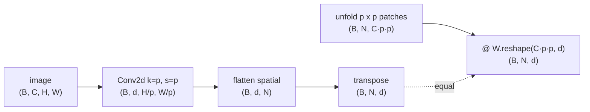
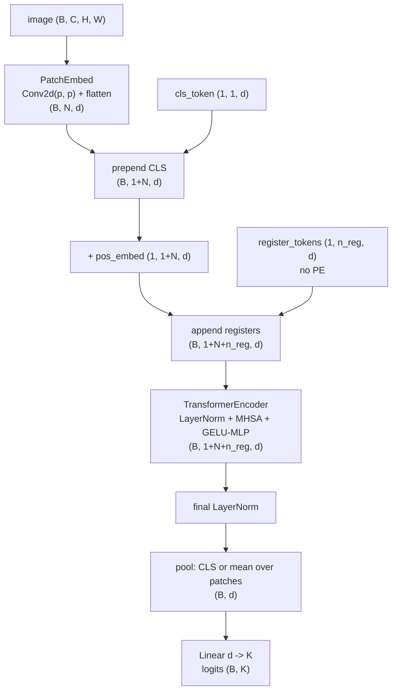
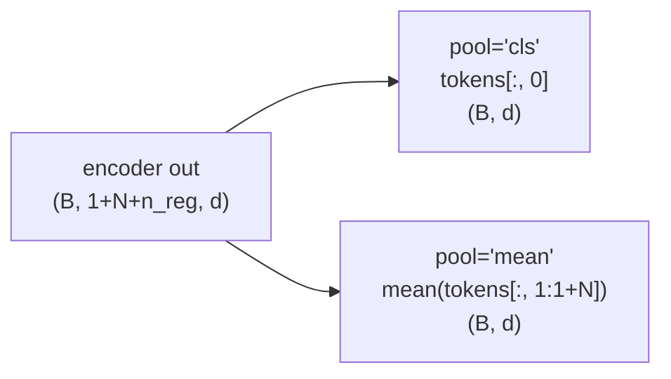
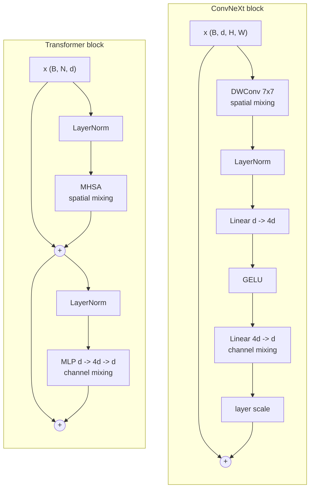

# A2 - Vision transformers, from scratch

## Motivation

Before 2020, vision and language used different architectures. Language had moved
to the transformer (A1); vision was still convolutional. A ConvNet is built around
two assumptions baked into its weights before any data is seen. Locality: a
convolution kernel only looks at a small spatial neighborhood, so early layers can
only relate nearby pixels and long-range structure has to be assembled hop by hop
through a stack of layers. Translation equivariance: the same kernel slides across
every position, so a feature detected in one corner is detected identically in the
other, and the network does not have to relearn "cat" separately for each location.
These two priors are why CNNs are sample-efficient on images: a lot of what a model
would otherwise have to learn (that vision is local and shift-invariant) is wired
into the architecture for free. ResNet, EfficientNet, and the detection and
segmentation systems built on them were the default, and they worked well with
ImageNet-scale data and nothing more.

The vision transformer (Dosovitskiy et al., 2020,
[arxiv.org/abs/2010.11929](https://arxiv.org/abs/2010.11929)) threw both priors out.
It cuts the image into a grid of non-overlapping patches (16x16 pixels in the
original), flattens each patch and projects it to a token vector, and feeds the
resulting sequence of tokens to a plain transformer encoder, the same one used for
text. There is no convolution after the patch step, no pooling pyramid, no
locality, no translation equivariance. Every spatial relationship the model uses,
including the basic fact that adjacent patches are adjacent, has to be learned from
data through self-attention and a learned positional embedding table. An image
becomes a sentence of patch tokens, and the architecture does not know it is looking
at an image.

Two things made this matter at the time. First, one architecture now covered
both modalities. The same transformer block (multi-head self-attention, an MLP, two
residual connections, layer norm) runs on text tokens and on image patch tokens
with no vision-specific layer in between, which later made joint
vision-language models (CLIP, the VLMs in A8) straightforward to build: both towers
are transformers. Second, with the inductive bias removed, attention is global from
the first layer, so any patch can attend to any other patch immediately rather than
waiting for a deep stack to grow the receptive field. The cost of dropping the
priors is data hunger. The original ViT only beat strong CNNs after pretraining on
JFT-300M, a 300-million-image internal dataset; trained on ImageNet-1k alone it lost
to a ResNet of similar size, because without locality and translation equivariance
it had to learn those regularities from scratch and there was not enough data to do
so. DeiT (Touvron et al., 2021,
[arxiv.org/abs/2012.12877](https://arxiv.org/abs/2012.12877)) closed most of that
gap without the giant dataset by leaning on strong augmentation and regularization
(RandAugment, MixUp, CutMix, label smoothing, stochastic depth) plus a distillation
token, training a competitive ViT on ImageNet-1k alone. A ViT needs either large
data or a strong recipe to make up for the priors it does not have, and this
assignment makes that tradeoff concrete.

The technical core is small. Patch embedding is a strided convolution: a
`Conv2d` with kernel size and stride both equal to the patch size `p` applies one
shared linear map to each `p x p` patch and produces no overlap, which is exactly
"flatten each patch and project it," just written as a convolution. A learnable
class token (the CLS token, borrowed from BERT) is prepended to the patch sequence;
after the encoder, its output row is taken as the image representation and fed to
the classifier. The alternative is to skip the CLS token and mean-pool over the
patch outputs, which at small scale matches or beats CLS and is simpler to reason
about; both are worth understanding and the code supports both. Because attention
is permutation-equivariant, order is supplied separately by a learned absolute
positional embedding: a table with one learned vector per sequence position, added
to the tokens before the encoder. That table is tied to the training grid (an `N`
patch layout), so to run at a different resolution you have to interpolate it,
reshaping the patch rows back to a 2D grid and bicubically resizing to the new grid.
This interpolation is not optional bookkeeping; every downstream use of ViT
backbones at a resolution other than the training one (CLIP at varying input sizes,
detectors at high resolution) depends on it. The learned-table-plus-interpolation
approach is the 2020 design; the resolution-robust modern choices are 2D sinusoidal
embeddings (used in MAE,
[arxiv.org/abs/2111.06377](https://arxiv.org/abs/2111.06377), and DINOv2,
[arxiv.org/abs/2304.07193](https://arxiv.org/abs/2304.07193)) and 2D axial rotary
embeddings (Heo et al., 2024,
[arxiv.org/abs/2403.13298](https://arxiv.org/abs/2403.13298)), which carry position
without a fixed-size table and transfer across resolution without the bicubic
heuristic.

Two more pieces round out the modern picture. Register tokens (Darcet et al., 2024,
[arxiv.org/abs/2309.16588](https://arxiv.org/abs/2309.16588)): self-supervised ViTs
(DINOv2 and similar) put a handful of background patches to use as scratch storage,
giving those tokens abnormally high norm and blotchy artifacts in the attention
maps. Adding a few extra learnable tokens that carry no image content and get
discarded after the encoder gives the model dedicated scratch space, the
high-norm artifacts disappear, and object-discovery and dense-prediction quality
improves. The fix is a few learnable vectors appended to the sequence; this
assignment includes them in the main scope because they are now standard in new ViT
checkpoints. The ConvNeXt block (Liu et al., 2022,
[arxiv.org/abs/2201.03545](https://arxiv.org/abs/2201.03545)) is the conv side's
answer to ViT. It takes a ResNet and modernizes it piece by piece (depthwise 7x7
convolution for spatial mixing, an inverted bottleneck MLP for channel mixing,
LayerNorm, GELU, fewer normalization and activation layers, layer scale) until a
pure-convolution network matches Swin and ViT at the same compute. ConvNeXt shows that
the transformer's accuracy gains came largely from the macro design (separate spatial
and channel mixing, large effective kernels, the modern training recipe) rather than
from attention itself beating convolution, so the block is built here as the
controlled counterpoint to the attention stack.

This is the visual backbone the rest of the course imports. A3 (self-supervised
learning): MAE reuses the patch embedding and masks 75% of the patch tokens before
the encoder; DINO operates on the CLS token output to distill a teacher into a
student. A4 (CLIP): the image tower is a ViT and the CLS output is the image
embedding that gets aligned with text. A8 (VLM): the ViT's per-patch tokens, not
just the CLS token, feed the projector that maps image features into the language
model's token space. A11 (detection and segmentation) and A11.5b (Lift-Splat-Shoot):
the patch tokens are reshaped from a `(B, N, d)` sequence back to a
`(B, H/p, W/p, d)` spatial feature map, because a detector or a BEV lift needs to
know which patch sits where, not just a single pooled vector. Getting the patch
tokenizer, the sequence layout, and the pooling right here makes those downstream
uses a matter of importing and reshaping.

## Background

An input image is `(B, C, H, W)`. Patch embedding with patch size `p` produces
$N = (H/p)\,(W/p)$ patch tokens of dimension `d`:

    PatchEmbed(x) = flatten_spatial(Conv2d_{k=p, s=p}(x))      # (B, N, d)

The `Conv2d` output is `(B, d, H/p, W/p)`; flattening the two spatial dims and
transposing gives `(B, N, d)`. The patch-embedding-equals-strided-conv identity is
that the conv weight reshaped to `(C*p*p, d)` is exactly the matrix that would
multiply each flattened `p x p` patch:

Both paths produce the same `(B, N, d)` tokens because a non-overlapping strided
conv is one shared linear map applied per patch; `tests/test_patch_equivalence.py`
checks they match to float rounding.

The full ViT data flow, with shapes (`n_reg` register tokens, `K` classes):

The CLS token is prepended at index 0 and the `n_reg` register tokens are appended
at the end. The positional embedding table is `(1, 1+N, d)` and covers only the CLS
row and the `N` patch rows; the register tokens get no positional embedding because
they have no spatial position. The pooling head reads either the CLS row or the mean
over the patch rows:

The mean must run over indices `1 .. 1+N` only, excluding both the CLS token at
index 0 and the register tokens at the tail; averaging the registers in would mix
content-free scratch vectors into the image representation.

Learned absolute positional embedding is a table `pos_embed` of shape
`(1, 1+N, d)`, added to the CLS-plus-patch tokens before the encoder. To run at a
new resolution with a new grid `g' x g'` you keep the CLS row and bicubically resize
the patch rows. With the patch rows reshaped from `(1, g^2, d)` to `(1, g, g, d)`
and permuted to `(1, d, g, g)`:

    patch_pe' = interpolate(patch_pe, size=(g', g'), mode="bicubic")   # (1, d, g', g')

then permute and reshape back to `(1, g'^2, d)` and concatenate the kept CLS row,
giving `(1, 1+g'^2, d)`. `tests/test_pos_interp.py` checks that a same-grid resize
is near-identity and that an interpolated table lets a 32x32-trained ViT run a 48x48
forward.

The ConvNeXt block is the conv-side counterpoint. It runs the depthwise conv and the
residual add channels-first `(B, d, H, W)`, and the LayerNorm and the two pointwise
linears channels-last `(B, H, W, d)`:

    y = x + LayerScale( Linear_{4d->d}( gelu( Linear_{d->4d}( LayerNorm( DWConv_{7x7}(x) ) ) ) ) )

The depthwise 7x7 conv mixes spatially within each channel; the inverted-bottleneck
MLP (expand to `4d`, GELU, project back to `d`) mixes across channels. Layer scale
is a per-channel learned gain on the branch, initialized at 1e-6 so an untrained
block starts near the identity. Putting the ConvNeXt block next to the transformer
block makes the structural parallel visible:

Both blocks separate a spatial-mixing operator (depthwise conv vs self-attention)
from a channel-mixing MLP, each on its own residual branch. The difference is the
spatial operator: the conv mixes a fixed 7x7 neighborhood with fixed weights, while
attention mixes all positions with data-dependent weights.

Shapes at module boundaries: images `(B, C, H, W)`; patch tokens `(B, N, d)`; the
encoder input and output `(B, 1+N+n_reg, d)`; the pooled representation `(B, d)`;
the logits `(B, K)`.

## What to implement

Five holes:

- `ConvNeXtBlock.forward` in `convnext.py` (the one new shared-library symbol;
  exposed as `nanovision.primitives.ConvNeXtBlock`).
- `PatchEmbed.forward` in `vit.py`.
- `ViT._assemble_tokens` (CLS + PE + register tokens) in `vit.py`.
- `ViT._pool` (CLS vs mean) in `vit.py`.
- `interpolate_pos_embed` in `vit.py`.

The ViT module construction, the transformer encoder (imported with
`norm="layer"`, `ffn="mlp"`, `pos="none"` for the classic ViT block), the
CLS/PE/register parameters and their init, `config.py`, the CIFAR-10 wiring in
`train_cifar.py`, and the plotting are provided. Only the five mechanism bodies
are left to implement.

## Tasks

Each task maps 1:1 to a `raise NotImplementedError(...)` in the top-level module files and 1:1 to a
test.

1. `ConvNeXtBlock.forward` (`convnext.py`, exposed as
   `nanovision.primitives.ConvNeXtBlock`): depthwise 7x7 conv, permute to channels-last,
   LayerNorm, Linear `d->4d`, GELU, Linear `4d->d`, optional layer-scale gamma,
   permute back, residual add. Input and output `(B, d, H, W)`. Teaches the
   modernized-ResNet design and that spatial mixing (the depthwise conv) and channel
   mixing (the MLP) separate the same way attention and the FFN do.
2. `PatchEmbed.forward` (`vit.py`): apply the `Conv2d(k=p, s=p)`, flatten
   the spatial grid to `(B, d, N)`, transpose to `(B, N, d)`. Teaches that patch
   embedding is one shared linear map per patch, exactly a strided convolution.
3. `ViT._assemble_tokens` (`vit.py`): expand and prepend the CLS token to
   get `(B, 1+N, d)`, add `pos_embed` over the CLS-plus-patch rows, then (if
   `n_registers > 0`) expand and append the register tokens with no PE. Result
   `(B, 1+N+n_reg, d)`. Teaches sequence construction and register tokens.
4. `ViT._pool` (`vit.py`): for `pool="cls"` return `tokens[:, 0]`; for
   `pool="mean"` return the mean over `tokens[:, 1:1+N]`, excluding the CLS token
   and the register tokens. Teaches the CLS-vs-mean-pool choice and that the mean
   must skip the registers.
5. `interpolate_pos_embed` (`vit.py`): split off the CLS row, reshape the
   patch rows to `(1, g, g, d)`, permute to `(1, d, g, g)`, bicubically resize to
   `(g', g')`, permute and reshape back to `(1, g'^2, d)`, concatenate the CLS row.
   Returns `(1, 1+g'^2, d)`. Teaches resolution generalization.

## How to verify

From the repo root with the `nanovision` env active:

    make test A=a02_vit      # your top-level code (red until the holes are filled)

The tests run in this order, which is also the intended workflow:

1. `tests/test_shapes.py` - ConvNeXt preserves `(2, 16, 8, 8)`; PatchEmbed
   `(2, 3, 32, 32) -> (2, 64, d)`; the full ViT `(2, 3, 32, 32) -> (2, K)`; the
   encoder sequence length is `1 + 64 + n_registers` (shape).
2. `tests/test_gradcheck.py` - float64 `check_gradients` on ConvNeXtBlock and
   PatchEmbed (gradcheck).
3. `tests/test_patch_equivalence.py` - the Conv2d patch embed equals unfold plus a
   linear with the conv weight reshaped to `(C*p*p, d)` (reference-value).
4. `tests/test_pos_interp.py` - 8x8 -> 12x12 returns `(1, 1+144, d)`; same-grid
   resize is near-identity; a 32x32 ViT runs a 48x48 forward after swapping in the
   interpolated PE (reference-value + shape).
5. `tests/test_registers.py` - the register tokens enter the sequence, receive
   gradients after a backward, and mean-pool excludes them and the CLS token
   (reference-value).
6. `tests/test_overfit.py` - the assembled ViT overfits 8 synthetic seeded images
   to cross-entropy < 0.02 in 500 steps for both `pool="cls"` and `pool="mean"`
   (overfit-one-batch).
7. `tests/test_forbidden_imports.py` - the top-level files, the solution, and the
   `nanovision/primitives.py` shim use no prebuilt attention/transformer module,
   fused SDPA, `nn.LayerNorm`, `timm`, or `torchvision.models` in actual code
   (mentions in prose are allowed). This one passes with the holes in place too.

To confirm the reference passes and render the figures:

    make verify A=a02_vit    # reference solution (should be green)
    make viz    A=a02_vit    # writes the loss curve and attention rollout to out/

The reference implementation is visible in `solution/vit.py` and
`solution/convnext.py`; read it if you get stuck.

## Compute notes

Gating is overfit-one-batch on CPU: dim 64, patch 4 (`N = 64`), depth 2, 4 heads, 4
register tokens, batch 8 synthetic images, Adam lr 3e-3, 500 steps, reaching
cross-entropy well under 0.02 for both pool modes in a few seconds. A flat loss
curve usually means a wrong mechanism (most often pooling over the wrong index range
or a misshaped PE add), not a tuning problem. The tiny ViT fits 12GB trivially. The
optional real CIFAR-10 run (`solution/train_cifar.py`) is a wiring sanity run, not a
convergence run: a tiny ViT from scratch underfits CIFAR-10 without the DeiT recipe
(RandAugment, MixUp, CutMix, label smoothing, stochastic depth), and that gap is the
inductive-bias deficit rather than a bug in the architecture.

## Stretch goals

1. Swap the learned 1D PE for 2D sinusoidal PE (MAE/DINOv2 style) and drop the
   bicubic interpolation; compare resolution transfer.
2. Token masking / patch dropout (the MAE mechanism): drop a fraction of patch
   tokens before the encoder; measure step time against the drop rate.
3. Windowed (Swin,
   [arxiv.org/abs/2103.14030](https://arxiv.org/abs/2103.14030)) attention on the
   token grid: block-diagonal attention within `w x w` windows, then the
   shifted-window variant with its cyclic-shift mask.
4. Train ConvNeXt and ViT at matched parameter count on CIFAR-10 with the DeiT
   recipe and compare the inductive-bias gap.
5. Load a pretrained DINOv2 with and without registers (timm, in a probe notebook
   only) and visualize the attention maps to see the high-norm artifacts the
   register tokens remove.

## Further reading

- Dosovitskiy et al., "An Image is Worth 16x16 Words" (2020,
  [arxiv.org/abs/2010.11929](https://arxiv.org/abs/2010.11929)) - the original ViT:
  patches as tokens, the plain transformer applied to vision, the data-hunger
  ablation.
- Touvron et al., "Training data-efficient image transformers & distillation through
  attention" - DeiT (2021,
  [arxiv.org/abs/2012.12877](https://arxiv.org/abs/2012.12877)) - the augmentation
  and distillation recipe that trains a competitive ViT on ImageNet-1k alone.
- Liu et al., "A ConvNet for the 2020s" - ConvNeXt (2022,
  [arxiv.org/abs/2201.03545](https://arxiv.org/abs/2201.03545)) - a modernized CNN
  that matches ViT at equal compute; the block built here.
- Darcet et al., "Vision Transformers Need Registers" (2024,
  [arxiv.org/abs/2309.16588](https://arxiv.org/abs/2309.16588)) - the high-norm
  background artifacts in self-supervised ViTs and the register-token fix.
- He et al., "Masked Autoencoders Are Scalable Vision Learners" - MAE (2022,
  [arxiv.org/abs/2111.06377](https://arxiv.org/abs/2111.06377)) - 75% patch masking
  on the same patch embedding; 2D sincos PE; the A3 connection.
- Oquab et al., "DINOv2" (2023,
  [arxiv.org/abs/2304.07193](https://arxiv.org/abs/2304.07193)) - the reference for
  emergent ViT features and the model used in the probe notebook.
- Heo et al., "Rotary Position Embedding for Vision Transformer" (2024,
  [arxiv.org/abs/2403.13298](https://arxiv.org/abs/2403.13298)) - 2D axial RoPE for
  resolution-robust ViTs, the modern alternative to interpolated learned PE.
- Caron et al., "Emerging Properties in Self-Supervised Vision Transformers" -
  DINO v1 (2021,
  [arxiv.org/abs/2104.14294](https://arxiv.org/abs/2104.14294)) - CLS-token
  self-attention that segments objects without labels; the cleaner illustration to
  read before DINOv2.
