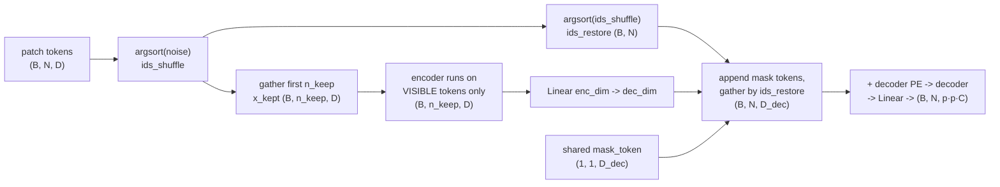
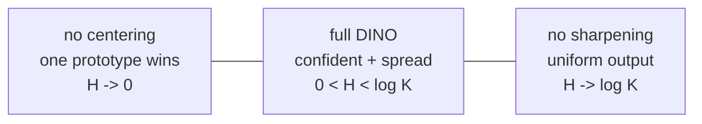

# A3 - Self-supervised learning (MAE and DINO)

## Motivation

A2 built the vision transformer and ended on its one real weakness: a ViT has no
built-in priors, so it needs either a giant labeled dataset or a heavy augmentation
recipe to reach a good representation. Labels are the bottleneck. ImageNet-1k has 1.3
million human-labeled images; the internet has billions of unlabeled ones. Self-
supervised learning (SSL) is the attempt to learn a useful representation from the
unlabeled images alone, by inventing a "pretext" task whose supervision comes from
the data itself rather than from a human annotator. Get that right and pretraining
scales with raw image count instead of annotation budget, and the resulting backbone
transfers to detection, segmentation, retrieval, and depth with a small labeled head
on top.

The 2018-2020 wave of image SSL was dominated by contrastive learning. Take
an image, make two random augmentations of it, and train the network so the two views
of the same image land near each other in feature space while views of different
images are pushed apart. SimCLR (Chen et al., 2020,
[arxiv.org/abs/2002.05709](https://arxiv.org/abs/2002.05709)) showed this works at
scale with a large batch supplying the negatives, and MoCo (He et al., 2020,
[arxiv.org/abs/1911.05722](https://arxiv.org/abs/1911.05722)) replaced the large batch
with a momentum-updated encoder and a queue of past features so the negatives did not
have to fit in one batch. Contrastive methods worked, but they leaned on a fragile
ingredient: a steady supply of negative pairs, plus the assumption that two different
images really are dissimilar (often false, since two different dog photos are pushed
apart anyway). The methods this assignment builds remove the negatives entirely and
take two different routes to a non-trivial representation.

MAE (He et al., 2022, [arxiv.org/abs/2111.06377](https://arxiv.org/abs/2111.06377)) is
the generative route, and it is BERT for images done right. Mask a large fraction of
the input and train the model to reconstruct the missing part; the pretext supervision
is the pixels you hid. The earlier image version of this, BEiT (Bao et al., 2021,
[arxiv.org/abs/2106.08254](https://arxiv.org/abs/2106.08254)), masked a modest fraction,
predicted discrete visual tokens rather than pixels, and ran the encoder over the whole
grid including the mask placeholders. MAE made two
choices that changed the economics. First, mask 75% of the patches, not 15%: images
are spatially redundant in a way text is not, so a small mask is solvable by copying a
neighbor and teaches nothing, while a 75% mask forces the model to infer global
structure. Second, run the heavy encoder on the visible 25% only and push the mask
tokens into a small separate decoder. With three quarters of the patches dropped
before the expensive part, pretraining is roughly 3x cheaper per image and the saving
goes straight back into model size or epochs. The encoder never sees a mask token, so
there is no train/inference gap to manage, and after pretraining you throw the decoder
away and keep the encoder as the backbone.

DINO (Caron et al., 2021,
[arxiv.org/abs/2104.14294](https://arxiv.org/abs/2104.14294)) is the discriminative
route, self-distillation with no labels and no negatives. There are two networks with
identical architecture, a student and a teacher. Both see crops of the same image, the
teacher sees the large global crops and the student sees those plus several small local
crops, and the student is trained so its output distribution over a set of learned
"prototypes" (K learned direction vectors; each crop's features are scored against all
of them to give a distribution over the K prototypes) matches the teacher's. The teacher is not trained by backprop at all: its
weights are an exponential moving average (EMA) of the student's, so it is a slowly
moving, more stable version of the student that the student chases. The obvious failure
mode is collapse: nothing in "match the teacher" stops both networks from ignoring the
input and emitting the same constant vector, which matches perfectly and is useless.
DINO avoids it with two cheap operations on the teacher only, centering and sharpening,
which the tests instrument directly. What made DINO matter was an emergent property nobody
trained for: the attention maps of a DINO-trained ViT segment the main object in the
image without ever being shown a segmentation label, and the frozen features do
k-nearest-neighbor classification on ImageNet at high accuracy with no fine-tuning.
The representation organizes itself around objects.

These two are the parents of the production self-supervised backbone. DINOv2 (Oquab et
al., 2023, [arxiv.org/abs/2304.07193](https://arxiv.org/abs/2304.07193)) is DINO plus
iBOT's patch-level masked distillation
([arxiv.org/abs/2111.07832](https://arxiv.org/abs/2111.07832)) plus a feature-spreading
regularizer plus curated data, and it is the frozen backbone a large fraction of
2023-2026 dense-prediction systems sit on top of, including the register-token ViT built
earlier in A2. The line forward from here: A4 (CLIP) is the third SSL family,
language supervision instead of a hand-designed pretext, and seeing MAE and DINO first
makes clear what CLIP buys by paying for paired text. A8 (VLM) feeds a frozen self-
supervised ViT's patch tokens into a language model, so the quality of those tokens is
exactly what A3 is about. A10.5 (geometry foundation models) and the AV perception
assignments lean on self-supervised or large-pretrained backbones as the feature
extractor under the geometry. A3 teaches how a pretext task and an anti-collapse
mechanism turn unlabeled pixels into a transferable feature, and how to measure
whether that is happening rather than collapsing.

## Background

The shared setup is the ViT patch grid. An image is `(B, C, H, W)`; with patch size
`p` it becomes $N = (H/p)(W/p)$ patch tokens of dimension `D`. For the tiny config
here (32x32 images, `p = 4`) that is $N = 64$.

### MAE

MAE has three taught pieces: the masking, the decoder-side reassembly, and the loss.

Random masking keeps `n_keep = round((1 - r) * N)` tokens per sample, chosen by a
random permutation. With `r = 0.75` and `N = 64`, `n_keep = 16` and 48 patches are
masked. The implementation is the shuffle-keep-unshuffle trick: draw one random score
per token, `argsort` to get a random permutation `ids_shuffle`, keep the first
`n_keep` shuffled indices, and record `ids_restore = argsort(ids_shuffle)`, the inverse
permutation that undoes the shuffle. The binary `mask` is built in shuffled order as
`n_keep` zeros followed by ones, then gathered by `ids_restore` back into original
patch order, so `mask[b, i] = 1` exactly when patch `i` was dropped.



The asymmetry makes MAE cheap: the encoder is large (dim 64, depth 4 here) and sees
only the 16 visible tokens; the decoder is light (dim 48, depth 2) and sees the full
64-token grid. The reassembly, `append_mask_tokens`, broadcasts the one shared learned
`mask_token` to the `N - n_keep` masked slots, concatenates `[x_enc; masks]` in
shuffled order, and gathers by `ids_restore` so every position holds either its encoded
visible token or a mask token, back in grid order, ready for the decoder positional
embedding.

The target is the per-patch-normalized pixels (each patch made zero-mean unit-variance
before the MSE), and the loss is MSE on masked patches only:

$$\mathrm{mse}_i = \operatorname*{mean}_{\text{pixels}}\big[(\mathrm{pred}_i - \mathrm{target}_i)^2\big], \qquad
L_{\text{mae}} = \frac{\sum_i \mathrm{mask}_i \cdot \mathrm{mse}_i}{\sum_i \mathrm{mask}_i}$$

Two details that the tasks make you get right. The loss ignores visible patches
entirely (the `mask` weight zeroes them), because predicting a patch you were shown is
free and teaches nothing. The target is normalized per patch, so a patch's mean and
contrast are removed before the MSE; this makes the units consistent across patches and
means an untrained decoder that predicts the mean sits near MSE 1.0, which is the
initial loss you should see.

### DINO

Each crop is run through `DINOModel` = backbone ViT then a projection head, producing
`(B, K)` logits over `K = 128` learned prototypes. The head is an MLP, then L2-
normalize the hidden feature onto the unit sphere, then a weight-normalized linear
whose rows are the prototype directions. The cross-view objective compares the
teacher's distribution to the student's (the teacher branch is stop-gradient):

$$p_{\text{teacher}} = \operatorname{softmax}\!\big((g_{\text{teacher}} - \text{center})/\tau_{\text{teacher}}\big), \qquad
\log p_{\text{student}} = \log\operatorname{softmax}(g_{\text{student}}/\tau_{\text{student}})$$

$$H(p_{\text{teacher}}, p_{\text{student}}) = -\sum_k p_{\text{teacher}}(k)\,\log p_{\text{student}}(k)$$

summed over every (teacher global crop, student crop) pair except the matched same-crop
pair (a crop is not distilled against itself), averaged over the counted pairs. Because
the student sees small local crops and is asked to predict the teacher's distribution
from a global crop, the task is "local-to-global": recognize the whole from a part.

```mermaid
flowchart TB
    IMG["image"] --> MC["multi-crop:<br/>2 global + 4 local"]
    MC --> GC["global crops"]
    MC --> LC["local crops"]
    GC --> TEA["TEACHER (EMA copy)<br/>global crops only<br/>no grad"]
    GC --> STU["STUDENT<br/>all crops"]
    LC --> STU
    TEA --> TP["softmax((g - center)/tau_t)<br/>detach()  (B, K)"]
    STU --> SP["log_softmax(g / tau_s)<br/>(B, K)"]
    TP --> L["cross-view CE<br/>over crop pairs"]
    SP --> L
    L -->|backprop| STU
    STU -.->|EMA: theta_t <- m·theta_t + (1-m)·theta_s| TEA
    TP -.->|center <- m_c·center + (1-m_c)·mean| CEN["center buffer (1, K)"]
```

The teacher moves two ways, neither by backprop. Its weights are an EMA of the
student's, $\theta_t \leftarrow m\,\theta_t + (1-m)\,\theta_s$ over every parameter and
float buffer. The `center` is an EMA of the batch-mean teacher logits,
$\text{center} \leftarrow m_c\,\text{center} + (1-m_c)\operatorname{mean}(g_{\text{teacher}})$,
updated outside the autograd graph.

Centering and sharpening are the anti-collapse pair, and they push against opposite
failure modes. Subtracting `center` (the running average teacher output) stops any one
prototype from dominating: if the teacher started always preferring prototype 7,
`center` grows in the 7 direction and is subtracted back out, flattening that bias. So
centering pushes the teacher distribution toward uniform. Sharpening is dividing by a
small `tau_teacher = 0.04` before the softmax, which makes the distribution peaky and
confident, pushing it away from uniform. The student temperature is larger
(`tau_student = 0.1`), so the student is asked to match a sharper target than it
produces, which transfers information. Balanced, the two keep the teacher in a
healthy middle: confident per image, spread across prototypes over the batch.

The collapse instrument is the mean teacher entropy:

$$H = \operatorname*{mean}_{\text{batch}}\Big[-\sum_k p_{\text{teacher}}(k)\,\log p_{\text{teacher}}(k)\Big]$$

This one scalar reads out which way training has gone, and the collapse test asserts an
ordering on it:



With $K = 128$, $\log K = \ln 128 = 4.85$. Remove centering and the teacher collapses
onto a single prototype, entropy near 0. Remove sharpening (use a large teacher
temperature) and the teacher goes uniform, entropy near $\log K$. Keep both and entropy
sits in the middle. The two collapses are different degeneracies, which is why one
anti-collapse trick is not enough and both are needed.

## What to implement

Six holes, three in `mae.py` and three in `dino.py`:

- `random_masking` (`mae.py`): the shuffle-keep-unshuffle masking.
- `append_mask_tokens` (`mae.py`): decoder-side reassembly that inverts the shuffle.
- `mae_loss` (`mae.py`): MSE on masked patches only, per-patch-normalized.
- `dino_loss` (`dino.py`): the cross-view distillation loss with centering + sharpening.
- `ema_update` and `update_center` (`dino.py`): the EMA teacher and centering updates.
- `teacher_entropy` (`dino.py`): the collapse instrument.

The ViT backbone, patchify/unpatchify helpers, the MAE module wiring, the DINO
student/teacher construction, the multi-crop augmentation, the projection head, and the
training-step wiring are all provided in `backbone.py` and the module classes. Left to implement are
only the six mechanism bodies.

## Tasks

1. `random_masking` (`mae.py`): from `x (B, N, D)` and `mask_ratio`, compute
   `n_keep = round((1 - mask_ratio) * N)`, draw `noise (B, N)`, `ids_shuffle =
   argsort(noise)`, `ids_restore = argsort(ids_shuffle)`, gather the first `n_keep`
   shuffled indices into `x_kept (B, n_keep, D)`, build `mask` as `n_keep` zeros then
   ones and gather by `ids_restore` into original order. Return `(x_kept, mask,
   ids_restore)`. Teaches how the encoder is made to see only visible tokens while
   keeping a way back to grid order.
2. `append_mask_tokens` (`mae.py`): from `x_enc (B, n_keep, D_dec)`, `ids_restore
   (B, N)`, and `mask_token (1, 1, D_dec)`, broadcast the mask token to the masked
   slots, concatenate `[x_enc; masks]` in shuffled order, and gather by `ids_restore`
   to `(B, N, D_dec)`. Teaches the decoder-side assembly that inverts the masking
   shuffle.
3. `mae_loss` (`mae.py`): from `pred`, `target` both `(B, N, p*p*C)` and `mask (B, N)`,
   compute per-patch MSE (mean over the pixel dim) and average over masked patches only
   using `mask` as the weight. Teaches loss on masked patches only, per-patch
   normalized.
4. `dino_loss` (`dino.py`): teacher `p_t = softmax((g_t - center)/tau_t)` with
   stop-gradient, student `log p_s = log_softmax(g_s/tau_s)`, sum the cross-entropy
   over (teacher global, student) crop pairs excluding the matched pair, average.
   Teaches centering + sharpening and the cross-view objective.
5. `ema_update` and `update_center` (`dino.py`): under `no_grad`, move every teacher
   parameter and float buffer toward the student by `momentum`, and move `center`
   toward the batch-mean teacher logits by `center_momentum`. Teaches the stable EMA
   target and the centering buffer that prevents single-mode collapse.
6. `teacher_entropy` (`dino.py`): form `p_t = softmax((g_t - center)/tau_t)` and return
   the mean over the batch of $-\sum_k p_t(k)\,\log p_t(k)$. Teaches the instrument the
   collapse test reads.

## How to verify

From the repo root with the `nanovision` env active:

    make test A=a03_0_ssl      # your top-level code (red until the holes are filled)

The tests run in this order, which is also the intended workflow:

1. `tests/test_shapes.py` - `random_masking` on `(2, 64, D)` at `r=0.75` gives
   `x_kept (2, 16, D)`, `mask (2, 64)` with 48 ones per row, `ids_restore (2, 64)`; the
   MAE forward gives `pred (2, 64, 48)`; the DINO heads give `(B, K)`; the center buffer
   is `(1, K)` (shape).
2. `tests/test_gradcheck.py` - float64 gradcheck of the MAE encode->decode->loss
   pipeline w.r.t. the encoder patch-embed weight, and of `dino_loss` w.r.t. the student
   logits; the teacher params have `requires_grad=False` and a student-loss backward
   leaves the teacher grads `None` (gradcheck + no-grad check).
3. `tests/test_mae_masking.py` - masking keeps exactly `round((1-r)N)` tokens, the mask
   has the complementary ones, the unshuffle returns visible tokens to their original
   positions, and the op is deterministic under a fixed seed (reference-value).
4. `tests/test_ema.py` - after `ema_update` the teacher params equal `m*old + (1-m)*
   student`; `update_center` moves the center toward the batch mean (reference-value).
5. `tests/test_mae_overfit.py` - the MAE memorizes one fixed batch (fixed mask) to
   masked-patch MSE < 0.05 (overfit-one-batch).
6. `tests/test_dino_overfit.py` - the DINO student loss falls below `0.85 * initial`
   when trained to match a frozen teacher target (overfit-one-batch).
7. `tests/test_dino_collapse.py` - the centerpiece: three short variants on one
   synthetic batch read out through `teacher_entropy`. End-state entropies satisfy
   `collapse (no centering) < full < uniform (no sharpening)`, with margins
   (reference-value).
8. `tests/test_forbidden_imports.py` - the top-level files and the solution use no
   prebuilt attention/transformer module, fused SDPA, `nn.LayerNorm`, `timm`, or
   `transformers` in actual code (prose mentions allowed). Passes with the holes in
   place too.

To confirm the reference passes and render the figures:

    make verify A=a03_0_ssl    # reference solution (should be green)
    make viz    A=a03_0_ssl    # writes the MAE reconstruction and DINO entropy curves to out/

The reference implementation is visible in `solution/mae.py` and `solution/dino.py`;
read it if you get stuck.

## Compute notes

Everything gates on CPU with synthetic seeded tensors and no download. MAE: encoder
dim 64 depth 4, decoder dim 48 depth 2, patch 4 (`N = 64`), 75% masking, 16-image
batch, Adam lr 2e-3, 800 steps with a fixed mask, reaching masked-patch MSE around
8e-3 against the 0.05 threshold. Because the target is per-patch-normalized, an
untrained decoder predicting the mean starts near MSE 1.0, so a healthy curve drops
from ~1.0 toward ~1e-2; a curve flat at ~1.0 means the loss is not seeing the masked
patches (check the `mask` weighting), and one that drops then stalls high points at the
reassembly putting tokens back in the wrong order.

DINO: backbone dim 64 depth 4, `K = 128` prototypes, batch 8, Adam lr 1e-3, 150 steps.
The overfit test freezes the teacher and captures its output once, then trains the
student against that fixed target; the loss falls to about `0.74 * initial`. It does not
reach zero because the head's unit-norm features give bounded cosine logits that cannot
exactly match the sharp teacher target. The collapse test runs three short variants and
reads `teacher_entropy`; with $\log K = 4.85$, full DINO settles around 1.3, no-centering
near 0, no-sharpening near 4.85. The collapse test deliberately uses a fast-tracking
teacher momentum (0.9) so the degeneracy appears within ~150 steps; the overfit test
uses no momentum at all (frozen teacher). These are opposite teacher regimes on purpose.
The whole tiny setup fits 12GB trivially; the gating signal is correctness, not scale.

The optional CIFAR-10 linear-probe comparison (frozen DINO features vs MAE features vs
random init, with a single linear layer trained on top) measures whether the
representation is good, not just whether the loss went down. It is described here
but is not part of the tests because it needs the dataset and more than overfit-scale
compute.

## Stretch goals

1. iBOT patch-level distillation on top of DINO: mask ~30% of the student's patch
   tokens, have the teacher see the full sequence, and add a per-patch cross-entropy on
   the masked positions. This is the bridge from DINO to DINOv2.
2. KoLeo regularizer: add `-mean_i log(nearest-neighbor distance of feature i in the
   batch)` to spread features across the hypersphere, as DINOv2 does.
3. Linear probe on frozen features for DINO, MAE, and random init on CIFAR-10, and
   reproduce DINO probing above MAE at the same backbone size and probe budget.
4. Swap MAE's pixel target for a latent target from an EMA encoder (the I-JEPA idea,
   [arxiv.org/abs/2301.08243](https://arxiv.org/abs/2301.08243)) and compare what the
   features encode.

## Further reading

- He et al., "Masked Autoencoders Are Scalable Vision Learners" (2022,
  [arxiv.org/abs/2111.06377](https://arxiv.org/abs/2111.06377)). MAE; the 75%-mask
  asymmetric encoder-decoder this assignment builds.
- Caron et al., "Emerging Properties in Self-Supervised Vision Transformers" (2021,
  [arxiv.org/abs/2104.14294](https://arxiv.org/abs/2104.14294)). DINO; Algorithm 1 is
  the implementation spec for the loss, EMA, and centering.
- Oquab et al., "DINOv2: Learning Robust Visual Features without Supervision" (2023,
  [arxiv.org/abs/2304.07193](https://arxiv.org/abs/2304.07193)). The production backbone:
  DINO + iBOT + KoLeo + curated data.
- Zhou et al., "iBOT: Image BERT Pre-Training with Online Tokenizer" (2021,
  [arxiv.org/abs/2111.07832](https://arxiv.org/abs/2111.07832)). Patch-level
  distillation, the DINO-to-DINOv2 bridge.
- Grill et al., "Bootstrap Your Own Latent" (2020,
  [arxiv.org/abs/2006.07733](https://arxiv.org/abs/2006.07733)). The EMA-teacher
  predecessor that avoids collapse without negatives, the idea DINO inherits.
- Chen et al., "A Simple Framework for Contrastive Learning of Visual Representations"
  (SimCLR, 2020, [arxiv.org/abs/2002.05709](https://arxiv.org/abs/2002.05709)). The
  contrastive baseline DINO and MAE moved away from.
- Assran et al., "Self-Supervised Learning from Images with a Joint-Embedding Predictive
  Architecture" (I-JEPA, 2023,
  [arxiv.org/abs/2301.08243](https://arxiv.org/abs/2301.08243)). Predict in latent space
  instead of pixels; the masked-prediction route after MAE.
