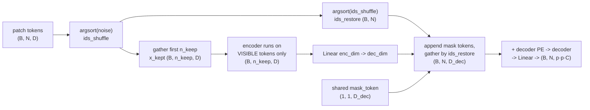
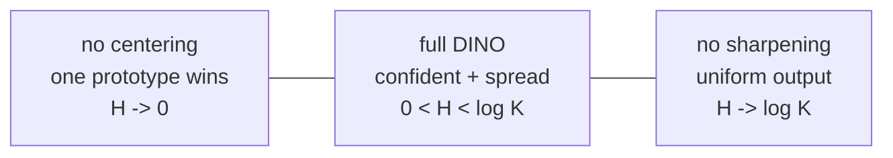

# A3 - Self-supervised learning (MAE and DINO)

Self-supervised learning (SSL) trains a representation from unlabeled images by inventing a
pretext task whose supervision comes from the data itself rather than from a human annotator.
Get that right and pretraining scales with raw image count instead of annotation budget, and
the resulting backbone transfers to detection, segmentation, retrieval, and depth with a small
labeled head on top. This assignment covers the two methods that anchor the modern picture: the
masked autoencoder (MAE), which masks most of an image and reconstructs the missing pixels with
an asymmetric encoder-decoder, and DINO, where a student network matches an exponential-moving-
average teacher's distribution over learned prototypes across crops, with two cheap operations
on the teacher (centering and sharpening) to keep the representation from collapsing.

Build both methods on a tiny ViT over 32x32 images. Implement MAE's random masking, its
decoder-side reassembly, and its masked-patch loss; then DINO's cross-view distillation loss,
the EMA teacher and centering updates, and the entropy instrument that reads out collapse. The
ViT backbone, the multi-crop augmentation, the projection head, and the training-step wiring are
provided. Everything runs on CPU with synthetic seeded tensors in under a minute.

Required reading before starting:
- He et al. 2022, "Masked Autoencoders Are Scalable Vision Learners",
  [arXiv:2111.06377](https://arxiv.org/abs/2111.06377).
- Caron et al. 2021, "Emerging Properties in Self-Supervised Vision Transformers",
  [arXiv:2104.14294](https://arxiv.org/abs/2104.14294). Algorithm 1 is the spec for the DINO
  loss, EMA, and centering.

## Lecture notes

### Why self-supervised learning

A vision transformer carries no built-in assumption that nearby pixels belong together or that a
shifted object is the same object. A convolution builds both in; a transformer has to learn them
from data. So a ViT needs either a large labeled dataset or a heavy augmentation recipe before
its representation is worth anything.

Labels are the part that does not scale. ImageNet-1k has 1.3 million images, each carrying a
human decision; the internet has billions of images carrying none. Self-supervised learning aims
at the second pile.

The device that makes that possible is the pretext task: a training objective whose targets are
computed from the input by a fixed rule, so any image can be turned into a training example with
no annotator involved. The rule is chosen because solving it is believed to require understanding
the image, not because anyone wants its answer for its own sake. Early examples give the flavor.
Cut two patches from an image and predict their relative arrangement (Doersch et al. 2015).
Rotate an image by a multiple of 90 degrees and predict which rotation was applied (Gidaris et
al. 2018). Strip the color and predict it back (Zhang et al. 2016). In each case the answer is
free, because the pipeline generated it.

Pretraining then splits the network in two. The backbone is the stack that maps an image to a
feature vector, or to a grid of feature vectors, one per patch. The head is the small set of
layers on top that turns those features into whatever the current task wants. Pretraining trains
both on the pretext task, then discards the head and keeps the backbone. A downstream task -
detection, segmentation, depth, retrieval - attaches a fresh head and trains it on however few
labels it has. All of the value of SSL is in the quality of the backbone it leaves behind.

### How a self-supervised representation is judged

A falling pretext loss means the pretext task is being solved, which is not the same as the
representation being useful. A network can drive a reconstruction loss down by learning local
smoothing and nothing else. Three standard protocols measure the thing actually wanted, and all
three need labeled held-out data.

The linear probe freezes the backbone, runs a labeled set through it once, and trains a single
linear layer on the resulting features. Its accuracy asks whether the classes are linearly
separable in feature space. Nothing inside the backbone can adapt, so the number describes the
representation rather than the fine-tuning budget.

k-nearest-neighbor evaluation trains nothing at all. Store the features of the labeled training
images, embed a test image, find its nearest stored features by cosine similarity, and let them
vote on the label. This is a stricter test than a linear probe, because it depends on local
distance structure: same-class features have to be close together, not merely on the same side of
some hyperplane.

Full fine-tuning unfreezes everything and trains on the labeled set. It gives the highest number
and says the least about the representation, since a long enough fine-tune can rescue a mediocre
initialization.

The two methods here separate under these protocols, which is worth knowing in advance. DINO's
features are strong under k-NN and a linear probe; MAE's are comparatively weak there and strong
after full fine-tuning. He et al. (2022) report that ranking, and it is why their paper argues
against treating linear probing as the only yardstick.

None of the three fits inside this assignment: they need a real dataset and more compute than a
short overfit run. The tests here check that the mechanisms are wired correctly, which is a
precondition for a good representation and not evidence of one.

### Contrastive learning and the cost of negatives

The 2018-2020 wave of image SSL was contrastive. Take an image, apply two random augmentations to
get two views, and train the network so the two views land near each other in feature space while
views of other images are pushed apart. The two views of one image are a positive pair; a pair
drawn from two different images is a negative pair.

The standard loss turns this into a classification problem. Given one view, score its similarity
against its positive and against $M$ negatives, softmax the $M+1$ scores, and maximize the
probability assigned to the positive. This is the InfoNCE loss, and the difficulty of the problem
it poses, hence the strength of the learning signal, grows with $M$. Negatives are therefore
something to be supplied in bulk, and the two systems that made contrastive learning work differ
mainly in how they supply them. SimCLR (Chen et al. 2020,
[arXiv:2002.05709](https://arxiv.org/abs/2002.05709)) uses the other images in the same batch,
which pushes batch sizes into the thousands. MoCo (He et al. 2020,
[arXiv:1911.05722](https://arxiv.org/abs/1911.05722)) decouples the negative count from the batch
size with a first-in-first-out queue of features computed on earlier batches, encoded by
a second network whose weights are a slowly moving average of the trained one, so a feature that
entered the queue thousands of steps ago is still roughly comparable with today's. That slowly
moving copy is the same construction DINO later uses as its teacher.

Underneath all of it sits the assumption that two different images are dissimilar, and that
assumption is often false. Two photographs of different dogs form a negative pair by construction
and get pushed apart, even though a good representation should place them near each other.

Both methods in this assignment drop negatives. MAE stops comparing images at all and predicts
pixels instead. DINO keeps the comparison but only ever between views of the same image, which
removes the false-negative problem and creates a new one: with nothing pushing anything apart,
the entire representation can collapse to a constant.

### Masked prediction, from BERT to MAE

BERT (Devlin et al. 2018, [arXiv:1810.04805](https://arxiv.org/abs/1810.04805)) is the
masked-prediction pretext task in language. Replace about 15% of the tokens in a sentence with a
special `[MASK]` symbol, run the whole sequence through a transformer, and predict the original
token at each masked position from the surrounding context. The supervision is the words that
were hidden, so any text corpus is training data, and predicting a missing word usually requires
the rest of the sentence rather than the two words next to the gap.

A patch is not a word. Images are spatially redundant in a way text is not: a missing 4x4 patch
is usually well approximated by interpolating its neighbors, so a 15% mask on an image is
solvable by local smoothing and teaches nothing about objects.

BEiT (Bao et al. 2021, [arXiv:2106.08254](https://arxiv.org/abs/2106.08254)) carried the recipe
across with three properties inherited from BERT. It masked a modest fraction of the patches. It
predicted discrete visual tokens rather than pixels, meaning a separately trained discrete
autoencoder maps each patch to one integer code out of a fixed vocabulary, so the pretext task
becomes classification over that vocabulary and the extra tokenizer has to be trained first. And
it ran the encoder over the whole patch grid, mask placeholders included.

MAE changed two of the three, and those two changes altered the economics.

Mask 75% of the patches, not 15%. At that ratio no amount of interpolation from surviving
neighbors reconstructs the missing region, so the model has to infer global structure: what
object this is and how it continues.

Run the heavy encoder on the visible 25% only, and push the mask placeholders into a small
separate decoder that runs over the full grid. With three quarters of the tokens dropped before
the expensive part, He et al. (2022) report pretraining speedups of 3x or more.

The split has a second benefit beyond cost. The encoder never sees a mask token during
pretraining, and it never sees one downstream either, since a probed or fine-tuned backbone is
fed complete images. An encoder trained on inputs containing a symbol that never appears at
deployment spends capacity on a distribution it will not meet again, and MAE's asymmetry removes
that mismatch. After pretraining the decoder is discarded and the encoder is the backbone.

### The patch grid, and masking as a permutation

The shared setup is the ViT patch grid. An image is $(B, C, H, W)$; with patch size $p$ it
becomes $N = (H/p)(W/p)$ patch tokens of dimension $D$. Here $H = W = 32$ and $p = 4$, so
$N = 64$, and at mask ratio $r = 0.75$ each sample keeps
$n_{\text{keep}} = \mathrm{round}((1 - r)\,N) = 16$ tokens.

Which 16 has to differ per sample, and that is the awkward part. Selecting a per-sample subset
with a boolean index gives a ragged result, since there is no dense $(B, ?, D)$ tensor when rows
keep different numbers of positions. Sorting solves it: sort a random score per token, and the
first $n_{\text{keep}}$ entries of every row are a uniformly random subset of guaranteed equal
size. That is the shuffle-keep-unshuffle trick, and the only thing it needs beyond the sort is a
way to get back.

Draw one uniform random score per token and $\operatorname{argsort}$ along the token axis. The
result is a random permutation. Take $N = 8$ with $n_{\text{keep}} = 4$ as a worked example:

$$\text{ids}_{\text{shuffle}} = [5,\, 2,\, 7,\, 0,\, 3,\, 6,\, 1,\, 4].$$

Read it as a listing of original token indices in shuffled order: shuffled slot 0 holds original
token 5, slot 1 holds token 2, and so on. Keeping the first four slots keeps original tokens
$\{5, 2, 7, 0\}$.

Undoing the shuffle needs the opposite lookup: where did original token $i$ end up? That is the
inverse permutation, and $\operatorname{argsort}$ computes it when applied a second time, because
sorting the values of a permutation returns the positions those values came from:

$$\text{ids}_{\text{restore}} = \operatorname{argsort}(\text{ids}_{\text{shuffle}}) = [3,\, 6,\, 1,\, 4,\, 7,\, 0,\, 5,\, 2].$$

Original token 0 sits in shuffled slot 3, token 1 in slot 6, token 2 in slot 1. Since
`torch.gather(t, 1, idx)` computes `out[i] = t[idx[i]]`, gathering any tensor held in shuffled
order by $\text{ids}_{\text{restore}}$ returns it to original patch order. The identity worth
checking is that gathering $\text{ids}_{\text{shuffle}}$ itself by $\text{ids}_{\text{restore}}$
gives $[0, 1, \dots, N-1]$.

The binary mask uses this directly. In shuffled order the kept tokens are the first
$n_{\text{keep}}$ slots by construction, so the mask there is $n_{\text{keep}}$ zeros followed by
$N - n_{\text{keep}}$ ones. Gathering it by $\text{ids}_{\text{restore}}$ moves each entry to its
patch position: $[0,0,0,0,1,1,1,1]$ becomes $[0,1,0,1,1,0,1,0]$, which is 1 exactly on the four
tokens $\{1, 3, 4, 6\}$ that were not among the kept $\{5, 2, 7, 0\}$. An entry of the mask is 1
if and only if its patch was dropped.

### Reassembling the grid for the decoder

The encoder consumed $n_{\text{keep}}$ tokens; the decoder has to emit a prediction at all $N$
patch positions, so the missing slots need placeholders. MAE uses one learned vector,
`mask_token`, of decoder width $D_{\text{dec}}$, broadcast to every masked slot. It is the same
vector in every slot: it carries no information about which patch it stands in for or what that
patch contains. The decoder positional embedding, added immediately after reassembly, is the only
thing that tells one masked slot from another, so what the decoder receives at a masked position
amounts to "something is missing, and it is at this grid location".

The assembly order reduces the unshuffle to a single gather. The encoded visible tokens are
already in shuffled order, having been gathered by the first $n_{\text{keep}}$ entries of
$\text{ids}_{\text{shuffle}}$, so concatenating $[\text{visible};\ \text{mask tokens}]$
reproduces exactly the shuffled layout the mask was built in. One gather by
$\text{ids}_{\text{restore}}$ then sends the whole set back to grid order, where every position
holds either its own encoded token or the shared mask token.



The asymmetry makes MAE cheap. The encoder is wide and deep and sees a quarter of the tokens; the
decoder is narrow and shallow and sees all of them. In `config.py` that is a 64-wide, 4-block
encoder against a 48-wide, 2-block decoder.

### The masked-patch loss

The reconstruction target is pixels, cut into the same patch grid and then normalized per patch:
each patch vector is shifted to zero mean and scaled to unit variance over its own
$p \cdot p \cdot C$ values. Two consequences follow. Every patch contributes on the same scale,
so a bright high-contrast patch does not dominate a flat one, and the model predicts within-patch
structure rather than average brightness. He et al. (2022) found this variant improves the
learned representation.

The loss is mean squared error on the masked patches only:

$$\mathrm{mse}_i = \operatorname*{mean}_{\text{pixels}}\big[(\mathrm{pred}_i - \mathrm{target}_i)^2\big], \qquad
L_{\text{mae}} = \frac{\sum_i \mathrm{mask}_i \cdot \mathrm{mse}_i}{\sum_i \mathrm{mask}_i},$$

with $i$ running over every patch of every image in the batch. The mask weight zeroes the visible
patches, because predicting a patch the encoder was shown is free and teaches nothing.

The normalization also fixes the scale of the loss curve, which is useful when reading training
plots. The target has zero mean and unit variance per patch, so a model that emits a constant
(which is what an untrained decoder does) lands at a mean squared error of about 1. A
masked-patch loss sitting near 1.0 is the do-nothing baseline rather than a small number.

### Softmax, temperature, and entropy

DINO's objective is written entirely in terms of probability distributions over a finite set, so
the operations it uses are worth stating before the method itself.

A network's last layer emits $K$ real numbers with no constraint on sign or scale. Those are the
logits, written $g$ here. The softmax turns them into a probability distribution by
exponentiating and normalizing:

$$p(k) = \frac{\exp(g_k/\tau)}{\sum_{j=1}^{K}\exp(g_j/\tau)}.$$

The entries are positive and sum to 1. Only differences of logits matter: adding the same
constant to every $g_k$ multiplies numerator and denominator by the same factor and leaves $p$
untouched. Centering, later, exploits exactly this.

The temperature $\tau > 0$ controls how peaked the result is. Dividing by a small $\tau$
magnifies the gaps between logits before they are exponentiated, so the largest entry takes
almost all the mass; as $\tau \to 0$ the distribution approaches a one-hot vector at the argmax.
A large $\tau$ shrinks the gaps and pushes the distribution toward uniform. When the logits are
bounded, which is the case in DINO's head, temperature is the only control over sharpness there
is.

Entropy measures how spread out a distribution is:

$$H(p) = -\sum_{k=1}^{K} p(k)\,\log p(k),$$

in nats, since the code uses the natural logarithm. It is 0 when all the mass sits on one entry,
and maximal at $\log K$ when $p$ is uniform. In between it reads as the log of the number of
entries carrying real mass: a distribution spread evenly over $m$ of the $K$ entries has entropy
$\log m$. With the $K = 128$ prototypes used here, $\log K = 4.85$, and a teacher spread over
about four prototypes per image would read $\log 4 = 1.39$.

Cross-entropy compares two distributions over the same set:

$$H(p, q) = -\sum_{k=1}^{K} p(k)\,\log q(k).$$

It decomposes as $H(p, q) = H(p) + D_{\mathrm{KL}}(p \,\|\, q)$, where the Kullback-Leibler
divergence $D_{\mathrm{KL}}(p \,\|\, q) = \sum_k p(k)\log\frac{p(k)}{q(k)}$ is non-negative and
zero only when $q = p$. When $p$ is held fixed, as DINO's stop-gradient on the teacher holds it,
$H(p)$ is a constant and minimizing cross-entropy over $q$ is minimizing the KL divergence.
"Match the teacher's distribution" and "minimize cross-entropy against it" are therefore the same
instruction.

### Distillation, and a teacher made from the student

Knowledge distillation (Hinton et al. 2015,
[arXiv:1503.02531](https://arxiv.org/abs/1503.02531)) trains a student network to reproduce the
output distribution of a trained teacher instead of training it on hard labels. The soft target
carries more than the label does: a teacher that splits its mass between husky and malamute and
gives almost none to truck is telling the student which classes are confusable, which a one-hot
label cannot express. Both outputs are temperature-softened before the comparison so the small
probabilities are visible in the loss at all.

DINO strips two things from that recipe. There is no pretrained teacher: the teacher is a copy of
the student, moved by a running average of it. And there are no labels: the target is a
distribution over learned prototypes rather than over classes. What is left is "predict the
teacher's output", applied to a teacher derived from the student, which is self-distillation. The
name is from self-distillation with no labels.

The obvious objection is that a network trained to match a copy of itself has a trivial way out,
both networks ignoring the input and emitting the same constant. That objection is correct, and
most of the rest of the method exists to block it.

### Exponential moving averages

The teacher's weights are an exponential moving average (EMA) of the student's, applied to every
parameter and every floating-point buffer:

$$\theta_t \leftarrow m\,\theta_t + (1 - m)\,\theta_s.$$

This is a one-pole low-pass filter driven by the sequence of student weights, the same
first-order recursion used to smooth a noisy sensor signal. Unrolling the recursion shows what it
computes: after step $n$,

$$\theta_t^{(n)} = (1 - m)\sum_{j \ge 0} m^{\,j}\,\theta_s^{(n-j)},$$

a weighted average of all past student weights with geometrically decaying weights that sum to 1.
The mean age of a contributing sample is $m/(1-m)$ steps, so $1/(1-m)$ is the effective window
length. At the default $m = 0.996$ in `config.py` the teacher is roughly an average of the last
250 student iterates. The collapse test switches to $m = 0.9$, an average of the last 10, so its
teacher follows the student into a degenerate state inside the 150 steps the test runs.

Two properties matter. The target moves slowly, so over any few consecutive steps the student is
chasing something nearly fixed rather than chasing its own instantaneous output. And an average
of past iterates is a better parameter estimate than any single iterate, the same reason Polyak
averaging helps in stochastic optimization, so the teacher is not merely slower than the student
but generally better than it. Caron et al. (2021) report the momentum teacher outperforming the
student throughout training, so "match the teacher" points somewhere worth going.

Integer buffers are copied rather than mixed, since an average of a counter is meaningless. The
teacher's parameters carry `requires_grad=False` and the update runs under `torch.no_grad()`, so
backpropagation never reaches the teacher and this recursion is the only thing that moves it.

### Prototypes and the projection head

Each crop runs through the backbone ViT, whose patch-token features are mean-pooled into one
vector per image, and then through a projection head that emits $(B, K)$ logits.

The head is a small MLP, an L2 normalization of its output onto the unit sphere, and a final
linear layer with no bias whose weight rows are constrained to unit norm. Together the two
normalizations make each logit a cosine similarity: with $\lVert z\rVert = 1$ and
$\lVert w_k\rVert = 1$, the $k$-th logit is $w_k^\top z = \cos\angle(w_k, z) \in [-1, 1]$.

Each row $w_k$ is a prototype, a learned direction on the unit sphere in the head's bottleneck
space, trained by backpropagation like any other weight. Scoring a feature against all $K$
prototypes and softmaxing gives a soft assignment of the image to those prototypes, so the head
is doing something close to k-means with $K$ centroids on a sphere, with two differences: the
assignment is soft rather than hard, and the centroids and the feature extractor are learned
jointly.

The unit-norm constraint on the rows comes from weight normalization (Salimans and Kingma 2016),
which reparameterizes a weight vector as $w = g\,v/\lVert v\rVert$ and learns the direction $v$
and the magnitude $g$ separately. Here $g$ is fixed at 1 and excluded from the optimizer, so only
the direction trains. The consequence for the loss is a hard bound: logits stay in $[-1, 1]$
whatever the network does, the softmax cannot sharpen itself by inflating its logits, and
temperature becomes the only sharpness control.

### The cross-view objective

Each image is turned into several views. Two global crops cover a large fraction of the image at
full resolution, and four local crops are smaller regions resized to a lower resolution, 32x32
and 16x16 respectively in this assignment. The teacher sees only the global crops; the student
sees all six. Asking the student, looking at a small local region, to reproduce the distribution
the teacher produced from a whole-image view makes the task local-to-global: recognize the whole
from a part.

The objective compares the teacher's distribution against the student's, with the teacher branch
centered, sharpened, and stop-gradiented:

$$p_{\text{teacher}} = \operatorname{softmax}\!\big((g_{\text{teacher}} - \text{center})/\tau_{\text{teacher}}\big), \qquad
\log p_{\text{student}} = \log\operatorname{softmax}(g_{\text{student}}/\tau_{\text{student}}),$$

$$H(p_{\text{teacher}}, p_{\text{student}}) = -\sum_k p_{\text{teacher}}(k)\,\log p_{\text{student}}(k).$$

Stop-gradient means `.detach()` in the code: the tensor still contributes its value to the loss,
but the backward pass stops there and treats it as a constant. Without it, the optimizer could
lower the loss by moving the target as well as the prediction, and the quickest way to move a
target toward a prediction is to flatten both into a constant. In this wiring the teacher already
runs inside `torch.no_grad()` with `requires_grad=False` parameters, so the detach is redundant,
but it marks which branch is the target.

The cross-entropy is summed over every (teacher global crop, student crop) pair except the
matched same-index pair, since distilling a crop against the teacher's reading of that same crop
teaches nothing about invariance, and averaged over the counted pairs. With 2 global and 4 local
crops that is $2 \times 6 - 2 = 10$ pairs.

```mermaid
flowchart TB
    IMG["image"] --> MC["multi-crop:<br/>2 global + 4 local"]
    MC --> GC["global crops"]
    MC --> LC["local crops"]
    GC --> TEA["TEACHER (EMA copy)<br/>global crops only<br/>no grad"]
    GC --> STU["STUDENT<br/>all crops"]
    LC --> STU
    TEA --> TP["softmax((g - center)/tau_t)<br/>detach()  (B, K)"]
    STU --> SP["log_softmax(g / tau_s)<br/>(B, K)"]
    TP --> L["cross-view CE<br/>over crop pairs"]
    SP --> L
    L -->|backprop| STU
    STU -.->|EMA: theta_t <- m·theta_t + (1-m)·theta_s| TEA
    TP -.->|center <- m_c·center + (1-m_c)·mean| CEN["center buffer (1, K)"]
```

### Collapse, centering, and sharpening

Collapse is the failure in which the networks stop depending on the input. A constant output
matches a constant target perfectly, so the loss reaches its floor and nothing in "match the
teacher" rules it out.

There are two distinct constant outputs to worry about, and they sit at opposite ends of the
entropy scale. In one, a single prototype takes everything: every image maps to the same
near-one-hot distribution, and teacher entropy goes to 0. In the other, every prototype gets an
equal share: every image maps to a near-uniform distribution, and entropy goes to $\log K$. Both
are useless, and no single fix addresses both, which is why DINO carries two.

Centering subtracts a running mean of the teacher's logits before the softmax. The mean is taken
over the batch and over crops, and tracked by an EMA of its own,

$$\text{center} \leftarrow m_c\,\text{center} + (1 - m_c)\operatorname{mean}(g_{\text{teacher}}),$$

with $m_c = 0.9$, so its window is about 10 steps. If the teacher begins to favor prototype $k$
across the batch, the center's $k$-th entry grows and subtracting it removes precisely that
batch-wide preference from the logits. Because the softmax ignores a constant added to every
logit, a center with the same value in every coordinate would do nothing; only its variation
across prototypes has any effect, and that variation is exactly the batch-level imbalance. Left
on its own, centering drives the teacher distribution toward uniform.

Sharpening is the small teacher temperature, $\tau_{\text{teacher}} = 0.04$ against the student's
$\tau_{\text{student}} = 0.1$. Dividing by 0.04 multiplies the logit gaps by 25, which turns
cosine similarities confined to $[-1, 1]$ into a strongly peaked distribution. Left on its own,
sharpening drives the teacher toward a one-hot output per image.

The two act on different axes, which is why they combine rather than cancel. Centering acts
across the batch, since it can only remove a preference many images share, and pushes toward
uniform. Sharpening acts within a single image's distribution and pushes toward confident. The
stable point between them is a teacher that is confident about each individual image while using
all $K$ prototypes across the batch, which is the same condition a good clustering satisfies.

The temperature asymmetry does one more thing. The teacher's distribution is sharper than
anything the student produces at $\tau_{\text{student}} = 0.1$, so the target always leans
further toward one prototype than the student's current output does, and the student is pulled
toward committing rather than hedging.

### Reading collapse off the entropy

One scalar reads out which way training has gone, the mean entropy of the teacher's distribution:

$$H = \operatorname*{mean}_{\text{batch}}\Big[-\sum_k p_{\text{teacher}}(k)\,\log p_{\text{teacher}}(k)\Big].$$

The code evaluates $\log(p + 10^{-8})$ rather than $\log p$, because a prototype whose
probability underflows to exactly 0 would otherwise produce $0 \cdot (-\infty)$ and a NaN.



Remove centering and the teacher collapses onto a single prototype, entropy near 0. Remove
sharpening, by running the teacher at a large temperature, and the teacher goes uniform, entropy
near $\log K$. Keep both and entropy sits in the middle. The collapse test asserts that ordering.

### What DINO turned out to do

The result that made DINO matter was one nobody trained for. The self-attention maps of a
DINO-trained ViT, read out from the class token over the patch tokens, segment the main object in
the image without the model ever having seen a segmentation label. Its frozen features also do
k-nearest-neighbor classification on ImageNet at high accuracy with no fine-tuning and no linear
layer trained on top. The representation organizes itself around objects rather than around
whatever the pretext task literally asked for.

### Where these two lead

MAE and DINO are the parents of the production self-supervised backbone. DINOv2 (Oquab et al.
2023, [arXiv:2304.07193](https://arxiv.org/abs/2304.07193)) is DINO plus three additions.

iBOT (Zhou et al. 2021, [arXiv:2111.07832](https://arxiv.org/abs/2111.07832)) adds a second,
patch-level distillation term. Mask some of the student's patch tokens, and make the student's
output at those positions match the unmasked teacher's output at the same positions, through the
same prototype-softmax machinery the image-level loss uses. It is masked prediction with the
teacher's distribution as the target instead of pixels, which puts MAE's pretext task and DINO's
objective inside one model.

KoLeo is a feature-spreading regularizer. It penalizes features in a batch that sit too close to
their nearest neighbor, which stops the batch from clumping and keeps distances between features
informative, the property k-NN and retrieval depend on.

The third addition is curated data, from a pipeline that deduplicates a large uncurated image
pool and rebalances it by retrieving images similar to a smaller curated seed set.

The result is the frozen backbone a large fraction of 2023-2026 dense-prediction systems sit on
top of. Dense prediction covers the tasks whose output is one value per pixel or per patch rather
than one per image, such as semantic segmentation, monocular depth, and surface normals; they
benefit most from good patch-level features and are usually run by freezing the backbone and
training a small head.

CLIP, built next, is the third SSL family, trading a hand-designed pretext for language
supervision. Seeing MAE and DINO first makes clear what CLIP buys by paying for paired text.

## The assignment

Fill these holes, in order. Each is one `NotImplementedError` with a matching test; the docstring in each file gives the signature, shapes, and constraints.

1. [`random_masking()`](mae.py) in `mae.py`
2. [`append_mask_tokens()`](mae.py) in `mae.py`
3. [`mae_loss()`](mae.py) in `mae.py`
4. [`dino_loss()`](dino.py) in `dino.py`
5. [`ema_update()`](dino.py) in `dino.py`
6. [`update_center()`](dino.py) in `dino.py`
7. [`teacher_entropy()`](dino.py) in `dino.py`

### Running and validating

Activate the environment (`conda activate nanovision`), then:

```
make test     A=a03_0_ssl   # run the tests against the top-level files (the ones with holes)
make verify   A=a03_0_ssl   # run the same tests against the reference solution/
make viz      A=a03_0_ssl   # render the figures from the reference solution
make viz-mine A=a03_0_ssl   # render the figures from your own code (once the holes are filled)
```

`make test` is the command to run while working. It runs the suite in
`assignments/a03_0_ssl/tests/` against the top-level files and goes from red (the holes raise
`NotImplementedError`) to green as they are filled. `make verify` runs the identical suite
against the reference in `solution/` by setting `NANOVISION_IMPL=solution`, so it is green from
the start and shows the target. The goal is to bring `make test` to the same green as
`make verify`.

The suite checks shapes, a float64 gradcheck of the MAE encode-decode-loss pipeline and of
`dino_loss` (`torch.autograd.gradcheck`, which compares the analytic backward pass against finite
differences of the forward pass and needs double precision for that comparison to mean anything;
here it also confirms the teacher params are `requires_grad=False`), that masking keeps exactly
$\mathrm{round}((1-r)N)$ tokens and unshuffles correctly, that `ema_update` and `update_center`
move toward their targets, a short overfit of the MAE on one fixed batch (masked-patch MSE below
0.05), a short overfit of the DINO student against a frozen teacher, the collapse ordering, and
that no prebuilt attention/transformer module is imported. An overfit test feeds the same small
batch every step and asks the model to memorize it. A correct implementation always can, so a
failure points at a wiring bug rather than at capacity or data, and memorization becomes a useful
thing to assert.

`make viz` renders from the reference solution, so it works on a fresh checkout before any holes
are filled. `make viz-mine` runs the same script against the top-level code, which needs the
holes filled (it trains a model with them). Both write PNGs to `out/` using matplotlib's headless
Agg backend, so they work over SSH, in WSL, and in CI with no display, and the figures open
inline in VSCode. Add `SHOW=1` (for example `make viz-mine A=a03_0_ssl SHOW=1`) to also open
interactive windows when a display is available. The figures are `mae_reconstruction.png` (a
masked image and its reconstruction), `dino_collapse.png` (the three entropy curves), and
`dino_attention.png`.

What you should see when you run this. The MAE overfit drops masked-patch MSE from near 1.0
(an untrained decoder predicting the per-patch mean) toward about 8e-3 on the test batch, against
the 0.05 threshold; the single-image viz run reaches about 1e-4. A curve flat at ~1.0 means the
loss is not seeing the masked patches (check the mask weighting); one that drops then stalls high
points at the reassembly putting tokens back in the wrong order. For DINO, the overfit test
freezes the teacher and captures its output once, then trains the student against that fixed
target; the loss falls to about 0.74 of its start, not to zero, because the head's unit-norm
features and unit-norm prototypes give logits bounded in $[-1, 1]$, which cannot reproduce the
sharp teacher target exactly. The collapse test runs three short variants and reads
`teacher_entropy`; with $K = 128$ so $\log K = 4.85$, full DINO settles around 1.3, no-centering
near 0, and no-sharpening near 4.85. The collapse test uses a fast-tracking teacher momentum so
the degeneracy appears within ~150 steps, while the overfit test uses a frozen teacher; these are
opposite teacher regimes on purpose. These are toy artifacts on 32x32 images. They confirm the
mechanisms run; they say nothing about representation quality, which shows only at scale and is
measured by a linear probe or k-NN on held-out data.

A frozen-feature linear probe, in the sense described under judging a representation above, run
on DINO features, MAE features, and a random init on CIFAR-10, would measure whether the
representation is good rather than whether the loss went down. It is not part of the tests
because it needs the dataset and more than overfit-scale compute.

## Further reading

Where this goes next:

- Oquab et al. 2023, "DINOv2: Learning Robust Visual Features without Supervision",
  [arXiv:2304.07193](https://arxiv.org/abs/2304.07193). The production backbone:
  DINO + iBOT + a feature-spreading regularizer (KoLeo) + curated data.
- Zhou et al. 2021, "iBOT: Image BERT Pre-Training with Online Tokenizer",
  [arXiv:2111.07832](https://arxiv.org/abs/2111.07832). Patch-level masked distillation, the
  DINO-to-DINOv2 bridge.
- Assran et al. 2023, "Self-Supervised Learning from Images with a Joint-Embedding Predictive
  Architecture" (I-JEPA), [arXiv:2301.08243](https://arxiv.org/abs/2301.08243). Predict in latent
  space instead of pixels, the masked-prediction route after MAE.

Optional deeper reading:

- Grill et al. 2020, "Bootstrap Your Own Latent" (BYOL),
  [arXiv:2006.07733](https://arxiv.org/abs/2006.07733). The EMA-teacher predecessor that avoids
  collapse without negatives, the idea DINO inherits.
- Chen et al. 2020, "A Simple Framework for Contrastive Learning of Visual Representations"
  (SimCLR), [arXiv:2002.05709](https://arxiv.org/abs/2002.05709). The contrastive baseline DINO
  and MAE moved away from.
- He et al. 2020, "Momentum Contrast for Unsupervised Visual Representation Learning" (MoCo),
  [arXiv:1911.05722](https://arxiv.org/abs/1911.05722).
- Bao et al. 2021, "BEiT: BERT Pre-Training of Image Transformers",
  [arXiv:2106.08254](https://arxiv.org/abs/2106.08254). The masked-token image predecessor MAE
  reworked.
- Hinton, Vinyals and Dean 2015, "Distilling the Knowledge in a Neural Network",
  [arXiv:1503.02531](https://arxiv.org/abs/1503.02531). Where the teacher-student setup and the
  temperature-softened target come from.

Full reference list:

- He et al. 2022, MAE, [arXiv:2111.06377](https://arxiv.org/abs/2111.06377).
- Caron et al. 2021, DINO, [arXiv:2104.14294](https://arxiv.org/abs/2104.14294).
- Oquab et al. 2023, DINOv2, [arXiv:2304.07193](https://arxiv.org/abs/2304.07193).
- Zhou et al. 2021, iBOT, [arXiv:2111.07832](https://arxiv.org/abs/2111.07832).
- Grill et al. 2020, BYOL, [arXiv:2006.07733](https://arxiv.org/abs/2006.07733).
- Chen et al. 2020, SimCLR, [arXiv:2002.05709](https://arxiv.org/abs/2002.05709).
- He et al. 2020, MoCo, [arXiv:1911.05722](https://arxiv.org/abs/1911.05722).
- Bao et al. 2021, BEiT, [arXiv:2106.08254](https://arxiv.org/abs/2106.08254).
- Assran et al. 2023, I-JEPA, [arXiv:2301.08243](https://arxiv.org/abs/2301.08243).
- Devlin et al. 2018, BERT, [arXiv:1810.04805](https://arxiv.org/abs/1810.04805).
- Hinton et al. 2015, Knowledge distillation, [arXiv:1503.02531](https://arxiv.org/abs/1503.02531).
- Doersch et al. 2015, "Unsupervised Visual Representation Learning by Context Prediction", ICCV.
- Zhang et al. 2016, "Colorful Image Colorization", ECCV.
- Gidaris et al. 2018, "Unsupervised Representation Learning by Predicting Image Rotations", ICLR.
- Salimans and Kingma 2016, "Weight Normalization: A Simple Reparameterization to Accelerate
  Training of Deep Neural Networks", NeurIPS.
