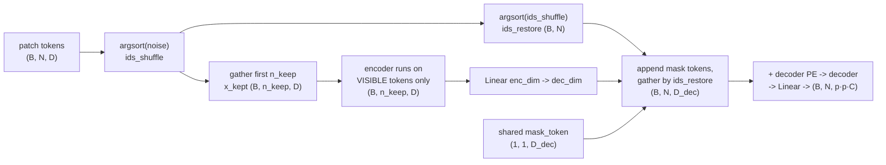
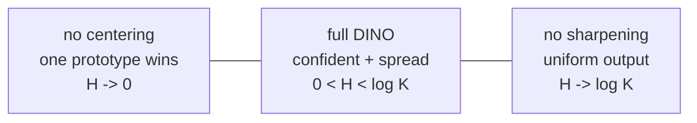

# A3 - Self-supervised learning (MAE and DINO)

Self-supervised learning (SSL) trains a representation from unlabeled images by inventing a
pretext task whose supervision comes from the data itself rather than from a human annotator.
Get that right and pretraining scales with raw image count instead of annotation budget, and
the resulting backbone transfers to detection, segmentation, retrieval, and depth with a small
labeled head on top. This assignment covers the two methods that anchor the modern picture: the
masked autoencoder (MAE), which masks most of an image and reconstructs the missing pixels with
an asymmetric encoder-decoder, and DINO, where a student network matches an exponential-moving-
average teacher's distribution over learned prototypes across crops, with two cheap operations
on the teacher (centering and sharpening) to keep the representation from collapsing.

Build both methods on a tiny ViT over 32x32 images. Implement MAE's random masking, its
decoder-side reassembly, and its masked-patch loss; then DINO's cross-view distillation loss,
the EMA teacher and centering updates, and the entropy instrument that reads out collapse. The
ViT backbone, the multi-crop augmentation, the projection head, and the training-step wiring are
provided. Everything runs on CPU with synthetic seeded tensors in under a minute.

Required reading before starting:
- He et al. 2022, "Masked Autoencoders Are Scalable Vision Learners",
  [arXiv:2111.06377](https://arxiv.org/abs/2111.06377).
- Caron et al. 2021, "Emerging Properties in Self-Supervised Vision Transformers",
  [arXiv:2104.14294](https://arxiv.org/abs/2104.14294). Algorithm 1 is the spec for the DINO
  loss, EMA, and centering.

## Lecture notes

### Why self-supervised learning

A ViT has no built-in priors, so it needs either a giant labeled dataset or a heavy
augmentation recipe to reach a good representation. Labels are the bottleneck: ImageNet-1k has
1.3 million human-labeled images, the internet has billions of unlabeled ones. SSL learns a
useful representation from the unlabeled images alone, by defining a pretext task that supplies
its own targets.

The 2018-2020 wave of image SSL was dominated by contrastive learning. Take an image, make two
random augmentations of it, and train the network so the two views of the same image land near
each other in feature space while views of different images are pushed apart. SimCLR (Chen et
al. 2020, [arXiv:2002.05709](https://arxiv.org/abs/2002.05709)) showed this works at scale with
a large batch supplying the negatives, and MoCo (He et al. 2020,
[arXiv:1911.05722](https://arxiv.org/abs/1911.05722)) replaced the large batch with a
momentum-updated encoder and a queue of past features so the negatives did not have to fit in
one batch. Contrastive methods worked, but they leaned on a steady supply of negative pairs and
the assumption that two different images are dissimilar, which is often false: two different dog
photos are pushed apart anyway. The two methods here remove the negatives entirely and take two
different routes to a non-trivial representation.

### MAE, the generative route

MAE is BERT for images done right. Mask a large fraction of the input and train the model to
reconstruct the missing part; the pretext supervision is the pixels that were hidden. The
earlier image version, BEiT (Bao et al. 2021,
[arXiv:2106.08254](https://arxiv.org/abs/2106.08254)), masked a modest fraction, predicted
discrete visual tokens rather than pixels, and ran the encoder over the whole grid including the
mask placeholders. MAE made two choices that changed the economics. First, mask 75% of the
patches, not 15%: images are spatially redundant in a way text is not, so a small mask is
solvable by copying a neighbor and teaches nothing, while a 75% mask forces the model to infer
global structure. Second, run the heavy encoder on the visible 25% only and push the mask tokens
into a small separate decoder. With three quarters of the patches dropped before the expensive
part, pretraining is roughly 3x cheaper per image. The encoder never sees a mask token, so there
is no train/inference gap, and after pretraining the decoder is discarded and the encoder kept
as the backbone.

The shared setup is the ViT patch grid. An image is $(B, C, H, W)$; with patch size $p$ it
becomes $N = (H/p)(W/p)$ patch tokens of dimension $D$.

Random masking keeps $n_{\text{keep}} = \mathrm{round}((1 - r)\,N)$ tokens per sample, chosen by
a random permutation. The mechanism is the shuffle-keep-unshuffle trick: draw one random score
per token, $\operatorname{argsort}$ to get a random permutation $\text{ids}_{\text{shuffle}}$,
keep the first $n_{\text{keep}}$ shuffled indices, and record
$\text{ids}_{\text{restore}} = \operatorname{argsort}(\text{ids}_{\text{shuffle}})$, the inverse
permutation that undoes the shuffle. The binary mask is built in shuffled order as
$n_{\text{keep}}$ zeros followed by ones, then gathered by $\text{ids}_{\text{restore}}$ back
into original patch order, so an entry is 1 exactly when its patch was dropped.



The asymmetry makes MAE cheap. The encoder is large and sees only the visible tokens; the
decoder is light and sees the full grid. The reassembly broadcasts one shared learned mask token
to the masked slots, concatenates the encoded visible tokens and the mask tokens in shuffled
order, and gathers by $\text{ids}_{\text{restore}}$ so every position holds either its encoded
visible token or a mask token, back in grid order, ready for the decoder positional embedding.

The target is the per-patch-normalized pixels (each patch made zero-mean unit-variance before
the MSE), and the loss is MSE on masked patches only:

$$\mathrm{mse}_i = \operatorname*{mean}_{\text{pixels}}\big[(\mathrm{pred}_i - \mathrm{target}_i)^2\big], \qquad
L_{\text{mae}} = \frac{\sum_i \mathrm{mask}_i \cdot \mathrm{mse}_i}{\sum_i \mathrm{mask}_i}.$$

The loss ignores visible patches entirely (the mask weight zeroes them), because predicting a
patch the model was shown is free and teaches nothing. The per-patch normalization removes a
patch's mean and contrast before the MSE, which makes the units consistent across patches.

### DINO, the discriminative route

DINO is self-distillation with no labels and no negatives. There are two networks with identical
architecture, a student and a teacher. Both see crops of the same image: the teacher sees the
large global crops, the student sees those plus several small local crops, and the student is
trained so its output distribution over a set of learned prototypes matches the teacher's. A
prototype is one of $K$ learned direction vectors; each crop's features are scored against all
$K$ of them to give a distribution over the $K$ prototypes. The teacher is not trained by
backprop at all: its weights are an exponential moving average (EMA) of the student's, so it is a
slowly moving, more stable version of the student that the student chases.

Each crop is run through a backbone ViT then a projection head, producing $(B, K)$ logits over
$K$ learned prototypes. The head is an MLP, then an L2-normalize of the hidden feature onto the
unit sphere, then a weight-normalized linear whose rows are the prototype directions. The
cross-view objective compares the teacher's distribution to the student's, with the teacher
branch stop-gradient:

$$p_{\text{teacher}} = \operatorname{softmax}\!\big((g_{\text{teacher}} - \text{center})/\tau_{\text{teacher}}\big), \qquad
\log p_{\text{student}} = \log\operatorname{softmax}(g_{\text{student}}/\tau_{\text{student}}),$$

$$H(p_{\text{teacher}}, p_{\text{student}}) = -\sum_k p_{\text{teacher}}(k)\,\log p_{\text{student}}(k),$$

summed over every (teacher global crop, student crop) pair except the matched same-crop pair (a
crop is not distilled against itself), averaged over the counted pairs. Because the student sees
small local crops and is asked to predict the teacher's distribution from a global crop, the task
is local-to-global: recognize the whole from a part.

```mermaid
flowchart TB
    IMG["image"] --> MC["multi-crop:<br/>2 global + 4 local"]
    MC --> GC["global crops"]
    MC --> LC["local crops"]
    GC --> TEA["TEACHER (EMA copy)<br/>global crops only<br/>no grad"]
    GC --> STU["STUDENT<br/>all crops"]
    LC --> STU
    TEA --> TP["softmax((g - center)/tau_t)<br/>detach()  (B, K)"]
    STU --> SP["log_softmax(g / tau_s)<br/>(B, K)"]
    TP --> L["cross-view CE<br/>over crop pairs"]
    SP --> L
    L -->|backprop| STU
    STU -.->|EMA: theta_t <- m·theta_t + (1-m)·theta_s| TEA
    TP -.->|center <- m_c·center + (1-m_c)·mean| CEN["center buffer (1, K)"]
```

The teacher moves two ways, neither by backprop. Its weights are an EMA of the student's,
$\theta_t \leftarrow m\,\theta_t + (1-m)\,\theta_s$ over every parameter and float buffer. The
center is an EMA of the batch-mean teacher logits,
$\text{center} \leftarrow m_c\,\text{center} + (1-m_c)\operatorname{mean}(g_{\text{teacher}})$,
updated outside the autograd graph.

The obvious failure mode is collapse: nothing in "match the teacher" stops both networks from
ignoring the input and emitting the same constant vector, which matches perfectly and is useless.
Centering and sharpening are the anti-collapse pair, and they push against opposite failure
modes. Subtracting the center (the running average teacher output) stops any one prototype from
dominating: if the teacher started always preferring one prototype, the center grows in that
direction and is subtracted back out, flattening the bias. Centering pushes the teacher
distribution toward uniform. Sharpening is dividing by a small teacher temperature before the
softmax, which makes the distribution peaky and confident, pushing it away from uniform. The
student temperature is larger, so the student is asked to match a sharper target than it
produces, which transfers information. Balanced, the two keep the teacher confident per image and
spread across prototypes over the batch.

The collapse instrument is the mean teacher entropy:

$$H = \operatorname*{mean}_{\text{batch}}\Big[-\sum_k p_{\text{teacher}}(k)\,\log p_{\text{teacher}}(k)\Big].$$

This one scalar reads out which way training has gone:



Remove centering and the teacher collapses onto a single prototype, entropy near 0. Remove
sharpening (use a large teacher temperature) and the teacher goes uniform, entropy near
$\log K$. Keep both and entropy sits in the middle. The two collapses are different
degeneracies, which is why one anti-collapse trick is not enough and both are needed.

What made DINO matter was an emergent property nobody trained for: the attention maps of a
DINO-trained ViT segment the main object in the image without ever being shown a segmentation
label, and the frozen features do k-nearest-neighbor classification on ImageNet at high accuracy
with no fine-tuning. The representation organizes itself around objects.

### Where these two lead

MAE and DINO are the parents of the production self-supervised backbone. DINOv2 (Oquab et al.
2023, [arXiv:2304.07193](https://arxiv.org/abs/2304.07193)) is DINO plus iBOT's patch-level
masked distillation ([arXiv:2111.07832](https://arxiv.org/abs/2111.07832)) plus a
feature-spreading regularizer plus curated data, and it is the frozen backbone a large fraction
of 2023-2026 dense-prediction systems sit on top of. CLIP, built next, is the third SSL family,
trading a hand-designed pretext for language supervision; seeing MAE and DINO first makes clear
what CLIP buys by paying for paired text.

## The assignment

Fill these holes, in order. Each is one `NotImplementedError` with a matching test; the docstring in each file gives the signature, shapes, and constraints.

1. [`random_masking()`](mae.py) in `mae.py`
2. [`append_mask_tokens()`](mae.py) in `mae.py`
3. [`mae_loss()`](mae.py) in `mae.py`
4. [`dino_loss()`](dino.py) in `dino.py`
5. [`ema_update()`](dino.py) in `dino.py`
6. [`update_center()`](dino.py) in `dino.py`
7. [`teacher_entropy()`](dino.py) in `dino.py`

### Running and validating

Activate the environment (`conda activate nanovision`), then:

```
make test     A=a03_0_ssl   # run the tests against the top-level files (the ones with holes)
make verify   A=a03_0_ssl   # run the same tests against the reference solution/
make viz      A=a03_0_ssl   # render the figures from the reference solution
make viz-mine A=a03_0_ssl   # render the figures from your own code (once the holes are filled)
```

`make test` is the command to run while working. It runs the suite in
`assignments/a03_0_ssl/tests/` against the top-level files and goes from red (the holes raise
`NotImplementedError`) to green as they are filled. `make verify` runs the identical suite
against the reference in `solution/` by setting `NANOVISION_IMPL=solution`, so it is green from
the start and shows the target. The goal is to bring `make test` to the same green as
`make verify`.

The suite checks shapes, a float64 gradcheck of the MAE encode-decode-loss pipeline and of
`dino_loss` (with the teacher params confirmed `requires_grad=False`), that masking keeps exactly
$\mathrm{round}((1-r)N)$ tokens and unshuffles correctly, that `ema_update` and `update_center`
move toward their targets, a short overfit of the MAE on one fixed batch (masked-patch MSE below
0.05), a short overfit of the DINO student against a frozen teacher, the collapse ordering, and
that no prebuilt attention/transformer module is imported.

`make viz` renders from the reference solution, so it works on a fresh checkout before any holes
are filled. `make viz-mine` runs the same script against the top-level code, which needs the
holes filled (it trains a model with them). Both write PNGs to `out/` using matplotlib's headless
Agg backend, so they work over SSH, in WSL, and in CI with no display, and the figures open
inline in VSCode. Add `SHOW=1` (for example `make viz-mine A=a03_0_ssl SHOW=1`) to also open
interactive windows when a display is available. The figures are `mae_reconstruction.png` (a
masked image and its reconstruction), `dino_collapse.png` (the three entropy curves), and
`dino_attention.png`.

What you should see when you run this. The MAE overfit drops masked-patch MSE from near 1.0
(an untrained decoder predicting the per-patch mean) toward about 8e-3 on the test batch, against
the 0.05 threshold; the single-image viz run reaches about 1e-4. A curve flat at ~1.0 means the
loss is not seeing the masked patches (check the mask weighting); one that drops then stalls high
points at the reassembly putting tokens back in the wrong order. For DINO, the overfit test
freezes the teacher and captures its output once, then trains the student against that fixed
target; the loss falls to about 0.74 of its start, not to zero, because the head's unit-norm
features give bounded cosine logits that cannot exactly match the sharp teacher target. The
collapse test runs three short variants and reads `teacher_entropy`; with $K = 128$ so
$\log K = 4.85$, full DINO settles around 1.3, no-centering near 0, and no-sharpening near 4.85.
The collapse test uses a fast-tracking teacher momentum so the degeneracy appears within ~150
steps, while the overfit test uses a frozen teacher; these are opposite teacher regimes on
purpose. These are toy artifacts on 32x32 images. They confirm the mechanisms run; they say
nothing about representation quality, which shows only at scale and is measured by a linear probe
or k-NN on held-out data.

A frozen-feature linear probe (a single linear layer trained on top of DINO features, MAE
features, and a random init on CIFAR-10) measures whether the representation is good, not just
whether the loss went down. It is not part of the tests because it needs the dataset and more
than overfit-scale compute.

## Further reading

Where this goes next:

- Oquab et al. 2023, "DINOv2: Learning Robust Visual Features without Supervision",
  [arXiv:2304.07193](https://arxiv.org/abs/2304.07193). The production backbone:
  DINO + iBOT + a feature-spreading regularizer (KoLeo) + curated data.
- Zhou et al. 2021, "iBOT: Image BERT Pre-Training with Online Tokenizer",
  [arXiv:2111.07832](https://arxiv.org/abs/2111.07832). Patch-level masked distillation, the
  DINO-to-DINOv2 bridge.
- Assran et al. 2023, "Self-Supervised Learning from Images with a Joint-Embedding Predictive
  Architecture" (I-JEPA), [arXiv:2301.08243](https://arxiv.org/abs/2301.08243). Predict in latent
  space instead of pixels, the masked-prediction route after MAE.

Optional deeper reading:

- Grill et al. 2020, "Bootstrap Your Own Latent" (BYOL),
  [arXiv:2006.07733](https://arxiv.org/abs/2006.07733). The EMA-teacher predecessor that avoids
  collapse without negatives, the idea DINO inherits.
- Chen et al. 2020, "A Simple Framework for Contrastive Learning of Visual Representations"
  (SimCLR), [arXiv:2002.05709](https://arxiv.org/abs/2002.05709). The contrastive baseline DINO
  and MAE moved away from.
- He et al. 2020, "Momentum Contrast for Unsupervised Visual Representation Learning" (MoCo),
  [arXiv:1911.05722](https://arxiv.org/abs/1911.05722).
- Bao et al. 2021, "BEiT: BERT Pre-Training of Image Transformers",
  [arXiv:2106.08254](https://arxiv.org/abs/2106.08254). The masked-token image predecessor MAE
  reworked.

Full reference list:

- He et al. 2022, MAE, [arXiv:2111.06377](https://arxiv.org/abs/2111.06377).
- Caron et al. 2021, DINO, [arXiv:2104.14294](https://arxiv.org/abs/2104.14294).
- Oquab et al. 2023, DINOv2, [arXiv:2304.07193](https://arxiv.org/abs/2304.07193).
- Zhou et al. 2021, iBOT, [arXiv:2111.07832](https://arxiv.org/abs/2111.07832).
- Grill et al. 2020, BYOL, [arXiv:2006.07733](https://arxiv.org/abs/2006.07733).
- Chen et al. 2020, SimCLR, [arXiv:2002.05709](https://arxiv.org/abs/2002.05709).
- He et al. 2020, MoCo, [arXiv:1911.05722](https://arxiv.org/abs/1911.05722).
- Bao et al. 2021, BEiT, [arXiv:2106.08254](https://arxiv.org/abs/2106.08254).
- Assran et al. 2023, I-JEPA, [arXiv:2301.08243](https://arxiv.org/abs/2301.08243).
