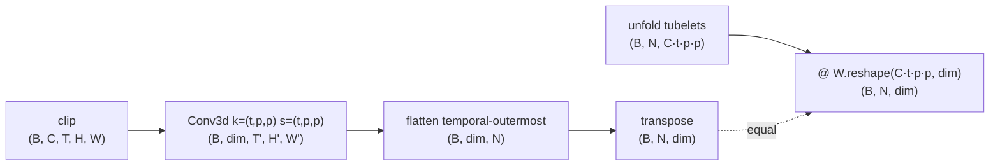
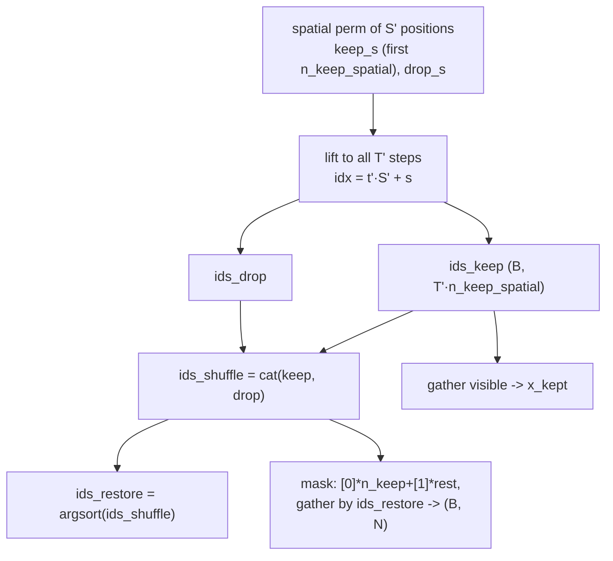

# A3.5 - Video and temporal modeling (video MAE)

Real perception is temporal: telling a person sitting down from a person standing up needs more
than one frame, a self-driving stack reasons about motion, a world model predicts the next frame.
This assignment extends the masked autoencoder (MAE) to video, and most of the extension is
mechanical. The ViT patch embedding becomes a tubelet embedding (a tubelet is a small block of
pixels spanning a few frames and one spatial patch; the embedding is a 3D strided convolution
instead of a 2D one), the masked autoencoder reconstructs space-time tubelets instead of 2D
patches, and the encoder is the same transformer run over a longer token sequence. Two things are
genuinely new. The first is the tubelet, how to turn a clip into tokens. The second is the
masking: video is far more temporally redundant than a single image, so the image recipe does not
port directly, and the fix is to mask whole spatiotemporal tubes at a very high ratio.

Build a video MAE on a tiny toy clip. Implement the tubelet embedding, the tube mask, and the
masked-tubelet reconstruction loss; the decoder-side reassembly, the video ViT encoder, and the
module wiring carry over from the image MAE and are provided. Everything runs on CPU with
synthetic seeded clips in under a minute.

Required reading before starting:
- Tong et al. 2022, "VideoMAE: Masked Autoencoders are Data-Efficient Learners for
  Self-Supervised Video Pre-Training", [arXiv:2203.12602](https://arxiv.org/abs/2203.12602).
  Tube masking and the 90-95% ratio.
- Arnab et al. 2021, "ViViT: A Video Vision Transformer",
  [arXiv:2103.15691](https://arxiv.org/abs/2103.15691). Tubelet embedding and the factorized
  space-time attention variants.

This assignment assumes the image MAE (asymmetric encoder-decoder, mask-token reassembly,
masked-patch loss) is already familiar; the additions here are exactly the parts video changes.

## Lecture notes

A clip is $(B, C, T, H, W)$. With spatial patch $p$ and temporal tubelet length $t$, the tubelet
grid is $T' = T/t$ temporal steps by $S' = (H/p)(W/p)$ spatial positions, for $N = T'S'$ tokens.

### Tubelet embedding

A `Conv3d` with kernel and stride both $(t, p, p)$ applies one shared linear map to each
non-overlapping space-time tubelet (Arnab et al. 2021 named this "tubelet embedding"). The conv
output is $(B, \dim, T', H', W')$; flattening the three grid dims temporal-outermost and
transposing gives $(B, N, \dim)$ with token index $\text{idx} = t'S' + (h'W' + w')$. This is the
exact 3D analog of the ViT patch embedding, and the same identity holds: the embed equals
unfolding each tubelet into a $(C\,t\,p\,p)$ vector and multiplying by the conv weight reshaped to
$(C\,t\,p\,p, \dim)$.



The flatten convention (temporal-outermost, $\text{idx} = t'S' + s$) is pinned because the
positional embedding, the tube mask, and the reconstruction target all index tokens this way.

### Tube masking

Video is far more redundant than a single image, because adjacent frames are nearly identical. If
patches are masked independently at random, the way image MAE does, then a masked patch in frame
$t$ almost always has an unmasked copy of nearly the same content in frame $t-1$ or $t+1$. The
reconstruction task collapses into copying the patch from the neighboring frame, which the model
solves by learning motion-compensated copying and learns little about appearance or semantics.
VideoMAE's fix is tube masking: choose a set of spatial positions to drop and drop them in every
frame, so a masked location is absent for the entire clip and cannot be copied from a neighbor in
time. To keep the task hard despite the redundancy, VideoMAE also masks an extreme fraction, 90
to 95 percent, far above image MAE's 75 percent (the 90-95% figure is stated in the VideoMAE
abstract).

Tube masking draws one spatial keep set and applies it to every temporal step, so the visible
tokens form spatiotemporal tubes. The construction is explicit (not image MAE's per-token
$\operatorname{argsort}(\text{noise})$) so the visible set is structured yet the append-and-
unshuffle reassembly from image MAE still works. Per sample: permute the $S'$ spatial positions,
keep the first $n_{\text{keep,spatial}} = \mathrm{round}((1-r)\,S')$, lift each kept and dropped
spatial index to full-token indices for all $T'$ steps ($\text{idx} = t'S' + s$), concatenate
$[\text{keep}; \text{drop}]$ into $\text{ids}_{\text{shuffle}}$, and take
$\text{ids}_{\text{restore}} = \operatorname{argsort}(\text{ids}_{\text{shuffle}})$:



The defining property is that the mask reshaped to $(B, T', S')$ is identical across all $T'$
temporal steps. The tube structure quantizes the achievable ratio to $1 - k/S'$ for an integer
number $k$ of kept spatial columns.

### Reconstruction and loss

The asymmetric MAE design carries over unchanged: the heavy encoder sees only the visible
tubelets, a shared learned mask token fills the masked slots, a light decoder sees the full grid,
and a linear head predicts $(B, N, t\,p\,p\,C)$ per-tubelet pixels. The loss is the masked-patch
MSE with the patch enlarged from $p\,p$ to $t\,p\,p$, on per-tubelet-normalized targets, averaged
over masked tubelets only:

$$L_{\text{video}} = \frac{\sum_i \mathrm{mask}_i \cdot \operatorname*{mean}_{\text{pixels}}\big[(\mathrm{pred}_i - \mathrm{target}_i)^2\big]}{\sum_i \mathrm{mask}_i},
\qquad \mathrm{target} = \text{per-tubelet-normalize}(\operatorname{tubeletify}(\mathrm{clip})).$$

### The simplification this makes, and the cost named

The encoder here uses joint space-time attention: the transformer attends over all $N = T'S'$
tubelet tokens at once, which is $O(N^2)$. For a real clip $N$ is large and that quadratic cost is
exactly why video transformers were expensive and why the field moved to factorized attention.
TimeSformer (Bertasius et al. 2021,
[arXiv:2102.05095](https://arxiv.org/abs/2102.05095)) attends within space and within time in
separate sub-layers ("divided space-time attention"), turning $O((T'S')^2)$ into
$O(T'S'^2 + T'^2 S')$, and ViViT proposes factorized-encoder and factorized-attention variants for
the same reason. Joint attention is fine on a tiny clip because it is the transformer encoder
unchanged; the README for any real system would lead with the factorization.

### Where this leads

Adding time is mostly a tokenization change plus the one masking insight that video's redundancy
forces. The tube mask and the space-time encoder make later "attend across time" operations
concrete: BEVFormer's temporal self-attention fuses bird's-eye-view features across timestamps
with the same operation on a different token set, and world models predict future latent states
from past ones, the predictive cousin of masked reconstruction over this same spatiotemporal
tokenization.

## The assignment

Fill these holes, in order. Each is one `NotImplementedError` with a matching test; the docstring in each file gives the signature, shapes, and constraints.

1. [`TubeletEmbedding.forward()`](tubelet.py) in `tubelet.py`
2. [`tube_masking()`](video_mae.py) in `video_mae.py`
3. [`video_mae_loss()`](video_mae.py) in `video_mae.py`

### Running and validating

Activate the environment (`conda activate nanovision`), then:

```
make test     A=a03_5_video   # run the tests against the top-level files (the ones with holes)
make verify   A=a03_5_video   # run the same tests against the reference solution/
make viz      A=a03_5_video   # render the figures from the reference solution
make viz-mine A=a03_5_video   # render the figures from your own code (once the holes are filled)
```

`make test` is the command to run while working. It runs the suite in
`assignments/a03_5_video/tests/` against the top-level files and goes from red (the holes raise
`NotImplementedError`) to green as they are filled. `make verify` runs the identical suite against
the reference in `solution/` by setting `NANOVISION_IMPL=solution`, so it is green from the start
and shows the target. The goal is to bring `make test` to the same green as `make verify`.

The suite checks shapes, a float64 gradcheck of the tubelet embedding and of the
encode-decode-loss pipeline, the tube property (the kept/dropped spatial pattern is identical
across all temporal steps) with an exact keep count and a correct unshuffle, the conv-vs-unfold
tubelet equivalence, a short overfit on one fixed clip (masked-tubelet MSE below 0.05), and that
no prebuilt attention/transformer module is imported (`Conv3d` is allowed, it is the tubelet
mechanism).

`make viz` renders from the reference solution, so it works on a fresh checkout before any holes
are filled. `make viz-mine` runs the same script against the top-level code, which needs the holes
filled (it trains a model with them). Both write PNGs to `out/` using matplotlib's headless Agg
backend, so they work over SSH, in WSL, and in CI with no display, and the figures open inline in
VSCode. Add `SHOW=1` (for example `make viz-mine A=a03_5_video SHOW=1`) to also open interactive
windows when a display is available. The figures are `video_mae_reconstruction.png` (the masked
clip beside its reconstruction as a filmstrip) and `video_mae_loss.png` (the overfit loss curve).

What you should see when you run this. With the toy config ($T=6$, $t=2$ so $T'=3$, 16x16 frames
at $p=4$ so $S'=16$, giving $N=48$ tubelets) and mask ratio 0.875 (keep 2 of 16 spatial columns,
so 6 visible tubelets and 42 masked), the overfit drops masked-tubelet MSE from near 1.0 (an
untrained decoder predicting the per-tubelet mean) toward about 7e-3, against the 0.05 threshold.
A curve flat at ~1.0 means the loss is not seeing the masked tubelets; one that stalls high points
at the tube indexing or the reassembly being inconsistent with the token order. Two toy
simplifications are stated so they are not mistaken for the recipe. The 0.875 ratio is below
VideoMAE's 90-95 percent, lowered only so a depth-4 model can memorize one clip. The encoder uses
joint space-time attention, which is $O(N^2)$; real systems factorize space and time. The overfit
verifies the mechanism plumbing, not that the learned representation is good; the representation
benefit of tube masking shows only at real video scale.

## Further reading

Where this goes next:

- Wang et al. 2023, "VideoMAE V2: Scaling Video Masked Autoencoders with Dual Masking",
  [arXiv:2303.16727](https://arxiv.org/abs/2303.16727). Adds decoder masking and scales the
  recipe.
- Bertasius et al. 2021, "Is Space-Time Attention All You Need for Video Understanding?"
  (TimeSformer), [arXiv:2102.05095](https://arxiv.org/abs/2102.05095). Divided space-time
  attention, the factorization joint attention avoids.

Full reference list:

- Tong et al. 2022, VideoMAE, [arXiv:2203.12602](https://arxiv.org/abs/2203.12602).
- Arnab et al. 2021, ViViT, [arXiv:2103.15691](https://arxiv.org/abs/2103.15691).
- Bertasius et al. 2021, TimeSformer, [arXiv:2102.05095](https://arxiv.org/abs/2102.05095).
- Wang et al. 2023, VideoMAE V2, [arXiv:2303.16727](https://arxiv.org/abs/2303.16727).
- He et al. 2022, MAE, [arXiv:2111.06377](https://arxiv.org/abs/2111.06377). The image MAE this
  extends to space-time.
