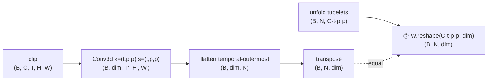
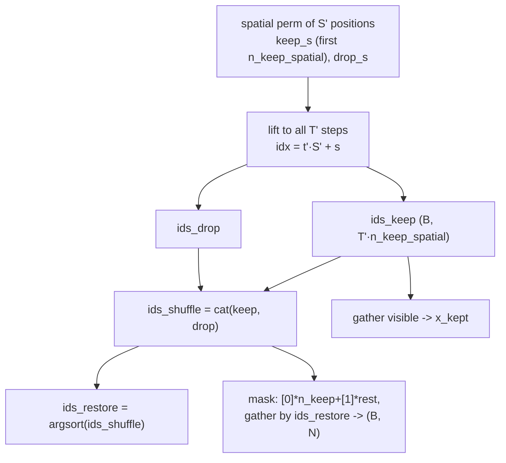

# A3.5 - Video and temporal modeling (video MAE)

Real perception is temporal: telling a person sitting down from a person standing up needs more
than one frame, a self-driving stack reasons about motion, a world model predicts the next frame.
This assignment extends the masked autoencoder (MAE) to video, and most of the extension is
mechanical. The transformer encoder is unchanged, run over a longer token sequence. Two things
are genuinely new. The first is how a clip becomes tokens: instead of one token per square patch
of one frame, a token covers a small block of pixels spanning several consecutive frames. The
second is which tokens to hide: video is far more temporally redundant than a single image, so
the image masking recipe does not port directly, and the fix is to hide whole spatiotemporal
tubes at a very high ratio.

Build a video MAE on a tiny toy clip. Implement the tubelet embedding, the tube mask, and the
masked-tubelet reconstruction loss; the decoder-side reassembly, the video ViT encoder, and the
module wiring carry over from the image MAE and are provided. Everything runs on CPU with
synthetic seeded clips in under a minute.

Required reading before starting:
- Tong et al. 2022, "VideoMAE: Masked Autoencoders are Data-Efficient Learners for
  Self-Supervised Video Pre-Training", [arXiv:2203.12602](https://arxiv.org/abs/2203.12602).
  Tube masking and the 90-95% ratio.
- Arnab et al. 2021, "ViViT: A Video Vision Transformer",
  [arXiv:2103.15691](https://arxiv.org/abs/2103.15691). Tubelet embedding and the factorized
  space-time attention variants.

## Lecture notes

### What the video MAE inherits from the image MAE

The image masked autoencoder trains a representation with no labels by hiding most of an image
and asking the network to reconstruct the hidden part. Four pieces of its machinery are reused
here verbatim, and the video-specific sections below are written on top of them, so they are
restated here rather than assumed.

The first is the asymmetric encoder-decoder. A large transformer encoder runs on the visible
tokens only, never on placeholders for the hidden ones. A small decoder then sees the full grid,
with the hidden slots filled by a stand-in, and predicts pixels. Dropping most tokens before the
expensive stage is where the training-cost saving comes from, and the encoder is the part kept
afterwards as a backbone; the decoder is thrown away.

The second is the way the visible subset is selected and later put back. Selecting a subset with
a boolean test does not batch: different samples would keep different counts, and the result is
not a rectangular tensor. So the selection is done with permutations instead. A permutation of
$N$ items is stored as an index vector $\pi$ where $\pi[i]$ names the source slot whose content
lands in output slot $i$; applying it is $y[i] = x[\pi[i]]$, which PyTorch spells `gather`. As a
matrix this is $P$ with $P_{i,\pi[i]} = 1$, one 1 per row and per column, so $P$ is orthogonal
and $P^{-1} = P^{\top}$.

The index-vector form of that inverse is an $\operatorname{argsort}$. Sorting the values of $\pi$
into increasing order returns the slots they came from, and since $\pi$ holds each of
$0,\dots,N-1$ exactly once, entry $j$ of the result is the slot $i$ where the value $j$ sat, that
is $\pi^{-1}[j]$. So for a permutation, and only for a permutation, $\operatorname{argsort}$ is
inversion:

$$\text{ids}_{\text{restore}} = \operatorname{argsort}(\text{ids}_{\text{shuffle}}),
\qquad \text{ids}_{\text{restore}}[\,\text{ids}_{\text{shuffle}}[i]\,] = i.$$

The image MAE uses this as shuffle-keep-unshuffle. Draw one random score per token,
$\operatorname{argsort}$ the scores into a random permutation $\text{ids}_{\text{shuffle}}$, keep
the first $n_{\text{keep}}$ entries as the visible set, and record
$\text{ids}_{\text{restore}}$. The binary mask is built in shuffled order as $n_{\text{keep}}$
zeros followed by ones and gathered by $\text{ids}_{\text{restore}}$ back into grid order, so an
entry is 1 exactly when that token was dropped.

The third piece is the reassembly. The decoder needs a full grid, so the encoded visible tokens
are concatenated with copies of one shared learned vector, the mask token, in shuffled order, and
that sequence is gathered by $\text{ids}_{\text{restore}}$. Every grid position then holds either
its own encoded token or a mask token, and the decoder positional embedding tells the decoder
which position each slot is. The only thing this step requires is that
$\text{ids}_{\text{restore}}$ invert the order in which visible and dropped indices were
concatenated. Nothing about it requires the keep set to be random per token, which is why the
structured mask introduced below can drop straight into the same code.

The fourth piece is the target. The loss compares predicted pixels against per-patch-normalized
pixels: each patch is separately shifted to zero mean and scaled to unit variance before the
squared error. This puts every patch on the same scale, so a bright high-contrast patch does not
dominate the gradient, and He et al. report better representations from normalized targets than
from raw ones. It also fixes the meaning of the loss value, which is used below to read the
training curve.

Everything on that list survives the move to video unchanged. Only the tokenization and the
choice of what to hide have to change.

### From frames to tubelets

A clip is $(B, C, T, H, W)$: batch, channels, $T$ frames, and $H \times W$ pixels each. The
obvious tokenization is to reuse the ViT patch embedding on every frame independently, giving
$T \cdot (H/p)(W/p)$ tokens for spatial patch size $p$. That works, and ViViT calls it uniform
frame sampling, but it has two costs. The token count grows linearly in $T$, and every token is a
purely spatial object, so any relation between a location and its own recent past has to be
rebuilt by attention from scratch.

The alternative is to cut the clip along time as well. A tubelet is a $t \times p \times p$ block
of pixels over all $C$ channels: one spatial patch, extended across $t$ consecutive frames. It is
the natural 3D analog of a patch, and it is the token used here. With temporal tubelet length $t$
the grid is

$$T' = T/t \ \text{temporal steps}, \qquad H' = H/p, \quad W' = W/p, \quad S' = H'W'
\ \text{spatial positions}, \qquad N = T'S' \ \text{tokens}.$$

Compared to per-frame patches this cuts the token count by $t$, and each token already carries a
short slice of local motion before any attention runs. ViViT introduced tubelet embedding as the
alternative to uniform frame sampling; the toy here uses $t = 2$.

### Tubelet embedding as a strided convolution

Each tubelet has to be mapped to a vector of length $\dim$ by one shared linear map, the same map
for every tubelet. A `Conv3d` whose kernel size and stride are both $(t, p, p)$ does exactly that. Equal
kernel and stride means the receptive fields tile the clip without overlapping and without gaps,
so each output position sees exactly one tubelet, and a convolution applies the same weights at
every position by construction.

The equivalence is worth writing out, because a test checks it to $10^{-5}$. The conv output at
grid position $(t', h', w')$ and output channel $d$ is

$$y_{d,t',h',w'} = b_d + \sum_{c,i,j,k} W_{d,c,i,j,k}\; V_{c,\; t't+i,\; h'p+j,\; w'p+k},$$

with $i \in [0,t)$, $j,k \in [0,p)$. The index arithmetic $t't+i$ comes from the stride equalling
the kernel size. Flatten $(c,i,j,k)$ into one axis of length $Ctpp$ on both sides and the sum is a
plain dot product: the tubelet unfolded into a $Ctpp$-vector, dotted with row $d$ of the weight
reshaped to $(\dim, Ctpp)$. Stack the output channels and the whole embedding is one matrix
multiply,

$$\text{embed}(V) = \operatorname{tubeletify}(V)\, W_{\text{flat}}^{\top} + b,
\qquad \operatorname{tubeletify}(V) \in \mathbb{R}^{B \times N \times Ctpp},$$

where `tubeletify` in `backbone.py` is the unfold, laid out $(C, t, p_{\text{row}}, p_{\text{col}})$
to match the conv weight layout. The conv is an implementation of that matrix multiply, not a
different operation.



The conv output is $(B, \dim, T', H', W')$, so turning it into a sequence needs a flatten order.
The order used everywhere here is temporal-outermost:

$$\text{idx} = t'S' + s, \qquad s = h'W' + w'.$$

Token 0 through $S'-1$ are the first temporal step, the next $S'$ are the second, and so on.
`flatten(2)` on the conv output produces exactly this. The convention is pinned rather than
incidental: the positional embedding is a learned table with one row per token index, the tube
mask is built by arithmetic on $t'$ and $s$, and `tubeletify` produces the reconstruction target
in the same order. All three break together if the flatten order changes.

### Why video needs a different mask

Adjacent video frames are nearly identical. That redundancy makes independent per-token masking,
the image recipe, a bad pretext task. If tokens are dropped independently at random, a hidden
tubelet almost always has a visible tubelet at the same spatial location one step earlier or
later in time, holding nearly the same content shifted by a small motion. Reconstruction then
collapses into motion-compensated copying: find the matching block in a neighboring frame, shift
it, paste it. This is the same operation video codecs perform with block matching, it is cheap to
learn, and a network that has learned it has learned almost nothing about appearance or
semantics.

VideoMAE's fix is tube masking. Draw the set of spatial positions to drop once, then drop those
positions in every temporal step. A dropped location is absent for the whole clip, so there is no
temporal neighbor to copy from, and filling it requires inferring content from other spatial
locations and from how the scene moves.

Removing the temporal shortcut is not sufficient on its own, because the remaining spatial
redundancy is still high. VideoMAE therefore also raises the masked fraction to 90-95 percent,
against 75 percent for the image MAE (the 90-95% figure is stated in the VideoMAE abstract). The
higher ratio is affordable for the same reason as in the image MAE: the encoder only pays for the
tokens it sees.

### Tube masking

The construction cannot be the image MAE's per-token $\operatorname{argsort}(\text{noise})$,
because the keep set is structured rather than independent per token. It is built explicitly
instead, in a form that still produces an $\text{ids}_{\text{shuffle}}$ and an
$\text{ids}_{\text{restore}}$, so the reassembly described above still applies. Per sample:

1. Permute the $S'$ spatial positions at random and keep the first
   $n_{\text{keep,spatial}} = \mathrm{round}((1-r)\,S')$ of them, where $r$ is the requested mask
   ratio. Call the two halves $\text{keep}_s$ and $\text{drop}_s$.
2. Lift each spatial index to full-token indices for all $T'$ temporal steps using
   $\text{idx} = t'S' + s$. A kept spatial position contributes $T'$ token indices, one per step.
3. Concatenate $[\text{keep}; \text{drop}]$ into $\text{ids}_{\text{shuffle}}$ and take
   $\text{ids}_{\text{restore}} = \operatorname{argsort}(\text{ids}_{\text{shuffle}})$.

$\text{ids}_{\text{shuffle}}$ is still a permutation of $0,\dots,N-1$, just no longer a uniformly
random one, so the inverse-by-argsort identity and the gather-based mask and reassembly all hold
as before.



The defining property, and the one the test checks, is that the mask reshaped to $(B, T', S')$ is
identical across all $T'$ temporal steps. Per-token masking fails that check; tube masking passes
it by construction.

One consequence of the tube structure is that the achievable mask ratio is quantized. Whole
spatial columns are kept, so with $k$ kept columns the ratio is exactly $1 - k/S'$ and nothing in
between is reachable. On the toy grid $S' = 16$, so the reachable ratios near the top are
$1 - 1/16 = 0.9375$ and $1 - 2/16 = 0.875$. Requesting $r = 0.9$ gives
$\mathrm{round}(0.1 \times 16) = 2$ kept columns, an effective ratio of $0.875$; requesting
$r = 0.95$ gives 1 column and an effective $0.9375$. The quantization is coarse here only because
$S'$ is small. At 224x224 with $p = 16$ the spatial grid is 14 by 14, so $S' = 196$ and the steps
are well under a percent.

### Reconstruction and the masked-tubelet loss

The asymmetric pipeline carries over with the patch replaced by the tubelet. The encoder sees
only the visible tubelets, the shared mask token fills the dropped slots, the light decoder sees
the full grid of $N$ tokens, and a linear head predicts $(B, N, t\,p\,p\,C)$ per-tubelet pixels.
The loss is the masked-patch MSE with the patch enlarged from $p\,p$ to $t\,p\,p$, on
per-tubelet-normalized targets, averaged over masked tubelets only:

$$L_{\text{video}} = \frac{\sum_i \mathrm{mask}_i \cdot \operatorname*{mean}_{\text{pixels}}\big[(\mathrm{pred}_i - \mathrm{target}_i)^2\big]}{\sum_i \mathrm{mask}_i},
\qquad \mathrm{target} = \text{per-tubelet-normalize}(\operatorname{tubeletify}(\mathrm{clip})).$$

The normalization also sets the scale of the number this loss reports, which makes the training
curve readable. A target tubelet has zero mean and unit variance, so a prediction of all zeros,
which after undoing the normalization means predicting every pixel of a tubelet equal to that
tubelet's own mean, scores

$$\operatorname*{mean}_{\text{pixels}}\big[(0 - \mathrm{target}_i)^2\big] = \operatorname{Var}(\mathrm{target}_i) \approx 1$$

on any tubelet with content in it. A completely flat tubelet is the exception: the normalization
divides by $\sqrt{\operatorname{Var} + \varepsilon}$ with $\varepsilon = 10^{-6}$, so a constant
tubelet normalizes to zeros and scores 0. A loss near 1 therefore means the model is doing no
better than guessing each hidden tubelet's mean brightness, and the distance below 1 is the share
of the hidden content actually recovered.

### Joint versus factorized space-time attention

The encoder here uses joint space-time attention: the transformer attends over all $N = T'S'$
tubelet tokens in one sequence, with no distinction between the space and time axes. Attention
forms a score for every ordered pair of tokens, so this builds an $N \times N$ matrix and costs
$O(N^2)$ in both time and memory. With $N = T'S'$ that is $O(T'^2S'^2)$, quadratic in the number
of temporal steps and quadratic in the number of spatial positions at the same time, which is why
early video transformers were expensive.

TimeSformer's divided space-time attention splits one attention layer into two. Each token first
attends only to the $T'$ tokens sharing its spatial position across time, then only to the $S'$
tokens sharing its temporal step. A token therefore attends to $T' + S'$ others instead of
$T'S'$, and the layer costs

$$O\big(N(T' + S')\big) = O\big(T'S'^2 + T'^2S'\big)$$

instead of $O(T'^2S'^2)$. The information still mixes across both axes, just over two sub-layers
rather than one. On the toy grid ($T' = 3$, $S' = 16$, $N = 48$) the pair counts are 2304 joint
against 912 divided, a gap too small to care about. On a 16-frame 224x224 clip at $p = 16$ and
$t = 2$, $T' = 8$ and $S' = 196$ give $N = 1568$, and the counts are 2,458,624 against 319,872.

ViViT proposes several factorizations of the same idea. Its factorized encoder runs a spatial
transformer over the tokens within each temporal step, then a temporal transformer over the
per-step summaries. Its factorized self-attention does the split inside each block, spatial
attention followed by temporal attention, as TimeSformer does. Its factorized dot-product
attention keeps one attention layer and splits the heads instead, half attending spatially and
half temporally, with the outputs concatenated.

Joint attention is used here because it is the transformer encoder unchanged, and at $N = 48$ the
quadratic cost is irrelevant. Any system at real video resolution factorizes.

### Where this leads

Adding time is a tokenization change plus the one masking change that video's redundancy forces.
Both recur later in the course.

BEVFormer's temporal self-attention is the same idea applied to a different token set. Its tokens
are cells of a bird's-eye-view grid, a top-down feature map in ego coordinates rather than a
space-time patch grid, and its temporal step warps the previous frame's grid by the measured ego
motion so that a cell lines up with the same piece of the world, then attends the current cell
against that warped history. The token layout and the alignment step differ; the operation, one
attention over tokens indexed by both position and time, does not.

World models replace reconstruction of hidden content with prediction of future content. A masked
autoencoder hides a random subset of a clip and reconstructs it from the rest; a world model
conditions on the past latent state and the action taken and predicts the next latent state.
Neither needs human labels, and the world model is the harder case: the hidden part is always in
the future, so there is no later frame to interpolate from.

## The assignment

Fill these holes, in order. Each is one `NotImplementedError` with a matching test; the docstring in each file gives the signature, shapes, and constraints.

1. [`TubeletEmbedding.forward()`](tubelet.py) in `tubelet.py`
2. [`tube_masking()`](video_mae.py) in `video_mae.py`
3. [`video_mae_loss()`](video_mae.py) in `video_mae.py`

### Running and validating

Activate the environment (`conda activate nanovision`), then:

```
make test     A=a03_5_video   # run the tests against the top-level files (the ones with holes)
make verify   A=a03_5_video   # run the same tests against the reference solution/
make viz      A=a03_5_video   # render the figures from the reference solution
make viz-mine A=a03_5_video   # render the figures from your own code (once the holes are filled)
```

`make test` is the command to run while working. It runs the suite in
`assignments/a03_5_video/tests/` against the top-level files and goes from red (the holes raise
`NotImplementedError`) to green as they are filled. `make verify` runs the identical suite against
the reference in `solution/` by setting `NANOVISION_IMPL=solution`, so it is green from the start
and shows the target. The goal is to bring `make test` to the same green as `make verify`.

The suite checks shapes; a gradcheck of the tubelet embedding and of the encode-decode-loss
pipeline; the tube property (the kept/dropped spatial pattern is identical across all temporal
steps) with an exact keep count and a correct unshuffle; the conv-vs-unfold tubelet equivalence
derived above; a short overfit on one fixed clip (masked-tubelet MSE below 0.05); and that no
prebuilt attention/transformer module is imported (`Conv3d` is allowed, it is the tubelet
mechanism).

A gradcheck (`torch.autograd.gradcheck`, wrapped in `nanovision/gradcheck.py`) compares the
gradient autograd derives from your forward against a numerical estimate obtained by nudging each
input entry by $\varepsilon$ and measuring how the output moves. It runs in float64 because the
finite-difference estimate in float32 is too noisy to tell a correct gradient from a subtly wrong
one. It catches wrong reductions, wrong index arithmetic, and detached tensors that a shape test
cannot see.

The overfit test is the end-to-end signal. One fixed batch of eight clips is trained with the mask
held fixed by a re-seed each step, so the only thing being measured is whether the pipeline can
memorize a single target. A pipeline with a broken index convention cannot, even given unlimited
steps.

`make viz` renders from the reference solution, so it works on a fresh checkout before any holes
are filled. `make viz-mine` runs the same script against the top-level code, which needs the holes
filled (it trains a model with them). Both write PNGs to `out/` using matplotlib's headless Agg
backend, so they work over SSH, in WSL, and in CI with no display, and the figures open inline in
VSCode. Add `SHOW=1` (for example `make viz-mine A=a03_5_video SHOW=1`) to also open interactive
windows when a display is available. The figures are `video_mae_reconstruction.png` (the masked
clip beside its reconstruction as a filmstrip) and `video_mae_loss.png` (the overfit loss curve).

What you should see when you run this. The toy config is $T = 6$ frames at $t = 2$, so $T' = 3$;
16x16 frames at $p = 4$, so $S' = 16$; giving $N = 48$ tubelets. Mask ratio 0.875 keeps 2 of the
16 spatial columns, so 6 tubelets are visible and 42 are hidden. Over 800 Adam steps the
masked-tubelet MSE starts a little above 1 and settles around $7 \times 10^{-3}$, against the 0.05
threshold. Read those numbers against the scale derived above: 1 is the mean-brightness guess, so
a curve that stays flat near 1 means the loss is not seeing the masked tubelets, and one that
falls but stalls high points at the tube indexing or the reassembly disagreeing with the token
order.

Two toy simplifications are worth naming so they are not mistaken for the recipe. The 0.875 ratio
is below VideoMAE's 90-95 percent, lowered only so a depth-4 model can memorize one clip. And the
encoder uses joint space-time attention, which real systems factorize. The overfit verifies the
mechanism plumbing, not that the learned representation is good; the representation benefit of
tube masking shows only at real video scale.

## Further reading

Where this goes next:

- Wang et al. 2023, "VideoMAE V2: Scaling Video Masked Autoencoders with Dual Masking",
  [arXiv:2303.16727](https://arxiv.org/abs/2303.16727). Adds decoder masking and scales the
  recipe.
- Bertasius et al. 2021, "Is Space-Time Attention All You Need for Video Understanding?"
  (TimeSformer), [arXiv:2102.05095](https://arxiv.org/abs/2102.05095). Divided space-time
  attention, the factorization joint attention avoids.

Full reference list:

- Tong et al. 2022, VideoMAE, [arXiv:2203.12602](https://arxiv.org/abs/2203.12602).
- Arnab et al. 2021, ViViT, [arXiv:2103.15691](https://arxiv.org/abs/2103.15691).
- Bertasius et al. 2021, TimeSformer, [arXiv:2102.05095](https://arxiv.org/abs/2102.05095).
- Wang et al. 2023, VideoMAE V2, [arXiv:2303.16727](https://arxiv.org/abs/2303.16727).
- He et al. 2022, MAE, [arXiv:2111.06377](https://arxiv.org/abs/2111.06377). The image MAE this
  extends to space-time.
