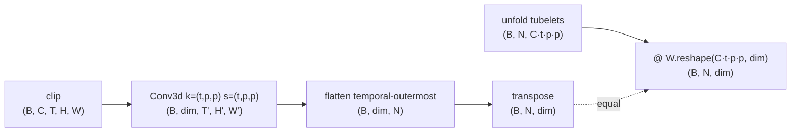
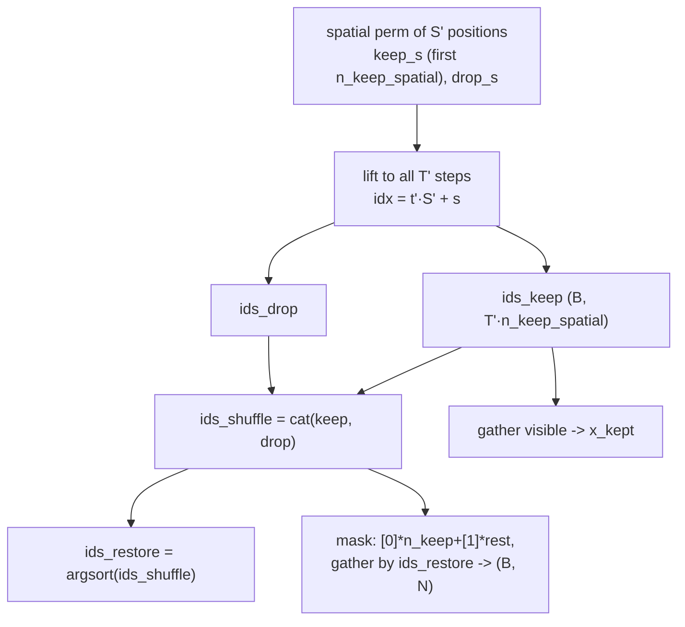

# A3.5 - Video and temporal modeling (video MAE)

## Motivation

Everything up to here treats an image as a static grid. Real perception is temporal:
a self-driving stack reasons about motion, a world model predicts the next frame, and
telling a person sitting down from a person standing up needs more than one frame. This
assignment extends the ViT and the MAE you already built to video, and most of the
extension is mechanical. The ViT patch embedding becomes a tubelet embedding (a tubelet
is a small block of pixels spanning a few frames and one spatial patch; the embedding is
a 3D strided convolution instead of a 2D one), the masked autoencoder (MAE) reconstructs
space-time tubelets instead of 2D patches, and the encoder is the same transformer run
over a longer token sequence. Two components are new, which is why this is a compact assignment
rather than a full one. The first is the tubelet, how to turn a clip into tokens. ViViT
(Arnab et al., 2021, [arxiv.org/abs/2103.15691](https://arxiv.org/abs/2103.15691))
named the standard choice, "tubelet embedding," a non-overlapping 3D convolution with
kernel and stride `(t, p, p)` that maps each `t x p x p` space-time block to one token.
The second is the masking. VideoMAE (Tong et al., 2022,
[arxiv.org/abs/2203.12602](https://arxiv.org/abs/2203.12602)) showed that the image
recipe does not port directly, because video is temporally redundant in a way images
are not.

Video is far more redundant than a single image, because adjacent frames are nearly
identical. If you mask patches independently at random, the way image MAE does, then a masked
patch in frame `t` almost always has an unmasked copy of nearly the same content in
frame `t-1` or `t+1`. The reconstruction task collapses into "copy the patch from the
neighboring frame," which the model solves by learning motion-compensated copying and
learns little about appearance or semantics. VideoMAE's fix is tube masking: choose a
set of spatial positions to drop and drop them in every frame, so a masked location is
absent for the entire clip and cannot be copied from a neighbor in time. To keep the
task hard despite the redundancy, VideoMAE also masks an extreme fraction, 90 to 95
percent, far above image MAE's 75 percent (the 90-95% figure is stated directly in the
VideoMAE abstract). Tube masking plus a very high ratio makes masked
autoencoding work for video, and you reproduce that contrast on a tiny clip here.

The architectural simplification this assignment makes, and that you should know it is
making, is joint space-time attention: the transformer encoder attends over all `N = T' * S'`
tubelet tokens at once, which is `O(N^2)`. For a real clip `N` is large and that
quadratic cost is exactly why video transformers were expensive and why the field moved
to factorized attention. TimeSformer (Bertasius et al., 2021,
[arxiv.org/abs/2102.05095](https://arxiv.org/abs/2102.05095)) attends within space and
within time in separate sub-layers ("divided space-time attention"), turning
`O((T'S')^2)` into `O(T' S'^2 + T'^2 S')`, and ViViT proposes factorized-encoder and
factorized-attention variants for the same reason. Joint attention is fine here because
`N = 48`; at scale it is not, and the README for any real system would lead with the
factorization. We build joint attention because it is the transformer encoder unchanged, and
name the cost so the simplification is explicit.

This bridges forward in two directions. A11.5c (BEVFormer) uses temporal self-attention
to fuse BEV features across timestamps, which is the same "attend across time" operation
on a different token set; having built tube masking and a space-time encoder makes that
temporal attention concrete rather than abstract. A12 (world models) predicts future
latent states from past ones, the predictive cousin of masked reconstruction; the
spatiotemporal tokenization here is the input representation those models operate on.
A3.5 covers the tubelet tokenization and the tube mask. Adding time is mostly a
tokenization change, plus one masking insight that the redundancy of video forces
on you.

## Background

A clip is `(B, C, T, H, W)`. With spatial patch `p` and temporal tubelet `t`, the
tubelet grid is `T' = T/t` temporal steps by `S' = (H/p)*(W/p)` spatial positions, for
`N = T' * S'` tokens. The tiny config here is `T=6, t=2` (so `T'=3`), `16x16` frames
with `p=4` (so `S'=16`), giving `N = 48`.

### Tubelet embedding

A `Conv3d` with kernel and stride both `(t, p, p)` applies one shared linear map to
each non-overlapping space-time tubelet:

    TubeletEmbed(video) = flatten(Conv3d_{k=(t,p,p), s=(t,p,p)}(video))   # (B, N, dim)

The conv output is `(B, dim, T', H', W')`; flattening the three grid dims
temporal-outermost and transposing gives `(B, N, dim)` with token index
`idx = t' * S' + (h'*W' + w')`. This is the exact 3D analog of the ViT patch embedding, and the
same identity holds: the embed equals unfolding each tubelet into a `(C*t*p*p)` vector
and multiplying by the conv weight reshaped to `(C*t*p*p, dim)`.

The flatten convention (temporal-outermost, `idx = t'*S' + s`) is pinned because the
positional embedding, the tube mask, and the reconstruction target all index tokens
this way; transposing it silently breaks the tube test.

### Tube masking

Tube masking draws one spatial keep set and applies it to every temporal step, so the
visible tokens form spatiotemporal tubes. The construction has to be explicit (not
image MAE's per-token `argsort(noise)`) so the visible set is structured yet the append and
unshuffle reassembly from image MAE still works. Per sample: permute the `S'` spatial
positions, keep the first `n_keep_spatial = round((1-r)*S')`, then lift each kept and
dropped spatial index to full-token indices for all `T'` steps (`idx = t'*S' + s`),
concatenate `[keep; drop]` into `ids_shuffle`, and take `ids_restore =
argsort(ids_shuffle)`:

The defining property, and the centerpiece test, is that the mask reshaped to
`(B, T', S')` is identical across all `T'` temporal steps. With `r = 0.875` (the toy
value), keep 2 of 16 spatial columns, so `n_keep = 3*2 = 6` visible tubelets and 42
masked. VideoMAE itself uses 90 to 95 percent; the toy lowers it to 0.875 only so a
depth-4 model can memorize one clip, and the tube structure quantizes the achievable
ratio to `1 - k/16`.

### Reconstruction and loss

The asymmetric MAE design carries over unchanged: the heavy encoder sees only the 6
visible tubelets, a shared learned mask token fills the 42 masked slots, a light decoder
sees the full 48-token grid, and a linear head predicts `(B, N, t*p*p*C)` per-tubelet
pixels. The loss is MAE's masked-patch MSE with the patch enlarged from `p*p` to
`t*p*p`, on per-tubelet-normalized targets, averaged over masked tubelets only:

    target  = per_tubelet_normalize(tubeletify(clip))     # (B, N, t*p*p*C)
    L_video = sum_i mask_i * mean_pix((pred_i - target_i)^2) / sum_i mask_i

## What you'll implement

Three holes, one shared and two local:

- `TubeletEmbedding.forward` (`tubelet.py`, shared as `nanovision.transformer.TubeletEmbedding`).
- `tube_masking` (`video_mae.py`): the structured tube mask.
- `video_mae_loss` (`video_mae.py`): masked-tubelet MSE.

The tubelet helpers (`tubeletify`/`untubeletify`/`per_tubelet_normalize`), the video ViT
encoder, the mask-token reassembly, and the `VideoMAE` module wiring are provided in
`backbone.py` and `video_mae.py`. You write only the three mechanism bodies.

## Tasks

1. `TubeletEmbedding.forward` (`tubelet.py`): apply `self.proj` (a `Conv3d` with
   kernel and stride `(t, p, p)`), then `flatten(2).transpose(1, 2)` to `(B, N, dim)`,
   temporal-outermost. Teaches that adding a time axis is one more strided convolution
   dimension, not a new mechanism (ViViT tubelet embedding).
2. `tube_masking` (`video_mae.py`): draw one per-sample spatial keep set and apply it
   to all `T'` temporal steps; build `ids_keep`/`ids_drop`/`ids_shuffle`/`ids_restore`
   explicitly, gather `x_kept`, and build the original-order `mask`. Teaches why video
   needs tube masking instead of image MAE's per-token masking: a per-token mask leaks through
   time, a tube does not.
3. `video_mae_loss` (`video_mae.py`): per-tubelet MSE (mean over the pixel dim),
   averaged over masked tubelets only via the `mask` weight. Teaches that the video loss
   is the image MAE loss on a bigger patch, not a new objective.

## How to verify

From the repo root with the `nanovision` env active:

    make test A=a03_5_video      # your top-level code (red until you fill the holes)

The tests run in this order:

1. `tests/test_shapes.py` - TubeletEmbedding `(2,3,6,16,16) -> (2,48,64)`; tube_masking
   keeps `n_keep = 6` with `mask (2,48)` summing to 42; VideoMAE forward gives
   `pred (2,48,96)` (`t*p*p*C = 2*4*4*3 = 96`).
2. `tests/test_gradcheck.py` - float64 gradcheck of TubeletEmbedding w.r.t. its conv
   weight, and of the tube-mask encode -> decode -> loss pipeline w.r.t. that weight.
3. `tests/test_tube_masking.py` - the centerpiece: the kept/dropped spatial pattern is
   identical across all temporal steps (the tube property), the keep count is exact,
   the unshuffle restores visible tubelets to their original positions, deterministic
   under a fixed seed.
4. `tests/test_tubelet_equivalence.py` - the Conv3d tubelet embed equals
   unfold-into-tubes times the reshaped conv weight (the 3D analog of the ViT
   patch-equivalence test).
5. `tests/test_overfit.py` - the VideoMAE memorizes one fixed toy-clip batch (fixed
   tube mask) to masked-tubelet MSE < 0.05.
6. `tests/test_forbidden_imports.py` - the top-level files, the solution, and the
   `nanovision.transformer` shim use no prebuilt attention/transformer module, fused
   SDPA, `nn.LayerNorm`, `timm`, `transformers`, or `torchvision.models`. `Conv3d` is
   allowed: it is the tubelet mechanism.

To confirm the reference passes and render the filmstrip:

    make verify A=a03_5_video    # reference solution (should be green)
    make viz    A=a03_5_video    # writes the masked-vs-reconstructed filmstrip to out/

The reference implementation is visible in `solution/tubelet.py` and
`solution/video_mae.py`; read it if you get stuck.

## Compute notes

Everything gates on CPU with synthetic seeded clips and no download. `T=6, t=2`,
`16x16` frames, `p=4`, so `N = 48` tubelets; encoder dim 64 depth 4, decoder dim 48
depth 2, batch 8, Adam lr 2e-3, 800 steps with a fixed tube mask, reaching
masked-tubelet MSE around 7e-3 against the 0.05 threshold. Because the target is
per-tubelet-normalized, an untrained decoder predicting the mean starts near MSE 1.0,
so a healthy curve drops from ~1.0 toward ~1e-2; a curve flat at ~1.0 means the loss is
not seeing the masked tubelets, and one that stalls high points at the tube indexing or
the reassembly being inconsistent with the token order. The whole setup fits 12GB
trivially; the gating signal is correctness, not scale. The overfit test verifies the
mechanism plumbing, not that the learned representation is good (as A3 notes for its
linear probe): the representation benefit of tube masking shows only at real video scale.

Two simplifications the toy makes, stated so they are not mistaken for the recipe. The
masking ratio is 0.875, below VideoMAE's 90-95 percent, lowered only so a tiny model
overfits one clip. The encoder uses joint space-time attention (the transformer encoder over all
48 tokens), which is `O(N^2)`; real systems factorize space and time (TimeSformer,
ViViT) to avoid the quadratic cost.

## Stretch goals

1. Raise the mask ratio toward VideoMAE's 90-95 percent (keep 1 of 16 columns,
   `r = 0.9375`) and see how much harder the overfit becomes; this is the redundancy
   argument made quantitative.
2. Central-frame initialization (ViViT): initialize the `Conv3d` tubelet weight from a
   pretrained 2D patch-embed by placing the 2D kernel on the center temporal slice and
   zeroing the rest, so at init the tubelet embed equals the center frame's 2D patch
   embed. The standard image-to-video bootstrap.
3. Factorized attention: replace joint space-time attention with a divided scheme
   (attend within space, then within time, per block) and compare token-count scaling.
   This is the TimeSformer/ViViT contribution.
4. Per-frame (uniform-frame) embedding with `t=1` instead of tubelets, and compare what
   the reconstruction captures; this is ViViT's simpler tokenization baseline.

## Further reading

- Tong et al., "VideoMAE: Masked Autoencoders are Data-Efficient Learners for
  Self-Supervised Video Pre-Training" (2022,
  [arxiv.org/abs/2203.12602](https://arxiv.org/abs/2203.12602)). Tube masking and the
  90-95% ratio this assignment builds.
- Wang et al., "VideoMAE V2: Scaling Video Masked Autoencoders with Dual Masking" (2023,
  [arxiv.org/abs/2303.16727](https://arxiv.org/abs/2303.16727)). Adds decoder masking
  and scales the recipe.
- Arnab et al., "ViViT: A Video Vision Transformer" (2021,
  [arxiv.org/abs/2103.15691](https://arxiv.org/abs/2103.15691)). Tubelet embedding,
  central-frame initialization, and the factorized space-time attention variants.
- Bertasius et al., "Is Space-Time Attention All You Need for Video Understanding?"
  (TimeSformer, 2021, [arxiv.org/abs/2102.05095](https://arxiv.org/abs/2102.05095)).
  Divided space-time attention, the factorization joint attention avoids.
- He et al., "Masked Autoencoders Are Scalable Vision Learners" (2022,
  [arxiv.org/abs/2111.06377](https://arxiv.org/abs/2111.06377)). The image MAE (A3) this
  extends to space-time.
