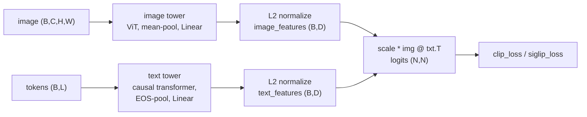
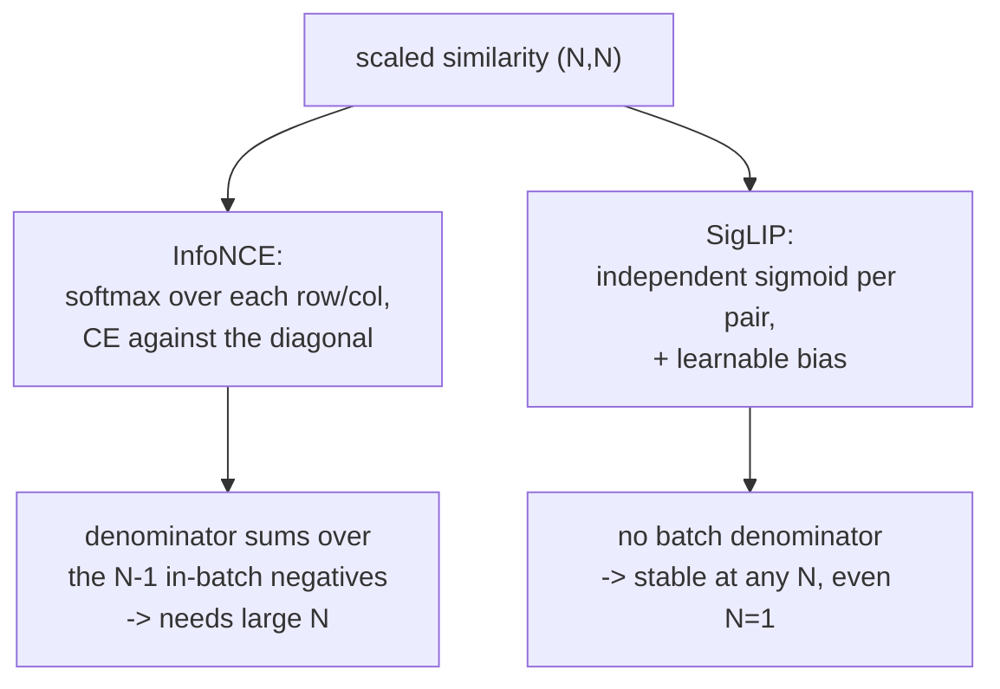

# A4 - CLIP and SigLIP (contrastive image-text)

## Motivation

A2 and A3 produced image representations from labels and from self-supervision on
images alone. CLIP (Radford et al., 2021,
[arxiv.org/abs/2103.00020](https://arxiv.org/abs/2103.00020)) added a third source of
supervision that turned out to be the most useful of the three for transfer: natural
language. Instead of predicting a fixed label set, CLIP trains an image encoder and a
text encoder so that an image and its caption land near each other in a shared
embedding space, and an image and an unrelated caption land far apart. The supervision
is paired (image, text) data scraped from the web, 400 million pairs for the original
model, with no per-class annotation. Because the text encoder accepts arbitrary
language at inference, the resulting model is open-vocabulary: you classify into any set
of classes by writing them as text prompts, with no fine-tuning and no new head.

This assignment builds the training objective. A batch of $N$ (image, caption)
pairs gives an $N \times N$ grid of image-text combinations. The $N$ diagonal entries are the
matched pairs, the $N(N-1)$ off-diagonal entries are mismatched pairs used as negatives.
CLIP scores every combination by cosine similarity in the shared space, scales the
scores by a learned temperature, and applies a symmetric cross-entropy: each image
should rank its own caption above all others, and each caption should rank its own image
above all others. This is the InfoNCE loss. The negatives come from within the batch, so the number and
diversity of negatives scale with the batch size. The InfoNCE objective is a lower bound
on the mutual information between the image and text representations, and the bound
tightens as $N$ grows. CLIP used a batch size of 32,768 to make the negatives hard. With 7
negatives at $N=8$ the task is trivially solved and the representation is weak; the loss
needs a very large batch to be informative.

That batch-size requirement is a problem on any single GPU, and it motivates the
second loss in this assignment. SigLIP (Zhai et al., 2023,
[arxiv.org/abs/2303.15343](https://arxiv.org/abs/2303.15343)) replaces the row-and-column
softmax of InfoNCE with an independent sigmoid on every pair: each of the N by N entries
becomes its own binary classification, matched or not, with a log-sigmoid loss and a
learnable bias. There is no softmax denominator that sums over the batch, so the loss is
well-defined at any batch size, including $N=1$, and it does not need an all-gather over
the full similarity matrix in distributed training. SigLIP outperforms softmax InfoNCE
at small and moderate batch sizes and matches it once the batch is very large. For a 12GB
budget the sigmoid loss is the practical default, and it is the production default in
2024-2026 vision-language models: PaliGemma and pi0 use a SigLIP encoder. This assignment
builds both losses, with SigLIP as the primary objective and InfoNCE as the predecessor
that explains why the batch size mattered.

The third piece is zero-shot inference. To classify an image into K classes, encode K
text prompts (one per class, written as "a photo of a {class}"), encode the image, and
take the class whose prompt embedding has the highest cosine similarity to the image
embedding. The decision boundary is the geometry of the shared space, with no trained
classifier. Prompt wording matters because the model trained on captions, not bare class
names, and averaging several prompt templates per class (then re-normalizing) improves
accuracy. Real CLIP reaches about 88 to 90 percent zero-shot on CIFAR-10 and SigLIP
about 92 percent, with no CIFAR training.

CLIP's encoder is the perceptual front end for most of the multimodal course ahead. A8
(VLM) feeds the image encoder's patch tokens through a projection into a language
model's token space; the shared embedding keeps that projection small.
A13 (VLA) uses a vision-language backbone as the policy's perception. The open-vocabulary
detection line starts by removing the image encoder's global pooling to get per-region
features: OWL-ViT (Minderer et al., 2022,
[arxiv.org/abs/2205.06230](https://arxiv.org/abs/2205.06230)) adds detection heads to a
CLIP ViT, and Grounding DINO (Liu et al., 2023,
[arxiv.org/abs/2303.05499](https://arxiv.org/abs/2303.05499)) fuses text and image tokens
inside the transformer for referring-expression detection. A4 builds the loss and the
inference procedure; the towers are tiny stand-ins, because the objective transfers and
the encoder is the ViT and transformer you already built.

## Background

The dual encoder maps an image and a token sequence to L2-normalized vectors in a shared
space of dimension D. The image tower is a small ViT pooled to one vector; the text tower
is a small causal transformer pooled at the EOS token (the end-of-sequence marker that
closes every caption; its hidden state is taken as the sentence summary), then projected.
Both end in an L2
normalize, so a dot product between two embeddings is their cosine similarity.

Text pooling follows CLIP and is a common bug source. The pooled vector is the hidden
state at the EOS token, located as `tokens.argmax(dim=-1)`: the EOS/EOT token is assigned
the largest id in the vocabulary, and sequences are padded after it, so the EOS position
is the argmax of the token ids, not the last sequence position. (SigLIP's real text tower
is bidirectional with a different pool; this toy uses the CLIP causal-EOS convention.)

### Symmetric InfoNCE (CLIP)

With both feature sets L2-normalized (write $u_i$ for image embedding $i$, $v_j$ for text
embedding $j$, and $s$ for the scale), build the scaled similarity matrix
$\ell_{ij} = s\,\langle u_i, v_j\rangle$ and average a row cross-entropy (image to text) and
a column cross-entropy (text to image), each with the matched pair on the diagonal:

$$L_{\text{clip}} = \tfrac{1}{2}\left[\,-\frac{1}{N}\sum_i \log\frac{e^{\ell_{ii}}}{\sum_j e^{\ell_{ij}}}\;-\;\frac{1}{N}\sum_j \log\frac{e^{\ell_{jj}}}{\sum_i e^{\ell_{ij}}}\,\right]$$

`scale` is `logit_scale.exp()`, where `logit_scale` is a learnable scalar in log space.
The cross-entropy is built by hand here (log-softmax over each row, then the diagonal),
because the softmax denominator summing over the $N-1$ in-batch negatives is the mechanism
the loss teaches; calling a prebuilt cross-entropy would hide it. CLIP initializes
`logit_scale` to $\log(1/0.07)$ and clamps the parameter at $\log(100)$ each step, which
was needed for stability; the temperature converges near 0.01 (scale near 100).

### Sigmoid loss (SigLIP)

SigLIP scores the same matrix but treats each pair independently. The label matrix is +1
on the diagonal and -1 off it, and the loss is the negative log-sigmoid summed over the
full matrix and divided by $N$ (the batch size), following the paper's Algorithm 1. With
$\ell_{ij} = s\,\langle u_i, v_j\rangle + b$ and $\sigma$ the sigmoid:

$$y_{ij} = \begin{cases}+1 & i = j \\ -1 & i \neq j\end{cases}, \qquad
L_{\text{sig}} = -\frac{1}{N}\sum_{i=1}^{N}\sum_{j=1}^{N}\log\sigma\big(y_{ij}\,\ell_{ij}\big)$$

`bias` is a learnable scalar initialized to -10. Most pairs in the matrix are negatives,
and $\sigma(\text{score} + \text{bias})$ with a large negative bias starts near 0, so the negatives
contribute almost no loss at initialization and the model is not swamped by them. The
paper initializes the temperature to $\log(10)$.

### Zero-shot classification

For K classes, encode one prompt embedding per class (or average several templates and
re-normalize), then classify by cosine argmax:

    logits = image_features @ class_features.T                 # (B, K)
    pred   = logits.argmax(dim=-1)

## What you'll implement

Three holes:

- `clip_loss` (`losses.py`): symmetric InfoNCE, cross-entropy built by hand.
- `siglip_loss` (`losses.py`): the per-pair sigmoid loss with the bias.
- `zero_shot_classify` (`inference.py`): cosine-similarity argmax.

The dual encoder (`model.py`), the L2 normalization, the learnable temperature and bias,
the EOS pooling, and the toy (image, caption) data are provided.

## Tasks

1. `clip_loss` (`losses.py`): `logits = logit_scale.exp() * image_features @
   text_features.T`; build `log_softmax` over each row by hand (`z - logsumexp(z, dim=1,
   keepdim=True)`), take the diagonal, negate and mean; do the same on `logits.T`; return
   the average. Do not call `F.cross_entropy`/`F.log_softmax`. Teaches the in-batch
   negative structure, the symmetric image-text cross-entropy, and the temperature.
2. `siglip_loss` (`losses.py`): `logits = logit_scale.exp() * image_features @
   text_features.T + bias`; `labels = 2*eye(N) - 1`; return `-logsigmoid(labels *
   logits).sum() / N`. Teaches that dropping the softmax denominator makes the loss
   per-pair and stable across batch sizes.
3. `zero_shot_classify` (`inference.py`): cosine-similarity logits `image_features @
   text_features.T` and their argmax. Teaches that the classifier is the geometry of the
   shared space.

## How to verify

From the repo root with the `nanovision` env active:

    make test A=a04_clip      # your top-level code (red until you fill the holes)

The tests run in this order:

1. `tests/test_shapes.py` - the encoder gives L2-normalized `(N, D)` features; both losses
   return scalars; `zero_shot_classify` gives `(B, K)` logits and `(B,)` predictions.
2. `tests/test_gradcheck.py` - float64 gradcheck of `clip_loss` w.r.t. the features and
   `logit_scale`, and of `siglip_loss` w.r.t. the features, `logit_scale`, and `bias`.
3. `tests/test_losses_reference.py` - `clip_loss` equals the symmetric `F.cross_entropy`
   reference and `siglip_loss` equals the log-sigmoid BCE reference on fixed inputs;
   aligned features give a low `clip_loss`.
4. `tests/test_overfit.py` - the tiny dual encoder trained with `siglip_loss` (and with
   `clip_loss`) on N=8 fixed pairs aligns every pair: the similarity-matrix diagonal is
   the max of its row and column.
5. `tests/test_losses_structural.py` - the deterministic small-batch difference: at N=1
   `siglip_loss` is finite with a nonzero gradient, while `clip_loss` collapses to 0 with
   no gradient, because a 1x1 similarity has no negatives. This is why InfoNCE needs a
   large batch and the sigmoid loss does not.
6. `tests/test_zero_shot.py` - cosine argmax recovers the class for images placed near
   their class prototype, and prompt-ensemble averaging works.
7. `tests/test_forbidden_imports.py` - the mechanism code uses no `open_clip`, `clip`,
   `transformers`, or `timm`, and no `F.cross_entropy`/`F.log_softmax`/`F.nll_loss`
   (`clip_loss` builds the cross-entropy by hand). `F.logsigmoid` and `F.normalize` are
   allowed.

To confirm the reference passes and render the figures:

    make verify A=a04_clip    # reference solution (should be green)
    make viz    A=a04_clip    # writes the similarity matrix and the alignment-vs-N curve

The reference implementation is visible in `solution/losses.py` and
`solution/inference.py`; read it if you get stuck.

## Compute notes

Everything gates on CPU with synthetic seeded (image, caption) pairs and no download. The
towers are tiny (16x16 images, patch 4, dim 64, depth 3; an 8-token caption vocabulary),
N=8 pairs, Adam lr 1e-3, 400 steps, reaching full alignment with either loss. The toy
draws fewer latent classes than pairs (4 classes, 8 pairs), so two same-class pairs are
in-batch negatives yet semantically close, the false-negative pathology of in-batch
contrastive learning, visible as the graded off-diagonal in the similarity-matrix figure.

Two things this scale cannot show, stated so they are not mistaken for the result. The
representation-quality gap between InfoNCE and SigLIP appears during large-scale training
measured on held-out transfer, not when overfitting one tiny batch (which is where
InfoNCE is strong), so the overfit test and the alignment-vs-N viz show both losses
aligning at small N, and the test asserts only the deterministic N=1 structural
difference. The modality gap, the finding that image and text embeddings sit in separated
cones even after training, appears only at real scale and is a measurement for the
real-weights probe, not the toy.

## Stretch goals

1. Real-weights zero-shot CIFAR-10: load a CLIP or SigLIP checkpoint (`open_clip` or
   `transformers`, allowed only in a probe notebook), classify CIFAR-10 by prompt
   embeddings, and compare a single template against an 80-template ensemble. Expect
   about 88 to 90 percent for CLIP ViT-B/32 and about 92 percent for SigLIP-B/16.
2. Measure the modality gap on the real model: encode the CIFAR images and the class
   prompts, and check that the mean image embedding and the mean text embedding are not
   collocated (a constant offset between the two cones).
3. Add a third loss variant and compare: the original asymmetric InfoNCE (image-to-text
   only) against the symmetric version, on the toy alignment metric.
4. Open-vocabulary head: remove the image tower's mean-pool, keep per-patch features, and
   sketch how OWL-ViT attaches a box head to them (no training, just the architecture
   diff).

## Further reading

- Radford et al., "Learning Transferable Visual Models From Natural Language Supervision"
  (CLIP, 2021, [arxiv.org/abs/2103.00020](https://arxiv.org/abs/2103.00020)). The original
  dual encoder, InfoNCE, temperature, and zero-shot transfer.
- Zhai et al., "Sigmoid Loss for Language Image Pre-Training" (SigLIP, 2023,
  [arxiv.org/abs/2303.15343](https://arxiv.org/abs/2303.15343)). The sigmoid loss; read
  Algorithm 1 and the batch-size ablations.
- Tschannen et al., "SigLIP 2: Multilingual Vision-Language Encoders with Improved
  Semantic Understanding, Localization, and Dense Features" (2025,
  [arxiv.org/abs/2502.14786](https://arxiv.org/abs/2502.14786)). The current production
  encoder, adding captioning and self-distillation to the recipe.
- Cherti et al., "Reproducible scaling laws for contrastive language-image learning"
  (OpenCLIP, 2022, [arxiv.org/abs/2212.07143](https://arxiv.org/abs/2212.07143)). Scaling
  behavior and the open checkpoints used for the probe.
- Minderer et al., "Simple Open-Vocabulary Object Detection with Vision Transformers"
  (OWL-ViT, 2022, [arxiv.org/abs/2205.06230](https://arxiv.org/abs/2205.06230)). Removing
  global pooling turns a CLIP ViT into a detector.
- Liu et al., "Grounding DINO: Marrying DINO with Grounded Pre-Training for Open-Set
  Object Detection" (2023, [arxiv.org/abs/2303.05499](https://arxiv.org/abs/2303.05499)).
  Early text-image fusion for referring-expression detection.
