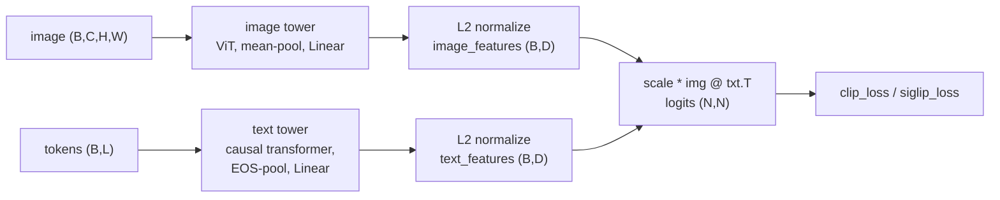
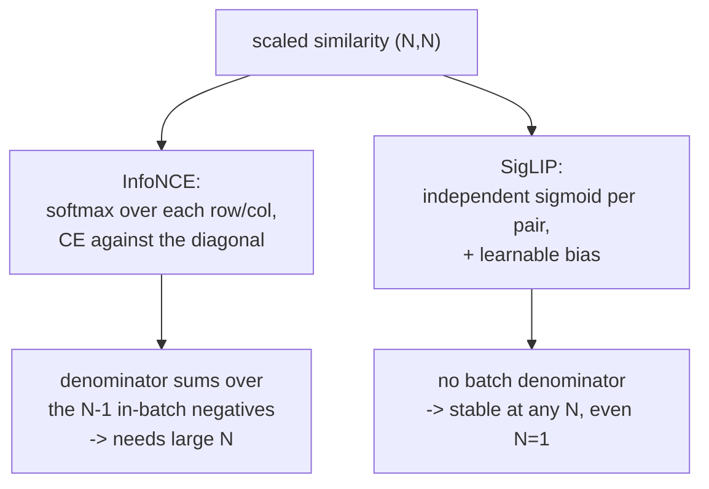

# A4 - CLIP and SigLIP (contrastive image-text)

CLIP trains an image encoder and a text encoder so that an image and its caption land near each
other in a shared embedding space, and an image and an unrelated caption land far apart. The
supervision is paired (image, text) data scraped from the web, with no per-class annotation.
Because the text encoder accepts arbitrary language at inference, the model is open-vocabulary:
classify into any set of classes by writing them as text prompts, with no fine-tuning and no new
head. This assignment builds the training objective in two forms, CLIP's softmax InfoNCE and
SigLIP's per-pair sigmoid loss, and the zero-shot inference procedure.

Build the contrastive objective and zero-shot inference on a tiny dual encoder. Implement the
symmetric InfoNCE loss (the cross-entropy built by hand so the in-batch negative structure is
visible), the sigmoid loss with its learnable bias, and the cosine-similarity zero-shot
classifier. The image and text towers, the L2 normalization, the learnable temperature and bias,
the EOS text pooling, and the toy (image, caption) data are provided. Everything runs on CPU with
synthetic seeded pairs in under a minute.

Required reading before starting:
- Radford et al. 2021, "Learning Transferable Visual Models From Natural Language Supervision"
  (CLIP), [arXiv:2103.00020](https://arxiv.org/abs/2103.00020).
- Zhai et al. 2023, "Sigmoid Loss for Language Image Pre-Training" (SigLIP),
  [arXiv:2303.15343](https://arxiv.org/abs/2303.15343). Read Algorithm 1 and the batch-size
  ablations.

## Lecture notes

### Why language supervision

Earlier image representations came from labels and from self-supervision on images alone. CLIP
(Radford et al. 2021) added a third source of supervision that turned out to be the most useful of
the three for transfer: natural language. Instead of predicting a fixed label set, CLIP aligns
images with their captions in a shared space. The original model trained on 400 million (image,
text) pairs. Because the text side is open-vocabulary, the model classifies into arbitrary classes
written as prompts.

The dual encoder maps an image and a token sequence to L2-normalized vectors in a shared space of
dimension $D$. The image tower is a small ViT pooled to one vector; the text tower is a small
causal transformer pooled at the EOS token (the end-of-sequence marker that closes every caption;
its hidden state is taken as the sentence summary), then projected. Both end in an L2 normalize, so
a dot product between two embeddings is their cosine similarity.



Text pooling follows CLIP and is a common bug source. The pooled vector is the hidden state at the
EOS token, located as $\operatorname{argmax}$ over the token ids: the EOS token is assigned the
largest id in the vocabulary, and sequences are padded after it, so the EOS position is the argmax
of the token ids, not the last sequence position. (SigLIP's real text tower is bidirectional with a
different pool; this toy uses the CLIP causal-EOS convention for both losses.)

### Symmetric InfoNCE

A batch of $N$ (image, caption) pairs gives an $N \times N$ grid of image-text combinations. The
$N$ diagonal entries are the matched pairs; the $N(N-1)$ off-diagonal entries are mismatched pairs
used as negatives. CLIP scores every combination by cosine similarity, scales the scores by a
learned temperature, and applies a symmetric cross-entropy: each image should rank its own caption
above all others, and each caption its own image above all others. Writing $u_i$ for image
embedding $i$, $v_j$ for text embedding $j$, and $s$ for the scale, build the scaled similarity
matrix $\ell_{ij} = s\,\langle u_i, v_j\rangle$ and average a row cross-entropy (image to text) and
a column cross-entropy (text to image), each with the matched pair on the diagonal:

$$L_{\text{clip}} = \tfrac{1}{2}\left[\,-\frac{1}{N}\sum_i \log\frac{e^{\ell_{ii}}}{\sum_j e^{\ell_{ij}}}\;-\;\frac{1}{N}\sum_j \log\frac{e^{\ell_{jj}}}{\sum_i e^{\ell_{ij}}}\,\right].$$

This is the InfoNCE loss. The negatives come from within the batch, so their number and diversity
scale with the batch size. InfoNCE is a lower bound on the mutual information between the image and
text representations, and the bound tightens as $N$ grows. CLIP used a batch of 32,768 to make the
negatives hard: with 7 negatives at $N=8$ the task is trivially solved and the representation is
weak.

The scale is $\exp(\text{logit-scale})$, where the log-scale is a learnable scalar. CLIP
initializes it to $\log(1/0.07)$ and clamps it at $\log(100)$ each step for stability; the
temperature converges near 0.01 (scale near 100).

### The sigmoid loss

The large-batch requirement is a problem on a single GPU, and it motivates the second loss. SigLIP
(Zhai et al. 2023) replaces the row-and-column softmax of InfoNCE with an independent sigmoid on
every pair: each of the $N \times N$ entries becomes its own binary classification, matched or not,
with a log-sigmoid loss and a learnable bias. The label matrix is $+1$ on the diagonal and $-1$ off
it, and the loss is the negative log-sigmoid summed over the full matrix and divided by $N$,
following the paper's Algorithm 1. With $\ell_{ij} = s\,\langle u_i, v_j\rangle + b$ and $\sigma$
the sigmoid:

$$y_{ij} = \begin{cases}+1 & i = j \\ -1 & i \neq j\end{cases}, \qquad
L_{\text{sig}} = -\frac{1}{N}\sum_{i=1}^{N}\sum_{j=1}^{N}\log\sigma\big(y_{ij}\,\ell_{ij}\big).$$

There is no softmax denominator that sums over the batch, so the loss is well-defined at any batch
size, including $N=1$, and it does not need an all-gather over the full similarity matrix in
distributed training. The bias is a learnable scalar initialized to $-10$. Most pairs in the matrix
are negatives, and $\sigma(\text{score} + \text{bias})$ with a large negative bias starts near 0,
so the negatives contribute almost no loss at initialization and the model is not swamped by them.
The paper initializes the temperature to $\log(10)$. SigLIP outperforms softmax InfoNCE at small
and moderate batch sizes and matches it once the batch is very large, which makes it the practical
default on a small budget and the production default in 2024-2026 vision-language models (PaliGemma
and pi0 use a SigLIP encoder).



### Zero-shot classification

To classify an image into $K$ classes, encode $K$ text prompts (one per class, written as "a photo
of a {class}"), encode the image, and take the class whose prompt embedding has the highest cosine
similarity to the image embedding. The decision boundary is the geometry of the shared space, with
no trained classifier:

$$\text{logits} = \text{image-features} \cdot \text{class-features}^\top, \qquad
\text{pred} = \operatorname{argmax}(\text{logits}).$$

Prompt wording matters because the model trained on captions, not bare class names, and averaging
several prompt templates per class (then re-normalizing) improves accuracy. Real CLIP reaches about
88 to 90 percent zero-shot on CIFAR-10 and SigLIP about 92 percent, with no CIFAR training.

### Where this leads

CLIP's encoder is the perceptual front end for most of the multimodal course ahead. The
vision-language model feeds the image encoder's patch tokens through a projection into a language
model's token space, and the shared embedding keeps that projection small. The open-vocabulary
detection line starts by removing the image encoder's global pooling to get per-region features:
OWL-ViT (Minderer et al. 2022, [arXiv:2205.06230](https://arxiv.org/abs/2205.06230)) adds detection
heads to a CLIP ViT, and Grounding DINO (Liu et al. 2023,
[arXiv:2303.05499](https://arxiv.org/abs/2303.05499)) fuses text and image tokens inside the
transformer for referring-expression detection.

## The assignment

Fill these holes, in order. Each is one `NotImplementedError` with a matching test; the docstring in each file gives the signature, shapes, and constraints.

1. [`clip_loss()`](losses.py) in `losses.py`
2. [`siglip_loss()`](losses.py) in `losses.py`
3. [`zero_shot_classify()`](inference.py) in `inference.py`

### Running and validating

Activate the environment (`conda activate nanovision`), then:

```
make test     A=a04_clip   # run the tests against the top-level files (the ones with holes)
make verify   A=a04_clip   # run the same tests against the reference solution/
make viz      A=a04_clip   # render the figures from the reference solution
make viz-mine A=a04_clip   # render the figures from your own code (once the holes are filled)
```

`make test` is the command to run while working. It runs the suite in
`assignments/a04_clip/tests/` against the top-level files and goes from red (the holes raise
`NotImplementedError`) to green as they are filled. `make verify` runs the identical suite against
the reference in `solution/` by setting `NANOVISION_IMPL=solution`, so it is green from the start
and shows the target. The goal is to bring `make test` to the same green as `make verify`.

The suite checks shapes, a float64 gradcheck of both losses, that `clip_loss` equals a symmetric
`F.cross_entropy` reference and `siglip_loss` equals a log-sigmoid BCE reference on fixed inputs, a
short overfit that aligns all eight pairs with either loss, the deterministic $N=1$ structural
difference (the sigmoid loss is finite with a nonzero gradient while InfoNCE collapses to 0 with no
gradient, because a $1\times1$ similarity has no negatives), that cosine argmax recovers the class
and prompt-ensemble averaging works, and that no prebuilt CLIP library, `transformers`, `timm`, or
`F.cross_entropy`/`F.log_softmax`/`F.nll_loss` is imported (`F.logsigmoid` and `F.normalize` are
allowed).

`make viz` renders from the reference solution, so it works on a fresh checkout before any holes are
filled. `make viz-mine` runs the same script against the top-level code, which needs the holes
filled. Both write PNGs to `out/` using matplotlib's headless Agg backend, so they work over SSH, in
WSL, and in CI with no display, and the figures open inline in VSCode. Add `SHOW=1` (for example
`make viz-mine A=a04_clip SHOW=1`) to also open interactive windows when a display is available. The
figures are `similarity_matrix.png` (the $N\times N$ cosine matrix after training, diagonal bright)
and `alignment_vs_batch.png` (alignment quality against batch size).

What you should see when you run this. The towers are tiny (16x16 images, patch 4, dim 64, depth 3;
an 8-token caption vocabulary), $N=8$ pairs, 400 Adam steps, reaching full alignment with either
loss: the similarity-matrix diagonal becomes the max of its row and column. The toy draws fewer
latent classes than pairs (4 classes, 8 pairs), so two same-class pairs are in-batch negatives yet
semantically close, the false-negative pathology of in-batch contrastive learning, visible as a
graded off-diagonal in the similarity figure. Two things this scale cannot show, stated so they are
not mistaken for the result. The representation-quality gap between InfoNCE and SigLIP appears
during large-scale training measured on held-out transfer, not when overfitting one tiny batch
(which is where InfoNCE is strong), so the overfit and the alignment-vs-N viz show both losses
aligning at small $N$ and the test asserts only the deterministic $N=1$ structural difference. The
modality gap, the finding that image and text embeddings sit in separated cones even after
training, appears only at real scale and is a measurement for a real-weights probe, not the toy.

## Further reading

Where this goes next:

- Tschannen et al. 2025, "SigLIP 2: Multilingual Vision-Language Encoders with Improved Semantic
  Understanding, Localization, and Dense Features",
  [arXiv:2502.14786](https://arxiv.org/abs/2502.14786). The current production encoder, adding
  captioning and self-distillation to the recipe.
- Minderer et al. 2022, "Simple Open-Vocabulary Object Detection with Vision Transformers"
  (OWL-ViT), [arXiv:2205.06230](https://arxiv.org/abs/2205.06230). Removing global pooling turns a
  CLIP ViT into a detector.
- Liu et al. 2023, "Grounding DINO: Marrying DINO with Grounded Pre-Training for Open-Set Object
  Detection", [arXiv:2303.05499](https://arxiv.org/abs/2303.05499). Early text-image fusion for
  referring-expression detection.

Optional deeper reading:

- Cherti et al. 2022, "Reproducible scaling laws for contrastive language-image learning"
  (OpenCLIP), [arXiv:2212.07143](https://arxiv.org/abs/2212.07143). Scaling behavior and the open
  checkpoints used for a real-weights probe.

Full reference list:

- Radford et al. 2021, CLIP, [arXiv:2103.00020](https://arxiv.org/abs/2103.00020).
- Zhai et al. 2023, SigLIP, [arXiv:2303.15343](https://arxiv.org/abs/2303.15343).
- Tschannen et al. 2025, SigLIP 2, [arXiv:2502.14786](https://arxiv.org/abs/2502.14786).
- Cherti et al. 2022, OpenCLIP scaling laws, [arXiv:2212.07143](https://arxiv.org/abs/2212.07143).
- Minderer et al. 2022, OWL-ViT, [arXiv:2205.06230](https://arxiv.org/abs/2205.06230).
- Liu et al. 2023, Grounding DINO, [arXiv:2303.05499](https://arxiv.org/abs/2303.05499).
