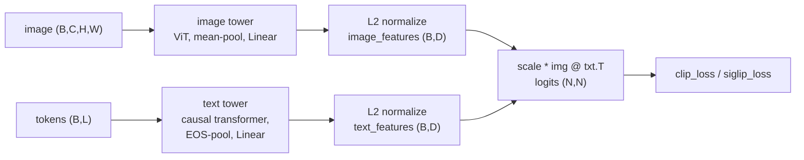
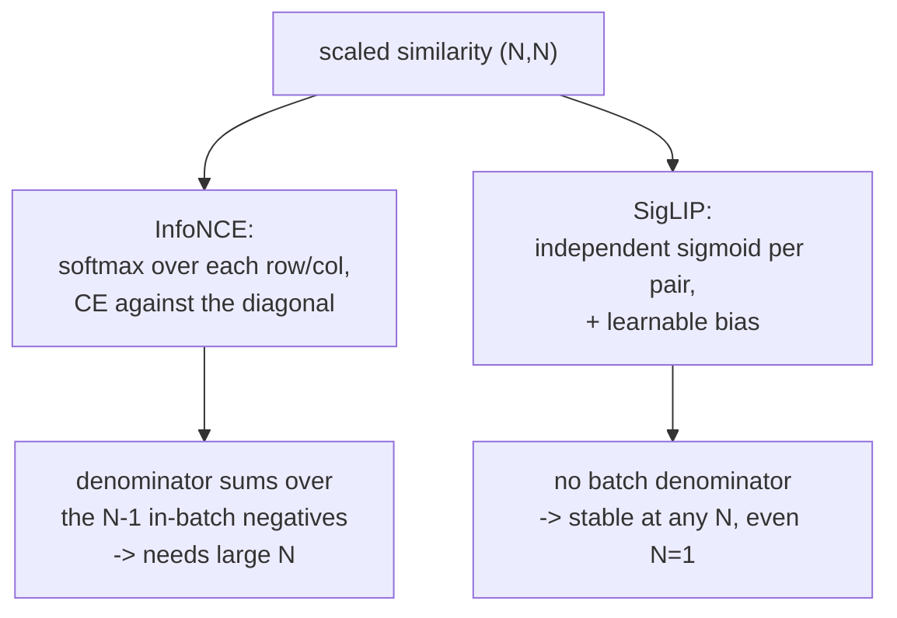

# A4 - CLIP and SigLIP (contrastive image-text)

CLIP trains an image encoder and a text encoder so that an image and its caption land near each
other in a shared embedding space, and an image and an unrelated caption land far apart. The
supervision is paired (image, text) data scraped from the web, with no per-class annotation.
Because the text encoder accepts arbitrary language at inference, the model is open-vocabulary:
classify into any set of classes by writing them as text prompts, with no fine-tuning and no new
head. This assignment builds the training objective in two forms, CLIP's softmax InfoNCE and
SigLIP's per-pair sigmoid loss, and the zero-shot inference procedure.

Build the contrastive objective and zero-shot inference on a tiny dual encoder. Implement the
symmetric InfoNCE loss (the cross-entropy built by hand so the in-batch negative structure is
visible), the sigmoid loss with its learnable bias, and the cosine-similarity zero-shot
classifier. The image and text towers, the L2 normalization, the learnable temperature and bias,
the text pooling, and the toy (image, caption) data are provided. Everything runs on CPU with
synthetic seeded pairs in under a minute.

Required reading before starting:
- Radford et al. 2021, "Learning Transferable Visual Models From Natural Language Supervision"
  (CLIP), [arXiv:2103.00020](https://arxiv.org/abs/2103.00020).
- Zhai et al. 2023, "Sigmoid Loss for Language Image Pre-Training" (SigLIP),
  [arXiv:2303.15343](https://arxiv.org/abs/2303.15343). Read Algorithm 1 and the batch-size
  ablations.

## Lecture notes

### Why language supervision

Two sources of image supervision came before this one. The first is human labels: a fixed list of
classes and one integer per image. That caps what the model can be asked about, since the output
layer has one slot per class and adding a class means retraining, and it costs an annotation
budget that grows with the dataset. The second is self-supervision on images alone, where the
supervision is invented from the data: the masked autoencoder hides most of an image and
reconstructs the missing patches, and DINO matches a student network's distribution over learned
prototypes to a teacher's. That removes the annotation cost, but what comes out is a feature
vector with no names attached, so a labeled head still has to be trained before the model can
answer any question.

CLIP (Radford et al. 2021) used a third source: the text that already sits next to images on the
web. The original model trained on 400 million (image, text) pairs, with no per-image annotation
step. Instead of predicting a fixed label set, it aligns each image with its caption in a shared
space.

Two terms describe what that buys, and both are used throughout these notes. A model is
zero-shot on a task when it is evaluated on that task without having been trained or fine-tuned
on a single example of it; the only thing supplied at test time is a description of what the
classes are. It is open-vocabulary when the set of possible answers is not fixed at training
time, because answers are supplied as free-form text rather than selected from a list baked into
the architecture. A labeled classifier is neither: its last layer has a fixed width, and it has
seen labeled examples of every class it can name.

### The shared embedding space

A dual encoder is two separate networks, one per modality, that never talk to each other except
through the geometry of their common output space. The image tower maps an image to a vector in
$\mathbb{R}^D$, the text tower maps a token sequence to a vector in the same $\mathbb{R}^D$
($D = 64$ in this toy), and both finish with an L2 normalization that divides each vector by its
own Euclidean length:

$$u = \frac{\tilde u}{\lVert \tilde u \rVert_2}, \qquad \lVert u \rVert_2 = 1.$$

Every embedding then lies on the unit sphere, and the dot product of two of them is the cosine of
the angle between them, $\langle u, v \rangle = \cos\theta \in [-1, 1]$. Cross-modal similarity is
then a single inner product on a common scale, so comparing an image vector to a text vector is
meaningful even though the two towers share no weights. Bounding every score to $[-1, 1]$ also
matters downstream, because it lets one scalar control how sharply those scores are converted into
a loss, which the temperature section below depends on. Normalizing takes something away as well.
An unnormalized model could lower its loss by growing the norms of matched embeddings rather than
by rotating them into agreement, inflating the scores without improving the geometry that
inference reads.

A batch of $N$ pairs produces $N$ image embeddings $u_1, \dots, u_N$ and $N$ text embeddings
$v_1, \dots, v_N$. Stacking them as rows of $U \in \mathbb{R}^{N \times D}$ and
$V \in \mathbb{R}^{N \times D}$ gives the full table of cross-modal similarities in one matrix
product:

$$S = U V^\top \in \mathbb{R}^{N \times N}, \qquad S_{ij} = \langle u_i, v_j \rangle.$$

$S$ is the object both losses act on. Its diagonal holds the $N$ matched pairs, image $i$ against
its own caption $i$. Its $N(N-1)$ off-diagonal entries are mismatched pairs, and those are the
negatives: examples the model is told to push apart, obtained for free from data that was already
encoded for its own sake. Everything that follows is a choice about how to score a matrix whose
diagonal is supposed to win.



### The two towers

Both towers are provided in `model.py` and neither is a hole, but the text pooling is a standard
bug source and is worth reading before the losses.

The image tower is a small vision transformer: a strided convolution cuts the 16x16 image into a
4x4 grid of 16 patch tokens, a learned positional embedding is added, three encoder blocks run,
the token sequence is mean-pooled to one vector, and a linear head projects to $D$.

The text tower is a small causal transformer. Causal here means each position attends only to
itself and to earlier positions, the same masked attention used by a decoder-only language model.
That masking decides where the sentence summary can be read from. Position $t$ has seen tokens
$1$ through $t$ and nothing after, so no position except the last real one has seen the entire
caption. Mean-pooling the sequence would average vectors that each saw a different prefix, and
most of them saw only a fragment. CLIP instead takes the hidden state at the end-of-sequence
(EOS) token, the marker appended to close every caption, because that position is the only one
downstream of the whole sentence.

Finding the EOS position is the part that trips people. Captions are variable length and padded
to a fixed width, so EOS is not at the last index. CLIP locates it with an argmax over the token
ids, which works because of how the vocabulary is numbered. In this toy the vocabulary has 32
ids: $0$ is the pad token, $1$ to $4$ are the class tokens, $5$ to $8$ are the attribute tokens,
and $31$ (which is `vocab_size - 1`, the largest id) is EOS. A caption is
`[class, attribute, EOS, pad, pad, pad, pad, pad]`, for instance `[2, 7, 31, 0, 0, 0, 0, 0]`.
The largest id in that row is $31$, sitting at index $2$, so `tokens.argmax(dim=-1)` returns $2$,
the EOS position. The last index, $7$, is padding and its hidden state is meaningless. The trick
holds only as long as EOS keeps the largest id in the vocabulary; a tokenizer that assigns EOS
anything else silently pools at the wrong position and still trains, just worse.

SigLIP's real text tower is bidirectional with a different pooling rule. This toy uses the CLIP
causal-EOS convention for both losses so that the only thing changing between them is the loss.

### Softmax and cross-entropy

Row $i$ of $S$ holds $N$ real numbers, one score per candidate caption, and the training signal
has to say that entry $i$ should be the largest. The standard way to turn a vector of real scores
$\ell_1, \dots, \ell_N$ into a probability distribution is the softmax: exponentiate, then divide
by the total.

$$p_j = \frac{e^{\ell_j}}{\sum_{k=1}^{N} e^{\ell_k}}.$$

The exponential makes everything positive, the division makes it sum to one, and the ordering of
the $\ell$ values is preserved, so the largest score gets the largest probability. Scores fed to
a softmax are called logits, from log-odds: a difference of two logits is the log of the ratio of
their probabilities, $\ell_j - \ell_k = \log(p_j / p_k)$.

Cross-entropy is the loss that goes with it. When the target is a single correct index $c$, the
cross-entropy is the negative log-probability the model assigned to that index:

$$L = -\log p_c = -\ell_c + \log \sum_{k=1}^{N} e^{\ell_k}.$$

This is the negative log-likelihood of the correct answer, measured in nats (the natural-log unit
of information; one nat is $1/\ln 2 \approx 1.44$ bits). Two reference values anchor the scale. A
model that is certain and right has $p_c = 1$ and a loss of $0$. A model that is uniform over all
$N$ candidates has $p_c = 1/N$ and a loss of $\log N$, so $\log N$ is the loss of knowing
nothing, and $\log 8 \approx 2.08$ at the batch size used here.

The right-hand form above is the one to implement. Exponentiating raw logits overflows in float32
once they pass about $88$, and the temperature below makes logits as large as $100$, so the
denominator has to be computed as a log-sum-exp with the maximum pulled out:

$$\log \sum_k e^{\ell_k} = m + \log \sum_k e^{\ell_k - m}, \qquad m = \max_k \ell_k,$$

which is how `torch.logsumexp` computes it. The assignment forbids `F.cross_entropy` and
`F.log_softmax` so that this denominator, the sum over the in-batch negatives, is written out
rather than hidden inside a library call; `torch.logsumexp` is allowed and is the right primitive.

### The temperature

Cosine similarities live in $[-1, 1]$, and that range is too narrow to feed a softmax directly.
Work out the best case. Take a model that has solved the problem perfectly at $N = 8$: every
matched pair has cosine $+1$ and every mismatched pair has cosine $-1$. The softmax probability
on the diagonal is then

$$p_{ii} = \frac{e^{1}}{e^{1} + 7e^{-1}} = \frac{2.718}{2.718 + 2.575} \approx 0.514,$$

for a cross-entropy of about $0.67$ nats. A perfect model cannot get its loss below two thirds of
a nat, and the gradient at that point still pushes hard on embeddings that are already exactly
where they should be. At $N = 32768$ the same perfect model scores
$e^{1} / (e^{1} + 32767 e^{-1}) \approx 2.3 \times 10^{-4}$ on the diagonal, a loss of about
$8.4$ nats, which is barely better than the $10.4$ nats of knowing nothing.

The fix is to multiply the similarities by a scale $s > 1$ before the softmax, so that the logits
span $[-s, s]$ instead of $[-1, 1]$:

$$\ell_{ij} = s\,\langle u_i, v_j\rangle.$$

Writing $s = 1/\tau$, the quantity $\tau$ is the temperature, named after the Boltzmann
distribution $p \propto e^{-E/kT}$, where a low temperature concentrates probability on the
lowest-energy state and a high temperature flattens the distribution toward uniform. Small $\tau$
means a sharp softmax that puts almost all mass on the top-scoring caption; large $\tau$ means a
flat one. With $s = 100$ the perfect model above gets $p_{ii}$ indistinguishable from $1$ and a
loss indistinguishable from $0$.

The scale is not tuned by hand. It is a learned scalar $\lambda$ stored in log space (the code's
`logit_scale`), with $s = e^{\lambda}$. Storing the log keeps $s$ positive for any value the
optimizer lands on and makes a fixed gradient step on $\lambda$ a fixed multiplicative change in
$s$, which suits a quantity that has to sweep an order of magnitude. CLIP initializes $\lambda$ to
$\log(1/0.07)$, so $s$ starts near $14.3$.

Left alone, this parameter runs away. Once the diagonal is the largest entry in its row,
increasing $s$ increases the gap between the diagonal logit and the rest, which increases $p_{ii}$
and decreases the loss, with no term anywhere pulling back. So there is a permanent downhill
direction in $s$ that costs the model nothing and teaches it nothing. CLIP clamps $\lambda$ at
$\log(100)$, capping $s$ at $100$ and the temperature at $0.01$; in practice training pushes it up
against that clamp and it sits there.

### Noise-contrastive estimation

The loss in the next section is called InfoNCE, and the "NCE" is noise-contrastive estimation, an
idea from density estimation. Gutmann and Hyvärinen (2010) were fitting unnormalized probability
models, where the awkward part is the normalizing constant: an unnormalized density is easy to
write down and the integral that makes it a proper distribution is usually intractable. Their move
was to stop estimating a density and start training a classifier. Mix real samples with samples
from a known noise distribution, train a logistic classifier to tell which is which, and the
optimal classifier's output turns out to be a fixed function of the ratio between the data density
and the noise density. Discrimination against noise recovers the thing that direct estimation
could not.

Van den Oord et al. (2018), in Contrastive Predictive Coding, changed the classification from
binary to $N$-way. Present the model with one true partner and $N-1$ distractors drawn from the
noise distribution and ask which of the $N$ is the true one. That is an $N$-way classification, so
the loss is a softmax cross-entropy over the $N$ scores with the true partner as the target index,
and they named it InfoNCE. CLIP is this construction with the true partner being an image's own
caption and the distractors being the other captions in the same batch. Drawing the distractors
from the batch rather than from a separate sampler makes it cheap: those captions were
encoded anyway for their own rows, so the negatives cost one matrix product and nothing else.

### Symmetric InfoNCE

CLIP applies InfoNCE in both directions on the same matrix. Reading across row $i$, the model has
to pick image $i$'s caption out of all $N$ captions. Reading down column $j$, it has to pick
caption $j$'s image out of all $N$ images. Both are cross-entropies against the diagonal, and the
loss is their average. With $\ell_{ij} = s\,\langle u_i, v_j\rangle$:

$$L_{\text{clip}} = \tfrac{1}{2}\left[\,-\frac{1}{N}\sum_{i=1}^{N} \log\frac{e^{\ell_{ii}}}{\sum_{j=1}^{N} e^{\ell_{ij}}}\;-\;\frac{1}{N}\sum_{j=1}^{N} \log\frac{e^{\ell_{jj}}}{\sum_{i=1}^{N} e^{\ell_{ij}}}\,\right].$$

The first term normalizes over each row, the second over each column, and both read their
numerator off the diagonal. The two directions are not redundant: a model can rank every image's
caption first while some caption still ranks the wrong image first, because a row-wise argmax and
a column-wise argmax are independent conditions on the same matrix. The overfit test in the suite
checks both.

The negatives all come from inside the batch, so their number and their variety are set by the
batch size, and CLIP trained with a batch of 32,768. Two arguments push in that direction. The
direct one is difficulty. With $N = 8$ each row has 7 alternatives, they are mostly unrelated, and
telling the right one apart takes only a coarse feature; the loss reaches its floor while the
representation is still crude, and once it is there no gradient asks for more. With 32,767
alternatives some are genuinely close to the right answer, and separating those forces fine
distinctions into the embedding. The second argument comes from what the loss can certify at all,
and needs the next section.

### The ceiling on what InfoNCE measures

Mutual information is the standard measure of how much two random variables say about each other.
For an image $X$ and a caption $Y$ with joint distribution $p(x, y)$,

$$I(X; Y) = \mathbb{E}_{p(x,y)}\!\left[\log \frac{p(x, y)}{p(x)\,p(y)}\right],$$

the Kullback-Leibler divergence between the true joint and the product of the marginals, that is,
between the world as it is and a world where captions were shuffled at random across images. It
is zero exactly when the two are independent, it is measured in nats, and it reads as the average
number of nats of uncertainty about the caption that seeing the image removes.

Van den Oord et al. proved a bound relating InfoNCE to this quantity. Writing $L_N$ for the
one-directional InfoNCE loss with $N$ candidates,

$$L_N \;\ge\; \log N - I(X; Y), \qquad \text{equivalently} \qquad I(X; Y) \;\ge\; \log N - L_N.$$

So driving the loss down raises a certified lower bound on the mutual information between the two
towers' inputs, which is the sense in which the objective is doing representation learning and not
just ranking. The bound comes with a hard ceiling. Since $L_N \ge 0$ always, the quantity
$\log N - L_N$ can never exceed $\log N$, no matter how good the model is.

That ceiling is the concrete content of "large batches help". At $N = 8$, $\log 8 \approx 2.08$
nats, or 3 bits: a loss of exactly zero certifies only 3 bits of image-caption dependence, which
is roughly the information in naming one of eight things, and real image-caption pairs share far
more than that. At $N = 32768$ the ceiling is $\log 32768 \approx 10.4$ nats, or 15 bits. Nothing
about the batch size changes the true $I(X; Y)$; what changes is how much of it the objective can
see, and therefore how much of it the objective has any reason to encode. The bound itself is
known to be loose in practice (Poole et al. 2019 survey these estimators and their failure modes),
so treat it as the motivation for the design rather than as a measurement of the trained model.

### The sigmoid loss

Needing tens of thousands of examples in a batch is a problem on a single GPU, which motivates the
second loss. It is built from two pieces, taken in turn before the loss itself.

The sigmoid $\sigma(z) = 1/(1 + e^{-z})$ maps a real number to $(0, 1)$ and is the two-outcome
softmax written for one score instead of two. Its inverse is the log-odds,
$z = \log\!\big(p/(1-p)\big)$, so the number fed to a sigmoid is directly interpretable: $z = 0$
is even odds, $z = +2$ is odds of about 7 to 1 in favor, $z = -10$ is odds of about 1 in 22,000
against. Binary cross-entropy is the matching loss. With a label written as
$y \in \{+1, -1\}$ rather than $\{1, 0\}$, and using $\sigma(-z) = 1 - \sigma(z)$, both cases
collapse into one expression:

$$L = -\log \sigma(y z) \quad = \quad \begin{cases} -\log \sigma(z) & \text{label } +1 \\ -\log\big(1 - \sigma(z)\big) & \text{label } -1.\end{cases}$$

SigLIP (Zhai et al. 2023) applies exactly this to every entry of the similarity matrix
independently. Each of the $N^2$ entries becomes its own yes-or-no question, matched or not, with
label $+1$ on the diagonal and $-1$ off it. The logit adds a learnable bias $b$ to the scaled
similarity, and the loss is the sum over the whole matrix divided by $N$, following the paper's
Algorithm 1:

$$\ell_{ij} = s\,\langle u_i, v_j\rangle + b, \qquad
y_{ij} = \begin{cases}+1 & i = j \\ -1 & i \neq j\end{cases}, \qquad
L_{\text{sig}} = -\frac{1}{N}\sum_{i=1}^{N}\sum_{j=1}^{N}\log\sigma\big(y_{ij}\,\ell_{ij}\big).$$

Dividing by $N$ rather than $N^2$ follows the paper. Each image contributes the sum over its
entire row, so the reported number is per-image, not per-pair, and it is not comparable in
magnitude to the InfoNCE loss.

The bias exists because the matrix is overwhelmingly negative: $N$ matched pairs against $N^2 - N$
mismatched ones, so at $N = 8$ that is 8 against 56, and at CLIP's batch size it is 32,768 against
about a billion. Through the log-odds interpretation, $b$ is the model's prior log-odds that any
given pair matches, applied before the similarity is consulted at all. The paper initializes it to
$-10$, prior odds of about 1 in 22,000, the right order of magnitude for the actual fraction of
matched entries in a large batch.
The arithmetic at initialization shows what that buys. Embeddings start near-random, so the
cosines start near zero and every logit starts near $b$. With $b = -10$, each of the 56 negatives
contributes $-\log\sigma(10) \approx 4.5 \times 10^{-5}$ and each of the 8 positives contributes
$-\log\sigma(-10) \approx 10$, for a total of about $10.0004$, of which the negatives are
$3 \times 10^{-4}$. With $b = 0$ instead, every one of the 64 entries contributes
$-\log\sigma(0) = \log 2 \approx 0.693$, giving $5.55$, and $4.85$ of that (87 percent) comes from
negative pairs that were never in danger of being called matches. The bias starts the model at a
point where the loss is almost entirely about the pairs it is supposed to be learning.

Two structural consequences follow from having no softmax denominator. The first is that the loss
is well-defined at any batch size, including $N = 1$. A $1 \times 1$ similarity matrix has no
negatives, so InfoNCE degenerates: the softmax over a single logit is $1$ by construction, the
cross-entropy is exactly $0$, and the gradient with respect to the features is exactly zero, so
there is nothing to learn. The sigmoid loss at $N = 1$ is still a live binary classification with
a nonzero gradient. The test suite asserts this as the one deterministic difference between the
two losses at toy scale.

The second is the cost in distributed training. Data-parallel training splits a batch of $N$ over
$D$ devices, each holding $N/D$ image and text embeddings. An InfoNCE row needs the softmax
denominator over all $N$ text embeddings, so every device must receive every other device's text
shard, which is an all-gather: a collective operation where each device broadcasts its slice and
ends up with the concatenation of all slices. Then the full $N \times N$ matrix has to be formed,
and at $N = 32768$ that is $1.07 \times 10^{9}$ entries, about 4.3 GB in float32, before any
backward pass. The sigmoid loss is a sum of independent per-pair terms, so it decomposes: each
device computes the block between its own images and whichever text shard it currently holds,
adds that block's contribution to a running total, then passes the shard to its neighbor in a
ring. Only one shard is in flight at a time and the full matrix is never materialized.

The paper's ablations find that the sigmoid loss outperforms softmax InfoNCE at small and moderate
batch sizes and matches it once the batch is very large, which makes it the practical default on a
small budget and the production default in 2024-2026 vision-language models. PaliGemma, a
vision-language model that feeds a SigLIP encoder's patch tokens into the Gemma language model,
uses one; so does $\pi_0$, a vision-language-action robot policy built on PaliGemma.



### Zero-shot classification

Nothing in the training procedure knew about a class list, so classification has to be assembled
at test time out of text. A prompt is a short sentence naming a class, written the way a caption
would be written, for example "a photo of a dog". To classify an image into $K$ classes, encode
one prompt per class through the text tower to get $K$ unit vectors, encode the image through the
image tower to get one unit vector, and take the class whose prompt vector has the largest cosine
similarity to the image vector:

$$\text{logits} = \text{image-features} \cdot \text{class-features}^\top, \qquad
\text{pred} = \operatorname{argmax}(\text{logits}).$$

The $K$ class embeddings act as the rows of a linear classifier's weight matrix, except that no
gradient step ever produced them; they were written in English and pushed through an encoder. The
decision boundary is the geometry of the shared space. `zero_shot_classify` returns the raw
cosines with no temperature applied, since multiplying by a positive scale cannot change which
entry is largest and inference needs only the ordering.

Prompt wording matters, because the model was trained on captions rather than on bare nouns, and
a bare class name sits in a different part of the text tower's output space than a sentence does.
The standard remedy is a prompt ensemble: write several templates per class ("a photo of a
{class}", "a blurry photo of a {class}", and so on), encode all of them, average the resulting
unit vectors per class, and re-normalize the average back to unit length. It works the same way
averaging repeated noisy measurements works. Model each template's embedding as the true class
direction plus an independent template-specific perturbation; averaging $T$ of them leaves
the shared direction untouched while the perturbations partially cancel, shrinking by roughly
$1/\sqrt{T}$ if they are independent. The re-normalization is needed because the average of
several distinct unit vectors is shorter than unit length, and an unnormalized prototype would
compete unfairly against the others. The suite tests exactly this construction.

Real CLIP reaches about 88 to 90 percent zero-shot on CIFAR-10 and SigLIP about 92 percent, with
no CIFAR training.

### Where this leads

CLIP's encoder is the perceptual front end for most of the multimodal course ahead. The
vision-language model feeds the image encoder's patch tokens through a projection into a language
model's token space, and the shared embedding keeps that projection small. The open-vocabulary
detection line starts by removing the image encoder's global pooling to get per-region features:
OWL-ViT (Minderer et al. 2022, [arXiv:2205.06230](https://arxiv.org/abs/2205.06230)) adds detection
heads to a CLIP ViT, and Grounding DINO (Liu et al. 2023,
[arXiv:2303.05499](https://arxiv.org/abs/2303.05499)) fuses text and image tokens inside the
transformer for referring-expression detection.

## The assignment

Fill these holes, in order. Each is one `NotImplementedError` with a matching test; the docstring in each file gives the signature, shapes, and constraints.

1. [`clip_loss()`](losses.py) in `losses.py`
2. [`siglip_loss()`](losses.py) in `losses.py`
3. [`zero_shot_classify()`](inference.py) in `inference.py`

### Running and validating

Activate the environment (`conda activate nanovision`), then:

```
make test     A=a04_clip   # run the tests against the top-level files (the ones with holes)
make verify   A=a04_clip   # run the same tests against the reference solution/
make viz      A=a04_clip   # render the figures from the reference solution
make viz-mine A=a04_clip   # render the figures from your own code (once the holes are filled)
```

`make test` is the command to run while working. It runs the suite in
`assignments/a04_clip/tests/` against the top-level files and goes from red (the holes raise
`NotImplementedError`) to green as they are filled. `make verify` runs the identical suite against
the reference in `solution/` by setting `NANOVISION_IMPL=solution`, so it is green from the start
and shows the target. The goal is to bring `make test` to the same green as `make verify`.

The suite checks shapes; a float64 gradient check of both losses (`torch.autograd.gradcheck`,
which compares the analytic backward pass against finite differences of the forward pass, and
needs double precision for that comparison to mean anything); that `clip_loss` equals a symmetric
`F.cross_entropy` reference and `siglip_loss` equals a log-sigmoid binary-cross-entropy reference
on fixed inputs (the tests may call the library functions the mechanism code is forbidden to use);
a short overfit that aligns all eight pairs with either loss; the deterministic $N=1$ structural
difference (the sigmoid loss is finite with a nonzero gradient while InfoNCE collapses to 0 with
no gradient, because a $1\times1$ similarity has no negatives); that cosine argmax recovers the
class and prompt-ensemble averaging works; and that no prebuilt CLIP library, `transformers`,
`timm`, or `F.cross_entropy`/`F.log_softmax`/`F.nll_loss` is imported (`F.logsigmoid` and
`F.normalize` are allowed).

`make viz` renders from the reference solution, so it works on a fresh checkout before any holes are
filled. `make viz-mine` runs the same script against the top-level code, which needs the holes
filled. Both write PNGs to `out/` using matplotlib's headless Agg backend, so they work over SSH, in
WSL, and in CI with no display, and the figures open inline in VSCode. Add `SHOW=1` (for example
`make viz-mine A=a04_clip SHOW=1`) to also open interactive windows when a display is available. The
figures are `similarity_matrix.png` (the $N\times N$ cosine matrix after training, diagonal bright)
and `alignment_vs_batch.png`, which plots batch size against the fraction of image rows whose
most-similar caption is the matched one, for both losses.

What you should see when you run this. The towers are tiny (16x16 images, patch 4, dim 64, depth 3;
an 8-token caption vocabulary), $N=8$ pairs, 400 Adam steps, reaching full alignment with either
loss: the similarity-matrix diagonal becomes the max of its row and column. The toy draws fewer
latent classes than pairs (4 classes, 8 pairs), so two same-class pairs are in-batch negatives yet
semantically close, the false-negative pathology of in-batch contrastive learning, visible as a
graded off-diagonal in the similarity figure. Two things this scale cannot show, stated so they are
not mistaken for the result. The representation-quality gap between InfoNCE and SigLIP appears
during large-scale training measured on held-out transfer, not when overfitting one tiny batch
(which is where InfoNCE is strong), so the overfit and the alignment-vs-N viz show both losses
aligning at small $N$ and the test asserts only the deterministic $N=1$ structural difference. The
modality gap, the finding that image embeddings and text embeddings occupy two separated cones of
the shared sphere rather than intermingling, so that the nearest text vector to an image vector is
still far away in absolute terms even when it is the right one (Liang et al. 2022), appears only at
real scale and is a measurement for a real-weights probe, not the toy.

## Further reading

Where this goes next:

- Tschannen et al. 2025, "SigLIP 2: Multilingual Vision-Language Encoders with Improved Semantic
  Understanding, Localization, and Dense Features",
  [arXiv:2502.14786](https://arxiv.org/abs/2502.14786). The current production encoder, adding
  captioning and self-distillation to the recipe.
- Minderer et al. 2022, "Simple Open-Vocabulary Object Detection with Vision Transformers"
  (OWL-ViT), [arXiv:2205.06230](https://arxiv.org/abs/2205.06230). Removing global pooling turns a
  CLIP ViT into a detector.
- Liu et al. 2023, "Grounding DINO: Marrying DINO with Grounded Pre-Training for Open-Set Object
  Detection", [arXiv:2303.05499](https://arxiv.org/abs/2303.05499). Early text-image fusion for
  referring-expression detection.

Optional deeper reading:

- van den Oord et al. 2018, "Representation Learning with Contrastive Predictive Coding",
  [arXiv:1807.03748](https://arxiv.org/abs/1807.03748). Where InfoNCE and the $\log N$ bound come
  from.
- Cherti et al. 2022, "Reproducible scaling laws for contrastive language-image learning"
  (OpenCLIP), [arXiv:2212.07143](https://arxiv.org/abs/2212.07143). Scaling behavior and the open
  checkpoints used for a real-weights probe.

Full reference list:

- Radford et al. 2021, CLIP, [arXiv:2103.00020](https://arxiv.org/abs/2103.00020).
- Zhai et al. 2023, SigLIP, [arXiv:2303.15343](https://arxiv.org/abs/2303.15343).
- Tschannen et al. 2025, SigLIP 2, [arXiv:2502.14786](https://arxiv.org/abs/2502.14786).
- Gutmann and Hyvärinen 2010, "Noise-contrastive estimation: a new estimation principle for
  unnormalized statistical models", AISTATS.
- van den Oord et al. 2018, Contrastive Predictive Coding,
  [arXiv:1807.03748](https://arxiv.org/abs/1807.03748).
- Poole et al. 2019, "On Variational Bounds of Mutual Information", ICML.
- Liang et al. 2022, "Mind the Gap: Understanding the Modality Gap in Multi-modal Contrastive
  Representation Learning", NeurIPS.
- Cherti et al. 2022, OpenCLIP scaling laws, [arXiv:2212.07143](https://arxiv.org/abs/2212.07143).
- Minderer et al. 2022, OWL-ViT, [arXiv:2205.06230](https://arxiv.org/abs/2205.06230).
- Liu et al. 2023, Grounding DINO, [arXiv:2303.05499](https://arxiv.org/abs/2303.05499).
