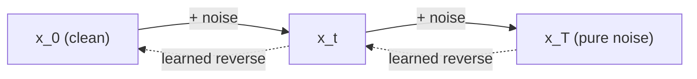
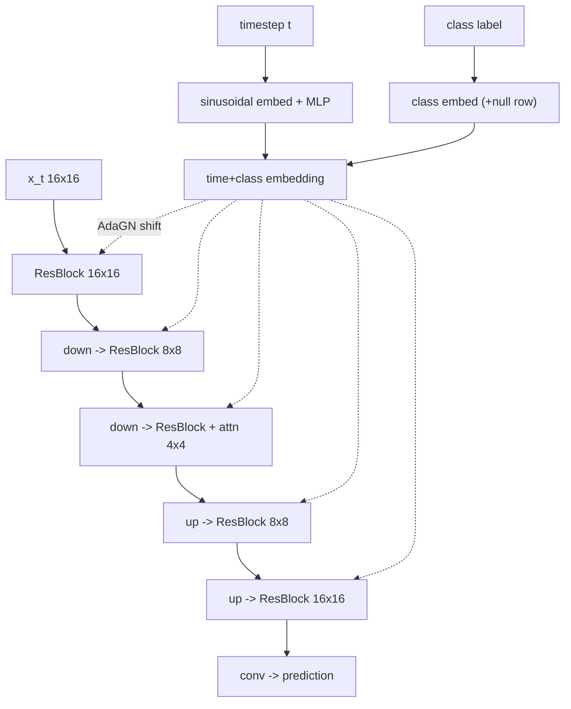

# A5 - Diffusion (DDPM / DDIM)

You build a denoising diffusion model from scratch on a tiny set of 16x16 shape images:
the forward noising process and its schedules, the training objective and the three
prediction targets it can use, the score connection that ties noise prediction to score
matching, the DDPM and DDIM samplers, and classifier-free guidance. Everything fits and
trains on a 12GB GPU; the unit tests run on CPU in under a minute.

## Why diffusion

By 2020 the generative-modeling options each had a structural weakness. GANs (Goodfellow
et al. 2014) produced sharp images but trained adversarially, which is unstable and prone
to mode collapse. Normalizing flows and autoregressive models gave exact likelihoods but
constrained the architecture (invertibility, or a fixed generation order). Score-based
models (Song & Ermon 2019, "Generative Modeling by Estimating Gradients of the Data
Distribution", [arXiv:1907.05600](https://arxiv.org/abs/1907.05600)) learned the gradient
of the log-density and sampled with Langevin dynamics, but were finicky to train across
noise scales.

Denoising diffusion (Ho, Jain, Abbeel 2020, "Denoising Diffusion Probabilistic Models",
[arXiv:2006.11239](https://arxiv.org/abs/2006.11239)) reframed generation as learning to
reverse a fixed noising process. You gradually add Gaussian noise to an image over many
steps until it becomes pure noise, then train a network to undo one step at a time. The
training objective reduces to a plain mean-squared error on the added noise, which is
stable, and the model is an ordinary feed-forward network with no invertibility or
ordering constraint. DDPM matched GAN sample quality (CIFAR-10 FID 3.17) with a simple
regression loss, and diffusion has been the backbone of image and video generation since.

## The forward process

The forward process is a fixed (not learned) Markov chain that adds a little Gaussian
noise at each step $t = 1 \dots T$:

$$q(x_t \mid x_{t-1}) = \mathcal{N}\big(x_t;\ \sqrt{1-\beta_t}\,x_{t-1},\ \beta_t I\big),$$

where $\beta_t$ is a small variance that grows with $t$. Writing $\alpha_t = 1 - \beta_t$
and the cumulative product $\bar\alpha_t = \prod_{s=1}^{t}\alpha_s$, the chain has a
closed form that jumps from the clean image $x_0$ to any noise level in one shot:

$$q(x_t \mid x_0) = \mathcal{N}\big(x_t;\ \sqrt{\bar\alpha_t}\,x_0,\ (1-\bar\alpha_t)I\big),
\qquad x_t = \sqrt{\bar\alpha_t}\,x_0 + \sqrt{1-\bar\alpha_t}\,\varepsilon,\ \ \varepsilon \sim \mathcal{N}(0,I).$$

This closed form makes training tractable: to get a training pair at timestep $t$ you
sample one $\varepsilon$ and compute $x_t$ directly, with no need to simulate the chain.
It follows from the fact that a composition of Gaussian convolutions is Gaussian, and the
variances accumulate as $1 - \bar\alpha_t$. The function `q_sample` implements exactly
this line.

The signal level $\bar\alpha_t$ runs from $\approx 1$ (almost clean) at small $t$ to
$\approx 0$ (pure noise) at $t = T$. Index convention used throughout the code: schedule
arrays have length $T$ with indices $0 \dots T-1$; `alphas_bar[0]` is the least noised
level and `alphas_bar[T-1]` $\approx 0$ is pure noise, with $\bar\alpha_{-1} := 1$ standing
for the clean image at the $t=0$ boundary.

### Noise schedules

The schedule is the sequence $\{\bar\alpha_t\}$. Two choices matter:

- Linear (Ho et al. 2020): $\beta_t$ ramps linearly from $10^{-4}$ to $2\times10^{-2}$
  over $T=1000$ steps. Simple, but it destroys signal too fast at low resolution. These
  constants are tied to $T=1000$; they do not transfer to a much smaller $T$ (the chain
  barely noises), which is why the tests only check the $\bar\alpha_T \approx 0$ endpoint
  on the cosine schedule.
- Cosine (Nichol & Dhariwal 2021, "Improved Denoising Diffusion Probabilistic Models",
  [arXiv:2102.09672](https://arxiv.org/abs/2102.09672)):

$$\bar\alpha_t = \frac{f(t)}{f(0)}, \qquad f(t) = \cos^2\!\left(\frac{t/T + s}{1+s}\cdot\frac{\pi}{2}\right),$$

  with a small offset $s = 0.008$ that keeps $\beta_t$ from getting too tiny near $t=0$,
  and $\beta_t = 1 - \bar\alpha_t/\bar\alpha_{t-1}$ clipped to $\le 0.999$. The cosine
  schedule decays signal more slowly in the middle and is the standard choice at 32x32 and
  below. Because it is defined directly on $\bar\alpha$ through $t/T$, it is
  self-normalizing in $T$.

## The reverse process and the training objective

Generation runs the chain backward: start from pure noise $x_T \sim \mathcal{N}(0,I)$ and
sample $x_{t-1}$ from a learned $p_\theta(x_{t-1}\mid x_t)$ down to $x_0$. The true reverse
posterior conditioned on the clean image, $q(x_{t-1}\mid x_t, x_0)$, is itself Gaussian
and analytic. Ho et al. derive its mean and show, after expanding the variational bound
(ELBO) into per-step KL terms, that the bound reduces to a simple objective: predict the
noise $\varepsilon$ that was added.

$$\mathcal{L} = \mathbb{E}_{x_0,\,t,\,\varepsilon}\Big[\,\big\|\varepsilon - \varepsilon_\theta(x_t, t)\big\|^2\,\Big].$$

A network $\varepsilon_\theta$ takes the noisy image and the timestep and predicts the
noise. The loss is a mean-squared error, and the timestep is sampled uniformly during
training. `diffusion_loss` implements this (with the parameterization and weighting
options below).

### The score connection

A score is the gradient of the log-density, $\nabla_x \log p(x)$. At noise level $t$, the
score of the noised distribution relates to the added noise through Tweedie's formula. The
posterior mean of the clean image is
$\mathbb{E}[x_0\mid x_t] = \big(x_t + (1-\bar\alpha_t)\,s_\theta(x_t,t)\big)/\sqrt{\bar\alpha_t}$,
and substituting the closed-form $x_t$ gives

$$s(x_t, t) = \nabla_{x_t}\log p_t(x_t) = -\frac{\varepsilon}{\sqrt{1-\bar\alpha_t}}.$$

A network trained to predict $\varepsilon$ is, up to this scaling, estimating the score.
So DDPM's noise-prediction loss is denoising score matching (Vincent 2011, "A Connection
Between Score Matching and Denoising Autoencoders"). This identity, implemented as
`score_from_eps`, is the bridge to the continuous-time view (Song et al. 2021,
"Score-Based Generative Modeling through Stochastic Differential Equations",
[arXiv:2011.13456](https://arxiv.org/abs/2011.13456)) and, later, to flow matching.

## Three prediction targets

Given the noisy $x_t$, a network can predict any of three algebraically equivalent
quantities. With $a = \sqrt{\bar\alpha_t}$ and $b = \sqrt{1-\bar\alpha_t}$ (so
$a^2 + b^2 = 1$, the pair $(x_0, \varepsilon) \to (x_t, \cdot)$ is a rotation):

| Target | Definition | Recover $x_0$, $\varepsilon$ from a prediction |
|--------|------------|-----------------------------------------------|
| $\varepsilon$-prediction | the added noise | $x_0 = (x_t - b\,\varepsilon)/a$ |
| $x_0$-prediction | the clean image | $\varepsilon = (x_t - a\,x_0)/b$ |
| $v$-prediction | $v = a\,\varepsilon - b\,x_0$ | $x_0 = a\,x_t - b\,v,\quad \varepsilon = b\,x_t + a\,v$ |

The $v$ target (Salimans & Ho 2022, "Progressive Distillation for Fast Sampling of
Diffusion Models", [arXiv:2202.00512](https://arxiv.org/abs/2202.00512)) is the rotation
of $(x_0, \varepsilon)$ by the same angle that maps them to $x_t$. It is the default in
production systems (Stable Diffusion 2 onward) because of conditioning: the
$\varepsilon$-inversion divides by $b = \sqrt{1-\bar\alpha_t}$, which is singular at
$t \to 0$, and the $x_0$-inversion divides by $a = \sqrt{\bar\alpha_t}$, singular at
$t \to T$. The $v$ target stays bounded at both ends. The `conditioning.png` figure from
`viz.py` shows the two inversions blowing up at the endpoints while $v$ stays flat.

`to_x0_eps` converts any of the three predictions into the common $(\hat x_0, \hat\varepsilon)$
pair, so the samplers work with any parameterization.

### Min-SNR loss weighting

The same MSE in different prediction spaces carries a different implicit weight across
noise levels, because the targets relate to $x_0$ by factors of the signal-to-noise ratio
$\mathrm{SNR}_t = \bar\alpha_t/(1-\bar\alpha_t)$. Naive MSE underweights the medium noise
levels that matter most. Min-SNR weighting (Hang et al. 2023, "Efficient Diffusion
Training via Min-SNR Weighting Strategy",
[arXiv:2303.09556](https://arxiv.org/abs/2303.09556)) caps the effective weight at a
constant $\gamma$ (typically 5), which speeds up convergence about 3x with no architecture
change. The cap is the same idea in every space but a different formula, because each loss
already carries its own SNR factor:

$$w_t = \frac{\min(\mathrm{SNR}_t, \gamma)}{\mathrm{SNR}_t}\ (\varepsilon),\qquad
w_t = \min(\mathrm{SNR}_t, \gamma)\ (x_0),\qquad
w_t = \frac{\min(\mathrm{SNR}_t, \gamma)}{\mathrm{SNR}_t + 1}\ (v).$$

Using the $\varepsilon$-form on a $v$-prediction loss is wrong: it over-weights the
low-noise steps. `diffusion_loss` selects the weight by the active parameterization.

## Sampling

### DDPM ancestral sampler

The ancestral sampler steps from $t = T-1$ down to $0$ using the analytic posterior mean

$$\mu_t = \frac{\sqrt{\bar\alpha_{t-1}}\,\beta_t}{1-\bar\alpha_t}\,\hat x_0
       + \frac{\sqrt{\alpha_t}\,(1-\bar\alpha_{t-1})}{1-\bar\alpha_t}\,x_t,$$

and adds Gaussian noise at every step except the last. The true posterior variance is
$\tilde\beta_t = \frac{1-\bar\alpha_{t-1}}{1-\bar\alpha_t}\,\beta_t$; Ho et al. report that
the simpler fixed choice $\beta_t$ gives comparable quality, so `ddpm_sample` exposes both
through `variance`. The default is $\tilde\beta_t$. This sampler needs about $T \approx
1000$ steps, one network evaluation each.

### DDIM and the probability-flow ODE

DDIM (Song, Meng, Ermon 2020, "Denoising Diffusion Implicit Models",
[arXiv:2010.02502](https://arxiv.org/abs/2010.02502)) rewrites the process as a
non-Markovian one whose per-step marginals match DDPM, which lets you skip timesteps. The
step is

$$x_{t-1} = \sqrt{\bar\alpha_{t-1}}\,\hat x_0 + \sqrt{1-\bar\alpha_{t-1}-\sigma_t^2}\,\hat\varepsilon + \sigma_t z,
\qquad \sigma_t = \eta\sqrt{\tfrac{1-\bar\alpha_{t-1}}{1-\bar\alpha_t}}\sqrt{1-\tfrac{\bar\alpha_t}{\bar\alpha_{t-1}}}.$$

With $\eta = 0$ the step is deterministic: it is a numerical integrator for the
probability-flow ODE, the deterministic counterpart of the reverse SDE that shares the
same marginals (Song et al. 2021). A consistent latent space along this ODE lets you
sub-sample timesteps (50 instead of 1000) for a 10-50x speedup with little quality
loss. With $\eta = 1$ the step injects variance $\tilde\beta_t$ and reproduces the DDPM
ancestral trajectory on the full grid, which `test_ddim_ddpm_consistency` checks.

Both samplers clamp the predicted $\hat x_0$ to $[-1, 1]$ each step by default, because the
clean-image estimate is unreliable at high $t$ and can otherwise blow the trajectory up.

### Classifier-free guidance

To condition on a class (or text), train one network on both conditional and
unconditional inputs by randomly dropping the condition to a null token with probability
$\approx 0.1$ (Ho & Salimans 2022, "Classifier-Free Diffusion Guidance",
[arXiv:2207.12598](https://arxiv.org/abs/2207.12598)). At sampling time, extrapolate:

$$\hat\varepsilon = \hat\varepsilon_{\text{uncond}} + w\,\big(\hat\varepsilon_{\text{cond}} - \hat\varepsilon_{\text{uncond}}\big).$$

Here $w = 1$ is the plain conditional, and $w > 1$ sharpens the distribution toward the
class at the cost of diversity. The guided process samples from a distribution
proportional to $p(x\mid c)^w\,p(x)^{1-w}$, which is not a normalized density for $w \ne 1$,
so high $w$ trades fidelity for diversity and can produce artifacts. (Diffusers names the
knob `guidance_scale`, equal to $w + 1$ in this convention.) `classifier_free_guidance`
implements the combine; the samplers run a conditional and an unconditional forward pass
per step when $w \ne 1$.

## The network

The denoiser is a small time-conditioned U-Net: GroupNorm ResNet blocks down to a 4x4
bottleneck with one self-attention layer, then back up with skip connections. The timestep
enters through a sinusoidal embedding (the same construction as the transformer's
positional encoding, indexed by the timestep value instead of a sequence position) passed
through an MLP, plus a class embedding with one extra null row for guidance. The combined
embedding is injected into each ResNet block as a per-channel shift (AdaGN). A7 replaces
this U-Net with a transformer (DiT) whose adaLN-Zero conditioning is the direct
generalization of this shift.

## What you implement

The holes are the diffusion math; the U-Net plumbing is provided (except the two
diffusion-specific pieces noted). See `ASSIGNMENT.md` for the per-function contract.

- `schedule.py`: `cosine_alpha_bar`.
- `diffusion.py`: `q_sample`, `v_target`, `to_x0_eps`, `score_from_eps`, `diffusion_loss`.
- `sampling.py`: `classifier_free_guidance`, `ddpm_sample`, `ddim_sample`.
- `unet.py`: `timestep_embedding` and the AdaGN injection line in `ResBlock.forward`.

Verify with `make verify A=a05_diffusion`; render the figures with `make viz A=a05_diffusion`.

## Where this goes next

- A6 (flow matching) replaces the noising SDE with a directly parameterized velocity field
  along straight-line paths. The $v$ target here is the bridge: flow matching's velocity is
  structurally the same direction in $(x_0, \varepsilon)$ space, and the deterministic
  DDIM ODE is the object flow matching learns more directly (Lipman et al. 2022,
  [arXiv:2210.02747](https://arxiv.org/abs/2210.02747)).
- A7 (latent DiT) keeps the schedule, the $v$ objective, classifier-free guidance, and
  DDIM unchanged, and swaps the U-Net for a transformer with adaLN-Zero conditioning
  (Peebles & Xie 2023, [arXiv:2212.09748](https://arxiv.org/abs/2212.09748)), operating in
  the latent space of a VAE.
- A13 (VLA action head) applies the same denoising objective to robot action sequences:
  the action trajectory is the "image" and the denoiser is conditioned on vision and
  language (Chi et al. 2023, Diffusion Policy,
  [arXiv:2303.04137](https://arxiv.org/abs/2303.04137)).

## References

- Ho, Jain, Abbeel 2020, DDPM, [arXiv:2006.11239](https://arxiv.org/abs/2006.11239).
- Song, Meng, Ermon 2020, DDIM, [arXiv:2010.02502](https://arxiv.org/abs/2010.02502).
- Song et al. 2021, Score SDE, [arXiv:2011.13456](https://arxiv.org/abs/2011.13456).
- Nichol & Dhariwal 2021, Improved DDPM (cosine schedule),
  [arXiv:2102.09672](https://arxiv.org/abs/2102.09672).
- Salimans & Ho 2022, $v$-prediction, [arXiv:2202.00512](https://arxiv.org/abs/2202.00512).
- Ho & Salimans 2022, classifier-free guidance,
  [arXiv:2207.12598](https://arxiv.org/abs/2207.12598).
- Hang et al. 2023, Min-SNR weighting, [arXiv:2303.09556](https://arxiv.org/abs/2303.09556).
- Karras et al. 2022, EDM design space, [arXiv:2206.00364](https://arxiv.org/abs/2206.00364).
