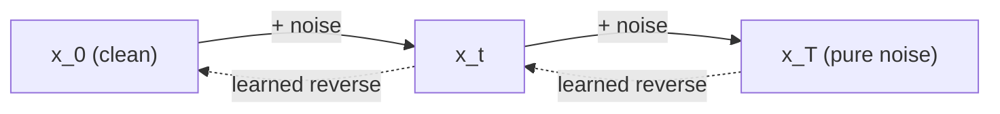
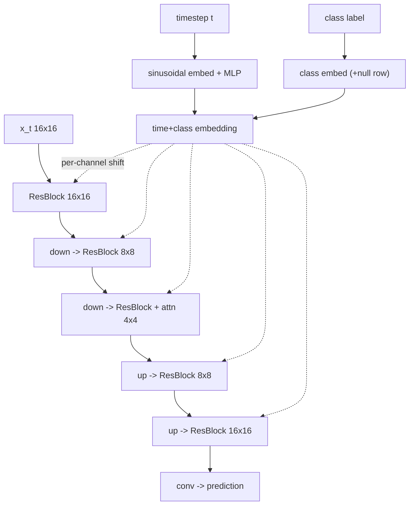

# A5 - Diffusion (DDPM / DDIM)

Denoising diffusion generates images by reversing a fixed Gaussian noising process. A forward
process adds noise to an image over many steps until it is indistinguishable from white noise;
a network learns to undo one step at a time; sampling runs that learned reverse from pure noise
back to an image. This assignment covers the forward schedules, the closed-form noising, the
three prediction targets ($\varepsilon$, $x_0$, $v$) and the algebra relating them, the score
connection that links noise prediction to score matching, Min-SNR loss weighting, the DDPM and
DDIM samplers (with the probability-flow ODE), and classifier-free guidance.

Build a denoising diffusion model from scratch on a tiny set of 16x16 shape images. Implement
the diffusion math (the schedule, the closed-form noising, the parameterization
conversions, the loss, both samplers, the guidance combine) and two diffusion-specific pieces
of the denoiser network; the rest of the U-Net is provided. Everything trains on a 12GB GPU,
and the unit tests run on CPU in under a minute.

Required reading before starting:
- Ho, Jain, Abbeel 2020, "Denoising Diffusion Probabilistic Models",
  [arXiv:2006.11239](https://arxiv.org/abs/2006.11239).
- Song, Meng, Ermon 2020, "Denoising Diffusion Implicit Models",
  [arXiv:2010.02502](https://arxiv.org/abs/2010.02502).
- Ho & Salimans 2022, "Classifier-Free Diffusion Guidance",
  [arXiv:2207.12598](https://arxiv.org/abs/2207.12598).

## Lecture notes

### What a generative model is asked to do

The training set is a finite pile of images drawn from an unknown distribution
$p_{\text{data}}(x)$ over the pixel space. A generative model is a machine that produces fresh
draws from an approximation to that distribution. Two different capabilities can be asked of
such a machine, and they do not come together automatically.

The first is sampling: emit a new $x$ that could plausibly have come from $p_{\text{data}}$.
The second is density evaluation: given an $x$, return the number $p_\theta(x)$, the model's
probability density at that point. Density evaluation makes maximum-likelihood training
available, since fitting $\theta$ by maximizing $\sum_i \log p_\theta(x_i)$ over the training
images requires evaluating the density at each of them. It is also the hard part. A density
must integrate to one over the whole space, and for a general function of a 256-dimensional (or
196608-dimensional) input that normalizing integral cannot be computed, so a model that outputs
an arbitrary positive number is not a density and cannot be trained by likelihood.

Every family below is a different resolution of that tension, and each pays for it somewhere.

#### Measuring sample quality

A model that only samples has no likelihood to report, so sample quality is measured by
comparing two sets of images statistically. The standard number is the Frechet inception
distance (FID, Heusel et al. 2017). Push a large set of generated images and a large set of
real images through a fixed pretrained image classifier (Inception-v3), keep one intermediate
feature vector per image, and fit a Gaussian to each of the two feature clouds, giving means
$\mu_r, \mu_g$ and covariances $\Sigma_r, \Sigma_g$. FID is the Frechet distance between those
two Gaussians, which for Gaussians is the 2-Wasserstein distance and has a closed form:

$$\mathrm{FID} = \lVert \mu_r - \mu_g \rVert^2 + \operatorname{tr}\!\big(\Sigma_r + \Sigma_g - 2(\Sigma_r\Sigma_g)^{1/2}\big).$$

Lower is better and zero means the two feature Gaussians coincide. FID compares only the first
two moments of a learned feature distribution, so it is blind to anything those moments miss,
and its value depends on the particular classifier and on how many samples were used. It is the
number quoted below because it is the number the papers quote, not because it settles the
question of what a good image is.

### The options before diffusion

Generative adversarial networks (Goodfellow et al. 2014) train two networks against each other.
A generator maps a noise vector to an image; a discriminator tries to tell generated images from
real ones; the generator is trained to make the discriminator fail. There is no density anywhere
in this, only sampling, and the images come out sharp because nothing in the objective rewards
hedging between plausible outputs. Two failure modes come with the setup. The solution being
sought is an equilibrium of a two-player game rather than the minimum of a single scalar loss,
so gradient descent on both players can orbit a solution instead of settling into it. And mode
collapse: the generator discovers a narrow set of outputs the current discriminator scores as
real and emits variations of only those, dropping entire regions of $p_{\text{data}}$, while the
loss looks fine.

Normalizing flows build the model as an invertible map $f_\theta$ from a simple base
distribution (an isotropic Gaussian $p_z$) onto the data. The change-of-variables formula then
gives the density exactly:

$$\log p_\theta(x) = \log p_z\big(f_\theta^{-1}(x)\big) + \log\big|\det J_{f_\theta^{-1}}(x)\big|,$$

where $J$ is the Jacobian of the inverse map. Sampling is a forward pass from a Gaussian draw
and the likelihood is exact, which is as clean as it gets. The price is architectural: every
layer must be invertible, must preserve dimension, and must have a Jacobian determinant that
can be computed cheaply, which excludes most of the layers that work well in ordinary networks.

Autoregressive models factor the density with the chain rule of probability over pixels in a
fixed order, $p(x) = \prod_i p(x_i \mid x_{<i})$, and model each conditional with a network.
The likelihood is exact and the architecture is unconstrained apart from the masking that
enforces the ordering. Sampling costs one network evaluation per pixel, in sequence, and the
ordering itself is an arbitrary choice imposed on a 2D signal that has no natural one.

Score-based models drop the density and keep only its gradient. The score of a distribution is

$$s(x) = \nabla_x \log p(x),$$

a vector field over the input space pointing in the direction of steepest increase in
log-density. The normalizing constant disappears under the gradient, since
$\nabla_x \log\big(\tilde p(x)/Z\big) = \nabla_x \log \tilde p(x)$ for any constant $Z$, so a
network can output a score without ever confronting the intractable integral. Given a score,
samples come from Langevin dynamics, which is gradient ascent on $\log p$ with a calibrated
amount of noise added at each step:

$$x \leftarrow x + \tfrac{\epsilon}{2}\, s(x) + \sqrt{\epsilon}\, z, \qquad z\sim\mathcal{N}(0,I).$$

Without the noise term the iteration climbs to a mode and stops. With noise of exactly that
scale, the iteration's stationary distribution is $p$ itself as $\epsilon \to 0$, so it wanders
the distribution in proportion to density instead of collapsing onto its peak. Song & Ermon
2019 ([arXiv:1907.05600](https://arxiv.org/abs/1907.05600)) made this work on images by
estimating the score at several noise levels, since the score learned from data alone is
meaningless in the vast regions where no training point ever lands. Getting the noise levels,
the step sizes, and the transitions between them to cooperate was the difficult part.

### Diffusion

Denoising diffusion (Ho, Jain, Abbeel 2020) reframed generation as learning to reverse a fixed
noising process. The forward process gradually adds Gaussian noise to an image over many steps
until it becomes pure noise, then a network learns to undo one step at a time. The training
objective reduces to a plain mean-squared error on the added noise, which is stable, and the
model is an ordinary feed-forward network with no invertibility or ordering constraint. DDPM
reached FID 3.17 on unconditional CIFAR-10, competitive with the GANs of the time, from a
regression loss, and diffusion has been the basis of image and video generation since.

### The forward process

The forward process is a fixed (not learned) Markov chain: a sequence of random variables in
which the distribution of the next one depends on the current one alone and not on the earlier
history. Each step adds a little Gaussian noise and shrinks the signal slightly, for
$t = 1 \dots T$:

$$q(x_t \mid x_{t-1}) = \mathcal{N}\big(x_t;\ \sqrt{1-\beta_t}\,x_{t-1},\ \beta_t I\big),$$

where $\beta_t$ is a small variance that grows with $t$. Write $\alpha_t = 1 - \beta_t$ for the
per-step signal factor and $\bar\alpha_t = \prod_{s=1}^{t}\alpha_s$ for its cumulative product.

The chain has a closed form that jumps from the clean image $x_0$ to any noise level in one
shot:

$$q(x_t \mid x_0) = \mathcal{N}\big(x_t;\ \sqrt{\bar\alpha_t}\,x_0,\ (1-\bar\alpha_t)I\big),
\qquad x_t = \sqrt{\bar\alpha_t}\,x_0 + \sqrt{1-\bar\alpha_t}\,\varepsilon,\ \ \varepsilon \sim \mathcal{N}(0,I).$$

That closed form is worth deriving, because it is one line of variance bookkeeping and the whole
training scheme rests on it. Write one step in sampled form, $x_t = \sqrt{\alpha_t}\,x_{t-1} +
\sqrt{\beta_t}\,\varepsilon_t$ with $\varepsilon_t$ standard normal, and substitute the same
expression for $x_{t-1}$:

$$x_t = \sqrt{\alpha_t \alpha_{t-1}}\,x_{t-2} + \sqrt{\alpha_t \beta_{t-1}}\,\varepsilon_{t-1} + \sqrt{\beta_t}\,\varepsilon_t.$$

The last two terms are independent zero-mean Gaussians, so their sum is one Gaussian whose
variance is the sum of theirs:

$$\alpha_t\beta_{t-1} + \beta_t = \alpha_t(1-\alpha_{t-1}) + (1-\alpha_t) = 1 - \alpha_t\alpha_{t-1}.$$

The signal coefficient squared and the noise variance again add to one, so the two-step chain
has the same shape as the one-step chain with $\alpha_t\alpha_{t-1}$ in place of $\alpha_t$.
Repeating the substitution down to $x_0$ replaces the product with $\bar\alpha_t$, and the
variance with $1-\bar\alpha_t$. This makes training tractable: a training pair at timestep $t$
costs one draw of $\varepsilon$ and one evaluation of the formula, with no need to simulate the
chain.

The signal level $\bar\alpha_t$ runs from $\approx 1$ (almost clean) at small $t$ to $\approx 0$
(pure noise) at $t = T$. For an $x_0$ scaled to roughly unit variance per pixel, $\bar\alpha_t$
is the signal power and $1-\bar\alpha_t$ the noise power in $x_t$, so their ratio is a
signal-to-noise ratio in the ordinary sense:

$$\mathrm{SNR}_t = \frac{\bar\alpha_t}{1-\bar\alpha_t}.$$

It runs from very large at $t \to 0$ to near zero at $t = T$, and it is the natural axis along
which everything else in these notes varies.

One note on indices, because the mathematical convention and the array convention differ by one.
The math above runs $t$ from $1$ to $T$ and treats $x_0$ as the clean image, so $\bar\alpha_0 =
1$ by definition. The code stores schedules in 0-based arrays of length $T$, so `alphas_bar[i]`
holds $\bar\alpha_{i+1}$: `alphas_bar[0]` is one forward step away from clean and
`alphas_bar[T-1]` is $\approx 0$, pure noise. The level $\bar\alpha_0 = 1$ has no array slot, and
both samplers substitute the literal $1$ wherever the previous level is needed at the first
index, which is the meaning of the `alphas_bar[-1] := 1` remark in the module docstrings.



#### Noise schedules

The schedule is the sequence $\{\bar\alpha_t\}$. Two choices matter:

- Linear (Ho et al. 2020): $\beta_t$ ramps linearly from $10^{-4}$ to $2\times10^{-2}$ over
  $T=1000$ steps. Simple, but it destroys signal too fast at low resolution. These constants
  are tied to $T=1000$ and do not transfer to a much smaller $T$, where the chain barely
  noises.
- Cosine (Nichol & Dhariwal 2021, "Improved Denoising Diffusion Probabilistic Models",
  [arXiv:2102.09672](https://arxiv.org/abs/2102.09672)):

$$\bar\alpha_t = \frac{f(t)}{f(0)}, \qquad f(t) = \cos^2\!\left(\frac{t/T + s}{1+s}\cdot\frac{\pi}{2}\right),$$

  with a small offset $s = 0.008$ that keeps $\beta_t$ from getting too tiny near $t=0$, and
  $\beta_t = 1 - \bar\alpha_t/\bar\alpha_{t-1}$ clipped to $\le 0.999$. The cosine schedule
  decays signal more slowly in the middle and is the standard choice at 32x32 and below.
  Because it is defined directly on $\bar\alpha$ through $t/T$, it is self-normalizing in
  $T$: $\bar\alpha_T \approx 0$ at any $T$.

The $\cos^2$ is not decoration. The section on prediction targets below shows that
$\sqrt{\bar\alpha_t}$ and $\sqrt{1-\bar\alpha_t}$ are the cosine and sine of an angle, and this
schedule is the one that sweeps that angle at a nearly constant rate in $t$.

### The reverse process

Generation runs the chain backward: start from pure noise $x_T \sim \mathcal{N}(0,I)$, draw
$x_{T-1}$, then $x_{T-2}$, down to $x_0$. Doing that needs $q(x_{t-1} \mid x_t)$, the true
reverse of one forward step, and that distribution is not available. Getting it from Bayes'
rule requires $q(x_{t-1})$, the marginal distribution of the noised data at level $t-1$, which
is an integral over the entire data distribution.

The way through is that the reverse step is tractable once the clean image is known. Condition on
$x_0$ and apply Bayes' rule to the two pieces the forward process does give:

$$q(x_{t-1}\mid x_t, x_0) \;\propto\; q(x_t \mid x_{t-1})\, q(x_{t-1}\mid x_0).$$

Both factors are Gaussian densities, so as a function of $x_{t-1}$ the product has an exponent
that is a quadratic. Any distribution whose log-density is quadratic is Gaussian, and completing
the square reads off its mean and variance:

$$\tilde\mu_t(x_t, x_0) = \frac{\sqrt{\bar\alpha_{t-1}}\,\beta_t}{1-\bar\alpha_t}\,x_0
       + \frac{\sqrt{\alpha_t}\,(1-\bar\alpha_{t-1})}{1-\bar\alpha_t}\,x_t,
\qquad \tilde\beta_t = \frac{1-\bar\alpha_{t-1}}{1-\bar\alpha_t}\,\beta_t.$$

The mean has the shape of a scalar Kalman update. Two sources of information about $x_{t-1}$ are
being combined, a prior term carried by $x_0$ and a measurement term carried by $x_t$, with
weights set by the variances of the two, and the resulting variance $\tilde\beta_t$ is smaller
than either input variance.

This posterior is exactly what a sampler wants, except that it is conditioned on the very thing
generation is trying to produce. The whole learning problem is the substitution of an estimate
$\hat x_0$ for the unavailable $x_0$ in that formula, and a network trained on the forward
process supplies that estimate.

### The training objective

Ho et al. do not train the network on the posterior mean directly. They start from maximum
likelihood, and the objective collapses to a mean-squared error on the noise. The collapse
takes two facts about probability that this section builds up first.

#### KL divergence and the evidence lower bound

The Kullback-Leibler divergence between two distributions is the expected log-ratio,

$$D_{\mathrm{KL}}(q \,\Vert\, p) = \mathbb{E}_{x \sim q}\!\left[\log \frac{q(x)}{p(x)}\right] \ge 0,$$

zero exactly when $q = p$. It measures how badly $p$ fits samples that actually come from $q$.
It is not symmetric and not a metric, and it is used here for one property in particular: for
two Gaussians with the same fixed covariance $\sigma^2 I$, the log-ratio's random parts cancel
and the divergence reduces to a scaled squared distance between the means,

$$D_{\mathrm{KL}}\big(\mathcal{N}(\mu_q, \sigma^2 I)\,\Vert\,\mathcal{N}(\mu_p, \sigma^2 I)\big)
= \frac{1}{2\sigma^2}\lVert \mu_q - \mu_p \rVert^2.$$

That identity is the bridge from a probabilistic objective to a regression loss.

The second fact is the evidence lower bound. Training by maximum likelihood wants
$\log p_\theta(x_0)$, but the model defines a joint distribution over the whole chain
$x_{0:T}$, and the quantity of interest is the marginal $p_\theta(x_0) = \int p_\theta(x_{0:T})
\, dx_{1:T}$, an intractable integral over every possible noising path. Multiply and divide by
the forward process $q(x_{1:T}\mid x_0)$, which is known, and the integral becomes an
expectation:

$$\log p_\theta(x_0) = \log \mathbb{E}_{q}\!\left[\frac{p_\theta(x_{0:T})}{q(x_{1:T}\mid x_0)}\right]
\;\ge\; \mathbb{E}_{q}\!\left[\log \frac{p_\theta(x_{0:T})}{q(x_{1:T}\mid x_0)}\right].$$

The inequality is Jensen's, applied to the concave logarithm: the log of an average is at least
the average of the logs. The right-hand side is a quantity that can be estimated by sampling
noising paths, and it lower-bounds the log-likelihood, the "evidence". Hence evidence lower
bound, or ELBO. The gap between the two sides is $D_{\mathrm{KL}}(q(x_{1:T}\mid x_0) \,\Vert\,
p_\theta(x_{1:T}\mid x_0))$, so the bound is tight when the forward process matches the model's
own posterior over paths.

#### From the bound to a squared error on the noise

Regroup the ELBO term by term along the chain. Because both $q$ and $p_\theta$ factor over
consecutive timesteps, the bound rearranges into a sum of per-step KL divergences plus two
endpoint terms:

$$-\log p_\theta(x_0) \le \sum_{t>1} D_{\mathrm{KL}}\big(q(x_{t-1}\mid x_t, x_0)\,\Vert\,p_\theta(x_{t-1}\mid x_t)\big) + \text{(endpoints)}.$$

Every term in that sum compares the analytic posterior derived above against the model's reverse
step. Ho et al. give the model's reverse step a fixed, untrained variance, which makes each pair
of distributions two Gaussians with matching covariance, and the Gaussian-KL identity turns each
term into a squared difference of means. So the model only has to predict $\tilde\mu_t$.

Rather than predicting the mean directly, substitute. Solving the closed-form noising for the
clean image gives $x_0 = (x_t - \sqrt{1-\bar\alpha_t}\,\varepsilon)/\sqrt{\bar\alpha_t}$, and
putting that into $\tilde\mu_t$ rewrites the posterior mean in terms of $x_t$ and $\varepsilon$
alone. The squared difference of means then becomes a squared difference of noises times a
scalar that depends on $t$ through the schedule. Ho et al. drop that scalar, which leaves

$$\mathcal{L} = \mathbb{E}_{x_0,\,t,\,\varepsilon}\Big[\,\big\lVert\varepsilon - \varepsilon_\theta(x_t, t)\big\rVert^2\,\Big],$$

with $t$ drawn uniformly and $\varepsilon$ standard normal. A network $\varepsilon_\theta$ takes
the noisy image and the timestep and predicts the noise. Dropping the scalar makes the objective
no longer the ELBO, and Ho et al. report that it gives better samples than keeping it. That
dropped scalar comes back as a design choice under loss weighting below.

#### Tweedie's formula and the score connection

Nothing in the derivation so far mentioned scores, yet the trained network turns out to be one.
The link is a small identity about Gaussian-corrupted observations.

At noise level $t$ the noisy data distribution is a Gaussian blur of the data distribution,

$$p_t(x_t) = \int p_{\text{data}}(x_0)\, \mathcal{N}(x_t;\, a x_0,\, b^2 I)\, dx_0,
\qquad a = \sqrt{\bar\alpha_t},\ b = \sqrt{1-\bar\alpha_t}.$$

Differentiate under the integral. The only $x_t$ dependence is in the Gaussian, whose gradient is
itself times $(a x_0 - x_t)/b^2$:

$$\nabla_{x_t} p_t(x_t) = \int p_{\text{data}}(x_0)\, \mathcal{N}(x_t;\, a x_0,\, b^2 I)\, \frac{a x_0 - x_t}{b^2}\, dx_0.$$

Divide both sides by $p_t(x_t)$. The left side becomes the score, and the right side becomes an
expectation against the posterior over clean images given $x_t$:

$$\nabla_{x_t}\log p_t(x_t) = \frac{a\,\mathbb{E}[x_0 \mid x_t] - x_t}{b^2}.$$

This is Tweedie's formula: the score of a Gaussian-blurred distribution is the posterior mean of
the clean signal, rescaled. Rearranged for the posterior mean it reads
$\mathbb{E}[x_0\mid x_t] = \big(x_t + (1-\bar\alpha_t)\,s(x_t,t)\big)/\sqrt{\bar\alpha_t}$.

Now bring in the forward process, $x_t = a x_0 + b \varepsilon$, which gives
$\mathbb{E}[x_0\mid x_t] = (x_t - b\,\mathbb{E}[\varepsilon \mid x_t])/a$. Substituting that
into the line above cancels $x_t$ and leaves

$$s(x_t, t) = -\frac{\mathbb{E}[\varepsilon \mid x_t]}{\sqrt{1-\bar\alpha_t}}.$$

The last step is classical estimation. The minimizer of a squared-error objective is the
conditional mean of the target given the input, so a network trained to convergence on
$\lVert\varepsilon - \varepsilon_\theta(x_t,t)\rVert^2$ approaches
$\mathbb{E}[\varepsilon\mid x_t]$, and therefore approaches the score up to the fixed factor
$-1/\sqrt{1-\bar\alpha_t}$. DDPM's noise-prediction loss is denoising score matching (Vincent
2011, "A Connection Between Score Matching and Denoising Autoencoders"), arrived at from
maximum likelihood rather than from Langevin sampling. `score_from_eps` is this one line, and
this identity lets the continuous-time formulation (Song et al. 2021,
[arXiv:2011.13456](https://arxiv.org/abs/2011.13456)) treat the DDPM network as a score
estimator.

### Three prediction targets

Given the noisy $x_t$, a network can predict any of three algebraically equivalent quantities.
Keep the shorthand $a = \sqrt{\bar\alpha_t}$ and $b = \sqrt{1-\bar\alpha_t}$, and note that
$a^2 + b^2 = 1$ by construction of the schedule.

That last identity is the whole structure of this section. A pair of numbers whose squares sum
to one is a cosine and a sine, so define the angle $\phi_t$ by $a = \cos\phi_t$, $b =
\sin\phi_t$. It runs from $0$ at $t=0$ (all signal) to $\pi/2$ at $t=T$ (all noise). The forward
process and the $v$ target together are then a rotation by $\phi_t$ acting on the pair
$(x_0, \varepsilon)$, coordinate by coordinate:

$$\begin{bmatrix} x_t \\ v \end{bmatrix}
= \begin{bmatrix} \cos\phi_t & \sin\phi_t \\ -\sin\phi_t & \cos\phi_t \end{bmatrix}
\begin{bmatrix} x_0 \\ \varepsilon \end{bmatrix},
\qquad v = a\,\varepsilon - b\,x_0.$$

The top row is the closed-form noising. The bottom row defines $v$ (Salimans & Ho 2022,
"Progressive Distillation for Fast Sampling of Diffusion Models",
[arXiv:2202.00512](https://arxiv.org/abs/2202.00512)) as the component orthogonal to $x_t$ in
that same rotated frame. The cosine schedule reads cleanly in this frame: it sets $\bar\alpha_t$
to $\cos^2$ of a quantity linear in $t/T$, so up to the offset $s$ and the normalization by
$f(0)$, it is the schedule that advances $\phi_t$ at a constant angular rate.

Given any one of the three predictions, the other two follow:

| Prediction | Definition | Recovering $x_0$ and $\varepsilon$ |
|--------|------------|-----------------------------------------------|
| $\varepsilon$-prediction | the added noise | $x_0 = (x_t - b\,\varepsilon)/a$ |
| $x_0$-prediction | the clean image | $\varepsilon = (x_t - a\,x_0)/b$ |
| $v$-prediction | $v = a\,\varepsilon - b\,x_0$ | $x_0 = a\,x_t - b\,v,\qquad \varepsilon = b\,x_t + a\,v$ |

`to_x0_eps` is this table, and the samplers call it so that a single sampler body works with any
of the three.

#### Numerical conditioning of the three inversions

Algebraic equivalence is not numerical equivalence. A network's output carries error, and each
row of the table is a linear map that turns that error into an error in $x_0$ and $\varepsilon$.
The three targets differ in the amplification factor of that map, the ratio of output error to
input error. In linear-algebra terms that factor is the conditioning of the inversion, and here
it can be read straight off the coefficients.

If the network predicts $\varepsilon$, recovering the clean image divides by $a =
\sqrt{\bar\alpha_t}$. At high noise levels $a \to 0$, so a small error in $\hat\varepsilon$ turns
into an arbitrarily large error in $\hat x_0$. If the network predicts $x_0$, recovering the noise
divides by $b = \sqrt{1-\bar\alpha_t}$, which goes to zero at the clean end, so the same blowup
happens at small $t$ instead. Each of the two obvious targets is badly conditioned at one end of
the schedule.

The $v$ target has neither problem. Its recovery is the inverse rotation, and a rotation matrix
is orthogonal, so it preserves lengths exactly: an error of size $\delta$ in $\hat v$ produces an
error of size $\delta$ in $\hat x_0$ and in $\hat\varepsilon$, at every $t$, with no dependence on
the schedule at all. Amplification is exactly $1$ everywhere.

The `conditioning.png` figure plots this. Its two rising curves are $1/\sqrt{1-\bar\alpha_t}$ and
$1/\sqrt{\bar\alpha_t}$, the gains of the two divisions, labeled by which quantity each division
produces (the curve named "eps inversion" is the map that produces $\hat\varepsilon$, the one
used when the network predicts $x_0$). Each blows up at one endpoint on a log axis; the $v$ line
sits flat at $1$.

Salimans & Ho introduced $v$ for progressive distillation, where a student model takes very large
steps and therefore has to be accurate at both extremes of the schedule at once. Stable Diffusion
2's 768-pixel model is trained with the $v$ target. The assignment defaults to `kind="v"`
throughout for the same reason.

#### Loss weighting across noise levels

Training draws $t$ uniformly and takes an unweighted mean-squared error in whichever space the
network predicts. That is a weighting decision even when it looks like the absence of one,
because the same physical error means different amounts in different spaces.

Measure everything in $x_0$ space, where an error has a fixed meaning: how wrong the recovered
image is. Reusing the recovery formulas above, an error $\Delta\varepsilon$ in a noise prediction
becomes an $x_0$ error of $(b/a)\,\Delta\varepsilon$, and an error $\Delta v$ in a $v$ prediction
becomes an $x_0$ error of $b\,\Delta v$. In terms of the signal-to-noise ratio, using
$b^2/a^2 = 1/\mathrm{SNR}_t$ and $b^2 = 1/(\mathrm{SNR}_t+1)$:

$$\lVert\Delta x_0\rVert^2 = \frac{1}{\mathrm{SNR}_t}\lVert\Delta\varepsilon\rVert^2,
\qquad \lVert\Delta x_0\rVert^2 = \frac{1}{\mathrm{SNR}_t + 1}\lVert\Delta v\rVert^2,$$

and an $x_0$ prediction needs no conversion at all.
So a flat MSE on $\varepsilon$ is really an $x_0$ objective weighted by $\mathrm{SNR}_t$, which
is unbounded as $t \to 0$: the low-noise steps, where the task is nearly trivial, dominate the
gradient. A flat MSE on $x_0$ is the opposite extreme.

Min-SNR weighting (Hang et al. 2023, "Efficient Diffusion Training via Min-SNR Weighting
Strategy", [arXiv:2303.09556](https://arxiv.org/abs/2303.09556)) fixes the target: put weight
$\min(\mathrm{SNR}_t, \gamma)$ on the $x_0$-space error, with $\gamma$ typically 5. Below the cap
the weighting is the ordinary SNR weighting; above it the weight is frozen, so the easy low-noise
steps stop crowding out the rest. Hang et al. report roughly 3x faster convergence with no
architecture change.

Expressing that one target in each of the three prediction spaces means dividing out the factor
each space already carries, which gives three different formulas for the same weighting:

$$w_t = \frac{\min(\mathrm{SNR}_t, \gamma)}{\mathrm{SNR}_t}\ (\varepsilon),\qquad
w_t = \min(\mathrm{SNR}_t, \gamma)\ (x_0),\qquad
w_t = \frac{\min(\mathrm{SNR}_t, \gamma)}{\mathrm{SNR}_t + 1}\ (v).$$

Applying the $\varepsilon$-form to a $v$-prediction loss over-weights the low-noise steps by a
factor of $(\mathrm{SNR}_t+1)/\mathrm{SNR}_t$, so `diffusion_loss` picks the formula from the
active parameterization rather than hard-coding one.

### Sampling

#### The DDPM ancestral sampler

Ancestral sampling means drawing the variables of a joint distribution one at a time in the order
its factorization dictates, each conditioned on the ones already drawn. Here the factorization is
the reverse chain, so the sampler starts at $x_T \sim \mathcal{N}(0,I)$ and steps down to $x_0$,
at each step running the network, converting its output to $\hat x_0$, and substituting that
estimate into the analytic posterior mean:

$$\mu_t = \frac{\sqrt{\bar\alpha_{t-1}}\,\beta_t}{1-\bar\alpha_t}\,\hat x_0
       + \frac{\sqrt{\alpha_t}\,(1-\bar\alpha_{t-1})}{1-\bar\alpha_t}\,x_t.$$

Gaussian noise scaled by the posterior standard deviation is added at every step except the last,
where the previous level is the clean image itself and the mean is the answer. The true posterior
variance is $\tilde\beta_t = \frac{1-\bar\alpha_{t-1}}{1-\bar\alpha_t}\,\beta_t$; Ho et al. report
that the simpler fixed choice $\beta_t$ gives comparable quality, so `ddpm_sample` exposes both
through its `variance` argument. This sampler visits every level, so it costs about $T \approx
1000$ network evaluations per image, which is the reason to look for something cheaper.

#### Continuous time, the reverse SDE, and the probability-flow ODE

Sending $T \to \infty$ with $\beta_t$ shrinking to match turns the chain into a stochastic
differential equation, and the discrete chain becomes its Euler-Maruyama discretization. A
stochastic differential equation is an ODE with a noise term,

$$dx = f(x,t)\,dt + g(t)\,dw,$$

where $f$ is the drift (the deterministic part of the motion), $g$ the diffusion coefficient, and
$dw$ an increment of Brownian motion, which supplies independent Gaussian noise of variance $dt$.
For the forward process $f$ is a slight pull toward the origin and $g$ injects the noise, which
is exactly the per-step "shrink and add noise" written continuously.

Sampling depends on the marginal $p_t$: the distribution of $x_t$ on its own, with the starting
image and the particular path taken both integrated out. Two facts about it, brought into
diffusion by Song et al. 2021, do the work.

The first is that the process can be run backward. Anderson (1982) showed that a diffusion has a
reverse-time counterpart, which for the SDE above is

$$dx = \big[f(x,t) - g(t)^2\,\nabla_x \log p_t(x)\big]dt + g(t)\,d\bar w,$$

integrated from $t=T$ to $t=0$. The only unknown in it is the score, and the previous section
established that the trained network supplies exactly that. Discretizing this reverse SDE
recovers the ancestral sampler.

The second is that the noise is optional. Among all processes sharing the same marginals $p_t$
there is a deterministic one, the probability-flow ODE:

$$\frac{dx}{dt} = f(x,t) - \tfrac{1}{2}g(t)^2\,\nabla_x\log p_t(x).$$

It differs from the reverse SDE only in the factor of $\tfrac12$ on the score term and in having
no noise at all. Halving that coefficient compensates exactly for the removed diffusion: the
density transported by the ODE evolves the same way in $t$ as the density transported by the SDE,
even though no individual trajectory of one matches any trajectory of the other. Sampling from
$p_0$ therefore does not require injecting noise along the way; it only requires starting from a
draw of $p_T$ and integrating a deterministic vector field. That reframes sampling as numerical
integration, where step count is a solver accuracy question rather than a fixed property of the
chain.

#### DDIM

DDIM (Song, Meng, Ermon 2020) reaches the same place from the discrete side. It constructs a
family of non-Markovian forward processes, meaning each step is allowed to depend on $x_0$ as
well as on the immediately preceding state, and picks the family so that every marginal
$q(x_t\mid x_0)$ is identical to DDPM's. Since the training objective only ever saw those
marginals, a network trained as a DDPM model is already a valid model for every member of the
family, with no retraining. The reverse step of the family is

$$x_{t-1} = \sqrt{\bar\alpha_{t-1}}\,\hat x_0 + \sqrt{1-\bar\alpha_{t-1}-\sigma_t^2}\,\hat\varepsilon + \sigma_t z,
\qquad \sigma_t = \eta\sqrt{\tfrac{1-\bar\alpha_{t-1}}{1-\bar\alpha_t}}\sqrt{1-\tfrac{\bar\alpha_t}{\bar\alpha_{t-1}}}.$$

The free parameter $\eta$ selects the member. At $\eta = 1$ the injected variance equals
$\tilde\beta_t$ and the update reproduces the DDPM ancestral trajectory step for step on the full
grid; the consistency test checks exactly that. At $\eta = 0$ the step is deterministic and is a
first-order integrator for the probability-flow ODE.

Step skipping follows from the form of the update rather than from anything about $\eta$. The
right-hand side refers to the schedule only through the pair $(\bar\alpha_t, \bar\alpha_{t-1})$,
and nothing requires those two levels to be adjacent, because the family was built to leave every
marginal untouched. Any decreasing subsequence of levels is therefore a legal sampler, and the
network is still being evaluated at noise levels it was trained on. Cutting a 1000-level chain
down to a few tens of levels is the 10x to 50x wall-clock speedup Song et al. report, with
modest quality loss. A separate
consequence of $\eta = 0$ is that the map from $x_T$ to $x_0$ becomes a deterministic function, so
$x_T$ behaves as a latent code for the generated image and interpolating between two such codes
produces a smooth sweep between the two images.

In this assignment `ddim_sample` takes the list of timesteps to visit; `viz.py` passes every
fourth level of a $T=200$ schedule, so 50 network evaluations per image.

Both samplers benefit from clamping the predicted $\hat x_0$ to $[-1, 1]$ at each step, since the
clean-image estimate is unreliable at high $t$ and an out-of-range estimate can push the
trajectory somewhere the network has never seen. The provided `_predict` clamps and then
recomputes $\hat\varepsilon$ from the clamped $\hat x_0$, so the pair it returns still satisfies
the forward-process relation with the current $x_t$.

#### Classifier-free guidance

Conditional generation wants $p(x \mid c)$ for a class or a text prompt $c$, and in score form
Bayes' rule splits it into two pieces:

$$\nabla_x \log p(x\mid c) = \nabla_x \log p(x) + \nabla_x \log p(c\mid x).$$

The first term is the unconditional score the diffusion model already learns. The second is the
gradient of a classifier's log-probability with respect to its input. Classifier guidance
(Dhariwal & Nichol 2021, "Diffusion Models Beat GANs on Image Synthesis",
[arXiv:2105.05233](https://arxiv.org/abs/2105.05233)) did exactly this, training a separate
classifier on noisy images and adding $w$ times its input gradient to the score. Scaling by $w >
1$ over-counts the class evidence and pushes samples toward images the classifier is confident
about, which improves fidelity metrics at the cost of variety.

Classifier-free guidance (Ho & Salimans 2022) gets the same effect without the classifier. Train
one network on both conditional and unconditional inputs by randomly replacing the label with a
null token during training, with probability $\approx 0.1$. Rearranging the Bayes split gives the
classifier gradient as a difference of two scores the single network can produce,
$\nabla_x \log p(c\mid x) = \nabla_x\log p(x\mid c) - \nabla_x\log p(x)$, so guidance becomes an
extrapolation between two forward passes. In $\varepsilon$ terms, since the score is
$-\hat\varepsilon/\sqrt{1-\bar\alpha_t}$ and the constant cancels:

$$\hat\varepsilon = \hat\varepsilon_{\text{uncond}} + w\,\big(\hat\varepsilon_{\text{cond}} - \hat\varepsilon_{\text{uncond}}\big).$$

Here $w = 1$ recovers the plain conditional prediction and $w = 0$ the unconditional one.
Substituting the difference back into the score sum shows what the guided vector field points at:
it is the score of $p(x)\,p(c\mid x)^w$, which is proportional in $x$ to
$p(x\mid c)^w\,p(x)^{1-w}$. Raising the class term to a power above 1 sharpens the distribution
toward whatever the model's implicit classifier finds unambiguous, and mass moves off the
lower-probability parts of the class. Ho & Salimans measure this directly as a trade between FID
and Inception score, and large $w$ eventually produces saturated, over-contrasted artifacts.
(The Diffusers library names the knob `guidance_scale`, the same $w$, with `guidance_scale = 1`
the plain conditional.)

Guidance is applied in $\varepsilon$ space regardless of which target the network predicts:
`_predict` converts both passes to $\hat\varepsilon$, combines them, and recomputes $\hat x_0$
from the combined value.

### The network

The denoiser has to map a noisy image plus a timestep plus a class label to a same-sized output.
The architecture is a U-Net (Ronneberger, Fischer, Brox 2015,
[arXiv:1505.04597](https://arxiv.org/abs/1505.04597)): a convolutional encoder that halves
resolution while widening channels, a bottleneck, and a decoder that upsamples back, with skip
connections carrying each encoder feature map across to the decoder stage of matching resolution.
The skips matter here because the output is the same size as the input and shares most of its
content with it: fine spatial detail crosses on the skip while the deep path handles what needs
wider context.

This one runs 16x16 to 8x8 to a 4x4 bottleneck and back. Its pieces:

Residual blocks (He et al. 2016) compute $h + F(h)$ rather than $F(h)$, so the block starts as
the identity plus a small correction and gradients reach early layers through the addition
without passing through every intervening weight. Each block here normalizes, activates, and
convolves twice, then adds the input through the skip.

Group normalization (Wu & He 2018, [arXiv:1803.08494](https://arxiv.org/abs/1803.08494))
normalizes each sample's activations over a group of channels and the spatial extent. Unlike
batch normalization it computes no statistics across the batch dimension, so a sample's output
does not depend on what else is in the batch. Each sample in a diffusion batch carries its own
randomly drawn timestep and therefore its own noise level, so batch statistics would be an
average over unrelated noise levels.

One self-attention layer sits at the 4x4 bottleneck: the same self-attention as in the
transformer, with the 16 spatial positions as the token sequence, giving every position direct
access to every other. It is affordable there and nowhere else, since attention cost grows with
the square of the token count.

The timestep enters through a sinusoidal embedding. The raw timestep is a single integer, and
feeding one scalar into a network gives it almost nothing to work with, so $t$ is expanded into a
vector of sines and cosines at geometrically spaced frequencies,
$\omega_k = 10000^{-2k/d}$ for $k = 0 \dots d/2 - 1$:

$$\text{emb}(t) = \big(\cos(\omega_0 t),\, \dots,\, \cos(\omega_{d/2-1} t),\, \sin(\omega_0 t),\, \dots,\, \sin(\omega_{d/2-1} t)\big).$$

This is the same sin/cos construction as the transformer's positional encoding, indexed by the
diffusion timestep instead of a sequence position. The fastest component has a period of about
$2\pi$ steps, so it separates neighboring timesteps; the slowest has a period of order $10^4$
steps, so it tracks coarse position along the schedule. The map has no parameters and works for
any $T$. A two-layer MLP follows it, and a learned class embedding is added, with one extra table
row at index `num_classes` holding the null token used for guidance. (Passing `labels=None`
skips the class embedding entirely, which is a third path distinct from passing the null index.)

The combined time-and-class vector is projected per block and added to the block's feature map as
a per-channel shift, broadcast over height and width. Conditioning a network by producing
per-channel scales and shifts from a side input is FiLM (Perez et al. 2018,
[arXiv:1709.07871](https://arxiv.org/abs/1709.07871)); the version applied to the normalized
activations of a GroupNorm layer, with both a scale and a shift, is AdaGN (Dhariwal & Nichol
2021). The block in this assignment uses the shift only, added after the first convolution, which
is the form in the original DDPM U-Net. The diffusion transformer's adaLN-Zero, seen later in the
course, is the scale-and-shift version on a LayerNorm with the modulation initialized to zero.



## The assignment

Fill these holes, in order. Each is one `NotImplementedError` with a matching test; the docstring in each file gives the signature, shapes, and constraints.

1. [`cosine_alpha_bar()`](schedule.py) in `schedule.py`
2. [`q_sample()`](diffusion.py) in `diffusion.py`
3. [`v_target()`](diffusion.py) in `diffusion.py`
4. [`to_x0_eps()`](diffusion.py) in `diffusion.py`
5. [`score_from_eps()`](diffusion.py) in `diffusion.py`
6. [`diffusion_loss()`](diffusion.py) in `diffusion.py`
7. [`classifier_free_guidance()`](sampling.py) in `sampling.py`
8. [`ddpm_sample()`](sampling.py) in `sampling.py`
9. [`ddim_sample()`](sampling.py) in `sampling.py`
10. [`timestep_embedding()`](unet.py) in `unet.py`
11. [`ResBlock.forward()`](unet.py) in `unet.py`

### Running and validating

Activate the environment (`conda activate nanovision`), then:

```
make test     A=a05_diffusion   # run the tests against the top-level files (the ones with holes)
make verify   A=a05_diffusion   # run the same tests against the reference solution/
make viz      A=a05_diffusion   # render the figures from the reference solution
make viz-mine A=a05_diffusion   # render the figures from your own code (once the holes are filled)
```

`make test` is the command to run while working on the assignment. It runs the test suite in
`assignments/a05_diffusion/tests/` against the top-level files (the ones with the holes), and goes
from red (the holes raise `NotImplementedError`) to green as the holes are filled in. `make verify`
runs the identical suite against the provided answer key in `solution/`: it sets
`NANOVISION_IMPL=solution`, which makes the tests import the reference implementation instead of the
top-level files. `make verify` is green from the start, so it shows the target and confirms the
tests and the environment work before anything changes. The goal is to bring `make test` to the same
green as `make verify`.

The suite checks the schedule endpoints and monotonicity; the `q_sample` moments by Monte Carlo,
comparing the empirical mean and variance of 20000 noised samples against
$\sqrt{\bar\alpha_t}\,x_0$ and $1-\bar\alpha_t$ with tolerances sized to the sampling error;
that all three parameterizations recover $(x_0, \varepsilon)$ and the score; a float64 gradcheck
of the differentiable pieces, which compares the analytic gradients autograd produces against
finite-difference gradients of the same function and so catches a formula that is right in the
forward direction but wrong in its derivative; that both samplers reconstruct $x_0$ exactly with
no training when the network is replaced by a construction oracle, a stand-in that returns the
$\varepsilon$, $x_0$, or $v$ exactly consistent with the current $x_t$ for a known $x_0$, which
isolates sampler bugs from model quality; that DDIM at $\eta=1$ on the full grid matches the
$\tilde\beta_t$ DDPM trajectory; the guidance combine and label dropout; a short overfit of the
$v$ loss on a fixed batch; and that no prebuilt diffusion library is imported.

`make viz` renders from the reference solution, so it works on a fresh checkout before any holes are
filled and shows the target figures. `make viz-mine` runs the same script against the top-level code
instead, which is the way to eyeball whether a finished implementation actually behaves (does the
sampler produce shapes?); it needs the holes filled, since it trains a model with them. Both write
four PNG figures to `out/` rather than opening a window: the plots use matplotlib's headless Agg
backend, so the commands behave the same over SSH, in WSL, and in CI with no display attached, and
the figures are reproducible artifacts to open directly or view inline in VSCode. Add `SHOW=1`
(for example `make viz-mine A=a05_diffusion SHOW=1`) to also open the figures in interactive windows
when a display is available. The figures are `schedules.png` ($\bar\alpha_t$ vs $t$ for both schedules), `noising.png` (one
image carried through the forward process), `conditioning.png` (the two inversion gains blowing up
at opposite schedule endpoints while $v$ stays flat at 1, the conditioning argument for
$v$-prediction made concrete), and `samples.png` (a class-conditional grid: a DDPM row, then DDIM
at guidance $w \in \{1.0, 3.0, 7.5\}$).

What you should see when you run this. The overfit test brings the $v$ loss from its start
(roughly 1) down below 0.1. In the viz, the trained samples are recognizable shapes, not crisp
ones: the training run is short (a few thousand steps) and uses the raw weights rather than an
exponential moving average of them. Sampling from an EMA copy, a running average
$\theta_{\text{ema}} \leftarrow \rho\,\theta_{\text{ema}} + (1-\rho)\theta$ maintained alongside
training with $\rho$ near 1, is standard practice in diffusion and gives visibly cleaner samples
than the raw weights; this demo skips it. The guidance sweep shows the fidelity/diversity trade:
$w=1$ gives varied position and size, higher $w$ sharpens toward the canonical shape and
collapses that variation. These are toy artifacts on 16x16 images. They confirm the mechanism
runs end to end; they say nothing about sample quality at scale, where FID is the measure and an
EMA copy of the weights, a larger network, and far more steps are standard.

## Additional reference material

Where this goes next:

- Flow matching (A6) replaces the noising SDE with a directly parameterized velocity field
  along straight-line paths. Its velocity and the $v$ target here are the same kind of object,
  a linear combination of the clean sample and the noise whose coefficients are fixed by the
  time index, and the deterministic DDIM trajectory is an ODE path from noise to data of the
  kind flow matching parameterizes directly instead of deriving from a noising chain (Lipman et
  al. 2022, "Flow Matching for Generative Modeling",
  [arXiv:2210.02747](https://arxiv.org/abs/2210.02747)).
- Latent diffusion with a transformer (A7) keeps the schedule, the $v$ objective,
  classifier-free guidance, and DDIM unchanged, and swaps the U-Net for a diffusion
  transformer (DiT) with adaLN-Zero conditioning, the scale-and-shift generalization of the
  per-channel shift used here, operating in the latent space of an autoencoder (Peebles & Xie
  2022, "Scalable Diffusion Models with Transformers",
  [arXiv:2212.09748](https://arxiv.org/abs/2212.09748); Rombach et al. 2022, latent diffusion,
  [arXiv:2112.10752](https://arxiv.org/abs/2112.10752)).
- The VLA action head (A13) applies the same denoising objective to robot action sequences:
  the action trajectory is the "image" and the denoiser is conditioned on vision and language
  (Chi et al. 2023, Diffusion Policy, [arXiv:2303.04137](https://arxiv.org/abs/2303.04137)).

Optional deeper reading:

- Karras et al. 2022, "Elucidating the Design Space of Diffusion-Based Generative Models"
  (EDM), [arXiv:2206.00364](https://arxiv.org/abs/2206.00364), rewrites schedules, samplers,
  and preconditioning as independent choices in one design space. Preconditioning there is the
  set of input and output scale factors wrapped around the network so that its input and its
  regression target both have unit scale at every noise level, which is the conditioning
  concern that motivates $v$-prediction above, handled by explicit scaling instead of by a
  choice of target.
- Song et al. 2021, the score-SDE view, for the continuous-time formulation that unifies
  DDPM, DDIM, and score matching.

Full reference list:

- Ho, Jain, Abbeel 2020, DDPM, [arXiv:2006.11239](https://arxiv.org/abs/2006.11239).
- Song, Meng, Ermon 2020, DDIM, [arXiv:2010.02502](https://arxiv.org/abs/2010.02502).
- Song et al. 2021, score SDE, [arXiv:2011.13456](https://arxiv.org/abs/2011.13456).
- Anderson 1982, "Reverse-time diffusion equation models", Stochastic Processes and their
  Applications 12(3).
- Nichol & Dhariwal 2021, improved DDPM (cosine schedule),
  [arXiv:2102.09672](https://arxiv.org/abs/2102.09672).
- Salimans & Ho 2022, $v$-prediction, [arXiv:2202.00512](https://arxiv.org/abs/2202.00512).
- Dhariwal & Nichol 2021, classifier guidance and AdaGN,
  [arXiv:2105.05233](https://arxiv.org/abs/2105.05233).
- Ho & Salimans 2022, classifier-free guidance,
  [arXiv:2207.12598](https://arxiv.org/abs/2207.12598).
- Hang et al. 2023, Min-SNR weighting, [arXiv:2303.09556](https://arxiv.org/abs/2303.09556).
- Karras et al. 2022, EDM design space, [arXiv:2206.00364](https://arxiv.org/abs/2206.00364).
- Song & Ermon 2019, score-based generative modeling,
  [arXiv:1907.05600](https://arxiv.org/abs/1907.05600).
- Vincent 2011, "A Connection Between Score Matching and Denoising Autoencoders".
- Goodfellow et al. 2014, generative adversarial networks,
  [arXiv:1406.2661](https://arxiv.org/abs/1406.2661).
- Heusel et al. 2017, FID, [arXiv:1706.08500](https://arxiv.org/abs/1706.08500).
- Ronneberger, Fischer, Brox 2015, U-Net, [arXiv:1505.04597](https://arxiv.org/abs/1505.04597).
- Wu & He 2018, group normalization, [arXiv:1803.08494](https://arxiv.org/abs/1803.08494).
- Perez et al. 2018, FiLM, [arXiv:1709.07871](https://arxiv.org/abs/1709.07871).
- Lipman et al. 2022, flow matching, [arXiv:2210.02747](https://arxiv.org/abs/2210.02747).
- Peebles & Xie 2022, DiT, [arXiv:2212.09748](https://arxiv.org/abs/2212.09748).
- Chi et al. 2023, Diffusion Policy, [arXiv:2303.04137](https://arxiv.org/abs/2303.04137).
