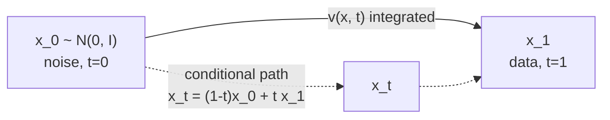

# A6 - Flow matching and rectified flow

This assignment builds conditional flow matching from scratch on a 2D toy where the velocity field and
the trajectories are fully visible: the linear probability path, the CFM training
objective, minibatch optimal-transport coupling, logit-normal timestep sampling, Euler ODE
sampling, a straightness metric, and the rectified-flow reflow procedure. The diffusion-flow
equivalence is made exact through the score-velocity relation. Everything runs on CPU in
seconds; an image-scale demo reuses A5's U-Net with the objective swapped to flow matching.

## Why flow matching

A continuous normalizing flow (CNF) defines a generative model through an ODE
$dx/dt = v_t(x;\theta)$ whose velocity field is a neural network: integrate from a simple
prior to the data distribution. Chen et al. (2018, "Neural Ordinary Differential
Equations", [arXiv:1806.07366](https://arxiv.org/abs/1806.07366)) trained CNFs by maximum
likelihood, but that needed simulating the ODE during training, which is expensive and
unstable at scale.

Flow matching (Lipman et al. 2022, "Flow Matching for Generative Modeling",
[arXiv:2210.02747](https://arxiv.org/abs/2210.02747)) removes the simulation. Instead of
maximizing likelihood through the ODE, it regresses the velocity field directly onto a
known target, with a plain mean-squared-error loss. The marginal velocity that generates a
given probability path is intractable, but its per-sample conditional version has a simple
closed form, and regressing on the conditional target has the same gradient as regressing
on the intractable marginal. Training becomes: sample a time, sample a data point, sample a
point on the path, and regress. No ODE simulation, no score function, no constraint on the
forward process. Flow matching with a linear path is the objective behind the production
text-to-image systems launched since mid-2024 (SD3, FLUX).

## The conditional flow matching objective

Convention used throughout: $t=0$ is noise, $t=1$ is data. The prior sample is
$x_0 \sim \mathcal{N}(0, I)$ and the data sample is $x_1$. A conditional probability path
$p_t(x \mid x_1)$ starts at the prior at $t=0$ and concentrates on $x_1$ at $t=1$, with a
conditional velocity $u_t(x \mid x_1)$ that transports along it. The CFM loss regresses the
network onto that conditional velocity:

$$\mathcal{L}_{\text{CFM}}(\theta) = \mathbb{E}_{t,\,x_1,\,x_t}\Big[\,\big\|v_\theta(x_t, t) - u_t(x_t \mid x_1)\big\|^2\,\Big].$$

Lipman et al. show $\nabla_\theta \mathcal{L}_{\text{CFM}} = \nabla_\theta \mathcal{L}_{\text{FM}}$:
the conditional objective has the same gradient as the intractable marginal one, so it is a
valid training signal. The minimizer is the marginal field
$v(x, t) = \mathbb{E}[\,u_t(x \mid x_1) \mid x_t = x\,]$, the conditional average of the
velocity over all data points whose path passes through $x$. Where paths from different
$x_1$ cross the same point, the regression target is the mean of the crossing velocities,
and that averaging curves the marginal field. Optimal-transport coupling, below,
reduces the crossing.

## The linear path

The rectified-flow choice (Liu et al. 2022, "Flow Straight and Fast",
[arXiv:2209.03003](https://arxiv.org/abs/2209.03003)) is the straight line between noise and
data:

$$x_t = (1-t)\,x_0 + t\,x_1, \qquad u_t = \frac{dx_t}{dt} = x_1 - x_0.$$

The conditional velocity is constant in $t$: a single direction $x_1 - x_0$. The CFM loss is
then a plain regression onto that displacement, `cfm_loss`. It is left unweighted; the
weighting across noise levels is supplied by the timestep distribution (below) rather than
by an explicit loss weight.

## Optimal-transport coupling

With independent coupling (a random $x_0$ paired with a random $x_1$), the straight
conditional lines from different data points cross, so the learned marginal field curves and
needs many integration steps. Minibatch optimal-transport coupling (Tong et al. 2023,
"Improving and Generalizing Flow-Based Generative Models with Minibatch Optimal Transport",
[arXiv:2302.00482](https://arxiv.org/abs/2302.00482)) pairs each $x_0$ with its optimal
$x_1$ inside the batch under the squared-distance cost
$C_{ij} = \lVert x_0^{(i)} - x_1^{(j)} \rVert^2$. For uniform marginals the optimal plan is a
permutation, solved exactly by the Hungarian algorithm (`scipy.optimize.linear_sum_assignment`).
Optimally paired lines cross far less, so the marginal field is straighter and fewer Euler
steps suffice, with no reflow. SD3 and FLUX use OT-style linear interpolation
rather than a diffusion noise schedule for this reason. `ot_coupling` builds the cost, solves the
assignment, and reorders $x_1$.

## The diffusion-flow equivalence

For Gaussian paths, diffusion (A5) and flow matching are the same framework with different
parameterizations. The bridge is the score-velocity relation. Under the linear path,
conditioning on $x_1$ leaves $x_0$ as the only randomness, so

$$x_t \mid x_1 \sim \mathcal{N}\big(t\,x_1,\ (1-t)^2 I\big), \qquad \nabla_{x_t}\log p_t(x_t \mid x_1) = -\frac{x_t - t\,x_1}{(1-t)^2}.$$

Substituting $u = (x_1 - x_t)/(1-t)$ (the velocity rewritten in terms of $x_t$) collapses
this to

$$\text{score}(x_t, t) = \frac{t\,v - x_t}{1-t}.$$

`score_from_velocity` returns exactly this. The score is singular at $t=1$, where the
conditional collapses to a point mass at $x_1$, so it is defined for $t<1$. The relation
makes the equivalence precise: A5's v-prediction under a variance-preserving cosine schedule
and flow matching's velocity under the linear schedule are reparameterizations of the same
object, their MSE losses differing only by a time-dependent weight. They genuinely differ in
three ways: the linear schedule is not variance-preserving, so the effective loss weighting
changes; OT coupling is a flow-matching-only idea (diffusion always uses independent Gaussian
noise); and the velocity parameterization gives exact log-likelihood through the continuous
change-of-variables formula.

## Logit-normal timestep sampling

Sampling $t$ uniformly spends capacity on the near-noise and near-data extremes, which carry
little perceptual information. SD3 (Esser et al. 2024, "Scaling Rectified Flow Transformers
for High-Resolution Image Synthesis", [arXiv:2403.03206](https://arxiv.org/abs/2403.03206))
biases the timestep toward the middle by sampling

$$t = \sigma(\mu + s\,z), \qquad z \sim \mathcal{N}(0, 1),$$

a logit-normal distribution ($\sigma$ is the sigmoid). With $\mu=0, s=1$ about 73% of the
mass lands in $[0.25, 0.75]$, against uniform's 50%, and the median is $\sigma(\mu)=0.5$.
Because the linear-path loss is unweighted, this timestep distribution is the weighting
mechanism. `sample_timesteps` implements both the uniform and logit-normal cases.

## Sampling, straightness, and reflow

Sampling integrates $dx/dt = v_\theta(x, t)$ forward from $t=0$ to $t=1$ with forward Euler
on a uniform grid, `euler_sample`:

$$x \leftarrow x + v_\theta(x, t)\,\Delta t, \qquad \Delta t = 1/N.$$

With a straight field, a handful of steps reaches quality that a diffusion sampler needs
hundreds of steps for. The straightness of a trajectory is measured by how far the
instantaneous velocity departs from the net displacement (the chord), averaged over the
trajectory (Liu et al. 2022):

$$S = \mathbb{E}_{t}\Big[\,\big\|(\hat x_1 - x_0) - v_\theta(x_t, t)\big\|^2\,\Big],$$

which is zero exactly when the velocity is constant along the path, a straight line at
constant speed. `straightness` computes it along the Euler trajectory.

Reflow (Liu et al. 2022) straightens an already-trained flow: integrate the learned ODE from
many $x_0 \sim \mathcal{N}(0,I)$ to their endpoints $\hat x_1$, then retrain the CFM objective
on the resulting $(x_0, \hat x_1)$ pairs. Because each $x_0$ is now coupled to the model's own
deterministic endpoint, the pairs no longer cross, and the 2-rectified flow is straighter by
construction. `reflow_pairs` (provided) generates the pairs. One reflow step is usually
enough (Lee, Lin & Fanti 2024, [arXiv:2405.20320](https://arxiv.org/abs/2405.20320)).

The 2025 frontier has moved past reflow for few-step generation: MeanFlow (Geng et al. 2025,
[arXiv:2505.13447](https://arxiv.org/abs/2505.13447)) models the time-averaged velocity and
reaches one-step generation from scratch without reflow; Rectified Diffusion (ICLR 2025)
argues the gain from reflow is the improved noise-data coupling, not straightness itself; and
consistency flow matching (Yang et al. 2024,
[arXiv:2407.02398](https://arxiv.org/abs/2407.02398)) adds a velocity self-consistency
constraint. Reflow is the canonical first method to understand, not the current state of the
art. The stochastic-interpolants framework (Albergo, Boffi & Vanden-Eijnden 2023,
[arXiv:2303.08797](https://arxiv.org/abs/2303.08797)) unifies diffusion and flow matching as
special cases.

## What to implement

The holes are the flow-matching mechanism, tested on a 2D velocity MLP (provided) where
everything is visible. See `ASSIGNMENT.md` for the per-function contract.

- `path.py`: `linear_path`, `linear_velocity`.
- `timesteps.py`: `sample_timesteps` (uniform and logit-normal).
- `flow.py`: `cfm_loss`, `score_from_velocity`.
- `coupling.py`: `ot_coupling` (minibatch OT via the Hungarian algorithm).
- `sampling.py`: `euler_sample`, `straightness`.

Verify with `make verify A=a06_0_flow_matching`; render the figures with
`make viz A=a06_0_flow_matching`.

## Where this goes next

- A7 (latent DiT) keeps this CFM objective and logit-normal timestep sampling and swaps the
  network for a transformer, which is the SD3/FLUX recipe (Peebles & Xie 2023,
  [arXiv:2212.09748](https://arxiv.org/abs/2212.09748)). The velocity-field objective is
  architecture-agnostic: the same loss trains a U-Net (A5/A6) or a DiT.
- A13 (VLA action head) uses a flow-matching action head: the robot action trajectory is the
  "data", a flow maps Gaussian noise to actions, and 10 Euler steps at inference give 50 Hz
  control (pi0, Physical Intelligence 2024). It is the same CFM objective and Euler sampler
  built here.

## References

- Lipman et al. 2022, Flow Matching, [arXiv:2210.02747](https://arxiv.org/abs/2210.02747).
- Liu, Gong & Liu 2022, Rectified Flow, [arXiv:2209.03003](https://arxiv.org/abs/2209.03003).
- Tong et al. 2023, OT-CFM, [arXiv:2302.00482](https://arxiv.org/abs/2302.00482).
- Esser et al. 2024, SD3 (logit-normal timesteps),
  [arXiv:2403.03206](https://arxiv.org/abs/2403.03206).
- Albergo, Boffi & Vanden-Eijnden 2023, Stochastic Interpolants,
  [arXiv:2303.08797](https://arxiv.org/abs/2303.08797).
- Geng et al. 2025, MeanFlow, [arXiv:2505.13447](https://arxiv.org/abs/2505.13447).
- Chen et al. 2018, Neural ODEs, [arXiv:1806.07366](https://arxiv.org/abs/1806.07366).
