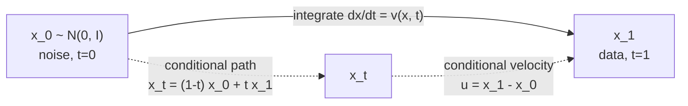

# A6 - Flow matching and rectified flow

Flow matching trains a generative model by regressing a velocity field that carries noise onto
data. Instead of learning to undo a noising process step by step, the network learns the
instantaneous direction of travel at every point and every time, and generation is an ODE solve.
The training loss is a plain mean-squared error against a target that has a closed form, with no
simulation of the ODE during training. With a straight-line path between noise and data, the
field is nearly constant along each trajectory, so a handful of Euler steps integrate it where a
diffusion sampler needs hundreds. This is the objective behind the production text-to-image
systems launched since mid-2024, Stable Diffusion 3 (SD3) and FLUX.

This assignment builds conditional flow matching from scratch on a 2D toy where the velocity
field and the trajectories are fully visible: the linear probability path, the conditional flow
matching loss, minibatch optimal-transport coupling, logit-normal timestep sampling, forward
Euler ODE sampling, a straightness metric, and the score-velocity relation that ties flow
matching back to diffusion. An image-scale demo reuses the diffusion U-Net with the objective
swapped to flow matching. Everything in the graded tests runs on CPU in seconds.

Required reading before starting:
- Lipman et al. 2022, "Flow Matching for Generative Modeling",
  [arXiv:2210.02747](https://arxiv.org/abs/2210.02747).
- Liu, Gong & Liu 2022, "Flow Straight and Fast: Learning to Generate and Transfer Data with
  Rectified Flow", [arXiv:2209.03003](https://arxiv.org/abs/2209.03003).
- Tong et al. 2023, "Improving and Generalizing Flow-Based Generative Models with Minibatch
  Optimal Transport", [arXiv:2302.00482](https://arxiv.org/abs/2302.00482).

## Lecture notes

### Generation as transport

A generative model turns a sample from something easy, a standard Gaussian, into a sample from
something hard, the data distribution. Flow matching does that by moving the sample
continuously, and the whole framework is built out of three objects that are worth naming before
anything else uses them.

The first is a time-dependent velocity field $v_t(x)$, a function that assigns a vector in
$\mathbb{R}^d$ to every point $x$ and every time $t$. A particle released at $x$ obeys the
ordinary differential equation $dx/dt = v_t(x)$, exactly the setup of any continuous-time
dynamical system. Its solution operator, which maps a starting point to where that point sits at
time $t$, is called the flow.

The second is what happens when a whole cloud of particles is released at once instead of one.
Draw the starting points from a density $p_0$ and let each follow the same field. At time $t$ the
cloud has some density $p_t$. The family $\{p_t\}_{t \in [0,1]}$ is a probability path: a curve
through the space of distributions, starting at $p_0$ and ending at $p_1$.

The third ties the two together. Particles are neither created nor destroyed as they move, so the
density and the field satisfy the continuity equation,

$$\frac{\partial p_t(x)}{\partial t} + \nabla \cdot \big(p_t(x)\,v_t(x)\big) = 0,$$

the same mass-conservation statement that appears in fluid dynamics: the density at a point falls
at exactly the rate at which the field carries mass out of a small volume around it. When a field
and a path satisfy this equation together, the field generates the path.

Generative modeling in this language is short. Set $p_0$ to a standard Gaussian and $p_1$ to the
data distribution, find a field that generates some path between them, and then sampling is
drawing $x_0 \sim \mathcal{N}(0, I)$ and integrating the ODE from $t=0$ to $t=1$. Many different
fields generate the same path, since adding any field $w$ with $\nabla \cdot (p_t w) = 0$ leaves
the continuity equation satisfied, so the task is to find a usable field, not the field.

### Why not train the flow by maximum likelihood

The natural way to fit a field is to maximize the likelihood the model assigns to the data, and
that is how continuous normalizing flows were originally trained. It fails for a specific reason
worth understanding, because the fix is the whole subject of this assignment.

A normalizing flow is a generative model built from an invertible map $f$ applied to a simple
base density. The change-of-variables formula from multivariable calculus gives its density
exactly: pushing $x$ through $f$ scales local volume by $|\det J_f(x)|$, where $J_f$ is the
Jacobian, so

$$\log p(f(x)) = \log p(x) - \log|\det J_f(x)|.$$

Because the map is invertible and the log-determinant is computable, the likelihood of a data
point is available in closed form, and the density is normalized without an intractable
partition function, which is the sense of "normalizing" here.

A continuous normalizing flow (CNF) replaces the discrete map with the ODE above, so the map is
the flow of $v_t$, invertible by running time backward. Chen et al. (2018, "Neural Ordinary
Differential Equations", [arXiv:1806.07366](https://arxiv.org/abs/1806.07366)) showed that the
log-determinant becomes an integral of the divergence along the trajectory,

$$\frac{d}{dt}\log p_t(x_t) = -\nabla \cdot v_t(x_t),$$

which is the continuity equation rewritten along a moving particle. The cost sits in that
formula: computing one log-likelihood means solving the ODE numerically while accumulating the
divergence along the way, and training means backpropagating gradients through that solve, once
per optimizer step.

Flow matching (Lipman et al. 2022) removes the simulation. Rather than maximize likelihood
through the ODE, it regresses the field directly onto a target velocity that can be written down
in closed form, with an ordinary mean-squared-error loss. One training step becomes: sample a
time, sample a data point, sample a point on the path, evaluate the network once, take the
gradient. No solver in the loop.

### Notation and the time convention

Throughout this assignment $t=0$ is noise and $t=1$ is data. The prior sample is
$x_0 \sim \mathcal{N}(0, I)$, the data sample is $x_1$, and $x_t$ is a point on the path between
them.

This is the opposite of the diffusion convention, where $x_0$ is the clean image and time runs
forward into noise. The clash is unavoidable, since both conventions are standard in their own
literature, and the direction flip matters when the two are compared in the score-velocity
section below. The code carries the flow-matching convention everywhere, including in
`score_from_velocity`.

Three velocity symbols appear. $u_t(x \mid x_1)$ is the conditional velocity, the target attached
to one particular data point. $u_t(x)$ is the marginal velocity, the field that actually
generates the path the model needs. $v_\theta(x, t)$ is the network.

### The conditional flow matching objective

What the model wants is the marginal field. Write the ideal loss,

$$\mathcal{L}_{\text{FM}}(\theta) = \mathbb{E}_{t,\,x_t}\Big[\,\big\|v_\theta(x_t, t) - u_t(x_t)\big\|^2\,\Big],$$

and the problem is immediate: there is no formula for $u_t$. It is the field that transports the
whole data distribution, and knowing it would already amount to having solved the generative
problem.

What is available is the per-data-point version. Pick a conditional probability path
$p_t(x \mid x_1)$ that starts at the prior at $t=0$ and concentrates on the single point $x_1$ at
$t=1$, together with a conditional velocity $u_t(x \mid x_1)$ that generates it. For the straight
line chosen in the next section, both are one line of algebra. The conditional flow matching
(CFM) loss regresses the network onto that:

$$\mathcal{L}_{\text{CFM}}(\theta) = \mathbb{E}_{t,\,x_1,\,x_t}\Big[\,\big\|v_\theta(x_t, t) - u_t(x_t \mid x_1)\big\|^2\,\Big].$$

Every quantity in it is samplable. The claim that makes flow matching work is that training on
this loss gives the same answer as training on the intractable one. Two facts establish it, and
both are short.

#### Least-squares regression returns the conditional mean

Take any pair of random variables, a target $y$ and an input $z$, and any predictor $f$. Add and
subtract the conditional mean $\mathbb{E}[y \mid z]$ inside the squared error and expand:

$$\mathbb{E}\big\|y - f(z)\big\|^2
= \mathbb{E}\big\|y - \mathbb{E}[y \mid z]\big\|^2 + \mathbb{E}\big\|\mathbb{E}[y \mid z] - f(z)\big\|^2.$$

The cross term is $2\,\mathbb{E}\big[(y - \mathbb{E}[y \mid z])^\top (\mathbb{E}[y \mid z] - f(z))\big]$,
and conditioning on $z$ first sends it to zero, because the second factor is fixed once $z$ is
known and the first has conditional mean zero. The first term on the right does not involve $f$
at all. So minimizing over $f$ minimizes only the second term, the minimizer is
$f(z) = \mathbb{E}[y \mid z]$, and any two losses of this form that share the same conditional
mean differ by a constant.

This is the same fact behind least-squares estimation in classical settings: fitting a noisy
measurement recovers the noise-free conditional mean, and the noise contributes an irreducible
floor that no estimator can remove.

Apply it with $z = (x_t, t)$ and $y = u_t(x_t \mid x_1)$. The target is random even after $x_t$
and $t$ are fixed, because many different $(x_0, x_1)$ pairs pass through the same $x_t$ at the
same time with different velocities. The minimizer is therefore

$$v_\theta(x, t) = \mathbb{E}\big[\,u_t(x_t \mid x_1) \;\big|\; x_t = x\,\big],$$

and $\mathcal{L}_{\text{CFM}}$ differs from $\mathcal{L}_{\text{FM}}$ by a constant in $\theta$,
so the two have identical gradients.

#### The conditional average generates the marginal path

The remaining step is that the conditional average above is the marginal field, not some other
field. Start from the marginal density as a mixture over data points,
$p_t(x) = \int p_t(x \mid x_1)\,p(x_1)\,dx_1$, differentiate in $t$ under the integral, and use
the continuity equation for each conditional pair:

$$\frac{\partial p_t(x)}{\partial t}
= -\int \nabla \cdot \big(p_t(x \mid x_1)\,u_t(x \mid x_1)\big)\,p(x_1)\,dx_1
= -\nabla \cdot \left( p_t(x) \int u_t(x \mid x_1)\,\frac{p_t(x \mid x_1)\,p(x_1)}{p_t(x)}\,dx_1 \right).$$

The divergence comes outside the integral because it acts on $x$ and the integration is over
$x_1$. What is left inside is a weighted average of the conditional velocities, and the weight
$p_t(x \mid x_1)p(x_1)/p_t(x)$ is exactly the posterior over $x_1$ given $x_t = x$. So the
marginal field is

$$u_t(x) = \mathbb{E}\big[\,u_t(x_t \mid x_1) \;\big|\; x_t = x\,\big],$$

the same object the regression converges to, and the line above shows it satisfies the continuity
equation for $p_t$. That is Theorem 1 of Lipman et al. (2022) in three lines.

The consequence to keep in mind for the rest of the notes: wherever conditional paths from
different data points cross the same point at the same time, the regression target there is the
average of the crossing velocities. Averaging distinct directions produces a field whose integral
curves bend, even though every conditional path was perfectly straight.

### The linear path

The rectified-flow choice (Liu et al. 2022) is the straight line between the noise sample and
the data sample:

$$x_t = (1-t)\,x_0 + t\,x_1, \qquad u_t(x_t \mid x_1) = \frac{dx_t}{dt} = x_1 - x_0.$$

The conditional velocity is constant in $t$: one direction, $x_1 - x_0$, held for the whole
trip. The CFM loss becomes a regression onto that displacement, which is `linear_velocity` in the
code, and `cfm_loss` is the mean squared error between the network output and it.

Two properties of this path are used later. Conditioning on $x_1$ leaves $x_0$ as the only
randomness, and $x_0$ is a standard Gaussian, so the conditional path is Gaussian at every time:

$$x_t \mid x_1 \sim \mathcal{N}\big(t\,x_1,\ (1-t)^2 I\big).$$

Its mean slides linearly from the origin to $x_1$ and its standard deviation shrinks linearly
from 1 to 0. And the loss carries no explicit weight over $t$. The relative attention paid to
different noise levels comes entirely from how $t$ is sampled, which is why the timestep
distribution gets a section of its own.



### Where the marginal field bends

The averaging result above has a concrete failure mode that a two-point example makes visible.

Work in one dimension with two noise samples $x_0 \in \{-1, +1\}$ and two data points
$x_1 \in \{-1, +1\}$, and pair them crosswise: $-1 \mapsto +1$ and $+1 \mapsto -1$. The two
conditional paths are $x_t = 2t - 1$ and $x_t = 1 - 2t$, with constant velocities $+2$ and $-2$.
They meet at the origin at $t = 0.5$. Only there do the two paths occupy the same point at the
same time, and the regression target there is the average of the two crossing velocities, which
is zero. So a trajectory of the marginal field leaves $x = -1$ at speed $+2$ and arrives at the
origin where the field is $0$: the velocity along a single trajectory is not constant, which is
exactly the quantity the straightness metric below measures. In this perfectly symmetric example
the field at the crossing is zero in both directions and the trajectory stalls there; with real
data the crossings are not symmetric and the trajectory bends instead of stopping, but either
way the integration needs small steps near the crossing.

Pair the same four points the other way, $-1 \mapsto -1$ and $+1 \mapsto +1$, and nothing crosses,
both velocities are zero, and the marginal field is exactly the two conditional fields with no
averaging anywhere. The squared distances traveled also differ: $4 + 4 = 8$ for the crossed
pairing against $0$ for the uncrossed one. The pairing that minimizes total squared distance is
the pairing that avoids the crossing, and that is not a coincidence. `test_swap_case` in
`tests/test_ot_coupling.py` is this configuration in 2D.

Independent coupling, meaning a random $x_0$ drawn independently of the $x_1$ it is paired with,
produces crossings constantly. The next two sections are about choosing the pairing instead.

### The optimal transport problem

Optimal transport asks how to move one distribution onto another at least cost. Given a source
distribution, a target distribution, and a cost $c(x, y)$ of moving one unit of mass from $x$ to
$y$, find the joint distribution over $(x, y)$ pairs, called a coupling or a transport plan, whose
marginals are the source and the target and whose expected cost is smallest. The squared distance
$c(x, y) = \lVert x - y \rVert^2$ is the standard choice and the one used here.

For two finite sets of $B$ points each, with uniform weight $1/B$ on every point, the plan is a
$B \times B$ matrix $P$ with $P_{ij} \ge 0$ giving the mass sent from source point $i$ to target
point $j$. The marginal constraints say every row sums to $1/B$ and every column sums to $1/B$, so
$BP$ is doubly stochastic: non-negative with all row and column sums equal to 1. The problem is
then

$$\min_P \ \sum_{i,j} P_{ij}\,C_{ij}, \qquad C_{ij} = \lVert x_0^{(i)} - x_1^{(j)} \rVert^2,$$

a linear objective over a convex polytope, which is a linear program.

Two standard facts collapse this to something simple. A linear function on a bounded convex
polytope attains its minimum at a vertex, and the Birkhoff-von Neumann theorem identifies the
vertices of the set of doubly stochastic matrices as exactly the permutation matrices. So an
optimal plan can always be taken to be a permutation: each source point sends all of its mass to
one target point, and no mass is split. Under uniform marginals the transport problem is a
matching problem.

Finding the best permutation by enumeration is $B!$ work, but the matching problem, known as the
assignment problem, has exact polynomial-time solvers. The Hungarian algorithm (Kuhn 1955, Naval
Research Logistics Quarterly) solves it in cubic time by repeatedly adjusting a set of row and
column offsets until enough zero-cost entries exist to cover a full assignment, and it returns
the exact minimizer, not an approximation. `ot_coupling` calls
`scipy.optimize.linear_sum_assignment`, which solves the same problem exactly and returns the row
and column indices of the chosen pairs; since the rows come back in sorted order, the column
indices are the permutation to apply to $x_1$.

### Minibatch optimal-transport coupling

Solving the transport problem between the full noise distribution and the full data distribution
is not possible, but solving it inside each training batch is cheap. OT-CFM does exactly that
(Tong et al. 2023). Draw a batch of $B$ noise samples and $B$ data samples independently, build
the $B \times B$ squared-distance cost matrix, solve the assignment, and train on the reordered
pairs. The path, the target, and the loss are unchanged; only which $x_0$ goes with which $x_1$
changes.

Optimally paired lines cross far less, by the two-point argument above, so the marginal field the
network learns is straighter and fewer Euler steps integrate it accurately. The straightening
happens during the first training run, with no second training stage of the kind the reflow
section describes.

Two caveats. The batch-level plan is not the plan between the full distributions, and the
mismatch does not vanish as training proceeds; Tong et al. analyze this bias, and it shrinks as
the batch grows. And the cost matrix and the assignment are both $O(B^2)$ to build and $O(B^3)$
to solve, which is negligible at $B = 256$ in two dimensions and is a real cost at image scale.

A naming collision is worth clearing up here, because both things are called optimal transport in
the flow-matching literature. Lipman et al. call the straight-line conditional path itself the
"optimal transport" path, because for one fixed $x_1$ the straight interpolation is the optimal
transport map between the two endpoint conditional distributions. That is a statement about a
single conditional path and it holds regardless of how pairs are formed. Minibatch OT coupling,
this section's subject, is a statement about which $x_0$ is paired with which $x_1$ across the
batch. A model can use the linear path with independent coupling, which is the common case.

SD3 and FLUX use the linear path with independent coupling, not minibatch OT: what they take from
this line of work is the straight interpolant in place of a diffusion noise schedule (Esser et al.
2024 for SD3).

### Logit-normal timestep sampling

The linear-path loss carries no explicit weight over $t$, so the distribution $t$ is drawn from
decides how much training effort each noise level receives. Uniform sampling spreads the effort
evenly. SD3 concentrates it in the middle instead.

There is a reason the middle deserves more. Consider the marginal field at the two endpoints,
under independent coupling and zero-mean data. At $t=0$ the path point is $x_t = x_0$ exactly, and
since $x_1$ was drawn independently, the target is
$\mathbb{E}[x_1 - x_0 \mid x_0] = \mathbb{E}[x_1] - x_0 = -x_0$. At $t=1$ the path point is
$x_t = x_1$, and the target is $\mathbb{E}[x_1 - x_0 \mid x_1] = x_1$. Both endpoint fields are
exactly linear in $x_t$, so a network of any size fits them almost immediately. All the structure
of the data, everything that decides which mode a given noise sample ends up in, lives at
intermediate times. (Under OT coupling the endpoint fields are no longer linear, since $x_1$ is
then a function of $x_0$, but the middle is still where the field does the interesting work.)

The logit-normal distribution puts mass there. Recall that the logit is the inverse of the
sigmoid, $\text{logit}(t) = \log\frac{t}{1-t}$, mapping $(0,1)$ onto the whole real line. Draw a
normal variable and squash it back:

$$t = \sigma(\mu + s\,z), \qquad z \sim \mathcal{N}(0, 1),$$

so $\text{logit}(t) \sim \mathcal{N}(\mu, s^2)$, hence the name. Because
$\sigma$ is strictly increasing, it maps quantiles to quantiles, and every statement about the
distribution of $t$ can be read off the normal. The median is $\sigma(\mu)$, which is $0.5$ at
$\mu = 0$. For the mass in the middle half, note that $\text{logit}(0.75) = \log 3 \approx 1.0986$
and $\text{logit}(0.25) = -\log 3$, so with $\mu = 0$ and $s = 1$,

$$\Pr\big[0.25 < t < 0.75\big] = \Pr\big[|z| < 1.0986\big] = 2\Phi(1.0986) - 1 \approx 0.73,$$

against uniform's exact $0.50$. `sample_timesteps` implements both, and `test_timesteps.py`
checks the median and this $0.73$ figure on 40000 draws.

SD3 (Esser et al. 2024, "Scaling Rectified Flow Transformers for High-Resolution Image Synthesis",
[arXiv:2403.03206](https://arxiv.org/abs/2403.03206)) compared several timestep distributions at
scale and found this one best among the variants tried.

### Sampling with forward Euler

Sampling integrates $dx/dt = v_\theta(x, t)$ from $t=0$ to $t=1$. The simplest integrator is
forward Euler on a uniform grid of $N$ steps: read the velocity at the current point and time,
then move in a straight line along it for one step of duration $\Delta t$.

$$x \leftarrow x + v_\theta(x, t)\,\Delta t, \qquad \Delta t = 1/N, \qquad t = k\,\Delta t.$$

Euler's error per step comes from the velocity changing over the step. Expand the true trajectory
in a Taylor series about the current time and the leading term Euler drops is
$\tfrac12 \ddot{x}\,\Delta t^2$, set by the acceleration along the trajectory. If the velocity
along a trajectory is constant, the acceleration is zero, every dropped term is zero, and Euler
lands on the exact endpoint at any number of steps, including one. This is not an asymptotic
statement; it holds exactly. `test_euler_oracle.py` checks it directly with a field
that returns the constant $x_1 - x_0$: the integration lands on $x_1$ to within $10^{-6}$ at 1, 4,
and 50 steps alike.

So the cost of sampling is set by how far the learned field departs from constant along its own
trajectories. A field whose trajectories are straight lines traversed at constant speed can be
integrated in a couple of steps. A field whose trajectories bend needs enough steps to resolve the
bending. Straightening the field, which is what the crossing analysis and OT coupling are for,
directly buys step count: quality that costs a diffusion sampler hundreds of network evaluations
can cost a well-straightened flow a handful.

### Measuring straightness

Straightness is measurable, not just visible in a plot. Liu et al. (2022) define it as the average
squared gap between the instantaneous velocity along a trajectory and the net displacement from
start to finish, the chord. Writing $\hat{x}_1$ for the endpoint the sampler actually reaches from
$x_0$,

$$S = \mathbb{E}_{t}\Big[\,\big\|(\hat{x}_1 - x_0) - v_\theta(x_t, t)\big\|^2\,\Big].$$

The `straightness` function computes this along the Euler trajectory: run `euler_sample` with
`return_traj=True`, take the chord from the first and last points, and average the squared
difference over the $N$ grid points, summing over coordinates and averaging over the batch.

The discrete version has an identity worth checking, because it explains what the number means.
Euler with $\Delta t = 1/N$ gives
$\hat{x}_1 - x_0 = \Delta t \sum_{k=0}^{N-1} v_k = \frac{1}{N}\sum_k v_k = \bar{v}$, the chord is
the mean of the velocities visited. So

$$S = \frac{1}{N}\sum_{k=0}^{N-1} \big\|\bar{v} - v_k\big\|^2,$$

the variance of the velocity along the trajectory. It is zero exactly when every $v_k$ is the
same, that is, when the trajectory is a straight line traversed at constant speed, and it grows
with any variation in either direction or speed. `test_straightness.py` checks both ends: a
constant field gives below $10^{-10}$, and a rotation field, whose velocity is perpendicular to
the position so trajectories curl, gives above $0.1$.

### Reflow

Reflow (Liu et al. 2022) straightens a flow that has already been trained. Integrate the learned
ODE from many $x_0 \sim \mathcal{N}(0, I)$ to their endpoints $\hat{x}_1$, then retrain the CFM
objective from scratch on the resulting $(x_0, \hat{x}_1)$ pairs instead of on independently drawn
pairs. The result is called the 2-rectified flow; applying the procedure again gives the
3-rectified flow, and so on. `reflow.py` generates the pairs and is provided.

It works for the same reason OT coupling works: the pairing gets better. The ODE is
deterministic, so each $x_0$ has exactly one endpoint, and the new coupling is the one the model's
own dynamics produced rather than an independent draw. Liu et al. prove that this coupling has no
higher transport cost than the coupling it came from, simultaneously for every convex cost, so the
straight lines between the new pairs cross less and the averaging that curved the field has less
to average. No new data is needed, since the endpoints are the model's own samples. The price is
that the second model is trained to match the first model's output distribution, so whatever the
first model got wrong is inherited. One reflow step is usually enough (Lee, Lin &
Fanti 2024, [arXiv:2405.20320](https://arxiv.org/abs/2405.20320)).

The 2025 frontier has moved past reflow for few-step generation. MeanFlow (Geng et al. 2025,
[arXiv:2505.13447](https://arxiv.org/abs/2505.13447)) trains a network to predict the average
velocity over a time interval rather than the instantaneous velocity, so a single evaluation
covers the whole interval and one-step generation comes out of a single training run with no
reflow stage. Rectified Diffusion (ICLR 2025) argues that the gain from reflow comes from the
improved noise-data coupling rather than from straightness as such. Consistency flow matching
(Yang et al. 2024, [arXiv:2407.02398](https://arxiv.org/abs/2407.02398)) adds a constraint forcing
the velocity predictions at different times along one trajectory to agree. Reflow is the canonical
first method to understand here, not the current state of the art.

### The score-velocity relation

Flow matching and diffusion look like different frameworks, and for Gaussian paths they are the
same one under different parameterizations. The bridge is a relation between the velocity and the
score, and this section derives it, since `score_from_velocity` implements it.

The score of a density is the gradient of its log, $\nabla_x \log p_t(x)$: the direction in which
the density rises fastest at $x$, and the object a diffusion model learns, whether it is
parameterized as noise prediction or otherwise. It is a vector field like the velocity, defined at
every point and time, so asking how the two relate is a fair question.

Start with the conditional case, where everything is Gaussian. From the linear-path section,
$x_t \mid x_1 \sim \mathcal{N}(t x_1, (1-t)^2 I)$. The log-density of a Gaussian is
$-\lVert x - \mu \rVert^2 / (2\sigma^2)$ plus a constant, so its gradient is
$-(x - \mu)/\sigma^2$:

$$\nabla_{x_t}\log p_t(x_t \mid x_1) = -\frac{x_t - t\,x_1}{(1-t)^2}.$$

Now eliminate $x_1$ in favor of the velocity. The conditional velocity is $u = x_1 - x_0$, and
substituting $x_0 = (x_t - t x_1)/(1-t)$ from the path definition gives
$u = (x_1 - x_t)/(1-t)$, so $x_1 = x_t + (1-t)u$. Put that into the numerator:

$$x_t - t\,x_1 = x_t - t\,x_t - t(1-t)\,u = (1-t)\big(x_t - t\,u\big),$$

and one factor of $(1-t)$ cancels:

$$\nabla_{x_t}\log p_t(x_t \mid x_1) = \frac{t\,u - x_t}{1-t}.$$

The relation carries over from the conditional to the marginal unchanged, and the reason is the
conditional-average argument from the CFM section. Differentiating
$p_t(x) = \int p_t(x \mid x_1) p(x_1)\,dx_1$ in $x$ and dividing by $p_t(x)$ gives

$$\nabla_x \log p_t(x) = \int \big[\nabla_x \log p_t(x \mid x_1)\big]\,\frac{p_t(x \mid x_1)p(x_1)}{p_t(x)}\,dx_1
= \mathbb{E}\big[\nabla_x \log p_t(x_t \mid x_1) \mid x_t = x\big],$$

the same posterior weighting that produced the marginal velocity. Both the marginal score and the
marginal velocity are conditional expectations under the same weights, and the map
$u \mapsto (tu - x_t)/(1-t)$ is affine in $u$ with $x_t$ and $t$ held fixed, so it commutes with
the expectation. The relation therefore holds verbatim with the network's velocity in place of the
conditional one:

$$\text{score}(x_t, t) = \frac{t\,v - x_t}{1-t}.$$

The $(1-t)$ in the denominator is singular at $t=1$, where the conditional path has collapsed to a
point mass at $x_1$ and no density gradient exists, so the relation is defined for $t < 1$. The
test samples $t$ in $[0.05, 0.90]$ for this reason.

### What flow matching and diffusion do and do not share

With the score in hand, the comparison can be made concretely.

Both frameworks build a Gaussian path from data to noise, of the form
$x_t = a_t\,x_{\text{data}} + b_t\,x_{\text{noise}}$ with scalar schedules $a_t, b_t$. Diffusion
under the standard variance-preserving schedule uses $a^2 + b^2 = 1$, which keeps the marginal
variance constant at 1 for unit-variance data, hence the name: the noising process preserves the
variance it started with, so the network sees inputs of the same scale at every noise level. The
cosine schedule is one such choice of $a_t, b_t$. The linear path uses $a_t = t$ and $b_t = 1-t$,
and $t^2 + (1-t)^2$ is not 1; it dips to $0.5$ at $t = 0.5$ for unit-variance data. The linear
path is not variance-preserving.

That difference is a rescaling and nothing more. Any point on the linear path divided by
$\sqrt{t^2 + (1-t)^2}$ lands on a variance-preserving path, and the two paths visit the same
signal-to-noise ratios $a^2/b^2$ at different times. Matching them by signal-to-noise ratio makes
the two paths the same family of distributions up to a per-time scalar. The prediction targets
then match too: diffusion's $v$-prediction target is $a\,\varepsilon - b\,x_{\text{data}}$
(Salimans & Ho 2022, [arXiv:2202.00512](https://arxiv.org/abs/2202.00512)), a fixed linear
combination of the clean sample and the noise, and flow matching's velocity $x_1 - x_0$ is a
different fixed linear combination of the same two. Each is an invertible linear
reparameterization of the other, so the two mean-squared-error losses differ by a scalar that
depends on time and nothing else. Two objectives that differ by a time-dependent weight are the
same objective trained with a different emphasis across noise levels, which is exactly what the
timestep distribution controls.

Three things genuinely differ.

The effective weighting across noise levels is not the same, precisely because of the time-dependent
factor just described, so flow matching with logit-normal timesteps and diffusion with a cosine
schedule are not the same run even though they optimize the same family of objectives.

OT coupling has no diffusion counterpart. Diffusion's forward process adds independent Gaussian
noise to each data point by construction, so the pairing between noise and data is independent by
definition and there is nothing to reorder.

Flow matching does not need the two endpoint distributions to be noise and data. Any two
distributions that can be sampled work, since the path is built by interpolating a pair of samples
rather than by running a noising process. That lets rectified flow do direct
distribution-to-distribution transfer, the source of the "and Transfer Data" in the paper title,
and a setting a noising process cannot express at all. The stochastic-interpolants
framework (Albergo, Boffi & Vanden-Eijnden 2023,
[arXiv:2303.08797](https://arxiv.org/abs/2303.08797)) develops this general view and recovers both
diffusion and flow matching as special cases.

## The assignment

Fill these holes, in order. Each is one `NotImplementedError` with a matching test; the docstring in each file gives the signature, shapes, and constraints.

1. [`linear_path()`](path.py) in `path.py`
2. [`linear_velocity()`](path.py) in `path.py`
3. [`sample_timesteps()`](timesteps.py) in `timesteps.py`
4. [`cfm_loss()`](flow.py) in `flow.py`
5. [`score_from_velocity()`](flow.py) in `flow.py`
6. [`ot_coupling()`](coupling.py) in `coupling.py`
7. [`euler_sample()`](sampling.py) in `sampling.py`
8. [`straightness()`](sampling.py) in `sampling.py`

### Running and validating

Activate the environment (`conda activate nanovision`), then:

```
make test     A=a06_0_flow_matching   # run the tests against the top-level files (the ones with holes)
make verify   A=a06_0_flow_matching   # run the same tests against the reference solution/
make viz      A=a06_0_flow_matching   # render the figures from the reference solution
make viz-mine A=a06_0_flow_matching   # render the figures from your own code (once the holes are filled)
```

`make test` is the command to run while working on the assignment. It runs the test suite in
`assignments/a06_0_flow_matching/tests/` against the top-level files (the ones with the holes),
and goes from red (the holes raise `NotImplementedError`) to green as the holes are filled in.
`make verify` runs the identical suite against the reference answer key in `solution/`: it sets
`NANOVISION_IMPL=solution`, which makes the tests import the reference implementation instead
of the top-level files. `make verify` is green from the start, so it shows the target and
confirms the tests and the environment work before anything changes. The goal is to bring
`make test` to the same green as `make verify`.

The suite checks the path endpoints and velocity, the timestep statistics (uniform mean and
logit-normal median plus the 73% mass in $[0.25, 0.75]$), a constant-velocity oracle that
integrates $x_0 \to x_1$ exactly at 1, 4, and 50 Euler steps with no training, the
score-velocity relation against the conditional score, the OT swap case and the OT-cost bound,
the straightness metric on a constant and a curved field, a float64 gradient check
(`torch.autograd.gradcheck`, which compares the analytic backward pass against finite differences
of the forward pass and needs double precision for the comparison to mean anything) of the
differentiable pieces, a short overfit of the CFM loss on a fixed batch, and that no prebuilt
flow-matching library is imported.

`make viz` renders from the reference solution, so it works on a fresh checkout before any
holes are filled and shows the target figures. `make viz-mine` runs the same script against the
top-level code, the way to eyeball whether a finished implementation behaves. Both write PNG
figures to `out/` rather than opening a window: the plots use matplotlib's headless Agg
backend, so the commands behave the same over SSH, in WSL, and in CI with no display attached,
and the figures are reproducible artifacts to open directly or view inline in VSCode. Add
`SHOW=1` (for example `make viz-mine A=a06_0_flow_matching SHOW=1`) to also open the figures in
interactive windows when a display is available. The figures are `trajectories.png` (the
learned trajectories under independent vs OT coupling vs 2-rectified reflow), `straightness.png`
(the straightness metric for the three), `few_step.png` (Euler samples at 1, 2, 4, 10, 100
steps), `timesteps.png` (the uniform vs logit-normal histograms), and `image_cfm.png` (the
image-scale demo that reuses the diffusion U-Net with the CFM objective).

What you should see when you run this. The overfit test drives the CFM loss down roughly three
orders of magnitude from its untrained start (about 900x, from 17.2 to 0.019 in the provided run
on CPU), flooring where distinct pairs land at nearly the same $(x_t, t)$ with different velocity
targets and finite MLP capacity cannot satisfy both, so the test asserts a relative drop plus a
comfortable absolute bound rather than a tight number. The constant-velocity oracle reconstructs
$x_1$ to within $10^{-6}$ with even a single Euler step, since Euler is exact for a constant
field. In the figures, OT coupling and one reflow step give visibly straighter trajectories
than independent coupling and a lower straightness number, and the OT model produces
recognizable few-step samples with as few as 2-4 Euler steps. These are 2D toy artifacts; they
confirm the mechanism runs end to end and say nothing about sample quality at image scale, where
the velocity field is a large network and the measure is Frechet inception distance (FID), the
distance between generated and real images compared as Gaussians in a pretrained feature space.

## Where this goes next

- Latent diffusion with a transformer keeps this CFM objective and logit-normal timestep
  sampling and swaps the velocity MLP for a diffusion transformer (DiT), which is the SD3/FLUX
  recipe (Peebles & Xie 2023, [arXiv:2212.09748](https://arxiv.org/abs/2212.09748)). The
  velocity-field objective does not care about the architecture: the same loss trains a U-Net or
  a DiT.
- The vision-language-action (VLA) model later in the course uses a flow-matching action head.
  The robot's action trajectory takes the role of the data, a flow maps Gaussian noise to
  actions, and about 10 Euler steps at inference give 50 Hz control (pi0, Physical Intelligence
  2024). It is the same CFM objective and Euler sampler built here.

## References

- Lipman et al. 2022, Flow Matching, [arXiv:2210.02747](https://arxiv.org/abs/2210.02747).
- Liu, Gong & Liu 2022, Rectified Flow, [arXiv:2209.03003](https://arxiv.org/abs/2209.03003).
- Tong et al. 2023, OT-CFM, [arXiv:2302.00482](https://arxiv.org/abs/2302.00482).
- Esser et al. 2024, SD3 (logit-normal timesteps),
  [arXiv:2403.03206](https://arxiv.org/abs/2403.03206).
- Lee, Lin & Fanti 2024, one reflow step,
  [arXiv:2405.20320](https://arxiv.org/abs/2405.20320).
- Albergo, Boffi & Vanden-Eijnden 2023, Stochastic Interpolants,
  [arXiv:2303.08797](https://arxiv.org/abs/2303.08797).
- Geng et al. 2025, MeanFlow, [arXiv:2505.13447](https://arxiv.org/abs/2505.13447).
- Yang et al. 2024, Consistency Flow Matching,
  [arXiv:2407.02398](https://arxiv.org/abs/2407.02398).
- Chen et al. 2018, Neural ODEs, [arXiv:1806.07366](https://arxiv.org/abs/1806.07366).
- Salimans & Ho 2022, Progressive Distillation ($v$-prediction),
  [arXiv:2202.00512](https://arxiv.org/abs/2202.00512).
- Peebles & Xie 2023, DiT, [arXiv:2212.09748](https://arxiv.org/abs/2212.09748).
- Kuhn 1955, "The Hungarian method for the assignment problem", Naval Research Logistics
  Quarterly.
