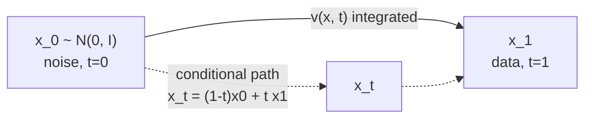

# A6 - Flow matching and rectified flow

Flow matching trains a generative model by regressing a velocity field that transports noise
to data along a probability path. There is no noising SDE and no score function; the loss is a
plain mean-squared error against a known target velocity. With a straight-line path between
noise and data, the field is nearly constant along each trajectory, so a handful of Euler
steps integrate it where a diffusion sampler needs hundreds. This is the objective behind the
production text-to-image systems launched since mid-2024 (SD3, FLUX).

Build conditional flow matching from scratch on a 2D toy where the velocity field and the
trajectories are fully visible. Implement the linear probability path, the conditional flow
matching loss, minibatch optimal-transport coupling, logit-normal timestep sampling, forward
Euler ODE sampling, a straightness metric, and the score-velocity relation that ties flow
matching back to diffusion. An image-scale demo reuses the diffusion U-Net with the objective
swapped to flow matching. Everything in the graded tests runs on CPU in seconds.

Required reading before starting:
- Lipman et al. 2022, "Flow Matching for Generative Modeling",
  [arXiv:2210.02747](https://arxiv.org/abs/2210.02747).
- Liu, Gong & Liu 2022, "Flow Straight and Fast: Learning to Generate and Transfer Data with
  Rectified Flow", [arXiv:2209.03003](https://arxiv.org/abs/2209.03003).
- Tong et al. 2023, "Improving and Generalizing Flow-Based Generative Models with Minibatch
  Optimal Transport", [arXiv:2302.00482](https://arxiv.org/abs/2302.00482).

## Lecture notes

### Why flow matching

A continuous normalizing flow (CNF) defines a generative model through an ODE
$dx/dt = v_t(x;\theta)$ whose velocity field is a neural network: integrate from a simple
prior to the data distribution. Chen et al. (2018, "Neural Ordinary Differential Equations",
[arXiv:1806.07366](https://arxiv.org/abs/1806.07366)) trained CNFs by maximum likelihood, but
that needed simulating the ODE during training, which is expensive and unstable at scale.

Flow matching (Lipman et al. 2022) removes the simulation. Instead of maximizing likelihood
through the ODE, it regresses the velocity field directly onto a known target, with a plain
mean-squared-error loss. The marginal velocity that generates a given probability path is
intractable, but its per-sample conditional version has a simple closed form, and regressing
on the conditional target has the same gradient as regressing on the intractable marginal.
Training becomes: sample a time, sample a data point, sample a point on the path, and regress.
No ODE simulation, no score function, no constraint on the forward process.

### The conditional flow matching objective

Convention used throughout: $t=0$ is noise, $t=1$ is data. The prior sample is
$x_0 \sim \mathcal{N}(0, I)$ and the data sample is $x_1$. A conditional probability path
$p_t(x \mid x_1)$ starts at the prior at $t=0$ and concentrates on $x_1$ at $t=1$, with a
conditional velocity $u_t(x \mid x_1)$ that transports along it. The conditional flow matching
(CFM) loss regresses the network onto that conditional velocity:

$$\mathcal{L}_{\text{CFM}}(\theta) = \mathbb{E}_{t,\,x_1,\,x_t}\Big[\,\big\|v_\theta(x_t, t) - u_t(x_t \mid x_1)\big\|^2\,\Big].$$

Lipman et al. show $\nabla_\theta \mathcal{L}_{\text{CFM}} = \nabla_\theta \mathcal{L}_{\text{FM}}$:
the conditional objective has the same gradient as the intractable marginal one, so it is a
valid training signal. The minimizer is the marginal field
$v(x, t) = \mathbb{E}[\,u_t(x \mid x_1) \mid x_t = x\,]$, the conditional average of the
velocity over all data points whose path passes through $x$. Where paths from different $x_1$
cross the same point, the regression target is the mean of the crossing velocities, and that
averaging curves the marginal field. Optimal-transport coupling, below, reduces the crossing.

### The linear path

The rectified-flow choice (Liu et al. 2022) is the straight line between noise and data:

$$x_t = (1-t)\,x_0 + t\,x_1, \qquad u_t = \frac{dx_t}{dt} = x_1 - x_0.$$

The conditional velocity is constant in $t$: a single direction $x_1 - x_0$. The CFM loss is
then a plain regression onto that displacement. It is left unweighted; the weighting across
noise levels comes from the timestep distribution (below) rather than from an explicit loss
weight.



### Optimal-transport coupling

With independent coupling (a random $x_0$ paired with a random $x_1$), the straight
conditional lines from different data points cross, so the learned marginal field curves and
needs many integration steps. Minibatch optimal-transport coupling (Tong et al. 2023) pairs
each $x_0$ with its optimal $x_1$ inside the batch under the squared-distance cost
$C_{ij} = \lVert x_0^{(i)} - x_1^{(j)} \rVert^2$. For uniform marginals the optimal transport
plan is a permutation, solved exactly by the Hungarian algorithm. Optimally paired lines cross
far less, so the marginal field is straighter and fewer Euler steps suffice, with no reflow.
SD3 and FLUX use OT-style linear interpolation rather than a diffusion noise schedule for this
reason.

### The diffusion-flow equivalence

For Gaussian paths, diffusion and flow matching are the same framework with different
parameterizations. The bridge is the score-velocity relation. A score is the gradient of the
log-density, $\nabla_x \log p_t(x)$. Under the linear path, conditioning on $x_1$ leaves $x_0$
as the only randomness, so

$$x_t \mid x_1 \sim \mathcal{N}\big(t\,x_1,\ (1-t)^2 I\big), \qquad \nabla_{x_t}\log p_t(x_t \mid x_1) = -\frac{x_t - t\,x_1}{(1-t)^2}.$$

Substituting $u = (x_1 - x_t)/(1-t)$ (the velocity rewritten in terms of $x_t$) collapses this
to

$$\text{score}(x_t, t) = \frac{t\,v - x_t}{1-t}.$$

The score is singular at $t=1$, where the conditional collapses to a point mass at $x_1$, so
it is defined for $t<1$. The relation makes the equivalence precise: the $v$-prediction target
of diffusion under a variance-preserving cosine schedule and flow matching's velocity under
the linear schedule are reparameterizations of the same object, their MSE losses differing
only by a time-dependent weight. They genuinely differ in three ways. The linear schedule is
not variance-preserving, so the effective loss weighting changes; OT coupling is a
flow-matching-only idea (diffusion always uses independent Gaussian noise); and the velocity
parameterization gives exact log-likelihood through the continuous change-of-variables
formula.

### Logit-normal timestep sampling

Sampling $t$ uniformly spends capacity on the near-noise and near-data extremes, which carry
little perceptual information. SD3 (Esser et al. 2024, "Scaling Rectified Flow Transformers for
High-Resolution Image Synthesis", [arXiv:2403.03206](https://arxiv.org/abs/2403.03206)) biases
the timestep toward the middle by sampling

$$t = \sigma(\mu + s\,z), \qquad z \sim \mathcal{N}(0, 1),$$

a logit-normal distribution ($\sigma$ is the sigmoid). With $\mu=0, s=1$ about 73% of the mass
lands in $[0.25, 0.75]$, against uniform's 50%, and the median is $\sigma(\mu)=0.5$. Because
the linear-path loss is unweighted, this timestep distribution is the weighting mechanism.

### Sampling and straightness

Sampling integrates $dx/dt = v_\theta(x, t)$ forward from $t=0$ to $t=1$ with forward Euler on
a uniform grid:

$$x \leftarrow x + v_\theta(x, t)\,\Delta t, \qquad \Delta t = 1/N.$$

With a straight field, a handful of steps reaches quality that a diffusion sampler needs
hundreds of steps for. The straightness of a trajectory is measured by how far the
instantaneous velocity departs from the net displacement (the chord), averaged over the
trajectory (Liu et al. 2022):

$$S = \mathbb{E}_{t}\Big[\,\big\|(\hat x_1 - x_0) - v_\theta(x_t, t)\big\|^2\,\Big],$$

which is zero exactly when the velocity is constant along the path, a straight line at constant
speed.

### Reflow

Reflow (Liu et al. 2022) straightens an already-trained flow. Integrate the learned ODE from
many $x_0 \sim \mathcal{N}(0,I)$ to their endpoints $\hat x_1$, then retrain the CFM objective
on the resulting $(x_0, \hat x_1)$ pairs. Because each $x_0$ is now coupled to the model's own
deterministic endpoint, the pairs no longer cross, and the 2-rectified flow is straighter by
construction. One reflow step is usually enough (Lee, Lin & Fanti 2024,
[arXiv:2405.20320](https://arxiv.org/abs/2405.20320)).

The 2025 frontier has moved past reflow for few-step generation. MeanFlow (Geng et al. 2025,
[arXiv:2505.13447](https://arxiv.org/abs/2505.13447)) models the time-averaged velocity and
reaches one-step generation from scratch without reflow; Rectified Diffusion (ICLR 2025) argues
the gain from reflow is the improved noise-data coupling, not straightness itself; and
consistency flow matching (Yang et al. 2024,
[arXiv:2407.02398](https://arxiv.org/abs/2407.02398)) adds a velocity self-consistency
constraint. Reflow is the canonical first method to understand, not the current state of the
art. The stochastic-interpolants framework (Albergo, Boffi & Vanden-Eijnden 2023,
[arXiv:2303.08797](https://arxiv.org/abs/2303.08797)) unifies diffusion and flow matching as
special cases.

## The assignment

Fill these holes, in order. Each is one `NotImplementedError` with a matching test; the docstring in each file gives the signature, shapes, and constraints.

1. [`linear_path()`](path.py) in `path.py`
2. [`linear_velocity()`](path.py) in `path.py`
3. [`sample_timesteps()`](timesteps.py) in `timesteps.py`
4. [`cfm_loss()`](flow.py) in `flow.py`
5. [`score_from_velocity()`](flow.py) in `flow.py`
6. [`ot_coupling()`](coupling.py) in `coupling.py`
7. [`euler_sample()`](sampling.py) in `sampling.py`
8. [`straightness()`](sampling.py) in `sampling.py`

### Running and validating

Activate the environment (`conda activate nanovision`), then:

```
make test     A=a06_0_flow_matching   # run the tests against the top-level files (the ones with holes)
make verify   A=a06_0_flow_matching   # run the same tests against the reference solution/
make viz      A=a06_0_flow_matching   # render the figures from the reference solution
make viz-mine A=a06_0_flow_matching   # render the figures from your own code (once the holes are filled)
```

`make test` is the command to run while working on the assignment. It runs the test suite in
`assignments/a06_0_flow_matching/tests/` against the top-level files (the ones with the holes),
and goes from red (the holes raise `NotImplementedError`) to green as the holes are filled in.
`make verify` runs the identical suite against the reference answer key in `solution/`: it sets
`NANOVISION_IMPL=solution`, which makes the tests import the reference implementation instead
of the top-level files. `make verify` is green from the start, so it shows the target and
confirms the tests and the environment work before anything changes. The goal is to bring
`make test` to the same green as `make verify`.

The suite checks the path endpoints and velocity, the timestep statistics (uniform mean and
logit-normal median plus the 73% mass in $[0.25, 0.75]$), a constant-velocity oracle that
integrates $x_0 \to x_1$ exactly at 1, 4, and 50 Euler steps with no training, the
score-velocity relation against the conditional score, the OT swap case and the OT-cost bound,
the straightness metric on a constant and a curved field, a float64 `gradcheck` of the
differentiable pieces, a short overfit of the CFM loss on a fixed batch, and that no prebuilt
flow-matching library is imported.

`make viz` renders from the reference solution, so it works on a fresh checkout before any
holes are filled and shows the target figures. `make viz-mine` runs the same script against the
top-level code, the way to eyeball whether a finished implementation behaves. Both write PNG
figures to `out/` rather than opening a window: the plots use matplotlib's headless Agg
backend, so the commands behave the same over SSH, in WSL, and in CI with no display attached,
and the figures are reproducible artifacts to open directly or view inline in VSCode. Add
`SHOW=1` (for example `make viz-mine A=a06_0_flow_matching SHOW=1`) to also open the figures in
interactive windows when a display is available. The figures are `trajectories.png` (the
learned trajectories under independent vs OT coupling vs 2-rectified reflow), `straightness.png`
(the straightness metric for the three), `few_step.png` (Euler samples at 1, 2, 4, 10, 100
steps), `timesteps.png` (the uniform vs logit-normal histograms), and `image_cfm.png` (the
image-scale demo that reuses the diffusion U-Net with the CFM objective).

What you should see when you run this. The overfit test drives the CFM loss down about 1000x
from its untrained start, flooring near 0.015 where distinct pairs land at nearly the same
$(x_t, t)$ with different velocity targets (finite MLP capacity), so the test asserts a
relative drop plus a comfortable absolute bound. The constant-velocity oracle reconstructs
$x_1$ to within $10^{-6}$ with even a single Euler step, since Euler is exact for a constant
field. In the figures, OT coupling and one reflow step give visibly straighter trajectories
than independent coupling and a lower straightness number, and the OT model produces
recognizable few-step samples with as few as 2-4 Euler steps. These are 2D toy artifacts; they
confirm the mechanism runs end to end and say nothing about sample quality at image scale,
where the velocity field is a large network and FID is the measure.

## Where this goes next

- Latent diffusion with a transformer (A7) keeps this CFM objective and logit-normal timestep
  sampling and swaps the velocity MLP for a diffusion transformer (DiT), which is the SD3/FLUX
  recipe (Peebles & Xie 2023, [arXiv:2212.09748](https://arxiv.org/abs/2212.09748)). The
  velocity-field objective is architecture-agnostic: the same loss trains a U-Net or a DiT.
- The VLA action head (A13) uses a flow-matching action head: the robot action trajectory is
  the data, a flow maps Gaussian noise to actions, and about 10 Euler steps at inference give
  50 Hz control (pi0, Physical Intelligence 2024). It is the same CFM objective and Euler
  sampler built here.

## References

- Lipman et al. 2022, Flow Matching, [arXiv:2210.02747](https://arxiv.org/abs/2210.02747).
- Liu, Gong & Liu 2022, Rectified Flow, [arXiv:2209.03003](https://arxiv.org/abs/2209.03003).
- Tong et al. 2023, OT-CFM, [arXiv:2302.00482](https://arxiv.org/abs/2302.00482).
- Esser et al. 2024, SD3 (logit-normal timesteps),
  [arXiv:2403.03206](https://arxiv.org/abs/2403.03206).
- Lee, Lin & Fanti 2024, one reflow step,
  [arXiv:2405.20320](https://arxiv.org/abs/2405.20320).
- Albergo, Boffi & Vanden-Eijnden 2023, Stochastic Interpolants,
  [arXiv:2303.08797](https://arxiv.org/abs/2303.08797).
- Geng et al. 2025, MeanFlow, [arXiv:2505.13447](https://arxiv.org/abs/2505.13447).
- Yang et al. 2024, Consistency Flow Matching,
  [arXiv:2407.02398](https://arxiv.org/abs/2407.02398).
- Chen et al. 2018, Neural ODEs, [arXiv:1806.07366](https://arxiv.org/abs/1806.07366).
- Peebles & Xie 2023, DiT, [arXiv:2212.09748](https://arxiv.org/abs/2212.09748).
