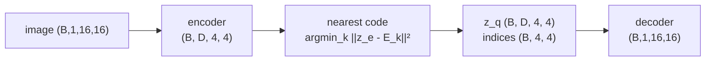
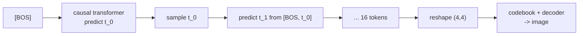

# A6.5 - VQ tokenizer

A VQ-VAE turns an image into a short grid of discrete tokens from a fixed vocabulary, so an
autoregressive transformer can generate images the same way it generates text. A convolutional
encoder maps an image to a grid of continuous vectors, a learned codebook snaps each vector to
its nearest discrete code, and a decoder reconstructs the image. The nearest-neighbor lookup is
non-differentiable, so training passes the gradient around it with the straight-through
estimator. Once images are token grids, a small causal transformer models the grid as a prior,
and sampling from it decodes to new images. This is the discrete-token route to image
generation, the contrast to the continuous KL-VAE used with latent diffusion.

Build a VQ-VAE on 16x16 shape images: a 4x4 latent grid, a 32-entry codebook, and an
autoregressive prior over the 16 flattened tokens. Implement the vector quantizer (the
nearest-code lookup, the straight-through estimator, and the codebook and commitment losses),
the total VQ-VAE loss, and autoregressive sampling from the prior. The encoder, decoder, the
transformer prior with its teacher-forced loss, and the toy data are provided. Everything runs
on CPU in seconds to under a minute.

Required reading before starting:
- van den Oord, Vinyals, Kavukcuoglu 2017, "Neural Discrete Representation Learning",
  [arXiv:1711.00937](https://arxiv.org/abs/1711.00937).
- Esser, Rombach, Ommer 2021, "Taming Transformers for High-Resolution Image Synthesis"
  (VQ-GAN), [arXiv:2012.09841](https://arxiv.org/abs/2012.09841).

## Lecture notes

### Why discrete tokens

A transformer language model works on a finite vocabulary: each position is one of a fixed set
of tokens, and the model puts a categorical distribution over the next one. To generate images
the same way, an image first has to become a short sequence of discrete tokens from a fixed
vocabulary. A VQ-VAE (van den Oord et al. 2017) learns an encoder, a codebook of $K$ vectors,
and a decoder, so any image becomes a grid of code indices in $\{0, \dots, K-1\}$ that a
decoder can turn back into pixels. Once images are token grids, an autoregressive transformer
models them exactly like text. The unified multimodal models (Chameleon, Janus, LlamaGen)
tokenize images into discrete codes and model interleaved text and image tokens with a single
transformer.

### The VQ-VAE

The encoder produces a continuous grid $z_e \in \mathbb{R}^{B\times D\times H'\times W'}$ (here
$4\times 4$ vectors of dimension $D$). The codebook is an embedding table
$E \in \mathbb{R}^{K\times D}$. Quantization replaces each encoder vector by its nearest code:

$$k^\star(z) = \arg\min_k \lVert z - E_k \rVert^2 = \arg\min_k \big(\lVert z\rVert^2 - 2\,z\cdot E_k + \lVert E_k\rVert^2\big),$$

and $z_q = E_{k^\star}$. The decoder reconstructs the image from the quantized grid $z_q$. The
$\lVert z\rVert^2$ term is constant across codes, so it does not affect the argmin; keeping it
gives the true non-negative distance.



### The straight-through estimator

The argmin has zero gradient almost everywhere, so backpropagating through it would stop the
gradient before it reaches the encoder. The straight-through estimator (STE) routes the
gradient around the argmin by defining

$$z_q^{\text{ste}} = z_e + \operatorname{sg}\!\big(z_q - z_e\big),$$

where $\operatorname{sg}$ is the stop-gradient (`.detach()`). The forward value is
$z_e + (z_q - z_e) = z_q$, the hard quantized vector the decoder sees. The backward gradient is

$$\frac{\partial z_q^{\text{ste}}}{\partial z_e} = I + 0 = I,$$

because the stop-gradient term contributes zero, so the decoder's gradient is copied straight to
the encoder as if quantization were the identity. The estimator deliberately defines a gradient
that finite differences would disagree with.

### The losses

The reconstruction loss trains the encoder and decoder through the STE. The codebook itself
gets no gradient through the STE (the stop-gradient detaches the code in the forward-to-decoder
path), so two extra terms train it and commit the encoder to it:

$$\mathcal{L} = \underbrace{\lVert x - \hat x\rVert^2}_{\text{reconstruction}} + \underbrace{\lVert \operatorname{sg}[z_e] - z_q\rVert^2}_{\text{codebook}} + \beta\underbrace{\lVert z_e - \operatorname{sg}[z_q]\rVert^2}_{\text{commitment}}.$$

The codebook term moves each code toward the encoder vectors assigned to it (the stop-gradient
on $z_e$ sends the gradient only into the code). The commitment term, weighted by $\beta = 0.25$
(van den Oord et al.), pulls the encoder output toward the code it picked so the encoder cannot
grow its outputs without bound. The encoder receives gradient from two sources, the
reconstruction (via the STE) and the commitment term; the codebook receives gradient only from
the codebook term.

### Codebook collapse

The common VQ failure is collapse: a few codes capture everything and the rest go dead,
shrinking the effective vocabulary. The diagnostic is the perplexity of the code-usage
distribution,

$$\text{perplexity} = \exp\!\Big(-\sum_k p_k \log p_k\Big), \qquad p_k = \frac{\#\{\text{vectors assigned to code } k\}}{\#\text{vectors}},$$

which is 1 under total collapse and $K$ under uniform usage. Production tokenizers keep codes
alive with an exponential-moving-average codebook update (a running mean of assigned encoder
vectors, replacing the codebook loss), dead-code reinitialization (re-seeding an unused code to
a random encoder vector), and L2-normalized cosine-distance codes (LlamaGen, ViT-VQGAN). VQ-GAN
(Esser et al. 2021) adds a perceptual loss and a patch discriminator for sharp reconstructions
on natural images. A toy on near-binary shapes is fine with plain pixel MSE.

### The autoregressive prior

After the tokenizer is trained, each image is a $4\times 4$ grid of code indices. Flattened
row-major, that is a length-16 sequence over a $K$-code vocabulary, which a causal transformer
models by predicting each token from the ones before it. A learned beginning-of-sequence token
(the BOS, an extra index $K$, so the vocabulary is $K+1$) provides the input for position 0,
which otherwise has no predecessor. Training is teacher-forced next-token cross-entropy: input
$[\text{BOS}, t_0, \dots, t_{14}]$, targets $[t_0, \dots, t_{15}]$, the same next-token loss as
a character-level language model. Sampling starts from $[\text{BOS}]$ and draws each token from
the predicted categorical distribution in turn, then reshapes to the grid and decodes through
the codebook and decoder to a new image.



## The assignment

Fill these holes, in order. Each is one `NotImplementedError` with a matching test; the docstring in each file gives the signature, shapes, and constraints.

1. [`VectorQuantizer.forward()`](quantize.py) in `quantize.py`
2. [`vq_vae_loss()`](vqvae.py) in `vqvae.py`
3. [`ar_sample()`](prior.py) in `prior.py`

### Running and validating

Activate the environment (`conda activate nanovision`), then:

```
make test     A=a06_5_vq_tokenizer   # run the tests against the top-level files (the ones with holes)
make verify   A=a06_5_vq_tokenizer   # run the same tests against the reference solution/
make viz      A=a06_5_vq_tokenizer   # render the figures from the reference solution
make viz-mine A=a06_5_vq_tokenizer   # render the figures from your own code (once the holes are filled)
```

`make test` is the command to run while working on the assignment. It runs the test suite in
`assignments/a06_5_vq_tokenizer/tests/` against the top-level files (the ones with the holes),
and goes from red (the holes raise `NotImplementedError`) to green as the holes are filled in.
`make verify` runs the identical suite against the reference answer key in `solution/`: it sets
`NANOVISION_IMPL=solution`, which makes the tests import the reference implementation instead of
the top-level files. `make verify` is green from the start, so it shows the target and confirms
the tests and the environment work before anything changes. The goal is to bring `make test` to
the same green as `make verify`.

The suite checks the quantizer indices against a brute-force nearest neighbor, that the
straight-through value equals the hard codebook lookup, and that the vq loss equals the codebook
plus $0.25\times$ commitment reference. A dedicated test asserts the straight-through gradient
directly: $z_e.\text{grad}$ is all ones after backprop through $z_q^{\text{ste}}$, the identity
gradient the STE defines. There is no `gradcheck` test here, because the STE makes the autograd
gradient differ from finite differences on purpose, so a finite-difference check would (by
design) disagree. The remaining tests overfit the VQ-VAE on one batch (reconstruction MSE and a
perplexity floor that rules out collapse), overfit the prior, check the sample shapes and
determinism, and confirm no prebuilt VQ library is imported.

`make viz` renders from the reference solution, so it works on a fresh checkout before any holes
are filled and shows the target figures. `make viz-mine` runs the same script against the
top-level code, the way to eyeball whether a finished implementation behaves. Both write PNG
figures to `out/` rather than opening a window: the plots use matplotlib's headless Agg backend,
so the commands behave the same over SSH, in WSL, and in CI with no display attached, and the
figures are reproducible artifacts to open directly or view inline in VSCode. Add `SHOW=1` (for
example `make viz-mine A=a06_5_vq_tokenizer SHOW=1`) to also open the figures in interactive
windows when a display is available. The figures are `recon.png` (originals next to their
VQ-VAE reconstructions), `codebook.png` (the code-usage histogram and the perplexity), and
`samples.png` (images decoded from token grids sampled by the prior).

What you should see when you run this. The VQ-VAE overfit drives the reconstruction MSE below
0.05 on the 8-image batch and keeps perplexity above 3, so the codebook does not collapse to a
handful of codes (it lands near 4 of the 32). The prior overfit drives the next-token
cross-entropy down from its untrained $\ln K \approx 3.47$ toward a floor near $\ln(B)/L \approx
0.13$: position 0 sees the identical $[\text{BOS}]$ context for every grid in the batch, so its
cross-entropy cannot beat the entropy of the $B$ distinct first tokens. The decoded prior
samples are recognizable shapes. These are toy artifacts on 16x16 images that confirm the
mechanism runs end to end; they say nothing about tokenizer quality at scale, where a perceptual
loss and a discriminator (VQ-GAN), a much larger codebook, and EMA codebook updates are standard.

## Where this goes next

- The unified discrete multimodal models tokenize images this way and model text and image
  tokens with one autoregressive transformer: Chameleon (Chameleon Team 2024,
  [arXiv:2405.09818](https://arxiv.org/abs/2405.09818)) and LlamaGen (Sun et al. 2024,
  [arXiv:2406.06525](https://arxiv.org/abs/2406.06525)) are the reference points.
- Latent diffusion with a transformer (A7) takes the other route: a continuous KL-VAE instead
  of a discrete codebook, with flow-matching diffusion in the latent space rather than an
  autoregressive prior. That is the discrete-versus-continuous and
  autoregressive-versus-diffusion split.

## References

- van den Oord, Vinyals, Kavukcuoglu 2017, VQ-VAE,
  [arXiv:1711.00937](https://arxiv.org/abs/1711.00937).
- Esser, Rombach, Ommer 2021, VQ-GAN, [arXiv:2012.09841](https://arxiv.org/abs/2012.09841).
- Chameleon Team 2024, Chameleon, [arXiv:2405.09818](https://arxiv.org/abs/2405.09818).
- Sun et al. 2024, LlamaGen, [arXiv:2406.06525](https://arxiv.org/abs/2406.06525).
