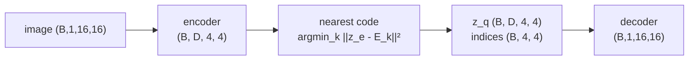
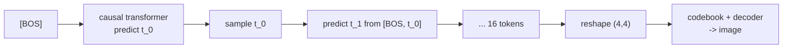

# A6.5 - VQ tokenizer

This assignment builds a VQ-VAE: a convolutional encoder maps a 16x16 image to a 4x4 grid of continuous
vectors, a learned codebook snaps each to its nearest discrete code, and a decoder
reconstructs the image. The non-differentiable nearest-neighbor lookup is trained through
with the straight-through estimator. Then a small autoregressive transformer (the one built
in A1) models the discrete token grid as a prior, and sampling from it decodes to new images.
This is the discrete-token route to image generation, the contrast to A7's continuous
KL-VAE.

## Why discrete tokens

A transformer language model works on a finite vocabulary: each position is one of a fixed
set of tokens, and the model puts a categorical distribution over the next one. To generate
images the same way, you first need to turn an image into a short sequence of discrete tokens
from a fixed vocabulary. A VQ-VAE (van den Oord et al. 2017, "Neural Discrete Representation
Learning", [arXiv:1711.00937](https://arxiv.org/abs/1711.00937)) does exactly that: it learns
an encoder, a codebook of $K$ vectors, and a decoder, so any image becomes a grid of code
indices in $\{0, \dots, K-1\}$ that a decoder can turn back into pixels. Once images are token
grids, an autoregressive transformer models them exactly like text. The unified multimodal
models (Chameleon, Janus, LlamaGen) tokenize images into discrete codes and model interleaved
text and image tokens with a single transformer.

## The VQ-VAE

The encoder produces a continuous grid $z_e \in \mathbb{R}^{B\times D\times H'\times W'}$ (here
$4\times 4$ vectors of dimension $D$). The codebook is an embedding table
$E \in \mathbb{R}^{K\times D}$. Quantization replaces each encoder vector by its nearest code:

$$k^\star(z) = \arg\min_k \lVert z - E_k \rVert^2 = \arg\min_k \big(\lVert z\rVert^2 - 2\,z\cdot E_k + \lVert E_k\rVert^2\big),$$

and $z_q = E_{k^\star}$. The decoder reconstructs the image from the quantized grid $z_q$. The
$\lVert z\rVert^2$ term is constant across codes, so it does not affect the argmin; keeping it
gives the true non-negative distance.

## The straight-through estimator

The argmin has zero gradient almost everywhere, so backpropagating through it would stop the
gradient before it reaches the encoder. The straight-through estimator (STE) routes the
gradient around the argmin by defining

$$z_q^{\text{ste}} = z_e + \operatorname{sg}\!\big(z_q - z_e\big),$$

where $\operatorname{sg}$ is the stop-gradient (`.detach()`). The forward value is
$z_e + (z_q - z_e) = z_q$, the hard quantized vector the decoder sees. The backward gradient
is

$$\frac{\partial z_q^{\text{ste}}}{\partial z_e} = I + 0 = I,$$

because the stop-gradient term contributes zero, so the decoder's gradient is copied straight
to the encoder as if quantization were the identity. The estimator deliberately defines a
gradient that finite differences would disagree with, so `test_straight_through` checks the
autograd gradient directly rather than with a gradcheck.

## The losses

The reconstruction loss trains the encoder and decoder through the STE. The codebook itself
gets no gradient through the STE (the stop-gradient detaches the code in the
forward-to-decoder path), so two extra terms train it and commit the encoder to it:

$$\mathcal{L} = \underbrace{\lVert x - \hat x\rVert^2}_{\text{reconstruction}} + \underbrace{\lVert \operatorname{sg}[z_e] - z_q\rVert^2}_{\text{codebook}} + \beta\underbrace{\lVert z_e - \operatorname{sg}[z_q]\rVert^2}_{\text{commitment}}.$$

The codebook term moves each code toward the encoder vectors assigned to it (the
stop-gradient on $z_e$ sends the gradient only into the code). The commitment term, weighted
by $\beta = 0.25$ (van den Oord et al.), pulls the encoder output toward the code it picked so
the encoder cannot grow its outputs without bound. The encoder receives gradient from two
sources, the reconstruction (via the STE) and the commitment term; the codebook receives
gradient only from the codebook term.

## Codebook collapse

The common VQ failure is collapse: a few codes capture everything and the rest go dead,
shrinking the effective vocabulary. The diagnostic is the perplexity of the code-usage
distribution,

$$\text{perplexity} = \exp\!\Big(-\sum_k p_k \log p_k\Big), \qquad p_k = \frac{\#\{\text{vectors assigned to code } k\}}{\#\text{vectors}},$$

which is 1 under total collapse and $K$ under uniform usage. `codebook_perplexity` computes
it, and `test_recon_overfit` requires it stay above a floor. Production tokenizers keep codes
alive with an exponential-moving-average codebook update (a running mean of assigned encoder
vectors, replacing the codebook loss), dead-code reinitialization (re-seeding an unused code
to a random encoder vector), and L2-normalized cosine-distance codes (LlamaGen, ViT-VQGAN).
VQ-GAN (Esser et al. 2021, "Taming Transformers for High-Resolution Image Synthesis",
[arXiv:2012.09841](https://arxiv.org/abs/2012.09841)) adds a perceptual loss and a patch
discriminator for sharp reconstructions on natural images. The toy here uses plain pixel MSE,
which is enough for near-binary shapes.

## The autoregressive prior

After the tokenizer is trained, each image is a $4\times 4$ grid of code indices. Flattened
row-major, that is a length-16 sequence over a $K$-code vocabulary, which a causal transformer
models by predicting each token from the ones before it. A learned beginning-of-sequence
token (the BOS, an extra index $K$) provides the input for position 0, which otherwise has no
predecessor. Training is teacher-forced next-token cross-entropy: input
$[\text{BOS}, t_0, \dots, t_{14}]$, targets $[t_0, \dots, t_{15}]$, the same loss built in
A1's char-LM (`ar_nll`, provided). Sampling (`ar_sample`) starts from $[\text{BOS}]$ and draws
each token from the predicted categorical distribution in turn, then reshapes to the grid and
decodes through the codebook and decoder to a new image.

## What to implement

- `quantize.py`: `VectorQuantizer.forward` (nearest-code lookup, the straight-through
  estimator, the codebook and commitment losses). This is the shared
  `nanovision.quantize.VectorQuantizer`.
- `vqvae.py`: `vq_vae_loss` (reconstruction MSE plus the vq loss).
- `prior.py`: `ar_sample` (autoregressive token sampling).

The encoder/decoder, the VQVAE wiring, the `TokenPrior` and its `ar_nll` loss, the codebook
perplexity helper, and the toy data are provided.

Verify with `make verify A=a06_5_vq_tokenizer`; render the figures with
`make viz A=a06_5_vq_tokenizer`.

## Where this goes next

- The unified discrete multimodal models tokenize images this way and model text + image
  tokens with one autoregressive transformer: Chameleon (Chameleon Team 2024,
  [arXiv:2405.09818](https://arxiv.org/abs/2405.09818)) and LlamaGen (Sun et al. 2024,
  [arXiv:2406.06525](https://arxiv.org/abs/2406.06525)) are the reference points.
- A7 (latent DiT) takes the other route: a continuous KL-VAE instead of a discrete codebook,
  with flow-matching diffusion in the latent space rather than an autoregressive prior. That
  is the discrete-vs-continuous and autoregressive-vs-diffusion split.

## References

- van den Oord, Vinyals, Kavukcuoglu 2017, VQ-VAE,
  [arXiv:1711.00937](https://arxiv.org/abs/1711.00937).
- Esser, Rombach, Ommer 2021, VQ-GAN, [arXiv:2012.09841](https://arxiv.org/abs/2012.09841).
- Chameleon Team 2024, [arXiv:2405.09818](https://arxiv.org/abs/2405.09818).
- Sun et al. 2024, LlamaGen, [arXiv:2406.06525](https://arxiv.org/abs/2406.06525).
