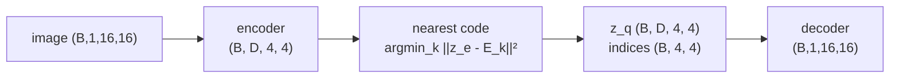
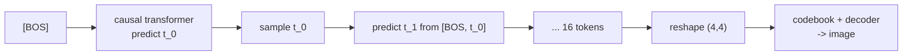

# A6.5 - VQ tokenizer

A VQ-VAE turns an image into a short grid of discrete tokens from a fixed vocabulary, so an
autoregressive transformer can generate images the same way it generates text. A convolutional
encoder maps an image to a grid of continuous vectors, a learned codebook snaps each vector to
its nearest discrete code, and a decoder reconstructs the image. The nearest-neighbor lookup is
non-differentiable, so training passes the gradient around it with the straight-through
estimator. Once images are token grids, a small causal transformer models the distribution over
those grids, and sampling from it decodes to new images. This is the discrete-token route to
image generation, the contrast to the continuous latent that latent diffusion uses.

Build a VQ-VAE on 16x16 shape images: a 4x4 latent grid, a 32-entry codebook, and an
autoregressive prior over the 16 flattened tokens. Implement the vector quantizer (the
nearest-code lookup, the straight-through estimator, and the codebook and commitment losses),
the total VQ-VAE loss, and autoregressive sampling from the prior. The encoder, decoder, the
transformer prior with its teacher-forced loss, and the toy data are provided. Everything runs
on CPU in seconds to under a minute.

Required reading before starting:
- van den Oord, Vinyals, Kavukcuoglu 2017, "Neural Discrete Representation Learning",
  [arXiv:1711.00937](https://arxiv.org/abs/1711.00937).
- Esser, Rombach, Ommer 2021, "Taming Transformers for High-Resolution Image Synthesis"
  (VQ-GAN), [arXiv:2012.09841](https://arxiv.org/abs/2012.09841).

## Lecture notes

### Why discrete tokens

A transformer language model works over a finite vocabulary of $V$ symbols. Every position in
the sequence holds exactly one symbol, and the model's output at a position is a categorical
distribution over the vocabulary: $V$ non-negative numbers summing to one, giving the
probability that the next symbol is each of the $V$ possibilities. Generation is a loop of
drawing one symbol from that distribution and feeding it back in. Two properties of a finite
vocabulary make the loop work. A distribution over it is a fixed-length vector the network can
emit directly, and training is then ordinary classification, where the target is a known index
rather than a real-valued vector.

An image has neither property as it comes. A 16x16 grayscale image is 256 real numbers drawn
from a continuous space, so there is no index to predict and no finite list to put a
distribution over. Quantizing each pixel on its own does produce a finite vocabulary (256 gray
levels is already a vocabulary), but the sequence is then as long as the image is large - 256
positions here, and over 780,000 for a 512x512 RGB image - and each symbol carries one pixel's
worth of meaning, so the transformer spends its capacity on texture. The useful object is a
short sequence over a small vocabulary in which one symbol stands for a patch of image content.

A tokenizer is the map that produces it. A VQ-VAE (van den Oord et al. 2017) learns an encoder,
a codebook of $K$ vectors, and a decoder together, so any image becomes a grid of code indices
in $\{0, \dots, K-1\}$ and the decoder turns that grid back into pixels. Once images are token
grids, an autoregressive transformer models them exactly like text. The unified multimodal
models take this literally: Chameleon, Janus, and LlamaGen tokenize images into discrete codes,
put text tokens and image tokens in one sequence, and train a single transformer over the
mixture, so the model reads and writes both modalities with one next-token objective.

### Vector quantization

Quantization is the analog-to-digital step. Replace a real value by the nearest entry of a
finite set, then store which entry it was, and a continuous quantity fits into a fixed number of
bits. Rounding a voltage to one of 256 levels is scalar quantization, which treats each number
in isolation.

Vector quantization does the same to a whole vector at once. Fix $K$ reference vectors
$E_0, \dots, E_{K-1}$ in $\mathbb{R}^D$ and call the collection a codebook. To quantize a vector
$z$, find the index of the nearest reference vector and keep the index alone:

$$k^\star(z) = \arg\min_k \lVert z - E_k \rVert^2, \qquad z \mapsto E_{k^\star(z)}.$$

The index costs $\log_2 K$ bits no matter how large $D$ is, which is where the compression comes
from. Handling the $D$ components jointly also lets the codebook exploit the fact that real data
occupies a small part of $\mathbb{R}^D$; scalar quantization of each component separately cannot
see those correlations.

The nearest-neighbor rule partitions $\mathbb{R}^D$ into $K$ regions, each the set of points
closer to one code than to any other. Those are Voronoi cells, the same construction used for
proximity queries and roadmap planning, with the codes as the sites. The quantizer is constant
on the interior of a cell and jumps across the boundaries, which leaves it with no usable
derivative for training.

Choosing a codebook to minimize the expected squared error
$\mathbb{E}\lVert z - E_{k^\star(z)}\rVert^2$ over some data is the k-means problem, and the
classical answer alternates two steps: assign every training vector to its nearest code, then
move each code to the mean of the vectors assigned to it. That is Lloyd's algorithm, applied to
codebook design for speech coding by Linde, Buzo, and Gray (1980). One property of it matters
for everything below: a code that nothing is assigned to has no vectors to average, so it never
moves, and if it starts somewhere the data never visits it stays there forever.

The VQ-VAE changes one thing. The vectors being quantized are not raw data but the output of an
encoder trained jointly with the codebook. The quantizer no longer has to cover the awkward
geometry of natural images, because the encoder can move its outputs to wherever the codes are,
and the commitment loss below asks it to.

### Autoencoders and the quantization bottleneck

An autoencoder is a pair of networks trained to make their composition the identity. An encoder
$f$ maps an image to some smaller representation, a decoder $g$ maps that back to an image, and
the objective is the reconstruction error $\lVert x - g(f(x))\rVert^2$ averaged over a dataset.
By itself that objective is trivial. If the representation is big enough to hold the input, the
pair can just copy. Everything interesting is in the constraint imposed on the middle, the
bottleneck. Two such constraints are in use for generative models.

The variational autoencoder (Kingma and Welling 2013) uses a probabilistic bottleneck. Its
encoder emits the mean and variance of a Gaussian instead of a single point, the latent is a
sample from that Gaussian, and a Kullback-Leibler divergence term penalizes how far that
Gaussian sits from a standard normal. The KL divergence
$\mathrm{KL}(q \,\Vert\, p) = \mathbb{E}_q[\log q - \log p]$ is the extra description length paid
for coding samples from $q$ with a code built for $p$, measured in nats, the unit of information
that comes from using $\ln$ in place of $\log_2$ (one nat is $1/\ln 2 \approx 1.44$ bits); it is
zero only when $q = p$. Adding noise and pulling toward a fixed prior keeps the latent space
continuous and roughly standardized, so nearby latents decode to similar images. That is the
KL-VAE that latent diffusion runs its denoiser inside.

The VQ-VAE uses quantization as the bottleneck instead. The latent is forced onto one of $K$
points, so each latent position carries at most $\log_2 K$ bits whatever the encoder does. Here
$K = 32$ and the grid is $4\times4$, so a whole image is 16 tokens of 5 bits each, 80 bits in
total, standing in for 256 real-valued pixels. The "variational" in the name is close to vestigial in the
implementation: the posterior is taken to be deterministic (all probability on the nearest code)
and the prior over codes uniform while the tokenizer trains, which makes the KL term a constant
$\log K$ with zero gradient. van den Oord et al. make exactly that argument, and it is why the
loss below has no KL term in it.

Both bottlenecks hand a compressed latent to a second-stage generative model, and the choice of
bottleneck decides what that second stage can be. A discrete grid suits an autoregressive
transformer emitting a categorical distribution over codes. A continuous latent suits diffusion
or flow matching, which need to add and remove Gaussian noise in a space where that operation
means something. Latent diffusion (Rombach et al. 2021) reports autoencoders of both kinds, one
KL-regularized and one VQ-regularized; this assignment builds the discrete one and the
autoregressive second stage that goes with it.

### The VQ-VAE

The encoder produces a continuous grid $z_e \in \mathbb{R}^{B\times D\times H'\times W'}$ (here
$4\times 4$ vectors of dimension $D = 16$, from two stride-2 convolutions taking $16 \to 8 \to 4$
spatially, a residual ConvNeXt-style convolution block, and a $1\times1$ convolution to $D$
channels). The codebook is an
embedding table $E \in \mathbb{R}^{K\times D}$, meaning a matrix of $K$ learnable rows that is
read by row index. Quantization replaces each of the $B \cdot H' \cdot W'$ encoder vectors by its
nearest code:

$$k^\star(z) = \arg\min_k \lVert z - E_k \rVert^2 = \arg\min_k \big(\lVert z\rVert^2 - 2\,z\cdot E_k + \lVert E_k \rVert^2\big),$$

and $z_q = E_{k^\star}$. The expanded form is how the code computes it. The cross term is one
matrix product between all the encoder vectors and all the codes, so the whole grid is quantized
in a couple of matrix operations rather than a Python loop. The $\lVert z\rVert^2$ term is constant
across codes, so it does not affect the argmin; keeping it makes the returned value a true
non-negative distance. The decoder mirrors the encoder with transposed convolutions back to
16x16 and a final $\tanh$, because the toy images live in $[-1, 1]$.



### The straight-through estimator

Training runs on reverse-mode automatic differentiation: every operation in the forward pass
records a local derivative, and the backward pass multiplies those derivatives together from the
loss back to the parameters. An operation whose derivative is zero therefore erases everything
upstream of it.

The nearest-code lookup is such an operation. Inside a Voronoi cell, nudging $z$ does not change
which code is nearest, so $z_q$ does not move at all and $\partial z_q / \partial z_e$ is the
zero matrix. On a cell boundary the output jumps and the derivative does not exist. "Zero
gradient almost everywhere" names those two cases together. The boundaries form a set of zero
volume, and off that set the derivative exists and equals zero. Backpropagating honestly through
quantization would leave the encoder with no gradient at all, and an untrained encoder feeding a
codebook fitted to its untrained outputs reconstructs nothing.

The straight-through estimator (STE) routes the gradient around the argmin. It defines

$$z_q^{\text{ste}} = z_e + \operatorname{sg}\!\big(z_q - z_e\big),$$

where $\operatorname{sg}$ is the stop-gradient operator, `.detach()` in PyTorch. It leaves the
forward value untouched and tells the backward pass to treat that value as a constant, sending
no gradient into whatever computed it. The forward value is $z_e + (z_q - z_e) = z_q$ exactly,
so the decoder still sees the hard quantized vector. The backward derivative is

$$\frac{\partial z_q^{\text{ste}}}{\partial z_e} = I + 0 = I,$$

because the detached term contributes nothing, so the decoder's gradient arrives at the encoder
unchanged, as if quantization were the identity.

A one-dimensional example shows what that substitution buys. Take $D = 1$ with codes at $-1$ and
$+1$, and an encoder output $z_e = 0.3$, which quantizes to $z_q = +1$. Suppose the decoder wants
a smaller input, $\partial \mathcal{L} / \partial z_q = +2$. The true derivative through the
rounding is zero, so an honest backward pass tells the encoder nothing and $z_e$ stays at $0.3$
forever. The estimator instead hands the encoder $\partial \mathcal{L} / \partial z_e = +2$, and
gradient descent moves $z_e$ down. Nothing visible happens for a while, since the code stays
$+1$; once $z_e$ crosses zero the assignment flips to $-1$ and the decoder gets the smaller
input it was asking for. The gradient is wrong at any single point and right in aggregate. It
points the encoder in the direction that would help if quantization were the identity, which is
a good approximation exactly when $z_q - z_e$ is small, and the commitment loss below is there
to keep it small.

The estimator deliberately defines a gradient that finite differences would disagree with, so a
numerical gradient check is not a valid test of this code.

### The losses

The reconstruction loss trains the encoder and decoder through the STE. The codebook itself gets
nothing from that path, because the stop-gradient detaches $z_q$, so two extra terms are needed,
one to train the codes and one to hold the encoder near them:

$$\mathcal{L} = \underbrace{\lVert x - \hat x\rVert^2}_{\text{reconstruction}} + \underbrace{\lVert \operatorname{sg}[z_e] - z_q\rVert^2}_{\text{codebook}} + \beta\underbrace{\lVert z_e - \operatorname{sg}[z_q]\rVert^2}_{\text{commitment}}.$$

The codebook and commitment terms are the same squared difference with the stop-gradient on
opposite sides, splitting one distance into two independent jobs. In the codebook term the
encoder output is frozen, so the gradient goes only into the code and moves it toward
the encoder vectors assigned to it - the mean step of Lloyd's algorithm, done by gradient descent
instead of in closed form. In the commitment term the code is frozen, so the gradient goes only
into the encoder and pulls its output toward the code it picked, which stops the encoder from
drifting its outputs away faster than the codes can follow. The weight $\beta = 0.25$ is van den
Oord et al.'s value. All three terms are means over their elements in the code
(`.pow(2).mean()`), not sums, so $\beta$ multiplies a term already on the same per-element scale
as the others; the balance would change if one term were summed instead.

The encoder is trained by the reconstruction term through the STE and by the commitment term
directly, the decoder by the reconstruction term, and the codebook by the codebook term alone.

### Entropy and perplexity

Codebook health is a question about a distribution. Over a batch, let $p_k$ be the fraction of
encoder vectors assigned to code $k$. A single number summarizing how spread out that
distribution is comes from Shannon entropy,

$$H = -\sum_k p_k \log p_k,$$

in nats when the log is natural. Entropy is the average number of nats needed to name one draw
under an optimal code, and it is largest when the distribution is uniform. Exponentiating turns
it back into a count:

$$\text{perplexity} = \exp(H) = \exp\!\Big(-\sum_k p_k \log p_k\Big), \qquad p_k = \frac{\#\{\text{vectors assigned to code } k\}}{\#\text{vectors}},$$

the number of equally likely outcomes that would have the same entropy. It reads as an effective
vocabulary size. Three cases fix the scale. If all 32 codes are used equally, $H = \ln 32$ and
the perplexity is 32. If only 4 codes are used and used equally, $H = \ln 4$ and the perplexity
is 4, regardless of how many dead codes sit alongside them. If one code takes 97% of the
assignments and the other 31 split the remaining 3%, $H \approx 0.24$ nats and the perplexity is
about 1.3, close to the value of 1 that total collapse gives. Perplexity counts codes that are
actually pulling weight, not codes that exist.

### Codebook collapse

The common VQ failure is collapse: a few codes capture nearly every assignment and the rest go
dead, shrinking the effective vocabulary to a fraction of $K$. The mechanism is the dead-code
property of Lloyd's algorithm carried over to the gradient version. The codebook loss moves a
code only through the encoder vectors assigned to it, so a code that is never the nearest one
receives exactly zero gradient and never moves. Nothing in the objective pulls an unused code
back toward the data; it stays wherever initialization left it and stays unused. The commitment
term compounds this, since it pulls encoder outputs toward the codes already in use and so
empties the region around the dead ones further.

Collapse is not visible in the reconstruction loss at first, since a handful of codes can
reconstruct a small batch adequately, but it caps what the tokenizer can represent and starves
the second-stage transformer of vocabulary. Perplexity is the diagnostic, which is why the test
suite asserts a floor on it alongside the reconstruction error.

### Keeping the codebook alive

Production tokenizers use three fixes.

The exponential-moving-average codebook update replaces the codebook loss entirely. Instead of
letting the optimizer move the codes, keep two running statistics per code, a count $N_k$ and a
vector sum $m_k$ of the encoder vectors assigned to it, updated each batch as
$N_k \leftarrow \gamma N_k + (1-\gamma) n_k$ and $m_k \leftarrow \gamma m_k + (1-\gamma) s_k$
from that batch's count $n_k$ and sum $s_k$, then set $E_k = m_k / N_k$. That is Lloyd's mean
step run online with a decay $\gamma$, and it puts the code at the running average of its
assigned vectors immediately rather than taking a small step toward it. Codes track the encoder
faster, and the update is not affected by the optimizer's learning rate or momentum. van den Oord
et al. describe it in the appendix of the VQ-VAE paper.

Dead-code reinitialization attacks the problem directly. Count assignments per code, and any
code whose count has been zero for a while gets re-seeded to a random encoder vector from the
current batch. It is now sitting in a populated region and will win assignments again.

L2-normalized cosine-distance codes remove a degree of freedom the training would otherwise have
to manage. Normalize both the encoder output and the codes to unit length before the lookup. For
unit vectors $\lVert u - v\rVert^2 = 2 - 2\,u \cdot v$, so the smallest squared distance is the
largest cosine similarity and the two rules pick the same code, with magnitude out of it. The
practical benefit is that codes and encoder outputs cannot drift apart in scale, which is one
of the ways codes go dead. ViT-VQGAN (Yu et al. 2021) pairs this with a deliberately
low-dimensional code, and LlamaGen follows the same recipe.

### Perceptual and adversarial losses

Pixel MSE has a specific failure on natural images. The minimizer of a squared error is the
conditional mean, so when several plausible textures fit the same latent, the reconstruction is
their average, which is a blur. The toy here is near-binary shapes on a flat background, where
the conditional mean is close to the right answer, so plain pixel MSE is fine. On photographs it
is not.

VQ-GAN (Esser et al. 2021) adds two terms to fix that. A perceptual loss compares the
reconstruction to the original not pixel by pixel but through the activations of a fixed,
pretrained image network, penalizing the distance between feature maps; the standard form is
LPIPS (Zhang et al. 2018). Because those features respond to edges and texture statistics rather
than exact pixel alignment, matching them rewards a sharp reconstruction with slightly shifted
detail over a smooth average.

The other term is adversarial. A second network, the discriminator, is trained to tell real
images from reconstructions, and the autoencoder is trained partly to make the discriminator
fail (Goodfellow et al. 2014). Whatever cue the discriminator finds becomes a gradient telling
the decoder to remove it, and blur is an easy cue to find. VQ-GAN uses a patch discriminator: a
fully convolutional network that outputs a real-or-fake score for each of many overlapping
patches instead of one score for the whole image (Isola et al. 2017). Judging patches keeps the
discriminator focused on local texture, gives many training signals per image, and makes it
independent of image size.

### The autoregressive prior

The trained tokenizer gives half of a generative model. Its decoder defines $p(x \mid t)$, how an
image follows from a token grid, and the full model is $p(x) = \sum_t p(t)\,p(x \mid t)$, which
needs a distribution $p(t)$ over token grids. $p(t)$ sits in the place a latent-variable model
calls the prior, hence the name, even though it is fitted after the tokenizer rather than
assumed in advance, on the token grids the trained encoder assigns to the training images.

Each image is a $4\times4$ grid of code indices. Flattened row-major, that is a length-$L = 16$
sequence over a $K$-code vocabulary. The chain rule of probability factors any joint
distribution over a sequence into conditionals,

$$p(t_0, \dots, t_{L-1}) = \prod_{i=0}^{L-1} p(t_i \mid t_0, \dots, t_{i-1}),$$

with no approximation and no independence assumption. Autoregressive means modeling each factor
of that product with one network, every token conditioned on the tokens before it. The
factorization is exact for any ordering of the tokens; raster order, left to right and top to
bottom, is the convention.

A causal transformer computes all $L$ conditionals in one pass. Its attention is masked so that
position $i$ can attend only to positions $j \le i$, which the code does by adding a matrix with
$-\infty$ above the diagonal to the attention scores before the softmax, driving those weights to
zero. Each output position then depends only on the tokens at or before it, so a single forward
pass over the whole sequence yields all $L$ next-token distributions at once, with none of them
having seen its own answer. The prior here has no positional embedding table of its own; position
enters through the rotary embeddings inside the transformer blocks, which is how the model knows
where in the raster scan a token sits.

Position 0 has no predecessor, so it needs an input. A learned beginning-of-sequence token, BOS,
supplies it: an extra index $K$ added to the vocabulary, giving $K+1$ embedding rows, while the
output head still predicts only the $K$ real codes. Training is teacher-forced next-token
cross-entropy - teacher forcing meaning the model is conditioned on the ground-truth prefix at
every position rather than on the tokens it would have predicted itself, so the whole sequence
trains in one parallel pass. Input is $[\text{BOS}, t_0, \dots, t_{L-2}]$ and the targets are
$[t_0, \dots, t_{L-1}]$, the same next-token loss as a character-level language model. The loss
at a position is the negative log of the probability the model gave the correct code, averaged
over positions and measured in nats; a model that has learned nothing spreads its mass uniformly
over the $K$ codes and pays $\ln K$ per token.

Sampling reverses teacher forcing and feeds the model its own output. Start from
$[\text{BOS}]$, run the prior, take the last position's logits (the raw scores over the $K$
codes, before normalization), turn them into a categorical distribution with a softmax, draw one
index from it, append that index, and repeat $L$ times. Drawing rather than taking the argmax
makes repeated runs produce different images. Reshaping the $L$ sampled indices to $4\times4$ and
pushing them through the codebook and decoder gives a new image. The loop re-runs the transformer
over the whole prefix at every step, recomputing attention for positions that have not changed;
production samplers cache the keys and values of earlier positions instead. At $L = 16$ the
difference does not matter.



## The assignment

Fill these holes, in order. Each is one `NotImplementedError` with a matching test; the docstring in each file gives the signature, shapes, and constraints.

1. [`VectorQuantizer.forward()`](quantize.py) in `quantize.py`
2. [`vq_vae_loss()`](vqvae.py) in `vqvae.py`
3. [`ar_sample()`](prior.py) in `prior.py`

### Running and validating

Activate the environment (`conda activate nanovision`), then:

```
make test     A=a06_5_vq_tokenizer   # run the tests against the top-level files (the ones with holes)
make verify   A=a06_5_vq_tokenizer   # run the same tests against the reference solution/
make viz      A=a06_5_vq_tokenizer   # render the figures from the reference solution
make viz-mine A=a06_5_vq_tokenizer   # render the figures from your own code (once the holes are filled)
```

`make test` is the command to run while working on the assignment. It runs the test suite in
`assignments/a06_5_vq_tokenizer/tests/` against the top-level files (the ones with the holes),
and goes from red (the holes raise `NotImplementedError`) to green as the holes are filled in.
`make verify` runs the identical suite against the reference answer key in `solution/`: it sets
`NANOVISION_IMPL=solution`, which makes the tests import the reference implementation instead of
the top-level files. `make verify` is green from the start, so it shows the target and confirms
the tests and the environment work before anything changes. The goal is to bring `make test` to
the same green as `make verify`.

The suite checks the quantizer indices against a brute-force nearest neighbor, that the
straight-through value equals the hard codebook lookup, and that the vq loss equals the codebook
plus $0.25\times$ commitment reference. A dedicated test asserts the straight-through gradient
directly: $z_e.\text{grad}$ is all ones after backprop through $z_q^{\text{ste}}$, the identity
gradient the STE defines. There is no `gradcheck` test here. `torch.autograd.gradcheck` verifies
an analytic gradient by re-evaluating the forward pass at perturbed inputs and comparing against
the finite difference, and the STE makes the autograd gradient differ from the finite difference
on purpose, so that check would fail by design. The remaining tests overfit the VQ-VAE on one
batch (reconstruction MSE and a perplexity floor that rules out collapse), overfit the prior,
check the sample shapes and determinism, and confirm no prebuilt VQ library is imported.

`make viz` renders from the reference solution, so it works on a fresh checkout before any holes
are filled and shows the target figures. `make viz-mine` runs the same script against the
top-level code, the way to eyeball whether a finished implementation behaves. Both write PNG
figures to `out/` rather than opening a window: the plots use matplotlib's headless Agg backend,
so the commands behave the same over SSH, in WSL, and in CI with no display attached, and the
figures are reproducible artifacts to open directly or view inline in VSCode. Add `SHOW=1` (for
example `make viz-mine A=a06_5_vq_tokenizer SHOW=1`) to also open the figures in interactive
windows when a display is available. The figures are `recon.png` (originals next to their
VQ-VAE reconstructions), `codebook.png` (the code-usage histogram and the perplexity), and
`samples.png` (images decoded from token grids sampled by the prior).

What you should see when you run this. The VQ-VAE overfit in the test suite drives the
reconstruction MSE below 0.05 on its 8-image batch and keeps perplexity above 3, so the codebook
does not collapse to a handful of codes; `make viz` trains on 16 images for longer and prints a
perplexity around 14 of the 32. The prior overfit drives the next-token cross-entropy down from
its untrained $\ln K \approx 3.47$ nats toward a floor near $\ln(B)/L \approx 0.13$: position 0
sees the identical $[\text{BOS}]$ context for every grid in the batch, so its cross-entropy
cannot beat the entropy of the $B$ distinct first tokens, and that one position's cost is spread
over all $L$ of them. The decoded prior samples are recognizable shapes. These are toy artifacts
on 16x16 images that confirm the mechanism runs end to end; they say nothing about tokenizer
quality at scale, where a perceptual loss and a discriminator, a much larger codebook, and EMA
codebook updates are standard.

## Where this goes next

- The unified discrete multimodal models tokenize images this way and model text and image
  tokens with one autoregressive transformer: Chameleon (Chameleon Team 2024,
  [arXiv:2405.09818](https://arxiv.org/abs/2405.09818)) and LlamaGen (Sun et al. 2024,
  [arXiv:2406.06525](https://arxiv.org/abs/2406.06525)) are the reference points.
- Latent diffusion with a transformer (A7) takes the other route: a continuous KL-regularized
  latent instead of a discrete codebook, with flow-matching diffusion in that latent space
  rather than an autoregressive prior. That is the discrete-versus-continuous and
  autoregressive-versus-diffusion split.

## References

- van den Oord, Vinyals, Kavukcuoglu 2017, VQ-VAE,
  [arXiv:1711.00937](https://arxiv.org/abs/1711.00937).
- Esser, Rombach, Ommer 2021, VQ-GAN, [arXiv:2012.09841](https://arxiv.org/abs/2012.09841).
- Kingma and Welling 2013, "Auto-Encoding Variational Bayes",
  [arXiv:1312.6114](https://arxiv.org/abs/1312.6114).
- Rombach et al. 2021, latent diffusion,
  [arXiv:2112.10752](https://arxiv.org/abs/2112.10752).
- Linde, Buzo, Gray 1980, "An Algorithm for Vector Quantizer Design", IEEE Transactions on
  Communications.
- Goodfellow et al. 2014, generative adversarial networks.
- Isola et al. 2017, pix2pix, the patch discriminator.
- Zhang et al. 2018, LPIPS, the perceptual metric.
- Yu et al. 2021, ViT-VQGAN.
- Chameleon Team 2024, Chameleon, [arXiv:2405.09818](https://arxiv.org/abs/2405.09818).
- Sun et al. 2024, LlamaGen, [arXiv:2406.06525](https://arxiv.org/abs/2406.06525).
