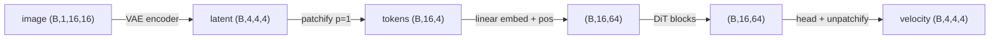
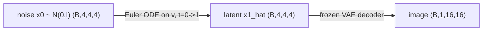
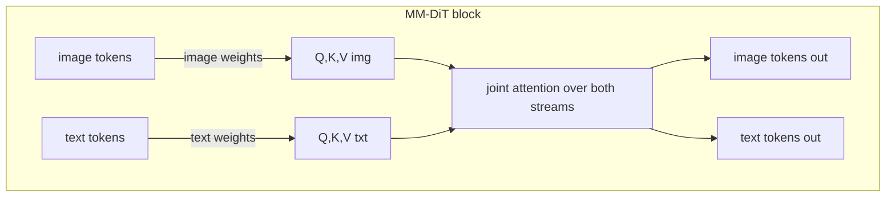

# A7 - Latent diffusion and a tiny DiT

Two stages sit under every diffusion image generator since 2022. First, an autoencoder
compresses the image into a small continuous latent. Second, a generative model learns the
distribution of those latents and a frozen decoder turns a sampled latent back into an
image. This assignment builds both at toy scale: a KL-regularized VAE that takes a 16x16
image down to a 4x4x4 latent, and a diffusion transformer (DiT) that predicts a
flow-matching velocity in that latent space, conditioned on the diffusion timestep and a
class label.

The flow-matching objective is reused unchanged from the flow-matching assignment: the same
linear interpolant, the same $u = x_1 - x_0$ velocity target, the same Euler ODE sampler.
What changes is where the denoiser operates (a latent, not a pixel image), what backbone it
uses (a transformer, not a U-Net), and how conditioning enters (adaptive LayerNorm). The new
mechanisms to implement are the VAE's reparameterization, KL, and loss, and the DiT's
adaLN-Zero block plus the patchify/unpatchify that turn a latent grid into tokens and back.

## Why latent space

A pixel-space diffusion model spends most of its compute modeling detail that the human eye
treats as texture: the exact high-frequency content of a 512x512 image carries little of the
semantic structure but dominates the pixel count. Latent Diffusion Models (Rombach et al.
2021, [arXiv:2112.10752](https://arxiv.org/abs/2112.10752)) split the problem in two. An
autoencoder is trained once to compress images into a lower-resolution latent that keeps the
structure a decoder needs, then the diffusion model trains only on those latents. This is the
design behind Stable Diffusion and everything downstream of it.

The saving comes from the per-axis downsample factor $f$. With two spatial axes, the number
of spatial positions (the token or pixel grid the denoiser iterates over at every step) drops
by $f^2$. For the toy here $f = 4$, so the grid goes from $16\times16 = 256$ positions to
$4\times4 = 16$ positions, $4^2 = 16$ times fewer. Production VAEs use $f = 8$, giving
$8^2 = 64$ times fewer positions. The factor is $f^2$, not $f$, because it counts a 2D grid.

This is fewer spatial positions, not a smaller tensor overall. The latent trades spatial
resolution for channels: the toy image is $16\times16\times1 = 256$ elements and the latent
is $4\times4\times4 = 64$ elements, a 4x reduction in element count, not 16x. The win that
matters for diffusion is the position count: attention and convolution cost scale with the
number of positions the model processes per denoising step, and diffusion runs that step tens
to hundreds of times.

Splitting training into two stages also decouples two different objectives. The autoencoder is
trained once with a reconstruction loss and a light regularizer; it never sees the diffusion
process. The generative model then only has to learn the structure of the compressed
distribution, on a grid small enough that a transformer over every position is affordable.

## The KL-VAE

The encoder maps an image to a per-latent-position Gaussian rather than to a single point. It
outputs two tensors, a mean $\mu$ and a log-variance $\log\sigma^2$, each shaped
$(B, C, 4, 4)$ with $C = 4$. A latent sample is drawn from $\mathcal{N}(\mu, \sigma^2)$. The
encoder is two stride-2 conv blocks taking $16 \to 8 \to 4$ spatially and $1 \to 32 \to 64$ in
channels, then a $1\times1$ conv to $2C = 8$ channels split into $\mu$ and $\log\sigma^2$.

Sampling from a Gaussian whose parameters depend on the network is not differentiable as
written, because the randomness sits between the parameters and the loss. The
reparameterization trick moves the randomness out of the path: draw
$\varepsilon \sim \mathcal{N}(0, I)$ independently, then form

$$z = \mu + \sigma\,\varepsilon, \qquad \sigma = \exp\!\left(\tfrac12 \log\sigma^2\right).$$

Now $z$ is a deterministic, differentiable function of $\mu$ and $\sigma$ with $\varepsilon$ as
a fixed external input, so gradients flow into the encoder. Predicting $\log\sigma^2$ rather
than $\sigma^2$ keeps the variance positive for any real output and makes the exponential the
only place positivity is enforced.

The regularizer is the Kullback-Leibler divergence from the encoder's Gaussian to a unit
Gaussian. For a diagonal Gaussian it has a closed form per latent dimension,

$$\mathrm{KL}\big(\mathcal{N}(\mu, \sigma^2)\,\|\,\mathcal{N}(0, I)\big)
= \tfrac12 \sum_i \left(\sigma_i^2 + \mu_i^2 - 1 - \log\sigma_i^2\right),$$

summed over the $(C, H, W)$ latent dimensions and averaged over the batch. The VAE loss is

$$\mathcal{L} = \underbrace{\big\|x - \hat{x}\big\|^2}_{\text{recon, per-image sum}}
+ \beta \cdot \mathrm{KL},$$

with the reconstruction term summed over pixels per image and averaged over the batch, the
same reduction the flow-matching loss uses. $\beta$ is deliberately small ($10^{-4}$ here).
A large $\beta$ pushes the latent toward pure noise, erasing the spatial structure the decoder
needs; the goal is a latent that is loosely Gaussian (smooth, roughly standardized, no large
gaps) while still carrying the image, not a latent that has collapsed to the prior. Under this
loss's sum reductions, recon is summed over 256 pixels and KL over 64 latent dims, so
$\beta = 10^{-4}$ keeps reconstruction dominant. At $\beta = 10^{-2}$ (beta-VAE territory) the
KL term would fight reconstruction.

This is the continuous-latent route. The alternative is a VQ codebook, which snaps each latent
position to the nearest entry in a learned dictionary and produces discrete tokens. Discrete
tokens suit an autoregressive model that predicts the next token with a categorical
distribution; a continuous latent suits a diffusion or flow model that adds and removes
Gaussian noise. Latent diffusion takes the continuous route, so the VAE keeps a real-valued
latent and regularizes it with KL instead of quantizing it.

## The diffusion transformer

The DiT (Peebles and Xie 2022, [arXiv:2212.09748](https://arxiv.org/abs/2212.09748)) replaces
the U-Net denoiser with a transformer. It cuts the latent grid into patches, treats each patch
as a token, runs a stack of transformer blocks over the tokens, and projects back to a latent
grid. The result is a denoiser whose quality scales with compute in the way transformers do
elsewhere: the DiT paper showed FID dropping smoothly as transformer Gflops rise, which is the
property that made the architecture the backbone for the systems that followed.

Patchify turns the latent $(B, C, H, W)$ into $(B, N, p^2 C)$ tokens, where $p$ is the patch
size and $N = (H/p)(W/p)$ is the token count, in row-major patch order. It is a pure
reshape/permute with no learned projection; a separate linear layer then embeds each
$p^2 C$-dimensional patch to the model width $d$. Unpatchify is the exact inverse and the
round trip must reproduce the input bit for bit. The configured model uses $p = 1$ on the
$4\times4$ latent, giving $N = 16$ tokens; $p = 2$ would leave only 4 tokens, too few for
attention to do interesting work, so $p = 1$ is the chosen value even though the code is
written for general $p$ and tested at $p = 2$.



The attention is bidirectional self-attention with no causal mask, the same way the vision
transformer encoder uses it: every token attends to every other token. There is no notion of
"future" tokens to hide here, unlike a language model, so the mask the transformer decoder used
is absent.

## adaLN-Zero conditioning

The denoiser has to be told two things at every step: the diffusion timestep $t$ and the class
label $y$. The DiT paper compared three ways to inject this conditioning and found adaptive
LayerNorm with a zero initialization, adaLN-Zero, best for class conditioning at equal Gflops.

Standard LayerNorm normalizes a token and then applies a fixed learned scale and shift.
Adaptive LayerNorm instead computes the scale and shift from the conditioning vector $c$, so
the same block behaves differently depending on $t$ and $y$. A small MLP regresses the affine
parameters from $c$. For a DiT block, that MLP produces six vectors per token: a shift, scale,
and gate for the attention sub-layer, and the same three for the MLP sub-layer. The shift and
scale modulate the normalized activations,

$$\mathrm{modulate}(x, \text{shift}, \text{scale}) = x \cdot (1 + \text{scale}) + \text{shift},$$

and the gate multiplies the entire residual branch:

$$x \leftarrow x + \text{gate}_{\text{msa}} \cdot \mathrm{attn}\big(\mathrm{modulate}(\mathrm{LN}(x), \text{shift}_{\text{msa}}, \text{scale}_{\text{msa}})\big),$$
$$x \leftarrow x + \text{gate}_{\text{mlp}} \cdot \mathrm{mlp}\big(\mathrm{modulate}(\mathrm{LN}(x), \text{shift}_{\text{mlp}}, \text{scale}_{\text{mlp}})\big).$$

The shift and scale arrive shaped $(B, d)$ and are unsqueezed to $(B, 1, d)$ inside
$\mathrm{modulate}$ so they broadcast over the $N$ token axis; without that unsqueeze the
$(B, d)$ tensor does not broadcast against the $(B, N, d)$ activations.

The "Zero" is the initialization. The final linear layer of the conditioning MLP starts at
zero weight and zero bias, so at initialization every gate is zero and both residual branches
contribute nothing: each block is the identity map, regardless of $c$. The network starts as a
stack of identity functions and learns to deviate from it. This is the same trick as zero-init
residual branches in ResNets, and it stabilizes early training, because a deep stack that
starts as the identity has well-behaved gradients instead of a random function of many layers.
The full DiT extends this to the output: a final adaptive LayerNorm and a zero-init output head
make the whole network predict exactly zero at initialization, the standard DiT starting point.

adaLN-Zero beat cross-attention and in-context conditioning in the DiT paper's
class-conditional ablation, where the conditioning is a single class embedding. That result is
narrow: it is not a general verdict against cross-attention. PixArt-$\alpha$ (Chen et al. 2023,
[arXiv:2310.00426](https://arxiv.org/abs/2310.00426)) uses cross-attention precisely because
adaLN does not scale to long text-token sequences: a single conditioning vector fits adaLN's
per-block affine, but hundreds of text tokens do not.

## The forward process, in latent space

The training objective is the linear-interpolant conditional flow matching from the
flow-matching assignment, moved into latent space and given a class label. The convention is
identical and must not be flipped:

$$t = 0 \text{ is noise } x_0 \sim \mathcal{N}(0, I), \qquad t = 1 \text{ is data } x_1 \text{ (the VAE latent)}.$$

The path is the straight line $x_t = (1-t)\,x_0 + t\,x_1$, and the conditional velocity target
is the constant displacement $u = x_1 - x_0$. The DiT predicts a velocity
$v_\theta(x_t, t, y)$, and the loss is the squared error between the prediction and $u$, summed
over the latent dimensions and averaged over the batch:

$$\mathcal{L}_{\text{CFM}} = \big\|v_\theta(x_t, t, y) - (x_1 - x_0)\big\|^2.$$

Flow matching rather than DDPM is a deliberate choice. SD3 (Esser et al. 2024,
[arXiv:2403.03206](https://arxiv.org/abs/2403.03206)), FLUX, and SiT (Ma et al. 2024,
[arXiv:2401.08740](https://arxiv.org/abs/2401.08740)) all train DiTs with rectified flow, and
the linear-interpolant objective is simpler to code than the DDPM posterior.

## Sampling end to end

Sampling integrates the velocity ODE in latent space. Start from $x_0 \sim \mathcal{N}(0, I)$
at $t = 0$ and step forward with Euler, $x \leftarrow x + v_\theta(x, t, y)\,\Delta t$, until
$t = 1$. The result is a latent; the frozen VAE decoder turns it into an image. Conditioning on
a chosen class label $y$ throughout produces a sample of that class.



## What to implement

In `vae.py`:
- `reparameterize(mu, logvar)`: $z = \mu + \exp(\tfrac12 \log\sigma^2)\,\varepsilon$ with
  $\varepsilon \sim \mathcal{N}(0, I)$ via `torch.randn_like`.
- `kl_divergence(mu, logvar)`: the closed-form KL above, summed over latent dims, mean over the
  batch.
- `vae_loss(x, x_hat, mu, logvar, beta)`: per-image-sum reconstruction plus $\beta \cdot$ KL;
  returns the three scalars (total, recon, kl).

In `dit.py`:
- `modulate(x, shift, scale)`: $x(1 + \text{scale}) + \text{shift}$ with the unsqueeze to
  $(B, 1, d)$.
- `patchify(z, p)` and `unpatchify(tokens, p, C, H, W)`: exact inverses between
  $(B, C, H, W)$ and $(B, N, p^2 C)$.
- `DiTBlock.forward(x, c)`: the adaLN-Zero block, two gated residual branches.

The VAE encoder/decoder, the timestep embedding, the DiT wiring, the flow-matching loss and
Euler sampler, the config, and the viz are provided.

## How to verify

Run from the repo root:

```
NANOVISION_IMPL=solution python -m pytest assignments/a07_latent_dit/tests
```

In run order: `test_shapes` (encoder/decoder/reparameterize/DiT shapes),
`test_patchify_roundtrip` (exact inverse at $p \in \{1, 2\}$), `test_kl` (closed-form value and
the $\mu=0, \log\sigma^2=0 \Rightarrow \mathrm{KL}=0$ case), `test_gradcheck` (float64 gradcheck
of `kl_divergence` and a single `DiTBlock.forward`), `test_adaln_identity` (a fresh block is the
identity and the full DiT predicts zero at init), `test_vae_overfit` (recon MSE falls below the
threshold on 8 images), `test_dit_overfit` (the DiT fits a fixed deterministic target),
`test_forbidden_imports` (no prebuilt VAE/DiT/transformer). The default mode (without
`NANOVISION_IMPL=solution`) fails at the holes with `NotImplementedError`, except
`test_forbidden_imports`, which is a static scan and passes either way.

`reparameterize` is not gradchecked: it draws a fresh $\varepsilon$ per call, so the
finite-difference reference forward would use a different $\varepsilon$ than the analytic pass
and the check is ill-posed. It is covered by the shape and overfit tests.

## Compute notes

Everything runs on CPU in seconds; the toy fits 12GB many times over. The VAE-overfit test runs
800 Adam steps on 8 images and drives the per-image-sum reconstruction from roughly 248 to under
0.01, so the loss curve should drop sharply in the first hundred steps and then flatten near
zero. The KL stays large (a few hundred) at $\beta = 10^{-4}$ by design, since the loss barely
penalizes it. The DiT-overfit test runs 2000 Adam steps on a fixed deterministic target (fixed
$x_0$, $t$, $y$, and target latents) and drops the flow-matching loss from roughly 144 to under
$10^{-3}$, a fall of more than four orders of magnitude; the target must stay fixed across steps
or the relative threshold becomes ill-posed. The `viz.py` demo trains the VAE and then the DiT
on the encoded latents and decodes one sample per class to `out/`.

## Where this goes next

SD3 and FLUX are flow-matching DiTs operating in a KL-VAE latent space, which is exactly the
two-stage pipeline built here. FLUX has no paper; see the model card and code at
[github.com/black-forest-labs/flux](https://github.com/black-forest-labs/flux). The two pieces
they add and this assignment does not are the text encoder (a frozen language/CLIP model that
turns a prompt into conditioning tokens) and the MM-DiT double-stream block, where image tokens
and text tokens carry separate weight matrices and meet only inside attention:



REPA (Yu et al. 2024, [arXiv:2410.06940](https://arxiv.org/abs/2410.06940)) is a training trick
worth knowing: align an intermediate DiT activation with frozen DINOv2 features during training,
and the DiT converges far faster (the paper reports more than an order-of-magnitude speedup on
its ImageNet DiT/SiT setup). The DiT learns visual representations slowly on its own, and
borrowing a pretrained encoder's features as an alignment target shortcuts that.

Video DiTs (Sora and the open-weights line that followed) extend this to spacetime: the VAE
compresses in time as well as space, and patchify gains a temporal axis so a patch is a small
spacetime tubelet (a patch that spans a few frames as well as a small spatial region) rather
than a 2D square. That is the bridge to the video-generation reading.

## References

- Rombach et al., High-Resolution Image Synthesis with Latent Diffusion Models, 2021.
  [arXiv:2112.10752](https://arxiv.org/abs/2112.10752). The two-stage autoencoder + latent
  diffusion design behind Stable Diffusion.
- Peebles and Xie, Scalable Diffusion Models with Transformers, 2022.
  [arXiv:2212.09748](https://arxiv.org/abs/2212.09748). The DiT: transformer denoiser,
  adaLN-Zero, FID-vs-Gflops scaling.
- Esser et al., Scaling Rectified Flow Transformers for High-Resolution Image Synthesis (SD3),
  2024. [arXiv:2403.03206](https://arxiv.org/abs/2403.03206). Flow-matching DiT with the MM-DiT
  double stream.
- Ma et al., SiT: Exploring Flow and Diffusion-based Generative Models with Scalable Interpolant
  Transformers, 2024. [arXiv:2401.08740](https://arxiv.org/abs/2401.08740). The same DiT
  backbone trained with interpolant/flow objectives.
- Chen et al., PixArt-$\alpha$: Fast Training of Diffusion Transformer for Photorealistic
  Text-to-Image Synthesis, 2023. [arXiv:2310.00426](https://arxiv.org/abs/2310.00426).
  Cross-attention conditioning for long text-token sequences.
- Yu et al., Representation Alignment for Generation: Training Diffusion Transformers Is Easier
  Than You Think (REPA), 2024. [arXiv:2410.06940](https://arxiv.org/abs/2410.06940). Aligning
  DiT activations with DINOv2 features for faster training.
- FLUX, Black Forest Labs.
  [github.com/black-forest-labs/flux](https://github.com/black-forest-labs/flux). Open-weights
  flow-matching DiT in a KL-VAE latent space (no paper).
