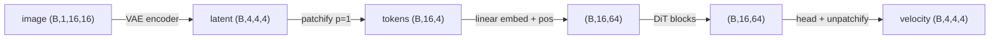
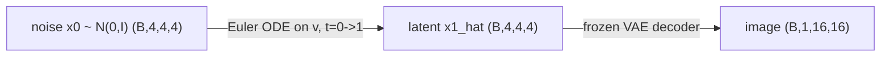
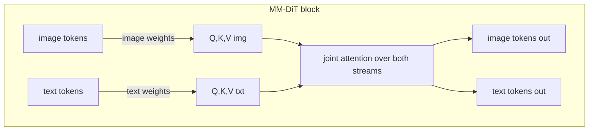

# A7 - Latent diffusion and a tiny DiT

Two stages sit under every diffusion image generator since 2022. First, an autoencoder
compresses the image into a small continuous latent. Second, a generative model learns the
distribution of those latents and a frozen decoder turns a sampled latent back into an image.
Building both at toy scale teaches the design behind Stable Diffusion, SD3, and FLUX: a
KL-regularized VAE that takes a 16x16 image down to a 4x4x4 latent, and a diffusion transformer
(DiT) that predicts a flow-matching velocity in that latent space, conditioned on the diffusion
timestep and a class label.

The flow-matching objective is reused unchanged from the flow-matching assignment: the same
linear interpolant, the same $u = x_1 - x_0$ velocity target, the same Euler ODE sampler. What
changes is where the denoiser operates (a latent, not a pixel image), what backbone it uses (a
transformer, not a U-Net), and how conditioning enters (adaptive LayerNorm). Implement the VAE's
reparameterization, KL, and loss, and the DiT's adaLN-Zero block plus the patchify/unpatchify
that turn a latent grid into tokens and back. Everything runs on CPU in seconds.

Required reading before starting:
- Rombach et al. 2021, "High-Resolution Image Synthesis with Latent Diffusion Models",
  [arXiv:2112.10752](https://arxiv.org/abs/2112.10752).
- Peebles and Xie 2022, "Scalable Diffusion Models with Transformers" (DiT),
  [arXiv:2212.09748](https://arxiv.org/abs/2212.09748).

## Lecture notes

### Why latent space

An autoencoder is a pair of networks trained together: an encoder that maps an image to a small
code and a decoder that maps the code back to an image, with a loss that asks the round trip to
reproduce the input. Nothing about it is generative on its own. It is a learned compressor, and
latent diffusion runs the generative model on the code it produces.

The motivation is compute. A pixel-space diffusion model spends most of its capacity modeling
detail that the human eye treats as texture: the exact high-frequency content of a 512x512 image
carries little of the semantic structure but dominates the pixel count. Latent
Diffusion Models (Rombach et al. 2021) split the problem in two. An autoencoder is trained once
to compress images into a lower-resolution code that keeps the structure a decoder needs, then
the diffusion model trains only on those codes. This is the design behind Stable Diffusion and
everything downstream of it.

The saving comes from the per-axis downsample factor $f$. With two spatial axes, the number of
spatial positions (the token or pixel grid the denoiser iterates over at every step) drops by
$f^2$. For the toy here $f = 4$, so the grid goes from $16\times16 = 256$ positions to
$4\times4 = 16$ positions, $4^2 = 16$ times fewer. Production VAEs use $f = 8$, giving $8^2 = 64$
times fewer positions. The factor is $f^2$, not $f$, because it counts a 2D grid.

This is fewer spatial positions, not a smaller tensor overall. The latent trades spatial
resolution for channels: the toy image is $16\times16\times1 = 256$ elements and the latent is
$4\times4\times4 = 64$ elements, a 4x reduction in element count, not 16x. The reduction that
matters for diffusion is the position count: attention and convolution cost scale with the
number of positions the model processes per denoising step, and diffusion runs that step tens to
hundreds of times.

Splitting training into two stages also decouples two different objectives. The autoencoder is
trained once with a reconstruction loss and a light regularizer; it never sees the diffusion
process. The generative model then only has to learn the structure of the compressed
distribution, on a grid small enough that a transformer over every position is affordable.

### From autoencoder to variational autoencoder

A plain autoencoder is trained on $\lVert x - d(e(x))\rVert^2$ and nothing else. That loss says
where each training image's code should be relative to its own reconstruction, and says nothing
about where codes should be relative to each other. Two problems follow, and both bite the
diffusion stage rather than the autoencoder itself.

The first is coverage. The decoder is only ever evaluated at the finitely many codes the encoder
produced during training. The set of those codes can be any shape at all: a thin curved sheet,
several disconnected blobs, a cloud with holes in it. A diffusion sampler does not draw from that
set. It starts at Gaussian noise and integrates an ODE to some point in the code space, and that
point will generally not be a training code. If the decoder was never asked about the
neighborhood the sampler lands in, its output there is undefined in practice and comes out as
noise or as a blend of unrelated images.

The second is scale. The flow-matching path used later is $x_t = (1-t)x_0 + t x_1$ with
$x_0 \sim \mathcal{N}(0, I)$ and $x_1$ the code. If the code's components have standard deviation
far from 1, one endpoint dominates the interpolation over nearly the whole path: at standard
deviation 50 the noise contributes essentially nothing except in the first few percent of $t$,
and the velocity target $u = x_1 - x_0$ is dominated by $x_1$. Training then says little about
the low-$t$ end of the path, which is exactly where sampling starts. Production latent-diffusion
systems handle this by multiplying the VAE latent by a fixed scalar, chosen once so the latent
has roughly unit variance, before any diffusion happens.

The variational autoencoder (Kingma and Welling 2013) addresses both by changing what the encoder
outputs. Instead of a point, it outputs a distribution over codes: a diagonal Gaussian with mean
$\mu(x)$ and variance $\sigma^2(x)$, one per latent position. Training draws a sample from that
Gaussian and decodes the sample, so each image is decoded from a small ball rather than from a
single point, which forces the decoder to be smooth over that ball. A second loss term then pulls
every one of those Gaussians toward a common $\mathcal{N}(0, I)$, which puts all the balls in the
same place at the same scale. The balls overlap, the space between training codes gets covered,
and the scale stops being arbitrary.

### The Kullback-Leibler divergence

The pull toward $\mathcal{N}(0, I)$ is a Kullback-Leibler divergence. For two distributions $q$
and $p$ over the same variable it is the expected log-ratio,

$$\mathrm{KL}(q \,\Vert\, p) = \mathbb{E}_{z \sim q}\!\left[\log \frac{q(z)}{p(z)}\right] \ge 0,$$

zero exactly when $q = p$. Read it as a coding cost: if a code is built assuming samples come
from $p$, and they actually come from $q$, the KL is the number of extra nats per sample that
costs. It is not symmetric, so it is not a distance, and the argument order matters. Here $q$ is
the encoder's Gaussian for one image and $p$ is the fixed unit Gaussian.

Both are Gaussians, so the expectation can be done in closed form. Take one dimension, with
$q = \mathcal{N}(\mu, \sigma^2)$ and $p = \mathcal{N}(0, 1)$. The log-ratio of the two
densities is

$$\log\frac{q(z)}{p(z)} = -\tfrac12\log\sigma^2 - \frac{(z-\mu)^2}{2\sigma^2} + \frac{z^2}{2}.$$

Under $z \sim q$ the two remaining expectations are standard: $\mathbb{E}[(z-\mu)^2] = \sigma^2$
by definition of the variance, and $\mathbb{E}[z^2] = \mu^2 + \sigma^2$. Substituting,

$$\mathrm{KL}\big(\mathcal{N}(\mu, \sigma^2)\,\Vert\,\mathcal{N}(0, 1)\big)
= -\tfrac12\log\sigma^2 - \tfrac12 + \frac{\mu^2 + \sigma^2}{2}
= \tfrac12\left(\sigma^2 + \mu^2 - 1 - \log\sigma^2\right).$$

A diagonal Gaussian factorizes over dimensions and the log-ratio is then a sum, so the
multi-dimensional divergence is the sum of the per-dimension ones:

$$\mathrm{KL}\big(\mathcal{N}(\mu, \sigma^2)\,\Vert\,\mathcal{N}(0, I)\big)
= \tfrac12 \sum_i \left(\sigma_i^2 + \mu_i^2 - 1 - \log\sigma_i^2\right),$$

summed over the $(C, H, W)$ latent dimensions and averaged over the batch. That expression is
what `kl_divergence` computes, and it is worth reading its two halves separately. The $\mu_i^2$
term is a plain quadratic penalty pulling each mean to the origin. The
$\sigma_i^2 - 1 - \log\sigma_i^2$ term has derivative $1 - 1/\sigma_i^2$, zero at
$\sigma_i^2 = 1$, positive above and negative below, so it pushes each variance toward exactly 1
from either side. At $\mu = 0$ and $\log\sigma^2 = 0$ every term vanishes and the divergence is
zero, which is the case the test suite checks directly.

### The reparameterization trick

The encoder outputs $\mu$ and $\log\sigma^2$; training needs a gradient of the loss with respect
to both, and the loss is an expectation over $z \sim \mathcal{N}(\mu, \sigma^2)$. Drawing $z$ by
handing $\mu$ and $\sigma$ to a random number generator produces a number with no arithmetic path
back to $\mu$: autograd records operations, and "sample from a Gaussian with these parameters" is
not one it can differentiate through. The parameters sit inside the distribution being averaged
over, not inside the function being averaged.

Changing variables fixes it. Any $\mathcal{N}(\mu, \sigma^2)$ sample can be written as a
standard normal sample rescaled and shifted, so draw $\varepsilon \sim \mathcal{N}(0, I)$ first,
with no dependence on any parameter, and form

$$z = \mu + \sigma\,\varepsilon, \qquad \sigma = \exp\!\left(\tfrac12 \log\sigma^2\right).$$

Now $z$ is an ordinary differentiable expression in $\mu$ and $\sigma$ with $\varepsilon$ as a
fixed external input, and $\partial z/\partial\mu = 1$, $\partial z/\partial\sigma = \varepsilon$
flow straight through.

Differentiable is not the same as correct, so here is a one-dimensional check that the estimator
also has the right expectation. Take $f(z) = z^2$ and $q = \mathcal{N}(\mu, \sigma^2)$. The true
objective is
$\mathbb{E}[z^2] = \mu^2 + \sigma^2$, so the true gradient is $\partial/\partial\mu = 2\mu$. The
reparameterized single-sample estimate is $z^2 = (\mu + \sigma\varepsilon)^2$, whose derivative
in $\mu$ is $2(\mu + \sigma\varepsilon)$. Averaging over $\varepsilon$ gives $2\mu$, the right
answer, with the spread coming only from $\varepsilon$. One draw per step is enough because
stochastic gradient descent only needs an unbiased estimate.

Predicting $\log\sigma^2$ rather than $\sigma^2$ keeps the variance positive for any real network
output, so nothing has to clamp or square, and the exponential is the only place positivity is
enforced.

### The VAE loss and the KL weight

The two loss terms are not an arbitrary pairing. They come from a lower bound on the data
log-likelihood. The generative model is a decoder $p_\theta(x \mid z)$ plus the fixed prior
$p(z) = \mathcal{N}(0, I)$, and maximum likelihood wants
$\log p_\theta(x) = \log \int p_\theta(x \mid z)\,p(z)\,dz$, an integral over every code that
could have produced $x$ with no closed form. Multiply and divide inside the integral by the
encoder's distribution $q_\phi(z \mid x)$ to turn it into an expectation, then apply Jensen's
inequality to the concave logarithm (the log of an average is at least the average of the logs):

$$\log p_\theta(x) = \log \mathbb{E}_{z \sim q_\phi}\!\left[\frac{p_\theta(x \mid z)\,p(z)}{q_\phi(z \mid x)}\right]
\;\ge\; \mathbb{E}_{z \sim q_\phi}\big[\log p_\theta(x \mid z)\big] - \mathrm{KL}\big(q_\phi(z \mid x)\,\Vert\,p(z)\big).$$

The right-hand side is the evidence lower bound, or ELBO, and it splits exactly into the two
terms in the code. If the decoder is a Gaussian with fixed variance $\sigma_{\text{dec}}^2$
centered on its output $\hat x$, then $-\log p_\theta(x \mid z)$ is
$\lVert x - \hat x\rVert^2 / (2\sigma_{\text{dec}}^2)$ plus a constant, and the second term is the
KL derived above. Minimizing the negative ELBO is minimizing reconstruction plus KL.

The implemented loss is

$$\mathcal{L} = \underbrace{\big\Vert x - \hat{x}\big\Vert^2}_{\text{recon, per-image sum}}
+ \beta \cdot \mathrm{KL},$$

with the reconstruction term summed over pixels per image and averaged over the batch, the same
reduction the flow-matching loss uses. Scaling the negative ELBO by $2\sigma_{\text{dec}}^2$ puts
it in exactly this form with $\beta = 2\sigma_{\text{dec}}^2$, so choosing $\beta$ is choosing how
precise the decoder is assumed to be. At $\beta = 10^{-4}$ that implies a decoder standard
deviation of $\sqrt{\beta/2} \approx 0.007$ on images that live in $[-1, 1]$: the model is being
told reconstruction should be nearly exact, and the KL is a light nudge on top.

Treating $\beta$ as a free knob rather than as $2\sigma_{\text{dec}}^2$ is the $\beta$-VAE
(Higgins et al. 2017). That paper pushed $\beta$ above 1 to force each latent coordinate to carry
an independent factor of variation, at a cost in reconstruction quality. Latent diffusion pushes
it the other way, far below 1, because the VAE here is wanted as a compressor and not as a
generative model in its own right: the diffusion model, not the prior, will supply the
distribution over codes.

The failure at large $\beta$ is posterior collapse. If the KL dominates, the cheapest solution is
$\mu = 0$ and $\sigma = 1$ for every image, which drives the KL to zero and makes the code pure
noise carrying no information about $x$; the decoder learns to ignore it and outputs the dataset
mean. Under this loss's sum reductions, recon is summed over 256 pixels and KL over 64 latent
dimensions, so $\beta = 10^{-4}$ keeps reconstruction dominant by a wide margin. At
$\beta = 10^{-2}$ ($\beta$-VAE territory) the KL term would start to fight reconstruction.

The latent that comes out is therefore only loosely standardized, not close to
$\mathcal{N}(0, I)$: at convergence on this toy the KL settles in the low hundreds of nats across
64 latent dimensions, nowhere near the near-zero value a $\beta$ of 1 would drive it to. That is
the intended trade. The reconstruction term keeps the spatial structure the decoder needs, and
even a weak KL term plus the sampled-rather-than-point encoding is enough to keep the codes in a
bounded region and to force the decoder to behave over a neighborhood of each one.

The encoder that produces $\mu$ and $\log\sigma^2$ is two stride-2 conv blocks taking
$16 \to 8 \to 4$ spatially and $1 \to 32 \to 64$ in channels, then a $1\times1$ conv to $2C = 8$
channels split into $\mu$ and $\log\sigma^2$, each shaped $(B, C, 4, 4)$ with $C = 4$. The
decoder mirrors it with nearest-neighbor upsampling and ends in a $\tanh$, so reconstructions
land in $[-1, 1]$.

### Continuous latent or discrete codebook

This is the continuous-latent route. The alternative replaces the Gaussian with a vector
quantizer (van den Oord et al. 2017): a learned dictionary of $K$ vectors, with each latent
position snapped to its nearest dictionary entry, so the code becomes a grid of integer indices
instead of a grid of real vectors. Discrete indices suit an autoregressive model that predicts
the next index from a categorical distribution over $K$ outcomes. A continuous latent suits a
diffusion or flow model, which needs to add and remove Gaussian noise and to move continuously
between points, neither of which is defined on a set of integers. Latent diffusion takes the
continuous route, so the VAE keeps a real-valued latent and regularizes it with KL instead of
quantizing it.

### The diffusion transformer

The denoiser in the original latent-diffusion work is a U-Net (Ronneberger, Fischer, Brox 2015):
a convolutional encoder that halves the resolution several times, a decoder that upsamples back,
and skip connections joining encoder and decoder at matching resolutions so fine detail survives
the bottleneck. Its inductive biases are locality and translation equivariance, inherited from
convolution, and a hard-coded resolution pyramid.

The DiT (Peebles and Xie 2022) throws all of that out and uses a transformer instead. It cuts the
latent grid into patches, treats each patch as a token, runs a stack of identical transformer
blocks over the tokens at a single resolution, and projects back to a latent grid. There is no
pyramid and no locality prior; every position can reach every other position in one attention
layer.

The argument for the swap is empirical and about scaling. The DiT paper measured sample quality
against the forward-pass cost of the denoiser, in Gflops (billions of floating-point operations
per forward pass), and found that quality improves smoothly and predictably as Gflops rise,
across model width, depth, and patch size. Quality there is FID, the Frechet Inception Distance
(Heusel et al. 2017): push a large set of generated images and a large set of real images through
a fixed pretrained Inception network, take the activations of one mid-level layer, fit a Gaussian
to each set with mean $\mu$ and covariance $\Sigma$, and report the Frechet distance between the
two Gaussians,

$$\mathrm{FID} = \lVert \mu_r - \mu_g \rVert^2 + \operatorname{tr}\!\big(\Sigma_r + \Sigma_g - 2(\Sigma_r\Sigma_g)^{1/2}\big),$$

lower being better and zero meaning the two feature Gaussians coincide. A single smooth
FID-versus-Gflops curve means the architecture can be scaled by a rule rather than by search,
which is why the systems that followed adopted it.

### Patchify and the token grid

Patchify turns the latent $(B, C, H, W)$ into $(B, N, p^2 C)$ tokens, where $p$ is the patch size
and $N = (H/p)(W/p)$ is the token count. It is a pure reshape and permute with no learned
projection; a separate linear layer then embeds each $p^2 C$-dimensional patch to the model width
$d$. Unpatchify is the exact inverse, and the round trip must reproduce the input bit for bit,
which the round-trip test asserts with zero tolerance.

The ordering has to be pinned down because unpatchify has to undo it. Patches are visited in
row-major order: patch row $i$, patch column $j$ becomes token $n = i\,(W/p) + j$, with $i$ and
$j$ counted from 0. Within a token the values are the $(C, p, p)$ block flattened in that order,
so component $c\,p^2 + a\,p + b$ of token $n$ holds $z[:, c,\, i p + a,\, j p + b]$.

Take the configured latent, $C = 4$ and $H = W = 4$, and read both settings off that rule. At
$p = 2$ there are $N = 4$ tokens of width $p^2 C = 16$; token 0 is the top-left $2\times2$ corner
of all four channels, token 1 the top-right, token 2 the bottom-left, token 3 the bottom-right.
At $p = 1$ there are $N = 16$ tokens of width $C = 4$, and token $n = 4i + j$ is simply the
4-vector of channel values at latent position $(i, j)$.

The configured model uses $p = 1$, giving $N = 16$ tokens. At $p = 2$ each attention layer would
be mixing four tokens through a $4 \times 4$ attention matrix, and each token would already
contain a quarter of the entire latent, so almost all of the modeling would fall to the
per-token MLP rather than to attention. The code is written for general $p$ and the tests exercise
$p \in \{1, 2\}$, but $p = 1$ is the configured value.

Attention has no notion of which token came from where; permuting the tokens permutes the output
identically. The position information that patchify's row-major order encoded in the token index
is therefore reinstated by adding a learned positional embedding, one $d$-vector per token slot,
to the embedded patches. The attention itself is bidirectional self-attention with no causal
mask, the same way the vision transformer encoder uses it: every token attends to every other
token. There is no notion of "future" tokens to hide here, unlike a language model, so the causal
mask is absent.



### Building the conditioning vector

The denoiser has to be told two things at every step: the diffusion timestep $t$ and the class
label $y$. Both are scalars, and both have to become a single vector $c$ of width $d$ that the
conditioning machinery can consume.

The class label is the easy one. It is one of `num_classes` symbols with no ordering, so it gets
a lookup table: an embedding matrix with one learned $d$-vector per class, indexed by $y$.

The timestep is harder because it is a continuous number and a network fed a single scalar has
almost nothing to work with. The standard fix is a sinusoidal embedding: expand $t$ into a vector
of cosines and sines at geometrically spaced frequencies
$\omega_k = 10000^{-k/(d_t/2)}$ for $k = 0, \dots, d_t/2 - 1$,

$$\mathrm{emb}(t) = \big(\cos(\omega_0 t),\, \dots,\, \cos(\omega_{d_t/2-1} t),\,
\sin(\omega_0 t),\, \dots,\, \sin(\omega_{d_t/2-1} t)\big),$$

which is the same sin/cos construction as the transformer's positional encoding, indexed by
diffusion time instead of sequence position. It has no parameters. Its usual purpose is to make
both coarse and fine differences in $t$ visible at once, which matters when $t$ ranges over
thousands of integer diffusion steps. Here $t$ is the continuous flow time in $[0, 1]$, so even
the fastest component, $\omega_0 = 1$, sweeps only about one radian across the whole range; the
embedding is a smooth nonlinear lift of a scalar into $d_t = 64$ coordinates rather than a
multi-scale code, and the two-layer MLP that follows it does the real work.

The two are added, not concatenated:

$$c = \mathrm{MLP}\big(\mathrm{emb}(t)\big) + \mathrm{embed}(y),$$

giving one $(B, d)$ vector per example. That single vector is shared by every token and every
block; the per-block adaptive LayerNorm below turns it into different behavior in different
blocks.

### adaLN-Zero conditioning

There are three common ways to get $c$ into a transformer, and the DiT paper compared them at
equal Gflops.

In-context conditioning appends $c$ to the token sequence as one or more extra tokens and lets
ordinary self-attention mix it in. It is the cheapest to implement and adds tokens to every
attention computation.

Cross-attention adds a second attention sub-layer per block in which the queries come from the
image tokens and the keys and values come from the conditioning. It handles conditioning of any
length, but it adds parameters and compute in every block.

Adaptive normalization sends $c$ nowhere near the attention. It uses $c$ only to set the affine
parameters of the block's normalization layers. LayerNorm normalizes each token vector across its
$d$ features to zero mean and unit variance, then applies a learned per-feature scale and shift;
those two learned vectors are the entire mechanism by which a LayerNorm can express anything. In
adaptive LayerNorm, a small MLP regresses them from $c$ instead, so the same block computes a
different function depending on $t$ and $y$. Conditioning a network by generating per-feature
scales and shifts from a side input is FiLM (Perez et al. 2018,
[arXiv:1709.07871](https://arxiv.org/abs/1709.07871)); adaptive LayerNorm is FiLM applied to a
LayerNorm's affine.

The DiT found the third option best for class conditioning, in the variant it calls adaLN-Zero.
Each block's conditioning MLP produces six $d$-vectors from $c$: a shift, scale, and gate for the
attention sub-layer, and the same three for the MLP sub-layer. In the equations below the
subscript msa marks the multi-head self-attention sub-layer and mlp marks the feed-forward one.
The shift and scale modulate the normalized activations,

$$\mathrm{modulate}(x, \text{shift}, \text{scale}) = x \cdot (1 + \text{scale}) + \text{shift},$$

written as $1 + \text{scale}$ so that a zero output from the conditioning MLP means "leave the
normalized activation alone" rather than "multiply it by zero". The gate multiplies the entire
residual branch:

$$x \leftarrow x + \text{gate}_{\text{msa}} \cdot \mathrm{attn}\big(\mathrm{modulate}(\mathrm{LN}(x), \text{shift}_{\text{msa}}, \text{scale}_{\text{msa}})\big),$$
$$x \leftarrow x + \text{gate}_{\text{mlp}} \cdot \mathrm{mlp}\big(\mathrm{modulate}(\mathrm{LN}(x), \text{shift}_{\text{mlp}}, \text{scale}_{\text{mlp}})\big).$$

The LayerNorms in the code are constructed with `elementwise_affine=False` precisely because the
affine now comes from $c$. The shift and scale arrive shaped $(B, d)$ and are unsqueezed to
$(B, 1, d)$ inside $\mathrm{modulate}$ so they broadcast over the $N$ token axis; without that
unsqueeze the $(B, d)$ tensor does not broadcast against the $(B, N, d)$ activations.

### Why the gates start at zero

The "Zero" is the initialization. The final linear layer of each block's conditioning MLP starts
at zero weight and zero bias, so at initialization every gate is zero, both residual branches
contribute nothing, and the block computes $x \mapsto x$ exactly, for any $c$.

The consequence is a statement about derivatives. A stack of $L$ blocks that are each exactly the
identity has Jacobian exactly $I$ with respect to its input, so a gradient arriving at the output
reaches every block's parameters at full size, neither amplified nor attenuated by the other
$L-1$ blocks. Compare a randomly initialized residual stack: each block adds a branch of some
random magnitude, those magnitudes compound through the depth, and the first steps of training go
into undoing that accumulated randomness rather than into fitting the target. Zero-initializing
whatever scales a residual branch is a known stabilizer beyond transformers; the same idea appears
as zeroing the last normalization layer's scale in each ResNet block (Goyal et al. 2017).

The DiT extends this to the output. A final adaptive LayerNorm sits after the last block, and the
output head's weight and bias are zero too, so the whole network predicts exactly zero at
initialization. That has a directly checkable consequence for the flow-matching loss: predicting
zero makes the initial loss exactly $\lVert x_1 - x_0 \rVert^2$, the squared norm of the target.
For independent standard-normal endpoints each of the 64 latent coordinates contributes a squared
difference with expectation 2, putting the initial loss near 128 on average; the overfit test's
seeded batch of 8 starts at 144.1, which is its target's squared norm to every digit. Training
begins from a quantity that can be predicted in advance rather than from the error of a random
field.

The adaLN-Zero result is narrow, and worth stating narrowly: it beat cross-attention and
in-context conditioning in the DiT paper's class-conditional ablation, where the conditioning is a
single class embedding. It is not a general verdict against cross-attention. PixArt-$\alpha$ (Chen
et al. 2023, [arXiv:2310.00426](https://arxiv.org/abs/2310.00426)) uses cross-attention precisely
because adaLN does not extend to long text-token sequences: a single conditioning vector fits
adaLN's per-block affine, but hundreds of text tokens do not compress into one shift-and-scale
pair without throwing away most of the prompt.

### The forward process, in latent space

The training objective is the linear-interpolant conditional flow matching from the flow-matching
assignment, moved into latent space and given a class label. A flow model learns a velocity field
$v_\theta(x, t)$ whose ODE $dx/dt = v_\theta$ carries the noise distribution at $t = 0$ to the
data distribution at $t = 1$. Conditional flow matching (Lipman et al. 2022) makes that trainable
by regressing $v_\theta$ on the velocity of a single straight path between one noise sample and
one data sample, which is available in closed form; the gradient of that per-pair objective equals
the gradient of the intractable objective defined on the marginal field.

The convention is identical to the flow-matching assignment and must not be flipped:

$$t = 0 \text{ is noise } x_0 \sim \mathcal{N}(0, I), \qquad t = 1 \text{ is data } x_1 \text{ (the VAE latent)}.$$

The path is the straight line $x_t = (1-t)\,x_0 + t\,x_1$, and the conditional velocity target is
the constant displacement $u = x_1 - x_0$. The DiT predicts a velocity $v_\theta(x_t, t, y)$, and
the loss is the squared error between the prediction and $u$, summed over the latent dimensions
and averaged over the batch:

$$\mathcal{L}_{\text{CFM}} = \big\Vert v_\theta(x_t, t, y) - (x_1 - x_0)\big\Vert^2.$$

The training loop draws $t$ uniformly from $[0.05, 0.95]$ rather than the full $[0, 1]$, keeping
the endpoints out of the training distribution.

Flow matching rather than DDPM is a deliberate choice. DDPM (Ho, Jain, Abbeel 2020) defines a
fixed Markov chain that adds Gaussian noise on a variance schedule, derives the exact Gaussian
posterior $q(x_{t-1} \mid x_t, x_0)$ over the previous state, and trains the network to match that
posterior's mean, which after a change of variables becomes a squared error on the added noise;
sampling then steps that posterior backward with schedule-dependent coefficients at every step.
Everything in that construction depends on the noise schedule, and the schedule has to be carried
through the loss, the sampler, and any reweighting of the per-step terms. The linear
interpolant has no schedule: one line for the path, one line for the target, one line for the
Euler step. Rectified flow (Liu, Gong and Liu 2022) is the name for this
straight-line-coupling instance of flow matching, and SD3 (Esser et al. 2024,
[arXiv:2403.03206](https://arxiv.org/abs/2403.03206)), FLUX, and SiT (Ma et al. 2024,
[arXiv:2401.08740](https://arxiv.org/abs/2401.08740)) all train DiTs this way.

### Sampling end to end

Sampling integrates the velocity ODE in latent space with forward Euler. Start from
$x_0 \sim \mathcal{N}(0, I)$ at $t = 0$, take $n$ steps of size $\Delta t = 1/n$
($n = 50$ in the config), and at step $k$ apply
$x \leftarrow x + v_\theta(x, t_k, y)\,\Delta t$ with $t_k = k\,\Delta t$. The result at $t = 1$
is a latent, and the VAE decoder turns it into an image. Conditioning on a chosen class label $y$
throughout produces a sample of that class.

The decoder is frozen at this point: the VAE was trained first, and during DiT training and
sampling its weights are not updated and no gradient flows into it. The DiT's training targets
are the latents produced once by the trained encoder, and this toy uses the encoder mean $\mu$
rather than a fresh reparameterized sample as the target.



## The assignment

Fill these holes, in order. Each is one `NotImplementedError` with a matching test; the docstring in each file gives the signature, shapes, and constraints.

1. [`reparameterize()`](vae.py) in `vae.py`
2. [`kl_divergence()`](vae.py) in `vae.py`
3. [`vae_loss()`](vae.py) in `vae.py`
4. [`modulate()`](dit.py) in `dit.py`
5. [`patchify()`](dit.py) in `dit.py`
6. [`unpatchify()`](dit.py) in `dit.py`
7. [`DiTBlock.forward()`](dit.py) in `dit.py`

### Running and validating

Activate the environment (`conda activate nanovision`), then:

```
make test     A=a07_latent_dit   # run the tests against the top-level files (the ones with holes)
make verify   A=a07_latent_dit   # run the same tests against the reference solution/
make viz      A=a07_latent_dit   # render the figure from the reference solution
make viz-mine A=a07_latent_dit   # render the figure from your own code (once the holes are filled)
```

`make test` is the command to run while working on the assignment. It runs the test suite in
`assignments/a07_latent_dit/tests/` against the top-level files (the ones with the holes), and
goes from red (the holes raise `NotImplementedError`) to green as the holes are filled in.
`make verify` runs the identical suite against the reference answer key in `solution/`: it sets
`NANOVISION_IMPL=solution`, which makes the tests import the reference implementation instead of
the top-level files. `make verify` is green from the start, so it shows the target and confirms
the tests and the environment work before anything changes. The goal is to bring `make test` to
the same green as `make verify`.

The suite checks the encoder/decoder/reparameterize/DiT shapes, the patchify round trip at
$p \in \{1, 2\}$, the closed-form KL value and the $\mu=0, \log\sigma^2=0 \Rightarrow
\mathrm{KL}=0$ case, a float64 `gradcheck` of `kl_divergence` and a single `DiTBlock.forward`,
the adaLN-Zero identity (a fresh block returns its input and the full DiT predicts all zeros at
init), a VAE overfit on 8 images, a DiT overfit on a fixed deterministic target, and that no
prebuilt VAE, DiT, or transformer is imported.

`gradcheck` is PyTorch's finite-difference check on the backward pass: it perturbs each input
element by a small $\pm h$, measures how the output actually moves, and compares that numerical
Jacobian against the analytic one autograd produces. It runs in float64 because the difference of
two nearly equal float32 numbers divided by a small $h$ loses most of its significant digits. The
`DiTBlock` check first perturbs the zero-init adaLN linear off zero, since a gradcheck through an
exact identity map would pass without testing anything. `reparameterize` is not gradchecked: it
draws a fresh $\varepsilon$ per call, so the finite-difference reference forward would use a
different $\varepsilon$ than the analytic pass and the check would compare two different
functions; it is covered by the shape and overfit tests instead.

`make viz` renders from the reference solution, so it works on a fresh checkout before any holes
are filled and shows the target figure. `make viz-mine` runs the same script against the
top-level code, the way to eyeball whether a finished implementation behaves. Both write a PNG to
`out/` rather than opening a window: the plot uses matplotlib's headless Agg backend, so the
command behaves the same over SSH, in WSL, and in CI with no display attached, and the figure is
a reproducible artifact to open directly or view inline in VSCode. Add `SHOW=1` (for example
`make viz-mine A=a07_latent_dit SHOW=1`) to also open the figure in an interactive window when a
display is available. The figure `latent_dit.png` has three rows: the original images, their VAE
reconstructions, and one DiT sample per class decoded through the frozen VAE.

What you should see when you run this. The VAE overfit starts with a per-image-sum reconstruction
near 250. That number is not arbitrary: the toy images are binary, $-1$ for background and $+1$
for the shape, so with an untrained decoder outputting near zero the squared error is close to
the pixel count, $16 \times 16 = 256$. Most of the drop happens in the first two hundred steps,
after which it flattens and finishes the 800-step test run under 0.01, with reconstructions that
match the originals. The KL stays large (a couple of hundred nats) at $\beta = 10^{-4}$ by
design, since the loss barely penalizes it. The DiT overfit starts at about 144, exactly the
squared norm of its fixed target for the reason given above, and drops below $10^{-3}$ on that
target (fixed $x_0$, $t$, $y$, and target latents). The target must stay fixed across steps:
resampling $x_0$ each step would put an irreducible variance floor under the loss, and a
threshold phrased as a fraction of the first step's value would then be measuring that floor
rather than convergence. The decoded DiT samples are
recognizable shapes of the requested class. These are toy artifacts on 16x16 images that confirm
the two-stage pipeline runs end to end; they say nothing about sample quality at scale, where the
VAE uses $f = 8$, the DiT is far larger, and FID is the measure.

## Where this goes next

SD3 and FLUX are flow-matching DiTs operating in a KL-VAE latent space, which is exactly the
two-stage pipeline built here. FLUX has no paper; see the model card and code at
[github.com/black-forest-labs/flux](https://github.com/black-forest-labs/flux). The two pieces
they add and this assignment does not are the text encoder and the MM-DiT double-stream block.

The text encoder is a frozen pretrained language model, or the text tower of a contrastive
image-text model such as CLIP, that turns a prompt into a sequence of conditioning tokens. A
prompt carries far more than one class embedding's worth of information, so the conditioning
cannot stay a single adaLN vector; squeezing a whole token sequence into one shift-and-scale pair
per block would discard nearly all of it.

MM-DiT's double-stream block handles that sequence. Image tokens and text tokens run through separate
weight matrices, each stream keeping its own projections and MLP, and the two meet only inside
attention, where queries, keys, and values from both streams are concatenated and attended
jointly:



REPA (Yu et al. 2024, [arXiv:2410.06940](https://arxiv.org/abs/2410.06940)) is a training trick
worth knowing. During training, an intermediate DiT activation is pushed to align with the
features a frozen DINOv2 encoder produces for the same image; DINOv2 is a vision transformer
trained without labels on a self-supervised objective, so its features are a ready-made
description of image content. Adding that alignment term makes the DiT converge far faster (the
paper reports more than an order-of-magnitude speedup on its ImageNet DiT/SiT setup). A DiT
trained only on the denoising loss learns such visual representations slowly on its own, and
borrowing a pretrained encoder's features as an alignment target shortcuts that.

Video DiTs (Sora and the open-weights line that followed) extend this to spacetime: the VAE
compresses in time as well as space, and patchify gains a temporal axis so a patch is a small
spacetime tubelet, a patch spanning a few frames as well as a small spatial region, rather than a
2D square. That is the bridge to the video-generation reading.

## References

- Kingma and Welling 2013, Auto-Encoding Variational Bayes,
  [arXiv:1312.6114](https://arxiv.org/abs/1312.6114). The VAE: the ELBO, the reparameterization
  trick, and the Gaussian KL term.
- Higgins et al. 2017, $\beta$-VAE, ICLR 2017. Reweighting the KL term as a free parameter.
- van den Oord, Vinyals, Kavukcuoglu 2017, VQ-VAE,
  [arXiv:1711.00937](https://arxiv.org/abs/1711.00937). The discrete-codebook alternative to a
  continuous latent.
- Ronneberger, Fischer, Brox 2015, U-Net,
  [arXiv:1505.04597](https://arxiv.org/abs/1505.04597). The convolutional encoder-decoder the DiT
  replaces.
- Heusel et al. 2017, FID, [arXiv:1706.08500](https://arxiv.org/abs/1706.08500). The
  Inception-feature Frechet distance used as the sample-quality axis.
- Perez et al. 2018, FiLM, [arXiv:1709.07871](https://arxiv.org/abs/1709.07871). Conditioning by
  generating per-feature scales and shifts from a side input.
- Goyal et al. 2017, "Accurate, Large Minibatch SGD". Zero-initializing the scale on each
  residual branch so a deep stack starts as the identity.
- Ho, Jain, Abbeel 2020, DDPM, [arXiv:2006.11239](https://arxiv.org/abs/2006.11239). The
  noise-schedule-based alternative to the linear interpolant.
- Lipman et al. 2022, Flow Matching, [arXiv:2210.02747](https://arxiv.org/abs/2210.02747). The
  conditional objective whose gradient matches the intractable marginal one.
- Liu, Gong and Liu 2022, Rectified Flow,
  [arXiv:2209.03003](https://arxiv.org/abs/2209.03003). The straight-line coupling between noise
  and data.
- Rombach et al. 2021, Latent Diffusion Models,
  [arXiv:2112.10752](https://arxiv.org/abs/2112.10752). The two-stage autoencoder plus latent
  diffusion design behind Stable Diffusion.
- Peebles and Xie 2022, DiT, [arXiv:2212.09748](https://arxiv.org/abs/2212.09748). The
  transformer denoiser, adaLN-Zero, and the FID-vs-Gflops scaling.
- Esser et al. 2024, SD3, [arXiv:2403.03206](https://arxiv.org/abs/2403.03206). The
  flow-matching DiT with the MM-DiT double stream.
- Ma et al. 2024, SiT, [arXiv:2401.08740](https://arxiv.org/abs/2401.08740). The same DiT
  backbone trained with interpolant/flow objectives.
- Chen et al. 2023, PixArt-$\alpha$, [arXiv:2310.00426](https://arxiv.org/abs/2310.00426).
  Cross-attention conditioning for long text-token sequences.
- Yu et al. 2024, REPA, [arXiv:2410.06940](https://arxiv.org/abs/2410.06940). Aligning DiT
  activations with DINOv2 features for faster training.
- FLUX, Black Forest Labs,
  [github.com/black-forest-labs/flux](https://github.com/black-forest-labs/flux). Open-weights
  flow-matching DiT in a KL-VAE latent space (no paper).
