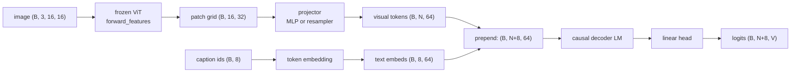

# A8 - Vision-language model (LLaVA-style)

A vision-language model (VLM) connects a frozen image encoder to a language model so the language
model can read an image and predict text about it. The vision transformer (ViT) produces one
feature vector per image patch; a small projector maps those vectors into the language model's
embedding space; the projected visual tokens are prepended to the caption's text embeddings; and a
decoder-only language model runs over the combined sequence and predicts the caption
autoregressively. The image conditions every text prediction because the visual tokens sit in the
model's context.

Build the LLaVA-style bridge on a toy of 16x16 images paired with three-token captions. Implement
the MLP projector, a single-layer Perceiver-style resampler as the contrasting connector, the
prepend operation, and the masked next-token loss. The frozen ViT, the token embedding, the
decoder-only language model, the output head, the two-stage freeze logic, greedy generation, and the
AnyRes shape exercise are provided. Everything runs on CPU in seconds.

Required reading before starting:
- Liu et al. 2023, "Visual Instruction Tuning" (LLaVA),
  [arXiv:2304.08485](https://arxiv.org/abs/2304.08485).
- Liu et al. 2023, "Improved Baselines with Visual Instruction Tuning" (LLaVA-1.5),
  [arXiv:2310.03744](https://arxiv.org/abs/2310.03744). The 2-layer MLP projector and its ablation.

## Lecture notes

### What a VLM has to solve

A language model reads a sequence of token embeddings and predicts the next token. An image is a
grid of pixels, not a sequence of token embeddings. A VLM has to put the image into a form the
language model can read, and do it so that text predictions depend on image content. The design
question is the visual-token interface: how the image becomes tokens, how many tokens it becomes,
where those tokens enter the language model, and how the model knows their positions.

The approach here is LLaVA (Liu et al. 2023). It is the simplest interface that works: run a frozen
image encoder, project its patch features into the language model's embedding dimension with a small
trained network, prepend the projected vectors to the text token embeddings, and leave the language
model otherwise unchanged. The image patches become ordinary positions in the context window.
Nothing about the transformer changes; the projector is the only new piece, and at the start it is
the only piece that trains.



### What the decoder actually reads

Why prepending an image to a text sequence is even a legal operation is worth taking apart first,
because everything else in this assignment follows from it.

The character language model built earlier in the course has a fixed pipeline: token ids, an
embedding table, a stack of causal transformer blocks, a linear head, logits over the vocabulary.
The embedding table is an ordinary $V \times d$ matrix, where $V$ is the vocabulary size and $d$ the
model dimension, together with a lookup rule: token id $t$ selects row $t$. That lookup is the only
place in the whole model where a token id appears. Everything downstream is arithmetic on
$d$-dimensional real vectors. Attention forms queries, keys, and values as linear maps of those
vectors; the feed-forward network mixes their channels; the head maps the final vectors back to $V$
logits.

The decoder's real input type is therefore not "a sequence of ids" but "a sequence of $d$-vectors",
a tensor of shape $(B, S, d)$. The embedding table is one supplier of such vectors. Any other
supplier of $d$-vectors can be spliced into the same sequence, and the decoder's forward pass cannot
tell the difference: no shape changes, no code changes, no new parameters inside the decoder. That
is the opening a VLM uses. The image path has to end in a tensor of shape $(B, N, d)$; once it does,
the image is more context and nothing else.

Two conditions come attached. The first is trivial: the dimension has to be $d$ exactly. The second
is the substance of the assignment. The decoder's weights were fitted against the statistics of
embedding-table rows, so its first attention layer holds $d \times d$ query and key matrices tuned
to vectors of a particular typical norm, whose variation lies in particular directions. Feed it
vectors ten times larger and the attention logits saturate into a near-one-hot softmax; feed it
vectors whose variation lies in directions the table never populates and the downstream weights
attenuate them toward nothing. Aligning visual features with the word embedding space, in the LLaVA
papers' phrase, means exactly that: the projector must learn a map whose output sits at a scale and
in directions the frozen decoder already reads. Alignment is a statement about the distribution of
vectors, not about meaning.

### The visual-token interface

The frozen ViT runs through `forward_features`, its feature path, which stops before the pooling and
the classification head and returns the per-patch grid. Frozen means `requires_grad` is off for
every ViT parameter, so no gradient is stored for them and the optimizer never updates them: the
encoder is a fixed feature extractor for the whole assignment. For a 16x16 image at patch size 4,
the grid is 4x4, so 16 patches, each a 32-dimensional feature vector, giving $(B, 16, 32)$. The
class token at index 0 and any register tokens are dropped, since the language model wants one
vector per image region rather than a pooled summary (this configuration sets `n_registers = 0`, so
only the class token is actually discarded). These features live in the ViT's feature space, not the
language model's embedding space, and the language model has never seen them.

The projector maps each patch feature from the ViT's 32 dimensions to the language model's 64, so a
visual token and a text token are interchangeable as far as the transformer is concerned. LLaVA's
original projector was a single linear layer; LLaVA-1.5 replaced it with a 2-layer MLP,
$\text{Linear} \to \text{GELU} \to \text{Linear}$, and a controlled ablation in that paper showed
the MLP improves the alignment over the single linear layer.

Without the nonlinearity in the middle there is no second layer. Two linear maps composed are a
single linear map, $W_2(W_1 x + b_1) + b_2 = (W_2 W_1) x + (W_2 b_1 + b_2)$, so a
$\text{Linear} \to \text{Linear}$ projector would be the original LLaVA linear projector with a more
expensive parameterization and no extra expressiveness. GELU is $x\,\Phi(x)$, where $\Phi$ is the
standard normal cumulative distribution function: a smooth version of ReLU that passes large
positive inputs through, suppresses large negative ones, and has a nonzero gradient everywhere in
between. It is the activation the ViT already uses in its own feed-forward blocks.

The MLP is applied per patch and does not mix patches, so it produces exactly one visual token per
patch. The prepend operation then concatenates the visual tokens before the text embeddings along
the sequence axis, visual first. The combined sequence is
$[\text{visual}_0, \dots, \text{visual}_{N-1}, \text{text}_0, \dots, \text{text}_{L-1}]$, and a
single causal mask of length $N+L$ runs over all of it. The text positions can attend back to every
visual position, so each predicted caption token sees the whole image. With the toy's numbers, the
16 visual tokens and 8 caption positions give a length-24 sequence of 64-dimensional vectors,
$(B, 24, 64)$, of which only the last 8 rows came from the embedding table.

The three degrees of freedom in this interface are how many tokens enter, where they are injected,
and how positions are communicated. The rest of the lecture notes vary these one at a time.

### Connector families

The projector is one of three families for turning patch features into tokens the language model
reads. They differ in how the patch count maps to the token count, which is the quantity that sets
the context cost of an image.

#### One token per patch

The MLP-projector family keeps one token per patch, or per merged group of patches, and lets all of
them enter the context. LLaVA and LLaVA-1.5 are the canonical examples; Qwen2.5-VL (Bai et al. 2025,
[arXiv:2502.13923](https://arxiv.org/abs/2502.13923)) uses an MLP patch-merger that concatenates a
small block of neighboring patches before the projection, which cuts the token count by the block
size while staying in this family. The token count scales with image resolution, so a
higher-resolution image costs more context. This is the family the MLP projector here belongs to.

#### Learned queries and cross-attention as pooling

The resampler family compresses a variable number of patches to a fixed number of output tokens.
The mechanism is cross-attention with learned queries, and it is worth deriving from attention
rather than accepting as a description.

Attention takes three matrices, queries, keys, and values. It scores every query row against every
key row, softmaxes each query's scores across the keys, and returns the score-weighted sum of the
value rows. In self-attention all three are linear maps of one sequence. In cross-attention the
queries come from one sequence and the keys and values from another, the configuration a translation
decoder uses to read encoder memory. The shapes say something useful: queries are $(S_q, d)$, keys
and values are $(S_k, d)$, and the output is $(S_q, d)$. The output length follows the query count
and ignores the key count entirely. Attention is already a length-changing operation;
cross-attention makes the two lengths independent.

A resampler exploits that by making the queries free parameters. Instead of projecting them from a
sequence, it stores a $(Q, d)$ tensor of weights, identical for every image, trained by
backpropagation like any other parameter. For one learned query $q$ and patch values $v_j$ with
keys $k_j$,

$$\text{out}(q) = \sum_{j=0}^{N-1} \frac{\exp(q \cdot k_j / \sqrt{d_h})}{\sum_{j'} \exp(q \cdot k_{j'} / \sqrt{d_h})}\, v_j,$$

with $d_h$ the per-head dimension the dot products are scaled by. That is a weighted average of the
$N$ patch vectors, with weights the query picks per image, which is pooling. The ViT's mean pooling
is the same sum with every weight fixed at $1/N$; a learned query replaces the fixed $1/N$ with a
content-dependent distribution, and $Q$ different queries pool the same patches $Q$ different ways.
The output is $Q$ tokens for any $N$.

The resampler built here is a single-layer miniature of this family:

$$\text{out} = \text{LayerNorm}\big(\text{queries} + \text{Attn}(\text{queries},\ kv=\text{feats}_{\text{proj}})\big).$$

One cross-attention, one residual, one norm. A linear layer maps the ViT's 32-dimensional features
to the language model's 64 first, so the queries and the patch features live in the same space. The
queries are initialized from a truncated normal with standard deviation 0.02 and the residual adds
them back, so each output token starts near its own query vector and the attention output moves it
from there.

The cross-attention here carries no position information of its own, so it is invariant to
permutations of the patch axis: shuffling the patch features shuffles nothing in the output. Patch
location still reaches the output, because the ViT added a learned absolute positional embedding to
its patch tokens before its encoder ran, so position is already baked into the features being
pooled.

A real Perceiver Resampler or Q-Former stacks several blocks, and each block adds query
self-attention, letting the queries see each other so they can specialize instead of all converging
on the same pooled summary, plus a feed-forward network. BLIP-2's Q-Former (Li et al. 2023,
[arXiv:2301.12597](https://arxiv.org/abs/2301.12597)) is such a stack, pretrained against
image-text objectives before being used as the connector; Flamingo's Perceiver Resampler
(Alayrac et al. 2022, [arXiv:2204.14198](https://arxiv.org/abs/2204.14198)) is the other canonical
example, and the original Qwen-VL (Bai et al. 2023,
[arXiv:2308.12966](https://arxiv.org/abs/2308.12966)) used a single-layer cross-attention adapter.
The miniature here keeps only the cross-attention pooling, which is the part that sets the output
length, so the gradient check has a single unambiguous target.

The fixed token budget makes the context cost independent of image resolution, at the price of
throwing away detail when the image has more patches than the budget can carry. Note the version
split: Qwen-VL (2023) is resampler-family, while Qwen2.5-VL (2025) is MLP-patch-merger-family. The
resampler still prepends its $Q$ tokens the same way the MLP prepends its patch tokens.

#### Early fusion

The third family drops the separate pretrained encoder. Fuyu applies one linear map to raw image
patches inside the decoder itself, with no separately trained vision backbone in front of it.
Chameleon (Team 2024, [arXiv:2405.09818](https://arxiv.org/abs/2405.09818)) goes further and turns
the image into discrete tokens with a vector-quantized image tokenizer, the encoder-codebook-decoder
scheme built earlier in the course, so an image becomes a string of codebook indices that extend the
text vocabulary and a single transformer is trained over the merged token stream. Llama 4 is also
early-fusion, though with continuous tokens from a MetaCLIP-based encoder joined to the text stream
from the first layer rather than quantized ones.

Neither design has a connector bridging two separately pretrained representation spaces, because
there is only one model being trained. This assignment does not implement early fusion; it is the
reference point for what the encoder-plus-projector design buys (a frozen, separately-trained vision
backbone that never has to be retrained) and costs (two representation spaces the projector has to
reconcile).

### Where the visual tokens enter

Prepending is one of two injection points. LLaVA prepends the visual tokens into the context and
changes nothing else about the language model, which is the approach here.

Flamingo instead leaves the text sequence alone and inserts new cross-attention layers between the
language model's existing layers. Each inserted layer attends from the text hidden states to the
resampled visual tokens and adds the result back:

$$x \leftarrow x + \tanh(\gamma)\,\text{CrossAttn}(x,\ kv = \text{visual}),$$

with $\gamma$ a learned scalar initialized to zero. Since $\tanh(0) = 0$, the inserted layer is the
identity map at initialization, so the pretrained language model produces exactly the outputs it
produced before surgery and training starts from an undamaged model; as $\gamma$ moves away from
zero the visual pathway opens gradually. The injection point is different from LLaVA's: LLaVA puts
visual tokens in the sequence, Flamingo puts a cross-attention pathway in the depth.

The resampler variant here does not change the injection point. It changes how many visual tokens
there are and how they are pooled (from $N$ patches to $Q$ queries), then prepends the $Q$ tokens
exactly as the MLP path prepends its patch tokens. A resampler is not the same thing as Flamingo's
gated cross-attention injection, even though both use cross-attention somewhere; the resampler's
cross-attention is in the connector that builds the tokens, not in the language model that consumes
them.

### How positions are communicated

The decoder-only language model here uses rotary position embedding (RoPE), the scheme built with
the transformer earlier in the course. RoPE takes each pair of channels of a query or key vector as
a point in a plane and rotates it by an angle proportional to the token's index, with a different
rotation rate per channel pair. Rotating both $q_i$ and $k_j$ this way makes their dot product a
function of the offset $i - j$ alone. Position is never added to the token vector; it is applied
inside attention, to the queries and keys only.

That matters for a VLM in a small but concrete way: the visual tokens need no position information
of their own, and none is added. They get indices $0, \dots, N-1$ and the text follows at
$N, \dots, N+L-1$, purely from their order in the concatenated sequence. Generation starts from an
empty text side and prepends the same visual tokens, so the visual tokens occupy the same indices at
training and at inference and the rotations applied to them agree.

What a 1D index costs depends on whether the grid shape is fixed. With this toy's constant 4x4
row-major grid, patch index $i$ determines row $\lfloor i/4 \rfloor$ and column $i \bmod 4$
exactly, so a 1D index loses no spatial information and the model can learn the layout from the
index alone. The recovery fails once the grid shape varies per image, as it does in
native-resolution VLMs that feed each image at its own aspect ratio: index 37 sits in a different
row depending on how wide that particular image's patch grid was, so the same index means different
geometry from sample to sample.

Qwen2-VL and Qwen2.5-VL handle that with multimodal RoPE (M-RoPE), which splits the rotary channel
pairs into three groups and drives each group with a different index: a temporal index, a row index,
and a column index. Text tokens set all three to the sequence position, which reduces to ordinary
RoPE; an image patch sets the temporal index to a constant and the other two to its actual row and
column, so the grid geometry reaches attention regardless of how the patches were flattened. Some
other systems instead add explicit patch-position IDs. Plain sequence-order positions carry the 2D
layout only under a fixed grid, which is the situation here.

### Captions, teacher forcing, and the loss shift

The training task is image captioning: predict the caption tokens from the image. Captioning is a
stand-in for visual question answering (VQA), the task of answering a natural-language question
about an image, where the model is given the image plus a question like "what color is the ball?"
and has to produce the answer as text. A VQA prompt would prepend a fixed question prefix before the
answer tokens, but the mechanism of conditioning text on prepended visual tokens is identical, and
captioning avoids inventing a question vocabulary.

The caption format is the one used for the contrastive image-text model earlier in the course, from
the same `image_text_batch` toy generator: token id 0 is the padding token, used to fill every
caption out to a fixed length $L = 8$ so a batch is one rectangular tensor; ids 1 through 4 are
class tokens; ids 5 through 8 are attribute tokens; and the largest id, $31$, is the
end-of-sequence (EOS) token, the marker that closes a caption. A caption is
$[\text{class}, \text{attribute}, \text{EOS}, \text{pad}, \dots]$, for instance
$[2, 7, 31, 0, 0, 0, 0, 0]$. Padding is a shape convenience with no content, so it must not be
supervised.

Training a causal decoder scores every position of a sequence in one forward pass: position $i$
attends to positions $\le i$ and predicts token $i+1$, and the causal mask keeps the $L$ predictions
from seeing their own answers. This requires feeding the whole ground-truth sequence as input, so
the prefix the model conditions on at position $i$ is the true tokens $0 \dots i$, never the model's
own earlier predictions. That is teacher forcing: a teacher hands the model a correct prefix at
every step. It buys parallelism, since one forward pass scores all $L$ positions, and stability,
since an early mistake cannot corrupt the rest of the sequence during training. It also leaves a
mismatch, called exposure bias: at inference no teacher exists, the model consumes its own outputs,
and it has never been trained on the slightly-wrong prefixes it will then see.

Inference here is greedy decoding: at each step take the argmax over the vocabulary logits at the
last position, append that token to the text side, and run again. No sampling and no beam search, so
the output is deterministic given the image.

The loss is next-token cross-entropy supervised only on the text positions. Over the combined
sequence $[\text{visual}_0, \dots, \text{visual}_{N-1}, \text{text}_0, \dots, \text{text}_{L-1}]$,
the supervised targets are the text tokens. The last visual position (index $N-1$) predicts
$\text{text}_0$, the first caption token; $\text{text}_k$ predicts $\text{text}_{k+1}$; pad targets
are ignored. There is no beginning-of-sequence token, the dummy first token some language models
prepend to give the first real token something to be predicted from, and no separator between the
image and the text. The last visual position plays that role instead, and generation also starts
from an empty text side, so training and inference use the same shift.

The label tensor is built to length $N+L$ in three steps. Fill the whole $(B, N+L)$ tensor with the
ignore index $-100$, the sentinel value `F.cross_entropy` drops from the average rather than
scoring. Write the true caption tokens into the text slice. Re-mask the pads within that slice, so
padding is not supervised. Then shift and reduce:

$$\mathcal{L} = \text{cross-entropy}\big(\text{logits}[:, :-1],\ \text{labels}[:, 1:],\ \text{ignore-index} = -100\big).$$

Dropping the last logit column and the first label column is the shift: it lines up the prediction
made at position $i$ with the token at position $i+1$. The visual positions stay at $-100$
throughout, so changing a visual-span logit does not change the loss, which is the property the test
suite checks by perturbing those logits. Re-masking the pads has to be done within the text slice
and not by indexing the full label tensor with a length-$L$ mask, because the label tensor has
length $N+L$ and the boolean mask would not line up.

### The two-stage freeze curriculum

LLaVA trains in two stages. Stage 1 freezes the language model and trains only the projector, to
put the visual features at a scale and in directions the frozen language model can read. Stage 2
unfreezes the language model and trains it together with the projector on instruction data.

Instruction tuning is supervised fine-tuning on pairs of an instruction and the response it should
produce, which turns a model that continues text into one that answers what it was asked. Visual
instruction tuning is the same thing with an image in the prompt, and LLaVA's contribution was
building that data at scale by handing a language-only model the captions and object boxes of
existing images and asking it to write question-answer pairs about them.

The stage toggle implements the curriculum through `requires_grad`, the per-parameter flag that
decides whether autograd accumulates a gradient for a tensor. Parameters with the flag off get no
gradient and are excluded from the optimizer, so they hold their values exactly. Stage 1 trains the
projector, the token embedding, and the output head with the ViT and the decoder frozen; stage 2
also unfreezes the decoder; the ViT stays frozen throughout.

Two real-LLaVA details differ at course scale. Real LLaVA freezes the language model's token
embedding and output head along with the rest of the language model in stage 1, and moves only the
projector. That works because a pretrained embedding table is a fixed target: its rows already sit
in an arrangement where related words are near each other, so "map visual features into the
embedding space" names a definite destination. Here the language model is randomly initialized, as
the course has no large text corpus to pretrain it on, so the embedding rows are random draws from a
normal distribution and carry no arrangement at all. A projector trained to hit that target would be
fitting noise. Letting the embedding and the head train in stage 1 lets the vocabulary acquire an
arrangement at the same time the projector learns to map into it; the decoder stays frozen, so
stage 1 here is a random decoder being driven by a projector and a head that learn together. The
lesson is the visual-token interface and the freeze-curriculum mechanics, not exploiting a language
prior the course does not have.

### Grounding

The grounding question is whether the visual path actually carries the caption, or whether the
language model has learned to emit plausible captions while ignoring the image. The probe is to
compare the caption loss with the true visual tokens against the loss with the visual tokens zeroed.
A model that ignored the image would do equally well both ways; a grounded model does much worse
when the visual tokens are removed.

The probe has a hole to close. In an autoregressive caption, a later token can be predicted from an
earlier text token rather than from the image: if every image whose class token is 2 also has
attribute token 7, then the attribute is readable off the class alone and zeroing the image costs
nothing at that position. The test therefore pins a batch containing at least two rows that share a
class but differ in attribute, so the attribute position genuinely needs the image to disambiguate.
The first caption token has no such escape at all, because it is predicted from the last visual
position with no text to its left, which makes its full-versus-ablated gap the part of the
measurement that survives a change of seed.

### AnyRes tiling

A fixed-resolution ViT processes one image size. To read a higher-resolution image, LLaVA-NeXT's
AnyRes splits it into a grid of sub-crops, encodes each crop through the same ViT, and concatenates
the per-crop patch grids, plus a low-resolution overview of the whole image so the model sees both
global layout and local detail. The token count is $\text{grid}^2 \times \text{patches-per-crop}$,
plus the overview's patches-per-crop when an overview is included. For the LLaVA-NeXT 336px example
at patch 14, one crop is $(336/14)^2 = 576$ tokens, a 2x2 grid is 4 crops (2304 tokens), and the
336px overview adds another 576 tokens for a total of 2880. The overview is a full image at 576
tokens, not a single token.

The cost of AnyRes is that the visual token count grows with the crop count, and attention cost
grows with the square of the sequence length, so token compression became a research direction of
its own. Two methods are worth understanding concretely.

Pixel shuffle rearranges a patch grid instead of discarding any of it. Given an $H \times W$ grid of
$C$-dimensional patch features, take each $2 \times 2$ block of neighboring patches and stack its
four feature vectors into one $4C$-dimensional vector, producing an $(H/2) \times (W/2)$ grid. The
token count drops by four and nothing is thrown away at the rearrangement itself; the projector that
follows takes $4C$ inputs instead of $C$ and decides what to keep. The operation is borrowed from
sub-pixel convolution in image super-resolution (Shi et al. 2016), where the same reshape runs in
the opposite direction to turn channels into resolution. The InternVL line uses it to cut visual
tokens (Chen et al. 2024, [arXiv:2404.16821](https://arxiv.org/abs/2404.16821)).

Qwen2.5-VL's patch-merger is the same idea reached from the other side: concatenate the feature
vectors of a neighboring block of patches along the channel axis and run the merged vector through
the projection MLP, so one output token covers a block of patches. Both trade spatial token
resolution for channel width and lean on the projector to compress what the extra channels carry.

### Where this leads

The vision-language-action capstone is a VLM policy. The action the robot takes is encoded as a
token, appended to the sequence, and predicted autoregressively exactly like a caption token. The
visual-token interface built here (frozen encoder into projector into prepended tokens into a causal
decoder) is reused without change; only the output vocabulary changes from words to actions.

Two trends in real VLMs the course does not follow are worth naming. The first is the backbone.
SigLIP (Zhai et al. 2023, [arXiv:2303.15343](https://arxiv.org/abs/2303.15343)) replaced CLIP as the
default vision encoder in many 2024-era VLMs. The change is in the loss: the contrastive objective
built earlier in the course softmaxes each image's similarities over all texts in the batch, so
every score is normalized against every other pair and the batch has to be gathered in one place.
SigLIP scores each image-text pair on its own with a binary logistic loss, positive for matched
pairs and negative for the rest, which removes the batch-wide normalization and makes very large
batches cheaper to run.

The second is that from 2024 onward many systems unfreeze the ViT and train it with the language
model rather than keeping it frozen; Cambrian-1 (Tong et al. 2024,
[arXiv:2406.16860](https://arxiv.org/abs/2406.16860)) studies how the vision side affects the
result. This assignment keeps the ViT frozen, the simpler LLaVA recipe.

## The assignment

Fill these holes, in order. Each is one `NotImplementedError` with a matching test; the docstring in each file gives the signature, shapes, and constraints.

1. [`MLPProjector.forward()`](projector.py) in `projector.py`
2. [`PerceiverResampler.forward()`](resampler.py) in `resampler.py`
3. [`prepend_visual()`](vlm.py) in `vlm.py`
4. [`vlm_loss()`](vlm.py) in `vlm.py`

### Running and validating

Activate the environment (`conda activate nanovision`), then:

```
make test     A=a08_vlm   # run the tests against the top-level files (the ones with holes)
make verify   A=a08_vlm   # run the same tests against the reference solution/
make viz      A=a08_vlm   # render the figures from the reference solution
make viz-mine A=a08_vlm   # render the figures from your own code (once the holes are filled)
```

`make test` is the command to run while working. It runs the suite in
`assignments/a08_vlm/tests/` against the top-level files and goes from red (the holes raise
`NotImplementedError`) to green as they are filled. `make verify` runs the identical suite against
the reference in `solution/` by setting `NANOVISION_IMPL=solution`, so it is green from the start and
shows the target. The goal is to bring `make test` to the same green as `make verify`.

The suite checks shapes; a float64 gradient check of both connectors (`torch.autograd.gradcheck`,
which compares the analytic backward pass against finite differences of the forward pass and needs
double precision for that comparison to mean anything); that the resampler returns $Q$ tokens for
both 16 and 9 input patches; that `vlm_loss` matches a hand-computed cross-entropy over the text
targets alone, and is unchanged when the visual-span logits are perturbed (the visual positions are
never supervised); the AnyRes token count; the two-stage `requires_grad` toggling; a short caption
overfit; the grounding ablation; and that no `transformers`, `timm`, or bare
`vit`/`transformer`/`attention` module is imported.

`make viz` renders from the reference solution, so it works on a fresh checkout before any holes are
filled. `make viz-mine` runs the same script against the top-level code, which needs the holes filled
(it trains a model with them). Both write PNGs to `out/` using matplotlib's headless Agg backend, so
they work over SSH, in WSL, and in CI with no display, and the figures open inline in VSCode. Add
`SHOW=1` (for example `make viz-mine A=a08_vlm SHOW=1`) to also open interactive windows when a
display is available. The figures are `captions.png` (generated captions beside their images) and
`grounding_ablation.png` (the caption loss with and without the visual tokens).

What you should see when you run this. The toy caption for an image is
$[\text{class}, \text{attribute}, \text{EOS}, \text{pad}, \dots]$, where the class token is set by
the blob's color channel and the attribute token by the blob's position, both functions of the image
(`nanovision.data.toy.image_text_batch`). A model that ignored the visual tokens could not predict
either, so the grounding ablation is a valid probe. On the toy MLP connector at 300
steps the caption loss reaches about $7\times10^{-4}$, slightly below the single-layer resampler's
$9\times10^{-4}$, the same direction as the LLaVA-1.5 finding that the MLP projector is a strong
baseline. The two stages are reported separately (seed 0, 300 steps each): stage 1 reaches a caption
loss around 0.002 and stage 2 about $1\times10^{-5}$. Stage 1 already fits well here because the
trainable embedding and head give the random decoder enough capacity on four examples; do not read
the stage-1 number as evidence that projector-only training produces good captions in general. For
grounding (seed 0, 300 steps), the full-model caption loss is about $7\times10^{-4}$ and the
visual-tokens-zeroed loss about $1.8$, a ratio near 2500; re-initializing the projector to random
weights gives a similar jump. The test pins a batch where at least two rows share a class but differ
in attribute, so the attribute genuinely needs the image; per position, the class-position loss
jumps from about $0.0009$ to about $3.0$ and the attribute-position loss from about $0.0007$ to about
$2.4$ when the visual tokens are zeroed. The class-position gap is the grounding signal that holds
regardless of the seed. These are toy artifacts; they confirm the interface conditions text on the
image, and say nothing about caption quality at scale.

## Further reading

Where this goes next:

- Bai et al. 2025, "Qwen2.5-VL Technical Report",
  [arXiv:2502.13923](https://arxiv.org/abs/2502.13923). The MLP patch-merger connector and M-RoPE.
- Tong et al. 2024, "Cambrian-1: A Fully Open, Vision-Centric Exploration of Multimodal LLMs",
  [arXiv:2406.16860](https://arxiv.org/abs/2406.16860). Unfreezing the vision side.

Optional deeper reading:

- Alayrac et al. 2022, "Flamingo: a Visual Language Model for Few-Shot Learning",
  [arXiv:2204.14198](https://arxiv.org/abs/2204.14198). The Perceiver Resampler and gated
  cross-attention injection.
- Li et al. 2023, "BLIP-2: Bootstrapping Language-Image Pre-training with Frozen Image Encoders and
  Large Language Models", [arXiv:2301.12597](https://arxiv.org/abs/2301.12597). The Q-Former.
- Chen et al. 2024, "How Far Are We to GPT-4V? Closing the Gap to Commercial Multimodal Models with
  Open-Source Suites" (InternVL 1.5), [arXiv:2404.16821](https://arxiv.org/abs/2404.16821).
  Pixel-shuffle token compression and dynamic high resolution.

Full reference list:

- Liu et al. 2023, LLaVA, [arXiv:2304.08485](https://arxiv.org/abs/2304.08485).
- Liu et al. 2023, LLaVA-1.5, [arXiv:2310.03744](https://arxiv.org/abs/2310.03744).
- Alayrac et al. 2022, Flamingo, [arXiv:2204.14198](https://arxiv.org/abs/2204.14198).
- Li et al. 2023, BLIP-2, [arXiv:2301.12597](https://arxiv.org/abs/2301.12597).
- Bai et al. 2023, Qwen-VL, [arXiv:2308.12966](https://arxiv.org/abs/2308.12966).
- Wang et al. 2024, Qwen2-VL, [arXiv:2409.12191](https://arxiv.org/abs/2409.12191). M-RoPE.
- Bai et al. 2025, Qwen2.5-VL, [arXiv:2502.13923](https://arxiv.org/abs/2502.13923).
- Team 2024, Chameleon, [arXiv:2405.09818](https://arxiv.org/abs/2405.09818).
- Chen et al. 2023, InternVL, [arXiv:2312.14238](https://arxiv.org/abs/2312.14238).
- Chen et al. 2024, InternVL 1.5, [arXiv:2404.16821](https://arxiv.org/abs/2404.16821).
- Zhai et al. 2023, SigLIP, [arXiv:2303.15343](https://arxiv.org/abs/2303.15343).
- Tong et al. 2024, Cambrian-1, [arXiv:2406.16860](https://arxiv.org/abs/2406.16860).
- Shi et al. 2016, "Real-Time Single Image and Video Super-Resolution Using an Efficient Sub-Pixel
  Convolutional Neural Network". The pixel-shuffle rearrangement.
