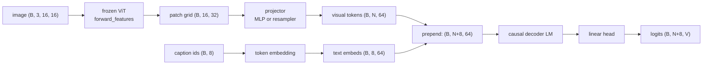

# A8 - Vision-language model (LLaVA-style)

You build the bridge that connects a frozen image encoder to a language model. The vision
transformer (ViT) you built earlier produces one feature vector per image patch; a small
projector maps those vectors into the language model's embedding space; the projected visual
tokens are prepended to the caption's text embeddings; and a decoder-only language model runs
over the combined sequence and predicts the caption autoregressively. The image conditions
every text prediction because the visual tokens sit in the model's context. You implement the
projector, a Perceiver-style resampler as the contrast connector, the prepend operation, and
the masked next-token loss. Everything runs on CPU in seconds on a toy of 16x16 images paired
with three-token captions.

The four holes are the interface itself: the 2-layer MLP projector, the single cross-attention
resampler, `prepend_visual`, and `vlm_loss`. The frozen ViT, the token embedding, the
decoder-only LM, the output head, the stage-freezing logic, `generate`, and the AnyRes shape
exercise are provided.

## What a VLM has to solve

A language model reads a sequence of token embeddings and predicts the next token. An image
is a grid of pixels, not a sequence of token embeddings. A vision-language model has to put
the image into a form the language model can read, and do it so that text predictions can
depend on image content. The design question is the visual-token interface: how the image
becomes tokens, how many tokens it becomes, where those tokens enter the language model, and
how the model knows their positions.

The approach you build is LLaVA (Liu et al. 2023, "Visual Instruction Tuning",
[arXiv:2304.08485](https://arxiv.org/abs/2304.08485)). It is the simplest interface that
works: run a frozen image encoder, project its patch features into the language model's
embedding dimension with a small trained network, prepend the projected vectors to the text
token embeddings, and leave the language model otherwise unchanged. The image patches become
ordinary positions in the context window. Nothing about the transformer needs to change; the
projector is the only new piece, and at the start it is the only piece that trains.

## The visual-token interface

The frozen ViT runs through `forward_features`, which stops before the pooling and the
classification head and returns the per-patch grid: for a 16x16 image at patch size 4, a 4x4
grid of 16 patches, each a 32-dimensional feature vector, so (B, 16, 32). The CLS and register
tokens are already dropped. These features live in the ViT's 32-dimensional feature space, not
the language model's 64-dimensional embedding space, and the language model has never seen
them.

The projector closes that gap. It maps each 32-dimensional patch feature to a 64-dimensional
vector, the same dimension the token embedding produces, so a visual token and a text token
are interchangeable as far as the transformer is concerned. LLaVA's original projector was a
single linear layer. LLaVA-1.5 (Liu et al. 2023, "Improved Baselines with Visual Instruction
Tuning", [arXiv:2310.03744](https://arxiv.org/abs/2310.03744)) replaced it with a 2-layer MLP,
$\text{Linear} \to \text{GELU} \to \text{Linear}$, and a controlled ablation in that paper
showed the MLP improves the alignment over the single linear layer. That 2-layer MLP is the
`MLPProjector` you implement. It is applied per patch and does not mix patches, so it produces
exactly one visual token per patch: 16 patches in, 16 visual tokens out.

`prepend_visual` then concatenates the visual tokens before the text embeddings along the
sequence axis: (B, 16, 64) visual followed by (B, 8, 64) text gives (B, 24, 64). The order is
fixed, visual first. The combined sequence is
$[\text{visual}_0, \dots, \text{visual}_{N-1}, \text{text}_0, \dots, \text{text}_{L-1}]$, and a
single causal mask of length $N+L$ runs over all of it. The text positions can attend back to
every visual position, so each predicted caption token sees the whole image.

The three degrees of freedom in this interface are how many tokens enter (16 here, one per
patch), where they are injected (prepended into the context), and how positions are
communicated (sequence-order RoPE, below). The rest of the assignment varies these one at a
time.

## Connector families

The projector is one of three families for turning patch features into tokens the language
model reads.

The MLP-projector family keeps one token per patch (or per merged group of patches) and lets
all of them enter the context. LLaVA and LLaVA-1.5 are the canonical examples; Qwen2.5-VL
(Bai et al. 2025, "Qwen2.5-VL Technical Report",
[arXiv:2502.13923](https://arxiv.org/abs/2502.13923)) uses an MLP patch-merger that
concatenates a small block of neighboring patches before the projection, which cuts the token
count by the block size while staying in this family. The token count scales with the image
resolution, so a higher-resolution image costs more context. This is the family you implement.

The resampler family compresses a variable number of patches to a fixed number of output
tokens with cross-attention. A fixed set of learned query vectors attends over the patch
features and returns one output token per query, regardless of how many patches came in. The
Perceiver Resampler of Flamingo (Alayrac et al. 2022, "Flamingo: a Visual Language Model for
Few-Shot Learning", [arXiv:2204.14198](https://arxiv.org/abs/2204.14198)) and the Q-Former of
BLIP-2 (Li et al. 2023, "BLIP-2: Bootstrapping Language-Image Pre-training with Frozen Image
Encoders and Large Language Models", [arXiv:2301.12597](https://arxiv.org/abs/2301.12597)) are
the canonical examples; the original Qwen-VL (Bai et al. 2023, "Qwen-VL: A Versatile
Vision-Language Model for Understanding, Localization, Text Reading, and Beyond",
[arXiv:2308.12966](https://arxiv.org/abs/2308.12966)) used a single-layer cross-attention
adapter in this family. The fixed token budget makes the context cost independent of image
resolution, at the price of throwing away detail when the image has more than the budget can
carry. Note the version split: Qwen-VL (2023) is resampler-family, while Qwen2.5-VL (2025) is
MLP-patch-merger-family.

The `PerceiverResampler` you implement is a deliberate single-layer miniature of this family.
$Q$ learned query vectors (an `nn.Parameter` of shape $(1, Q, \text{dim}_l)$, expanded to the
batch) cross-attend once over the projected patch features:

$$\text{out} = \text{LayerNorm}\big(\text{queries} + \text{Attn}(\text{queries},\ kv=\text{feats\_proj})\big).$$

One cross-attention, one residual, one norm. The output length is $Q$ for any patch count $N$,
which `test_resampler_token_count` checks by feeding it 16 and 9 patches and getting $Q$
tokens both times. A real Perceiver Resampler or Q-Former stacks several blocks, each adding
query self-attention (the queries attend to each other) and a feed-forward network; this
miniature keeps the one mechanism that matters, the cross-attention pooling, so the gradcheck
target is a single unambiguous computation. The resampler still prepends its $Q$ tokens the
same way the MLP prepends its patch tokens. On this toy the MLP connector reaches a slightly
lower caption loss than the single-layer resampler (about $7\times10^{-4}$ vs $9\times10^{-4}$
at 300 steps), which is the same direction as the LLaVA-1.5 finding that the MLP projector is a
strong baseline.

The third family, early fusion, drops the separate encoder entirely. Fuyu feeds raw image
patches straight into one transformer; Chameleon (Team 2024, "Chameleon: Mixed-Modal
Early-Fusion Foundation Models", [arXiv:2405.09818](https://arxiv.org/abs/2405.09818)) and
Llama 4 quantize the image into discrete visual tokens and train a single transformer over
text and image tokens jointly. There is no projector because there is no separate feature
space to bridge. A8 does not implement early fusion; it is the reference point for what the
encoder-plus-projector design buys you (a frozen, separately-trained vision backbone) and
costs you (two representation spaces that the projector has to align).

## Where the visual tokens enter

Prepending is one of two injection points. LLaVA prepends the visual tokens into the context
and changes nothing else about the language model, which is what you build. Flamingo instead
leaves the text sequence alone and inserts new gated cross-attention layers between the
language model's existing layers; those layers attend from the text to the resampled visual
tokens, and a learned gate starts at zero so the pretrained language model is undisturbed at
initialization. The injection point is different: LLaVA puts visual tokens in the sequence,
Flamingo puts a cross-attention pathway in the depth.

The resampler variant here does not change the injection point. It changes how many visual
tokens there are and how they are pooled (from $N$ patches to $Q$ queries), then prepends the
$Q$ tokens exactly as the MLP path prepends its patch tokens. A resampler is not the same thing
as Flamingo's gated cross-attention injection, even though both use cross-attention somewhere;
the resampler's cross-attention is in the connector that builds the tokens, not in the language
model that consumes them.

## How positions are communicated

The reused decoder-only language model applies rotary position embedding (RoPE) inside
attention, which encodes each token's position by its index in the sequence. A8 adds no
separate position information for the visual tokens. The visual tokens get positions
$0, \dots, N-1$ and the text follows at $N, \dots, N+L-1$, just by their order in the
concatenated sequence. Generation starts from an empty text side and prepends the same visual
tokens, so the visual tokens occupy the same positions at training and at inference and the two
agree.

Real VLMs sometimes do more here. Qwen2.5-VL uses a 2D RoPE that gives each patch a row and
column position so the model knows the spatial layout of the grid, and some systems add
explicit patch-position IDs. A8 uses plain sequence-order positions and does not encode the 2D
patch layout; the toy is small enough that the model recovers what it needs without it.

## The caption objective and the loss shift

The training task is image captioning: predict the caption tokens from the image. The toy
caption for an image is $[\text{class}, \text{attribute}, \text{EOS}, \text{pad}, \dots]$,
where the class token is set by the blob's color channel and the attribute token by the blob's
position, both functions of the image (`nanovision.data.toy.image_text_batch`). A model that
ignored the visual tokens could not predict the class or the attribute, which is what makes the
grounding ablation below a valid probe. Captioning is a stand-in for visual question answering:
a VQA prompt would prepend a fixed question prefix before the answer tokens, but the mechanism
of conditioning text on prepended visual tokens is identical, and captioning avoids inventing a
question vocabulary.

`vlm_loss` is next-token cross-entropy supervised only on the text positions. Teacher forcing
predicts position $i+1$ from positions $\le i$. Over the combined sequence
$[\text{visual}_0, \dots, \text{visual}_{N-1}, \text{text}_0, \dots, \text{text}_{L-1}]$, the
supervised targets are the text tokens. The last visual position (index $N-1$) predicts
$\text{text}_0$, the class token; $\text{text}_k$ predicts $\text{text}_{k+1}$; pad targets are
ignored. There is no beginning-of-sequence token and no separator, because generation also
starts from an empty text side, so training and inference use the same shift.

The label tensor is built to length $N+L$ in three steps. Fill the whole $(B, N+L)$ tensor with
the ignore index $-100$. Write the true caption tokens into the text slice,
`labels[:, N:N+L] = token_ids`. Re-mask the pads within that slice,
`labels[:, N:N+L][token_ids == 0] = -100`, so padding is not supervised. Then shift and reduce:

$$\mathcal{L} = \text{cross\_entropy}\big(\text{logits}[:, :-1],\ \text{labels}[:, 1:],\ \text{ignore\_index} = -100\big).$$

Indexing `labels[token_ids == 0]` directly would be a bug: `labels` has length $N+L$ and
`token_ids` has length $L$, so the boolean mask would not line up. The visual positions stay at
$-100$ throughout, so changing a visual-span logit does not change the loss, which
`test_prepend` checks by adding a large constant to the visual-span logits and confirming the
loss is unchanged.

## The two-stage freeze curriculum

LLaVA trains in two stages. Stage 1 freezes the language model and trains only the projector,
to align the visual features with the language model's embedding space. Stage 2 unfreezes the
language model and trains it together with the projector, for instruction following. `set_stage`
implements this by toggling `requires_grad`: stage 1 trains the projector, the token embedding,
and the output head with the ViT and the decoder frozen; stage 2 also unfreezes the decoder; the
ViT stays frozen throughout.

Three caveats apply to the course-scale version, and the README states them plainly so the
mechanism is not oversold.

First, the language model here is randomly initialized. The course has no large text corpus to
pretrain it on, so freezing it in stage 1 means freezing a random decoder while the projector
and the head learn to drive it. The lesson is the visual-token interface and the freeze-curriculum
mechanics, not exploiting a language prior the course does not have. The three-token captions
carry no language structure worth pretraining for.

Second, real LLaVA freezes the language model's token embedding and output head along with the
rest of the language model in stage 1, and moves only the projector. Here the token embedding and
the output head must train in stage 1, because with a randomly initialized decoder there is no
fixed embedding geometry for the projector to map visual features into; the embedding has to
settle into some geometry before alignment means anything. This is a course-scale deviation from
LLaVA, made necessary by the random language model.

Third, the stage-1 and stage-2 losses are reported separately so the reader sees what each stage
does. On the toy (seed 0, 300 steps each), stage 1 reaches a caption loss around $0.002$ and
stage 2 reaches about $1\times10^{-5}$. Stage 1 already fits well here because the trainable
embedding and head give the random decoder enough capacity on four examples; on a real VLM stage
1 is partial alignment and stage 2 is where the caption actually fits. Do not read the stage-1
number as evidence that projector-only training produces good captions in general.

## The grounding ablation

The payoff is showing the visual path carries the caption. Train the model briefly, then compare
the caption loss with the true visual tokens against the loss with the visual tokens zeroed. On
the toy (seed 0, 300 steps), the full-model caption loss is about $7\times10^{-4}$ and the
visual-tokens-zeroed loss is about $1.8$, a ratio near $2500$. Re-initializing the projector to
random weights gives a similar jump. The caption cannot be predicted without the image, which is
the definition of grounding.

One subtlety keeps the test valid across different random seeds. In an autoregressive caption, the attribute token is
predicted after the class token, so a model could in principle read the attribute off the class
token if every class mapped to one attribute. The test pins a batch where at least two rows share
a class but differ in attribute (asserted on the drawn captions), so the attribute genuinely
requires the image to disambiguate. The class token is always image-grounded, since it is
predicted from the last visual position with no prior text, so the per-position split is reported
for both conditions: the class-position loss jumps from about $0.0009$ to about $3.0$ when the
visual tokens are zeroed, and the attribute-position loss from about $0.0007$ to about $2.4$. The
class-position gap is the grounding signal that holds regardless of the seed.

## AnyRes tiling

A fixed-resolution ViT processes one image size. To read a higher-resolution image, LLaVA-NeXT's
AnyRes splits it into a grid of sub-crops, encodes each crop through the same ViT, and
concatenates the per-crop patch grids, plus a low-resolution overview of the whole image so the
model sees both global layout and local detail. `anyres_token_count` is the arithmetic and
`tile_image` is the reshape; no encoding happens in this assignment, it is a shape exercise.

The token count is $\text{grid}^2 \times \text{patches-per-crop}$, plus the overview's
patches-per-crop when an overview is included. For the LLaVA-NeXT 336px example at patch 14, one
crop is 576 tokens, a 2x2 grid is 4 crops (2304 tokens), and the 336px overview adds another 576
tokens for a total of 2880. The overview is a full image at 576 tokens, not a single token, so
the count is 2880, not 2305. `tile_image` splits $(B, C, H, W)$ into
$(B, \text{grid}^2, C, H/\text{grid}, W/\text{grid})$ in row-major crop order.

The cost of AnyRes is that visual token count grows with the crop count, which is why
token-compression methods exist as a response: InternVL2's pixel-shuffle (Chen et al. 2023,
"InternVL: Scaling up Vision Foundation Models and Aligning for Generic Visual-Linguistic Tasks",
[arXiv:2312.14238](https://arxiv.org/abs/2312.14238)) trades spatial resolution for channel depth
to cut tokens, and Qwen2.5-VL's patch-merger concatenates neighboring patches before projection.
A8 mentions these but does not implement them.

## What you implement

- `MLPProjector.forward` (`projector.py`): the 2-layer MLP, $\text{Linear} \to \text{GELU} \to
  \text{Linear}$, applied per patch, (B, N, $\text{dim}_v$) -> (B, N, $\text{dim}_l$).
- `PerceiverResampler.forward` (`resampler.py`): $Q$ learned queries cross-attend once over the
  projected patch features, $\text{out} = \text{norm}(\text{queries} + \text{Attn}(\text{queries},
  kv=\text{feats\_proj}))$, output length $Q$ for any $N$.
- `prepend_visual` (`vlm.py`): concatenate visual then text, (B, N, d) + (B, L, d) -> (B, N+L, d).
- `vlm_loss` (`vlm.py`): masked next-token cross-entropy over the text positions only, via the
  fill-$(-100)$, write-text-slice, re-mask-pads, shift-and-reduce recipe above.

The frozen ViT wiring, the token embedding, the decoder-only LM, the output head, `set_stage`,
`generate`, the AnyRes functions, the config, and the viz are provided. The ViT comes from
`nanovision.vit`, the decoder and causal mask from `nanovision.transformer`, and the multi-head
attention the resampler uses from `nanovision.attention`.

## Where this goes next

The vision-language-action (VLA) capstone is a VLM policy. The action the robot takes is encoded
as a token, appended to the sequence, and predicted autoregressively exactly like a caption
token. The visual-token interface built here, frozen encoder into projector into prepended
tokens into a causal decoder, is reused without change; only the output vocabulary changes from
words to actions.

Two trends in real VLMs that the course does not follow are worth naming. SigLIP (Zhai et al.
2023, "Sigmoid Loss for Language Image Pre-Training",
[arXiv:2303.15343](https://arxiv.org/abs/2303.15343)) replaced CLIP as the default vision
backbone in many 2024-era VLMs, trading the softmax contrastive loss for a sigmoid one. And from
2024 onward many systems unfreeze the ViT and train it with the language model rather than
keeping it frozen; Cambrian-1 (Tong et al. 2024, "Cambrian-1: A Fully Open, Vision-Centric
Exploration of Multimodal LLMs", [arXiv:2406.16860](https://arxiv.org/abs/2406.16860)) is one
study of how the vision side affects the result. A8 keeps the ViT frozen, which is the simpler
LLaVA recipe.

## References

- Liu et al. 2023, "Visual Instruction Tuning", [arXiv:2304.08485](https://arxiv.org/abs/2304.08485) (LLaVA).
- Liu et al. 2023, "Improved Baselines with Visual Instruction Tuning", [arXiv:2310.03744](https://arxiv.org/abs/2310.03744) (LLaVA-1.5).
- Alayrac et al. 2022, "Flamingo: a Visual Language Model for Few-Shot Learning", [arXiv:2204.14198](https://arxiv.org/abs/2204.14198).
- Li et al. 2023, "BLIP-2: Bootstrapping Language-Image Pre-training with Frozen Image Encoders and Large Language Models", [arXiv:2301.12597](https://arxiv.org/abs/2301.12597).
- Bai et al. 2023, "Qwen-VL: A Versatile Vision-Language Model for Understanding, Localization, Text Reading, and Beyond", [arXiv:2308.12966](https://arxiv.org/abs/2308.12966).
- Bai et al. 2025, "Qwen2.5-VL Technical Report", [arXiv:2502.13923](https://arxiv.org/abs/2502.13923).
- Team 2024, "Chameleon: Mixed-Modal Early-Fusion Foundation Models", [arXiv:2405.09818](https://arxiv.org/abs/2405.09818).
- Chen et al. 2023, "InternVL: Scaling up Vision Foundation Models and Aligning for Generic Visual-Linguistic Tasks", [arXiv:2312.14238](https://arxiv.org/abs/2312.14238).
- Zhai et al. 2023, "Sigmoid Loss for Language Image Pre-Training", [arXiv:2303.15343](https://arxiv.org/abs/2303.15343) (SigLIP).
- Tong et al. 2024, "Cambrian-1: A Fully Open, Vision-Centric Exploration of Multimodal LLMs", [arXiv:2406.16860](https://arxiv.org/abs/2406.16860).
