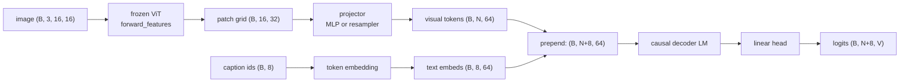

# A8 - Vision-language model (LLaVA-style)

A vision-language model (VLM) connects a frozen image encoder to a language model so the language
model can read an image and predict text about it. The vision transformer (ViT) produces one
feature vector per image patch; a small projector maps those vectors into the language model's
embedding space; the projected visual tokens are prepended to the caption's text embeddings; and a
decoder-only language model runs over the combined sequence and predicts the caption
autoregressively. The image conditions every text prediction because the visual tokens sit in the
model's context.

Build the LLaVA-style bridge on a toy of 16x16 images paired with three-token captions. Implement
the MLP projector, a single-layer Perceiver-style resampler as the contrasting connector, the
prepend operation, and the masked next-token loss. The frozen ViT, the token embedding, the
decoder-only language model, the output head, the two-stage freeze logic, greedy generation, and the
AnyRes shape exercise are provided. Everything runs on CPU in seconds.

Required reading before starting:
- Liu et al. 2023, "Visual Instruction Tuning" (LLaVA),
  [arXiv:2304.08485](https://arxiv.org/abs/2304.08485).
- Liu et al. 2023, "Improved Baselines with Visual Instruction Tuning" (LLaVA-1.5),
  [arXiv:2310.03744](https://arxiv.org/abs/2310.03744). The 2-layer MLP projector and its ablation.

## Lecture notes

### What a VLM has to solve

A language model reads a sequence of token embeddings and predicts the next token. An image is a
grid of pixels, not a sequence of token embeddings. A VLM has to put the image into a form the
language model can read, and do it so that text predictions depend on image content. The design
question is the visual-token interface: how the image becomes tokens, how many tokens it becomes,
where those tokens enter the language model, and how the model knows their positions.

The approach here is LLaVA (Liu et al. 2023). It is the simplest interface that works: run a frozen
image encoder, project its patch features into the language model's embedding dimension with a small
trained network, prepend the projected vectors to the text token embeddings, and leave the language
model otherwise unchanged. The image patches become ordinary positions in the context window.
Nothing about the transformer changes; the projector is the only new piece, and at the start it is
the only piece that trains.



### The visual-token interface

The frozen ViT runs through its feature path, which stops before the pooling and the classification
head and returns the per-patch grid: for a 16x16 image at patch size 4, a 4x4 grid of 16 patches,
each a 32-dimensional feature vector, so $(B, 16, 32)$. The CLS and register tokens are dropped.
These features live in the ViT's feature space, not the language model's embedding space, and the
language model has never seen them.

The projector closes that gap. It maps each patch feature to the same dimension the token embedding
produces, so a visual token and a text token are interchangeable as far as the transformer is
concerned. LLaVA's original projector was a single linear layer; LLaVA-1.5 replaced it with a
2-layer MLP, $\text{Linear} \to \text{GELU} \to \text{Linear}$, and a controlled ablation in that
paper showed the MLP improves the alignment over the single linear layer. The MLP is applied per
patch and does not mix patches, so it produces exactly one visual token per patch.

The prepend operation concatenates the visual tokens before the text embeddings along the sequence
axis, visual first. The combined sequence is
$[\text{visual}_0, \dots, \text{visual}_{N-1}, \text{text}_0, \dots, \text{text}_{L-1}]$, and a
single causal mask of length $N+L$ runs over all of it. The text positions can attend back to every
visual position, so each predicted caption token sees the whole image.

The three degrees of freedom in this interface are how many tokens enter, where they are injected,
and how positions are communicated. The rest of the lecture notes vary these one at a time.

### Connector families

The projector is one of three families for turning patch features into tokens the language model
reads.

The MLP-projector family keeps one token per patch (or per merged group of patches) and lets all of
them enter the context. LLaVA and LLaVA-1.5 are the canonical examples; Qwen2.5-VL (Bai et al. 2025,
[arXiv:2502.13923](https://arxiv.org/abs/2502.13923)) uses an MLP patch-merger that concatenates a
small block of neighboring patches before the projection, which cuts the token count by the block
size while staying in this family. The token count scales with image resolution, so a
higher-resolution image costs more context. This is the family the MLP projector here belongs to.

The resampler family compresses a variable number of patches to a fixed number of output tokens with
cross-attention. A fixed set of $Q$ learned query vectors attends over the patch features and
returns one output token per query, regardless of how many patches came in. The Perceiver Resampler
of Flamingo (Alayrac et al. 2022, [arXiv:2204.14198](https://arxiv.org/abs/2204.14198)) and the
Q-Former of BLIP-2 (Li et al. 2023, [arXiv:2301.12597](https://arxiv.org/abs/2301.12597)) are the
canonical examples; the original Qwen-VL (Bai et al. 2023,
[arXiv:2308.12966](https://arxiv.org/abs/2308.12966)) used a single-layer cross-attention adapter in
this family. The fixed token budget makes the context cost independent of image resolution, at the
price of throwing away detail when the image has more patches than the budget can carry. Note the
version split: Qwen-VL (2023) is resampler-family, while Qwen2.5-VL (2025) is
MLP-patch-merger-family.

The resampler built here is a single-layer miniature of this family. $Q$ learned query vectors
cross-attend once over the projected patch features:

$$\text{out} = \text{LayerNorm}\big(\text{queries} + \text{Attn}(\text{queries},\ kv=\text{feats}_{\text{proj}})\big).$$

One cross-attention, one residual, one norm. The output length is $Q$ for any patch count $N$. A
real Perceiver Resampler or Q-Former stacks several blocks, each adding query self-attention (the
queries attend to each other) and a feed-forward network; this miniature keeps the one mechanism
that matters, the cross-attention pooling, so the gradient check has a single unambiguous target.
The resampler still prepends its $Q$ tokens the same way the MLP prepends its patch tokens.

The third family, early fusion, drops the separate encoder entirely. Fuyu feeds raw image patches
straight into one transformer; Chameleon (Team 2024,
[arXiv:2405.09818](https://arxiv.org/abs/2405.09818)) and Llama 4 quantize the image into discrete
visual tokens and train a single transformer over text and image tokens jointly. There is no
projector because there is no separate feature space to bridge. This assignment does not implement
early fusion; it is the reference point for what the encoder-plus-projector design buys (a frozen,
separately-trained vision backbone) and costs (two representation spaces the projector has to align).

### Where the visual tokens enter

Prepending is one of two injection points. LLaVA prepends the visual tokens into the context and
changes nothing else about the language model, which is the approach here. Flamingo instead leaves
the text sequence alone and inserts new gated cross-attention layers between the language model's
existing layers; those layers attend from the text to the resampled visual tokens, and a learned
gate starts at zero so the pretrained language model is undisturbed at initialization. The injection
point is different: LLaVA puts visual tokens in the sequence, Flamingo puts a cross-attention pathway
in the depth.

The resampler variant here does not change the injection point. It changes how many visual tokens
there are and how they are pooled (from $N$ patches to $Q$ queries), then prepends the $Q$ tokens
exactly as the MLP path prepends its patch tokens. A resampler is not the same thing as Flamingo's
gated cross-attention injection, even though both use cross-attention somewhere; the resampler's
cross-attention is in the connector that builds the tokens, not in the language model that consumes
them.

### How positions are communicated

The decoder-only language model applies rotary position embedding (RoPE) inside attention, which
encodes each token's position by its index in the sequence. No separate position information is added
for the visual tokens. They get positions $0, \dots, N-1$ and the text follows at
$N, \dots, N+L-1$, just by their order in the concatenated sequence. Generation starts from an empty
text side and prepends the same visual tokens, so the visual tokens occupy the same positions at
training and at inference and the two agree.

Real VLMs sometimes do more here. Qwen2.5-VL uses a 2D RoPE that gives each patch a row and column
position so the model knows the spatial layout of the grid, and some systems add explicit
patch-position IDs. Plain sequence-order positions do not encode the 2D patch layout; a small toy
recovers what it needs without it.

### The caption objective and the loss shift

The training task is image captioning: predict the caption tokens from the image. Captioning is a
stand-in for visual question answering; a VQA prompt would prepend a fixed question prefix before the
answer tokens, but the mechanism of conditioning text on prepended visual tokens is identical, and
captioning avoids inventing a question vocabulary.

The loss is next-token cross-entropy supervised only on the text positions. Teacher forcing predicts
position $i+1$ from positions $\le i$. Over the combined sequence
$[\text{visual}_0, \dots, \text{visual}_{N-1}, \text{text}_0, \dots, \text{text}_{L-1}]$, the
supervised targets are the text tokens. The last visual position (index $N-1$) predicts
$\text{text}_0$, the first caption token; $\text{text}_k$ predicts $\text{text}_{k+1}$; pad targets
are ignored. There is no beginning-of-sequence token and no separator, because generation also starts
from an empty text side, so training and inference use the same shift.

The label tensor is built to length $N+L$ in three steps. Fill the whole $(B, N+L)$ tensor with the
ignore index $-100$. Write the true caption tokens into the text slice. Re-mask the pads within that
slice, so padding is not supervised. Then shift and reduce:

$$\mathcal{L} = \text{cross-entropy}\big(\text{logits}[:, :-1],\ \text{labels}[:, 1:],\ \text{ignore-index} = -100\big).$$

The visual positions stay at $-100$ throughout, so changing a visual-span logit does not change the
loss. Re-masking the pads has to be done within the text slice and not by indexing the full label
tensor with a length-$L$ mask, because the label tensor has length $N+L$ and the boolean mask would
not line up.

### The two-stage freeze curriculum

LLaVA trains in two stages. Stage 1 freezes the language model and trains only the projector, to
align the visual features with the language model's embedding space. Stage 2 unfreezes the language
model and trains it together with the projector, for instruction following. The stage toggle
implements this through `requires_grad`: stage 1 trains the projector, the token embedding, and the
output head with the ViT and the decoder frozen; stage 2 also unfreezes the decoder; the ViT stays
frozen throughout.

Two real-LLaVA details differ at course scale. Real LLaVA freezes the language model's token
embedding and output head along with the rest of the language model in stage 1, and moves only the
projector. Here the language model is randomly initialized (the course has no large text corpus to
pretrain it on), so there is no fixed embedding geometry for the projector to map visual features
into; the embedding and head must train in stage 1 so the embedding settles into some geometry
before alignment means anything. Freezing in stage 1 here freezes a random decoder while the
projector and the head learn to drive it. The lesson is the visual-token interface and the
freeze-curriculum mechanics, not exploiting a language prior the course does not have.

### Grounding

The grounding question is whether the visual path actually carries the caption. The probe is to
compare the caption loss with the true visual tokens against the loss with the visual tokens zeroed.
A model that ignored the image would do equally well both ways; a grounded model does much worse when
the visual tokens are removed. One subtlety keeps such a probe valid: in an autoregressive caption,
a later token predicted after an earlier one could in principle be read off the earlier text token
rather than the image, so the probe has to pin a batch where the later token genuinely needs the
image to disambiguate. The first caption token is always image-grounded, because it is predicted from
the last visual position with no prior text.

### AnyRes tiling

A fixed-resolution ViT processes one image size. To read a higher-resolution image, LLaVA-NeXT's
AnyRes splits it into a grid of sub-crops, encodes each crop through the same ViT, and concatenates
the per-crop patch grids, plus a low-resolution overview of the whole image so the model sees both
global layout and local detail. The token count is $\text{grid}^2 \times \text{patches-per-crop}$,
plus the overview's patches-per-crop when an overview is included. For the LLaVA-NeXT 336px example
at patch 14, one crop is 576 tokens, a 2x2 grid is 4 crops (2304 tokens), and the 336px overview adds
another 576 tokens for a total of 2880. The overview is a full image at 576 tokens, not a single
token.

The cost of AnyRes is that the visual token count grows with the crop count, which is why
token-compression methods exist as a response: InternVL2's pixel-shuffle (Chen et al. 2023,
[arXiv:2312.14238](https://arxiv.org/abs/2312.14238)) trades spatial resolution for channel depth to
cut tokens, and Qwen2.5-VL's patch-merger concatenates neighboring patches before projection.

### Where this leads

The vision-language-action capstone is a VLM policy. The action the robot takes is encoded as a
token, appended to the sequence, and predicted autoregressively exactly like a caption token. The
visual-token interface built here (frozen encoder into projector into prepended tokens into a causal
decoder) is reused without change; only the output vocabulary changes from words to actions.

Two trends in real VLMs the course does not follow are worth naming. SigLIP (Zhai et al. 2023,
[arXiv:2303.15343](https://arxiv.org/abs/2303.15343)) replaced CLIP as the default vision backbone in
many 2024-era VLMs, trading the softmax contrastive loss for a sigmoid one. And from 2024 onward many
systems unfreeze the ViT and train it with the language model rather than keeping it frozen;
Cambrian-1 (Tong et al. 2024, [arXiv:2406.16860](https://arxiv.org/abs/2406.16860)) studies how the
vision side affects the result. This assignment keeps the ViT frozen, the simpler LLaVA recipe.

## The assignment

Fill these holes, in order. Each is one `NotImplementedError` with a matching test; the docstring in each file gives the signature, shapes, and constraints.

1. [`MLPProjector.forward()`](projector.py) in `projector.py`
2. [`PerceiverResampler.forward()`](resampler.py) in `resampler.py`
3. [`prepend_visual()`](vlm.py) in `vlm.py`
4. [`vlm_loss()`](vlm.py) in `vlm.py`

### Running and validating

Activate the environment (`conda activate nanovision`), then:

```
make test     A=a08_vlm   # run the tests against the top-level files (the ones with holes)
make verify   A=a08_vlm   # run the same tests against the reference solution/
make viz      A=a08_vlm   # render the figures from the reference solution
make viz-mine A=a08_vlm   # render the figures from your own code (once the holes are filled)
```

`make test` is the command to run while working. It runs the suite in
`assignments/a08_vlm/tests/` against the top-level files and goes from red (the holes raise
`NotImplementedError`) to green as they are filled. `make verify` runs the identical suite against
the reference in `solution/` by setting `NANOVISION_IMPL=solution`, so it is green from the start and
shows the target. The goal is to bring `make test` to the same green as `make verify`.

The suite checks shapes, a float64 gradcheck of the connectors and the loss, that the resampler
returns $Q$ tokens for both 16 and 9 input patches, that the prepend leaves the loss unchanged when
the visual-span logits are perturbed (the visual positions are never supervised), the AnyRes token
count, the two-stage `requires_grad` toggling, a short caption overfit, the grounding ablation, and
that no `transformers`, `timm`, or bare `vit`/`transformer`/`attention` module is imported.

`make viz` renders from the reference solution, so it works on a fresh checkout before any holes are
filled. `make viz-mine` runs the same script against the top-level code, which needs the holes filled
(it trains a model with them). Both write PNGs to `out/` using matplotlib's headless Agg backend, so
they work over SSH, in WSL, and in CI with no display, and the figures open inline in VSCode. Add
`SHOW=1` (for example `make viz-mine A=a08_vlm SHOW=1`) to also open interactive windows when a
display is available. The figures are `captions.png` (generated captions beside their images) and
`grounding_ablation.png` (the caption loss with and without the visual tokens).

What you should see when you run this. The toy caption for an image is
$[\text{class}, \text{attribute}, \text{EOS}, \text{pad}, \dots]$, where the class token is set by
the blob's color channel and the attribute token by the blob's position, both functions of the image
(`nanovision.data.toy.image_text_batch`). A model that ignored the visual tokens could not predict
either, which is what makes the grounding ablation a valid probe. On the toy MLP connector at 300
steps the caption loss reaches about $7\times10^{-4}$, slightly below the single-layer resampler's
$9\times10^{-4}$, the same direction as the LLaVA-1.5 finding that the MLP projector is a strong
baseline. The two stages are reported separately (seed 0, 300 steps each): stage 1 reaches a caption
loss around 0.002 and stage 2 about $1\times10^{-5}$. Stage 1 already fits well here because the
trainable embedding and head give the random decoder enough capacity on four examples; do not read
the stage-1 number as evidence that projector-only training produces good captions in general. For
grounding (seed 0, 300 steps), the full-model caption loss is about $7\times10^{-4}$ and the
visual-tokens-zeroed loss about $1.8$, a ratio near 2500; re-initializing the projector to random
weights gives a similar jump. The test pins a batch where at least two rows share a class but differ
in attribute, so the attribute genuinely needs the image; per position, the class-position loss
jumps from about $0.0009$ to about $3.0$ and the attribute-position loss from about $0.0007$ to about
$2.4$ when the visual tokens are zeroed. The class-position gap is the grounding signal that holds
regardless of the seed. These are toy artifacts; they confirm the interface conditions text on the
image, and say nothing about caption quality at scale.

## Further reading

Where this goes next:

- Bai et al. 2025, "Qwen2.5-VL Technical Report",
  [arXiv:2502.13923](https://arxiv.org/abs/2502.13923). The MLP patch-merger connector and 2D RoPE.
- Tong et al. 2024, "Cambrian-1: A Fully Open, Vision-Centric Exploration of Multimodal LLMs",
  [arXiv:2406.16860](https://arxiv.org/abs/2406.16860). Unfreezing the vision side.

Optional deeper reading:

- Alayrac et al. 2022, "Flamingo: a Visual Language Model for Few-Shot Learning",
  [arXiv:2204.14198](https://arxiv.org/abs/2204.14198). The Perceiver Resampler and gated
  cross-attention injection.
- Li et al. 2023, "BLIP-2: Bootstrapping Language-Image Pre-training with Frozen Image Encoders and
  Large Language Models", [arXiv:2301.12597](https://arxiv.org/abs/2301.12597). The Q-Former.
- Chen et al. 2023, "InternVL: Scaling up Vision Foundation Models and Aligning for Generic
  Visual-Linguistic Tasks", [arXiv:2312.14238](https://arxiv.org/abs/2312.14238). Pixel-shuffle token
  compression.

Full reference list:

- Liu et al. 2023, LLaVA, [arXiv:2304.08485](https://arxiv.org/abs/2304.08485).
- Liu et al. 2023, LLaVA-1.5, [arXiv:2310.03744](https://arxiv.org/abs/2310.03744).
- Alayrac et al. 2022, Flamingo, [arXiv:2204.14198](https://arxiv.org/abs/2204.14198).
- Li et al. 2023, BLIP-2, [arXiv:2301.12597](https://arxiv.org/abs/2301.12597).
- Bai et al. 2023, Qwen-VL, [arXiv:2308.12966](https://arxiv.org/abs/2308.12966).
- Bai et al. 2025, Qwen2.5-VL, [arXiv:2502.13923](https://arxiv.org/abs/2502.13923).
- Team 2024, Chameleon, [arXiv:2405.09818](https://arxiv.org/abs/2405.09818).
- Chen et al. 2023, InternVL, [arXiv:2312.14238](https://arxiv.org/abs/2312.14238).
- Zhai et al. 2023, SigLIP, [arXiv:2303.15343](https://arxiv.org/abs/2303.15343).
- Tong et al. 2024, Cambrian-1, [arXiv:2406.16860](https://arxiv.org/abs/2406.16860).
