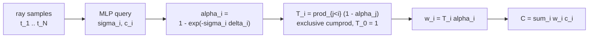

# A9 - NeRF and the volume rendering integral

A neural radiance field represents a scene as a function: an MLP that maps a 3D point and a
viewing direction to a volume density and an emitted color. To render a pixel, march a ray
through the field, query the MLP at samples along the ray, and composite the per-sample colors
weighted by how much light each sample contributes. The whole renderer is differentiable, so
the only supervision needed is the photometric error between rendered and observed pixels.

This assignment builds the core of that renderer on a small synthetic scene: the Fourier
positional encoding that fixes the MLP's spectral bias, the discretized volume renderer that
turns per-sample densities and colors into a pixel color, and ray generation from camera
intrinsics and extrinsics. The radiance-field MLP and the toy scene are provided. The scene is a
sphere with a high-frequency striped albedo, imaged from a ring of cameras; the graded tests use
a small 16x16 capture so they run on CPU without a GPU (most finish in seconds, though the
float64 gradient check is slower, a few minutes), and the spectral-bias visualization uses a
denser, higher-resolution capture so the encoding effect is legible. Its ground-truth pixels come
from a closed-form integral, not from the renderer being built here.

NeRF is the vehicle for the volume rendering integral, not a method to deploy at the end of the
course. The reason to build it is the integral, its discretization, and front-to-back alpha
compositing. The same compositing reappears in 3D Gaussian splatting and in occupancy /
neural-SDF rendering, and the ray-marched renderer carries over to those settings almost
unchanged.

Required reading before starting:
- Mildenhall et al. 2020, "NeRF: Representing Scenes as Neural Radiance Fields for View
  Synthesis", [arXiv:2003.08934](https://arxiv.org/abs/2003.08934).
- Tancik et al. 2020, "Fourier Features Let Networks Learn High Frequency Functions in Low
  Dimensional Domains", [arXiv:2006.10739](https://arxiv.org/abs/2006.10739).
- Tagliasacchi and Mildenhall 2022, "Volume Rendering Digest (for NeRF)",
  [arXiv:2209.02417](https://arxiv.org/abs/2209.02417).

## Lecture notes

### Why NeRF mattered

Before NeRF, novel-view synthesis went through explicit geometry: estimate a mesh or a point
cloud from images, then re-render it. That pipeline loses thin structures, semi-transparent
surfaces, and view-dependent shading, and its quality is capped by the reconstructed mesh.
Mildenhall et al. (2020) replaced the explicit model with a continuous function: an MLP
$F_\theta$ that maps a 3D world position $\mathbf{x}$ and a viewing direction $\mathbf{d}$ to a
volume density $\sigma$ and an emitted color $\mathbf{c}$. To render a pixel, march a camera
ray through the field, query the MLP at samples along the ray, and composite. The renderer is
differentiable, so the only supervision is the photometric error between rendered and observed
pixels: no 3D ground truth, no mesh, just posed images.

Two design choices made it work. Density depends only on position while color also depends on
direction, which keeps geometry consistent across views while still modeling specular
highlights. And input coordinates pass through a Fourier feature map before the MLP, without
which the renders come out blurry. Both are below.

### The volume rendering integral

A ray is $\mathbf{r}(t) = \mathbf{o} + t\mathbf{d}$ from the camera center $\mathbf{o}$ along
direction $\mathbf{d}$. Treat the scene as a cloud of light-emitting, light-absorbing particles
with density $\sigma(\mathbf{x}) \ge 0$ (probability per unit length that the ray is absorbed)
and emitted color $\mathbf{c}(\mathbf{x}, \mathbf{d})$. The color of the ray is the
emission-absorption integral

$$C(\mathbf{r}) = \int_{t_n}^{t_f} T(t)\,\sigma(\mathbf{r}(t))\,\mathbf{c}(\mathbf{r}(t), \mathbf{d})\,dt,
\qquad T(t) = \exp\!\Big(-\int_{t_n}^{t} \sigma(\mathbf{r}(s))\,ds\Big).$$

$T(t)$ is the transmittance, the fraction of light from depth $t$ that reaches the camera
without being absorbed first. It is Beer-Lambert's law, the exponential attenuation of light
through an absorbing medium. The integrand weights each point's emission $\sigma\mathbf{c}$ by
how much of it survives the trip back to the camera, so a near-opaque surface dominates and
everything behind it is suppressed.

This integral has no closed form for a general field, so it is estimated on $N$ samples
$t_1 < \dots < t_N$ along the ray with segment lengths $\delta_i = t_{i+1} - t_i$. Assume
$\sigma$ and $\mathbf{c}$ are piecewise constant on each segment. Over a segment of constant
density $\sigma_i$ and length $\delta_i$, the transmittance drops by exactly
$\exp(-\sigma_i \delta_i)$, so the probability the ray is absorbed within that segment is

$$\alpha_i = 1 - \exp(-\sigma_i \delta_i).$$

This $\alpha_i$ is the exact integral over a segment of constant $\sigma$. The only
approximation in the whole scheme is the piecewise-constant assumption on $\sigma$ and
$\mathbf{c}$, not the per-segment formula. The transmittance up to sample $i$ is the product of
survival probabilities over all earlier segments, an exclusive cumulative product:

$$T_i = \prod_{j < i} (1 - \alpha_j), \qquad T_0 = 1.$$

The leading $T_0 = 1$ means the first sample is not attenuated by anything. The rendered color
is the weighted sum

$$\hat{C}(\mathbf{r}) = \sum_{i=1}^{N} w_i\,\mathbf{c}_i, \qquad w_i = T_i\,\alpha_i.$$

The weight $w_i = T_i \alpha_i$ is the probability the ray reaches sample $i$ (factor $T_i$) and
is absorbed there (factor $\alpha_i$). The weights are non-negative and sum to at most 1, with
the leftover mass $1 - \sum_i w_i$ the probability the ray passes through everything and hits
the background. They satisfy the telescoping identity

$$\sum_{i=1}^{N} w_i = 1 - \prod_{i=1}^{N} (1 - \alpha_i),$$

which pins the entire transmittance structure in one equation.

This is Porter-Duff "over" compositing applied front to back. In image compositing, placing a
layer of opacity $\alpha$ over a background $B$ gives $\alpha\,\text{color} + (1-\alpha)B$;
chaining that over $N$ ordered layers produces exactly $\sum_i T_i \alpha_i \mathbf{c}_i$ with
$T_i = \prod_{j<i}(1-\alpha_j)$.



For derivation details and edge cases, see the Volume Rendering Digest (Tagliasacchi and
Mildenhall 2022).

### Spectral bias and the Fourier encoding

A plain coordinate MLP, fed $(\mathbf{x}, \mathbf{d})$ directly, renders the scene blurry. The
reason is spectral bias: an MLP under gradient descent fits low-frequency components of the
target function first, and high-frequency detail (sharp edges, fine texture) only much later or
not at all. The neural tangent kernel makes this precise. The NTK of a standard MLP on raw
coordinates is close to a low-pass kernel, so the eigenfunctions it learns quickly are the
smooth ones, and the rapid stripes of the sphere's textured surface sit in the part of the
spectrum the network reaches slowly (or never).

The fix is to map each input coordinate through a bank of sinusoids before the MLP. For a scalar
coordinate $p$,

$$\gamma(p) = \big(\sin(2^0 \pi p),\, \cos(2^0 \pi p),\, \dots,\, \sin(2^{L-1} \pi p),\, \cos(2^{L-1} \pi p)\big),$$

applied to each input coordinate, optionally with the raw coordinate concatenated. The geometric
frequencies $2^k$ spread the input across a band, which turns the MLP's effective kernel into a
stationary, tunable-bandwidth kernel: the highest band sets how fine a detail the network can
represent. Tancik et al. (2020) showed this through the NTK and proved the random-Fourier-feature
version; NeRF uses the deterministic $2^k$ schedule.

The frequency schedule is only valid when inputs are roughly in $[-1, 1]$. The original NeRF
divides sample positions by the scene's half-extent before encoding and feeds unit-length
directions. An unnormalized position of magnitude around 4 hit with the top $2^{L-1}\pi$ band
aliases: adjacent points map to wildly different phases and the encoding stops being smooth in
position. The original NeRF uses $L = 10$ for positions and $L = 4$ for directions on a
metric-scale scene; at low resolution a smaller $L$ suffices.

The encoding is a fixed map with no learnable parameters. With the encoding the network resolves
the high-frequency surface texture; without it the same network blurs the stripes into a smooth
gray wash, which is spectral bias showing up as blur. The textured surface is what makes this
legible: a smooth sphere has no high-frequency content for the encoding to recover, so the
ablation would show nothing (or, with too few views, the extra capacity overfitting). This is
why the toy turns on a high-frequency albedo rather than imaging a plain solid sphere.

### Ray generation

Generating rays is applying the pinhole camera model, prerequisite geometry from the
camera-geometry module, not new content. A pixel $(u, v)$ back-projects to a camera-frame
direction. With intrinsic matrix $K$ (focal lengths $f_x, f_y$, principal point $c_x, c_y$),

$$\mathbf{d}_c = \big((u - c_x)/f_x,\; (v - c_y)/f_y,\; 1\big).$$

The camera-to-world matrix $c2w$ rotates that into the world frame,
$\mathbf{d}_w = R_{c2w}\,\mathbf{d}_c$, and the ray origin is the camera center, the translation
column of $c2w$. The direction is then normalized to unit length.

Normalizing $\mathbf{d}_w$ makes the depth value $z$ a Euclidean distance along the ray, so the
near and far bounds are distances, not $z$-depths, and the segment lengths $\delta_i$ need no
$\lVert\mathbf{d}\rVert$ correction. The same unit direction is the $\mathbf{d}$ fed to the
MLP's color branch, so it must be the normalized one. Depth samples are stratified: split the
$[\text{near}, \text{far}]$ interval into $N$ uniform bins and draw one sample per bin (jittered
inside the bin during training), so training sees a continuous range of depths instead of a
fixed grid. The final segment length is set to a large constant so the last sample absorbs
whatever transmittance remains, the original NeRF convention.

A note on convention. The original NeRF uses the OpenGL camera convention, where the camera
looks down $-z$, because its Blender synthetic scenes ship with OpenGL $c2w$ matrices. This
course uses the OpenCV convention throughout (camera looks down $+z$), so the ray directions and
the toy-scene poses both follow $+z$ forward. Getting this wrong silently flips the scene front
to back.

### The radiance-field MLP

The NeRF factorization is density from position alone, color from position and direction. The
encoded position runs through a trunk of fully connected layers with one skip connection that
re-injects the encoded position at the middle layer, so the deeper layers still have direct
access to the raw geometry. The trunk's final features go two ways: a linear head plus softplus
gives density $\sigma \ge 0$, and the same features concatenated with the encoded direction give
the color through a small head plus sigmoid, so RGB lands in $[0, 1]$. Density ignoring
direction keeps geometry view-consistent; color depending on direction models specular
appearance.

### Hierarchical sampling

The original NeRF samples each ray twice. A coarse pass with uniform stratified samples produces
the weights $w_i$, which form a piecewise-constant distribution along the ray concentrated
wherever the density is high. A fine pass then draws extra samples from that distribution by
inverse-CDF sampling, so compute concentrates near surfaces instead of being wasted in empty
space. A solid object renders well enough with a few dozen uniform samples per ray that the fine
pass is not needed at low resolution. Modern NeRFs mostly drop the separate coarse network:
mip-NeRF 360 and Nerfacto use a single proposal MLP supervised to predict the weight
distribution.

### Where this goes next

3D Gaussian splatting reuses the exact compositing equation,
$\hat{C} = \sum_i T_i \alpha_i \mathbf{c}_i$ with $T_i = \prod_{j<i}(1-\alpha_j)$, but the
$\alpha$ comes from a projected 2D Gaussian times a learned opacity, not from
$1 - \exp(-\sigma\delta)$, and the ordering comes from depth-sorting the Gaussians, not from
marching $t$ along a ray. Gaussian splatting does not do per-sample Beer-Lambert; only the
front-to-back "over" compositing is shared.

Occupancy and neural-SDF rendering is the closer carry-over: keep the ray-marched renderer
exactly, and swap the density. NeuS (Wang et al. 2021,
[arXiv:2106.10689](https://arxiv.org/abs/2106.10689)) derives $\sigma$ from a signed distance
function so the zero-level set is a clean surface, while rendering through the same
$T_i \alpha_i$ quadrature.

The NeRF line continued along two axes. Speed: Instant-NGP (Müller et al. 2022,
[arXiv:2201.05989](https://arxiv.org/abs/2201.05989)) replaces the Fourier encoding with a
learned multiresolution hash grid and cuts training from hours to seconds. Quality: mip-NeRF
(Barron et al. 2021, [arXiv:2103.13415](https://arxiv.org/abs/2103.13415)) casts cones instead
of rays and integrates the positional encoding over each cone frustum to anti-alias across
scales, and Zip-NeRF (Barron et al. 2023,
[arXiv:2304.06706](https://arxiv.org/abs/2304.06706)) combines that anti-aliasing with the
hash-grid speed. A separate line drops per-scene optimization entirely: feed-forward methods
(DUSt3R/MASt3R, pixelSplat) predict geometry or splats from a few images in one pass. By 2026,
3D Gaussian splatting (Kerbl et al. 2023,
[arXiv:2308.04079](https://arxiv.org/abs/2308.04079)) renders at similar quality roughly 100x
faster than NeRF, because NeRF spends dozens to a couple hundred MLP queries per pixel marching
a ray.

## The assignment

Implement the Fourier positional encoding, the discretized volume renderer, and pinhole ray
generation. The radiance-field MLP, the config, the toy scene, and the visualization script are
provided. Each file's docstrings give the exact signatures, shapes, and sampling conventions (the
near-to-far ordering of samples along a ray and the camera-to-world axis convention). Read those
in the files; this section maps each file to the concept above.

### Files to modify

`encoding.py` is the Fourier encoding. Implement `PositionalEncoding.forward`, the $\gamma(p)$
feature map from the spectral-bias section, with the `include_input` option and no learnable
parameters. The frequency bands $2^k$ are a registered buffer.

`render.py` is the volume renderer. Implement `volume_render`: the per-segment opacity
$\alpha_i = 1 - \exp(-\sigma_i\delta_i)$, the exclusive transmittance
$T_i = \prod_{j<i}(1-\alpha_j)$ with $T_0 = 1$, the weights $w_i = T_i\alpha_i$, the weighted
color $\hat{C} = \sum_i w_i \mathbf{c}_i$, and the optional white background that composites the
leftover transmittance onto white. The MLP has already applied softplus to $\sigma$, so this
function receives raw non-negative densities and must not re-activate them. Build the exclusive
cumulative product as a leading column of ones (for $T_0$) followed by the running product of
all but the last $(1-\alpha)$. There is no epsilon inside the cumprod, which would break the
exact-equality tests, and no inclusive cumprod followed by a shift, which double-counts.

`rays.py` is ray generation. Implement `stratified_sample_rays` (pinhole ray directions rotated
to world and unit-normalized, with stratified depth samples), `sample_along_rays` (the points
$\mathbf{o} + z\mathbf{d}$ on each ray), and `deltas_from_z` (consecutive-difference segment
lengths with the large final delta).

`render.py` and `rays.py` are shared files: the downstream Gaussian-splatting and
occupancy/neural-SDF assignments import their symbols through the `nanovision.volume` shim. The
MLP (`model.py`), `config.py`, the toy scene
(`nanovision.data.toy.nerf_synthetic_scene`), and `viz.py` are provided.

### Running and validating

Activate the environment (`conda activate nanovision`), then:

```
make test     A=a09_nerf   # run the tests against your top-level files (red until the holes are filled)
make verify   A=a09_nerf   # run the same tests against the reference solution/ (green from the start)
make viz      A=a09_nerf   # render the figures from the reference solution
make viz-mine A=a09_nerf   # render the figures from your own code (once the holes are filled)
```

`make test` is the command to run while working. It runs the suite in `tests/` against the
top-level files (the ones with the holes) and goes from red (the holes raise
`NotImplementedError`) to green as you fill them in. `make verify` runs the identical suite
against the reference in `solution/`: it sets `NANOVISION_IMPL=solution`, so the tests import the
reference implementation instead of the top-level files. `make verify` is green from the start,
so it shows the target and confirms the tests and the environment work before anything changes.
The goal is to bring `make test` to the same green as `make verify`.

The suite checks the encoding shape and per-band sin/cos against the closed form, with a float64
gradcheck; the renderer's exact properties (opaque sample returns its color, all-zero density
gives the background and zero weights, weights non-negative and summing to at most 1, the first
weight equals $\alpha_0$ exactly, a large density saturates the weight to 1, and the telescoping
$\sum_i w_i = 1 - \prod_i(1-\alpha_i)$ exactly), plus a float64 gradcheck of `volume_render`; the
ray geometry (center pixel is $+z$ for identity $c2w$, corner-ray tangent, unit directions,
sorted depths in range, sample-point shape and on-ray, the large final delta); the MLP forward
(density $\ge 0$, RGB in $[0,1]$); an end-to-end overfit of 256 toy rays against the closed-form
ground truth; and a static scan blocking prebuilt NeRF libraries. The forbidden-imports scan
passes with the holes in place.

`make viz` renders from the reference solution, so it works on a fresh checkout before any holes
are filled and shows the target figure. `make viz-mine` runs the same script against your
top-level code, which is the way to eyeball whether a finished implementation behaves (does the
sphere come out sharp?); it needs the holes filled, since it trains a model with them. Both write
`heldout_and_ablation.png` to `out/` rather than opening a window: the plots use matplotlib's
headless Agg backend, so the commands behave the same over SSH, in WSL, and in CI with no display,
and the figure is a reproducible artifact to open directly or view inline in VSCode. The figure
shows the closed-form ground truth of a held-out view next to two short training runs, one with
the Fourier encoding and one on raw coordinates ($L = 0$). Add `SHOW=1` (for example
`make viz-mine A=a09_nerf SHOW=1`) to also open the figure in an interactive window when a
display is available.

What you should see when you run this. The overfit test drives the ray-batch MSE from its start
(around 0.1) down well under $5\times10^{-3}$. Because the ground truth is the closed-form
ray-sphere chord and not the output of `volume_render`, a passing run shows the discretized
quadrature converging to the analytic Beer-Lambert integral, not to its own renderer. In the
viz, the encoded model resolves the striped surface sharply (around 27 dB held-out PSNR in the
provided run) while the raw-coordinate model blurs the stripes into a smooth wash (around 17 dB),
a roughly 10 dB spectral-bias gap made visible - the encoded result matching the literature
(Tancik et al. 2020; the NeRF paper). These are toy artifacts on a small synthetic scene. They
confirm the mechanism runs end to end and reproduce the qualitative effect; they say nothing
about quality at scale, where the full NeRF result (the Blender Lego scene at 800x800, around 20k
training steps, roughly 22 dB PSNR) wants a GPU and minutes to hours.

## References

- Mildenhall et al. 2020, NeRF, [arXiv:2003.08934](https://arxiv.org/abs/2003.08934).
- Tancik et al. 2020, Fourier features, [arXiv:2006.10739](https://arxiv.org/abs/2006.10739).
- Tagliasacchi and Mildenhall 2022, Volume Rendering Digest,
  [arXiv:2209.02417](https://arxiv.org/abs/2209.02417).
- Barron et al. 2021, Mip-NeRF, [arXiv:2103.13415](https://arxiv.org/abs/2103.13415).
- Müller et al. 2022, Instant-NGP, [arXiv:2201.05989](https://arxiv.org/abs/2201.05989).
- Wang et al. 2021, NeuS, [arXiv:2106.10689](https://arxiv.org/abs/2106.10689).
- Barron et al. 2023, Zip-NeRF, [arXiv:2304.06706](https://arxiv.org/abs/2304.06706).
- Kerbl et al. 2023, 3D Gaussian splatting,
  [arXiv:2308.04079](https://arxiv.org/abs/2308.04079).
