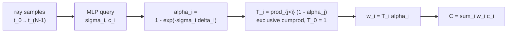
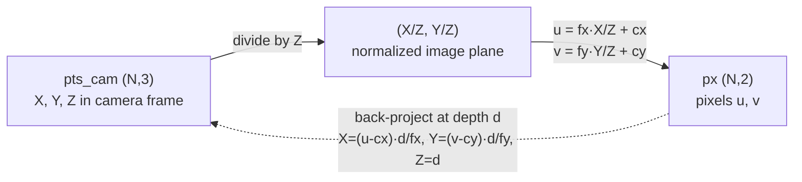

# A9 - NeRF and the volume rendering integral

A neural radiance field stores a scene in the weights of an MLP that maps a 3D point and a
viewing direction to a volume density and an emitted color. To render a pixel, march a ray
through the field, query the MLP at samples along the ray, and composite the per-sample colors
weighted by how much light each sample contributes. The whole renderer is differentiable, so
the only supervision needed is the photometric error between rendered and observed pixels.

This assignment builds the core of that renderer on a small synthetic scene: the Fourier
positional encoding, the discretized volume renderer that turns per-sample densities and colors
into a pixel color, and ray generation from camera intrinsics and extrinsics. The radiance-field
MLP and the toy scene are provided. The scene is a sphere whose surface albedo (its own
reflectance, before any lighting is applied) carries a fine stripe pattern, imaged from a ring of
cameras. The graded tests use a small 16x16 capture so they run on CPU without a GPU (most finish
in seconds, though the float64 gradient check is slower, a few minutes), and the spectral-bias
visualization uses a denser, higher-resolution capture so the encoding effect is legible. The
ground-truth pixels come from a closed-form integral, not from the renderer being built here.

NeRF is the vehicle for the volume rendering integral, not a method to deploy at the end of the
course. It is built for the integral, its discretization, and front-to-back alpha compositing.
The same compositing reappears in 3D Gaussian splatting, in occupancy fields (which store a
per-point probability that space is filled), and in neural signed-distance-function rendering,
and the ray-marched renderer carries over to those settings almost unchanged.

Required reading before starting:
- Mildenhall et al. 2020, "NeRF: Representing Scenes as Neural Radiance Fields for View
  Synthesis", [arXiv:2003.08934](https://arxiv.org/abs/2003.08934).
- Tancik et al. 2020, "Fourier Features Let Networks Learn High Frequency Functions in Low
  Dimensional Domains", [arXiv:2006.10739](https://arxiv.org/abs/2006.10739).
- Tagliasacchi and Mildenhall 2022, "Volume Rendering Digest (for NeRF)",
  [arXiv:2209.02417](https://arxiv.org/abs/2209.02417).

## Lecture notes

### Novel-view synthesis before NeRF

Novel-view synthesis is the task of rendering a scene from camera poses that were never
captured, given a set of images that were. Before NeRF it went through explicit geometry:
estimate a mesh or a point cloud from the images, texture it, then re-render it from the new
pose. That pipeline loses thin structures, semi-transparent surfaces, and view-dependent
shading, and its output quality is capped by the quality of the reconstructed mesh.

Mildenhall et al. (2020) replaced the explicit model with a continuous function: an MLP
$F_\theta$ that maps a 3D world position $\mathbf{x}$ and a viewing direction $\mathbf{d}$ to a
volume density $\sigma$ and an emitted color $\mathbf{c}$. There is no mesh and no point cloud;
the scene is the function, and the function is a few million weights. Two design choices made it
work.

The first is the factorization. Density depends on position alone, while color depends on both
position and direction. Geometry then cannot change as the camera moves, which is what keeps
reconstructions consistent across views, but appearance still can, which is what lets the model
reproduce specular highlights: the mirror-like bright spots that slide across a surface as the
viewpoint moves, unlike diffuse color, which stays put.

The second is the input encoding. Coordinates pass through a bank of sinusoids before reaching
the MLP. Without it the renders come out blurry no matter how long training runs, for reasons
that take a section of their own below.

### The volume rendering integral

A ray is $\mathbf{r}(t) = \mathbf{o} + t\mathbf{d}$ from the camera center $\mathbf{o}$ along
direction $\mathbf{d}$. Treat the scene as a cloud of light-emitting, light-absorbing particles
with density $\sigma(\mathbf{x}) \ge 0$ (probability per unit length that the ray is absorbed)
and emitted color $\mathbf{c}(\mathbf{x}, \mathbf{d})$. The color of the ray is the
emission-absorption integral

$$C(\mathbf{r}) = \int_{t_n}^{t_f} T(t)\,\sigma(\mathbf{r}(t))\,\mathbf{c}(\mathbf{r}(t), \mathbf{d})\,dt,
\qquad T(t) = \exp\!\Big(-\int_{t_n}^{t} \sigma(\mathbf{r}(s))\,ds\Big).$$

$T(t)$ is the transmittance, the fraction of light emitted at depth $t$ that reaches the camera
without being absorbed on the way. It is Beer-Lambert's law, the exponential attenuation of
light through an absorbing medium. The integrand weights each point's emission
$\sigma\mathbf{c}$ by how much of it survives the trip back to the camera, so a near-opaque
surface dominates and everything behind it is suppressed.

This integral has no closed form for a general field, so it has to be estimated numerically.
Before discretizing it, it is worth looking at the operation the discretization lands on,
because that operation is older than NeRF by about forty years and is the reason the result
looks familiar to anyone who has written a compositor.

### Alpha compositing

Image compositing is the problem of stacking partially transparent layers into one picture. Each
layer carries a color $\mathbf{c}$ and an opacity $\alpha \in [0, 1]$ per pixel, where $\alpha=1$
means the layer hides whatever is behind it and $\alpha=0$ means it is invisible. Porter and Duff
(1984) enumerated the ways two such layers can be combined and named the operators. The one that
matters here is "over": placing a foreground layer over a background color $B$ gives

$$\text{fg over bg} = \alpha\,\mathbf{c} + (1 - \alpha)\,B.$$

The layer contributes a fraction $\alpha$ of its own color and lets the remaining fraction
$1-\alpha$ of the background through. There is nothing deep in the formula; it is a linear
interpolation. What makes it useful is what happens when it is chained.

Take $N$ layers ordered from nearest to farthest, layer $0$ in front. Compositing them means
applying "over" repeatedly, each layer over the result of everything behind it:

$$C = \mathbf{c}_0 \text{ over } \big(\mathbf{c}_1 \text{ over } (\cdots \text{ over } B)\big).$$

Expand the nesting and collect the coefficient of each layer. Layer $0$ appears multiplied by
$\alpha_0$. Layer $1$ was scaled by $\alpha_1$ when it was composited, then by $(1-\alpha_0)$
when layer $0$ went over the result. Layer $i$ picks up its own $\alpha_i$ and one factor of
$(1-\alpha_j)$ for every layer $j$ in front of it:

$$C = \sum_{i=0}^{N-1} T_i\,\alpha_i\,\mathbf{c}_i + T_N B, \qquad T_i = \prod_{j<i}(1-\alpha_j),
\qquad T_0 = 1.$$

$T_i$ is the fraction of light from layer $i$ that survives the layers in front of it, and the
empty product $T_0 = 1$ says nothing occludes the frontmost layer. The trailing $T_N B$ is the
background showing through everything.

Read probabilistically, $\alpha_i$ is the chance a photon is stopped at layer $i$, $T_i$ is the
chance it got that far, and $T_i \alpha_i$ is the chance it is stopped exactly there. That
reading is why the same expression falls out of the emission-absorption integral, which is
built from exactly those two probabilities.

### Discretizing the integral

Sample the ray at $N$ depths $t_0 < t_1 < \dots < t_{N-1}$ with segment lengths
$\delta_i = t_{i+1} - t_i$ (the last one, $\delta_{N-1}$, has no next sample and is set to a large
constant, discussed under ray generation). Assume $\sigma$ and $\mathbf{c}$ are constant on each
segment. Over a segment of constant density $\sigma_i$ and length $\delta_i$, Beer-Lambert says
the transmittance falls by exactly $\exp(-\sigma_i \delta_i)$, so the probability the ray is
absorbed somewhere inside that segment is

$$\alpha_i = 1 - \exp(-\sigma_i \delta_i).$$

Nothing has been approximated in that line. $\alpha_i$ is the integral
$\int_{t_i}^{t_{i+1}} \sigma_i e^{-\sigma_i (s - t_i)}\,ds$ evaluated in closed form, not a
first-order expansion of it. The only approximation in the scheme is the piecewise-constant
assumption on $\sigma$ and $\mathbf{c}$.

With one $\alpha_i$ per segment, the ray is now a stack of $N$ ordered semi-transparent layers,
and the compositing formula from the previous section applies verbatim:

$$\hat{C}(\mathbf{r}) = \sum_{i=0}^{N-1} w_i\,\mathbf{c}_i + T_N\,\mathbf{c}_{\text{bg}},
\qquad w_i = T_i\,\alpha_i, \qquad T_i = \prod_{j<i}(1-\alpha_j).$$

The background color $\mathbf{c}_{\text{bg}}$ is black by default here and white when
`volume_render` is called with `white_background=True`, which matters for synthetic scenes
rendered on white. Estimating an integral as a finite weighted sum of samples like this is
quadrature, and $\{w_i\}$ are its weights: non-negative, summing to at most 1, with the leftover
mass $T_N = 1 - \sum_i w_i$ the probability the ray passed through everything.

That last statement is an identity, not an observation. Since $T_{i+1} = T_i(1-\alpha_i)$, each
term satisfies $w_i = T_i \alpha_i = T_i - T_{i+1}$, so the sum collapses to its endpoints:

$$\sum_{i=0}^{N-1} w_i = T_0 - T_N = 1 - \prod_{i=0}^{N-1} (1 - \alpha_i).$$

The identity holds for every choice of $\alpha$, which makes it a sharp test. It breaks the
moment the cumulative product is inclusive rather than exclusive, or $T$ is shifted by one
sample, or $\alpha$ is formed from the wrong $\delta$. All three of those bugs still produce a
plausible-looking image, which is why the suite checks the identity to machine precision instead
of checking that renders look reasonable.



For derivation details and edge cases, see the Volume Rendering Digest (Tagliasacchi and
Mildenhall 2022).

### Spectral bias

A plain coordinate MLP, fed $(\mathbf{x}, \mathbf{d})$ directly, renders the scene blurry, and
training longer does not fix it. The cause is spectral bias: gradient descent fits the
low-frequency content of a target function long before the high-frequency content, and in
practice often never reaches the high-frequency end at all.

Rahaman et al. (2019) demonstrated this on the simplest possible target. Train a plain MLP to
fit a sum of sinusoids of increasing frequency, and watch the components come in one at a time,
lowest first. Long after the lowest frequencies have converged, the highest ones are still
essentially unfit. Nothing about the architecture forbids representing them; a network of that
width can express the target exactly. It is the optimization that gets there in an order, and the
order is by frequency.

For NeRF this is fatal. Fine texture, sharp material boundaries, and thin geometry are all
high-frequency content in the coordinate-to-color function, so a coordinate MLP delivers a
smooth, plausible, blurry scene.

### The neural tangent kernel

The neural tangent kernel (NTK) is the tool that turns "low frequencies first" from an
observation into a rate you can compute. This section is the theory behind the encoding; the
encoding itself works whether or not the theory is read.

Start from the gradient step. When gradient descent adjusts the weights to lower the error at an
input $p$, the prediction at every other input moves too, because they share weights. To first
order, the amount the prediction at $p'$ moves per unit of correction at $p$ is

$$k(p, p') = \nabla_\theta f(p) \cdot \nabla_\theta f(p'),$$

the dot product of the two gradients of the output with respect to all the weights. This is the
NTK. It is a similarity measure between inputs, defined by the network and its current weights,
and it says how much the network generalizes a correction from one point to another. Aligned
gradients mean fixing $p$ drags $p'$ along; orthogonal gradients mean the two points can be
fitted independently.

The kernel depends on the weights, so in general it drifts during training. Jacot et al. (2018)
showed that in the wide-network limit it does not: as width grows the weights move less and less
from their initialization, and $k$ converges to a fixed function determined by the architecture
alone. Freezing $k$ turns training into kernel regression, which fits the target as a weighted
sum $\sum_j a_j k(p, p_j)$ of the kernel evaluated at the training points, with the $a_j$ solving
a linear system. That is a linear problem, and its whole training trajectory is available in
closed form rather than only as a simulation.

Here is what the closed form says. A kernel acts on functions the way a symmetric matrix acts on
vectors, so it has eigenfunctions, functions it maps to a scaled copy of themselves, each with an
eigenvalue $\lambda$ giving the scale. Decompose both the target and the current error along
these eigenfunctions. Gradient descent then shrinks the error in each eigen-direction
independently, and the component with eigenvalue $\lambda$ decays like $e^{-\eta \lambda t}$
after $t$ steps at learning rate $\eta$. Time to fit a component therefore scales as $1/\lambda$.
Components with large eigenvalues arrive in a handful of steps; components with eigenvalues near
zero take longer than any budget anyone runs.

Nothing so far mentions frequency. Frequency enters through the shape of the kernel. For an MLP
fed raw coordinates, $k(p, p')$ stays large even when $p$ and $p'$ are far apart: a correction at
one point moves distant points almost as much as neighboring ones. A kernel that broad cannot
express a function that changes rapidly between nearby inputs, so its large eigenvalues sit on
smooth, slowly-varying eigenfunctions and its near-zero eigenvalues sit on rapidly oscillating
ones. Feed the eigenvalue-to-rate result that shape and it says smooth components fit fast and
oscillating components effectively never fit. That is spectral bias, derived rather than
observed, and it points at the fix: change the kernel.

### The Fourier feature encoding

The encoding changes the kernel without touching the network. Map each input coordinate through
a bank of sinusoids first. For a scalar coordinate $p$,

$$\gamma(p) = \big(\sin(2^0 \pi p),\, \cos(2^0 \pi p),\, \dots,\, \sin(2^{L-1} \pi p),\, \cos(2^{L-1} \pi p)\big),$$

applied to each input coordinate separately, optionally with the raw coordinate concatenated.
Each $(\sin, \cos)$ pair at one frequency $2^k \pi$ is a band, so $L$ is the number of bands.
The map has no learnable parameters; it is a fixed change of input representation.

Composing the sinusoid bank with the network's own kernel gives the kernel the network
effectively trains with, and Tancik et al. (2020) computed it. Two properties come out. It is
stationary, meaning $k(p, p')$ depends only on the separation $p - p'$ and not on where the pair
sits in the domain. And its width shrinks as the top frequency grows.

Stationarity is worth more than it first appears. It means detail is learned equally well
everywhere in the scene rather than better near the origin, and, because the eigenfunctions of a
stationary kernel are sinusoids with eigenvalues given by its Fourier transform, it makes
"which frequencies get fitted at a usable rate" a literal reading of the kernel's spectrum rather
than an analogy. Width is then the knob. A narrow kernel is the opposite of the broad
raw-coordinate one: correcting the prediction at $p$ moves only a small neighborhood around $p$,
the rapidly oscillating eigenfunctions stop having near-zero eigenvalues, and the network fits
them at a usable rate. The top band $2^{L-1}$ sets the width, so $L$ sets the finest detail the
network can represent.

Tancik et al. derive this for any fixed set of frequencies, NeRF's deterministic $2^k$ schedule
included, and their experiments then show that drawing frequencies from a Gaussian, with the
scale as the single tuned parameter, generally works better than the fixed powers of two. NeRF
uses the deterministic schedule.

The frequency schedule assumes inputs of order 1, which is why positions are normalized before
encoding. The top band $\sin(2^{L-1}\pi p)$ has period $2^{2-L}$ in whatever units $p$ carries.
Run the raw world coordinates of a scene several units across into the encoder and that period
can fall below the spacing between consecutive samples on a ray; adjacent samples then land in
unrelated phases of the top band, their encodings decorrelate, and the network has nothing to
interpolate between. It is the same undersampling failure as aliasing in signal processing,
where sampling below twice the signal's highest frequency makes distinct signals indistinguishable
from their samples. The original NeRF avoids it by dividing sample positions by the scene's
half-extent before encoding and feeding unit-length directions; this toy divides by
`scene_bound`. The original uses $L = 10$ for positions and $L = 4$ for directions on a
metric-scale scene; at 16x16 a smaller $L$ suffices.

With the encoding the network resolves the high-frequency surface texture; without it the same
network blurs the stripes into a smooth gray wash. The texture makes the ablation legible. A smooth sphere has no high-frequency content for the encoding to recover, so the same
comparison on a plain solid sphere would show nothing (or, with too few views, just the extra
capacity overfitting). Hence the striped albedo in the toy scene.

### Pinhole projection

NeRF is the first 3D assignment, so it builds the base camera-geometry primitives the rest of
the course reuses: the pinhole model and the four rigid-transform operations. They live in
`geometry.py` and are re-exported through the `nanovision.geometry` shim, so the later 3D
assignments (Gaussian splatting, the geometry foundation models) and the whole autonomous-driving
module import them from there rather than re-deriving them.

A camera-frame point $(X, Y, Z)$ with $Z > 0$ projects to a pixel by

$$u = f_x \frac{X}{Z} + c_x, \qquad v = f_y \frac{Y}{Z} + c_y,$$

and back-projects at a known depth $d$ by

$$X = (u - c_x)\frac{d}{f_x}, \qquad Y = (v - c_y)\frac{d}{f_y}, \qquad Z = d.$$

The forward pass is a divide by depth followed by the intrinsic scale and offset:



The dashed edge recovers the camera-frame point only because the depth $d$ is supplied
separately. A single pixel alone fixes a ray, not a point. Ray generation below is exactly this
back-projection at unit depth, rotated into the world frame; the camera-geometry assignment later
chains the same projection with extrinsics to lift image features into a bird's-eye view.

The course uses the OpenCV camera convention throughout: $+x$ right, $+y$ down, $+z$ forward into
the scene. The intrinsic $K$ above assumes an ideal pinhole camera with no lens-distortion terms.

### Rigid transforms and SE(3)

$SE(3)$ is the special Euclidean group in three dimensions: the set of rigid transforms, each a
rotation followed by a translation, with no scaling, shear, or reflection. Rigid means distances
between transformed points are preserved and handedness is preserved along with them, the latter
because the rotation satisfies $\det R = +1$, so a right-handed camera frame stays right-handed.
That is the whole reason the group is the right object for describing where a camera or a sensor
sits: a pose changes what coordinates a point has, never the shape of what the points describe.

A transform is stored as the 4x4 matrix

$$T = \begin{bmatrix} R & \mathbf{t} \\ \mathbf{0}^\top & 1 \end{bmatrix}$$

acting on points written in homogeneous coordinates $(x, y, z, 1)$, so that composing two
transforms is multiplying two matrices. Naming matters as much as the algebra here: a transform
$T_{b \leftarrow a}$ takes points expressed in frame $a$ and returns them in frame $b$. Reading
the subscripts left to right in a product tells you whether it typechecks, since
$T_{c \leftarrow b} T_{b \leftarrow a} = T_{c \leftarrow a}$ but the reverse order is meaningless.

Four operations cover everything the course needs.

- Assembly builds $T$ from a 3x3 rotation $R$ and a translation 3-vector $\mathbf{t}$.
- Application maps a batch of points through $R\,\mathbf{p} + \mathbf{t}$.
- Inversion uses the structure instead of a general matrix inverse: the inverse of $T$ is
  $[R^\top \mid -R^\top \mathbf{t}]$ in the same layout, which is exact and costs a transpose and
  a matrix-vector product. A general 4x4 inverse would be both slower and less accurate.
- Composition multiplies a sequence of transforms. Matrix products apply right to left, so
  $ABC$ applied to a point applies $C$ first, then $B$, then $A$.

NeRF uses only the camera-to-world matrix $c2w$ directly, applied to ray directions and origins,
so the full toolkit is more than this assignment strictly needs. It is built here because the
camera-geometry module needs all four to chain the lidar-to-camera and ego-to-camera transforms,
and they belong with the pinhole model as one geometry primitive set.

### Ray generation

Generating rays applies the pinhole back-projection above. A pixel $(u, v)$ back-projects to a
camera-frame direction. With intrinsic matrix $K$ (focal lengths $f_x, f_y$, principal point
$c_x, c_y$),

$$\mathbf{d}_c = \big((u - c_x)/f_x,\; (v - c_y)/f_y,\; 1\big).$$

The camera-to-world matrix $c2w$ rotates that into the world frame,
$\mathbf{d}_w = R_{c2w}\,\mathbf{d}_c$, and the ray origin is the camera center, the translation
column of $c2w$. The direction is then normalized to unit length.

Normalizing $\mathbf{d}_w$ makes the ray parameter $t$ a Euclidean distance along the ray, so the
near and far bounds are distances rather than camera-frame $Z$ values, and the segment lengths
$\delta_i$ need no $\lVert\mathbf{d}\rVert$ correction. (The code calls the array of sampled $t$
values `z_vals`, following the original NeRF, even though they are distances here.) The same unit
direction is the $\mathbf{d}$ fed to the MLP's color branch, so it must be the normalized one.

Depth samples are stratified: split the $[\text{near}, \text{far}]$ interval into $N$ uniform
bins and draw one sample per bin, jittered inside the bin during training, so training sees a
continuous range of depths instead of a fixed grid. The final segment length has no next sample
to subtract from, and is set to a large constant so the last sample absorbs whatever
transmittance remains. That is the original NeRF convention and it makes the far end of every ray
opaque, so no light leaks in from beyond the far bound.

A note on convention. The original NeRF uses the OpenGL camera convention, where the camera
looks down $-z$, because its Blender synthetic scenes ship with OpenGL $c2w$ matrices. This
course uses the OpenCV convention throughout (camera looks down $+z$), so the ray directions and
the toy-scene poses both follow $+z$ forward. Getting this wrong silently flips the scene front
to back.

### The radiance-field MLP

The NeRF factorization is density from position alone, color from position and direction. The
encoded position runs through a trunk of fully connected layers with one skip connection that
re-injects the encoded position at the middle layer, so the deeper layers still have direct
access to the raw geometry. The trunk's final features go two ways. A linear head plus a softplus
gives the density $\sigma$, and the same features concatenated with the encoded direction give
the color through a small head plus a sigmoid, so RGB lands in $[0, 1]$.

Softplus, $\log(1 + e^x)$, is a smooth version of ReLU. Both keep $\sigma \ge 0$, which the
renderer requires, but softplus has a nonzero gradient everywhere, so a sample that starts at
negative pre-activation can still recover. ReLU zeroes the gradient there, and a sample in empty
space that is pushed negative early can never be revived. The original NeRF used ReLU; this
assignment uses softplus.

### Hierarchical sampling

Uniform samples along a ray waste most of their queries on empty space. The original NeRF
handles this by sampling each ray twice. A coarse pass with uniform stratified samples produces
the weights $w_i$, which form a piecewise-constant distribution along the ray, concentrated
wherever the density is high. A fine pass then draws extra samples from that distribution.

Drawing from it is inverse-CDF sampling, and the recipe is short: normalize the weights to sum
to one, take their running sum along the ray to get the cumulative distribution function, draw
uniform numbers in $[0, 1]$, and for each one read off the depth at which the running sum crosses
it. Because the running sum climbs steeply where the weights are large, most draws land there.
The result is samples distributed in proportion to $w$, so compute concentrates near surfaces.

A solid object renders well enough with a few dozen uniform samples per ray that the fine pass is
not needed at this resolution, so this assignment implements only the stratified pass. Modern
NeRFs mostly drop the separate coarse network in favor of a proposal MLP: a small, cheap network
trained to predict where along each ray the weights will be large, so the full radiance MLP is
queried only at those depths. mip-NeRF 360 (Barron et al. 2022) and Nerfacto, the default method
in the Nerfstudio library, both work this way.

### Where this goes next

3D Gaussian splatting reuses the compositing equation from the alpha compositing section
unchanged, $\hat{C} = \sum_i T_i \alpha_i \mathbf{c}_i$, but sources its parts differently: the
$\alpha$ comes from a projected 2D Gaussian times a learned opacity rather than from
$1 - \exp(-\sigma\delta)$, and the ordering comes from depth-sorting the Gaussians rather than
from marching $t$ along a ray. Gaussian splatting does no per-sample Beer-Lambert; only the
front-to-back "over" chain is shared.

Occupancy and neural-SDF rendering is the closer carry-over: keep the ray-marched renderer
exactly, and swap the density. NeuS (Wang et al. 2021,
[arXiv:2106.10689](https://arxiv.org/abs/2106.10689)) derives $\sigma$ from a signed distance
function, a field whose value at a point is the distance to the nearest surface (negative inside),
so its zero level set is a clean surface, while rendering through the same $T_i \alpha_i$
quadrature.

The NeRF line continued along two axes. One is speed. Instant-NGP (Müller et al. 2022,
[arXiv:2201.05989](https://arxiv.org/abs/2201.05989)) replaces the Fourier encoding with a learned
multiresolution hash grid: feature vectors stored at the corners of grids at several resolutions,
looked up through hash tables of fixed size and trained jointly with a tiny MLP. Hash collisions
are tolerated because the MLP learns to disambiguate the few points that collide, and the fixed
table size is what keeps memory bounded at high resolution. That cuts training from hours to
seconds.

The other axis is quality, and the problem there is aliasing. A pixel is not a point; it covers a
small cone of the scene, and a cone that is thin in a close-up view is wide in a distant one.
Point-sampling one ray through the pixel center ignores that, so the render shimmers as the
camera moves between scales. mip-NeRF (Barron et al. 2021,
[arXiv:2103.13415](https://arxiv.org/abs/2103.13415)) casts a cone per pixel instead of a ray and
integrates the positional encoding over each cone frustum, which averages away the frequencies
the pixel cannot resolve. The name comes from mipmaps, the prefiltered image pyramids graphics
has used for the same problem since the 1980s. Zip-NeRF (Barron et al. 2023,
[arXiv:2304.06706](https://arxiv.org/abs/2304.06706)) combines that anti-aliasing with the
hash-grid speed.

A separate line drops per-scene optimization entirely: feed-forward methods (DUSt3R/MASt3R,
pixelSplat) predict geometry or splats from a few images in one pass. By 2026, 3D Gaussian
splatting (Kerbl et al. 2023, [arXiv:2308.04079](https://arxiv.org/abs/2308.04079)) renders at
similar quality roughly 100x faster than NeRF, because NeRF spends dozens to a couple hundred MLP
queries per pixel marching a ray.

## The assignment

Fill these holes, in order. Each is one `NotImplementedError` with a matching test; the docstring in each file gives the signature, shapes, and constraints.

1. [`project_points()`](geometry.py) in `geometry.py`
2. [`unproject()`](geometry.py) in `geometry.py`
3. [`make_transform()`](geometry.py) in `geometry.py`
4. [`apply_transform()`](geometry.py) in `geometry.py`
5. [`invert_transform()`](geometry.py) in `geometry.py`
6. [`compose_transforms()`](geometry.py) in `geometry.py`
7. [`PositionalEncoding.forward()`](encoding.py) in `encoding.py`
8. [`volume_render()`](render.py) in `render.py`
9. [`stratified_sample_rays()`](rays.py) in `rays.py`
10. [`sample_along_rays()`](rays.py) in `rays.py`
11. [`deltas_from_z()`](rays.py) in `rays.py`

### Running and validating

Activate the environment (`conda activate nanovision`), then:

```
make test     A=a09_nerf   # run the tests against your top-level files (red until the holes are filled)
make verify   A=a09_nerf   # run the same tests against the reference solution/ (green from the start)
make viz      A=a09_nerf   # render the figures from the reference solution
make viz-mine A=a09_nerf   # render the figures from your own code (once the holes are filled)
```

`make test` is the command to run while working. It runs the suite in `tests/` against the
top-level files (the ones with the holes) and goes from red (the holes raise
`NotImplementedError`) to green as you fill them in. `make verify` runs the identical suite
against the reference in `solution/`: it sets `NANOVISION_IMPL=solution`, so the tests import the
reference implementation instead of the top-level files. `make verify` is green from the start,
so it shows the target and confirms the tests and the environment work before anything changes.
The goal is to bring `make test` to the same green as `make verify`.

The suite checks the encoding shape and per-band sin/cos against the closed form, with a float64
gradcheck (`torch.autograd.gradcheck`, which compares the analytic backward pass against finite
differences of the forward pass and needs double precision for the comparison to mean anything);
the renderer's exact properties (opaque sample returns its color, all-zero density gives the
background and zero weights, weights non-negative and summing to at most 1, the first weight
equals $\alpha_0$ exactly, a large density saturates the weight to 1, and the telescoping
$\sum_i w_i = 1 - \prod_i(1-\alpha_i)$ exactly), plus a float64 gradcheck of `volume_render`; the
ray geometry (center pixel is $+z$ for identity $c2w$, corner-ray tangent, unit directions,
sorted depths in range, sample-point shape and on-ray, the large final delta); the MLP forward
(density $\ge 0$, RGB in $[0,1]$); an end-to-end overfit of 256 toy rays against the closed-form
ground truth; and a static scan blocking prebuilt NeRF libraries. The forbidden-imports scan
passes with the holes in place.

`make viz` renders from the reference solution, so it works on a fresh checkout before any holes
are filled and shows the target figure. `make viz-mine` runs the same script against your
top-level code, which is the way to eyeball whether a finished implementation behaves (does the
sphere come out sharp?); it needs the holes filled, since it trains a model with them. Both write
`heldout_and_ablation.png` to `out/` rather than opening a window: the plots use matplotlib's
headless Agg backend, so the commands behave the same over SSH, in WSL, and in CI with no display,
and the figure is a reproducible artifact to open directly or view inline in VSCode. The figure
shows the closed-form ground truth of a held-out view next to two short training runs, one with
the Fourier encoding and one on raw coordinates ($L = 0$). Add `SHOW=1` (for example
`make viz-mine A=a09_nerf SHOW=1`) to also open the figure in an interactive window when a
display is available.

What you should see when you run this. The overfit test drives the ray-batch mean squared error
from its start (around 0.1) down well under $5\times10^{-3}$. The ground truth is the
emission-absorption integral evaluated in closed form along the chord, the segment of the ray
that lies inside the sphere, rather than the output of `volume_render`, so a passing run shows
the discretized quadrature converging to the analytic Beer-Lambert integral and not to its own
renderer. In the viz, the encoded model resolves the striped surface sharply, around 27 dB
held-out PSNR in the provided run, while the raw-coordinate model blurs the stripes into a smooth
wash, around 17 dB. PSNR is peak signal-to-noise ratio, $-10\log_{10}(\mathrm{MSE})$ for pixel
values in $[0, 1]$, so higher is better and each 10 dB is a tenfold drop in mean squared error.
The roughly 10 dB gap is spectral bias made visible, and the encoded result is the one matching
the literature (Tancik et al. 2020; the NeRF paper). These are toy artifacts on a small synthetic
scene. They confirm the mechanism runs end to end and reproduce the qualitative effect; they say
nothing about quality at scale, where the full NeRF result (the Blender Lego scene at 800x800,
100k to 300k training steps, 32.5 dB PSNR) wants a GPU and a day or two.

## References

- Mildenhall et al. 2020, NeRF, [arXiv:2003.08934](https://arxiv.org/abs/2003.08934).
- Tancik et al. 2020, Fourier features, [arXiv:2006.10739](https://arxiv.org/abs/2006.10739).
- Tagliasacchi and Mildenhall 2022, Volume Rendering Digest,
  [arXiv:2209.02417](https://arxiv.org/abs/2209.02417).
- Porter and Duff 1984, "Compositing Digital Images", SIGGRAPH,
  [doi:10.1145/800031.808606](https://doi.org/10.1145/800031.808606).
- Rahaman et al. 2019, On the spectral bias of neural networks,
  [arXiv:1806.08734](https://arxiv.org/abs/1806.08734).
- Jacot et al. 2018, Neural tangent kernel,
  [arXiv:1806.07572](https://arxiv.org/abs/1806.07572).
- Barron et al. 2021, Mip-NeRF, [arXiv:2103.13415](https://arxiv.org/abs/2103.13415).
- Barron et al. 2022, Mip-NeRF 360, [arXiv:2111.12077](https://arxiv.org/abs/2111.12077).
- Müller et al. 2022, Instant-NGP, [arXiv:2201.05989](https://arxiv.org/abs/2201.05989).
- Wang et al. 2021, NeuS, [arXiv:2106.10689](https://arxiv.org/abs/2106.10689).
- Barron et al. 2023, Zip-NeRF, [arXiv:2304.06706](https://arxiv.org/abs/2304.06706).
- Kerbl et al. 2023, 3D Gaussian splatting,
  [arXiv:2308.04079](https://arxiv.org/abs/2308.04079).
