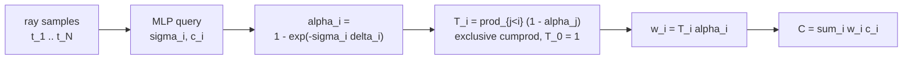

# A9 - NeRF and the volume rendering integral

This assignment builds the core of a neural radiance field on a small synthetic scene: the Fourier
positional encoding that fixes the MLP's spectral bias, the discretized volume renderer that
turns per-sample densities and colors into a pixel, and ray generation from camera
intrinsics and extrinsics. The radiance-field MLP and the toy scene are provided. The scene
is one colored solid sphere imaged at 16x16 from a ring of cameras, so every test runs on CPU
in seconds, and its ground-truth pixels come from a closed-form integral, not from the
renderer being built here.

NeRF is the volume-rendering vehicle here, not a method to deploy. By 2026, 3D Gaussian
splatting renders at similar quality roughly 100x faster (Kerbl et al. 2023,
[arXiv:2308.04079](https://arxiv.org/abs/2308.04079)), because NeRF spends 64-192 MLP queries
per pixel marching a ray. The reason to build it is the volume rendering integral, its
discretization, and front-to-back alpha compositing: the same compositing reappears in
Gaussian splatting (A10) and in occupancy / neural-SDF rendering (A11.5d), and the
ray-marched renderer carries over there almost unchanged.

## Why NeRF mattered

Before NeRF, novel-view synthesis went through explicit geometry: estimate a mesh or a point
cloud from images, then re-render it. That pipeline loses thin structures, semi-transparent
surfaces, and view-dependent shading, and its quality is capped by the reconstructed mesh.
Mildenhall et al. (2020, "NeRF: Representing Scenes as Neural Radiance Fields for View
Synthesis", [arXiv:2003.08934](https://arxiv.org/abs/2003.08934)) replaced the explicit model
with a continuous function: an MLP $F_\theta$ that maps a 3D world position $\mathbf{x}$ and a
viewing direction $\mathbf{d}$ to a volume density $\sigma$ and an emitted color
$\mathbf{c}$. To render a pixel, march a camera ray through the field, query the MLP at
samples along the ray, and composite. The whole renderer is differentiable, so the only
supervision is the photometric error between rendered and observed pixels: no 3D ground truth,
no mesh, just posed images.

Two design choices made it work. Density depends only on position while color also depends on
direction, which keeps geometry consistent across views while still modeling specular
highlights. And input coordinates pass through a Fourier feature map before the MLP, without
which the renders come out blurry. Both are below.

## The volume rendering integral

A ray is $\mathbf{r}(t) = \mathbf{o} + t\mathbf{d}$ from the camera center $\mathbf{o}$ along
direction $\mathbf{d}$. Treat the scene as a cloud of light-emitting, light-absorbing
particles with density $\sigma(\mathbf{x}) \ge 0$ (probability per unit length that the ray is
absorbed) and emitted color $\mathbf{c}(\mathbf{x}, \mathbf{d})$. The color of the ray is the
emission-absorption integral

$$C(\mathbf{r}) = \int_{t_n}^{t_f} T(t)\,\sigma(\mathbf{r}(t))\,\mathbf{c}(\mathbf{r}(t), \mathbf{d})\,dt,
\qquad T(t) = \exp\!\Big(-\int_{t_n}^{t} \sigma(\mathbf{r}(s))\,ds\Big).$$

$T(t)$ is the transmittance: the fraction of light from depth $t$ that reaches the camera
without being absorbed first. It is Beer-Lambert's law, the exponential attenuation of light
through an absorbing medium. The integrand weights each point's emission $\sigma\mathbf{c}$ by
how much of it survives the trip back to the camera, so a near opaque surface dominates and
everything behind it is suppressed.

This integral has no closed form for a general field, so it is estimated on $N$ samples
$t_1 < \dots < t_N$ along the ray with segment lengths $\delta_i = t_{i+1} - t_i$. Assume
$\sigma$ and $\mathbf{c}$ are piecewise constant on each segment. Over a segment of constant
density $\sigma_i$ and length $\delta_i$, the transmittance drops by exactly
$\exp(-\sigma_i \delta_i)$, so the probability the ray is absorbed within that segment is

$$\alpha_i = 1 - \exp(-\sigma_i \delta_i).$$

This $\alpha_i$ is the exact integral over a segment of constant $\sigma$; the only
approximation in the whole scheme is the piecewise-constant assumption on $\sigma$ and
$\mathbf{c}$, not the per-segment formula. The transmittance up to sample $i$ is the product
of survival probabilities over all earlier segments, an exclusive cumulative product:

$$T_i = \prod_{j < i} (1 - \alpha_j), \qquad T_0 = 1.$$

The leading $T_0 = 1$ means the first sample is not attenuated by anything. The rendered color
is the weighted sum

$$\hat{C}(\mathbf{r}) = \sum_{i=1}^{N} w_i\,\mathbf{c}_i, \qquad w_i = T_i\,\alpha_i.$$

The weight $w_i = T_i \alpha_i$ is the probability the ray reaches sample $i$ (factor $T_i$)
and is absorbed there (factor $\alpha_i$). The weights are non-negative and sum to at most 1,
with the leftover mass $1 - \sum_i w_i$ being the probability the ray passes through
everything and hits the background. They satisfy the telescoping identity

$$\sum_{i=1}^{N} w_i = 1 - \prod_{i=1}^{N} (1 - \alpha_i),$$

which the renderer test checks exactly, since it pins the entire transmittance structure in
one equation.

This is Porter-Duff "over" compositing applied front to back. In image compositing, placing a
layer of opacity $\alpha$ over a background $B$ gives $\alpha\,\text{color} + (1-\alpha)B$;
chaining that over $N$ ordered layers produces exactly $\sum_i T_i \alpha_i \mathbf{c}_i$ with
$T_i = \prod_{j<i}(1-\alpha_j)$. The same compositing returns in A10 and A11.5d.

In `volume_render`, the MLP has already applied the non-negativity activation to $\sigma$, so
the renderer takes raw non-negative densities and must not re-activate them. The exclusive
cumulative product is built as `cumprod(cat([ones(R,1), (1-alpha)[:, :-1]], dim=1))`: a
leading column of ones for $T_0$, then the running product of all but the last $(1-\alpha)$.
There is no epsilon inside the cumprod (an epsilon would break the exact-equality tests), and
the renderer does not use an inclusive cumprod followed by a shift (that double-counts).

For derivation details and edge cases, see the Volume Rendering Digest (Tagliasacchi and
Mildenhall 2022, [arXiv:2209.02417](https://arxiv.org/abs/2209.02417)).

## Spectral bias and the Fourier encoding

A plain coordinate MLP, fed $(\mathbf{x}, \mathbf{d})$ directly, renders the scene blurry. The
reason is spectral bias: an MLP under gradient descent fits low-frequency components of the
target function first, and high-frequency detail (sharp edges, fine texture) only much later
or not at all. The neural tangent kernel makes this precise. The NTK of a standard MLP on raw
coordinates is close to a low-pass kernel, so the eigenfunctions it learns quickly are the
smooth ones, and the sphere's hard silhouette (a step in color) sits in the part of the
spectrum the network reaches slowly.

The fix is to map each input coordinate through a bank of sinusoids before the MLP. For a
scalar coordinate $p$,

$$\gamma(p) = \big(\sin(2^0 \pi p),\, \cos(2^0 \pi p),\, \dots,\, \sin(2^{L-1} \pi p),\, \cos(2^{L-1} \pi p)\big),$$

applied to each input coordinate, optionally with the raw coordinate concatenated
(`include_input`). The geometric frequencies $2^k$ spread the input across a band, which turns
the MLP's effective kernel into a stationary, tunable-bandwidth kernel: the highest band sets
how fine a detail the network can represent. Tancik et al. (2020, "Fourier Features Let
Networks Learn High Frequency Functions in Low Dimensional Domains",
[arXiv:2006.10739](https://arxiv.org/abs/2006.10739)) showed this through the NTK and proved
the random-Fourier-feature version; NeRF uses the deterministic $2^k$ schedule.

The frequency schedule is only valid when inputs are roughly in $[-1, 1]$. The
caller (`NeRFMLP`) divides sample positions by a scene-bound constant (the object's
half-extent, here `scene_bound`) before encoding, and feeds unit-length directions. An
unnormalized position of magnitude ~4 hit with the top $2^{L-1}\pi$ band aliases: adjacent
points map to wildly different phases and the encoding stops being smooth in position. On this
toy, $L = 6$ for positions and $L = 4$ for directions; the original NeRF uses $L = 10$ and
$L = 4$ on a metric-scale scene.

The encoding is a fixed map with no learnable parameters; the bands $2^k$ are a registered
buffer. The ablation in `viz.py` trains one model with the encoding and one on raw coordinates
($L = 0$, raw input only) and renders both: the no-encoding model produces a visibly softer
sphere boundary, which is the spectral bias showing up as blur. The sphere's hard silhouette
makes the ablation legible; a smooth blob would hide it.

## Ray generation

Generating rays is applying the pinhole camera model, prerequisite geometry from the
camera-geometry module (`nanovision.geometry`), not new content. A pixel $(u, v)$ back-projects
to a camera-frame direction. With intrinsic matrix $K$ (focal lengths $f_x, f_y$, principal
point $c_x, c_y$),

$$\mathbf{d}_c = \big((u - c_x)/f_x,\; (v - c_y)/f_y,\; 1\big),$$

which `unproject(px, depth=1, K)` computes. The camera-to-world matrix $c2w$ rotates that into
the world frame, $\mathbf{d}_w = R_{c2w}\,\mathbf{d}_c$, and the ray origin is the camera
center $c2w[:3, 3]$. The direction is then normalized to unit length.

Normalizing $\mathbf{d}_w$ makes the depth value $z$ a Euclidean distance along the ray, so
`near` and `far` are distances, not $z$-depths, and segment lengths $\delta_i$ need no
$\lVert\mathbf{d}\rVert$ correction. The same unit direction is the $\mathbf{d}$ fed to the
MLP's color branch, so it must be the normalized one. Depth samples are stratified: split
$[\text{near}, \text{far}]$ into $N$ uniform bins and draw one sample per bin (jittered inside
the bin when `perturb=True`), so training sees a continuous range of depths instead of a fixed
grid. The final $\delta_N$ is set to a large constant ($10^{10}$) so the last sample absorbs
whatever transmittance remains, the original NeRF convention.

A note on convention. The original NeRF uses the OpenGL camera convention, where the camera
looks down $-z$, because its Blender synthetic scenes ship with OpenGL $c2w$ matrices. This
course uses the OpenCV convention throughout (camera looks down $+z$), established in
`nanovision.geometry`, so the ray directions and the toy-scene poses both follow $+z$ forward.
Getting this wrong silently flips the scene front to back. The toy scene is generated directly
in the OpenCV convention (no OpenGL poses are imported), so there is no sign flip to undo.

## The radiance-field MLP

`NeRFMLP` (provided) implements the NeRF factorization: density from position alone, color
from position and direction. The encoded position runs through a trunk of fully connected
layers with one skip connection that re-injects the encoded position at the middle layer, so
the deeper layers still have direct access to the raw geometry. The trunk's final features go
two ways: a linear head plus softplus gives density $\sigma \ge 0$, and the same features
concatenated with the encoded direction give the color through a small head plus sigmoid, so
RGB lands in $[0, 1]$. Density ignoring direction keeps geometry view-consistent; color
depending on direction models specular appearance. The MLP plumbing is provided because the
content of this assignment is the encoding and the renderer.

## Hierarchical sampling

The original NeRF samples each ray twice. A coarse pass with uniform stratified samples
produces the weights $w_i$, which form a piecewise-constant distribution along the ray
concentrated wherever the density is high. A fine pass then draws extra samples from that
distribution by inverse-CDF sampling, so compute concentrates near surfaces instead of being
wasted in empty space. This is optional and not graded here; the toy sphere is solid enough
that 32 uniform samples per ray suffice. Modern NeRFs mostly drop the separate coarse network:
mip-NeRF 360 and Nerfacto use a single proposal MLP supervised to predict the weight
distribution.

## Where this goes next

A10 (3D Gaussian splatting) reuses the exact compositing equation,
$\hat{C} = \sum_i T_i \alpha_i \mathbf{c}_i$ with $T_i = \prod_{j<i}(1-\alpha_j)$, but the
$\alpha$ comes from a projected 2D Gaussian times a learned opacity, not from
$1 - \exp(-\sigma\delta)$, and the ordering comes from depth-sorting the Gaussians, not from
marching $t$ along a ray. 3D Gaussian splatting does not do per-sample Beer-Lambert; only the
front-to-back "over" compositing is shared.

A11.5d (occupancy / neural SDF) is the closer carry-over: keep the ray-marched renderer
exactly, and swap the density. NeuS (Wang et al. 2021, "NeuS: Learning Neural Implicit
Surfaces by Volume Rendering for Multi-view Reconstruction",
[arXiv:2106.10689](https://arxiv.org/abs/2106.10689)) derives $\sigma$ from a signed distance
function so the zero-level set is a clean surface, while rendering through the same
$T_i \alpha_i$ quadrature.

The NeRF line continued along two axes. Speed: Instant-NGP (Müller et al. 2022, "Instant
Neural Graphics Primitives with a Multiresolution Hash Encoding",
[arXiv:2201.05989](https://arxiv.org/abs/2201.05989)) replaces the Fourier encoding with a
learned multiresolution hash grid and cuts training from hours to seconds. Quality: mip-NeRF
(Barron et al. 2021, "Mip-NeRF: A Multiscale Representation for Anti-Aliasing Neural Radiance
Fields", [arXiv:2103.13415](https://arxiv.org/abs/2103.13415)) casts cones instead of rays and
integrates the positional encoding over each cone frustum to anti-alias across scales, and
Zip-NeRF (Barron et al. 2023, "Zip-NeRF: Anti-Aliased Grid-Based Neural Radiance Fields",
[arXiv:2304.06706](https://arxiv.org/abs/2304.06706)) combines that anti-aliasing with the
hash-grid speed. A separate line drops per-scene optimization entirely: feed-forward methods
(DUSt3R/MASt3R, pixelSplat) predict geometry or splats from a few images in one pass.

The full NeRF result (the Blender Lego scene at 800x800, ~20k training steps, ~22 dB PSNR) is
out of scope here: it wants a GPU and minutes to hours. This assignment runs the same math on a
16x16 sphere that fits in CPU seconds.

## What to implement

- `PositionalEncoding.forward` (`encoding.py`): the $\gamma(p)$ Fourier feature map, with
  `include_input`, no learnable parameters.
- `volume_render` (`render.py`): $\alpha_i = 1 - \exp(-\sigma_i\delta_i)$, exclusive
  transmittance $T_i = \prod_{j<i}(1-\alpha_j)$ with $T_0 = 1$, weights $w_i = T_i\alpha_i$,
  and $\hat{C} = \sum_i w_i \mathbf{c}_i$, with an optional white background.
- `stratified_sample_rays`, `sample_along_rays`, `deltas_from_z` (`rays.py`): pinhole ray
  directions rotated to world and normalized, stratified depth samples, points on each ray,
  and segment lengths with the large final delta.

The MLP, config, viz, and the toy scene are provided. `render.py` and `rays.py` are shared:
A10 and A11.5d import their symbols through `nanovision.volume`.

## References

- Mildenhall et al. 2020, NeRF: [arXiv:2003.08934](https://arxiv.org/abs/2003.08934).
- Tancik et al. 2020, Fourier Features: [arXiv:2006.10739](https://arxiv.org/abs/2006.10739).
- Tagliasacchi and Mildenhall 2022, Volume Rendering Digest: [arXiv:2209.02417](https://arxiv.org/abs/2209.02417).
- Barron et al. 2021, Mip-NeRF: [arXiv:2103.13415](https://arxiv.org/abs/2103.13415).
- Müller et al. 2022, Instant-NGP: [arXiv:2201.05989](https://arxiv.org/abs/2201.05989).
- Wang et al. 2021, NeuS: [arXiv:2106.10689](https://arxiv.org/abs/2106.10689).
- Barron et al. 2023, Zip-NeRF: [arXiv:2304.06706](https://arxiv.org/abs/2304.06706).
- Kerbl et al. 2023, 3D Gaussian Splatting: [arXiv:2308.04079](https://arxiv.org/abs/2308.04079).
