# A10.5 - geometry foundation models (DUSt3R-style pointmap regression)

Two images of a scene feed into one network, and it returns, for every pixel, the 3D coordinate
of the surface that pixel sees. Both sets of 3D points come out in the same coordinate frame (the
first camera's), so depth, relative pose, and correspondence are read off the output afterward.
No intrinsics, no poses, and no feature matching go in. This is DUSt3R (Shuzhe Wang et al., CVPR
2024), which replaced a multi-stage geometry pipeline with a single forward pass.

This assignment builds the regression mechanism on a tiny posed-sphere toy: a Siamese ViT
encoder, two transformer decoders that cross-attend to each other's tokens, a head that
regresses per-pixel 3D points plus a confidence, and the confidence-weighted, scale-normalized
loss. The encoder and the cross-attending decoders are provided; the head, the loss, and the
depth/pointmap geometry utilities are the holes.

Required reading before starting:
- Wang et al. 2024, "DUSt3R: Geometric 3D Vision Made Easy",
  [arXiv:2312.14132](https://arxiv.org/abs/2312.14132).
- Weinzaepfel et al. 2022, "CroCo: Self-Supervised Pre-training for 3D Vision Tasks by Cross-View
  Completion", [arXiv:2210.10716](https://arxiv.org/abs/2210.10716): the cross-view pretext task
  DUSt3R's encoder is pretrained on.

## Lecture notes

### The classic pipeline, stage by stage

Structure-from-motion (SfM) recovers camera poses and a 3D point cloud from a set of images. It
is a chain of separate estimation problems, and DUSt3R is a reaction to the shape of that chain,
so each stage is named below along with the problem it solves. COLMAP is the open-source
implementation most people mean when they say "run SfM".

Keypoints and descriptors come first. A detector picks image locations that can be found again
from a different viewpoint, typically corners or blob centers, and a descriptor summarizes the
pixel neighborhood around each one as a vector built to change as little as possible under
rotation, scale change, and lighting change. SIFT is the classic detector-descriptor pair.

Matching pairs the descriptors of two images by nearest neighbor in descriptor space. The output
is a list of claimed correspondences: pixel $u_1$ in image 1 and pixel $u_2$ in image 2 are said
to see the same surface point. A sizeable fraction of the list is wrong.

Two-view geometry turns those correspondences into a relative pose. Write the normalized ray of a
pixel as $x = K^{-1} \tilde u$, where $\tilde u$ is the pixel in homogeneous coordinates and $K$
is the intrinsic matrix. If camera 2 differs from camera 1 by rotation $R$ and translation $t$,
then for a true correspondence the two rays and the baseline between the camera centers lie in
one plane. Writing that coplanarity in coordinates gives one scalar equation per correspondence,

$$x_2^\top E\, x_1 = 0, \qquad E = [t]_\times R,$$

where $[t]_\times$ is the skew-symmetric matrix with $[t]_\times a = t \times a$. The $3 \times 3$
matrix $E$ is the essential matrix, and it carries the whole relative geometry of the pair. The
equation is linear in the nine entries of $E$, so eight correspondences determine it up to scale,
and an SVD-based factorization then reads $R$ and the direction of $t$ back out. The length of $t$
is not recoverable from images: scaling the scene and the baseline by the same factor reproduces
the same two images exactly.

RANSAC (random sample consensus) makes that estimate survive the wrong matches. Plain least
squares has no defense against them, because one gross outlier with a large squared residual can
drag the fit arbitrarily far. RANSAC instead draws a minimal random subset of correspondences
(eight, for the equation above), fits $E$ to that subset alone, and counts how many of all the
correspondences agree with the resulting geometry to within a pixel-scale threshold. It repeats
with fresh subsets and keeps the model with the largest agreeing set, then refits on that set. A
subset that happens to contain no wrong matches yields a model that many other correct matches
agree with; a subset containing a wrong match yields a model that few agree with.

Triangulation follows. With $R$ and $t$ fixed, each correspondence gives two rays expressed in one
frame, and the 3D point is the least-squares closest point to both.

Bundle adjustment cleans up at the end. Everything above was estimated stage by stage, each stage
committing to the previous stage's answer, so the errors accumulate. Bundle adjustment re-optimizes
all of it at once: with the camera poses $(R_i, t_i)$ and the 3D points $X_j$ as unknowns, it
minimizes the total reprojection error

$$\sum_{i,j} \big\lVert u_{ij} - \pi\big(K_i (R_i X_j + t_i)\big) \big\rVert^2,$$

where $u_{ij}$ is where feature $j$ was detected in image $i$ and $\pi$ is the perspective divide.
This is a large nonlinear least-squares problem solved by Gauss-Newton or Levenberg-Marquardt. Its
Jacobian is sparse, since one observation touches exactly one camera and one point, and solvers
exploit that structure. Bundle adjustment is where most of the final accuracy comes from, and it
needs a starting point close enough to converge, which the earlier stages supply.

The multi-view geometry estimators later in the course build the essential matrix, RANSAC, and
pose-from-known-points pieces directly; the sketch here is enough to see what DUSt3R removes.

The pipeline is accurate when it works, but each stage can fail and the failure propagates.
Keypoint matching breaks on low-texture surfaces (blank walls, sky, repetitive patterns), on wide
baselines where the same point looks too different between two far-apart cameras, and on small
image sets, where two views give few correspondences and a fragile two-view geometry. When
matching returns too few or wrong correspondences, pose estimation and triangulation have nothing
to stand on, and bundle adjustment has nothing to refine.

DUSt3R removes the matching stage. It regresses geometry directly from raw pixels with a network
trained on many scenes, so the prior learned across that training data fills in where
correspondence search would have failed. The intrinsics and poses that the classic pipeline needs
as input (or estimates early and commits to) are not inputs at all; they fall out of the
network's output.

### The pointmap representation

A pointmap is a per-pixel map of 3D coordinates. For an image of shape $H \times W$, the pointmap
$X$ has shape $H \times W \times 3$: entry $X_{ij}$ is the 3D point, in some camera frame, of the
surface seen at pixel $(i, j)$. It is the geometric content of a depth map written in 3D instead
of as a scalar per pixel.

The pixel convention used everywhere in this assignment: $(i, j)$ is row $i$, column $j$, and the
image coordinate of that pixel's center is $(u, v) = (j, i)$, with the principal point
$(c_x, c_y) = ((W-1)/2, (H-1)/2)$ landing at the center of the grid. Getting the row/column order
or the half-pixel offset wrong shifts the whole pointmap and shows up as a failed round-trip.

Given intrinsics $K$, a depth map $D$ and a pointmap carry the same information. Back-projection
sends a pixel to the 3D point at depth $d$ along its ray,

$$X = \frac{(u - c_x)\,d}{f_x}, \qquad Y = \frac{(v - c_y)\,d}{f_y}, \qquad Z = d,$$

and the inverse is reading the third coordinate back off, since $Z = d$ exactly. Those two
directions are `depth_to_pointmap` and `pointmap_to_depth`, and their exact round-trip is the
first thing the tests check.

DUSt3R's move is which frame the two pointmaps live in. For an image pair, it outputs

$$X^{1,1} \in \mathbb{R}^{H \times W \times 3}, \qquad X^{2,1} \in \mathbb{R}^{H \times W \times 3}.$$

The superscript reads "which image's pixels, then which camera frame." $X^{1,1}$ is image 1's
pixels as 3D points in camera 1's frame. $X^{2,1}$ is image 2's pixels as 3D points, also in
camera 1's frame. So the network takes image 2's pixels and places them in image 1's coordinate
system. To do that it has to implicitly recover the relative pose between the two cameras, because
expressing image 2's geometry in image 1's frame requires knowing how the two cameras sit relative
to each other.

The network never outputs an explicit pose or correspondence. It regresses the two pointmaps, and
pose, depth, and matches are read off afterward. The next section gives the operations that read
them off.

### Reading depth, pose, and correspondence off the pointmaps

Depth of image 1 is the $z$ channel of $X^{1,1}$, directly. Depth of image 2 needs $X^{2,2}$,
which is the same network run with the two images swapped, or a transform of $X^{2,1}$ back into
camera 2's frame once the relative pose is known.

Relative pose comes from having the same points written in two frames. $X^{2,1}$ holds image 2's
surface points in camera 1's frame and $X^{2,2}$ holds the same points in camera 2's frame, so the
relative pose is the rigid transform carrying one set onto the other. With $a_i$ the points in
camera 1's frame and $b_i$ the corresponding points in camera 2's frame, the problem is

$$\min_{R \in SO(3),\, t} \sum_i \lVert R a_i + t - b_i \rVert^2 ,$$

which is the orthogonal Procrustes problem (also called Kabsch alignment), and it has a closed
form. Subtract the centroids $\bar a$ and $\bar b$ to get centered points $\tilde a_i$ and
$\tilde b_i$, form the $3 \times 3$ cross-covariance $H = \sum_i \tilde a_i \tilde b_i^\top$, take
its SVD $H = U \Sigma V^\top$, and set

$$R = V \operatorname{diag}(1, 1, \det(V U^\top))\, U^\top, \qquad t = \bar b - R \bar a .$$

The determinant term flips the sign of the last column when the raw product would be a reflection,
which keeps $R$ in $SO(3)$. The same closed form reappears inside the ICP assignment later, where
it is applied repeatedly to nearest-neighbor pairs.

Procrustes weights every point equally, so a handful of badly predicted points pulls the answer;
the DUSt3R paper says as much and prefers RANSAC wrapped around PnP. PnP is the
perspective-$n$-point problem: given $n$ 3D points and the pixels where a calibrated camera
observes them, find that camera's pose by minimizing reprojection error. Both ingredients are
already in hand here. $X^{2,1}$ gives, for each pixel of image 2, a 3D point in camera 1's frame,
and the pixel it came from is that point's observation in camera 2. So PnP returns camera 2's pose
in camera 1's frame with no correspondence search and no triangulation anywhere in the chain.

Correspondence between the two images is nearest-neighbor search in 3D. Pixels whose pointmap
entries are close in camera 1's frame see the same surface point, so matching is a lookup in the
output rather than a descriptor comparison.

The same ingredients give a self-check on the geometry. Take $X^{2,1}$, move it into camera 2 with
the relative pose $T_{1 \to 2}$, and project with $K$. Each point should land back on the pixel of
image 2 it came from, since that is where camera 2 saw the surface. Any error in the predicted
3D point, or in the pose implied by it, shows up as a pixel offset. That composition of a rigid
transform and a projection is `reproject_pointmap`, and it produces the reprojection error map in
the figures.

### The scale ambiguity

The pinhole equation $u = f_x X / Z + c_x$ is unchanged if $X$ and $Z$ are both multiplied by the
same positive factor $s$. Scale the entire scene by $s$ and scale the baseline between the two
cameras by the same $s$, and both images come out pixel-for-pixel identical. Images alone
therefore cannot determine $s$, and a two-view prediction is correct at best up to one global
positive factor.

One factor, not two. The same $s$ multiplies view 1's geometry, view 2's geometry, and the
translation between the cameras, because all three live in the one coordinate frame the network
outputs. That is the difference between a scale ambiguity and a per-view ambiguity, and it decides
how the loss has to be normalized: a comparison of prediction against ground truth must divide out
that single factor, and it must divide both views by the same one.

### Cross-attention, and what it carries here

In self-attention over a set of tokens, every token produces a query, a key, and a value, and the
output for one token is $\operatorname{softmax}(QK^\top / \sqrt{d})V$: a weighted average of the
values of the tokens in that same set, with weights set by query-key agreement. Cross-attention
keeps the queries but takes the keys and values from a second set of tokens, called the memory.
The output for a token is then a weighted average over the memory tokens.

That is the whole path by which one view's geometry reaches the other view's prediction. A patch
of image 2 forms a query; the patches of image 1 supply keys and values; the attention weights
concentrate on whichever image-1 patches look like the same piece of surface. Once a patch of
image 2 has read where its surface appears in image 1, it has information about how the two
cameras sit relative to each other, and that is exactly what it needs to write its own 3D point in
camera 1's frame.

In the code the memory argument is the other view's encoder tokens. `GeometryFM.forward` takes a
`use_cross` flag, and setting it to `False` replaces the memory with zeros. The cross-attention
ablation in the tests and the viz uses that flag to cut the path and measure what the network
loses.

### The architecture

```mermaid
flowchart TD
    I1[image 1] --> E1[ViT encoder]
    I2[image 2] --> E2[ViT encoder]
    E1 -. shared weights .- E2
    E1 --> F1["tokens f1 (B, N, d)"]
    E2 --> F2["tokens f2 (B, N, d)"]
    F1 --> D1[decoder 1: self-attn + cross-attn to f2]
    F2 --> D2[decoder 2: self-attn + cross-attn to f1]
    F2 -. memory .-> D1
    F1 -. memory .-> D2
    D1 --> H1[pointmap head]
    D2 --> H2[pointmap head]
    H1 --> P1["X^1,1 + conf (cam1 frame)"]
    H2 --> P2["X^2,1 + conf (cam1 frame)"]
```



A single ViT encoder runs on both images with shared weights, turning each into a grid of patch
tokens of shape $(B, N, d)$, with $N$ the number of patches and $d$ the token dimension. One set
of weights applied to two inputs is the Siamese arrangement, and it means the encoder learns one
image representation rather than a separate one per slot.

Two decoders, one per view, turn the tokens into the prediction. The view-1 decoder runs
self-attention over image 1's tokens and cross-attention to image 2's tokens as memory; the
view-2 decoder mirrors it. The two decoders do not share weights, because their jobs differ - one
predicts in its own frame, the other predicts in the partner's frame.

The decoders are non-causal: bidirectional self-attention over the patch grid, then a
cross-attention sub-layer over the other view's memory, then the feed-forward. A causal mask would
be wrong here. Causal masking exists for sequences with a left-to-right order (language,
autoregressive generation) where a token may attend only to earlier tokens. Patch tokens have no
such order; patch 0 must see the whole grid.

Each decoder's output tokens go through a pointmap head: an MLP mapping each token to four
numbers, three for the 3D point and one for a confidence logit, reshaped back to the patch grid. A
logit here is just the unconstrained real number the last linear layer emits, before a monotone
map turns it into a positive confidence; the map is the subject of the loss section below.

Predicting one point per patch keeps the toy small. Real DUSt3R predicts one point per pixel
through a DPT head (Ranftl et al. 2021). DPT takes the token sets from several transformer layers,
reshapes each into an image-shaped feature map at the coarse patch resolution, and then fuses and
upsamples them through convolutional blocks until the output grid matches the input image. The
patch-resolution output here is a deliberate simplification of that, not a different mechanism.

### Cross-view completion pretraining

DUSt3R does not start its encoder from random weights. It starts from CroCo (Weinzaepfel et al.
2022), and CroCo is a pretext task: a training objective whose targets come from the input data
itself rather than from labels, run only so that the representation it produces can be kept and
the task's own output thrown away. The masked autoencoder is the familiar instance, hiding most of
an image's patches and reconstructing them from the few that remain.

CroCo changes what the network is allowed to use for that reconstruction. It masks patches of one
image and reconstructs them, but it also supplies a second, unmasked image of the same scene from
a different viewpoint, reachable through cross-attention. Recovering a hidden patch from that
second view means finding where the same surface appears there and accounting for the viewpoint
change between the two cameras. That is the same cross-view reasoning the pointmap decoders need,
which is why DUSt3R starts from CroCo weights rather than from scratch.

### The confidence-weighted, scale-normalized loss

Two pieces sit on top of a plain regression loss: scale normalization and a learned confidence.

Scale normalization divides out the ambiguity derived above. Both the prediction and the ground
truth are divided by their own scale factor before the residual is taken, so a consistent
overall-scale difference costs nothing. The scale is the average distance of the valid points from
the origin (DUSt3R Eq. 5):

$$z = \frac{1}{|\mathcal{D}^1| + |\mathcal{D}^2|} \sum_{v \in \{1, 2\}} \sum_{i \in \mathcal{D}^v} \lVert X^v_i \rVert,$$

where $\mathcal{D}^v$ is the set of valid pixels in pointmap $v$, $i$ indexes those pixels after
the grid is flattened, and $\lVert X^v_i \rVert$ is the Euclidean norm of the 3D point at pixel
$i$. In this toy a pixel is valid when its patch-center ray hits the sphere.

The sum runs over both pointmaps with one shared $z$. A separate scale per map would rescale image
1 and image 2 independently, and that destroys the relative scale between the two cameras, which
is the exact information the shared-cam1-frame representation carries. The two views must be
scaled together so their relative geometry survives. The scale therefore is one scalar per image
pair, computed over the union of both maps' valid points. That is `normalize_scale`, and it
returns shape $(B,)$ for a batch of $B$ pairs.

The confidence term lets the network say "I cannot predict this pixel." Writing $\hat X$ for the
prediction and $\bar X$ for the ground truth, with $z$ the joint scale of the two predicted maps
and $\bar z$ the joint scale of the two ground-truth maps, the per-pixel residual is the Euclidean
distance between the scaled points,

$$\ell_i^v = \left\lVert \frac{\hat X_i^v}{z} - \frac{\bar X_i^v}{\bar z} \right\rVert,$$

and the loss weights each residual by that pixel's confidence and subtracts a log term:

$$\mathcal{L} = \frac{1}{|\mathcal{D}^1| + |\mathcal{D}^2|} \sum_{v \in \{1, 2\}} \sum_{i \in \mathcal{D}^v} \left( C_i^v\, \ell_i^v - \alpha \log C_i^v \right).$$

DUSt3R Eq. 6 writes the same expression as a plain sum. Dividing by the number of valid pixels, as
`pointmap_loss` does, keeps the printed value from growing with image size or batch size and
rescales the gradient by a constant. $\alpha$ is a hyperparameter in the paper with no value fixed
there; this assignment uses $\alpha = 0.2$ from `config.py`.

Confidence is $C = 1 + \exp(\text{logit})$, the DUSt3R parameterization (paper text after Eq. 6),
so $C > 1$ always, approaching 1 as the logit goes to $-\infty$ and unbounded above. The head
applies the map; the loss reads $C$.

The floor at 1 changes the answer, which comes out of minimizing the per-pixel cost at a fixed
residual. Write $g(C) = C\ell - \alpha \log C$. Then $g'(C) = \ell - \alpha/C$ and
$g''(C) = \alpha/C^2 > 0$, so $g$ is convex with its unconstrained minimum at $C = \alpha/\ell$.
Under the constraint $C \ge 1$ the minimizer is

$$C^\star = \max\left(1, \frac{\alpha}{\ell}\right).$$

Two regimes follow. When the residual is smaller than $\alpha$, the optimum is interior at
$C^\star = \alpha/\ell > 1$ and the cost is $\alpha\big(1 + \log(\ell/\alpha)\big)$, so a
well-fitted pixel is rewarded for raising its confidence. When the residual is $\alpha$ or larger,
the constraint binds, $C^\star = 1$, and the cost is exactly $\ell$: the pixel pays its plain
regression residual in full. Confidence can therefore buy extra credit on pixels the network
already fits, but it cannot buy a discount on pixels it cannot fit.

That is the difference from softplus, $C = \log(1 + e^{\text{logit}})$, which ranges over
$(0, \infty)$ and so removes the floor. With softplus the minimizer is $C^\star = \alpha/\ell$ at
every residual, and the cost is $\alpha\big(1 + \log(\ell/\alpha)\big)$ for every residual too.
That grows like $\log \ell$ instead of like $\ell$, so a pixel with a huge residual could be
down-weighted until it costs nearly nothing, and the network would learn to declare hard regions
hopeless instead of fitting them. Keeping $C \ge 1$ keeps the plain regression term as a lower
bound on every pixel's cost. Substituting softplus is not a cosmetic change.

The confidence is learned from the data rather than supplied: the network lowers $C$ toward 1 on
pixels it cannot fit (sky, occluded regions, reflective surfaces with no stable 3D point) and
raises it where it is sure.

### Why the cross-view path has to carry information

A single sphere centered at the world origin, viewed from a symmetric camera ring, is degenerate
for the cross-view lesson: the two views are near-identical, so placing view 2 in view 1's frame
needs almost nothing from view 1 and the cross-attention sits idle. Off-centering the sphere and
widening the baseline between the two views makes each view see a different portion of the
surface. Training on several view pairs at once, so the relative pose varies across the batch,
forces the cross-attention to carry information: with a single fixed pair the network could bake
one relative pose into its weights and ignore the other view; with the pose changing pair to pair
it cannot, and it has to read the partner tokens to place view 2 correctly.

In real DUSt3R the cross-view attention is the only path by which the second view's geometry
enters the first camera's frame, so removing it would leave the network unable to produce a
shared-frame pointmap pair at all. The confidence term improves reconstruction on the surfaces a
regression-only loss handles worst (sky, occlusion, reflective and transparent regions).

### Global alignment for more than two views

DUSt3R as built handles one image pair. For a collection of images it runs the network on many
pairs and then aligns all the pairwise pointmaps into one global reconstruction.

The variables are one global pointmap $\chi^n$ per image $n$, plus a rigid transform $P_e$ and a
scale $\sigma_e$ for each pair $e$ in the set of pairs $\mathcal{E}$ that were run through the
network. The objective asks each pair's predicted pointmaps, after being scaled and rigidly moved,
to agree with the global pointmaps of the images involved (DUSt3R Eq. 7):

$$\chi^\star = \arg\min_{\chi, P, \sigma} \sum_{e \in \mathcal{E}} \sum_{v \in e} \sum_i C_i^{v,e} \left\lVert \chi_i^v - \sigma_e P_e X_i^{v,e} \right\rVert .$$

The per-pixel confidences the network already predicted reappear here as the weights, so pixels
the network was unsure about pull less. A constraint $\prod_e \sigma_e = 1$ stops the whole thing
collapsing to zero, which would otherwise be the trivial minimum.

This is bundle adjustment moved into point space. Bundle adjustment refines poses and 3D points to
minimize where projected points land versus where features were detected, in pixels. The global
alignment refines per-pair poses and scales, and per-image pointmaps, to minimize disagreement
in 3D. The network has already done the hard part, producing locally consistent geometry without
correspondences, so the global step is a lightweight least-squares solve rather than the fragile
keypoint-driven optimization COLMAP runs.

### Where this goes

MASt3R (Leroy et al. 2024, [arXiv:2406.09756](https://arxiv.org/abs/2406.09756)) adds a dense
feature-matching head to DUSt3R: alongside the pointmaps it predicts local features whose
nearest-neighbor matches give pixel-accurate correspondences, which sharpens the geometry and
supports localization. MASt3R-SfM extends it to full unconstrained image collections.

Monocular depth networks solve the one-image case, and they are described by what invariance their
output carries. A scale-invariant (or relative) depth prediction $\hat d$ matches the true depth
only after one unknown positive factor is fitted, $d \approx s\,\hat d$. An affine-invariant
prediction needs two unknowns, a scale and a shift, $d \approx s\,\hat d + \beta$. In both cases the
loss fits those unknowns per image before measuring the residual, so the network is never asked to
produce absolute distance and never learns to.

Depth Anything V2 (Yang et al. 2024, [arXiv:2406.09414](https://arxiv.org/abs/2406.09414)) trains
a single-image depth predictor on large mixed data and predicts relative depth. Marigold (Ke et
al. 2024, [arXiv:2312.02145](https://arxiv.org/abs/2312.02145)) repurposes a pretrained
image-diffusion model as a depth estimator by fine-tuning it to denoise a depth map conditioned on
the image, producing affine-invariant depth. Two views do not remove the global scale ambiguity
either, as the scale-ambiguity section showed. They do fix the geometry of one camera relative to
the other: both pointmaps come out in one frame under one shared scale, so the translation between
the cameras is determined in the same units as the scene, which a single image cannot supply.

VGGT (Wang et al. 2025, [arXiv:2503.11651](https://arxiv.org/abs/2503.11651)) pushes the
feed-forward idea to many views at once: one transformer takes a set of images and predicts camera
intrinsics and extrinsics, depth maps, and point tracks together in a single pass, without the
pairwise-then-align structure. A point track is the list of pixel positions, one per image, at
which a single scene point appears across the set, which is the same quantity the classic pipeline
built by matching descriptors. It is the multi-view generalization of the pointmap-regression idea
built here.

In robotics and autonomous driving these models give pose-free reconstruction from a camera rig:
feed the surround images and get consistent 3D geometry without a calibrated SfM run, the same
shared-frame trick applied to a vehicle's cameras instead of a stereo pair.

## The assignment

Fill these holes, in order. Each is one `NotImplementedError` with a matching test; the docstring in each file gives the signature, shapes, and constraints.

1. [`depth_to_pointmap()`](geometry_fm.py) in `geometry_fm.py`
2. [`pointmap_to_depth()`](geometry_fm.py) in `geometry_fm.py`
3. [`reproject_pointmap()`](geometry_fm.py) in `geometry_fm.py`
4. [`PointmapHead.forward()`](head.py) in `head.py`
5. [`normalize_scale()`](loss.py) in `loss.py`
6. [`pointmap_loss()`](loss.py) in `loss.py`

### Running and validating

Activate the environment (`conda activate nanovision`), then:

```
make test     A=a10_5_geometry_fm   # run the tests against your top-level files (red until the holes are filled)
make verify   A=a10_5_geometry_fm   # run the same tests against the reference solution/ (green from the start)
make viz      A=a10_5_geometry_fm   # render the figures from the reference solution
make viz-mine A=a10_5_geometry_fm   # render the figures from your own code (once the holes are filled)
```

`make test` is the command to run while working. It runs the suite in `tests/` against the
top-level files (the ones with the holes) and goes from red (the holes raise `NotImplementedError`)
to green as you fill them in. `make verify` runs the identical suite against the reference in
`solution/`: it sets `NANOVISION_IMPL=solution`, so the tests import the reference implementation
instead of the top-level files. `make verify` is green from the start, so it shows the target and
confirms the tests and the environment work before anything changes. The goal is to bring
`make test` to the same green as `make verify`.

The suite checks the depth round-trip (exact), the pixel convention, and the reprojection
consistency on the toy ground truth (view-2 points reprojected into image 2 land on their patch
centers to under $10^{-3}$ px), with float64 gradchecks of the differentiable utilities. A
gradcheck perturbs each input entry by a small amount, forms the finite-difference estimate of
every partial derivative, and compares it against the analytic gradient autograd produces; float64
is used because the finite differences are too noisy in float32 to tell a real disagreement from
rounding. The head's tests cover its output shapes and that the confidence is above 1 and can grow
well past it. The loss tests cover a float64 gradcheck, the joint-scale invariance (scaling both
the prediction and both ground-truth maps by a factor leaves the loss unchanged), the shared-scale
guard (rescaling only view 2 changes the loss, which it could not do if the scale were per-map),
and the interior confidence optimum $C = \alpha/\ell$, checked at a residual $\ell = 0.1$ below
$\alpha = 0.2$ so that the $C \ge 1$ constraint does not bind. On top of those there is an overfit
of the model on 8 toy stereo pairs, and a static scan that fails if the code imports the real
`dust3r`, `mast3r`, or `croco` packages, or reaches `geometry_fm` by its bare name instead of
through `nanovision.geometry`. The forbidden-imports scan passes with the holes in place.

`make viz` renders from the reference solution, so it works on a fresh checkout before any holes
are filled and shows the target figures. `make viz-mine` runs the same script against your
top-level code; it needs the holes filled, since it trains a model with them. Both write
`pointmaps.png` (predicted vs ground-truth pointmaps as a 3D scatter colored by confidence),
`reprojection.png` (the cross-view reprojection-consistency error map), and `cross_ablation.png`
(the error floor with vs without cross-attention) to `out/`, using matplotlib's headless Agg
backend so the commands behave the same over SSH, in WSL, and in CI with no display. The viz
trains on the GPU when one is present. Add `SHOW=1` (for example
`make viz-mine A=a10_5_geometry_fm SHOW=1`) to also open the figures in interactive windows when a
display is available.

What you should see when you run this. The overfit test trains for 2500 Adam steps on 8 tiny pairs
(about a minute on CPU); the viz uses the 1500 steps in `config.py`. With cross-attention on, the
normalized pointmap error falls to around 0.007; with the cross-attention memory zeroed it rises
to around 0.035, roughly 5x worse, and the gap holds across seeds. The test asserts the cross-on
error stays under 0.05 and the cross-off error is at least 1.5x larger, both with margin. The
cross-attention ablation thus measures the effect rather than asserting it. The single-pair
cross-view reprojection-pixel error is numerically unstable (points near the reprojected image
plane blow up the pixel coordinate), so the viz shows it as an error map but the overfit test does
not assert it; reprojection consistency is checked exactly on the ground truth instead. These are
toy artifacts on one smooth sphere with 16 patches and no pretraining. If on some configuration the
cross-attention or the confidence term looked like it contributed little, that would be an artifact
of the toy's simplicity, not a statement about DUSt3R.

## References

- Wang et al. 2024, DUSt3R, [arXiv:2312.14132](https://arxiv.org/abs/2312.14132).
- Weinzaepfel et al. 2022, CroCo, [arXiv:2210.10716](https://arxiv.org/abs/2210.10716).
- Ranftl et al. 2021, "Vision Transformers for Dense Prediction" (the DPT head),
  [arXiv:2103.13413](https://arxiv.org/abs/2103.13413).
- Leroy et al. 2024, MASt3R, [arXiv:2406.09756](https://arxiv.org/abs/2406.09756).
- Yang et al. 2024, Depth Anything V2, [arXiv:2406.09414](https://arxiv.org/abs/2406.09414).
- Ke et al. 2024, Marigold, [arXiv:2312.02145](https://arxiv.org/abs/2312.02145).
- Wang et al. 2025, VGGT, [arXiv:2503.11651](https://arxiv.org/abs/2503.11651).
