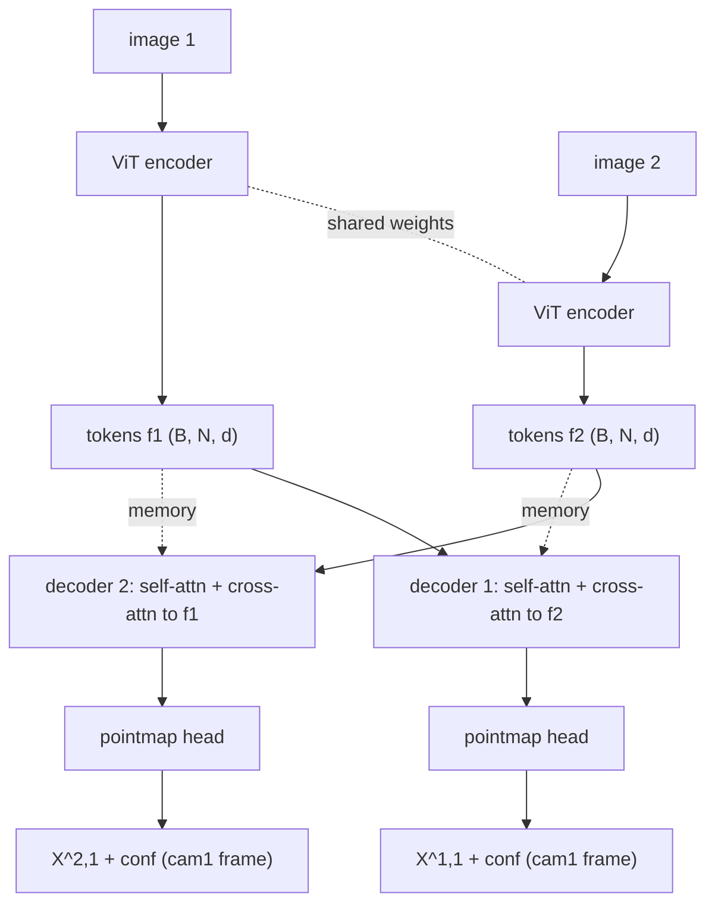

# A10.5 - geometry foundation models (DUSt3R-style pointmap regression)

You feed two images of a scene into one network and it returns, for every pixel, the 3D
coordinate of the surface that pixel sees. Both sets of 3D points come out in the same
coordinate frame (the first camera's), so depth, relative pose, and correspondence are read
off the output afterward. No intrinsics, no poses, and no feature matching go in. This is
[DUSt3R](https://arxiv.org/abs/2312.14132) (Shuzhe Wang et al., CVPR 2024), and it replaced a
multi-stage geometry pipeline with a single forward pass.

This assignment builds the regression mechanism on a tiny posed-sphere toy: a Siamese ViT
encoder, two transformer decoders that cross-attend to each other's tokens, a head that
regresses per-pixel 3D points plus a confidence, and the confidence-weighted,
scale-normalized loss. The survey at the end places DUSt3R among monocular depth networks,
its matching-head successor MASt3R, and the single-pass multi-view model VGGT.

## The problem it replaces

Classic structure-from-motion (SfM) recovers 3D from images through a pipeline: detect
keypoints, match them across images, estimate the geometry (essential matrix, then poses) by
RANSAC, triangulate points, and refine everything with bundle adjustment (a nonlinear
least-squares solve over poses and 3D points minimizing reprojection error). COLMAP is the
standard implementation. The pipeline is accurate when it works, but each stage can fail and
the failure propagates: keypoint matching breaks on low-texture surfaces (blank walls,
sky, repetitive patterns), wide baselines (the same point looks too different between two far
apart cameras), and small image sets (two views give few correspondences and a fragile
two-view geometry). When matching returns too few or wrong correspondences, pose estimation
and triangulation have nothing to stand on.

DUSt3R removes the matching stage. It regresses geometry directly from raw pixels with a
network trained on many scenes, so the prior learned across that training data fills in where
correspondence search would have failed. The intrinsics and poses that the classic pipeline
needs as input (or estimates early and commits to) are not inputs at all; they fall out of
the network's output.

## The pointmap representation

A pointmap is a per-pixel map of 3D coordinates. For an image of shape $H \times W$, the
pointmap $X$ has shape $H \times W \times 3$: entry $X_{ij}$ is the 3D point, in some camera
frame, of the surface seen at pixel $(i, j)$. It is the geometric content of a depth map
written in 3D instead of as a scalar per pixel. Given intrinsics $K$, a depth map $D$ and a
pointmap are interchangeable: back-project each pixel to its 3D ray and scale by depth to get
the point, or read the point's $z$ coordinate to get the depth. The file `geometry_fm.py`
builds exactly these conversions.

DUSt3R's move is which frame the two pointmaps live in. For an image pair, it outputs

$$X^{1,1} \in \mathbb{R}^{H \times W \times 3}, \qquad X^{2,1} \in \mathbb{R}^{H \times W \times 3}.$$

The superscript reads "which image's pixels, then which camera frame." $X^{1,1}$ is image 1's
pixels as 3D points in camera 1's frame. $X^{2,1}$ is image 2's pixels as 3D points, also in
camera 1's frame. So the network takes image 2's pixels and places them in image 1's
coordinate system. To do that it has to implicitly recover the relative pose between the two
cameras, because expressing image 2's geometry in image 1's frame requires knowing how the
two cameras sit relative to each other.

Both maps sharing one frame makes the downstream quantities recoverable by simple operations:

- Depth of image 1 is the $z$ channel of $X^{1,1}$ (and depth of image 2 needs $X^{2,2}$, the
  same network run with the roles swapped, or a transform of $X^{2,1}$ back into camera 2).
- Relative pose between the cameras comes from aligning $X^{2,1}$ (image 2's points in cam1
  frame) with $X^{2,2}$ (the same points in cam2 frame): a rigid-alignment / Procrustes solve,
  or PnP between the 2D pixels and the 3D points.
- Correspondence between the two images is nearest-neighbor search in 3D: pixels whose
  pointmap entries are close in cam1 frame see the same surface point.

The network never outputs an explicit pose or correspondence. It regresses the two pointmaps,
and pose, depth, and matches are read off afterward.

## The architecture

A single ViT encoder runs on both images with shared weights (Siamese), turning each into a
grid of patch tokens. `ViT.forward_features(img)` returns the $(B, N, d)$ patch grid, with
$N$ the number of patches and $d$ the token dimension. Sharing weights means the encoder
learns one image representation, applied identically to both views.

Two decoders, one per view, turn the tokens into the prediction. The view-1 decoder runs
self-attention over image 1's tokens and cross-attention to image 2's tokens as memory; the
view-2 decoder mirrors it. Cross-attention is how each view sees the other: the view-2
decoder reads image 1's tokens, which lets it place image 2's points in image 1's frame. The two decoders do not share weights, because their jobs differ - one predicts in its
own frame, the other predicts in the partner's frame.

The decoders are non-causal. The blocks come from `TransformerBlock(dim, n_heads,
causal=False, cross_attn=True)`: bidirectional self-attention over the patch grid, then a
cross-attention sub-layer over the other view's memory, then the feed-forward. A causal mask
would be wrong here. Causal masking exists for sequences with a left-to-right order (language,
autoregressive generation) where a token may attend only to earlier tokens. Patch tokens have
no such order; patch 0 must see the whole grid. (The pre-built `TransformerDecoder` hardcodes
causal attention, so the model builds its decoders from `TransformerBlock` directly.)

Each decoder's output tokens go through a `PointmapHead`: an MLP mapping each token to four
numbers, three for the 3D point and one for a confidence logit, reshaped back to the patch
grid. This course predicts one point per patch (patch resolution) to keep the toy small. Real
DUSt3R predicts one point per pixel through a DPT head (a dense prediction head that upsamples
transformer features back to image resolution, Ranftl et al. 2021); the patch-resolution
output here is a deliberate simplification, not a different mechanism.

The encoder in real DUSt3R is pretrained with
[CroCo](https://arxiv.org/abs/2210.10716) (Philippe Weinzaepfel et al., 2022), "cross-view
completion": mask patches of one image and reconstruct them using a second view of the same
scene. That pretext task teaches exactly the cross-view reasoning DUSt3R's decoders need,
which is why DUSt3R starts from CroCo weights rather than from scratch. The toy here trains
from random initialization, so it learns the cross-view structure during the overfit rather
than inheriting it.

## The confidence-weighted, scale-normalized loss

Two pieces sit on top of a plain regression loss: scale normalization and a learned
confidence.

Scale normalization handles the depth/scale ambiguity. From images alone, a scene and its
half-size copy at half the distance look identical, so the geometry is only fixed up to one
global scale. To compare a prediction with ground truth without penalizing a consistent
overall-scale difference, both are divided by their own scale factor before the residual is
taken. The scale is the mean distance of the valid points from the origin
(DUSt3R Eq. 5):

$$z = \frac{1}{|\mathcal{D}^1| + |\mathcal{D}^2|} \sum_{v \in \{1, 2\}} \sum_{i \in \mathcal{D}^v} \lVert X^v_i \rVert,$$

where $\mathcal{D}^v$ is the set of valid pixels in pointmap $v$ and $\lVert X^v_i \rVert$ is
the Euclidean norm of the 3D point at pixel $i$.

The sum runs over both pointmaps with one shared $z$, and this is the part to get right. A
separate scale per map would rescale image 1 and image 2 independently, and that destroys the
relative scale between the two cameras - which is the exact information the shared-cam1-frame
representation carries. The two views must be scaled together so their relative geometry
survives. `normalize_scale` therefore returns one scalar per image pair, computed over the
union of both maps' valid points. The test `test_shared_scale_guard` checks this directly:
rescaling only view 2's points must change the loss, which it cannot do if the scale were
computed per map.

The confidence term lets the network say "I cannot predict this pixel." With predicted
pointmaps scaled by $z$ and ground truth scaled by $\bar z$, the per-pixel residual is the
Euclidean distance between the scaled points,

$$\ell_i^v = \left\lVert \frac{\hat X_i^v}{z} - \frac{\bar X_i^v}{\bar z} \right\rVert,$$

and the total loss weights each residual by that pixel's confidence and subtracts a log term:

$$\mathcal{L} = \sum_{v \in \{1, 2\}} \sum_{i \in \mathcal{D}^v} \left( C_i^v\, \ell_i^v - \alpha \log C_i^v \right), \qquad \alpha = 0.2.$$

The implementation averages this sum over the number of valid pixels across both views, so
batches with different valid counts stay comparable; the per-pixel structure is the sum above.
Confidence is $C = 1 + \exp(\text{logit})$, the DUSt3R parameterization (paper text after Eq.
6), so $C \ge 1$ always. This is not softplus; substituting softplus changes the trade-off
below, so the head uses $1 + \exp$ exactly.

The two terms trade off. For a fixed residual $\ell$, the per-pixel cost $C\ell - \alpha\log C$
is minimized at $C = \alpha/\ell$: high confidence where the residual is small, low confidence
where it is large. The network can lower $C$ on pixels it cannot fit (sky, occluded regions,
reflective surfaces with no stable 3D point), paying the $-\alpha\log C$ penalty for doing so,
and raise $C$ where it is sure. The confidence is learned from the data, not supplied. The
optimum is interior - neither $C \to 1$ nor $C \to \infty$ - which `test_confidence_finite_optimum`
checks by sweeping $C$ on a pixel with a known residual.

## The toy and the cross-attention measurement

The toy is the posed colored-sphere scene from the NeRF assignment, reused here as a stereo
pair. Closed-form ray-sphere intersection gives the exact 3D surface point at each
patch-center ray, so the ground-truth pointmaps are analytic (no rendering, no circular
dependence on the network). View 2's points are carried into camera 1's frame explicitly,
$X^{2,1} = T_1^{-1} T_2\, X^{2,2}$, where $T_i$ is the camera-to-world pose of view $i$.

A single sphere centered at the world origin, viewed from a symmetric camera ring, is
degenerate for the cross-view lesson: the two views are near-identical, so placing view 2 in
view 1's frame needs almost nothing from view 1 and the cross-attention sits idle. The toy
avoids this by off-centering the sphere (translating it off the origin) and using a wide
baseline between the two views, so each view sees a different portion of the surface. The
overfit also trains on several view pairs at once, so the relative pose varies across the
batch. That variation forces the cross-attention to carry information: with a single fixed
pair the network could bake one relative pose into its weights and ignore the other
view; with the pose changing pair to pair it cannot, and it has to read the partner tokens to
place view 2 correctly.

The cross-attention ablation measures this rather than asserting it. Training the same model
with the cross-attention memory zeroed raises the pointmap-error floor. With cross-attention
the normalized pointmap error reaches about 0.007; with it disabled the error rises to about
0.035, roughly 5x worse, and the gap holds across random seeds (numbers from
`test_overfit_stereo.py` on this toy; see the ASSIGNMENT.md compute notes). Disabling
cross-attention makes the floor measurably worse.

This is a toy. If on some configuration the cross-attention or the confidence term looked
like it contributed little, that would be an artifact of the toy's simplicity (one smooth
sphere, 16 patches, no pretraining), not a statement about DUSt3R. In real DUSt3R the
cross-view attention is the only path by which the second view's geometry enters the first
camera's frame, so removing it would leave the network unable to produce a shared-frame
pointmap pair at all. The confidence term measurably improves reconstruction on
the surfaces a regression-only loss handles worst (sky, occlusion, reflective and transparent
regions). The ablation here is built to show the mechanism helps, not to license the opposite
reading.

## Global alignment for more than two views

DUSt3R as built handles one image pair. For a collection of images it runs the network on
many pairs and then aligns all the pairwise pointmaps into one global reconstruction. The
alignment optimizes a pose and a scale per image so that, where two images overlap, their
pointmaps agree in a common world frame. The objective minimizes 3D disagreement between
pointmaps directly, not reprojection error in pixels as classic bundle adjustment does.

For the SfM learner the parallel is exact: this is bundle adjustment moved into point space.
Classic BA jointly refines camera poses and 3D points to minimize where projected points land
versus where features were detected. DUSt3R's global alignment jointly refines per-image
poses and scales to minimize where the pointmaps disagree in 3D. The network has already done
the hard part (producing metric-consistent local geometry without correspondences), so the
global step is a lightweight least-squares solve rather than the fragile keypoint-driven
optimization COLMAP runs.

## Where this goes

[MASt3R](https://arxiv.org/abs/2406.09756) (Vincent Leroy et al., 2024) adds a dense
feature-matching head to DUSt3R: alongside the pointmaps it predicts local features whose
nearest-neighbor matches give pixel-accurate correspondences, which sharpens the geometry and
supports localization. MASt3R-SfM extends it to full unconstrained image collections.

Monocular depth networks solve the one-image case. [Depth Anything
V2](https://arxiv.org/abs/2406.09414) (Lihe Yang et al., 2024) trains a single-image depth
predictor on large mixed data and predicts relative (scale-invariant) depth, the depth up to
an unknown global scale and shift, not metric distance.
[Marigold](https://arxiv.org/abs/2312.02145) (Bingxin Ke et al., 2024) repurposes a
pretrained image-diffusion model as a depth estimator by fine-tuning it to denoise a depth map
conditioned on the image, also producing affine-invariant (scale-and-shift) depth rather than
metric depth. Both predict geometry up to an unknown transform; DUSt3R's two-view setup is
what lets it fix the relative scale between cameras that a single image cannot.

[VGGT](https://arxiv.org/abs/2503.11651) (Jianyuan Wang et al., CVPR 2025) pushes the
feed-forward idea to many views at once: one transformer takes a set of images and predicts
camera intrinsics and extrinsics, depth maps, and point tracks together in a single pass,
without the pairwise-then-align structure. It is the multi-view generalization of the
pointmap-regression idea built here.

In robotics and autonomous driving these models give pose-free reconstruction from a camera
rig: feed the surround images and get consistent 3D geometry without a calibrated SfM run,
which is the same shared-frame trick applied to a vehicle's cameras instead of a stereo pair.

## What you implement

The holes are the pointmap head's forward pass, the two loss functions, and the three
geometry utilities. The Siamese encoder, the cross-attending decoders, the toy ground-truth
generator, and the viz are provided. See `ASSIGNMENT.md` for the per-file contracts, the test
mapping, and the measured thresholds.
