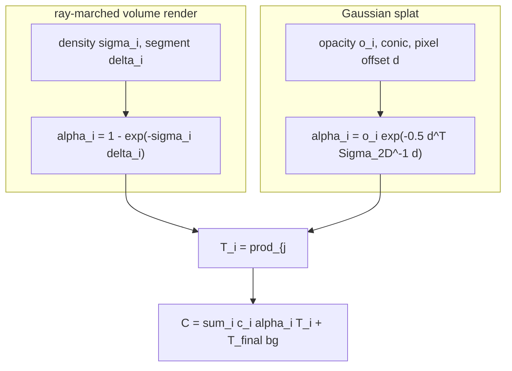

# A10 - 3D Gaussian splatting

## Motivation

For three years after the original NeRF paper, view synthesis meant training a coordinate MLP and querying it hundreds of times per ray. The quality was high and the cost was brutal: a single scene took hours to days on a GPU to train, and rendering one frame meant millions of MLP evaluations, far from interactive. A long line of work attacked the speed by adding explicit structure (voxel grids, hash grids, factored tensors) so the network had less to memorize. Instant-NGP's multiresolution hash grid ([Müller et al. 2022](https://arxiv.org/abs/2201.05989)) cut training to minutes, but rendering still marched samples along rays through a data structure.

3D Gaussian splatting ([Kerbl et al. 2023](https://arxiv.org/abs/2308.04079)) changed the representation instead of accelerating the query. A scene is a cloud of explicit 3D Gaussians, each a small translucent ellipsoid with a position, an anisotropic shape (a covariance), an opacity, and a color. Rendering projects each 3D Gaussian to a 2D Gaussian in the image and alpha-composites the projected blobs front to back. There is no network in the render path. A tile-based GPU rasterizer sorts the Gaussians by depth once per frame and blends them, so a trained scene renders at well over 100 frames per second at 1080p, while matching or beating the best NeRF variants on quality and training in tens of minutes. That combination, real-time rendering plus state-of-the-art quality plus a fast fit, is why the method took over view synthesis within months of publication.

The reason it fits cleanly into a course on differentiable 3D is the optimization frame. The Gaussian cloud is fit by gradient descent on photometric error: render the current Gaussians into each training camera, compare to the captured image, and backpropagate the pixel error into every Gaussian's position, shape, opacity, and color. This is differentiable optimization over an explicit 3D field, and it sits next to bundle adjustment in classical structure-from-motion. Bundle adjustment minimizes reprojection error (the pixel distance between a projected 3D point and its detected image feature) over 3D point positions and camera poses. Gaussian splatting minimizes photometric error (the color difference between a rendered pixel and the captured pixel) over 3D Gaussian parameters. Both are nonlinear least squares over a 3D scene seen through cameras; the splatting version replaces sparse feature correspondences with a dense rendered image and adds appearance to the unknowns. Methods that jointly optimize the Gaussians and the camera poses, like InstantSplat ([Fan et al. 2024](https://arxiv.org/abs/2403.20309)), make the bundle-adjustment parallel explicit.

This assignment builds the differentiable forward rasterizer in pure PyTorch (autograd, no custom CUDA) and fits a toy scene through it. The three pieces to implement make a 3D Gaussian renderable and trainable: the scale-plus-rotation factorization that turns unconstrained parameters into a valid 3D covariance, the EWA projection that linearizes perspective to turn a 3D Gaussian into a 2D screen-space Gaussian, and the depth-sorted alpha-compositing rasterizer. Densification, the heuristic that grows and prunes the cloud, is read-and-understand here; only an opacity prune is left to implement.

The compositing equation is the same one the NeRF assignment used. The ray-marched volume renderer composited per-sample colors along a ray with $C = \sum_i c_i \alpha_i \prod_{j<i}(1-\alpha_j)$; this rasterizer composites projected Gaussians front to back with the identical formula. Only the source of $\alpha$ changes. In the ray marcher $\alpha_i = 1 - \exp(-\sigma_i \delta_i)$ comes from the density and segment length of one sample along a ray. Here $\alpha_i = o_i \exp(-\tfrac12 d^\top \Sigma_{2D,i}^{-1} d)$ comes from a projected 2D Gaussian evaluated at the pixel. Same alpha compositing, different alpha. Put the two renderers side by side and the difference is one term: splatting kept the compositing and threw away the per-ray MLP.

Where this goes next. The 2D Gaussian splatting follow-up ([Huang et al. 2024](https://arxiv.org/abs/2403.17888)) replaces the 3D ellipsoids with oriented 2D disks (surfels), which gives well-defined surface normals and clean mesh extraction, the form most useful for mapping and SLAM in autonomous driving. The reference implementation everyone builds on is the gsplat library ([Ye et al. 2024](https://arxiv.org/abs/2409.06765)); this assignment writes the rasterizer from scratch rather than calling it, so the forbidden-imports test blocks gsplat and the other prebuilt rasterizers. Feed-forward splatting predicts the Gaussians in a single network pass instead of optimizing per scene: pixelSplat ([Charatan et al. 2023](https://arxiv.org/abs/2312.12337)) and MVSplat ([Chen et al. 2024](https://arxiv.org/abs/2403.14627)) regress a Gaussian cloud from a few input images, which matters for camera-rig reconstruction where you cannot afford a per-scene fit. 3D Gaussian splatting is also now a common scene representation in driving simulators and in SLAM back-ends.

## Background

The scene is $N$ Gaussians. Each has a world-space mean $\mu_w \in \mathbb{R}^3$, a 3D covariance $\Sigma_{3D} \in \mathbb{R}^{3\times3}$ stored in factored form, an opacity $o \in [0,1]$, and a color $c \in [0,1]^3$.

### The covariance factorization

A covariance must be symmetric positive semi-definite, and gradient descent on the six free entries of a symmetric $3\times3$ matrix does not preserve that. The factorization avoids the constraint. Store a rotation $R$ (from a quaternion $q$) and a per-axis scale $S = \mathrm{diag}(\exp(\text{log\_scales}))$, and define

$$\Sigma_{3D} = R S S^\top R^\top.$$

Since $S S^\top$ is diagonal with non-negative entries and $R$ is orthogonal, $\Sigma_{3D}$ is symmetric positive semi-definite for any parameter value, and it is differentiable everywhere the quaternion is nonzero. Storing log-scales keeps the standard deviations positive under unconstrained updates. The eigenvalues of $\Sigma_{3D}$ are exactly the squared scales $\exp(\text{log\_scales})^2$, because a rotation does not change eigenvalues; the covariance test checks this with distinct scales so the three eigenvalues are identifiable.

The quaternion is normalized to unit norm inside the forward pass, $\hat q = q / \lVert q \rVert$, so the parameter $q$ can drift in magnitude and the rotation stays valid. The normalization is singular at $q = 0$ (the direction is undefined), so gradcheck and the tests use order-one quaternions, identity plus small noise, never near-zero ones.

### The EWA projection

A 3D Gaussian does not project to an exact 2D Gaussian under a perspective camera, because perspective projection is nonlinear. Elliptical weighted average (EWA) splatting ([Zwicker et al., "EWA volume splatting", IEEE Visualization 2001](https://doi.org/10.1109/VISUAL.2001.964490), and "EWA splatting", IEEE TVCG 2002) handles this by linearizing the projection at each Gaussian's mean and pushing the covariance through that linear map.

The camera convention is OpenCV, $+z$ forward, matching `nanovision.geometry`. The mean goes to camera space as $\mu_c = R_{wc}\mu_w + t$, where $R_{wc}$ and $t$ are the rotation and translation of the world-to-camera transform. The pinhole projection is

$$\pi(x,y,z) = \left(f_x \tfrac{x}{z} + c_x,\; f_y \tfrac{y}{z} + c_y\right),$$

the same `project_points` the camera-geometry assignment uses. Its Jacobian at the camera-space mean is

$$J = \frac{\partial \pi}{\partial (x,y,z)} = \begin{bmatrix} f_x/z & 0 & -f_x x/z^2 \\ 0 & f_y/z & -f_y y/z^2 \end{bmatrix} \in \mathbb{R}^{2\times3}.$$

With $W = R_{wc}$ the world-to-camera rotation, the linear map from world space to image space is $J W$, and the covariance transforms as

$$\Sigma_{2D} = J\, W\, \Sigma_{3D}\, W^\top J^\top \in \mathbb{R}^{2\times2}.$$

Only the rotation $W$ enters; the translation shifts the mean, not the spread. The third row and column drop out because $J$ is $2\times3$. A small dilation is added to keep the result invertible:

$$\Sigma_{2D} \mathrel{+}= \lambda I, \qquad \lambda = 0.3 \text{ px}^2,$$

on the two diagonal entries. The dilation guarantees every Gaussian covers at least about a pixel and bounds the determinant away from zero, so the closed-form $2\times2$ inverse the rasterizer needs is safe. The original 3D Gaussian splatting uses $\lambda \approx 0.3$.

This Jacobian is the same $\partial\pi/\partial X$ that linearizes reprojection error in bundle adjustment. The use is different: bundle adjustment linearizes a residual (the projected point minus the observed feature) to take a Gauss-Newton step, while EWA propagates a covariance through the same linear map, $J \Sigma J^\top$. Same derivative, different object being transported.

The dilation is a fixed low-pass filter, and it leaves aliasing: a Gaussian that should shrink below a pixel when the camera zooms out instead stays pixel-sized, so detail flickers across scales. Mip-Splatting ([Yu et al. 2023](https://arxiv.org/abs/2311.16493)) replaces the fixed dilation with a scale-aware 3D smoothing filter plus a 2D mip filter that tracks the sampling rate, which removes the zoom-dependent artifacts. The course uses the fixed dilation.

### The rasterizer

Given projected means $\mu_i \in \mathbb{R}^2$, screen covariances $\Sigma_{2D,i}$, colors $c_i$, opacities $o_i$, and depths $z_i$, the render is:

1. Sort the Gaussians by depth, nearest first (ascending camera-space $z$). Gather every per-Gaussian tensor by the sort order.
2. Invert each $2\times2$ covariance once to get the conic $\Sigma_{2D,i}^{-1}$, in closed form. The $0.3$ dilation guards the determinant. Broadcast the conic over all pixels rather than inverting per pixel.
3. For pixel $x$ and Gaussian $i$, with $d = x - \mu_i$,

$$\alpha_i(x) = o_i \exp\!\left(-\tfrac12\, d^\top \Sigma_{2D,i}^{-1} d\right), \qquad \alpha_i \le 0.99.$$

4. Composite front to back with the exclusive transmittance $T_i = \prod_{j<i}(1-\alpha_j)$, $T_0 = 1$:

$$C(x) = \sum_i c_i\, \alpha_i(x)\, T_i(x) + T_{\text{final}}(x)\, \text{bg}.$$

This is the same exclusive-transmittance compositing as the ray-marched volume renderer. The two differ only in where $\alpha$ comes from:



The depth sort is non-differentiable: `argsort` is piecewise-constant in the parameters and carries no gradient. That is fine, because the sort only reorders the per-Gaussian tensors. Gradients flow through the gathered values (means, covariances, colors, opacities), so autograd is correct as long as the loss does not depend on `depths` through the sort key alone. The full-forward gradcheck takes gradients with respect to `means_w` and `opacity_logits` only, and deliberately keeps `depths` out of the gradcheck inputs.

The render here is vectorized over pixels: all $N$ Gaussians are evaluated against the $H \times W$ pixel grid with broadcasting, no Python tile loops. The real CUDA implementation is tile-based: it buckets Gaussians into 16x16 screen tiles and only blends the Gaussians that touch a tile, which makes it real-time at 1080p. The vectorized pure-PyTorch render is simpler to read and correct to differentiate, but it touches every Gaussian at every pixel, so it is slower than the tiled kernel and, at the tiny toy resolution here, not faster than the batched NeRF MLP. The viz measures the actual ratio rather than asserting one.

### Color

Each Gaussian stores a raw RGB triple squashed by a sigmoid to $[0,1]$. This is a toy view-independent color: the appearance does not change with viewing direction. It is not degree-0 spherical harmonics as an equality. True degree-0 SH stores one coefficient per channel scaled by the constant basis function $Y_0 = 1/(2\sqrt\pi)$; the sigmoid is just a convenient map to $[0,1]$ for the toy. View-dependent color (specular highlights that shift with the camera) needs degree-1 and higher SH, where each channel carries several coefficients evaluated against the viewing direction. The original 3D Gaussian splatting uses degree-3 SH. That is context here, not implemented.

### Densification (read-and-understand)

The differentiable fit alone cannot change the number of Gaussians, so the real method wraps it in adaptive density control (ADC), a non-differentiable outer loop run every few hundred steps. ADC clones under-reconstructed Gaussians (small, high positional gradient), splits over-reconstructed ones (large, high positional gradient) into smaller children, prunes Gaussians whose opacity falls below a threshold, and periodically resets all opacities toward zero so unhelpful Gaussians fade and get pruned while useful ones recover. ADC grows a sparse initialization into millions of Gaussians at the right local density. This assignment implements only `prune_low_opacity`; the rest is described in `densify.py` and out of graded scope.

## What to implement

- `quat_to_rotmat` and `build_covariance_3d` (`gaussian.py`): the quaternion-to-rotation map and the $\Sigma = RSS^\top R^\top$ factorization.
- `perspective_jacobian` and `project_cov_to_2d` (`project.py`): the $2\times3$ projection Jacobian and the EWA covariance projection $J W \Sigma W^\top J^\top + \lambda I$.
- `splat_render` (`render.py`): the depth-sorted, alpha-compositing rasterizer, vectorized over pixels.

Provided: the `GaussianModel` parameter container with its sigmoid opacity/color and random initializer; `project_gaussians` wiring; `prune_low_opacity`; `config.py`; `viz.py`.

## Tasks

1. `quat_to_rotmat(q)` (`gaussian.py`): normalize $q$ to unit norm, build the $3\times3$ rotation. $(N,4) \to (N,3,3)$.
2. `build_covariance_3d(quats, log_scales)` (`gaussian.py`): $R = $ `quat_to_rotmat(quats)`, $S = \mathrm{diag}(\exp(\text{log\_scales}))$, return $R S S^\top R^\top$. $(N,4),(N,3) \to (N,3,3)$.
3. `perspective_jacobian(means_cam, K)` (`project.py`): the $2\times3$ Jacobian above, per Gaussian, at the camera-space mean. $(N,3),(3,3) \to (N,2,3)$.
4. `project_cov_to_2d(cov3d, W, J)` (`project.py`): $J W \Sigma_{3D} W^\top J^\top + 0.3 I$, with $W$ the world-to-camera rotation. $(N,3,3),(3,3),(N,2,3) \to (N,2,2)$.
5. `splat_render(means2d, cov2d, colors, opacities, depths, H, W, bg)` (`render.py`): sort by depth, invert each conic once, evaluate the 2D Gaussian per pixel with $\alpha \le 0.99$, composite front to back with the exclusive transmittance. $\to (H,W,3)$.

## How to verify

Run with the env's python: `/home/tanmay/miniconda3/envs/nanovision/bin/python`. From the repo root, fill the solution and run

```
NANOVISION_IMPL=solution python -m pytest assignments/a10_gaussian_splatting/tests
```

The tests, in workflow order:

1. `test_covariance.py`: $\Sigma_{3D}$ symmetric PSD; for a unit quaternion and distinct scales the sorted eigenvalues equal the sorted $\exp(\text{log\_scales})^2$; float64 gradcheck of `build_covariance_3d` and `quat_to_rotmat` ($RR^\top = I$, $\det R = 1$). Uses order-one quaternions.
2. `test_projection.py`: `perspective_jacobian` matches a finite-difference Jacobian of `project_points`; `project_cov_to_2d` is symmetric with positive eigenvalues; float64 gradcheck of the EWA step.
3. `test_render_forward.py`: one centered Gaussian is a blob brightest at the center; output is $(H,W,3)$ in $[0,1]$; two overlapping opaque Gaussians, the nearer color dominates, and swapping depths swaps the winner; all opacities zero gives the background.
4. `test_render_grad.py`: float64 gradcheck through the full forward (means and pose to project to render) with respect to `means_w` and `opacity_logits` only.
5. `test_overfit_image.py`: fit $N=64$ Gaussians to one 16x16 view with Adam and an L1 loss for 400 steps; the loss drops below 0.02.
6. `test_forbidden_imports.py`: a static scan blocking gsplat, diff_gaussian_rasterization, nerfstudio, simple_knn. Passes with the holes in place.

Default mode (no `NANOVISION_IMPL`) fails at the holes with `NotImplementedError`, except the forbidden-imports scan, which passes in both modes.

## Compute notes

Every test runs on CPU in seconds. The graded renders are 16x16 with a few dozen Gaussians; the overfit fit is 400 Adam steps and finishes in a few seconds. The L1 floor was measured at build time: from a 0.10-0.14 start the loss reaches about 0.005-0.007, so the threshold is 0.02, comfortably above the floor. A correct fit shows a monotone L1 drop in the first few dozen steps; a flat loss means a projection sign error, a wrong transmittance, or a broken sort.

The viz fit (`python -m assignments.a10_gaussian_splatting.viz`) runs on the GPU when one is present (`nanovision.determinism.default_device`), fits 200 Gaussians to the 32x32 multi-view scene for 1500 steps, and reaches roughly 25 dB held-out PSNR in a few seconds. It also times one rendered view against the ray-marched NeRF and prints the measured ratio. On an RTX 4080 at 32x32 the pure-PyTorch splat is about the same speed as the NeRF (around 0.9x), because without tile culling it evaluates every Gaussian at every pixel; the real-time advantage shows up at high resolution with the tiled CUDA kernel, not at this toy scale. The number is whatever the run measures.

## Stretch goals

- Add a tile-based culling pass: bucket Gaussians into screen tiles by their projected bounding box and blend only the Gaussians that touch each tile. Measure how the speedup ratio changes with image size.
- Implement degree-1 spherical harmonics for view-dependent color and check whether the held-out PSNR improves on a scene with a specular highlight.
- Add the full adaptive density control loop (clone, split, prune, opacity reset) around the fit and watch the Gaussian count adapt to the scene.

## Further reading

- [Kerbl et al. 2023, "3D Gaussian Splatting for Real-Time Radiance Field Rendering"](https://arxiv.org/abs/2308.04079): the original method, the tile rasterizer, ADC, and degree-3 SH.
- Zwicker et al., "EWA volume splatting", IEEE Visualization 2001 ([DOI](https://doi.org/10.1109/VISUAL.2001.964490)) and "EWA splatting", IEEE TVCG 2002: the covariance projection this assignment implements.
- [Yu et al. 2023, "Mip-Splatting: Alias-free 3D Gaussian Splatting"](https://arxiv.org/abs/2311.16493): the scale-aware filter that replaces the fixed dilation and removes zoom aliasing.
- [Huang et al. 2024, "2D Gaussian Splatting for Geometrically Accurate Radiance Fields"](https://arxiv.org/abs/2403.17888): surfels with normals and clean meshing, the form useful for mapping and SLAM.
- [Ye et al. 2024, "gsplat: An Open-Source Library for Gaussian Splatting"](https://arxiv.org/abs/2409.06765): the reference rasterizer the field builds on (blocked by the forbidden-imports test here).
- [Charatan et al. 2023, "pixelSplat"](https://arxiv.org/abs/2312.12337) and [Chen et al. 2024, "MVSplat"](https://arxiv.org/abs/2403.14627): feed-forward Gaussian prediction from sparse views, no per-scene optimization.
