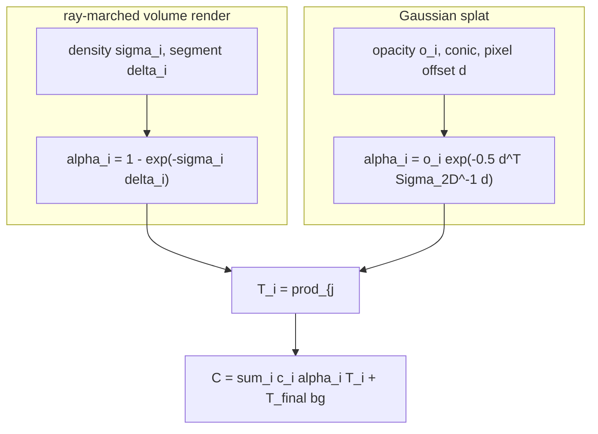

# A10 - 3D Gaussian splatting

3D Gaussian splatting represents a scene as an explicit cloud of small translucent ellipsoids,
each a 3D Gaussian with a position, an anisotropic shape, an opacity, and a color. Rendering
projects each 3D Gaussian to a 2D Gaussian in the image and alpha-composites the projected blobs
front to back, with no network in the render path. The cloud is fit by gradient descent on
photometric error: render the current Gaussians into each training camera, compare to the
captured image, and backpropagate the pixel error into every Gaussian's parameters.

This assignment builds the differentiable forward rasterizer in pure PyTorch (autograd, no
custom CUDA) and fits a toy scene through it. Implement the scale-plus-rotation factorization
that turns unconstrained parameters into a valid 3D covariance, the EWA projection that
linearizes perspective to turn a 3D Gaussian into a 2D screen-space Gaussian, and the
depth-sorted alpha-compositing rasterizer. Densification, the heuristic that grows and prunes
the cloud, is read-and-understand here; only an opacity prune is implemented.

The compositing equation is the same one the volume rendering integral used. The ray-marched
renderer composited per-sample colors along a ray with
$C = \sum_i c_i \alpha_i \prod_{j<i}(1-\alpha_j)$; this rasterizer composites projected Gaussians
front to back with the identical formula. Only the source of $\alpha$ changes. Build the two
renderers side by side and the difference is one term: splatting kept the compositing and threw
away the per-ray MLP.

Required reading before starting:
- Kerbl et al. 2023, "3D Gaussian Splatting for Real-Time Radiance Field Rendering",
  [arXiv:2308.04079](https://arxiv.org/abs/2308.04079).
- Zwicker et al. 2001, "EWA Volume Splatting", IEEE Visualization,
  [DOI:10.1109/VISUAL.2001.964490](https://doi.org/10.1109/VISUAL.2001.964490) (and the 2002
  TVCG "EWA Splatting" follow-up): the covariance projection.

## Lecture notes

### Why Gaussian splatting

For three years after the original NeRF, view synthesis meant training a coordinate MLP and
querying it hundreds of times per ray. The quality was high and the cost was brutal: a single
scene took hours to days on a GPU to train, and rendering one frame meant millions of MLP
evaluations, far from interactive. A long line of work attacked the speed by adding explicit
structure (voxel grids, hash grids, factored tensors) so the network had less to memorize.
Instant-NGP's multiresolution hash grid (Müller et al. 2022,
[arXiv:2201.05989](https://arxiv.org/abs/2201.05989)) cut training to minutes, but rendering
still marched samples along rays through a data structure.

3D Gaussian splatting (Kerbl et al. 2023) changed the representation instead of accelerating the
query. A scene is a cloud of explicit 3D Gaussians. Rendering projects each to a 2D Gaussian and
alpha-composites front to back; there is no network in the render path. A tile-based GPU
rasterizer sorts the Gaussians by depth once per frame and blends them, so a trained scene
renders at well over 100 frames per second at 1080p, while matching or beating the best NeRF
variants on quality and training in tens of minutes. Real-time rendering plus state-of-the-art
quality plus a fast fit is why the method took over view synthesis within months of publication.

The Gaussian cloud is fit by differentiable optimization over an explicit 3D field, which sits
next to bundle adjustment in classical structure-from-motion. Bundle adjustment minimizes
reprojection error (the pixel distance between a projected 3D point and its detected image
feature) over 3D point positions and camera poses. Gaussian splatting minimizes photometric
error (the color difference between a rendered pixel and the captured pixel) over 3D Gaussian
parameters. Both are nonlinear least squares over a 3D scene seen through cameras; the splatting
version replaces sparse feature correspondences with a dense rendered image and adds appearance
to the unknowns. Methods that jointly optimize the Gaussians and the camera poses, like
InstantSplat (Fan et al. 2024, [arXiv:2403.20309](https://arxiv.org/abs/2403.20309)), make the
bundle-adjustment parallel explicit.

### The covariance factorization

A scene is $N$ Gaussians. Each has a world-space mean $\mu_w \in \mathbb{R}^3$, a 3D covariance
$\Sigma_{3D} \in \mathbb{R}^{3\times3}$ stored in factored form, an opacity $o \in [0,1]$, and a
color $c \in [0,1]^3$.

A covariance must be symmetric positive semi-definite, and gradient descent on the six free
entries of a symmetric $3\times3$ matrix does not preserve that. The factorization avoids the
constraint. Store a rotation $R$ (from a quaternion $q$) and a per-axis scale
$S = \mathrm{diag}(\exp(\text{log-scales}))$, and define

$$\Sigma_{3D} = R S S^\top R^\top.$$

Since $S S^\top$ is diagonal with non-negative entries and $R$ is orthogonal, $\Sigma_{3D}$ is
symmetric positive semi-definite for any parameter value, and it is differentiable everywhere the
quaternion is nonzero. Storing log-scales keeps the standard deviations positive under
unconstrained updates. The eigenvalues of $\Sigma_{3D}$ are exactly the squared scales, because
a rotation does not change eigenvalues.

The quaternion is normalized to unit norm inside the forward pass, $\hat q = q / \lVert q \rVert$,
so the parameter $q$ can drift in magnitude and the rotation stays valid. The normalization is
singular at $q = 0$ (the direction is undefined), so order-one quaternions are safe to
differentiate and near-zero ones are not.

### The EWA projection

A 3D Gaussian does not project to an exact 2D Gaussian under a perspective camera, because
perspective projection is nonlinear. Elliptical weighted average (EWA) splatting (Zwicker et al.
2001, 2002) handles this by linearizing the projection at each Gaussian's mean and pushing the
covariance through that linear map.

The camera convention is OpenCV, $+z$ forward. The mean goes to camera space as
$\mu_c = R_{wc}\mu_w + t$, where $R_{wc}$ and $t$ are the rotation and translation of the
world-to-camera transform. The pinhole projection is

$$\pi(x,y,z) = \left(f_x \tfrac{x}{z} + c_x,\; f_y \tfrac{y}{z} + c_y\right),$$

the same pinhole projection the camera-geometry assignment uses. Its Jacobian at the camera-space
mean is

$$J = \frac{\partial \pi}{\partial (x,y,z)} = \begin{bmatrix} f_x/z & 0 & -f_x x/z^2 \\ 0 & f_y/z & -f_y y/z^2 \end{bmatrix} \in \mathbb{R}^{2\times3}.$$

With $W = R_{wc}$ the world-to-camera rotation, the linear map from world space to image space is
$J W$, and the covariance transforms as

$$\Sigma_{2D} = J\, W\, \Sigma_{3D}\, W^\top J^\top \in \mathbb{R}^{2\times2}.$$

Only the rotation $W$ enters; the translation shifts the mean, not the spread. The third row and
column drop out because $J$ is $2\times3$. A small dilation is added to keep the result
invertible:

$$\Sigma_{2D} \mathrel{+}= \lambda I, \qquad \lambda \approx 0.3 \text{ px}^2,$$

on the two diagonal entries. The dilation guarantees every Gaussian covers at least about a pixel
and bounds the determinant away from zero, so the closed-form $2\times2$ inverse the rasterizer
needs is safe. The original 3D Gaussian splatting uses $\lambda \approx 0.3$.

This Jacobian is the same $\partial\pi/\partial X$ that linearizes reprojection error in bundle
adjustment. The use is different: bundle adjustment linearizes a residual (the projected point
minus the observed feature) to take a Gauss-Newton step, while EWA propagates a covariance
through the same linear map, $J \Sigma J^\top$. Same derivative, different object being
transported.

The dilation is a fixed low-pass filter, and it leaves aliasing: a Gaussian that should shrink
below a pixel when the camera zooms out instead stays pixel-sized, so detail flickers across
scales. Mip-Splatting (Yu et al. 2023, [arXiv:2311.16493](https://arxiv.org/abs/2311.16493))
replaces the fixed dilation with a scale-aware 3D smoothing filter plus a 2D mip filter that
tracks the sampling rate, which removes the zoom-dependent artifacts. The course uses the fixed
dilation.

### The rasterizer

Given projected means $\mu_i \in \mathbb{R}^2$, screen covariances $\Sigma_{2D,i}$, colors $c_i$,
opacities $o_i$, and depths $z_i$, the render is:

1. Sort the Gaussians by depth, nearest first (ascending camera-space $z$). Gather every
   per-Gaussian tensor by the sort order.
2. Invert each $2\times2$ covariance once to get the conic $\Sigma_{2D,i}^{-1}$, in closed form.
   The dilation guards the determinant. Broadcast the conic over all pixels rather than inverting
   per pixel.
3. For pixel $x$ and Gaussian $i$, with $d = x - \mu_i$,

$$\alpha_i(x) = o_i \exp\!\left(-\tfrac12\, d^\top \Sigma_{2D,i}^{-1} d\right), \qquad \alpha_i \le 0.99.$$

4. Composite front to back with the exclusive transmittance $T_i = \prod_{j<i}(1-\alpha_j)$,
   $T_0 = 1$:

$$C(x) = \sum_i c_i\, \alpha_i(x)\, T_i(x) + T_{\text{final}}(x)\, \text{bg}.$$

This is the same exclusive-transmittance compositing as the ray-marched volume renderer. The two
differ only in where $\alpha$ comes from:



The depth sort is non-differentiable: an argsort is piecewise-constant in the parameters and
carries no gradient. That is fine, because the sort only reorders the per-Gaussian tensors.
Gradients flow through the gathered values (means, covariances, colors, opacities), so autograd is
correct as long as the loss does not depend on the depths through the sort key alone.

A correct render is vectorized over pixels: all $N$ Gaussians are evaluated against the
$H \times W$ pixel grid with broadcasting, no Python tile loops. The real CUDA implementation is
tile-based: it buckets Gaussians into 16x16 screen tiles and only blends the Gaussians that touch
a tile, which makes it real-time at 1080p. The vectorized pure-PyTorch render is simpler to read
and correct to differentiate, but it touches every Gaussian at every pixel, so it is slower than
the tiled kernel and, at a tiny resolution, not necessarily faster than a batched NeRF MLP.

### Color

A toy view-independent color stores a raw RGB triple squashed by a sigmoid to $[0,1]$; the
appearance does not change with viewing direction. This is not degree-0 spherical harmonics as an
equality. True degree-0 SH stores one coefficient per channel scaled by the constant basis
function $Y_0 = 1/(2\sqrt\pi)$; the sigmoid is a convenient map to $[0,1]$. View-dependent color
(specular highlights that shift with the camera) needs degree-1 and higher SH, where each channel
carries several coefficients evaluated against the viewing direction. The original 3D Gaussian
splatting uses degree-3 SH.

### Densification

The differentiable fit alone cannot change the number of Gaussians, so the real method wraps it
in adaptive density control (ADC), a non-differentiable outer loop run every few hundred steps.
ADC clones under-reconstructed Gaussians (small, high positional gradient), splits
over-reconstructed ones (large, high positional gradient) into smaller children, prunes Gaussians
whose opacity falls below a threshold, and periodically resets all opacities toward zero so
unhelpful Gaussians fade and get pruned while useful ones recover. ADC grows a sparse
initialization into millions of Gaussians at the right local density.

### Where this goes next

The 2D Gaussian splatting follow-up (Huang et al. 2024,
[arXiv:2403.17888](https://arxiv.org/abs/2403.17888)) replaces the 3D ellipsoids with oriented 2D
disks (surfels), which gives well-defined surface normals and clean mesh extraction, the form most
useful for mapping and SLAM in autonomous driving. The reference implementation everyone builds
on is the gsplat library (Ye et al. 2024,
[arXiv:2409.06765](https://arxiv.org/abs/2409.06765)). Feed-forward splatting predicts the
Gaussians in a single network pass instead of optimizing per scene: pixelSplat (Charatan et al.
2023, [arXiv:2312.12337](https://arxiv.org/abs/2312.12337)) and MVSplat (Chen et al. 2024,
[arXiv:2403.14627](https://arxiv.org/abs/2403.14627)) regress a Gaussian cloud from a few input
images, which matters for camera-rig reconstruction where a per-scene fit is too slow. 3D
Gaussian splatting is also now a common scene representation in driving simulators and SLAM
back-ends.

## The assignment

Implement the covariance factorization, the EWA projection, and the rasterizer. The
`GaussianModel` parameter container (with its sigmoid opacity and color and its random
initializer), the projection wiring, the opacity prune, the config, and the viz are provided.
Each file's docstrings give the exact signatures, shapes, and conventions (the quaternion order
$(w,x,y,z)$ with the real part first, the dilation value, and which transform's rotation block to
use). Read those in the files; this section maps each file to the concept above.

### Files to modify

`gaussian.py` is the representation. Implement `quat_to_rotmat` (normalize the quaternion, build
the $3\times3$ rotation) and `build_covariance_3d` (the $\Sigma = RSS^\top R^\top$ factorization
from the covariance section).

`project.py` is the EWA projection. Implement `perspective_jacobian` (the $2\times3$ Jacobian of
the pinhole projection, per Gaussian, at the camera-space mean) and `project_cov_to_2d` (the EWA
covariance projection $JW\Sigma W^\top J^\top + \lambda I$, with $W$ the world-to-camera
rotation).

`render.py` is the rasterizer. Implement `splat_render`: depth-sort the Gaussians and gather the
per-Gaussian tensors, invert each conic once, evaluate the 2D Gaussian per pixel with $\alpha$
clamped at $0.99$, and composite front to back with the exclusive transmittance. Keep the depth
sort out of the gradient path; gradients flow through the gathered values.

The rasterizer is assignment-local and not reused downstream, so these files are imported by bare
name rather than through a `nanovision` shim.

### Running and validating

Activate the environment (`conda activate nanovision`), then:

```
make test     A=a10_gaussian_splatting   # run the tests against your top-level files (red until the holes are filled)
make verify   A=a10_gaussian_splatting   # run the same tests against the reference solution/ (green from the start)
make viz      A=a10_gaussian_splatting   # render the figures from the reference solution
make viz-mine A=a10_gaussian_splatting   # render the figures from your own code (once the holes are filled)
```

`make test` is the command to run while working. It runs the suite in `tests/` against the
top-level files (the ones with the holes) and goes from red (the holes raise
`NotImplementedError`) to green as you fill them in. `make verify` runs the identical suite
against the reference in `solution/`: it sets `NANOVISION_IMPL=solution`, so the tests import the
reference implementation instead of the top-level files. `make verify` is green from the start,
so it shows the target and confirms the tests and the environment work before anything changes.
The goal is to bring `make test` to the same green as `make verify`.

The suite checks, in workflow order: the covariance is symmetric PSD and its sorted eigenvalues
equal the sorted squared scales, with a float64 gradcheck of `build_covariance_3d` and
`quat_to_rotmat` (using order-one quaternions, since the normalization is singular at $q=0$); the
perspective Jacobian matches a finite-difference Jacobian of the pinhole projection, and the EWA
covariance is symmetric with positive eigenvalues, with a float64 gradcheck; the render forward
(one centered Gaussian is a blob brightest at the center, output in $[0,1]$, two overlapping
opaque Gaussians let the nearer color dominate and swapping depths swaps the winner, all-zero
opacity gives the background); a float64 gradcheck through the full forward with respect to the
means and opacity logits only; an end-to-end fit of 64 Gaussians to one 16x16 view; and a static
scan blocking prebuilt rasterizers (gsplat, diff_gaussian_rasterization, nerfstudio, simple_knn).
The forbidden-imports scan passes with the holes in place.

`make viz` renders from the reference solution, so it works on a fresh checkout before any holes
are filled and shows the target figures. `make viz-mine` runs the same script against your
top-level code, which is the way to eyeball whether a finished implementation behaves; it needs
the holes filled, since it trains a model with them. Both write `splat_fit.png` (target vs render
for a training view and a held-out view), `psnr_curve.png` (held-out PSNR over training), and
`speed.png` (the measured per-view render time of the splat against the ray-marched NeRF) to
`out/`, using matplotlib's headless Agg backend so the commands behave the same over SSH, in WSL,
and in CI with no display. The viz fit runs on the GPU when one is present. Add `SHOW=1` (for
example `make viz-mine A=a10_gaussian_splatting SHOW=1`) to also open the figures in interactive
windows when a display is available.

What you should see when you run this. The overfit test drives the L1 loss from a roughly
0.10-0.14 start down to about 0.005-0.007 in 400 steps, so the 0.02 threshold sits comfortably
above the floor; the floor was measured at build time. A correct fit shows a monotone L1 drop in
the first few dozen steps. A flat loss means a projection sign error, a wrong transmittance, or a
broken sort. The viz fit reaches roughly 25 dB held-out PSNR in a few seconds on a 32x32 scene.
The printed speed ratio is whatever the run measures: at this toy scale the untiled pure-PyTorch
render is about the same speed as the NeRF (around 0.9x on an RTX 4080 at 32x32), because without
tile culling it evaluates every Gaussian at every pixel. These are toy artifacts. The real-time
advantage shows up at high resolution with the tiled CUDA kernel, not at this scale.

## Stretch goals

- Add a tile-based culling pass: bucket Gaussians into screen tiles by their projected bounding
  box and blend only the Gaussians that touch each tile. Measure how the speedup ratio changes
  with image size.
- Implement degree-1 spherical harmonics for view-dependent color and check whether the held-out
  PSNR improves on a scene with a specular highlight.
- Add the full adaptive density control loop (clone, split, prune, opacity reset) around the fit
  and watch the Gaussian count adapt to the scene.

## References

- Kerbl et al. 2023, "3D Gaussian Splatting for Real-Time Radiance Field Rendering",
  [arXiv:2308.04079](https://arxiv.org/abs/2308.04079): the original method, the tile rasterizer,
  ADC, and degree-3 SH.
- Zwicker et al. 2001, "EWA Volume Splatting", IEEE Visualization,
  [DOI:10.1109/VISUAL.2001.964490](https://doi.org/10.1109/VISUAL.2001.964490), and the 2002 TVCG
  "EWA Splatting" follow-up: the covariance projection this assignment implements.
- Müller et al. 2022, Instant-NGP, [arXiv:2201.05989](https://arxiv.org/abs/2201.05989).
- Yu et al. 2023, "Mip-Splatting", [arXiv:2311.16493](https://arxiv.org/abs/2311.16493): the
  scale-aware filter that replaces the fixed dilation and removes zoom aliasing.
- Huang et al. 2024, "2D Gaussian Splatting",
  [arXiv:2403.17888](https://arxiv.org/abs/2403.17888): surfels with normals and clean meshing.
- Fan et al. 2024, "InstantSplat", [arXiv:2403.20309](https://arxiv.org/abs/2403.20309): joint
  Gaussian and pose optimization.
- Ye et al. 2024, "gsplat", [arXiv:2409.06765](https://arxiv.org/abs/2409.06765): the reference
  rasterizer the field builds on (blocked by the forbidden-imports test here).
- Charatan et al. 2023, "pixelSplat",
  [arXiv:2312.12337](https://arxiv.org/abs/2312.12337), and Chen et al. 2024, "MVSplat",
  [arXiv:2403.14627](https://arxiv.org/abs/2403.14627): feed-forward Gaussian prediction from
  sparse views, no per-scene optimization.
