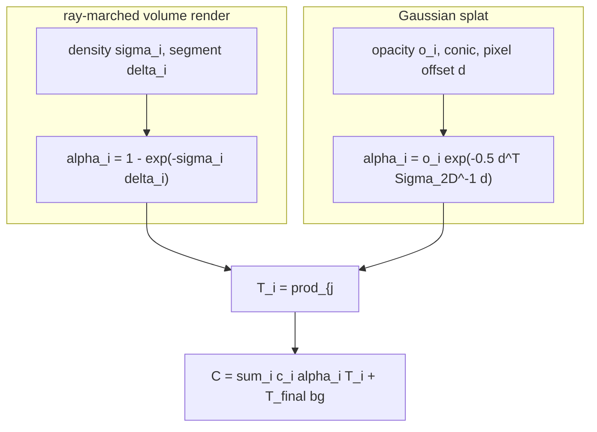

# A10 - 3D Gaussian splatting

3D Gaussian splatting stores a scene as an explicit cloud of small translucent ellipsoids, each a
3D Gaussian with a position, an anisotropic shape, an opacity, and a color. Rendering projects
each 3D Gaussian to a 2D Gaussian in the image and alpha-composites the projected blobs front to
back, with no network in the render path. The cloud is fit by gradient descent on photometric
error: render the current Gaussians into each training camera, compare to the captured image, and
push the pixel error back to every Gaussian's parameters by the chain rule.

This assignment builds the differentiable forward rasterizer in pure PyTorch, with gradients from
autograd rather than a hand-written CUDA backward pass, and fits a toy scene through it. The
holes are the scale-plus-rotation factorization that turns unconstrained parameters into a valid
3D covariance, the EWA projection that linearizes perspective to turn a 3D Gaussian into a 2D
screen-space Gaussian, and the depth-sorted alpha-compositing rasterizer. Densification, the
heuristic that grows and prunes the cloud, is read-and-understand here; only an opacity prune is
implemented.

The last step of the render is the same front-to-back "over" chain the ray-marched volume
renderer ended with, $C = \sum_i c_i \alpha_i \prod_{j<i}(1-\alpha_j)$. What changes is where
$\alpha$ comes from and where the ordering comes from: a projected 2D Gaussian evaluated at the
pixel instead of $1 - \exp(-\sigma\delta)$ on a ray segment, and a depth sort over primitives
instead of a march along $t$. Splatting keeps the compositing and drops the per-ray network.

Required reading before starting:
- Kerbl et al. 2023, "3D Gaussian Splatting for Real-Time Radiance Field Rendering",
  [arXiv:2308.04079](https://arxiv.org/abs/2308.04079).
- Zwicker et al. 2001, "EWA Volume Splatting", IEEE Visualization,
  [DOI:10.1109/VISUAL.2001.964490](https://doi.org/10.1109/VISUAL.2001.964490) (and the 2002
  TVCG "EWA Splatting" follow-up): the covariance projection.

## Lecture notes

### Why Gaussian splatting

For three years after the original NeRF, view synthesis meant training a coordinate MLP and
querying it hundreds of times per ray. The quality was high and the cost was severe: a single
scene took hours to days on a GPU to train, and rendering one frame meant millions of MLP
evaluations, far from interactive. A line of work attacked the speed by moving part of the scene
out of the network weights and into an explicit data structure the network could read. A dense
voxel grid stores a feature vector at each grid corner and interpolates between them, so the MLP
only has to decode a local feature instead of memorizing the whole scene. A multiresolution hash
grid does the same at several resolutions, with each grid's entries held in a fixed-size hash
table so memory stays bounded even at fine resolution. A tensor factorization stores the volume
as a low-rank sum of outer products of per-axis vectors and matrices, trading exactness for a
much smaller parameter count. Instant-NGP's hash grid (Müller et al. 2022,
[arXiv:2201.05989](https://arxiv.org/abs/2201.05989)) cut training from hours to seconds, but
rendering still marched samples along rays and queried a network at every sample.

3D Gaussian splatting (Kerbl et al. 2023) changed the representation instead of accelerating the
query. A scene is a cloud of explicit 3D Gaussians. Rendering projects each to a 2D Gaussian and
alpha-composites front to back; there is no network in the render path. A tile-based GPU
rasterizer sorts the Gaussians by depth once per frame and blends them, so a trained scene
renders in real time at 1080p, which the paper summarizes as at least 30 frames per second and
reports above 100 on several scenes, while matching or beating the strongest NeRF variants on
image quality and fitting in tens of minutes. The method spread through view synthesis within
months of publication because it renders in real time without giving up NeRF-level quality.

### What a 3D Gaussian is

The primitive is the multivariate normal shape, used as a blob of material rather than as a
probability. Recall the density of a normal with mean $\mu$ and covariance $\Sigma$ in
$\mathbb{R}^3$:

$$\mathcal{N}(x;\mu,\Sigma) = \frac{1}{(2\pi)^{3/2}\lvert\Sigma\rvert^{1/2}}
\exp\!\left(-\tfrac12 (x-\mu)^\top \Sigma^{-1} (x-\mu)\right).$$

The quantity in the exponent, $(x-\mu)^\top \Sigma^{-1} (x-\mu)$, is the squared Mahalanobis
distance: the displacement from the mean measured in units of the spread in each direction, so a
point one standard deviation out along any axis has squared Mahalanobis distance 1. Its level
sets are ellipsoids. Writing the eigendecomposition $\Sigma = U \Lambda U^\top$, the columns of
$U$ are the ellipsoid's axis directions and $\sqrt{\lambda_i}$ is the standard deviation along
axis $i$, which is the semi-axis length of the one-sigma ellipsoid. Isotropic means all three
eigenvalues equal, so the ellipsoid is a ball; anisotropic means they differ, so the blob can be
long and thin or flat like a disk.

A splat is that shape without the normalization. Drop the $(2\pi)^{-3/2}\lvert\Sigma\rvert^{-1/2}$
factor and multiply by a stored opacity $o \in [0,1]$, so the value at the center is exactly $o$
and it falls off with Mahalanobis distance. The result is not a probability density and does not
integrate to one; it is a soft ellipsoidal lump of colored, partly transparent material, with $o$
its opacity at the densest point.

Three properties make this shape convenient for rendering. It stays Gaussian under a linear map,
which the projection step below uses directly. It is smooth everywhere, so every pixel it touches
returns a gradient to its position, shape, opacity, and color, with no hard boundary where the
gradient jumps or vanishes. And its anisotropy lets one primitive cover a flat surface patch that
would take many spheres.

A scene is $N$ of these. Each carries a world-space mean $\mu_w \in \mathbb{R}^3$, a 3D
covariance $\Sigma_{3D} \in \mathbb{R}^{3\times3}$ stored in factored form, an opacity
$o \in [0,1]$, and a color $c \in [0,1]^3$.

### Keeping the parameters valid

Only the mean is a free vector. The covariance has to be a valid covariance, and the opacity and
the color have to stay in $[0,1]$, and plain gradient descent respects neither requirement. The
fix in every case is the same: store an unconstrained number and map it into the valid set inside
the forward pass.

Start with the covariance. It must be symmetric positive semi-definite, and the requirement is
not bookkeeping. If $\Sigma$ picks up a negative eigenvalue, then $\Sigma^{-1}$ has one too, the
quadratic form $d^\top \Sigma^{-1} d$ goes negative along that direction, and
$\exp(-\tfrac12 d^\top \Sigma^{-1} d)$ grows without bound as $d$ moves away from the center. The
blob stops being an ellipse and becomes a hyperbolic ridge that brightens toward infinity. The
symmetric positive semi-definite matrices form a convex cone inside the six-dimensional space of
symmetric $3\times3$ matrices, with its boundary where the smallest eigenvalue reaches zero, and
an unconstrained step on those six entries can walk straight out of the cone with nothing to pull
it back.

The factorization sidesteps the constraint by construction. Store a rotation $R$ (built from a
quaternion $q$) and a per-axis scale $S = \mathrm{diag}(\exp(\ell))$ with $\ell$ the stored
log-scales, set $M = RS$, and define

$$\Sigma_{3D} = M M^\top = R S S^\top R^\top.$$

For any vector $v$, $v^\top M M^\top v = \lVert M^\top v \rVert^2 \ge 0$, so the result is
positive semi-definite for every parameter value, and $MM^\top$ is symmetric for the same reason.
No constraint, no projection back onto the cone, no eigendecomposition in the loop. The
factorization also reads geometrically: if $z$ is a standard normal 3-vector then $Mz + \mu$ has
covariance $MM^\top$, so $M$ is the map that takes the unit ball to the ellipsoid, $S$ setting the
three semi-axis lengths and $R$ orienting them.

The eigenvalues of $\Sigma_{3D}$ are exactly the squared scales. $R\,\mathrm{diag}(s^2)\,R^\top$
is an orthogonal similarity transform of a diagonal matrix, and a similarity transform does not
change eigenvalues, so the spectrum is $\{s_1^2, s_2^2, s_3^2\}$ whatever the rotation. The test
suite checks the sorted eigenvalues against the sorted squared scales, which catches a
transposed $R$ or a scale applied to rows instead of columns.

Scales are stored as logs because $s = e^{\ell}$ maps the whole real line onto the positive
reals, so an unconstrained update can never drive a standard deviation to zero or negative. A
fixed step in $\ell$ is a fixed ratio change in $s$, which suits a quantity that ranges over
orders of magnitude within one scene.

Opacity and color get the same treatment through the sigmoid,
$\mathrm{sig}(x) = 1/(1+e^{-x})$, which maps the real line onto the open interval $(0,1)$. The
stored parameter is the pre-sigmoid number, conventionally called a logit because the inverse map
$\log\big(p/(1-p)\big)$ is the log-odds. `GaussianModel` holds `opacity_logits` and
`color_logits` and exposes `opacities` and `colors` as their sigmoids, so gradient descent runs
unconstrained while the rendered values stay in range.

The rotation is stored as a quaternion $q = (w, x, y, z)$, real part first, and normalized to
unit norm inside the forward pass, $\hat q = q / \lVert q \rVert$. The stored $q$ can drift in
magnitude and the rotation it produces stays valid, which is the same reason the log and sigmoid
maps are there. Normalization is singular at $q = 0$, where the direction is undefined and the
derivative blows up, so order-one quaternions are safe to differentiate and near-zero ones are
not; the gradient checks in the test suite seed quaternions near the identity for exactly that
reason. Antipodal quaternions $q$ and $-q$ give the same rotation, so the parameterization is
two-to-one, which is harmless here since the optimizer only needs some path to a good rotation.

### Color and viewing direction

Real surfaces change color with the viewing angle. A specular highlight, the mirror-like bright
spot on a glossy surface, slides across the object as the camera moves, while diffuse color stays
put. Reproducing that means each Gaussian's color is a function on the sphere of viewing
directions, $c(\mathbf{d})$, not a single triple.

Representing a function on the sphere compactly is the same problem as representing a periodic
function on a circle, where the answer is a Fourier series: expand in
$1, \cos\theta, \sin\theta, \cos 2\theta, \dots$, ordered by frequency, and truncate once the
terms are finer than anything worth keeping. Spherical harmonics are the analogue on the sphere.
They are real-valued functions $Y_{\ell m}(\mathbf{d})$ indexed by a degree $\ell \ge 0$ and an
order $m$ running from $-\ell$ to $\ell$, so degree $\ell$ contributes $2\ell+1$ functions and
everything up to degree $\ell$ is $(\ell+1)^2$ functions. They are orthonormal over the sphere,
and higher degrees oscillate faster across it, exactly as higher Fourier terms do around the
circle. A per-Gaussian color is then a set of coefficients $k_{\ell m}$ per channel with

$$c(\mathbf{d}) = \sum_{\ell} \sum_{m=-\ell}^{\ell} k_{\ell m}\, Y_{\ell m}(\mathbf{d}).$$

At degree 0 there is a single basis function, the constant $Y_{00} = 1/(2\sqrt{\pi})$, so a
degree-0 color does not vary with direction at all. Degree 1 adds three functions linear in the
direction components, enough for a broad brightening on one side. The original 3D Gaussian
splatting goes to degree 3, which is 16 coefficients per channel and 48 numbers of appearance per
Gaussian: enough for soft, broad specular variation, not enough for a sharp mirror reflection,
which would need a high-degree expansion.

The toy here stores a raw RGB triple squashed by a sigmoid into $[0,1]$, with `sh_degree = 0` in
the config. That is view-independent color, matching what degree-0 spherical harmonics would give,
but it is not the same arithmetic: degree-0 spherical harmonics would store one coefficient per
channel, multiply by $1/(2\sqrt{\pi})$, and still need clamping to reach a displayable range,
while the sigmoid lands in $[0,1]$ directly. The toy scene is a diffuse sphere with no
view-dependent shading, so there is nothing for higher degrees to fit.

### Projecting a Gaussian into the image

The rasterizer needs each Gaussian's footprint in pixels: a 2D mean and a 2D covariance. Getting
there takes one exact fact and one approximation.

The exact fact is how a covariance moves through a linear map. If $x$ has mean $\mu$ and
covariance $\Sigma$ and $y = Ax$, then

$$\mathrm{Cov}(y) = \mathbb{E}\big[A(x-\mu)(x-\mu)^\top A^\top\big] = A\,\Sigma\,A^\top,$$

and when $x$ is Gaussian, $y$ is Gaussian too. This is the covariance propagation step of a
Kalman filter, the same $A \Sigma A^\top$ that pushes a state covariance through a linear motion
model.

The approximation is needed because perspective projection is not linear: it divides by depth.
The exact image of a 3D Gaussian under a divide-by-$z$ map is not a Gaussian and has no closed
form worth rendering with. Elliptical weighted average (EWA) splatting linearizes the projection
at each Gaussian's mean and pushes the covariance through that linear map, which is the same
first-order move an extended Kalman filter makes when the measurement model is nonlinear:
$\pi(\mu_c + \delta) \approx \pi(\mu_c) + J\delta$, then treat the spread as if $\pi$ really were
that affine map. The error grows with how much $J$ varies across the blob's extent, so it grows
with a Gaussian's angular size and with its distance from the optical axis. Small blobs, which
the fit produces anyway, stay accurate.

The name comes from texture filtering. Greene and Heckbert (1986) observed that when a textured
surface is viewed obliquely, the preimage of one square pixel in texture space is an ellipse, and
they filtered the texture by averaging the texels under an elliptical Gaussian weight over that
ellipse instead of point-sampling. Zwicker et al. (2001) ran the same geometry in the other
direction for volume rendering: each primitive is a 3D Gaussian reconstruction kernel, its image
footprint after the affine approximation is an elliptical Gaussian, and the renderer accumulates
those footprints into the image. An accumulated footprint is the "splat".

The camera convention is OpenCV, $+x$ right, $+y$ down, $+z$ forward into the scene. The mean
goes to camera space as $\mu_c = R_{c \leftarrow w}\,\mu_w + t$, where $R_{c \leftarrow w}$ and
$t$ are the rotation and translation of the world-to-camera transform (the code's `w2c`, the
inverse of the camera pose). The pinhole projection is

$$\pi(x,y,z) = \left(f_x \tfrac{x}{z} + c_x,\; f_y \tfrac{y}{z} + c_y\right),$$

the same pinhole projection the camera-geometry primitives use. Its Jacobian at the camera-space
mean is

$$J = \frac{\partial \pi}{\partial (x,y,z)} = \begin{bmatrix} f_x/z & 0 & -f_x x/z^2 \\ 0 & f_y/z & -f_y y/z^2 \end{bmatrix} \in \mathbb{R}^{2\times3},$$

the two rows being the derivatives of $u$ and $v$, and the third column carrying the
$-f_x x/z^2$ and $-f_y y/z^2$ terms that the quotient rule produces when differentiating the
divide by depth. Write $W = R_{c \leftarrow w}$
for the world-to-camera rotation, following both Zwicker's notation and the argument name in
`project.py`. The linear map from world space to image space is then $J W$, and the covariance
transforms as

$$\Sigma_{2D} = J\, W\, \Sigma_{3D}\, W^\top J^\top \in \mathbb{R}^{2\times2}.$$

(The letter $W$ also names the image width in the rasterizer section below and in the code. The
two never appear in the same expression.)

Only the rotation $W$ enters, because the translation of a rigid transform shifts the mean and
leaves the spread alone. The result is $2\times2$ rather than $3\times3$ because $J$ is
$2\times3$: the depth row and column drop out, so the operation projects onto the image plane
rather than merely changing basis.

This Jacobian is the same $\partial\pi/\partial X$ that linearizes reprojection error in bundle
adjustment. The use differs: bundle adjustment linearizes a residual, the projected point minus
the observed feature, to take a Gauss-Newton step, while EWA propagates a covariance through the
same linear map as $J \Sigma J^\top$. Same derivative, different object being transported.

### The dilation filter and aliasing

A small amount is added to the diagonal of every projected covariance:

$$\Sigma_{2D} \mathrel{+}= \lambda I, \qquad \lambda = 0.3 \text{ px}^2.$$

Adding $\lambda I$ is a blur, not a fudge factor. Convolving two Gaussians gives a Gaussian whose
covariance is the sum of the two covariances, so $\Sigma_{2D} + \lambda I$ is exactly the
footprint convolved with an isotropic Gaussian of standard deviation
$\sqrt{0.3} \approx 0.55$ px. That is a low-pass filter: it removes image detail finer than about
half a pixel.

The filter is there because the image is sampled at one point per pixel. A footprint much
narrower than the pixel spacing violates the sampling condition that a signal must be sampled
above twice its highest frequency, so moving the camera by a fraction of a pixel makes such a
Gaussian wink in and out as its peak crosses between sample points. Blurring it to at least
pixel width removes the frequencies the pixel grid cannot resolve. The same addition also bounds
the determinant away from zero, so the closed-form $2\times2$ inverse the rasterizer takes next
is numerically safe. The original 3D Gaussian splatting uses the same $\lambda = 0.3$, and the
assignment's `dilation` default matches.

A fixed $\lambda$ is the wrong filter at every scale but one, because the required filter width
depends on the sampling rate and the sampling rate changes as the camera moves. A Gaussian that
should shrink below a pixel when the camera pulls back instead stays pixel-sized, so it is too
wide at some distances and detail flickers as the view changes. Mip-Splatting (Yu et al. 2023,
[arXiv:2311.16493](https://arxiv.org/abs/2311.16493)) replaces the fixed dilation with a 3D
smoothing filter that band-limits each Gaussian according to the highest sampling rate any
training view demands of it, plus a 2D filter that approximates integrating over the pixel's area
at the current scale. The name refers to mipmaps, the prefiltered image pyramids graphics has
used against the same problem since the 1980s, where the pyramid level is picked from the local
sampling rate. The course uses the fixed dilation.

### The rasterizer

Given projected means $\mu_i \in \mathbb{R}^2$, screen covariances $\Sigma_{2D,i}$, colors $c_i$,
opacities $o_i$, and depths $z_i$, the render is a depth sort, a per-pixel Gaussian evaluation,
and a compositing pass.

The sort is by camera-space $z$ ascending, nearest first, and every per-Gaussian tensor is
gathered into that order so the compositing loop can walk front to back.

Each covariance is then inverted once. The rasterizer never needs $\Sigma_{2D}$ itself, only
$\Sigma_{2D}^{-1}$, since only the inverse appears in the Mahalanobis exponent. The level sets of
$d^\top \Sigma_{2D}^{-1} d = \text{const}$ are ellipses, and a quadratic curve in the plane is a
conic section, so graphics calls the inverse covariance the conic of the splat. For a $2\times2$
matrix the inverse is closed form,

$$\begin{bmatrix} a & b \\ c & d \end{bmatrix}^{-1} = \frac{1}{ad-bc}\begin{bmatrix} d & -b \\ -c & a \end{bmatrix},$$

with the dilation keeping $ad-bc$ away from zero. The inverse is computed once per Gaussian and
broadcast across all pixels, not recomputed per pixel.

For pixel $x$ and Gaussian $i$, with $d = x - \mu_i$ the offset from the splat center,

$$\alpha_i(x) = o_i \exp\!\left(-\tfrac12\, d^\top \Sigma_{2D,i}^{-1} d\right), \qquad \alpha_i \le 0.99.$$

The opacity $o_i$ is the peak value at the center and the exponential is the falloff in
Mahalanobis distance. The clamp keeps $1 - \alpha_i \ge 0.01$, so the transmittance in front of
any Gaussian never collapses to exactly zero and the Gaussians behind an opaque one still receive
a nonzero gradient.

Compositing is the front-to-back Porter-Duff "over" chain developed for the volume renderer,
applied here with no change. Each Gaussian is a layer, and putting a layer of color $c_i$ and
opacity $\alpha_i$ over what is behind it contributes $\alpha_i c_i$ and passes through a
fraction $1-\alpha_i$ of everything further back. Chaining that over the sorted list gives

$$C(x) = \sum_i c_i\, \alpha_i(x)\, T_i(x) + T_{\mathrm{final}}(x)\, \mathrm{bg},
\qquad T_i = \prod_{j<i}(1-\alpha_j), \qquad T_0 = 1.$$

$T_i$ is called the exclusive transmittance because the product runs over layers strictly in
front of $i$ and excludes $i$ itself; the empty product $T_0 = 1$ says nothing occludes the
nearest Gaussian. $T_{\mathrm{final}}$ is the transmittance surviving all $N$ layers, and it lets
the background through. Off-by-one here (an inclusive product, or $T$ shifted by one) still produces
a plausible-looking image, which is why the checks are exact rather than visual.

Three things differ from the ray-marched version of the same chain. The $\alpha$ has no
Beer-Lambert step behind it: there is no density and no segment length, only a learned peak
opacity times a Gaussian falloff. The ordering comes from sorting primitives by the depth of
their centers once per view rather than from marching $t$ along each ray, which is an
approximation whenever two Gaussians interpenetrate, since one global order cannot be right at
every pixel, and the error shows up as splats popping in and out as the camera moves. And the
same list of layers is shared by every pixel, with most Gaussians contributing $\alpha \approx 0$
at most of them.



The depth sort is not differentiable: an argsort is piecewise-constant in the parameters, so its
derivative is zero almost everywhere and undefined at the ties. That costs nothing here, because
the sort only reorders the per-Gaussian tensors. Gradients flow through the gathered values
(means, covariances, colors, opacities), so autograd is correct as long as the loss does not
depend on the depths through the sort key alone. The gradient check in the test suite excludes
the depths for that reason.

A correct render is vectorized over pixels: all $N$ Gaussians are evaluated against the
$H \times W$ pixel grid with broadcasting, no Python tile loops. The real CUDA implementation is
tile-based instead: it buckets Gaussians into 16x16 screen tiles by their projected bounding box
and blends only the Gaussians touching a tile, which brings it to real time at 1080p. The
vectorized pure-PyTorch render is simpler to read and correct to differentiate, but it touches
every Gaussian at every pixel, so it is slower than the tiled kernel and, at a tiny resolution,
not necessarily faster than a batched NeRF MLP.

### Fitting the cloud

With the render differentiable, fitting is ordinary gradient descent on the difference between
the render and the captured image. This assignment uses an L1 loss, the mean absolute difference
over pixels and channels. The original method uses a weighted mix of L1 and a structural
similarity term, $1 - \mathrm{SSIM}$, where SSIM compares small windows of the two images by
their local means, variances, and cross-covariance and so scores structure rather than per-pixel
error. On a 16x16 toy image the window statistics are degenerate, so the toy drops that term.

The optimizer is Adam, a first-order method that keeps a running average of each parameter's
gradient and of its squared gradient and steps along the first divided by the square root of the
second, so every parameter gets a step scaled to its own gradient history rather than one global
step size. On top of that, each parameter group gets its own learning rate: `config.py` sets 1e-3
for quaternions and 5e-3 for log-scales, 1e-2 for means and color logits, and 5e-2 for opacity
logits. The ordering follows how disruptive a change is. Rotating or resizing a Gaussian changes
which pixels it covers and how it interacts with every other Gaussian composited alongside it,
while raising its opacity or shifting its color only adjusts the contribution it already makes
where it already is, so shape moves cautiously and appearance does not have to. The original
method goes further and decays the position learning rate over training.

The whole fit sits next to bundle adjustment in classical structure-from-motion. Bundle
adjustment minimizes reprojection error, the pixel distance between a projected 3D point and its
detected image feature, over 3D point positions and camera poses. Gaussian splatting minimizes
photometric error, the color difference between a rendered pixel and the captured pixel, over 3D
Gaussian parameters. Both are nonlinear least squares over a 3D scene seen through cameras; the
splatting version replaces sparse feature correspondences with a dense rendered image and adds
appearance to the unknowns. Methods like InstantSplat (Fan et al. 2024,
[arXiv:2403.20309](https://arxiv.org/abs/2403.20309)) put the camera poses back among the
unknowns and optimize them jointly with the Gaussians, which is bundle adjustment with a
photometric residual.

### Densification

Gradient descent moves and reshapes the Gaussians it is given; it cannot create or delete any.
The real method therefore wraps the differentiable fit in adaptive density control (ADC), a
non-differentiable outer loop run every few hundred steps.

Its trigger is the positional gradient: the magnitude of the loss gradient with respect to a
Gaussian's projected 2D position, accumulated over recent iterations and over views. A large
value means the optimizer is being pulled hard, and in inconsistent directions, to move that
Gaussian, which is the signature of one blob trying to explain image content it cannot fit. What
to do about it depends on the Gaussian's size. If it is small relative to the scene, the region
is under-reconstructed, there simply are not enough primitives there, so ADC clones it and
displaces the copy along the gradient. If it is large, the region is over-reconstructed, one
broad blob is covering detail that needs several, so ADC splits it into two smaller children with
centers sampled from the parent's own Gaussian and their scales divided down.

Two removal rules balance the growth. Gaussians whose opacity has fallen below a threshold get
pruned, as do ones whose screen footprint has grown implausibly large. Every few thousand
iterations all opacities are reset toward zero, which forces each Gaussian to re-earn its opacity
from the photometric fit; the ones that were only papering over error, such as floaters sitting
just in front of a camera, never recover and are pruned on the next pass.

Together these rules grow the sparse point cloud that structure-from-motion already produced while
solving for the camera poses into millions of Gaussians, at the local density each part of the
scene needs. `densify.py` here implements the opacity prune only; the rest is
read-and-understand.

### Where this goes next

The 2D Gaussian splatting follow-up (Huang et al. 2024,
[arXiv:2403.17888](https://arxiv.org/abs/2403.17888)) replaces the 3D ellipsoids with oriented 2D
disks. Those are surfels, surface elements: a center, a normal, and a radius, describing a
surface as a cloud of small oriented patches with none of a mesh's connectivity, the same
primitive surfel-based SLAM mapping uses. A flat disk has an unambiguous normal, where a 3D
ellipsoid does not (its shortest axis is only a proxy), so the disk representation gives clean
surface normals and clean mesh extraction, the form most useful for mapping and SLAM in
autonomous driving. The
reference implementation everyone builds on is the gsplat library (Ye et al. 2024,
[arXiv:2409.06765](https://arxiv.org/abs/2409.06765)). Feed-forward splatting predicts the
Gaussians in a single network pass instead of optimizing per scene: pixelSplat (Charatan et al.
2023, [arXiv:2312.12337](https://arxiv.org/abs/2312.12337)) and MVSplat (Chen et al. 2024,
[arXiv:2403.14627](https://arxiv.org/abs/2403.14627)) regress a Gaussian cloud from a few input
images, which matters for camera-rig reconstruction where a per-scene fit is too slow. 3D
Gaussian splatting is also now a common scene representation in driving simulators and SLAM
back-ends.

## The assignment

Fill these holes, in order. Each is one `NotImplementedError` with a matching test; the docstring in each file gives the signature, shapes, and constraints.

1. [`quat_to_rotmat()`](gaussian.py) in `gaussian.py`
2. [`build_covariance_3d()`](gaussian.py) in `gaussian.py`
3. [`perspective_jacobian()`](project.py) in `project.py`
4. [`project_cov_to_2d()`](project.py) in `project.py`
5. [`splat_render()`](render.py) in `render.py`

The rasterizer is assignment-local and not reused downstream, so these files are imported by bare
name rather than through a `nanovision` shim.

### Running and validating

Activate the environment (`conda activate nanovision`), then:

```
make test     A=a10_gaussian_splatting   # run the tests against your top-level files (red until the holes are filled)
make verify   A=a10_gaussian_splatting   # run the same tests against the reference solution/ (green from the start)
make viz      A=a10_gaussian_splatting   # render the figures from the reference solution
make viz-mine A=a10_gaussian_splatting   # render the figures from your own code (once the holes are filled)
```

`make test` is the command to run while working. It runs the suite in `tests/` against the
top-level files (the ones with the holes) and goes from red (the holes raise
`NotImplementedError`) to green as you fill them in. `make verify` runs the identical suite
against the reference in `solution/`: it sets `NANOVISION_IMPL=solution`, so the tests import the
reference implementation instead of the top-level files. `make verify` is green from the start,
so it shows the target and confirms the tests and the environment work before anything changes.
The goal is to bring `make test` to the same green as `make verify`.

Several of the checks below run `torch.autograd.gradcheck`, which compares the analytic backward
pass against finite differences of the forward pass and needs double precision for the comparison
to mean anything.

The suite checks, in workflow order: the covariance is symmetric PSD and its sorted eigenvalues
equal the sorted squared scales, with a float64 gradcheck of `build_covariance_3d` and
`quat_to_rotmat` (using order-one quaternions, since the normalization is singular at $q=0$); the
perspective Jacobian matches a finite-difference Jacobian of the pinhole projection, and the EWA
covariance is symmetric with positive eigenvalues, with a float64 gradcheck; the render forward
(one centered Gaussian is a blob brightest at the center, output in $[0,1]$, two overlapping
opaque Gaussians let the nearer color dominate and swapping depths swaps the winner, all-zero
opacity gives the background); a float64 gradcheck through the full forward with respect to the
means and opacity logits only; an end-to-end fit of 64 Gaussians to one 16x16 view; and a static
scan blocking prebuilt rasterizers (gsplat, diff_gaussian_rasterization, nerfstudio, simple_knn).
The forbidden-imports scan passes with the holes in place.

`make viz` renders from the reference solution, so it works on a fresh checkout before any holes
are filled and shows the target figures. `make viz-mine` runs the same script against your
top-level code, which is the way to eyeball whether a finished implementation behaves; it needs
the holes filled, since it trains a model with them. Both write `splat_fit.png` (target vs render
for a training view and a held-out view), `psnr_curve.png` (held-out PSNR over training), and
`speed.png` (the measured per-view render time of the splat against the ray-marched NeRF) to
`out/`, using matplotlib's headless Agg backend so the commands behave the same over SSH, in WSL,
and in CI with no display. The viz fit runs on the GPU when one is present. Add `SHOW=1` (for
example `make viz-mine A=a10_gaussian_splatting SHOW=1`) to also open the figures in interactive
windows when a display is available.

What you should see when you run this. The overfit test drives the L1 loss, the mean absolute
difference between the rendered and target pixels, from a roughly 0.10-0.14 start down to about
0.005-0.007 in 400 steps, so the 0.02 threshold sits comfortably above the floor; the floor was
measured at build time. A correct fit shows a monotone L1 drop in the first few dozen steps. A
flat loss means a projection sign error, a wrong transmittance, or a broken sort. The viz fit
reaches roughly 25 dB held-out PSNR in a few seconds on a 32x32 scene. PSNR is peak
signal-to-noise ratio, $-10\log_{10}(\mathrm{MSE})$ for pixel values in $[0,1]$, so higher is
better and every 10 dB is a tenfold drop in mean squared error. The printed speed ratio is
whatever the run measures: at this toy scale the untiled pure-PyTorch render is about the same
speed as the NeRF (around 0.9x on an RTX 4080 at 32x32), because without tile culling it
evaluates every Gaussian at every pixel. These are toy artifacts. The real-time advantage shows
up at high resolution with the tiled CUDA kernel, not at this scale.

## Stretch goals

- Add a tile-based culling pass: bucket Gaussians into screen tiles by their projected bounding
  box and blend only the Gaussians that touch each tile. Measure how the speedup ratio changes
  with image size.
- Implement degree-1 spherical harmonics for view-dependent color and check whether the held-out
  PSNR improves on a scene with a specular highlight.
- Add the full adaptive density control loop (clone, split, prune, opacity reset) around the fit
  and watch the Gaussian count adapt to the scene.

## References

- Kerbl et al. 2023, "3D Gaussian Splatting for Real-Time Radiance Field Rendering",
  [arXiv:2308.04079](https://arxiv.org/abs/2308.04079): the original method, the tile rasterizer,
  ADC, and degree-3 SH.
- Zwicker et al. 2001, "EWA Volume Splatting", IEEE Visualization,
  [DOI:10.1109/VISUAL.2001.964490](https://doi.org/10.1109/VISUAL.2001.964490), and the 2002 TVCG
  "EWA Splatting" follow-up: the covariance projection this assignment implements.
- Greene and Heckbert 1986, "Creating Raster Omnimax Images from Multiple Perspective Views Using
  the Elliptical Weighted Average Filter", IEEE Computer Graphics and Applications: the original
  EWA texture filter the splatting work is named after.
- Porter and Duff 1984, "Compositing Digital Images", SIGGRAPH,
  [doi:10.1145/800031.808606](https://doi.org/10.1145/800031.808606): the "over" operator the
  rasterizer chains.
- Müller et al. 2022, Instant-NGP, [arXiv:2201.05989](https://arxiv.org/abs/2201.05989).
- Yu et al. 2023, "Mip-Splatting", [arXiv:2311.16493](https://arxiv.org/abs/2311.16493): the
  scale-aware filter that replaces the fixed dilation and removes zoom aliasing.
- Huang et al. 2024, "2D Gaussian Splatting",
  [arXiv:2403.17888](https://arxiv.org/abs/2403.17888): surfels with normals and clean meshing.
- Fan et al. 2024, "InstantSplat", [arXiv:2403.20309](https://arxiv.org/abs/2403.20309): joint
  Gaussian and pose optimization.
- Ye et al. 2024, "gsplat", [arXiv:2409.06765](https://arxiv.org/abs/2409.06765): the reference
  rasterizer the field builds on (blocked by the forbidden-imports test here).
- Charatan et al. 2023, "pixelSplat",
  [arXiv:2312.12337](https://arxiv.org/abs/2312.12337), and Chen et al. 2024, "MVSplat",
  [arXiv:2403.14627](https://arxiv.org/abs/2403.14627): feed-forward Gaussian prediction from
  sparse views, no per-scene optimization.
