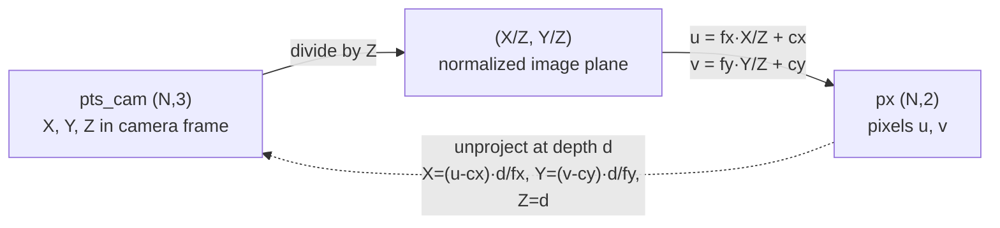
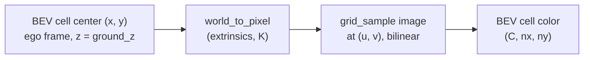

# A11.5a - Camera geometry and the BEV transform

## Motivation

Around 2020 the dominant paradigm for camera perception in autonomous driving
shifted from per-image, per-camera detection to a shared bird's-eye-view (BEV)
representation built from a surround-view camera rig. That shift was practical.
A car needs a single, metric, top-down map of its surroundings to
plan in, and stitching together six monocular detections in image space (each
with its own depth ambiguity, its own occlusions, and an awkward seam between
adjacent cameras) never produced a clean one. The fix was to commit to a fixed
metric grid in the vehicle frame and project image content into it. A surround
rig of six cameras gives 360-degree coverage at a fraction of the cost of a
high-line lidar, so once camera-only BEV detection became competitive, it became
the default. The BEV grid then turned into the shared substrate for everything
downstream: it is where multiple cameras fuse, where consecutive frames fuse
(ego-motion just shifts the previous grid into the current ego frame), and where
detection, segmentation, occupancy, and motion prediction all read and write.

[nuScenes](https://arxiv.org/abs/1903.11027) (Caesar et al., CVPR 2020) is the
dataset this module is built on, and most of the real content of this assignment
is its coordinate-frame plumbing rather than the familiar pinhole model.
nuScenes defines three nested frames: each sensor's own frame (lidar points in
the lidar frame; the scene in each camera's OpenCV frame, +x right, +y down, +z
forward), the ego frame (vehicle body, origin at the rear-axle midpoint, x
forward / y left / z up), and a fixed ENU global frame that all 3-D annotations
live in (ENU is East-North-Up: a fixed world frame with axes pointing east, north, and
up). Two record types carry the transforms. `calibrated_sensor` stores the
sensor-to-ego rigid transform (translation in meters plus a rotation quaternion)
and, for cameras, the 3x3 intrinsic. `ego_pose` stores the ego-to-global rigid
transform plus a timestamp. Both quaternions are scalar-first `(w, x, y, z)`;
passing the components in the wrong order gives a rotation that looks plausible
and is wrong. The field-by-field schema is in the devkit's
[schema_nuscenes.md](https://github.com/nutonomy/nuscenes-devkit/blob/master/docs/schema_nuscenes.md),
which is worth reading once before you touch any JSON.

The exercise that makes this concrete is projecting a lidar point into a camera.
The correct chain is four steps:

    lidar sensor -> ego @ lidar_time -> global -> ego @ cam_time -> camera

then apply K and divide by z. The non-obvious step is the temporal one. The lidar
sweep and the camera trigger do not happen at the same instant; the offset is on
the order of tens of milliseconds. A single ego pose cannot serve both ends of
the chain, because the vehicle moved in between. At 30 m/s a ~50 ms offset is
about 1.5 m of translation, which is enough to visibly slide projected points off
moving objects at the edge of the field of view. The naive shortcut, reusing the
lidar-time ego pose for the camera step, is exactly the bug this assignment makes
you see. The assignment builds both the naive and the timestamp-correct chain and contrasts them
disagree by the ego motion.

A naive flat-ground BEV is not enough, which is why the later assignments exist.
Inverse perspective mapping
(IPM) warps a camera image into a top-down image by assuming every pixel is a
point on the flat z = 0 ground plane, which reduces the projection to a 3x3
homography from image to ground. That assumption is exact for road markings and
ground texture and wrong for anything above the ground. A feature at height h
projects to the same pixel as a ground point farther from the camera, so the
homography cannot tell them apart: elevated objects get painted into BEV cells
beyond their true footprint, smeared toward the camera. A pedestrian's feet land
correctly and their head lands several meters ahead of them. Recovering height
from a single view needs either real depth, which is the
[Lift-Splat-Shoot](https://arxiv.org/abs/2008.05711) (Philion & Fidler, ECCV
2020) approach in A11.5b, or explicit 3-D queries, which is the
[BEVFormer](https://arxiv.org/abs/2203.17270) (Li et al., ECCV 2022) approach in
A11.5c. IPM is the baseline whose failure those methods are built to fix.

One nuScenes-specific simplification: the core dataset images are pre-undistorted
and stored rectified, so the stored K is an exact pinhole intrinsic with no
radial or tangential distortion terms. (The nuImages spin-off keeps distortion;
the core dataset does not.) No undistortion is implemented here.

This assignment builds `nanovision.geometry` (`project_points`
/ `unproject`, the four SE(3) primitives `make_transform` / `apply_transform` /
`invert_transform` / `compose_transforms`, the `CameraRig`, and `ipm_to_bev`)
plus the nuScenes-mini loader, and these are the shared dependency for the rest of
the module. A11.5b (Lift-Splat-Shoot) reuses the `CameraRig` (K and ego-to-camera
extrinsics) and the `BEVGrid`, replacing the flat-ground homography with a learned
per-pixel depth that unprojects image features into 3-D. A11.5c (BEVFormer)
reuses the same K and extrinsics; its spatial cross-attention computes, for each
BEV cell, the 2-D image coordinate it projects to, which is the back half of the
projection chain built here. A11.5d (occupancy) extends the `BEVGrid` with a z
axis and projects voxel-center queries with the same chain, just with non-zero z.
A11.5e (prediction) consumes the BEV feature map produced upstream and relies on
the `BEVGrid` definition (ego-centric, fixed range and resolution) to read it
spatially. The ego-centric BEV grid fixed here is the shared contract for that
whole module. The volume-rendering link from the NeRF/splatting assignments
reappears in A11.5d, where the camera-to-voxel projection is the same primitive.
If the lidar overlay here is visually correct, the extrinsic chain is correct, and
a whole class of downstream sign/axis-swap bugs is caught before it can propagate.

## Background

### Coordinate frames and conventions

The camera frame is OpenCV-style: +x right, +y down, +z forward into the scene.
This is the nuScenes camera convention, so the stored intrinsic K is the exact
pinhole matrix with no distortion terms. The ego frame is the vehicle body,
right-handed with x forward, y left, z up, origin at the rear-axle midpoint. The
global frame is a fixed ENU map frame. SE(3) transforms are 4x4 homogeneous
matrices applied on the left, `p' = T @ p_homogeneous`. A transform named
`T_b_a` reads "a-to-b": it takes a point in frame a and returns it in frame b.

The two body frames differ in handedness convention, which is the source of most
sign bugs. The ego frame has +x forward, +y left, +z up. The OpenCV camera frame
has +x right, +y down, +z forward into the scene:

```
        ego frame                       OpenCV camera frame
        (vehicle body)                  (per camera)

            z up                              z forward
            |                                /
            |                               /
            |______ x forward              o --------- x right
           /                               |
          /                                |
         y left                            y down
```

The transform stored per camera (`T_cam_world`) carries both the translation from
the rear axle to the lens and this axis relabeling.

### Pinhole projection (one-paragraph review)

A camera-frame point (X, Y, Z) with Z > 0 projects to a pixel by

    u = fx * X / Z + cx
    v = fy * Y / Z + cy

and back-projects at depth d by X = (u - cx) d / fx, Y = (v - cy) d / fy, Z = d.
Shapes: `project_points(pts_cam (N,3), K (3,3)) -> px (N,2)`;
`unproject(px (N,2), depth (N,) or scalar, K (3,3)) -> pts_cam (N,3)`.
Every BEV lift depends on back-projection; the only place to get it wrong
is the sign/order when you chain it with the extrinsics.

The forward pass is a divide by depth followed by the intrinsic scale and offset:



The dashed edge is `unproject`: it recovers the camera-frame point only because
the depth d is supplied separately. A single pixel alone fixes a ray, not a point.

### The four SE(3) primitives

`make_transform(R (3,3), t (3,)) -> T (4,4)` assembles `[[R, t], [0, 1]]`.
`apply_transform(T (4,4), pts (N,3)) -> (N,3)` computes `pts @ R^T + t`.
`invert_transform(T (4,4)) -> (4,4)` uses the SE(3) structure, `R^T` and
`-R^T t`, not a general matrix inverse. `compose_transforms(A, B, C) -> A @ B @ C`
so applying the result is the same as applying C, then B, then A.

### The four-step lidar-to-camera chain

At a keyframe the lidar sweep and the image were captured at slightly different
times. The correct projection of a lidar point into a camera is

    lidar sensor -> ego @ lidar_time -> global -> ego @ cam_time -> camera,

then apply K and divide by z, keeping z > 0 and in-bounds points. As a transform
composition this is `compose_transforms(T_cam_ego, invert(ego_pose_cam),
ego_pose_lidar, lidar_to_ego)`. The naive shortcut reuses the lidar-time ego pose
for the camera step; the error is the ego motion between the two timestamps. At
30 m/s and a ~50 ms offset that is about 1.5 m. The temporal-offset test makes
this exact on synthetic poses (identity sensor extrinsics, a pure +x ego shift).

Each arrow below is one 4x4 SE(3) matrix; the global frame is the only frame both
timestamps share, so the chain has to pass through it to switch ego poses:


The naive chain collapses `ego @ lidar_time` and `ego @ cam_time` into one node,
dropping the global round-trip. On a moving vehicle that drops the ego translation
between the two timestamps, which is the 1.5 m the test measures.

### The pyquaternion convention

nuScenes stores rotations as scalar-first quaternions `(w, x, y, z)` in both
`calibrated_sensor` and `ego_pose`. The chain works in SE(3) composition rather than
quaternion algebra: build the 4x4 matrices immediately and chain them. The loader
already does the quaternion-to-matrix step, so the work stays in 4x4 matrix form.

### The ego-centric BEV grid (the module-wide contract)

The BEV grid is always defined in the ego frame, centered on the vehicle. The
`BEVGrid` dataclass fixes the contract for the whole module: x forward, y left,
default [-50, 50] m on both axes at 0.5 m resolution, a 200x200 grid.
`cell_centers()` returns an `(nx, ny, 2)` tensor of ego-frame (x, y) centers. LSS,
BEVFormer, and occupancy all reuse this; occupancy adds a z axis.

### Flat-ground IPM and why it breaks

IPM maps each BEV ground cell to a single image pixel under one assumption: every
pixel is a point on the flat z = 0 ground plane. It is exact for road markings
and ground texture. It is wrong for anything elevated: a feature at height h
projects to the same pixel as a ground point farther from the camera, so elevated
objects are painted into a BEV cell beyond their true footprint, smeared toward
the camera. The homography cannot recover height from one view; the fix is real
depth (LSS) or explicit 3-D queries (BEVFormer). The IPM test asserts both the
correct ground mapping and this breakage. `ipm_to_bev` projects each cell's ground
point into each camera and bilinearly samples the image (via `grid_sample`);
overlapping cells are last-camera-wins.

The data flow per cell is a ground point, a projection, and a sample:



The failure is geometric. The camera ray through a pixel hits the assumed ground
plane at one point, but the real scene point on that ray may sit at height h. An
elevated feature is therefore written into the ground cell where its ray crosses
z = 0, which is farther from the camera than the object's actual footprint:

```
   camera
     o
     |\
     | \  ray through one pixel
     |  \
     |   \  * real point at height h (e.g. pedestrian's head)
     |    \
     |     \
  ---+------X-------------------  z = 0 ground plane
     |   true        IPM writes the pixel here,
   footprint         past the true footprint
```

The gap between `true footprint` and `X` grows with the object's height and its
distance from the camera, which is why tall objects streak outward in the BEV.

## What to implement

In `geometry.py`: `project_points` / `unproject`, the four SE(3)
primitives (`make_transform`, `apply_transform`, `invert_transform`,
`compose_transforms`), `CameraRig` (`world_to_cam`, `cam_to_world`,
`world_to_pixel`), and `ipm_to_bev`. The `BEVGrid` dataclass is provided. The
nuScenes loader is provided boilerplate; the devkit plumbing is not implemented here.

## Tasks

1. `project_points` / `unproject` - pinhole projection and its inverse on the
   OpenCV camera axes.
2. The four SE(3) primitives - 4x4 assembly, point application, the structured
   inverse (R^T, -R^T t), and left-to-right composition.
3. `CameraRig.world_to_cam` / `cam_to_world` / `world_to_pixel` - per-camera
   projection with an in-front (z > 0) and in-bounds visibility mask.
4. `ipm_to_bev` - warp images onto the ego ground plane via `grid_sample`.

Each maps to a `raise NotImplementedError("A11.5a Task N: ...")` in the top-level module files
and to one test file.

## How to verify

Run from the repo root with the `nanovision` env active, in this order:

    make test A=a11_5a_camera_geometry_bev      # your top-level code (red until filled)

The tests run in workflow order: projection (reference values, axis point,
round-trip, float64 gradcheck) -> SE(3) (block layout, applied-point reference,
inverse-is-identity, composition, gradcheck on `apply_transform`) -> rig (a
synthetic 4-camera rig: a front point visible only in the front camera and on the
optical axis; a cube into the expected cameras; `cam_to_world` inverts
`world_to_cam`) -> IPM (a ground marker warps back to its expected BEV cell; an
elevated point maps past its footprint) -> temporal offset (the timestamp-correct
chain differs from the naive one by the 1.5 m ego motion; with no ego motion they
agree). All of these run on synthetic cameras with no dataset.

To confirm the reference passes and render the figures:

    make verify A=a11_5a_camera_geometry_bev    # reference solution (green)
    make viz    A=a11_5a_camera_geometry_bev    # writes PNGs to out/

The nuScenes loader test reports as skipped unless the dataset is present; that is
expected, and `viz.py` falls back to a synthetic cube and a ground-checkerboard
warp when `NUSCENES_DATAROOT` is unset. A forbidden-imports test greps the
solution for cv2/kornia shortcuts. The reference implementation is visible in
`solution/geometry.py`; read it if you get stuck.

## Dataset step zero (optional, only for the real-data overlay)

The geometry and all tests run without nuScenes. To render the real 6-camera lidar
overlay and stitched BEV in `viz.py`:

1. Create a nuScenes account and accept the license at
   https://www.nuscenes.org/nuscenes#download.
2. Download the `v1.0-mini` split (~4 GB) and extract it.
3. Install the AV dependencies: `pip install nuscenes-devkit pyquaternion shapely`
   (the `av` extra group in `pyproject.toml`).
4. Set `NUSCENES_DATAROOT` to the directory that contains the `v1.0-mini` folder,
   e.g. `export NUSCENES_DATAROOT=$HOME/data/nuscenes`.

With those set, `viz.py` renders the naive-vs-temporal-correct lidar overlay and
the stitched BEV; without them it falls back to the synthetic scene.

## Compute notes

CPU only, seconds to run. Everything is tested on synthetic cameras at float32,
with float64 gradchecks on `project_points` and `apply_transform`. The 200x200
BEV grid and downsampled 400x224 images fit in memory with room to spare; no GPU
is needed for this assignment, and there is no training loop or loss curve to
watch.

## Stretch goals

1. Add a per-cell coverage count to `ipm_to_bev` and blend overlapping cameras by
   viewing-ray verticality instead of last-camera-wins.
2. Implement the closed-form ground-plane homography H (3x3, pixel -> BEV) and
   check it agrees with the per-cell `grid_sample` warp on ground points.
3. On real data, pick 5 ground lidar points on a lane marking and measure the
   naive-vs-correct pixel gap as a function of ego speed.

## Further reading

- Caesar et al., "nuScenes: A Multimodal Dataset for Autonomous Driving" (CVPR
  2020), [arXiv:1903.11027](https://arxiv.org/abs/1903.11027) - coordinate frames,
  sensor suite, and the four-step projection chain.
- nuScenes devkit schema,
  [schema_nuscenes.md](https://github.com/nutonomy/nuscenes-devkit/blob/master/docs/schema_nuscenes.md)
  - field-by-field `calibrated_sensor` / `ego_pose` / `sample_data` reference.
- Philion and Fidler, "Lift, Splat, Shoot" (ECCV 2020),
  [arXiv:2008.05711](https://arxiv.org/abs/2008.05711) - the camera-rig and
  ego-centric BEV grid abstraction every later method reuses (A11.5b).
- Li et al., "BEVFormer" (ECCV 2022),
  [arXiv:2203.17270](https://arxiv.org/abs/2203.17270) - 3-D BEV reference points
  projected to 2-D image coordinates, the back half of the projection chain
  (A11.5c).
- Harley et al., "Simple-BEV" (ICRA 2023),
  [arXiv:2206.07959](https://arxiv.org/abs/2206.07959) - a clean description of the
  200x200x8 ego-centric voxel grid and bilinear-sampling lift.
