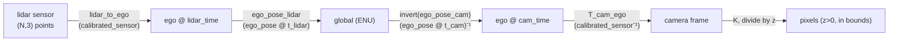
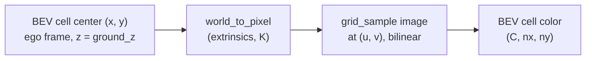

# A11.5a - camera geometry and the BEV transform

Around 2020, camera perception for autonomous driving shifted from per-image, per-camera
detection to a shared bird's-eye-view (BEV) representation built from a surround-view camera
rig. A car needs a single metric top-down map of its surroundings to plan in, and stitching six
monocular detections in image space (each with its own depth ambiguity, occlusions, and an
awkward seam between adjacent cameras) never produced a clean one. The fix was to commit to a
fixed metric grid in the vehicle frame and project image content into it. That BEV grid then
becomes the shared substrate for everything downstream: it is where multiple cameras fuse,
where consecutive frames fuse (ego-motion shifts the previous grid into the current ego frame),
and where detection, segmentation, occupancy, and motion prediction all read and write.

Build the autonomous-driving geometry on top of the base camera primitives from the NeRF
assignment: a multi-camera rig that decides which camera sees a given 3-D point, and the
flat-ground inverse-perspective-mapping (IPM) baseline that warps images into the BEV grid. The
pinhole model, its inverse, and the four SE(3) transform primitives are built in the NeRF
assignment and imported here through the `nanovision.geometry` shim. Most of the real content is
coordinate-frame plumbing (the nested sensor, ego, and global frames of nuScenes, the
lidar-camera temporal offset, and the quaternion order) rather than the pinhole model itself. The
reference solution and all tests run on synthetic cameras, so no dataset is needed.

Required reading before starting:
- Caesar et al. 2020, "nuScenes: A Multimodal Dataset for Autonomous Driving",
  [arXiv:1903.11027](https://arxiv.org/abs/1903.11027) (coordinate frames, sensor suite,
  and the four-step projection chain).
- nuScenes devkit schema reference,
  [schema_nuscenes.md](https://github.com/nutonomy/nuscenes-devkit/blob/master/docs/schema_nuscenes.md)
  (the `calibrated_sensor` and `ego_pose` fields), worth reading once before touching any JSON.

## Lecture notes

### Coordinate frames and conventions

nuScenes defines three nested frames. Each sensor has its own frame: lidar points live in the
lidar frame, and the scene in each camera's OpenCV frame, +x right, +y down, +z forward into the
scene. The ego frame is the vehicle body, right-handed with x forward, y left, z up, origin at
the rear-axle midpoint. The global frame is a fixed ENU map frame, where ENU is East-North-Up, a
world frame with axes pointing east, north, and up; all 3-D annotations live in it, and it is the
only frame that does not move with the car.

The ego frame and the camera frames differ in axis convention, the source of most sign bugs. The ego
frame has +x forward, +y left, +z up. The OpenCV camera frame has +x right, +y down, +z forward
into the scene:

```
        ego frame                       OpenCV camera frame
        (vehicle body)                  (per camera)

            z up                              z forward
            |                                /
            |                               /
            |______ x forward              o --------- x right
           /                               |
          /                                |
         y left                            y down
```

Both are right-handed, so the change between them is a rotation with no reflection, but every
axis is relabeled and two change sign. For a forward-facing camera, camera x is ego $-y$,
camera y is ego $-z$, and camera z is ego $x$.

SE(3) transforms are 4x4 homogeneous matrices applied on the left, $p' = T\,p$. A transform
written $T_{b \leftarrow a}$ reads "a-to-b": it takes a point in frame $a$ and returns it in
frame $b$. The code spells the same thing `T_b_a`, since an arrow is not a legal identifier.
Reading the subscripts of a product left to right tells you whether it typechecks:
$T_{c \leftarrow b}\,T_{b \leftarrow a} = T_{c \leftarrow a}$, and the reverse order is
meaningless. The camera extrinsic $E = T_{\text{cam} \leftarrow \text{ego}}$ is the
ego-to-camera transform; it carries both the translation from the rear axle to the lens and the
axis relabeling between the two frames above. Its inverse
$E^{-1} = T_{\text{ego} \leftarrow \text{cam}}$ goes the other way.

### How nuScenes stores a keyframe

The sensors on the car free-run at their own rates. The roof lidar spins at 20 Hz, so one full
360-degree rotation, called a sweep, takes 50 ms. The six cameras expose at 12 Hz. Annotations
are provided at 2 Hz, and a `sample` (also called a keyframe) is the bundle of the nearest
reading from every sensor at one of those 2 Hz instants. That bundle is not simultaneous: it
groups readings that happened close together, not at the same time.

The offset inside a bundle is not random. nuScenes triggers each camera's exposure at the moment
the spinning lidar crosses the middle of that camera's field of view, which keeps the two views
of any given direction as close in time as the hardware allows. The consequence is that the six
cameras of one keyframe fire at six different instants spread across the lidar's 50 ms sweep, so
each camera carries its own timestamp and its own vehicle pose.

Each individual sensor reading is a `sample_data` record: a file on disk, a timestamp, and two
references. The `calibrated_sensor` record says where the sensor sits on the car, as a
sensor-to-ego rigid transform (translation in meters plus a rotation quaternion) and, for
cameras, the 3x3 intrinsic $K$. The `ego_pose` record says where the car was when that reading
was taken, as an ego-to-global rigid transform plus a timestamp. So extrinsics are per sensor and
fixed for the whole scene, while the ego pose is per reading and different for every sensor in
the bundle. Both quaternions are scalar-first $(w, x, y, z)$; passing the components in the wrong
order gives a rotation that looks plausible and is wrong. The cleanest path is to build the 4x4
matrix from each quaternion immediately and chain matrices, never working in quaternion algebra.

The core nuScenes images are stored undistorted, so the stored intrinsic $K$ is an exact pinhole
matrix with no radial or tangential terms. (The nuImages spin-off keeps distortion; the core
dataset does not.) No undistortion step is needed.

### The pinhole model and the SE(3) toolkit

The pinhole projection $u = f_x X/Z + c_x$, $v = f_y Y/Z + c_y$, its depth-back-projection
inverse, and the four SE(3) primitives (build a 4x4 transform from $R, t$; apply $R\,p + t$ to a
batch of points; invert via the structured $[[R^\top, -R^\top t], [0, 1]]$; compose left to
right) are built in the NeRF assignment and imported here from `nanovision.geometry`. The chains
below compose those SE(3) transforms and finish with the pinhole projection; the only place to
get the projection wrong is the sign or order when chaining it with the extrinsics.

All of it is written in PyTorch on float tensors rather than in NumPy or OpenCV, and autograd is
the reason. The later assignments in this module put exactly these operations inside a network's
forward pass: a BEV cell is projected into a camera and the image features are read at the
projected pixel, with the training loss defined on the BEV output. The gradient then has to
travel back through the sampling and the projection to reach the features. A geometry pipeline
that leaves the tensor world at any point cuts that path. The suite therefore greps for OpenCV's
`projectPoints`, `solvePnP`, `warpPerspective`, and `findHomography`, which work on NumPy arrays
outside autograd, and for any import of kornia, a PyTorch computer-vision library whose
differentiable warps would do this assignment's work for it.

### The four-step lidar-to-camera chain

Projecting a lidar point into a camera image at a keyframe means crossing the timestamp gap
described above. Name the four transforms the records give:

- $S$, the lidar-to-ego extrinsic from the lidar's `calibrated_sensor`.
- $P_l$, the ego-to-global pose from the `ego_pose` attached to the lidar reading.
- $P_c$, the ego-to-global pose from the `ego_pose` attached to that camera's image.
- $E$, the ego-to-camera extrinsic from the camera's `calibrated_sensor`.

$P_l$ and $P_c$ are poses of the same vehicle at two different instants, so they differ by the
motion in between. The global frame is the only frame both instants share, which is why the
chain has to pass through it to switch ego poses:

$$\text{lidar sensor} \;\to\; \text{ego @ lidar time} \;\to\; \text{global} \;\to\; \text{ego @ cam time} \;\to\; \text{camera},$$

which as a matrix product is $T = E\,P_c^{-1}\,P_l\,S$, read right to left. Apply $T$ to the
lidar points, then apply $K$ and divide by $z$, keeping the points with $z > 0$ that land in
bounds.



The naive shortcut reuses the lidar-time ego pose for the camera step, giving
$T = E\,P_l^{-1}\,P_l\,S = E\,S$, which collapses the two ego nodes into one and drops the
global round-trip entirely. The two
agree exactly when the vehicle is stationary, since then $P_c = P_l$. On a moving vehicle the
error is the ego motion between the two timestamps, transformed into the camera frame: at
30 m/s a 50 ms offset is 1.5 m of translation, enough to slide projected points visibly off
moving objects and off anything near the edge of the field of view.

### The ego-centric BEV grid

The BEV grid is defined in the ego frame, centered on the vehicle, with x forward and y left. A
standard choice is $[-50, 50]$ m on both axes at 0.5 m resolution, a 200x200 grid. Cell $(i, j)$
has ego-frame center $x_i = x_{\min} + (i + \tfrac{1}{2})\,r$ and
$y_j = y_{\min} + (j + \tfrac{1}{2})\,r$ for resolution $r$, with $i$ running along x and $j$
along y, both zero-based. The half-cell offset means a cell's coordinate is its center, not its
corner, which is the coordinate a camera ray should be tested against.

A cell holds whatever the method writes into it. In this assignment it holds an RGB color
sampled from a camera image, so the output is a $(C, n_x, n_y)$ tensor with $C = 3$. In the
learned methods later in the module it holds a vector of $C$ channel activations produced by a
convolutional or attention encoder, a BEV feature map, with the same indexing and the same
metric meaning per cell. Every method in the module keeps this definition unchanged, so they all
share the geometry built here.

The grid is rebuilt in the current ego frame every frame, so it slides and rotates with the car.
Fusing information across time therefore means resampling the previous frame's grid through the
ego motion before combining it, which is the temporal step the attention-based method later in
the module performs.

### Sampling an image at a fractional pixel

Projecting a 3-D point into a camera gives a real-valued pixel coordinate $(u, v)$, essentially
never an integer, so reading the image there requires interpolation. Bilinear interpolation
takes the four integer pixels surrounding $(u, v)$ and weights them by the fractional position.
With $u_0 = \lfloor u \rfloor$, $a = u - u_0$, $v_0 = \lfloor v \rfloor$, $b = v - v_0$, and
$I_{u,v}$ the pixel in column $u$ and row $v$,

$$I(u, v) = (1-a)(1-b)\,I_{u_0,v_0} + a(1-b)\,I_{u_0+1,v_0} + (1-a)b\,I_{u_0,v_0+1} + ab\,I_{u_0+1,v_0+1}.$$

Each weight is the area of the rectangle diagonally opposite that corner, and the four weights
sum to 1.

Nearest-neighbor sampling would be cheaper and is unusable in this setting. Its output is
piecewise constant in $(u, v)$: the value does not change at all until the sample point crosses a
pixel boundary, at which point it jumps. Its derivative with respect to the sampling location is
therefore zero almost everywhere and undefined on the boundaries, so a loss computed on the
sampled values carries no information about where to move the sample. Bilinear interpolation is
piecewise linear instead, with a non-zero derivative both with respect to the image values and
with respect to $(u, v)$, so gradients flow back into the features being sampled and, if a
method wants it, into the camera parameters that produced the coordinate.

PyTorch spells this operation `torch.nn.functional.grid_sample`, and three of its conventions
matter here. The sampling grid is given in normalized coordinates running from $-1$ at one edge
of the image to $+1$ at the other, so pixel coordinates have to be rescaled before the call;
with `align_corners=True` the values $-1$ and $+1$ sit exactly on the centers of the first and
last pixels, so the rescaling divides by $W - 1$ and $H - 1$ rather than by $W$ and $H$. The
last dimension of the grid is ordered $(x, y)$, that is $(u, v)$, which is the opposite of the
row-major $(v, u)$ order used to index the tensor. And the grid has the shape of the desired
output, so handing it an $(n_x, n_y, 2)$ array of pixel coordinates returns a $(C, n_x, n_y)$
image directly, one sample per BEV cell. `padding_mode="zeros"` makes reads that fall outside
the image return zero, which is how cells no camera sees end up empty. The docstring in
`geometry.py` pins the exact rescaling formula and the overlap policy the tests expect.

### Flat-ground IPM and why it breaks

Inverse perspective mapping warps a camera image into a top-down image under one assumption:
every pixel shows a point on the flat $z = 0$ ground plane. Setting $z = 0$ deletes the third
column of the 3x4 projection $K\,[R \mid t]$, leaving a 3x3 matrix that maps ground coordinates
to pixels, invertible unless the camera looks edge-on at the plane. So under the assumption the
image and the ground are related by a homography, and the warp is exact for road markings and
ground texture.

Per cell the data flow is a ground point, a projection, and a sample:



Anything above the ground is placed wrongly, and the size of the error follows from one
ray-plane intersection. Put the optical center at height $h_c$ and let a scene point sit at
height $h$ with horizontal offset $d$ from the point on the ground directly below the camera.
The ray from
the center through the point is $z(t) = h_c + t\,(h - h_c)$ with horizontal offset $t\,d$; it
meets $z = 0$ at $t = h_c / (h_c - h)$, so IPM writes that point into the ground location at
offset

$$d' = d \cdot \frac{h_c}{h_c - h}.$$

The displacement is a radial scaling about the camera's ground position by a factor that depends
only on the two heights. Focal length, pitch, and image resolution do not appear: they change
which pixel the point lands in, and the pixel and the ground cell move together. Three regimes
come out of that factor. For $h \ll h_c$ the factor is roughly $1 + h/h_c$, a small outward
push that still grows in absolute terms with distance, since it multiplies $d$. As $h$
approaches $h_c$ the factor diverges, because a point at exactly the camera's height projects
onto the horizon line and its ray never descends to the ground. Above $h_c$ the ray points
upward and never meets the plane at all: that content appears above the horizon in the image and
is written into no ground cell, or, on a truncated grid, into cells at the far edge.

```
   camera
     o
     |\
     | \  ray through one pixel
     |  \
     |   \  * real point at height h (e.g. a car's roofline)
     |    \
     |     \
  ---+------X-------------------  z = 0 ground plane
     |   true        IPM writes the pixel here,
   footprint         past the true footprint
```

A vertical object is therefore stretched away from the camera: its base lands in the correct
cell, and every height above the base lands progressively farther out, so the object becomes a
streak running outward from its true footprint. The camera in the IPM test sits 1.5 m above the
ground, so the formula gives concrete numbers for it: a feature 0.5 m up at 8 m is painted at
12 m, one 1.0 m up at 20 m is painted at 60 m, and a pedestrian's head at 1.7 m is above the
camera and lands nowhere on the plane at all.

Recovering height from a single view needs either real depth, the depth-distribution approach of
Lift-Splat-Shoot (A11.5b), or explicit 3-D queries, the attention approach of BEVFormer
(A11.5c). IPM is the baseline whose failure those methods are built to fix.

### Where this goes in the module

The geometry built here is the shared dependency for the rest of the autonomous-driving module,
and each later method replaces one piece of the IPM pipeline while keeping the rest.

Lift-Splat-Shoot keeps the camera rig and the BEV grid and throws away the flat-ground
assumption. Instead of assuming one height per pixel it predicts, for every pixel, a categorical
distribution over a fixed set of discrete depth bins, places a scaled copy of that pixel's
feature vector at every bin weighted by the bin's probability, and sums whatever lands in each
BEV cell. Nothing in that is an argmax, so the whole transform is differentiable and the depth
distribution is trained from the BEV task loss with no depth labels.

BEVFormer keeps the exact geometry and makes the reading learned. Each BEV cell becomes a query
token, its 3-D location is projected into every camera with the back half of the chain built
here, and the cell reads camera features at the projected pixels by the bilinear sampling
described above. The mechanism is cross-attention, attention in which the queries come from one
set of tokens (the BEV cells) and the keys and values from another (the image feature maps), and
a cell that several cameras see combines what it reads from each of them.

Occupancy prediction extends the BEV grid with a z axis, turning cells into voxels that each
carry an occupancy probability and a semantic class, and projects voxel centers through the same
chain at non-zero z. Motion prediction and planning consume the BEV feature map as an image-like
tensor and depend on the grid being ego-centric with a fixed range and resolution, so that a
displacement in cells is a displacement in meters.

A wrong transform here does not announce itself downstream; it shows up as a learned method that
trains to a mediocre number for no visible reason. If the lidar overlay on real data is visually
correct, the extrinsic chain is correct, and a whole class of sign and axis-swap bugs is caught
before it can propagate that far.

## The assignment

Fill these holes, in order. Each is one `NotImplementedError` with a matching test; the docstring in each file gives the signature, shapes, and constraints.

1. [`CameraRig.world_to_cam()`](geometry.py) in `geometry.py`
2. [`CameraRig.cam_to_world()`](geometry.py) in `geometry.py`
3. [`CameraRig.world_to_pixel()`](geometry.py) in `geometry.py`
4. [`ipm_to_bev()`](geometry.py) in `geometry.py`

`project_points`, `unproject`, and the four SE(3) primitives are imported at the top of the file
from `nanovision.geometry` (built in the NeRF assignment); you do not reimplement them here.

The `BEVGrid` dataclass and the `nanovision.data.nuscenes_mini` loader (the devkit plumbing,
image downsampling, and calibration parsing) are provided.

### Running and validating

Activate the environment (`conda activate nanovision`), then:

```
make test     A=a11_5a_camera_geometry_bev   # run the tests against the top-level files (the holes)
make verify   A=a11_5a_camera_geometry_bev   # run the same tests against the reference solution/
make viz      A=a11_5a_camera_geometry_bev   # render the figures from the reference solution
make viz-mine A=a11_5a_camera_geometry_bev   # render the figures from your own code (holes filled)
```

`make test` runs the suite in `assignments/a11_5a_camera_geometry_bev/tests/` against the
top-level `geometry.py` (the file with the holes), red until the holes are filled and green once
they are correct. `make verify` runs the identical suite against the reference `solution/` by
setting `NANOVISION_IMPL=solution`, so it is green from the start and shows the target. The goal
is to bring `make test` to the same green as `make verify`.

The suite has five groups. The rig tests use a synthetic four-camera rig at the ego origin facing
+x, +y, -x, -y: a point 10 m ahead is visible only in the front camera and lands on its principal
point, a cube 8 m ahead has all eight corners in the front camera and none in the back, and
`cam_to_world` inverts `world_to_cam`. The IPM tests project a chosen cell center to a pixel,
paint a single bright pixel there, warp back, and require the peak of the BEV image to be that
cell; a second test places a feature 1.7 m above the ground and requires the ground point that
shares its pixel to be more than 2 m past its footprint. That feature is above the 1.5 m camera,
so by the height rule its ray never reaches the plane, and the test's forward scan for a
matching ground point saturates at the far end of its range. The temporal-offset tests compare
the timestamp-correct chain against the naive one, and check that the two agree when the vehicle
does not move. The nuScenes loader test
reports as skipped unless the dataset is present, which is expected. The forbidden-imports test
greps the top-level `geometry.py`, the reference `solution/geometry.py`, and the
`nanovision.geometry` shim for the OpenCV and kornia shortcuts named earlier. All of it runs on
synthetic cameras with no dataset.

What you should see when you run this. Everything is CPU only and runs in seconds; there is no
training loop or loss curve. The temporal-offset test reproduces the 1.5 m gap exactly on
synthetic poses (identity sensor extrinsics, a pure +x ego shift of 1.5 m), and the same poses
with no ego motion make the naive and correct chains agree. `make viz` writes PNGs to `out/`:
with no dataset it falls back to a synthetic cube projection and a ground-checkerboard IPM warp,
so the figures render on a fresh checkout. These are synthetic-camera artifacts; they confirm
the geometry is self-consistent and the IPM breakage is visible, and say nothing about accuracy
on real sensor noise or calibration error.

To render the real 6-camera lidar overlay and stitched BEV (optional, only for the real-data
figures), create a nuScenes account and accept the license at
https://www.nuscenes.org/nuscenes#download, download and extract the `v1.0-mini` split (~4 GB),
install the AV dependencies (`pip install nuscenes-devkit pyquaternion shapely`, the `av` extra
in `pyproject.toml`), and set `NUSCENES_DATAROOT` to the directory containing the `v1.0-mini`
folder. With those set, `viz.py` renders the naive-versus-correct lidar overlay and the stitched
BEV.

## Further reading

- Caesar et al. 2020, nuScenes, [arXiv:1903.11027](https://arxiv.org/abs/1903.11027).
- nuScenes devkit schema,
  [schema_nuscenes.md](https://github.com/nutonomy/nuscenes-devkit/blob/master/docs/schema_nuscenes.md).
- Mallot, Bülthoff, Little, and Bohrer 1991, "Inverse perspective mapping simplifies optical flow
  computation and obstacle detection", Biological Cybernetics, the original flat-ground warp and
  the observation that anything violating the ground assumption stands out in it.
- Philion and Fidler 2020, "Lift, Splat, Shoot",
  [arXiv:2008.05711](https://arxiv.org/abs/2008.05711), the camera-rig and ego-centric BEV grid
  abstraction every later method reuses (A11.5b).
- Li et al. 2022, "BEVFormer", [arXiv:2203.17270](https://arxiv.org/abs/2203.17270), 3-D BEV
  reference points projected to 2-D image coordinates, the back half of the projection chain
  (A11.5c).
- Harley et al. 2023, "Simple-BEV", [arXiv:2206.07959](https://arxiv.org/abs/2206.07959), a clean
  description of the 200x200x8 ego-centric voxel grid and the bilinear-sampling lift.
