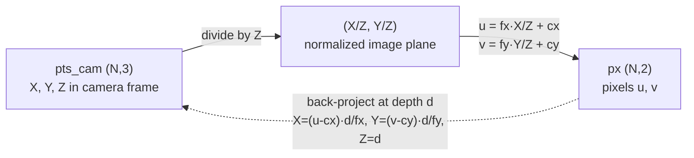
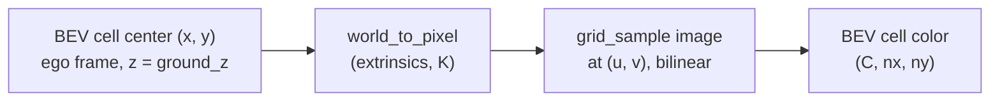

# A11.5a - camera geometry and the BEV transform

Around 2020, camera perception for autonomous driving shifted from per-image, per-camera
detection to a shared bird's-eye-view (BEV) representation built from a surround-view camera
rig. A car needs a single metric top-down map of its surroundings to plan in, and stitching six
monocular detections in image space (each with its own depth ambiguity, occlusions, and an
awkward seam between adjacent cameras) never produced a clean one. The fix was to commit to a
fixed metric grid in the vehicle frame and project image content into it. That BEV grid then
becomes the shared substrate for everything downstream: it is where multiple cameras fuse,
where consecutive frames fuse (ego-motion shifts the previous grid into the current ego frame),
and where detection, segmentation, occupancy, and motion prediction all read and write.

Build the geometry the rest of the autonomous-driving module imports: pinhole projection and
its inverse, the four SE(3) transform primitives, a multi-camera rig that decides which camera
sees a given 3-D point, and the flat-ground inverse-perspective-mapping (IPM) baseline that
warps images into the BEV grid. Most of the real content is coordinate-frame plumbing (the
nested sensor, ego, and global frames of nuScenes, the lidar-camera temporal offset, and the
quaternion order) rather than the pinhole model itself. The reference solution and all tests run
on synthetic cameras, so no dataset is needed.

Required reading before starting:
- Caesar et al. 2020, "nuScenes: A Multimodal Dataset for Autonomous Driving",
  [arXiv:1903.11027](https://arxiv.org/abs/1903.11027) (coordinate frames, sensor suite,
  and the four-step projection chain).
- nuScenes devkit schema reference,
  [schema_nuscenes.md](https://github.com/nutonomy/nuscenes-devkit/blob/master/docs/schema_nuscenes.md)
  (the `calibrated_sensor` and `ego_pose` fields), worth reading once before touching any JSON.

## Lecture notes

### Coordinate frames and conventions

nuScenes defines three nested frames. Each sensor has its own frame: lidar points live in the
lidar frame, and the scene in each camera's OpenCV frame, +x right, +y down, +z forward into the
scene. The ego frame is the vehicle body, right-handed with x forward, y left, z up, origin at
the rear-axle midpoint. The global frame is a fixed ENU map frame, where ENU is East-North-Up,
a world frame with axes pointing east, north, and up, and all 3-D annotations live in it.

The two body frames differ in handedness convention, which is the source of most sign bugs. The
ego frame has +x forward, +y left, +z up. The OpenCV camera frame has +x right, +y down, +z
forward into the scene:

```
        ego frame                       OpenCV camera frame
        (vehicle body)                  (per camera)

            z up                              z forward
            |                                /
            |                               /
            |______ x forward              o --------- x right
           /                               |
          /                                |
         y left                            y down
```

SE(3) transforms are 4x4 homogeneous matrices applied on the left, $p' = T\,p$. A transform
named $T_{b\_a}$ reads "a-to-b": it takes a point in frame $a$ and returns it in frame $b$. The
camera extrinsic $E = T_{\text{cam}\_\text{ego}}$ is the ego-to-camera transform; it carries
both the translation from the rear axle to the lens and the axis relabeling between the two
frames above. Its inverse $E^{-1} = T_{\text{ego}\_\text{cam}}$ goes the other way.

Two record types carry these transforms. `calibrated_sensor` stores the sensor-to-ego rigid
transform (translation in meters plus a rotation quaternion) and, for cameras, the 3x3
intrinsic. `ego_pose` stores the ego-to-global rigid transform plus a timestamp. Both
quaternions are scalar-first $(w, x, y, z)$; passing the components in the wrong order gives a
rotation that looks plausible and is wrong. The cleanest path is to build the 4x4 matrix from
each quaternion immediately and chain matrices, never working in quaternion algebra.

The core nuScenes images are pre-undistorted and stored rectified, so the stored intrinsic $K$
is an exact pinhole matrix with no radial or tangential distortion terms. (The nuImages spin-off
keeps distortion; the core dataset does not.) No undistortion is needed.

### Pinhole projection

A camera-frame point $(X, Y, Z)$ with $Z > 0$ projects to a pixel by

$$u = f_x \frac{X}{Z} + c_x, \qquad v = f_y \frac{Y}{Z} + c_y,$$

and back-projects at a known depth $d$ by

$$X = (u - c_x)\frac{d}{f_x}, \qquad Y = (v - c_y)\frac{d}{f_y}, \qquad Z = d.$$

The forward pass is a divide by depth followed by the intrinsic scale and offset:



The dashed edge recovers the camera-frame point only because the depth $d$ is supplied
separately. A single pixel alone fixes a ray, not a point. Every BEV lift depends on this
back-projection; the only place to get it wrong is the sign or order when chaining it with the
extrinsics.

### The four SE(3) primitives

A rigid transform on points needs four operations. Assembly builds the 4x4 matrix
$[[R, t], [0, 1]]$ from a 3x3 rotation $R$ and a 3-vector $t$. Application maps a batch of points
through $R\,p + t$. Inversion uses the SE(3) structure rather than a general matrix inverse:
for $T = [[R, t], [0, 1]]$ the inverse is $[[R^\top, -R^\top t], [0, 1]]$, which is exact and
cheap. Composition multiplies a sequence left to right, so $A B C$ applied to a point is the
same as applying $C$, then $B$, then $A$. The whole later module is built from these four.

### The four-step lidar-to-camera chain

At a keyframe the lidar sweep and the image were captured at slightly different times. The
correct projection of a lidar point into a camera passes through the global frame:

$$\text{lidar sensor} \;\to\; \text{ego @ lidar time} \;\to\; \text{global} \;\to\; \text{ego @ cam time} \;\to\; \text{camera},$$

then apply $K$ and divide by $z$, keeping the points with $z > 0$ that land in bounds. As a
composition this is $T_{\text{cam}\_\text{ego}}\,(T_{\text{ego}\_\text{global}}^{\text{cam}})\,(T_{\text{global}\_\text{ego}}^{\text{lidar}})\,T_{\text{ego}\_\text{lidar}}$,
where the two ego-pose factors use the camera-time and lidar-time poses respectively. Each arrow
is one 4x4 SE(3) matrix, and the global frame is the only frame both timestamps share, so the
chain has to pass through it to switch ego poses:


The non-obvious step is the temporal one. A single ego pose cannot serve both ends of the chain,
because the vehicle moved in between. The naive shortcut reuses the lidar-time ego pose for the
camera step, collapsing `ego @ lidar time` and `ego @ cam time` into one node and dropping the
global round-trip. On a moving vehicle that drops the ego translation between the two
timestamps. At 30 m/s a 50 ms offset is about 1.5 m of translation, enough to visibly slide
projected points off moving objects at the edge of the field of view.

### The ego-centric BEV grid

The BEV grid is always defined in the ego frame, centered on the vehicle, with x forward and y
left. A standard choice is $[-50, 50]$ m on both axes at 0.5 m resolution, a 200x200 grid. Each
cell has a metric ego-frame $(x, y)$ center. This grid is the shared contract for the whole
module: LSS, BEVFormer, and occupancy all read and write it, and occupancy adds a z axis to make
it a voxel grid.

### Flat-ground IPM and why it breaks

Inverse perspective mapping warps a camera image into a top-down image under one assumption:
every pixel is a point on the flat $z = 0$ ground plane. That reduces the projection to a 3x3
homography from image to ground. The assumption is exact for road markings and ground texture
and wrong for anything above the ground. A feature at height $h$ projects to the same pixel as a
ground point farther from the camera, so the homography cannot tell them apart: elevated objects
are painted into BEV cells beyond their true footprint, smeared toward the camera. A pedestrian's
feet land correctly and the head lands several meters ahead.

Per cell the data flow is a ground point, a projection, and a sample:



The failure is geometric. The camera ray through a pixel hits the assumed ground plane at one
point, but the real scene point on that ray may sit at height $h$. An elevated feature is
therefore written into the ground cell where its ray crosses $z = 0$, which is farther from the
camera than the object's actual footprint:

```
   camera
     o
     |\
     | \  ray through one pixel
     |  \
     |   \  * real point at height h (e.g. pedestrian's head)
     |    \
     |     \
  ---+------X-------------------  z = 0 ground plane
     |   true        IPM writes the pixel here,
   footprint         past the true footprint
```

The gap between the true footprint and the IPM cell grows with the object's height and its
distance from the camera, which is why tall objects streak outward in the BEV. Recovering height
from a single view needs either real depth, the Lift-Splat-Shoot approach (A11.5b), or explicit
3-D queries, the BEVFormer approach (A11.5c). IPM is the baseline whose failure those methods are
built to fix.

### Where this goes in the module

The geometry built here is the shared dependency for the rest of the autonomous-driving module.
Lift-Splat-Shoot reuses the camera rig (intrinsics and ego-to-camera extrinsics) and the BEV
grid, replacing the flat-ground homography with a learned per-pixel depth that unprojects image
features into 3-D. BEVFormer reuses the same intrinsics and extrinsics; its spatial
cross-attention computes, for each BEV cell, the 2-D image coordinate it projects to, which is
the back half of the projection chain built here. Occupancy extends the BEV grid with a z axis
and projects voxel-center queries with the same chain, just at non-zero z. Prediction consumes
the BEV feature map and relies on the grid being ego-centric with fixed range and resolution to
read it spatially. If the lidar overlay on real data is visually correct, the extrinsic chain is
correct, and a whole class of downstream sign and axis-swap bugs is caught before it can
propagate.

## The assignment

Implement the pinhole model, the SE(3) toolkit, the multi-camera rig, and the flat-ground IPM
warp. The file docstrings give the exact signatures, shapes, and formulas (the OpenCV camera
axes, the $T_{\text{cam}\_\text{ego}}$ extrinsic convention, the grid_sample normalization).
Read those; this section maps each piece to the concept above. Everything is autograd-compatible
float tensors, and the tests are float64 gradchecks on the differentiable pieces.

### Files to modify

All four tasks are in `geometry.py`, marked with `raise NotImplementedError("A11.5a Task N: ...")`.

Task 1, `project_points` and `unproject`, is the pinhole model and its inverse on the OpenCV
camera axes from the pinhole-projection section.

Task 2, `make_transform`, `apply_transform`, `invert_transform`, and `compose_transforms`, is
the SE(3) toolkit from the four-primitives section, including the structured inverse
($R^\top$, $-R^\top t$) rather than a general matrix inverse.

Task 3, `CameraRig.world_to_cam`, `cam_to_world`, and `world_to_pixel`, is the multi-camera rig.
`world_to_pixel` projects ego points into a named camera and returns the in-front ($z > 0$) and
in-bounds visibility mask, the back half of the projection chain.

Task 4, `ipm_to_bev`, is the flat-ground IPM warp: for each BEV cell, project its ground point
into each camera and bilinearly sample the image with `grid_sample`, last-camera-wins on
overlap.

The `BEVGrid` dataclass and the `nanovision.data.nuscenes_mini` loader (the devkit plumbing,
image downsampling, and calibration parsing) are provided.

### Running and validating

Activate the environment (`conda activate nanovision`), then:

```
make test     A=a11_5a_camera_geometry_bev   # run the tests against the top-level files (the holes)
make verify   A=a11_5a_camera_geometry_bev   # run the same tests against the reference solution/
make viz      A=a11_5a_camera_geometry_bev   # render the figures from the reference solution
make viz-mine A=a11_5a_camera_geometry_bev   # render the figures from your own code (holes filled)
```

`make test` runs the suite in `assignments/a11_5a_camera_geometry_bev/tests/` against the
top-level `geometry.py` (the file with the holes), red until the holes are filled and green once
they are correct. `make verify` runs the identical suite against the reference `solution/` by
setting `NANOVISION_IMPL=solution`, so it is green from the start and shows the target. The goal
is to bring `make test` to the same green as `make verify`.

The tests run in workflow order: projection (reference values, an axis point, the
unproject-project round-trip, a float64 gradcheck), SE(3) (block layout, an applied-point
reference, inverse-is-identity, composition, a gradcheck on `apply_transform`), the rig (a
synthetic 4-camera rig where a front point is visible only in the front camera and on the
optical axis, a cube projects into the expected cameras, and `cam_to_world` inverts
`world_to_cam`), IPM (a ground marker warps back to its expected BEV cell, an elevated point
maps past its footprint), and the temporal offset (the timestamp-correct chain differs from the
naive one by the ego motion, and with no ego motion they agree). All of these run on synthetic
cameras with no dataset. The nuScenes loader test reports as skipped unless the dataset is
present, which is expected, and a forbidden-imports test greps for `cv2`/`kornia` shortcuts.

What you should see when you run this. Everything is CPU only and runs in seconds; there is no
training loop or loss curve. The temporal-offset test reproduces the 1.5 m gap exactly on
synthetic poses (identity sensor extrinsics, a pure +x ego shift of 1.5 m), and the same poses
with no ego motion make the naive and correct chains agree. `make viz` writes PNGs to `out/`:
with no dataset it falls back to a synthetic cube projection and a ground-checkerboard IPM warp,
so the figures render on a fresh checkout. These are synthetic-camera artifacts; they confirm
the geometry is self-consistent and the IPM breakage is visible, and say nothing about accuracy
on real sensor noise or calibration error.

To render the real 6-camera lidar overlay and stitched BEV (optional, only for the real-data
figures), create a nuScenes account and accept the license at
https://www.nuscenes.org/nuscenes#download, download and extract the `v1.0-mini` split (~4 GB),
install the AV dependencies (`pip install nuscenes-devkit pyquaternion shapely`, the `av` extra
in `pyproject.toml`), and set `NUSCENES_DATAROOT` to the directory containing the `v1.0-mini`
folder. With those set, `viz.py` renders the naive-versus-correct lidar overlay and the stitched
BEV.

## Further reading

- Caesar et al. 2020, nuScenes, [arXiv:1903.11027](https://arxiv.org/abs/1903.11027).
- nuScenes devkit schema,
  [schema_nuscenes.md](https://github.com/nutonomy/nuscenes-devkit/blob/master/docs/schema_nuscenes.md).
- Philion and Fidler 2020, "Lift, Splat, Shoot",
  [arXiv:2008.05711](https://arxiv.org/abs/2008.05711), the camera-rig and ego-centric BEV grid
  abstraction every later method reuses (A11.5b).
- Li et al. 2022, "BEVFormer", [arXiv:2203.17270](https://arxiv.org/abs/2203.17270), 3-D BEV
  reference points projected to 2-D image coordinates, the back half of the projection chain
  (A11.5c).
- Harley et al. 2023, "Simple-BEV", [arXiv:2206.07959](https://arxiv.org/abs/2206.07959), a clean
  description of the 200x200x8 ego-centric voxel grid and the bilinear-sampling lift.
