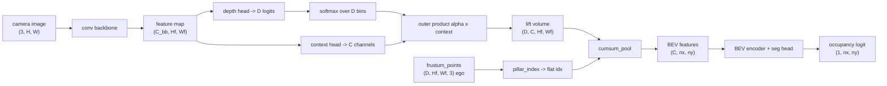

# A11.5b - Lift-Splat-Shoot

The camera-to-BEV view transform turns a ring of perspective camera images into one ego-centric
bird's-eye-view (BEV) feature grid. Lift-Splat-Shoot does it by predicting a probability
distribution over depth for every pixel, pushing each pixel's feature out into 3-D along that
distribution, and summing the result into BEV cells. Every step is differentiable, so the depth
predictor is trained by the BEV task loss with no depth label anywhere in the pipeline.

Build that view transform: the per-pixel depth-and-context lift, the frustum that places each
lifted feature in the ego frame, the sort-and-cumsum pooling that splats the frustum into BEV
pillars, the assembled model, and the BEVDepth depth-supervision loss. The depth lift and the
sort-and-cumsum pooling built here are shared infrastructure, reused unchanged by the
occupancy-prediction assignment.

Required reading before starting:
- Philion and Fidler 2020, "Lift, Splat, Shoot: Encoding Images from Arbitrary Camera Rigs by
  Implicitly Unprojecting to 3D", [arXiv:2008.05711](https://arxiv.org/abs/2008.05711) (the
  outer-product lift in section 3.1, the cumsum splat in section 3.2).
- Li et al. 2023, "BEVDepth: Acquisition of Reliable Depth for Multi-view 3D Object Detection",
  [arXiv:2206.10092](https://arxiv.org/abs/2206.10092) (the explicit lidar depth supervision).

## Lecture notes

### Why a depth distribution

A self-driving stack plans in a top-down map of the world around the car: where the road goes,
where other vehicles are, what is drivable. The cameras do not see that map. They see six
perspective images on a ring around the roof, each a 2-D projection that has thrown away depth.
The view transform gets from one to the other, and everything downstream (detection, occupancy,
motion prediction, planning) reads only the grid it produces. Content placed in the wrong BEV
cell here is not recoverable by any later stage, because the later stages never see the image.

The geometry-only baseline is inverse perspective mapping (IPM), the flat-ground homography from
the camera-geometry assignment: assume every pixel lies on the ground plane at $z = 0$, project
each BEV cell to a pixel, and sample the image there. That is exact for the road surface and lane
markings, and wrong for anything with height. A point 1.5 m above the ground and a ground point
farther along the same ray project to the same pixel, so IPM paints a car's roof into a BEV cell
well past the car's true footprint and every tall object smears outward along the viewing ray. One
image plus one ground-plane assumption cannot tell the two cases apart, so the transform needs
depth.

The options before Lift-Splat-Shoot were a separate lidar, or a monocular depth network that
predicts one depth per pixel and back-projects a point cloud. Committing to a single distance per
pixel is brittle, and the problem is with training rather than with accuracy.

### Why the depth cannot be a single number

Follow the pipeline that one depth per pixel implies. The network outputs a depth $\hat{z}$ at a
pixel; geometry turns (pixel, $\hat{z}$) into an ego point; that point falls in the BEV cell
$ix = \lfloor (x - x_{\min})/\text{res}\rfloor$, where the ego forward coordinate $x$ moves with
$\hat{z}$; the pixel's feature is added to that cell; a loss $L$ is computed on the resulting grid.
Training by gradient descent needs $\partial L / \partial \hat{z}$.

That derivative carries no information. The cell index is a floor of a function of $\hat{z}$, a
staircase:
nudge $\hat{z}$ a little and either the point stays in the same cell, so $L$ does not change at
all, or it jumps to the next cell and $L$ changes discontinuously. The derivative is exactly $0$
almost everywhere and undefined at the jumps. Gradient descent gets no information about which
direction to move the depth. Choosing a bin with an argmax over $D$ scores has the same problem:
the selected index is a step function of the scores, flat between the steps. Any hard choice of
where to put a feature severs the gradient path back to whatever made the choice.

Lift-Splat-Shoot removes the choice. For each pixel the network predicts a categorical
distribution over a fixed set of $D$ discrete depth bins, that is $D$ non-negative numbers
$\alpha_0, \dots, \alpha_{D-1}$ summing to one, one per candidate distance. Instead of putting the
whole feature at one bin, it puts a fraction $\alpha_d$ of the feature at every bin $d$ at once.
Which BEV cell bin $d$ lands in is fixed geometry, computed once from the camera calibration and
never a function of any network weight. The only network-dependent quantity in the grid is the
weight $\alpha_d$, and the grid contents are linear in it. The derivative that was zero before is
now the pixel's feature vector, a finite number that varies smoothly, and the chain rule runs from
the BEV loss back to the depth head.

The paper calls this "implicit" depth: there is no depth label anywhere. The depth head is
trained anyway, because the softmax normalization couples the bins, so raising the probability of
a bin whose BEV cell needs this feature necessarily lowers the probability of the bins that do
not. The exact gradient is written out after the lift below. The practical consequence was that
multi-camera BEV perception became one trainable module instead of a depth network followed by a
separate, untrainable projection step, and much of the camera-only BEV detector line since builds
directly on this transform.

### The backbone and the two heads

The lift sits behind a backbone and two prediction heads, and the rest of these notes use those
names.

The backbone is a small convolutional network mapping the $3 \times H \times W$ image to a feature
map of shape $C_{bb} \times H_f \times W_f$, where $H_f = H/s$ for a total stride $s$ (here
$32 \times 32$ down to $8 \times 8$ at $s = 4$). One cell of that feature map summarizes an
$s \times s$ patch of the image. The view transform operates at this resolution, so "per-pixel
depth" below always means per feature cell.

A head is a $1 \times 1$ convolution: a single linear map from the $C_{bb}$ channels at one cell to
the output channels at that same cell, applied with shared weights at every cell and mixing nothing
between cells. Two heads read the same backbone feature map. The depth head emits $D$ numbers per
cell, the context head emits $C$ numbers per cell. They see identical inputs; only the training
signal distinguishes them.

The depth head's $D$ outputs are logits $\ell_0, \dots, \ell_{D-1}$, unnormalized scores with no
range constraint, turned into a distribution by a softmax along the bin axis,

$$\alpha_d = \frac{e^{\ell_d}}{\sum_{k=0}^{D-1} e^{\ell_k}},$$

which gives $\alpha_d \ge 0$ and $\sum_d \alpha_d = 1$. Reading $\alpha_d$ as "the probability that
what this cell sees sits at distance $\text{bins}[d]$" is the intended interpretation, and nothing
imposes it except the loss.

The context head's $C$ outputs are the feature actually carried into the BEV grid. The paper calls
it context, and it has no prescribed meaning; it becomes whatever the BEV loss finds useful, some
mix of vehicle-ness, free space, and road paint. Depth decides where a feature goes, context
decides what goes there.

The bin centers are fixed numbers, not learned parameters: `arange(d_min, d_max, d_step)`, which is
$[1, 2, \dots, 8]$ m in this toy and $D = 41$ bins spanning 4 to 45 m in a real LSS config.
Changing the bins changes the geometry of the whole transform, so they are pinned in `config.py`.



### The lift

The lift is the outer product over (depth bin, context channel) at each feature cell:

$$\text{volume}[b, d, c, i, j] = \alpha[b, d, i, j]\;\cdot\;\text{context}[b, c, i, j],$$

with shape $(B, D, C, H_f, W_f)$. Per cell it is the rank-one matrix
$\alpha\,\text{context}^{\top} \in \mathbb{R}^{D \times C}$: one copy of the context vector per
depth bin, each scaled by that bin's probability. A cell whose distribution concentrates on bin
$d^{*}$ sends almost all of its context to $d^{*}$ and near-zero elsewhere; a flat distribution
spreads the same context over every depth. This is the only place depth enters the network, and
the product is linear in each argument separately, so gradients reach both heads.

Here is the gradient that trains depth without a depth label. Write $p(d, i, j)$ for the BEV pillar
that feature cell $(i, j)$ at bin $d$ falls into, a constant fixed by calibration. The pooled grid
is the sum of every contribution that lands in a pillar,

$$\text{BEV}[c, p] = \sum_{(d,i,j)\,:\,p(d,i,j) = p} \alpha[d, i, j]\;\text{context}[c, i, j],$$

so differentiating a loss $L$ defined on that grid gives

$$\frac{\partial L}{\partial \alpha[d, i, j]} = \sum_{c} \text{context}[c, i, j]\;
\frac{\partial L}{\partial \text{BEV}[c,\; p(d, i, j)]}.$$

Read it as an inner product between this cell's context vector and the loss gradient at the one
pillar that bin $d$ points to. If adding this context there lowers the loss, bin $d$'s probability
is pushed up; if it raises the loss, down. Each of the $D$ bins collects its own verdict from its
own pillar, and the softmax turns the $D$ verdicts into a redistribution of probability mass among
the bins. Nothing in that expression is a depth measurement.

### The frustum

For each depth bin $d$ and feature cell, back-project the cell's pixel center to a camera-frame
point with the pinhole inverse,

$$X = \frac{(u - c_x)\,d}{f_x},\qquad Y = \frac{(v - c_y)\,d}{f_y},\qquad Z = d,$$

then map to the ego frame. Sweeping this over all cells and all $D$ bins gives a frustum: the
truncated pyramid of space a rectangular image sees between the nearest and farthest bin, sampled
on a $D \times H_f \times W_f$ lattice. The extrinsic is $E = T_{\text{cam} \leftarrow \text{ego}}$,
spelled `T_cam_ego` in the code, so ego points come from
$E^{-1} = T_{\text{ego} \leftarrow \text{cam}}$. This reuses the `unproject`, `invert_transform`,
and `apply_transform` primitives from the camera-geometry assignment, one call each.

The frustum depends only on $K$, $E$, and the bin centers, none of which change during training, so
production implementations compute it once at startup and cache it.

The depth range must cover the BEV forward extent. For a forward camera the OpenCV camera $z$ axis
points along ego $+x$, so the camera-frame depth equals the ego forward distance, and a frustum
reaches only as far forward as the largest depth bin. A vehicle past that distance is unreachable
by every frustum point, so the BEV grid forward extent has to match the depth range.

### The splat

The splat collapses the frustum cloud onto the BEV plane by summing every point that falls in the
same grid cell. The name pillar comes from PointPillars (Lang et al. 2019,
[arXiv:1812.05784](https://arxiv.org/abs/1812.05784)): a BEV cell with no height subdivision is the
vertical column of space standing on that patch of ground, and pooling over the column is the same
as discarding $z$. A point at ego $(x, y)$ falls in cell
$ix = \lfloor (x - x_{\min})/\text{res}\rfloor$ along forward $x$ and
$iy = \lfloor (y - y_{\min})/\text{res}\rfloor$ along lateral $y$; the flat index is
$ix\cdot n_y + iy$, row-major with $x$ as the slow axis. Points outside the grid take index $-1$
and are dropped.

The pool is a sum, not a max or a mean. Sum keeps the pool linear in the features, which both the
gradient argument below and the running-sum implementation require.

A direct implementation adds each point into its pillar with a scatter-add. LSS instead sorts the
points by their pillar index and uses a cumulative sum: cumsum the sorted features along the point
axis, and the sum over a pillar is the cumsum at the run's last row minus the cumsum at the
previous run's last row. Keeping the last row of each equal-index run and differencing successive
run-ends gives every pillar's sum in one pass.

Concretely, the run boundary is where the sorted index changes. With sorted indices
$[0, 0, 2, 2, 2]$ and per-point scalar features $[a, b, c, e, g]$ (skipping $d$, which names a
depth bin everywhere else), the running sum is
$[a, a{+}b, a{+}b{+}c, a{+}b{+}c{+}e, a{+}b{+}c{+}e{+}g]$. The last row of run $0$ is position $1$
and the last row of run $2$ is position $4$ (the rows where the next index differs, with the final
row always a run-end). Reading the cumsum at those two rows gives $[a{+}b,\; a{+}b{+}c{+}e{+}g]$,
and differencing successive entries (treat the first kept entry as a difference against zero, i.e.
prepend a zero row) gives pillar sums $[a{+}b,\; c{+}e{+}g]$ for pillars $0$ and $2$. Pillar $1$ is
empty and never appears, so the result is indexed by the distinct present pillars, then scattered
into the dense grid.

### Why a sort and an integer index are still differentiable

The pool contains a sort and integer bin indices, and neither of those looks like something a
gradient can pass through. Writing the pool as a matrix settles it. Stack the $N$ point features as
the rows of $X \in \mathbb{R}^{N \times C}$ and let $A \in \{0,1\}^{N \times P}$ have $A_{np} = 1$
exactly when point $n$ falls in pillar $p$, with a row of zeros for a dropped point. Pillar pooling
is then

$$Y = A^{\top} X.$$

The indices come from camera calibration, not from network weights, so $A$ is a constant. The pool
is a fixed linear map of the features whose Jacobian does not depend on $X$ at all, and the
backward pass is the adjoint,

$$\frac{\partial L}{\partial X} = A\,\frac{\partial L}{\partial Y},$$

which says each point receives the gradient of the one pillar it landed in, and each dropped point
receives zero. The sort, the cumsum, and the difference of run-ends factor that same $A^{\top}$
into three constant matrices: a permutation, a lower-triangular matrix of ones, and a difference
matrix. Autograd knows the backward of each, so the pool needs no custom kernel and no
`scatter_add`, and a float64 gradient check of it matches finite differences to machine precision.

Over a literal scatter-add, the factorization removes the per-point atomic add: a read-modify-write
to the same memory address issued by many GPU threads at once, which serializes whenever many
points share a pillar and sums in a nondeterministic order. Philion and Fidler go
further and derive the analytic gradient of the whole sort-cumsum-difference module rather than
letting autograd tape its three steps, and report roughly a 2x training speedup from that. BEVPoolv2
later replaced the entire sequence with one fused CUDA kernel.

### Implicit depth versus supervised depth

BEVDet (Huang et al. 2021, [arXiv:2112.11790](https://arxiv.org/abs/2112.11790)) takes the LSS view
transform and attaches a 3-D object-detection head, showing the BEV grid works for detection as
well as segmentation. BEVDepth then measured the depth that LSS learns implicitly against lidar and
found it often wrong even when detection looked fine. Segmentation only needs to know roughly where
the drivable surface and the obstacles are, so a smeared depth distribution still paints roughly
the right region; a 3-D bounding box needs the object at the right metric distance, and a wrong
depth bin translates the whole box.

BEVDepth's fix is to supervise the depth distribution directly with lidar. Each lidar return is
transformed into the camera frame with the same $E$ and $K$ the view transform already uses; its
camera-frame $z$ is then the true depth of whatever the corresponding pixel sees. Downsampled to
feature resolution, that depth becomes a target bin, the nearest bin center,

$$\text{label} = \arg\min_k \big|z_{\text{cam}} - \text{bins}[k]\big|,$$

kept only where $z_{\text{cam}}$ falls inside the bin range, since a return nearer than $d_{\min}$
or past $d_{\max}$ has no bin to name. Lidar is sparse relative to the image, so most feature cells
get no return at all and the loss is masked to the labeled cells and averaged over those.

The loss at a labeled cell is the cross-entropy of the predicted distribution against that bin,
$-\log \alpha_{\text{label}}$: zero when all the mass sits on the right bin, growing without bound
as that bin's probability approaches zero. Its derivative with respect to the $D$ depth logits is
$\alpha - e_{\text{label}}$, where $e_{\text{label}}$ is the one-hot vector, $1$ at the labeled bin
and $0$ elsewhere. One gradient step therefore raises the labeled bin's logit and lowers every
other bin's in proportion to the probability it currently holds. That is the whole of
`bevdepth_depth_loss`, and it is the behavior the single-cell gradient test pins down.

BEVDepth's ablation attributes most of its accuracy gain over BEVDet to this one loss, and explicit
depth supervision is now standard in production camera detectors. BEVPoolv2 (Huang and Huang 2022,
[arXiv:2211.17111](https://arxiv.org/abs/2211.17111)) is a deployment optimization rather than a new
idea: it precomputes the frustum-to-pillar index, which is constant given calibration, and fuses
the pooling into one CUDA kernel, reported around 15x faster than the previous fastest LSS pooling.
At real resolution the frustum tensor, not the convolutions, is the memory and latency bottleneck.

### Push-out versus pull-in

The organizing contrast for this module is push-out versus pull-in. LSS pushes image features out
into 3-D along a depth distribution, then pools. BEVFormer (Li et al. 2022,
[arXiv:2203.17270](https://arxiv.org/abs/2203.17270)), the next assignment, pulls features in: it
starts from BEV grid queries, projects each query to reference points in the images, and gathers
features there with attention. Both end at a BEV feature grid; they differ in which direction the
geometry runs, and therefore in what has to be differentiable. Push-out needs a soft depth because
the network chooses the depth; pull-in needs a differentiable image sampler because the network
chooses the sampling location.

Occupancy prediction reuses the exact depth-lift and frustum code with one change: drop the BEV
collapse and keep the full 3-D voxel grid, passing a 3-D voxel index to the pooling instead of a
2-D pillar index. GaussianLSS (Lu et al. 2025,
[arXiv:2504.01957](https://arxiv.org/abs/2504.01957)) is the current frontier on the depth
representation: instead of $D$ bin probabilities per pixel it predicts a continuous Gaussian, a
mean depth and a spread, so the pixel carries an explicit depth uncertainty rather than the shape
of a histogram, and the cost stops scaling with the bin count.

One more idea the toy cannot show. BEVDet4D (Huang and Huang 2022,
[arXiv:2203.17054](https://arxiv.org/abs/2203.17054)) warps the previous frame's BEV feature map
into the current ego frame, resampling it through the ego motion between the two timestamps, and
concatenates it with the current one. A static object then sits in the same cell of both maps while
a moving one is displaced by its own motion, so the pair carries the velocity information a single
frame cannot.

## The assignment

The toy fixes the config so the geometry stays small and exactly checkable. Depth bin centers are
`arange(d_min, d_max, d_step)` exclusive of `d_max`, so $d_{\min}=1$, $d_{\max}=9$,
$d_{\text{step}}=1$ gives $D=8$ centers $[1, \dots, 8]$ and the deepest reachable point is 8 m
forward (writing `arange(1, 10, 1)` would give $D=9$ and break every shape). To match that depth
reach, the BEV grid is $x \in [0, 8]$, $y \in [-8, 8]$ at 1.0 m, an $8\times16$ grid. A feature
cell at $(i, j)$ corresponds to image pixel $((j+0.5)s, (i+0.5)s)$ for backbone stride $s$;
`config.pixel_xy()` precomputes that mapping, leaving only the geometry to implement. The
flat pillar index $ix\cdot n_y + iy$ and the reshape $(n_x n_y, C)\to(C, n_x, n_y)$ are used
everywhere, so the ground truth and the seg head are both $(n_x, n_y)$.

Fill these holes, in order. Each is one `NotImplementedError` with a matching test; the docstring in each file gives the signature, shapes, and constraints.

1. [`DepthLift.forward()`](lift_splat.py) in `lift_splat.py`
2. [`DepthLift.lift()`](lift_splat.py) in `lift_splat.py`
3. [`frustum_points()`](lift_splat.py) in `lift_splat.py`
4. [`pillar_index()`](lift_splat.py) in `lift_splat.py`
5. [`cumsum_pool()`](lift_splat.py) in `lift_splat.py`
6. [`LiftSplatShoot.forward()`](lift_splat.py) in `lift_splat.py`
7. [`bevdepth_depth_loss()`](lift_splat.py) in `lift_splat.py`

Everything is in `lift_splat.py`; the shared library re-exports these through
`nanovision.lift_splat`.

The `LSSConfig`, the backbone / BEV encoder / seg-head modules, the precomputed pixel-center grid,
and the `bev_toy_scene` generator are provided.

### Running and validating

Activate the environment (`conda activate nanovision`), then:

```
make test     A=a11_5b_lift_splat_shoot   # run the tests against the top-level files (the holes)
make verify   A=a11_5b_lift_splat_shoot   # run the same tests against the reference solution/
make viz      A=a11_5b_lift_splat_shoot   # render the figures from the reference solution
make viz-mine A=a11_5b_lift_splat_shoot   # render the figures from your own code (holes filled)
```

`make test` runs the suite in `assignments/a11_5b_lift_splat_shoot/tests/` against the top-level
`lift_splat.py`, red until the holes are filled and green once correct. `make verify` runs the
identical suite against the reference `solution/` by setting `NANOVISION_IMPL=solution`, so it is
green from the start and shows the target.

`test_depth_lift` checks shapes, that a one-hot depth distribution (all the probability mass on a
single bin) makes the lift volume equal the context at the selected bin and near-zero elsewhere,
and gradchecks the outer product in float64. A gradcheck runs `torch.autograd.gradcheck`, which
compares the analytic backward pass against finite differences of the forward pass; it needs double
precision because in float32 the finite-difference step is swamped by rounding. `test_frustum`
checks that for a camera at the ego origin the center pixel at depth $d$ maps to ego $(d, 0, 0)$, a
right pixel maps to ego $-y$, and the ego points project back to the original pixel centers.
`test_splat` checks same-pillar summation, dropping out-of-bounds points, equality against a
scatter-add oracle, a float64 gradcheck, and the pillar-index cell math. `test_depth_supervision`
checks that an all-false mask gives exactly zero loss, that a single labeled cell pushes the target
bin's logit up and every other bin's down, and that the depth head can be overfitted to the toy
labels. `test_bev_seg` overfits the full model on one scene. `test_forbidden_imports` is a static
scan and passes in both modes.

Overfitting here means deliberately driving the loss on one fixed example to near zero. That says
nothing about generalization; it is a check that every gradient path in the assembled pipeline is
connected and that the geometry routes features to the cells the loss wants.

What you should see when you run this. Everything except the two overfit tests finishes in well
under a second. The overfit tests are the cost of the suite, running 1500 steps (BEV segmentation)
and 800 steps (depth) at Adam learning rate $10^{-2}$ on CPU, a few minutes in total on a laptop.
Both settle far inside their step budget: the BEV binary cross-entropy drops from about 0.77 at
initialization to under $10^{-4}$ within roughly the first hundred steps, with BEV IoU reaching 1.0
by the same point, and the depth cross-entropy falls below $10^{-6}$ within about fifty steps.
Binary cross-entropy is the per-cell version of the cross-entropy above, applied to the
sigmoid of each cell's occupancy logit against a $0/1$ target; IoU is the intersection over union
of the cells predicted occupied (logit above zero) with the cells occupied in the ground truth. A
curve that plateaus above roughly 0.05 loss means the geometry is wired wrong (a sign flip in
$E^{-1}$, or $ix\cdot n_y + iy$ swapped to $iy\cdot n_x + ix$), not an optimization problem.
`make viz` writes the per-cell depth-distribution bar charts (`depth_distribution.png`) and the
predicted-versus-ground-truth BEV occupancy (`bev_occupancy.png`) to `out/`.

The overfit is a mechanism demonstrator. With one camera and one fixed scene, no two objects share
a pixel at different depths, so depth here is identifiable only trivially: the network memorizes
one depth distribution per pixel and never resolves a real depth ambiguity. The frustum geometry
is still exercised, because each depth bin along a ray maps to a distinct pillar and $ix$ increases
with depth, so a wrong depth lands the feature in a wrong pillar and the loss penalizes it. A
passing run shows the LSS mechanism composes and is differentiable end to end, not that implicit
depth is learned in any non-trivial sense. The at-scale claim, that depth must be supervised for
accurate detection, comes from BEVDepth's lidar measurements, not from this toy. The frustum
tensor of shape $[N_{\text{cam}}, D, H_f, W_f, C]$ is the real-world memory and latency
bottleneck, around 440 MB at a small real config (6 cameras, $D=41$, tens of channels); the toy's
one camera, $D=8$, $8\times16$ grid makes it tiny, so neither the cumsum trick's roughly 2x
training speedup nor BEVPoolv2's roughly 15x pooling speedup is visible here.

## Further reading

- Philion and Fidler 2020, "Lift, Splat, Shoot",
  [arXiv:2008.05711](https://arxiv.org/abs/2008.05711). Pipeline figure on
  [ar5iv](https://ar5iv.org/abs/2008.05711).
- Li et al. 2023, BEVDepth, [arXiv:2206.10092](https://arxiv.org/abs/2206.10092), explicit lidar
  depth supervision, the main practical accuracy driver.
- Huang et al. 2021, BEVDet, [arXiv:2112.11790](https://arxiv.org/abs/2112.11790), the LSS view
  transform applied to 3-D detection.
- Lang et al. 2019, PointPillars, [arXiv:1812.05784](https://arxiv.org/abs/1812.05784), the pillar
  representation the splat pools into.
- Huang and Huang 2022, BEVPoolv2, [arXiv:2211.17111](https://arxiv.org/abs/2211.17111), the
  frustum-to-pillar pooling fused into one CUDA kernel for deployment.
- Huang and Huang 2022, BEVDet4D, [arXiv:2203.17054](https://arxiv.org/abs/2203.17054), temporal
  BEV fusion for velocity.
- Li et al. 2022, BEVFormer, [arXiv:2203.17270](https://arxiv.org/abs/2203.17270), the pull-in
  counterpart, BEV queries attending to projected image reference points.
- Lu et al. 2025, GaussianLSS, [arXiv:2504.01957](https://arxiv.org/abs/2504.01957), continuous
  Gaussian depth instead of discrete bins.
