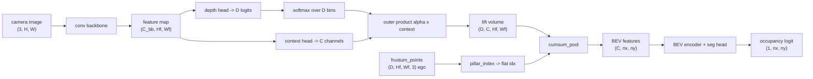

# Lift-Splat-Shoot

You build the view transform that takes camera images and produces a bird's-eye-view (BEV)
feature grid by predicting a depth distribution per pixel, pushing the features out into 3D, and
summing them into BEV pillars. This is Lift-Splat-Shoot (Philion & Fidler, ECCV 2020,
[arXiv:2008.05711](https://arxiv.org/abs/2008.05711)). The depth-lift and the sort+cumsum pooling
you write here are the shared infrastructure that occupancy prediction (A11.5d) reuses unchanged.

## Motivation

A self-driving stack plans in a top-down map of the world around the car: where the road goes,
where other vehicles are, what is drivable. The cameras do not see that map. They see six
perspective images on a ring around the roof, each a 2D projection that has thrown away depth.
Turning those images into one ego-centric BEV grid is the camera-to-BEV view transform, and how
you do it sets the ceiling on everything downstream.

The geometry-only baseline is inverse perspective mapping (the flat-ground homography from the
camera-geometry assignment): assume every pixel lies on the ground plane at $z=0$, project each
BEV cell to a pixel, and sample the image there. That is exact for the road surface and lane
markings, and wrong for anything with height. A car 1.5 m tall projects to the same pixel as a
ground point farther away, so IPM smears tall objects outward, away from their true footprint. A
single image cannot recover height from one ground-plane assumption. You need depth.

The pre-LSS options for getting depth were a separate lidar sensor, or a monocular depth network
that produces one depth per pixel and back-projects a point cloud. A hard one-depth-per-pixel
choice is brittle: the depth network commits to a single distance, and any error places the
feature in the wrong place in BEV with no way for the downstream loss to push back through the
hard argmax. Lift-Splat-Shoot's move (sections 3.1-3.2 of the paper) is to refuse to commit. For
each pixel it predicts a categorical distribution over a fixed set of discrete depth bins, scales
the pixel's feature by the probability of each bin, and scatters the feature to all of those
depths at once. The whole thing is differentiable end to end, so depth is a latent variable
trained from the BEV task loss alone. The paper calls this "implicit" depth: there is no depth
label, the network learns to put weight on the right bin because that is the only way the lifted
feature lands in the BEV pillar where the loss wants it. That single design made multi-camera BEV
perception a clean, trainable module, and most camera-only BEV detectors since are descendants of
it.

The lift produces a frustum-shaped point cloud per camera, one point per (pixel, depth bin). The
splat collapses that cloud onto the BEV plane by summing every point that falls in the same grid
cell ("pillar pooling"). A naive implementation does a scatter-add with one atomic write per
point, which is slow and awkward to differentiate. LSS instead sorts the points by their pillar
index and uses a cumulative-sum trick (section 3.2): the sum over a pillar is the difference of
two cumsum values at the pillar's boundaries. You implement that trick here.



LSS is the trunk of a lineage that refined it. BEVDet (2021,
[arXiv:2112.11790](https://arxiv.org/abs/2112.11790)) takes the LSS view transform and attaches a
3D object-detection head, showing the BEV grid works for detection as well as segmentation.
BEVDepth (AAAI 2023, [arXiv:2206.10092](https://arxiv.org/abs/2206.10092)) found the depth that
LSS learns implicitly is unreliable: when the authors measured it against lidar, the predicted
depth was often wrong even when detection looked fine, because segmentation tolerates coarse
depth but precise 3D boxes do not. Their fix is to add an explicit cross-entropy loss on the
depth distribution, supervised by projected lidar points (the nearest depth bin to each lidar
return). That single supervision signal was the main driver of the accuracy jump and is standard
in production camera detectors, so you implement it here as `bevdepth_depth_loss`. BEVPoolv2
(2022, [arXiv:2211.17111](https://arxiv.org/abs/2211.17111)) is a deployment optimization, not a
new idea: it precomputes the frustum-to-pillar index and fuses the pooling into one CUDA kernel,
reported around 15x faster, because the frustum tensor is the memory and latency bottleneck at
real resolution.

The organizing contrast for this module is push-out versus pull-in. LSS pushes image features
out into 3D along a depth distribution, then pools. BEVFormer (ECCV 2022,
[arXiv:2203.17270](https://arxiv.org/abs/2203.17270)), the next assignment, pulls features in: it
starts from BEV grid queries, projects each query to reference points in the images, and gathers
features there with attention. Both end at a BEV feature grid; they differ in which direction the
geometry runs. Occupancy prediction (A11.5d) reuses your exact depth-lift and frustum code with
one change: drop the BEV collapse and keep the full 3D voxel grid, passing a 3D voxel index to
`cumsum_pool` instead of a 2D pillar index. GaussianLSS (CVPR 2025,
[arXiv:2504.01957](https://arxiv.org/abs/2504.01957)) is the current frontier on the depth
representation: replace the discrete depth bins with a continuous Gaussian per pixel, which
estimates depth uncertainty instead of a histogram.

Two short notes that the toy here cannot show but matter at scale. Temporal fusion: BEVDet4D
(2022, [arXiv:2203.17054](https://arxiv.org/abs/2203.17054)) warps the previous frame's BEV
feature map into the current ego frame and concatenates it, which gives the network velocity
information from two timestamps. And why implicit depth is enough for segmentation but not for
detection: segmentation only needs to know roughly where the drivable surface and obstacles are,
so a smeared depth distribution still paints the right region; a 3D bounding box needs the object
at the right metric distance, where a wrong depth bin moves the whole box, which is exactly the
gap BEVDepth's supervision closes.

## Background

A feature cell at feature-grid location $(i, j)$ corresponds to image pixel
$\big((j+0.5)\cdot s,\ (i+0.5)\cdot s\big)$ for backbone stride $s$. `config.pixel_xy()` precomputes
this grid, so the bookkeeping is provided and the geometry is the part you write.

Depth bins. The bin centers are $\texttt{arange}(d_{\min}, d_{\max}, d_{\text{step}})$, EXCLUSIVE
of $d_{\max}$. With $d_{\min}=1$, $d_{\max}=9$, $d_{\text{step}}=1$ that is $[1, 2, \dots, 8]$, so
$D=8$ and the deepest reachable point is 8 m forward. Writing $\texttt{arange}(1, 10, 1)$ would
give $D=9$ and break every shape; the config docstring pins the exclusive convention.

The lift. The depth head maps the feature map to $D$ logits per cell; softmax over the $D$ bins
gives a depth distribution $\alpha \in \mathbb{R}^{B\times D\times H_f\times W_f}$. The context head
maps to $C$ channels. The lift is the outer product over (depth bin, context channel) per cell:

$$\text{volume}[b, d, c, i, j] = \alpha[b, d, i, j]\;\cdot\;\text{context}[b, c, i, j],$$

shape $(B, D, C, H_f, W_f)$. A pixel whose depth distribution concentrates on bin $d^\*$ sends
almost all of its context to depth $d^\*$ and near-zero elsewhere; a flat distribution spreads the
context across depths. This is the only place depth enters, and it is linear in both $\alpha$ and
the context, so gradients flow to both heads.

The frustum. For each depth bin $d$ and feature cell, back-project the pixel center to a
camera-frame point with the pinhole inverse,

$$X = \frac{(u - c_x)\,d}{f_x},\qquad Y = \frac{(v - c_y)\,d}{f_y},\qquad Z = d,$$

then map to the ego frame. The extrinsic $E$ is $T_{cam\_ego}$ (ego $\to$ camera), so ego points
come from its inverse $T_{ego\_cam} = E^{-1}$. You reuse `unproject`, `invert_transform`, and
`apply_transform` from the camera-geometry assignment; `frustum_points` returns
$(D, H_f, W_f, 3)$ ego-frame points.

The depth range must cover the BEV forward extent. For a forward camera the OpenCV camera $z$ axis
points along ego $+x$, so the camera-frame depth equals the ego forward distance, and a frustum
reaches only as far forward as $d_{\max} - d_{\text{step}} = 8$ m. The BEV grid forward extent must
match: $x \in [0, 8]$ m, not $[0, 16]$. The toy uses $x \in [0, 8]$, $y \in [-8, 8]$ at 1.0 m, an
$8\times16$ grid. A vehicle past 8 m forward would be unreachable by every frustum point. The
center ray of this forward camera points along ego $+x$ (forward); a pixel right of center
($u > c_x$) maps to ego $-y$ (the ego right side).

The pillar index. A point at ego $(x, y)$ falls in cell
$ix = \lfloor (x - x_{\min})/\text{res}\rfloor$ along forward $x$ and
$iy = \lfloor (y - y_{\min})/\text{res}\rfloor$ along lateral $y$; the flat index is
$ix\cdot n_y + iy$. Points outside $[x_{\min}, x_{\max})\times[y_{\min}, y_{\max})$ map to $-1$ and
are dropped. The same flat layout $ix\cdot n_y + iy$ and the reshape $(n_x n_y, C)\to(C, n_x, n_y)$
are used everywhere, so `bev_gt` and the seg head are both $(n_x, n_y)$.

The cumsum splat. Given features $(N, C)$ and a pillar index $(N,)$, drop $idx < 0$, sort the rest
stably by index, and cumsum the sorted features along $N$. For an equal-index run, the sum is the
cumsum at the run's last row minus the cumsum at the previous run's last row, so keeping the last
row of each run and differencing successive run-ends gives every pillar's sum in one pass. Place
each run sum at $\text{out}[\text{bin}]$. The sort is a fixed permutation given $idx$, so the whole
operation is differentiable in the features; gradients flow back through the gather. No
`scatter_add` and no custom kernel - that is the trick the paper introduced and the optimization
BEVPoolv2 later folded into CUDA.

The depth supervision. BEVDepth's loss is a cross-entropy over the $D$ bins at labeled feature
cells: the label is the nearest bin center to the projected depth,
$\text{label} = \arg\min_k |z_{\text{cam}} - \text{bins}[k]|$, computed with the same `bins()`
tensor the model uses. The label is only valid when $z_{\text{cam}}$ falls in
$[d_{\min}, d_{\max}]$, which the toy guarantees by clamping vehicle depth to the reachable range.
With no labeled cell the loss is 0.

## What you'll implement

In `lift_splat.py` (the holed file; the shared library re-exports these through
`nanovision.lift_splat`):

- `DepthLift.forward` and `DepthLift.lift` - the two conv heads and the outer-product lift.
- `frustum_points` - the per-cell, per-depth frustum into ego-frame 3D points.
- `pillar_index` - ego $(x, y)$ to flat BEV index, $-1$ out of bounds.
- `cumsum_pool` - the sort+cumsum splat.
- `LiftSplatShoot.forward` - assemble backbone, lift, frustum, splat, and the BEV head.
- `bevdepth_depth_loss` - the BEVDepth depth-supervision cross-entropy.

The `LSSConfig`, the backbone / BEV encoder / seg-head modules, the precomputed pixel-center grid,
and the `bev_toy_scene` generator are provided.

## Tasks

1. Depth lift (`DepthLift.forward`, `DepthLift.lift`): return depth logits and context, then
   softmax and outer-product them into the lift volume.
2. Frustum (`frustum_points`): unproject the pixel-center frustum at each depth and transform to
   ego with $E^{-1}$.
3. Splat (`pillar_index`, `cumsum_pool`): map points to pillars and pool with sort+cumsum.
4. Assemble (`LiftSplatShoot.forward`): wire backbone -> lift -> frustum -> splat -> BEV head, one
   camera, batch handled as 1.
5. Depth supervision (`bevdepth_depth_loss`): cross-entropy on the GT depth bin at masked cells.

## How to verify

Run in this order (these are the graded tests):

```
python -m pytest assignments/a11_5b_lift_splat_shoot/tests/test_depth_lift.py -q
python -m pytest assignments/a11_5b_lift_splat_shoot/tests/test_frustum.py -q
python -m pytest assignments/a11_5b_lift_splat_shoot/tests/test_splat.py -q
python -m pytest assignments/a11_5b_lift_splat_shoot/tests/test_bev_seg.py -q
python -m pytest assignments/a11_5b_lift_splat_shoot/tests/test_depth_supervision.py -q
python -m pytest assignments/a11_5b_lift_splat_shoot/tests/test_forbidden_imports.py -q
```

`test_depth_lift` checks shapes, that a one-hot depth distribution makes the lift volume equal the
context at the selected bin and near-zero elsewhere, and float64-gradchecks the outer product.
`test_frustum` checks the center pixel at depth $d$ maps to ego $(d, 0, 0)$, a right pixel maps to
ego $-y$, and the ego points project back to the original pixel centers (round-trip $<10^{-3}$).
`test_splat` checks same-pillar summation, dropping out-of-bounds points, equality against a
scatter-add oracle, a float64 gradcheck, and the pillar-index cell math. `test_bev_seg` overfits
the full model on one scene and `test_depth_supervision` overfits the depth head; both reach near
zero. `test_forbidden_imports` is a static scan and passes in both the holed and solution modes.

What the overfit test does and does not show. With one camera and one fixed scene, no two objects
share a pixel at different depths, so depth here is identifiable only trivially: the network
memorizes one depth distribution per pixel and never has to resolve a depth ambiguity. The frustum
geometry is still exercised, because each depth bin along a ray maps to a distinct pillar and $ix$
increases with depth, so a wrong depth lands the feature in a wrong pillar and the BCE penalizes
it. A passing run shows the LSS mechanism composes and is differentiable end to end, not that
implicit depth is learned in any non-trivial sense. The at-scale claim (depth must be supervised
for accurate detection) comes from BEVDepth's lidar measurements, not from this toy.

## Compute notes

CPU only for the graded tests, a few seconds each. The overfit tests run at most 1500 steps (BEV
segmentation) and 800 steps (depth) at Adam lr $10^{-2}$. On the provided toy both reach BCE / CE
near 0 and BEV IoU near 1 well inside the step budget; a curve that plateaus above $\sim 0.05$
loss means the geometry is wired wrong (a sign flip in $E^{-1}$, or $ix\cdot n_y + iy$ swapped to
$iy\cdot n_x + ix$), not an optimization problem. float32 throughout, with float64 gradchecks on
the outer-product lift and the cumsum pool. `viz.py` uses the GPU when one is present and writes
the depth-distribution bar charts and the predicted-vs-GT BEV occupancy to `out/`.

The frustum tensor is the real-world cost. Its shape is
$[N_{cam}, D, H_f, W_f, C]$ - for a small real config (6 cameras, $D=41$, a downsampled feature
grid, tens of channels) the research note for this module puts it near 440 MB, which is the memory
and latency bottleneck BEVPoolv2 attacks. The toy is one camera, $D=8$, an $8\times16$ feature
grid, so the frustum tensor is tiny and the cumsum trick's roughly 2x speedup over a scatter and
BEVPoolv2's roughly 15x are not visible here. Those are real wins at real resolution; the toy is a
mechanism demonstrator, not a benchmark.

## Stretch goals

1. Multi-camera pooling: extend `LiftSplatShoot.forward` past one camera by summing each camera's
   pooled BEV before the encoder (the real LSS fuses six cameras this way).
2. Replace the discrete depth bins with a continuous Gaussian depth head and compare, following
   GaussianLSS.
3. Measure the frustum-tensor memory as you scale $D$ and the grid, and time the cumsum pool
   against a `scatter_add` baseline to see where the trick starts to pay off.

## Further reading

- Philion & Fidler, "Lift, Splat, Shoot" (ECCV 2020),
  [arXiv:2008.05711](https://arxiv.org/abs/2008.05711). The primary source; the outer-product
  lift (section 3.1) and the cumsum splat (section 3.2). Pipeline figure on
  [ar5iv](https://ar5iv.org/abs/2008.05711).
- Li et al., "BEVDepth" (AAAI 2023), [arXiv:2206.10092](https://arxiv.org/abs/2206.10092). Adds
  explicit lidar depth supervision; the main practical accuracy driver.
- Huang et al., "BEVDet" (2021), [arXiv:2112.11790](https://arxiv.org/abs/2112.11790). Applies the
  LSS view transform to 3D detection.
- Huang & Huang, "BEVPoolv2" (2022), [arXiv:2211.17111](https://arxiv.org/abs/2211.17111). Fuses
  the frustum-to-pillar pooling into one CUDA kernel for deployment.
- Li et al., "BEVFormer" (ECCV 2022), [arXiv:2203.17270](https://arxiv.org/abs/2203.17270). The
  pull-in counterpart; BEV queries attend to projected image reference points.
- Lu et al., "Toward Real-world BEV Perception via Gaussian Splatting" / GaussianLSS (CVPR 2025),
  [arXiv:2504.01957](https://arxiv.org/abs/2504.01957). Continuous Gaussian depth instead of
  discrete bins.
