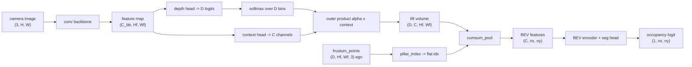

# A11.5b - Lift-Splat-Shoot

The camera-to-BEV view transform turns a ring of perspective camera images into one ego-centric
bird's-eye-view (BEV) feature grid, and how it is done sets the ceiling on everything downstream.
Lift-Splat-Shoot does it by predicting a depth distribution per pixel, pushing each pixel's
feature out into 3-D along that distribution, and summing the result into BEV pillars. The whole
transform is differentiable, so depth is a latent variable trained from the BEV task loss alone.

Build that view transform: the per-pixel depth-and-context lift, the frustum that places each
lifted feature in the ego frame, the sort-and-cumsum pooling that splats the frustum into BEV
pillars, the assembled model, and the BEVDepth depth-supervision loss. The depth-lift and the
sort-and-cumsum pooling built here are the shared infrastructure that occupancy prediction
(A11.5d) reuses unchanged.

Required reading before starting:
- Philion and Fidler 2020, "Lift, Splat, Shoot: Encoding Images from Arbitrary Camera Rigs by
  Implicitly Unprojecting to 3D", [arXiv:2008.05711](https://arxiv.org/abs/2008.05711) (the
  outer-product lift in section 3.1, the cumsum splat in section 3.2).
- Li et al. 2023, "BEVDepth: Acquisition of Reliable Depth for Multi-view 3D Object Detection",
  [arXiv:2206.10092](https://arxiv.org/abs/2206.10092) (the explicit lidar depth supervision).

## Lecture notes

### Why a depth distribution

A self-driving stack plans in a top-down map of the world around the car: where the road goes,
where other vehicles are, what is drivable. The cameras do not see that map. They see six
perspective images on a ring around the roof, each a 2-D projection that has thrown away depth.

The geometry-only baseline is inverse perspective mapping, the flat-ground homography from the
camera-geometry assignment: assume every pixel lies on the ground plane at $z = 0$, project each
BEV cell to a pixel, and sample the image there. That is exact for the road surface and lane
markings, and wrong for anything with height. A car 1.5 m tall projects to the same pixel as a
ground point farther away, so IPM smears tall objects outward, away from their true footprint. A
single image cannot recover height from one ground-plane assumption, so depth is needed.

The pre-LSS options for getting depth were a separate lidar sensor or a monocular depth network
that produces one depth per pixel and back-projects a point cloud. A hard one-depth-per-pixel
choice is brittle: the depth network commits to a single distance, and any error places the
feature in the wrong place in BEV with no way for the downstream loss to push back through the
hard argmax. Lift-Splat-Shoot refuses to commit. For each pixel it predicts a categorical
distribution over a fixed set of discrete depth bins, scales the pixel's feature by the
probability of each bin, and scatters the feature to all of those depths at once. The whole
transform is differentiable end to end, so depth is a latent variable trained from the BEV task
loss alone. The paper calls this "implicit" depth: there is no depth label, and the network
learns to put weight on the right bin because that is the only way the lifted feature lands in
the BEV pillar where the loss wants it. That design made multi-camera BEV perception a clean
trainable module, and most camera-only BEV detectors since are descendants of it.



### The lift

The depth head maps the feature map to $D$ logits per cell; a softmax over the $D$ bins gives a
depth distribution $\alpha \in \mathbb{R}^{B\times D\times H_f\times W_f}$. The context head maps
to $C$ channels. The lift is the outer product over (depth bin, context channel) per cell:

$$\text{volume}[b, d, c, i, j] = \alpha[b, d, i, j]\;\cdot\;\text{context}[b, c, i, j],$$

shape $(B, D, C, H_f, W_f)$. A pixel whose depth distribution concentrates on bin $d^*$ sends
almost all of its context to depth $d^*$ and near-zero elsewhere; a flat distribution spreads the
context across depths. This is the only place depth enters, and it is linear in both $\alpha$ and
the context, so gradients flow to both heads.

### The frustum

For each depth bin $d$ and feature cell, back-project the pixel center to a camera-frame point
with the pinhole inverse,

$$X = \frac{(u - c_x)\,d}{f_x},\qquad Y = \frac{(v - c_y)\,d}{f_y},\qquad Z = d,$$

then map to the ego frame. The extrinsic $E = T_{\text{cam}\_\text{ego}}$ is the ego-to-camera
transform, so ego points come from its inverse $T_{\text{ego}\_\text{cam}} = E^{-1}$. This reuses
the `unproject`, `invert_transform`, and `apply_transform` primitives from the camera-geometry
assignment, and produces a frustum-shaped cloud of ego-frame points, one per (pixel, depth bin).

The depth range must cover the BEV forward extent. For a forward camera the OpenCV camera $z$
axis points along ego $+x$, so the camera-frame depth equals the ego forward distance, and a
frustum reaches only as far forward as the largest depth bin. A vehicle past that distance is
unreachable by every frustum point, so the BEV grid forward extent has to match the depth range.

### The splat

The splat collapses the frustum cloud onto the BEV plane by summing every point that falls in the
same grid cell, called pillar pooling. A point at ego $(x, y)$ falls in cell
$ix = \lfloor (x - x_{\min})/\text{res}\rfloor$ along forward $x$ and
$iy = \lfloor (y - y_{\min})/\text{res}\rfloor$ along lateral $y$; the flat index is
$ix\cdot n_y + iy$. Points outside the grid are dropped.

A naive implementation does a scatter-add with one atomic write per point, which is slow and
awkward to differentiate. LSS instead sorts the points by their pillar index and uses a
cumulative-sum trick: cumsum the sorted features along the point axis, and the sum over a pillar
is the cumsum at the run's last row minus the cumsum at the previous run's last row. Keeping the
last row of each equal-index run and differencing successive run-ends gives every pillar's sum in
one pass.

Concretely, the run boundary is where the sorted index changes. With sorted indices
$[0, 0, 2, 2, 2]$ and per-point scalar features $[a, b, c, d, e]$, the running sum is
$[a, a{+}b, a{+}b{+}c, a{+}b{+}c{+}d, a{+}b{+}c{+}d{+}e]$. The last row of run $0$ is position $1$
and the last row of run $2$ is position $4$ (the rows where the next index differs, with the final
row always a run-end). Reading the cumsum at those two rows gives $[a{+}b,\; a{+}b{+}c{+}d{+}e]$,
and differencing successive entries (treat the first kept entry as a difference against zero, i.e.
prepend a zero row) gives pillar sums $[a{+}b,\; c{+}d{+}e]$ for pillars $0$ and $2$. Pillar $1$ is
empty and never appears, so the result is indexed by the distinct present pillars, then scattered
into the dense grid.

The sort is a fixed permutation given the index, so the whole operation is
differentiable in the features; gradients flow back through the gather, with no `scatter_add` and
no custom kernel. That is the trick the paper introduced and the optimization BEVPoolv2 later
folded into CUDA.

### Implicit depth versus supervised depth

BEVDet (Huang et al. 2021, [arXiv:2112.11790](https://arxiv.org/abs/2112.11790)) takes the LSS
view transform and attaches a 3-D object-detection head, showing the BEV grid works for detection
as well as segmentation. BEVDepth found the depth that LSS learns implicitly is unreliable: when
the authors measured it against lidar, the predicted depth was often wrong even when detection
looked fine, because segmentation tolerates coarse depth but precise 3-D boxes do not.
Segmentation only needs to know roughly where the drivable surface and obstacles are, so a smeared
depth distribution still paints the right region; a 3-D bounding box needs the object at the right
metric distance, where a wrong depth bin moves the whole box.

BEVDepth's fix is an explicit cross-entropy loss on the depth distribution, supervised by
projected lidar points. The label at a feature cell is the nearest depth bin to the projected
lidar return,

$$\text{label} = \arg\min_k \big|z_{\text{cam}} - \text{bins}[k]\big|,$$

valid only where the projected depth $z_{\text{cam}}$ falls inside the bin range. That single
supervision signal was the main driver of the accuracy jump and is standard in production camera
detectors. BEVPoolv2 (Huang and Huang 2022, [arXiv:2211.17111](https://arxiv.org/abs/2211.17111))
is a deployment optimization, not a new idea: it precomputes the frustum-to-pillar index and fuses
the pooling into one CUDA kernel, reported around 15x faster, because the frustum tensor is the
memory and latency bottleneck at real resolution.

### Push-out versus pull-in

The organizing contrast for this module is push-out versus pull-in. LSS pushes image features out
into 3-D along a depth distribution, then pools. BEVFormer (Li et al. 2022,
[arXiv:2203.17270](https://arxiv.org/abs/2203.17270)), the next assignment, pulls features in: it
starts from BEV grid queries, projects each query to reference points in the images, and gathers
features there with attention. Both end at a BEV feature grid; they differ in which direction the
geometry runs. Occupancy prediction reuses the exact depth-lift and frustum code with one change:
drop the BEV collapse and keep the full 3-D voxel grid, passing a 3-D voxel index to the pooling
instead of a 2-D pillar index. GaussianLSS (Lu et al. 2025,
[arXiv:2504.01957](https://arxiv.org/abs/2504.01957)) is the current frontier on the depth
representation: replace the discrete depth bins with a continuous Gaussian per pixel, which
estimates depth uncertainty instead of a histogram.

Two notes that the toy here cannot show but matter at scale. BEVDet4D (Huang and Huang 2022,
[arXiv:2203.17054](https://arxiv.org/abs/2203.17054)) warps the previous frame's BEV feature map
into the current ego frame and concatenates it, which gives the network velocity information from
two timestamps. And the reason implicit depth is enough for segmentation but not detection is the
metric-precision gap BEVDepth's supervision closes.

## The assignment

The toy fixes the config so the geometry stays small and exactly checkable. Depth bin centers are
`arange(d_min, d_max, d_step)` exclusive of `d_max`, so $d_{\min}=1$, $d_{\max}=9$,
$d_{\text{step}}=1$ gives $D=8$ centers $[1, \dots, 8]$ and the deepest reachable point is 8 m
forward (writing `arange(1, 10, 1)` would give $D=9$ and break every shape). To match that depth
reach, the BEV grid is $x \in [0, 8]$, $y \in [-8, 8]$ at 1.0 m, an $8\times16$ grid. A feature
cell at $(i, j)$ corresponds to image pixel $((j+0.5)s, (i+0.5)s)$ for backbone stride $s$;
`config.pixel_xy()` precomputes this so the geometry is the part to implement. The flat pillar
index $ix\cdot n_y + iy$ and the reshape $(n_x n_y, C)\to(C, n_x, n_y)$ are used everywhere, so
the ground truth and the seg head are both $(n_x, n_y)$.

Fill these holes, in order. Each is one `NotImplementedError` with a matching test; the docstring in each file gives the signature, shapes, and constraints.

1. [`DepthLift.forward()`](lift_splat.py) in `lift_splat.py`
2. [`DepthLift.lift()`](lift_splat.py) in `lift_splat.py`
3. [`frustum_points()`](lift_splat.py) in `lift_splat.py`
4. [`pillar_index()`](lift_splat.py) in `lift_splat.py`
5. [`cumsum_pool()`](lift_splat.py) in `lift_splat.py`
6. [`LiftSplatShoot.forward()`](lift_splat.py) in `lift_splat.py`
7. [`bevdepth_depth_loss()`](lift_splat.py) in `lift_splat.py`

Everything is in `lift_splat.py`; the shared library re-exports these through
`nanovision.lift_splat`.

The `LSSConfig`, the backbone / BEV encoder / seg-head modules, the precomputed pixel-center grid,
and the `bev_toy_scene` generator are provided.

### Running and validating

Activate the environment (`conda activate nanovision`), then:

```
make test     A=a11_5b_lift_splat_shoot   # run the tests against the top-level files (the holes)
make verify   A=a11_5b_lift_splat_shoot   # run the same tests against the reference solution/
make viz      A=a11_5b_lift_splat_shoot   # render the figures from the reference solution
make viz-mine A=a11_5b_lift_splat_shoot   # render the figures from your own code (holes filled)
```

`make test` runs the suite in `assignments/a11_5b_lift_splat_shoot/tests/` against the top-level
`lift_splat.py`, red until the holes are filled and green once correct. `make verify` runs the
identical suite against the reference `solution/` by setting `NANOVISION_IMPL=solution`, so it is
green from the start and shows the target.

`test_depth_lift` checks shapes, that a one-hot depth distribution makes the lift volume equal the
context at the selected bin and near-zero elsewhere, and float64-gradchecks the outer product.
`test_frustum` checks that the center pixel at depth $d$ maps to ego $(d, 0, 0)$, a right pixel
maps to ego $-y$, and the ego points project back to the original pixel centers. `test_splat`
checks same-pillar summation, dropping out-of-bounds points, equality against a scatter-add
oracle, a float64 gradcheck, and the pillar-index cell math. `test_bev_seg` overfits the full
model on one scene and `test_depth_supervision` overfits the depth head; both reach near zero.
`test_forbidden_imports` is a static scan and passes in both modes.

What you should see when you run this. The graded tests are CPU only, a few seconds each. The
overfit tests run at most 1500 steps (BEV segmentation) and 800 steps (depth) at Adam lr $10^{-2}$;
on the toy both reach BCE/CE near 0 and BEV IoU near 1 well inside the step budget. A curve that
plateaus above roughly 0.05 loss means the geometry is wired wrong (a sign flip in $E^{-1}$, or
$ix\cdot n_y + iy$ swapped to $iy\cdot n_x + ix$), not an optimization problem. `make viz` writes
the depth-distribution bar charts and the predicted-versus-ground-truth BEV occupancy to `out/`.

The overfit is a mechanism demonstrator. With one camera and one fixed scene, no two objects share
a pixel at different depths, so depth here is identifiable only trivially: the network memorizes
one depth distribution per pixel and never resolves a real depth ambiguity. The frustum geometry
is still exercised, because each depth bin along a ray maps to a distinct pillar and $ix$ increases
with depth, so a wrong depth lands the feature in a wrong pillar and the BCE penalizes it. A
passing run shows the LSS mechanism composes and is differentiable end to end, not that implicit
depth is learned in any non-trivial sense. The at-scale claim, that depth must be supervised for
accurate detection, comes from BEVDepth's lidar measurements, not from this toy. The frustum
tensor of shape $[N_{\text{cam}}, D, H_f, W_f, C]$ is the real-world memory and latency
bottleneck, around 440 MB at a small real config (6 cameras, $D=41$, tens of channels); the toy's
one camera, $D=8$, $8\times16$ grid makes it tiny, so the cumsum trick's roughly 2x speedup over a
scatter and BEVPoolv2's roughly 15x are not visible here.

## Further reading

- Philion and Fidler 2020, "Lift, Splat, Shoot",
  [arXiv:2008.05711](https://arxiv.org/abs/2008.05711). Pipeline figure on
  [ar5iv](https://ar5iv.org/abs/2008.05711).
- Li et al. 2023, BEVDepth, [arXiv:2206.10092](https://arxiv.org/abs/2206.10092), explicit lidar
  depth supervision, the main practical accuracy driver.
- Huang et al. 2021, BEVDet, [arXiv:2112.11790](https://arxiv.org/abs/2112.11790), the LSS view
  transform applied to 3-D detection.
- Huang and Huang 2022, BEVPoolv2, [arXiv:2211.17111](https://arxiv.org/abs/2211.17111), the
  frustum-to-pillar pooling fused into one CUDA kernel for deployment.
- Huang and Huang 2022, BEVDet4D, [arXiv:2203.17054](https://arxiv.org/abs/2203.17054), temporal
  BEV fusion for velocity.
- Li et al. 2022, BEVFormer, [arXiv:2203.17270](https://arxiv.org/abs/2203.17270), the pull-in
  counterpart, BEV queries attending to projected image reference points.
- Lu et al. 2025, GaussianLSS, [arXiv:2504.01957](https://arxiv.org/abs/2504.01957), continuous
  Gaussian depth instead of discrete bins.
