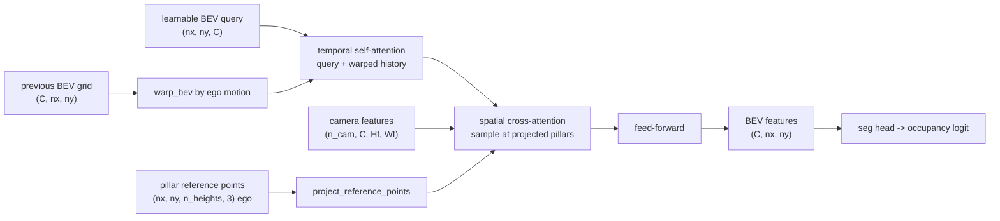

# A11.5c - BEVFormer-style attention

BEVFormer is the query-pull camera-to-BEV view transform. Each bird's-eye-view (BEV) cell knows
its own 3-D location, projects a vertical pillar of reference points back into every camera, and
bilinear-samples the features it needs. A temporal step then warps the previous BEV grid by the
ego motion and fuses it, so the grid accumulates state across frames.

Build that transform: the reference pillars, their projection to image sampling coordinates, the
spatial cross-attention that pulls camera features into BEV cells (both a simplified bilinear path
and the deformable-offset path), the ego-motion warp, the temporal self-attention, and the
assembled encoder with a segmentation head. The dense BEV feature grid the encoder produces is the
shared intermediate that occupancy prediction (A11.5d) and map/motion prediction (A11.5e) consume
unchanged.

Required reading before starting:
- Li et al. 2022, "BEVFormer: Learning Bird's-Eye-View Representation from Multi-Camera Images via
  Spatiotemporal Transformers", [arXiv:2203.17270](https://arxiv.org/abs/2203.17270).
- Zhu et al. 2021, "Deformable DETR: Deformable Transformers for End-to-End Object Detection",
  [arXiv:2010.04159](https://arxiv.org/abs/2010.04159) (the deformable attention the spatial
  cross-attention specializes).

## Lecture notes

### Push-out versus pull-in

The camera-to-BEV view transform turns a ring of perspective camera images into one ego-centric
top-down feature grid, the representation a driving stack plans in. Lift-Splat-Shoot, the
depth-push transform, predicts a depth distribution per pixel and pushes each image feature out
into 3-D, then sums the features that land in each BEV cell. The depth is a latent variable, so a
wrong depth puts the feature in the wrong cell, and the frustum point cloud is memory-heavy: one
point per (pixel, depth bin) per camera.

BEVFormer inverts the direction. Instead of pushing pixels out to where depth says they go, it
starts from the BEV grid and pulls: each BEV cell knows its own 3-D location, so it projects that
location into the cameras and reads the features at the projected pixels. No per-pixel depth is
predicted. The projection is exact geometry (the camera intrinsics and extrinsics from the
camera-geometry assignment), and a cell that several cameras see averages their reads. This pull
sidesteps the depth-estimation step that depth-push depends on.

A single 3-D point per BEV cell is not enough, because a cell at ground level and the same cell at
roof height project to different pixels and the camera might only see one of them. BEVFormer
samples a vertical pillar of reference points per cell (the paper uses 4 heights from -5 m to 3 m
in ego z) and averages the in-frame samples. A reference point is one 3-D anchor location a BEV
cell reads features at; a pillar is the stack of reference points at the same $(x, y)$ over the
height range. A camera is a hit view for a cell if at least one of the cell's pillar points
projects inside that camera's image.



### Where it sat in 2021-2022

The predecessor was DETR3D (Wang et al. 2021,
[arXiv:2110.06922](https://arxiv.org/abs/2110.06922)): a set of sparse 3-D object queries, each
projected to the cameras to sample features, with no dense grid at all. DETR3D detects objects but
produces no map-like representation, and each query reads exactly one point per camera.

PETR (Liu et al. 2022, [arXiv:2203.05625](https://arxiv.org/abs/2203.05625)) is the cleanest
contrast and a good warm-up. PETR unprojects each image pixel to a 3-D ray, encodes that 3-D
position as a per-pixel position embedding added to the image features, and lets object queries do
ordinary global cross-attention over those position-aware features. No BEV grid, no
reference-point projection, no deformable sampling: the 3-D geometry enters through the position
embedding instead of through an explicit projection.

BEVFormer's contribution over DETR3D is the dense BEV grid and two attention mechanisms over it.
The spatial cross-attention reads camera features at the projected pillar reference points; it is a
specialization of the deformable attention of Deformable DETR, where a query attends only to a few
sampling locations near a reference point instead of to the whole feature map. The temporal
self-attention warps the previous frame's BEV grid into the current ego frame and attends the
current query against it, so the grid accumulates state across frames.

### Reference pillars

Each BEV cell center $(x, y)$ becomes a vertical pillar of $n_{\text{ref}}$ points at heights $z$
spaced uniformly in $[z_{\min}, z_{\max}]$, giving ego-frame points of shape
$(n_x, n_y, n_{\text{ref}}, 3)$. These are fixed by the grid and the height range, so the encoder
precomputes them once.

### Projection to grid_sample coordinates

Every ego point projects into each camera with the rig's `world_to_pixel` (the same projection
chain as the camera-geometry assignment; the extrinsic $E = T_{\text{cam}\_\text{ego}}$), which
returns the pixel $(u, v)$ and a mask of points in front of the camera and inside the image
bounds. The pixels become `grid_sample` coordinates with the align_corners=False map

$$g_x = \frac{2(u + 0.5)}{W} - 1, \qquad g_y = \frac{2(v + 0.5)}{H} - 1,$$

and the last dim is ordered $(g_x, g_y) = (\text{width}, \text{height})$ because `grid_sample`
reads the last grid dim as x=width first.

Normalize by the full image size $(W, H)$, not by the downsampled feature-map size
$W_f = W/\text{stride}$. `grid_sample` maps the same $[-1, 1]$ extent across a feature map of any
resolution, so it handles the stride itself. Normalizing by $W_f$ instead offsets every sample by
the stride factor while the hit-mask (computed in full-image pixels) still looks correct, a quiet
garbage-features bug.

### Spatial cross-attention

The spatial cross-attention is the query-pull view transform. In the simplified path it
`grid_sample`s each camera's feature map at the projected reference coords, giving
$(n_{\text{cam}}, C, n_x, n_y, n_{\text{ref}})$ samples, then reduces them. The reduction is the
part to get right: average over the heights that are in-frame, not over all $n_{\text{ref}}$
heights. A pillar that projects in-frame at only 1 of 4 heights must not be divided by 4, or it
reads a quarter of the true feature. So the per-camera mean divides by the count of valid heights:

$$\text{per-cam}_{c} = \frac{\sum_{h} \text{sampled}_{c,h}\, m_{c,h}}{\max\!\big(\sum_h m_{c,h},\ 1\big)},
\qquad m_{c,h} = \text{valid}_{c,h},$$

then the cross-camera mean divides by the number of hit views (the paper's $|V_{\text{hit}}|$
semantics, a camera counts if at least one of its pillar heights is in-frame):

$$\text{out} = \frac{\sum_c \text{per-cam}_c\, \mathbb{1}[\text{hit}_c]}{\max\!\big(\sum_c
\mathbb{1}[\text{hit}_c],\ 1\big)}.$$

A cell no camera sees keeps its input query unchanged, rather than getting a zeroed feature.

The deformable path predicts $n_{\text{points}}$ learned sampling offsets per head around each
reference point, plus a softmax weight per point, samples at the shifted locations, and weight-sums
them before the same height/hit-view reduction. The reference-point projection stays as the anchor;
the offsets are a learned delta. The value and output projections are shared with the simplified
path, so a zero-initialized offset head makes the deformable forward byte-equal to the simplified
one: zero offsets put every sample on the reference point and the softmax weights sum to 1.

### Ego-motion warp

The warp resamples the previous frame's BEV grid so a static world point stays at the same ego BEV
cell after the ego moves. The BEV tensor is $(C, H{=}n_x{=}\text{forward}, W{=}n_y{=}\text{lateral})$.
`affine_grid` builds a sampling (inverse) warp: for output cell $p$ it gives the source cell to
read. After a forward ego translation of $k_x = \text{forward}_{\text{m}}/\text{res}$ cells, a
static world point that was at forward index $i$ must appear at a lower current index $i - k_x$, so
reading that output cell from source index $i$ needs

$$\theta[1, 2] = +\frac{2 k_x}{n_x}, \qquad \theta[0, 2] = +\frac{2 k_y}{n_y},$$

with row 1 the H (forward) axis and row 0 the W (lateral) axis. The plus sign is the trap:
$-2k_x/n_x$ sends the point to $i + k_x$, the double-inverse bug, because `affine_grid` already
inverts once. Yaw rotates the 2x2 block of $\theta$ consistently with the same (W = column 0,
H = row 1) assignment, and zero ego motion is the identity. Both `affine_grid` and `grid_sample`
use align_corners=False.

### Temporal self-attention

Temporal self-attention attends each BEV cell's query against the two-element set {current query,
warped history at that cell}, a 2-key cross-attention, with a residual add. On the first frame the
warped history is absent and this falls back to self-attention on the query alone. The attention is
the multi-head attention from the transformer assignment, not a prebuilt `nn.MultiheadAttention`.

### Assembling the encoder

A learnable BEV query embedding is the starting state. Each encoder layer runs temporal
self-attention against the warped history, then spatial cross-attention pulling from the camera
features, then a feed-forward. Stacking the layers and reading the final query as a dense BEV grid
$(C, n_x, n_y)$, plus a 1x1 convolution segmentation head, produces the occupancy logit.

### BEVFormer's place in 2026

BEVFormer is the foundational query-pull mechanism, not current state of the art. The dense BEV
grid persists where a dense output is needed, map segmentation and occupancy. For camera-only 3-D
object detection on nuScenes, sparse-query methods that drop the dense grid now lead. Sparse4D v2
(Lin et al. 2023, [arXiv:2305.14018](https://arxiv.org/abs/2305.14018)) carries a recurrent set of
sparse instance features across frames instead of warping a grid; PETRv2 (Liu et al. 2022,
[arXiv:2206.01256](https://arxiv.org/abs/2206.01256)) extends PETR's 3-D position embeddings with
temporal alignment. The dense grid trades compute for a representation that map and occupancy heads
can consume directly, which is why this is the right prerequisite for those even though detection
moved on.

BEVFormer v2 (Yang et al. 2023, [arXiv:2211.10439](https://arxiv.org/abs/2211.10439)) adds
perspective supervision, an auxiliary 2-D detection head on the image backbone, and shows that
without it modern image backbones transfer poorly to BEV. A frozen 2-D backbone that gives weak BEV
results points to the 3-D-supervision gap, not the attention code. The temporal self-attention has
a known fragility at long range, where ego-localization noise accumulates and the warped history
drifts out of alignment.

## The assignment

Fill these holes, in order. Each is one `NotImplementedError` with a matching test; the docstring in each file gives the signature, shapes, and constraints.

1. [`bev_reference_points()`](bevformer.py) in `bevformer.py`
2. [`project_reference_points()`](bevformer.py) in `bevformer.py`
3. [`SpatialCrossAttention.forward()`](bevformer.py) in `bevformer.py`
4. [`warp_bev()`](bevformer.py) in `bevformer.py`
5. [`TemporalSelfAttention.forward()`](bevformer.py) in `bevformer.py`
6. [`BEVFormerEncoder.forward()`](bevformer.py) in `bevformer.py`
7. [`BEVFormerSeg.forward()`](bevformer.py) in `bevformer.py`

Everything is in `bevformer.py`; the shared library re-exports these through `nanovision.bevformer`.

The `BEVFormerConfig`, the module `__init__`s, the shared `_reduce_over_heights_and_views` helper,
and the `bev_multicam_scene` generator are provided.

### Running and validating

Activate the environment (`conda activate nanovision`), then:

```
make test     A=a11_5c_bevformer   # run the tests against the top-level files (the holes)
make verify   A=a11_5c_bevformer   # run the same tests against the reference solution/
make viz      A=a11_5c_bevformer   # render the figures from the reference solution
make viz-mine A=a11_5c_bevformer   # render the figures from your own code (holes filled)
```

`make test` runs the suite in `assignments/a11_5c_bevformer/tests/` against the top-level
`bevformer.py`, red until the holes are filled and green once correct. `make verify` runs the
identical suite against the reference `solution/` by setting `NANOVISION_IMPL=solution`, so it is
green from the start and shows the target.

`test_reference_points` checks the pillar geometry and the full-image-size normalization round-trip
(the garbage-features guard). `test_deformable` checks that a zero-initialized offset head makes the
deformable path byte-equal to the simplified one (the measured difference is 2.4e-7, within the
1e-5 tolerance) and that the offset head receives gradient. `test_temporal` pins the warp
numerically: a hot cell at forward index 5 warped by a +2 m forward motion lands at index 3, a
+3 m lateral motion moves its column from 8 to 5, and zero ego motion is the identity (within
5e-7). `test_bev_seg` overfits the simplified `BEVFormerSeg` on one frame.

What you should see when you run this. The toy is a 4-camera ring at 32x32 imaging a few vehicles
as colored blobs on a centered 16x16 BEV grid. `test_bev_seg` reaches BCE 0.0 and BEV IoU 1.0
within 1500 Adam steps at lr $10^{-2}$, about 18 s on CPU, which confirms the geometry, projection,
sampling, reduction, and head compose into a differentiable pipeline that routes each vehicle's
image blob to the correct BEV cell. `make viz` writes two figures to `out/`: the projected
reference points overlaid on each camera image (the geometry-as-attention-prior), and the predicted
versus ground-truth BEV occupancy.

The temporal-necessity test makes history necessary: the moving vehicle is occluded in the current
frame's images but present in frame $t{-}1$ with the correct ego warp, and BCE is scored only on
that vehicle's current-frame cells. The temporal model recovers it from the warped history; the
no-temporal model cannot see it at all. Measured BCE on the occluded cells across three seeds:

| seed | temporal BCE | no-temporal BCE | gap |
|------|--------------|-----------------|-----|
| 0 | 0.0000 | 0.1741 | +0.1741 |
| 1 | 0.0000 | 0.7038 | +0.7038 |
| 2 | 0.0000 | 0.6938 | +0.6938 |

The mean gap is 0.52, above the 0.1 margin the test requires; a single seed is noisy near the floor
(the single-frame model already overfits the visible vehicles), so the test averages over seeds.

These are toy artifacts on a 16x16 grid with 4 cameras and one fixed scene. They show the mechanism
composes and that the warped history carries occluded content; they are not evidence about behavior
at scale. The IoU of 1.0 is an overfit on one scene, not a generalization result, and the
long-range temporal drift named above cannot appear here because the toy's ego motion is exact and
its sequences are two frames.

## Further reading

- Li et al. 2022, BEVFormer, [arXiv:2203.17270](https://arxiv.org/abs/2203.17270).
- Zhu et al. 2021, Deformable DETR, [arXiv:2010.04159](https://arxiv.org/abs/2010.04159).
- Wang et al. 2021, DETR3D, [arXiv:2110.06922](https://arxiv.org/abs/2110.06922).
- Liu et al. 2022, PETR, [arXiv:2203.05625](https://arxiv.org/abs/2203.05625).
- Liu et al. 2022, PETRv2, [arXiv:2206.01256](https://arxiv.org/abs/2206.01256).
- Yang et al. 2023, BEVFormer v2, [arXiv:2211.10439](https://arxiv.org/abs/2211.10439).
- Lin et al. 2023, Sparse4D v2, [arXiv:2305.14018](https://arxiv.org/abs/2305.14018).
