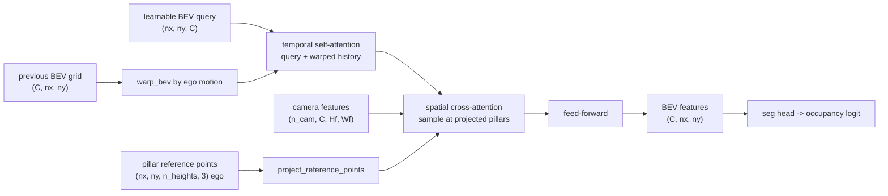

# BEVFormer-style attention

This assignment builds the query-pull camera-to-BEV view transform: each bird's-eye-view (BEV) cell projects a
vertical pillar of 3D reference points back into every camera and bilinear-samples the features it
needs, then a temporal step warps the previous BEV grid by the ego motion and fuses it. This is
BEVFormer (Li et al., ECCV 2022, [arXiv:2203.17270](https://arxiv.org/abs/2203.17270)). The dense
BEV feature grid the encoder produces is the shared intermediate that occupancy prediction (A11.5d)
and map/motion prediction (A11.5e) consume unchanged.

## Motivation

The camera-to-BEV view transform turns a ring of perspective camera images into one ego-centric
top-down feature grid, the representation a driving stack plans in. Lift-Splat-Shoot, the
depth-push transform built before this, predicts a depth distribution per pixel and pushes each
image feature out into 3D, then sums the features that land in each BEV cell. The depth is a latent
variable, so a wrong depth puts the feature in the wrong cell, and the frustum point cloud is
memory-heavy: one point per (pixel, depth bin) per camera.

BEVFormer inverts the direction. Instead of pushing pixels out to where depth says they go, it
starts from the BEV grid and pulls: each BEV cell knows its own 3D location, so it projects that
location into the cameras and reads the features at the projected pixels. No per-pixel depth is
predicted. The projection is exact geometry (the camera intrinsics and extrinsics built in the
camera-geometry assignment), and a cell that several cameras see averages their reads. This is the
query-pull view transform, and it sidesteps the depth-estimation step that depth-push depends on.

A single 3D point per BEV cell is not enough, because a cell at ground level and the same cell at
roof height project to different pixels and the camera might only see one of them. BEVFormer
samples a vertical pillar of reference points per cell (the paper uses 4 heights from -5 m to 3 m
in ego z) and averages the in-frame samples. A "reference point" is one 3D anchor location a BEV
cell reads features at; a "pillar" is the stack of reference points at the same (x, y) over the
height range. A camera is a "hit view" for a cell if at least one of the cell's pillar points
projects inside that camera's image.

### Where it sat in 2021-2022

The predecessor was DETR3D (Wang et al., CoRL 2021,
[arXiv:2110.06922](https://arxiv.org/abs/2110.06922)): a set of sparse 3D object queries, each
projected to the cameras to sample features, with no dense grid at all. DETR3D detects objects but
produces no map-like representation, and each query reads exactly one point per camera.

PETR (Liu et al., ECCV 2022, [arXiv:2203.05625](https://arxiv.org/abs/2203.05625)) is the cleanest
contrast and a good warm-up to read before BEVFormer. PETR unprojects each image pixel to a 3D ray,
encodes that 3D position as a per-pixel position embedding added to the image features, and lets
object queries do ordinary global cross-attention over those position-aware features. No BEV grid,
no reference-point projection, no deformable sampling: the 3D geometry enters through the position
embedding instead of through an explicit projection. PETR is described here for contrast; the
graded build is BEVFormer.

BEVFormer's contribution over DETR3D is the dense BEV grid and two attention mechanisms over it.
The spatial cross-attention reads camera features at the projected pillar reference points; it is a
specialization of the deformable attention of Deformable DETR (Zhu et al., ICLR 2021,
[arXiv:2010.04159](https://arxiv.org/abs/2010.04159)), where a query attends only to a few learned
sampling locations near a reference point instead of to the whole feature map. The temporal
self-attention warps the previous frame's BEV grid into the current ego frame and attends the
current query against it, so the grid accumulates state across frames.

## The mechanisms

### Reference pillars

`bev_reference_points(bev_grid, n_heights, z_min, z_max)` takes each BEV cell center $(x, y)$ from
the grid and stacks $n_{ref}$ points at heights $z$ spaced uniformly in $[z_{min}, z_{max}]$,
returning ego-frame points of shape $(n_x, n_y, n_{ref}, 3)$. These are fixed by the grid and the
height range, so the encoder precomputes them once.

### Projection to grid_sample coordinates

`project_reference_points(ref3d, rig, image_hw)` projects every ego point into each camera with the
rig's `world_to_pixel` (the same projection chain as the camera-geometry assignment; the extrinsic
$E$ is $T_{cam\_ego}$), which returns the pixel $(u, v)$ and a mask of points in front of the
camera and inside the image bounds. The pixels become `grid_sample` coordinates with the
align_corners=False map

$$g_x = \frac{2(u + 0.5)}{W} - 1, \qquad g_y = \frac{2(v + 0.5)}{H} - 1,$$

and the last dim is ordered $(g_x, g_y) = (\text{width}, \text{height})$ because `F.grid_sample`
reads the last grid dim as x=width first. The output is $(n_{cam}, n_x, n_y, n_{ref}, 2)$ coords
and a $(n_{cam}, n_x, n_y, n_{ref})$ boolean mask.

Normalize by the FULL image size $(W, H)$, not by the downsampled feature-map size $W_f = W /
\text{stride}$. `grid_sample` maps the same $[-1, 1]$ extent across a feature map of any resolution,
so it handles the stride itself. Normalizing by $W_f$ instead offsets every sample by the stride
factor while the hit-mask (computed by `world_to_pixel` in full-image pixels) still looks correct,
a quiet garbage-features bug that the round-trip test in `test_reference_points.py` guards against.

### Spatial cross-attention

`SpatialCrossAttention.forward` is the query-pull view transform. In the simplified path it
`grid_sample`s each camera's feature map at the projected reference coords, giving $(n_{cam}, C,
n_x, n_y, n_{ref})$ samples, then reduces them. The reduction is the part to get right: average
over the heights that are in-frame, not over all $n_{ref}$ heights. A pillar that projects in-frame
at only 1 of 4 heights must not be divided by 4, or it reads a quarter of the true feature. So the
per-camera mean divides by the count of valid heights:

$$\text{per\_cam}_{c} = \frac{\sum_{h} \text{sampled}_{c,h}\, m_{c,h}}{\max(\sum_h m_{c,h},\ 1)},
\qquad m_{c,h} = \text{valid}_{c,h},$$

then the cross-camera mean divides by the number of hit views (the paper's $|V_{hit}|$ semantics, a
camera counts if at least one of its pillar heights is in-frame):

$$\text{out} = \frac{\sum_c \text{per\_cam}_c\, \mathbb{1}[\text{hit}_c]}{\max(\sum_c
\mathbb{1}[\text{hit}_c],\ 1)}.$$

A cell no camera sees keeps its input query unchanged (a `torch.where` on the no-hit mask), rather
than getting a zeroed feature. The same reduction helper serves both the simplified and the
deformable paths.

The deformable path (`offsets=True`) predicts $n_{points}$ learned sampling offsets per head around
each reference point, plus a softmax weight per point, samples at the shifted locations, and
weight-sums them before the same height/hit-view reduction. The reference-point projection stays as
the anchor; the offsets are a learned delta. The value and output projections are shared with the
simplified path, so a zero-initialized offset head makes the deformable forward byte-equal to the
simplified one: zero offsets put every sample on the reference point and the softmax weights sum to
1. `test_deformable.py` checks this equality (measured difference 2.4e-7, within the 1e-5
tolerance) and that the offset head receives gradient.

### Ego-motion warp

`warp_bev(prev_bev, ego_delta, bev_grid)` resamples the previous frame's BEV grid so a static world
point stays at the same ego BEV cell after the ego moves. The BEV tensor is $(C, H{=}n_x{=}\text{
forward}, W{=}n_y{=}\text{lateral})$. `F.affine_grid` builds a sampling (inverse) warp: for output
cell $p$ it gives the source cell to read. After a forward ego translation of $k_x = \text{
forward\_m} / \text{res}$ cells, a static world point that was at forward index $i$ must appear at a
LOWER current index $i - k_x$, so reading that output cell from source index $i$ needs

$$\theta[1, 2] = +\frac{2 k_x}{n_x}, \qquad \theta[0, 2] = +\frac{2 k_y}{n_y},$$

with row 1 the H (forward) axis and row 0 the W (lateral) axis. The plus sign is the trap:
$-2k_x/n_x$ sends the point to $i + k_x$, the double-inverse bug, because `affine_grid` already
inverts once. `test_temporal.py` pins this numerically: a hot cell at forward index 5 warped by a
+2 m forward motion lands at index 3, a +3 m lateral motion moves its column from 8 to 5, and zero
ego motion is the identity (within 5e-7). Both `affine_grid` and `grid_sample` use
align_corners=False.

### Temporal self-attention

`TemporalSelfAttention.forward` attends each BEV cell's query against the two-element set {current
query, warped history at that cell}, a 2-key cross-attention, with a residual add. On the first
frame the warped history is None and this falls back to self-attention on the query alone. The
attention is the multi-head attention from the transformer assignment, reused through
`nanovision.attention`, not a prebuilt `nn.MultiheadAttention`.

### Assembling the encoder

`BEVFormerEncoder.forward` projects the reference points, warps the previous BEV grid if present,
then runs each layer in order: temporal self-attention against the warped history, spatial
cross-attention pulling from the camera features, then a feed-forward. It returns the final dense
BEV grid $(C, n_x, n_y)$. `BEVFormerSeg.forward` adds a 1x1 convolution segmentation head to
produce the occupancy logit.

## Reach and limits of the toy

The toy is a 4-camera ring at 32x32 imaging a few vehicles as colored blobs on a centered 16x16 BEV
grid. `test_bev_seg.py` overfits `BEVFormerSeg` (simplified spatial cross-attention, no temporal)
on one frame: it reaches BCE 0.0 and BEV IoU 1.0 within 1500 Adam steps at lr 1e-2 (about 18 s on
CPU). That confirms the geometry, the projection, the sampling, the reduction, and the head compose
into a differentiable pipeline that routes each vehicle's image blob to the correct BEV cell.

The temporal-necessity test makes history necessary: the moving vehicle is occluded in the current
frame's images (dropped from every frame-t render) but present in frame t-1 with the correct ego
warp, and BCE is scored only on that vehicle's current-frame cells. The temporal model recovers it
from the warped history; the no-temporal model cannot see it at all. Measured BCE on the occluded
cells across three seeds:

| seed | temporal BCE | no-temporal BCE | gap |
|------|--------------|-----------------|-----|
| 0 | 0.0000 | 0.1741 | +0.1741 |
| 1 | 0.0000 | 0.7038 | +0.7038 |
| 2 | 0.0000 | 0.6938 | +0.6938 |

The mean gap is 0.52, above the 0.1 margin the test requires. A single seed is noisy near the floor
(the single-frame model already overfits the visible vehicles), so the test averages over seeds.

A 16x16 grid with 4 cameras and one fixed scene shows the mechanism composes; it is not evidence
about behavior at scale. The toy says nothing about the dense-grid-versus-sparse-query tradeoff,
and the temporal self-attention's known fragility at long range, where ego-localization noise
accumulates and the warped history drifts out of alignment, is a real at-scale finding the toy
cannot exhibit because its ego motion is exact and its sequences are two frames. The IoU of 1.0
here is an overfit on one scene, not a generalization result.

### BEVFormer's place in 2026

Frame BEVFormer as the foundational query-pull mechanism, not current state of the art. The dense
BEV grid persists where a dense output is needed: map segmentation and occupancy (A11.5d/e build on
exactly this grid). For camera-only 3D object detection on nuScenes, sparse-query methods that drop
the dense grid now lead. Sparse4D v2 (Lin et al., 2023,
[arXiv:2305.14018](https://arxiv.org/abs/2305.14018)) carries a recurrent set of sparse instance
features across frames instead of warping a grid; PETRv2 (Liu et al.,
[arXiv:2206.01256](https://arxiv.org/abs/2206.01256)) extends PETR's 3D position embeddings with
temporal alignment. The dense grid trades compute for a representation that map and occupancy heads
can consume directly, which is why this assignment is the right prerequisite for those even though
detection moved on.

BEVFormer v2 (Yang et al., CVPR 2023, [arXiv:2211.10439](https://arxiv.org/abs/2211.10439)) is
worth one note: it adds perspective supervision, an auxiliary 2D detection head on the image
backbone, and shows that without it modern image backbones transfer poorly to BEV. If a frozen 2D
backbone gives weak BEV results, the cause is the 3D-supervision gap, not the attention code.

## What to implement

- `bev_reference_points`: BEV cell centers to ego-frame pillars at $n_{ref}$ heights.
- `project_reference_points`: ego pillars to grid_sample coords and an in-frame mask, reusing the
  camera projection.
- `SpatialCrossAttention.forward`: the simplified bilinear-sample path and the deformable-offset
  path, both through the shared height/hit-view reduction.
- `warp_bev`: the ego-motion affine warp of the previous BEV grid.
- `TemporalSelfAttention.forward`: 2-key attention over query and warped history.
- `BEVFormerEncoder.forward` and `BEVFormerSeg.forward`: stack the layers and add the seg head.

The config, the module `__init__`s, the shared reduction helper, and `bev_multicam_scene` are
provided. `viz.py` trains the model and writes two figures: the projected reference points overlaid
on each camera image (the geometry-as-attention-prior), and the predicted versus ground-truth BEV
occupancy.

## References

- Li et al., "BEVFormer: Learning Bird's-Eye-View Representation from Multi-Camera Images via
  Spatiotemporal Transformers" (ECCV 2022), [arXiv:2203.17270](https://arxiv.org/abs/2203.17270).
- Zhu et al., "Deformable DETR: Deformable Transformers for End-to-End Object Detection" (ICLR
  2021), [arXiv:2010.04159](https://arxiv.org/abs/2010.04159).
- Wang et al., "DETR3D: 3D Object Detection from Multi-view Images via 3D-to-2D Queries" (CoRL
  2021), [arXiv:2110.06922](https://arxiv.org/abs/2110.06922).
- Liu et al., "PETR: Position Embedding Transformation for Multi-View 3D Object Detection" (ECCV
  2022), [arXiv:2203.05625](https://arxiv.org/abs/2203.05625).
- Liu et al., "PETRv2: A Unified Framework for 3D Perception from Multi-Camera Images" (2022),
  [arXiv:2206.01256](https://arxiv.org/abs/2206.01256).
- Yang et al., "BEVFormer v2: Adapting Modern Image Backbones to Bird's-Eye-View Recognition via
  Perspective Supervision" (CVPR 2023), [arXiv:2211.10439](https://arxiv.org/abs/2211.10439).
- Lin et al., "Sparse4D v2: Recurrent Temporal Fusion with Sparse Model" (2023),
  [arXiv:2305.14018](https://arxiv.org/abs/2305.14018).
