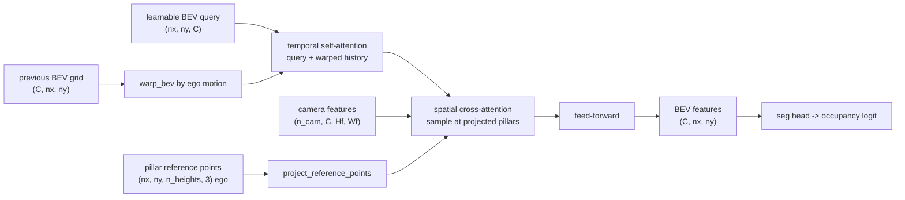

# A11.5c - BEVFormer-style attention

BEVFormer is the query-pull camera-to-BEV view transform. Each bird's-eye-view (BEV) cell knows
its own 3-D location, projects a vertical pillar of reference points back into every camera, and
bilinear-samples the features it needs. A temporal step then warps the previous BEV grid by the
ego motion and fuses it, so the grid accumulates state across frames.

Build that transform: the reference pillars, their projection to image sampling coordinates, the
spatial cross-attention that pulls camera features into BEV cells (both a simplified bilinear path
and the deformable-offset path), the ego-motion warp, the temporal self-attention, and the
assembled encoder with a segmentation head. The dense BEV feature grid the encoder produces is the
shared intermediate that occupancy prediction (A11.5d) and map/motion prediction (A11.5e) consume
unchanged.

Required reading before starting:
- Li et al. 2022, "BEVFormer: Learning Bird's-Eye-View Representation from Multi-Camera Images via
  Spatiotemporal Transformers", [arXiv:2203.17270](https://arxiv.org/abs/2203.17270).
- Zhu et al. 2021, "Deformable DETR: Deformable Transformers for End-to-End Object Detection",
  [arXiv:2010.04159](https://arxiv.org/abs/2010.04159) (the deformable attention the spatial
  cross-attention specializes).

## Lecture notes

### Push-out versus pull-in

The camera-to-BEV view transform turns a ring of perspective camera images into one ego-centric
top-down feature grid, the representation a driving stack plans in. Lift-Splat-Shoot, the
depth-push transform, predicts a depth distribution per pixel and pushes each image feature out
into 3-D, then sums the features that land in each BEV cell. The depth is a latent variable, so a
wrong depth puts the feature in the wrong cell, and the frustum point cloud is memory-heavy: one
point per (pixel, depth bin) per camera.

BEVFormer inverts the direction. Instead of pushing pixels out to where depth says they go, it
starts from the BEV grid and pulls: each BEV cell knows its own 3-D location, so it projects that
location into the cameras and reads the features at the projected pixels. No per-pixel depth is
predicted. The projection is exact geometry (the camera intrinsics and extrinsics from the
camera-geometry assignment), and a cell that several cameras see averages their reads. This pull
sidesteps the depth-estimation step that depth-push depends on.

A single 3-D point per BEV cell is not enough, because a cell at ground level and the same cell at
roof height project to different pixels and the camera might only see one of them. BEVFormer
samples a vertical pillar of reference points per cell (the paper uses 4 heights from -5 m to 3 m
in ego z) and averages the in-frame samples. A reference point is one 3-D anchor location a BEV
cell reads features at; a pillar is the stack of reference points at the same $(x, y)$ over the
height range. A camera is a hit view for a cell if at least one of the cell's pillar points
projects inside that camera's image.

The next five sections build the machinery the transform is made of: image feature maps, attention,
queries, bilinear sampling, and deformable attention. A reader who already knows all five can skip
to "Reference pillars".

### Image feature maps

Nothing in the transform touches raw pixels. Each camera image passes through a convolutional
backbone first, a stack of convolution layers that shrinks the $3 \times H \times W$ image to a
$C \times H_f \times W_f$ feature map. Each layer with stride $s_\ell$ subsamples its input by
$s_\ell$ in both spatial axes, and the product of the layer strides is the total stride $s$, so
$H_f = H / s$ and $W_f = W / s$. The toy backbone is two stride-2 convolutions, $s = 4$: a
$3 \times 32 \times 32$ image becomes a $32 \times 8 \times 8$ feature map with $C = 32$ channels.
Each channel is one learned filter's response, so a feature vector is $C$ numbers describing what
the filters found at that location.

A feature vector at map position $(i, j)$ describes an image neighborhood rather than one pixel:
it was computed from a receptive field of input pixels around that location, at least $s$ pixels
wide and wider once the convolution kernels are counted. Sampling a feature map at a projected
point returns a summary of what the camera saw around that point, which is what a BEV cell wants.

Two words about backbones recur below. A backbone is trained when its weights receive gradient
along with everything else, and frozen when its weights are held fixed and only the layers after
it are trained. The toy trains its backbone from scratch because there is nothing to pretrain on;
a driving stack starts from a backbone pretrained on a large labeled image dataset.

### Attention as a differentiable read

Attention takes a query vector $q \in \mathbb{R}^d$ and a set of $n$ items, item $i$ carrying a key
$k_i \in \mathbb{R}^d$ and a value $v_i$, and returns a weighted average of the values:

$$\text{attn}(q; K, V) = \sum_{i=1}^{n} w_i\, v_i, \qquad
w_i = \frac{\exp(q \cdot k_i / \sqrt{d})}{\sum_{j=1}^{n} \exp(q \cdot k_j / \sqrt{d})}.$$

The weights come from a softmax of the query-key dot products: exponentiate each score, then divide
by the sum. They are non-negative and sum to 1, so the output is an expectation of the values under
a distribution over the items, and that distribution concentrates on the items whose keys point in
the same direction as the query. The $\sqrt{d}$ divisor keeps the dot products from growing with
the dimension, which would push the softmax toward a hard selection and flatten its gradient.

Attention replaces a hard selection. Reading the single best-matching item would be an argmax, a
table lookup with no derivative in the query. Softmax is the smooth version, so moving
the query moves all the weights a little and gradient descent can change what gets read. Every read
in this pipeline is differentiable in that sense, which is why the loss measured on the BEV output
can train what each cell reads and where it reads from.

Queries, keys, and values are not the raw vectors; each is a learned linear projection of its
source. Whether the attention is called self- or cross-attention depends only on where the keys and
values come from. Self-attention projects them from the same set the queries came from, so items
read each other. Cross-attention projects them from a different set, so one set of queries reads a
second collection of things: BEV cells reading camera features is cross-attention.

Multi-head attention splits the $d$ channels into $h$ groups of $d/h$, runs the whole computation
independently within each group, and concatenates the $h$ outputs before a final linear projection.
Independent groups can settle on different similarity criteria, so one head can track one kind of
correspondence while another tracks a different one, instead of a single softmax having to serve
every purpose at once. The temporal and deformable attention here use the multi-head attention
from the transformer assignment, not a prebuilt `nn.MultiheadAttention`.

### Queries as slots

In the attention above the query is given. In a detector there is no query to give, so DETR (Carion
et al. 2020, [arXiv:2005.12872](https://arxiv.org/abs/2005.12872)) invents them. It allocates a
fixed number of vectors, say 100, stores them as free parameters trained by gradient descent, and
starts every image from the same 100 vectors. Each vector is a slot. A stack of layers has the
slots cross-attend into the image features, so each slot fills up with evidence about some part of
the image, and a small head decodes each finished slot into one box and class. Nothing tells slot
7 to find pedestrians; the slots differentiate during training because the loss matches predictions
to ground-truth objects and each slot only improves by specializing.

Two properties of that design carry over. First, a query is a persistent piece of state that starts
identical for every input and becomes input-specific through the reads it performs. Second, layers
update queries in place with a residual add, $\text{query} \leftarrow \text{query} + \text{update}$,
rather than replacing them. The residual add keeps the accumulated state, makes an untrained layer
close to a no-op instead of destroying the query, and gives the gradient a path back through the
stack that does not pass through every layer's weights.

BEVFormer allocates one query per BEV cell. The queries live in an $(n_x, n_y, C)$ parameter tensor
initialized from a small-variance normal and trained like any weight, so what they hold after
training is whatever prior about the grid is worth carrying into every scene. Because a BEV cell
has a known 3-D position and the cameras have known calibration, the query does not have to search
the image for its evidence the way a DETR slot does. Geometry says exactly which pixels correspond
to that cell, so the read locations are computed rather than matched, and the residual add is the
same: a cell no camera sees keeps its query untouched instead of receiving a zeroed feature.

### Bilinear sampling and grid_sample

Projecting a 3-D point into a camera lands at a fractional pixel location, and a feature map is
only defined at integer positions, so the value has to be interpolated. Bilinear interpolation is
the usual answer from image resampling: take the four samples surrounding $(u, v)$ and weight each
by the product of the fractional distances to the opposite corner. For learning, the property that
matters is the derivative. The interpolated value is differentiable in the map values, which lets
the gradient reach the backbone, and it is also differentiable in $u$ and $v$, with
$\partial / \partial u$ a difference between the neighbors on either side, interpolated along the
other axis. A sampling location can therefore be
trained: the gradient says which way to move the sample to lower the loss. Jaderberg et al. (2015)
introduced this as the sampling layer of spatial transformer networks, and it is the mechanism
under the learned offsets in the next section.

PyTorch's `F.grid_sample` does this in normalized coordinates. It takes a grid of $(g_x, g_y)$
pairs in $[-1, 1]$, where the last dim is ordered $x$ first and $x$ runs along the width axis, and
returns the map sampled at those locations, with `padding_mode="zeros"` returning 0 outside the
range. With `align_corners=False`, $[-1, 1]$ covers the map as $W$ equal cells and an integer pixel
index $u$ sits at the center of its cell:

$$g_x = \frac{2(u + 0.5)}{W} - 1.$$

Check the ends: $u = 0$ gives $-1 + 1/W$ and $u = W - 1$ gives $1 - 1/W$, so $\pm 1$ falls on the
outer boundary of the border pixels, half a pixel past their centers. The other convention,
`align_corners=True`, instead maps $u = 0$ to exactly $-1$ and $u = W - 1$ to exactly $+1$; mixing
the two shifts every sample by half a pixel. Everything here uses `align_corners=False`, in both
`grid_sample` and `affine_grid`.

The normalized coordinate is independent of resolution, which is the property the projection step
below depends on: the same $g_x$ addresses the same physical place in the image whether it is
applied to the $32 \times 32$ image or the $8 \times 8$ feature map computed from it.

### Deformable attention

Cross-attention as written above scores the query against every item. For a query set of size $Q$
and a feature map of $P$ positions that is $QP$ dot products, and both numbers are large here: a
production BEVFormer runs a $200 \times 200$ BEV grid, so $Q = 40000$ queries, against six camera
feature maps. Deformable DETR's change is to stop scoring. Instead of comparing the query to keys,
a linear layer reads the query and directly emits $M$ two-dimensional offsets
$\Delta p_1, \dots, \Delta p_M$ from a reference point $p$, and a second linear layer emits $M$
scores that a softmax turns into weights $a_1, \dots, a_M$. The output is

$$\sum_{m=1}^{M} a_m\, V(p + \Delta p_m),$$

where $V(\cdot)$ is the value map bilinearly sampled at a continuous location. No key is ever
formed and no query-key dot product is computed; the attention weights are a function of the query
alone. The cost is $M$ samples per query per head with $M$ around 4, independent of the feature map
size, and the weights still sum to 1, so it is still a weighted average of values. What makes the
offsets trainable is bilinear sampling being differentiable in the sampling location: the loss
gradient reaches $\Delta p_m$ through $V$ and moves each sample toward more useful content.

The reference point $p$ is where the attention is centered, so the choice of $p$ decides what the
learned offsets are a correction to. Deformable DETR's decoder predicts it from the object query
with another linear layer, so even the anchor is learned. BEVFormer does not
have to: the BEV cell's 3-D pillar point projected into a camera is already the right image
location for that cell, so geometry supplies $p$ and the learned offsets only refine it by a small
amount around a location that calibration already got right. The other half of the specialization
is which cameras a query attends to at all, decided by the projection's in-frame mask rather than
by learning.

### Where it sat in 2021-2022

The predecessor was DETR3D (Wang et al. 2021,
[arXiv:2110.06922](https://arxiv.org/abs/2110.06922)): DETR's slots, moved into 3-D. Each query
carries a predicted 3-D reference point, that point is projected into every camera, the features at
the projected pixels are sampled and added back into the query, and the next layer repeats with the
refined point. There is no grid at all, so DETR3D detects objects but produces no map-like
representation, and each query reads exactly one point per camera.

PETR (Liu et al. 2022, [arXiv:2203.05625](https://arxiv.org/abs/2203.05625)) reaches the same goal
without projecting anything, and the contrast is worth following because it isolates what the
projection is for. Attention treats its inputs as an unordered set, so image features carry no
information about where in the image or the world they came from unless something adds it. That
something is a position embedding, a vector derived from a location and added to the feature at
that location, which makes the dot product between a query and a key depend on position as well as
content. PETR builds a 3-D one: for each feature-map position it uses the known intrinsics and
extrinsics to compute the 3-D ray of points that project there, encodes that set of 3-D coordinates
with a small MLP, and adds the result to the image feature. Object queries then run ordinary global
cross-attention over those position-aware features. The 3-D geometry is still doing the work, but
it is baked into the keys once instead of being applied per query as an explicit projection.

BEVFormer's contribution over DETR3D is the dense BEV grid and two attention mechanisms over it.
The spatial cross-attention reads camera features at the projected pillar reference points, the
deformable attention above with the reference point fixed by geometry. The temporal self-attention
warps the previous frame's BEV grid into the current ego frame and attends the current query
against it, so the grid accumulates state across frames.

### Reference pillars

Each BEV cell center $(x, y)$ becomes a vertical pillar of $n_{\text{ref}}$ points at heights $z$
spaced uniformly in $[z_{\min}, z_{\max}]$, giving ego-frame points of shape
$(n_x, n_y, n_{\text{ref}}, 3)$. These are fixed by the grid and the height range, so the encoder
precomputes them once.

### Projection to grid_sample coordinates

Every ego point projects into each camera with the rig's `world_to_pixel` (the same projection
chain as the camera-geometry assignment; the extrinsic $E = T_{\text{cam} \leftarrow \text{ego}}$
maps ego coordinates into camera coordinates), which returns the pixel $(u, v)$ and a mask of
points in front of the camera and inside the image bounds. The pixels become `grid_sample`
coordinates with the `align_corners=False` map

$$g_x = \frac{2(u + 0.5)}{W} - 1, \qquad g_y = \frac{2(v + 0.5)}{H} - 1,$$

and the last dim is ordered $(g_x, g_y) = (\text{width}, \text{height})$ because `grid_sample`
reads the last grid dim as x=width first.

Normalize by the full image size $(W, H)$, not by the downsampled feature-map size
$W_f = W/\text{stride}$. `grid_sample` maps the same $[-1, 1]$ extent across a feature map of any
resolution, so it handles the stride itself. Normalizing by $W_f$ instead offsets every sample by
the stride factor while the hit-mask (computed in full-image pixels) still looks correct, a quiet
garbage-features bug.

### Spatial cross-attention

The spatial cross-attention is the query-pull view transform. In the simplified path it
`grid_sample`s each camera's feature map at the projected reference coords, giving
$(n_{\text{cam}}, C, n_x, n_y, n_{\text{ref}})$ samples, then reduces them.

Read the word attention carefully here. This path computes no scores at all. The weights are fixed
by the in-frame mask: a uniform average over the valid heights within a camera, then a uniform
average over the cameras that see the cell. It is cross-attention in the structural sense, one set
of queries reading values from a different set, with the attention pattern handed to calibration
instead of being learned. The learned version is the deformable path in the next section, and it
keeps the same two averages on top.

The reduction is the part to get right: average over the heights that are in-frame, not over all
$n_{\text{ref}}$ heights. A pillar that projects in-frame at only 1 of 4 heights must not be
divided by 4, or it reads a quarter of the true feature. So the per-camera mean divides by the
count of valid heights:

$$\text{per-cam}_{c} = \frac{\sum_{h} \text{sampled}_{c,h}\, m_{c,h}}{\max\!\big(\sum_h m_{c,h},\ 1\big)},
\qquad m_{c,h} = \text{valid}_{c,h},$$

then the cross-camera mean divides by the number of hit views (the paper's $|V_{\text{hit}}|$
semantics, a camera counts if at least one of its pillar heights is in-frame):

$$\text{out} = \frac{\sum_c \text{per-cam}_c\, \mathbb{1}[\text{hit}_c]}{\max\!\big(\sum_c
\mathbb{1}[\text{hit}_c],\ 1\big)}.$$

Partial pillars are the common case, not an edge case. In the toy's default rig, of the 252
(camera, cell) pairs that see anything at all, 112 have all four heights in-frame and 140 have
fewer, so dividing by $n_{\text{ref}}$ would scale most of the grid's features down.

A cell no camera sees keeps its input query unchanged, rather than getting a zeroed feature.

### The deformable path

The deformable path predicts $n_{\text{points}}$ learned sampling offsets per head around each
reference point, plus a softmax weight per point, samples at the shifted locations, and weight-sums
them before the same height/hit-view reduction. The reference-point projection stays as the anchor;
the offsets are a learned delta. The value and output projections are shared with the simplified
path, so a zero-initialized offset head makes the deformable forward byte-equal to the simplified
one: zero offsets put every sample on the reference point and the softmax weights sum to 1. That
equality is a useful test precisely because it holds only if the offsets enter as a delta in the
same normalized coordinate system the reference points live in.

### Resampling and the ego-motion warp

The warp resamples the previous frame's BEV grid so a static world point stays at the same ego BEV
cell after the ego moves. Resampling is done backward, the standard choice in image warping: iterate
over output cells and pull from the source, because iterating over source cells and pushing forward
scatters into non-integer targets and leaves holes. So the map that has to be supplied is
output-to-source, the inverse of the motion.

`F.affine_grid` takes that map as a $2 \times 3$ matrix $\theta$ acting on normalized output
coordinates and returning normalized source coordinates,

$$\begin{pmatrix} x_s \\ y_s \end{pmatrix} =
\begin{pmatrix} \theta_{00} & \theta_{01} \\ \theta_{10} & \theta_{11} \end{pmatrix}
\begin{pmatrix} x_o \\ y_o \end{pmatrix} +
\begin{pmatrix} \theta_{02} \\ \theta_{12} \end{pmatrix},$$

and returns the full grid of source coordinates for `grid_sample` to read. Both coordinate pairs
follow the `grid_sample` convention, $x$ along the width axis and $y$ along the height axis, which
pins the row assignment below.

The BEV tensor is $(C, H{=}n_x{=}\text{forward}, W{=}n_y{=}\text{lateral})$, so row 1 of $\theta$
drives the forward axis and row 0 the lateral axis. The grid is centered, with half-extents
$L_x = n_x \cdot \text{res} / 2$ forward and $L_y = n_y \cdot \text{res} / 2$ lateral, so the
normalized coordinate of a cell is its ego coordinate divided by the half-extent of that axis and
one cell of forward index is $2/n_x$ of normalized distance. Now take a
forward ego translation of $k_x = \text{forward}_{\text{m}} / \text{res}$ cells. A static world
point that sat at forward index $i$ in the previous frame sits at $i - k_x$ in the current frame,
so the output cell $i - k_x$ must read source index $i$, a source-minus-output difference of
$+k_x$ cells, or $+2 k_x / n_x$ normalized:

$$\theta[1, 2] = +\frac{2 k_x}{n_x}, \qquad \theta[0, 2] = +\frac{2 k_y}{n_y}.$$

The plus sign is the trap: $-2k_x/n_x$ sends the point to $i + k_x$, the double-inverse bug,
because `affine_grid` already works output-to-source. The same derivation gives the $2 \times 2$
block. Writing the output-to-source relation for a yaw $\psi$ as
$p_{\text{prev}} = R(\psi)\,p_{\text{cur}} + t$ and re-expressing it in the (lateral, forward) axis
order that $\theta$ uses swaps the two components, which flips the sign of the off-diagonal entries
relative to the usual form, giving $\theta_{2\times2} = \big[[\cos\psi, \sin\psi], [-\sin\psi,
\cos\psi]\big]$. Zero ego motion is the identity. The tests here cover translation only, since the
toy's ego motion has no yaw, so the rotation block is checked by that derivation rather than
numerically.

### Temporal self-attention

Temporal self-attention attends each BEV cell's query against the two-element set {current query,
warped history at that cell}, a 2-key cross-attention, with a residual add. With only two items the
softmax reduces to a per-cell blend weight between now and history, and it is content-dependent:
the same cell can lean on the history where the current cameras show nothing and ignore it where
they show something better. On the first frame the warped history is absent and this falls back to
self-attention on the query alone.

BEVFormer's own temporal self-attention is a deformable attention, so a cell can read the history at
learned offsets around itself and absorb small misalignments in the warp. The version here reads the
history only at the cell's own location, which is exact for the toy because its ego motion is known
without error.

### Assembling the encoder

A learnable BEV query embedding is the starting state, the $(n_x, n_y, C)$ parameter tensor from
the queries section. Each encoder layer runs temporal self-attention against the warped history,
then spatial cross-attention pulling from the camera features, then a feed-forward: a two-layer MLP
with a GELU nonlinearity in between, applied to each BEV cell's $C$-vector separately and with a
residual add. Attention moves information between locations, the feed-forward mixes channels within
a location, and the layers alternate the two. Stacking the layers and reading the final query as a
dense BEV grid $(C, n_x, n_y)$, plus a 1x1 convolution segmentation head, produces the occupancy
logit.



### The segmentation head and the loss

A 1x1 convolution over a $(C, n_x, n_y)$ grid is one linear map $\mathbb{R}^C \to
\mathbb{R}^{n_{\text{classes}}}$ applied independently at every cell with the same weights, so it is
a per-cell classifier reading only that cell's feature vector. With one output channel it emits a
single number $z$ per cell, the logit. The occupancy probability is the logistic function
$\sigma(z) = 1 / (1 + e^{-z})$, so $z > 0$ means the cell is more likely occupied than free and
$z = 0$ is the decision boundary.

Training minimizes the binary cross-entropy of the label $y \in \{0, 1\}$ under that Bernoulli
model, which is its negative log likelihood:

$$\mathcal{L} = -\frac{1}{N} \sum_{\text{cells}} \Big[ y \log \sigma(z)
+ (1 - y) \log\big(1 - \sigma(z)\big) \Big].$$

A confident correct prediction contributes almost 0 and a confident wrong one diverges, so the loss
keeps grading how sure the model is rather than only its thresholded decision. The reported IoU is
the complementary set metric: threshold at $z > 0$, then divide
the number of cells predicted and labeled occupied by the number predicted or labeled occupied. It
ignores confidence entirely, so a model can sit at IoU 1.0 with a nonzero loss.

The optimizer is Adam, which rescales each parameter's gradient by a running estimate of its own
recent magnitude, so parameters with small gradients still move. That matters here because the same
loss trains a convolution backbone, attention projections, and the BEV query embedding at once, and
their natural gradient scales differ by orders of magnitude.

### BEVFormer's place in 2026

BEVFormer is the foundational query-pull mechanism, not current state of the art. The dense BEV
grid persists where a dense output is needed, map segmentation and occupancy. Camera-only 3-D
object detection is usually ranked on nuScenes (Caesar et al. 2020), a driving dataset recorded
with a six-camera surround rig plus lidar and radar; camera-only means the lidar is used to make
the 3-D box labels but not available to the model at test time. On that benchmark, sparse-query
methods that drop the dense grid now lead. They keep a few hundred instance queries instead of
$n_x n_y$ cell queries, so the cost tracks the number of objects rather than the area of the grid,
and nothing is spent on the empty majority of the map.

Sparse4D v2 (Lin et al. 2023, [arXiv:2305.14018](https://arxiv.org/abs/2305.14018)) carries a
recurrent set of sparse instance features across frames instead of warping a grid: the instance
queries from frame $t-1$, with their 3-D anchors moved by the ego motion, become the starting
queries at frame $t$, so history lives in a few hundred vectors rather than a grid-sized tensor.
PETRv2 (Liu et al. 2022, [arXiv:2206.01256](https://arxiv.org/abs/2206.01256)) extends PETR's 3-D
position embeddings with temporal alignment, transforming the previous frame's 3-D positions into
the current ego frame before encoding them, so the same global attention spans both frames. The
dense grid trades compute for a representation that map and occupancy heads can consume directly,
which is why this is the right prerequisite for those even though detection moved on.

BEVFormer v2 (Yang et al. 2023, [arXiv:2211.10439](https://arxiv.org/abs/2211.10439)) adds
perspective supervision, an auxiliary 2-D detection head attached to the image backbone and trained
on 2-D boxes in the image plane, alongside the usual BEV head. The paper reports that without it,
modern image backbones transfer poorly to BEV, and attributes that to the shape of the training
signal reaching the backbone. Through the BEV head alone, the backbone's only gradient arrives
after projection, sampling, and averaging over pillars and cameras, heavily mixed and indirect;
the auxiliary head gives it a loss in its own output space instead. So a frozen or weakly
adapted 2-D backbone that produces poor BEV results is evidence about that supervision path, not
about the attention code.

The temporal self-attention has a known fragility at long range, where ego-localization noise
accumulates and the warped history drifts out of alignment.

## The assignment

Fill these holes, in order. Each is one `NotImplementedError` with a matching test; the docstring in each file gives the signature, shapes, and constraints.

1. [`bev_reference_points()`](bevformer.py) in `bevformer.py`
2. [`project_reference_points()`](bevformer.py) in `bevformer.py`
3. [`SpatialCrossAttention.forward()`](bevformer.py) in `bevformer.py`
4. [`warp_bev()`](bevformer.py) in `bevformer.py`
5. [`TemporalSelfAttention.forward()`](bevformer.py) in `bevformer.py`
6. [`BEVFormerEncoder.forward()`](bevformer.py) in `bevformer.py`
7. [`BEVFormerSeg.forward()`](bevformer.py) in `bevformer.py`

Everything is in `bevformer.py`; the shared library re-exports these through `nanovision.bevformer`.

The `BEVFormerConfig`, the module `__init__`s, the shared `_reduce_over_heights_and_views` helper,
and the `bev_multicam_scene` generator are provided.

### Running and validating

Activate the environment (`conda activate nanovision`), then:

```
make test     A=a11_5c_bevformer   # run the tests against the top-level files (the holes)
make verify   A=a11_5c_bevformer   # run the same tests against the reference solution/
make viz      A=a11_5c_bevformer   # render the figures from the reference solution
make viz-mine A=a11_5c_bevformer   # render the figures from your own code (holes filled)
```

`make test` runs the suite in `assignments/a11_5c_bevformer/tests/` against the top-level
`bevformer.py`, red until the holes are filled and green once correct. `make verify` runs the
identical suite against the reference `solution/` by setting `NANOVISION_IMPL=solution`, so it is
green from the start and shows the target.

`test_reference_points` checks the pillar geometry and the full-image-size normalization round-trip
(the garbage-features guard). `test_deformable` checks that a zero-initialized offset head makes the
deformable path byte-equal to the simplified one (the measured difference is 2.4e-7, within the
1e-5 tolerance) and that the offset head receives gradient. `test_temporal` pins the warp
numerically: a hot cell at forward index 5 warped by a +2 m forward motion lands at index 3, a
+3 m lateral motion moves its column from 8 to 5, and zero ego motion is the identity (within
5e-7). `test_bev_seg` overfits the simplified `BEVFormerSeg` on one frame.

What you should see when you run this. The toy is a 4-camera ring at 32x32 imaging a few vehicles
as colored blobs on a centered 16x16 BEV grid. `test_bev_seg` reaches BCE 0.0 and BEV IoU 1.0
within 1500 Adam steps at lr $10^{-2}$, about 18 s on an unloaded CPU, which confirms the geometry,
projection, sampling, reduction, and head compose into a differentiable pipeline that routes each
vehicle's image blob to the correct BEV cell. `make viz` writes two figures to `out/`: the projected reference points
overlaid on each camera image, which is the set of pixels each BEV cell will read, fixed by
calibration before any training happens, and the predicted versus ground-truth BEV occupancy.

The temporal-necessity test makes history necessary: the moving vehicle is occluded in the current
frame's images but present in frame $t{-}1$ with the correct ego warp, and BCE is scored only on
that vehicle's current-frame cells. The temporal model recovers it from the warped history; the
no-temporal model cannot see it at all. Measured BCE on the occluded cells across three seeds:

| seed | temporal BCE | no-temporal BCE | gap |
|------|--------------|-----------------|-----|
| 0 | 0.0000 | 0.1741 | +0.1741 |
| 1 | 0.0000 | 0.7038 | +0.7038 |
| 2 | 0.0000 | 0.6938 | +0.6938 |

The mean gap is 0.52, above the 0.1 margin the test requires; a single seed is noisy near the floor
(the single-frame model already overfits the visible vehicles), so the test averages over seeds.

These are toy artifacts on a 16x16 grid with 4 cameras and one fixed scene. They show the mechanism
composes and that the warped history carries occluded content; they are not evidence about behavior
at scale. The IoU of 1.0 is an overfit on one scene, not a generalization result, and the
long-range temporal drift named above cannot appear here because the toy's ego motion is exact and
its sequences are two frames.

## Further reading

- Li et al. 2022, BEVFormer, [arXiv:2203.17270](https://arxiv.org/abs/2203.17270).
- Zhu et al. 2021, Deformable DETR, [arXiv:2010.04159](https://arxiv.org/abs/2010.04159).
- Carion et al. 2020, DETR, [arXiv:2005.12872](https://arxiv.org/abs/2005.12872).
- Jaderberg et al. 2015, Spatial Transformer Networks (the differentiable bilinear sampling layer).
- Wang et al. 2021, DETR3D, [arXiv:2110.06922](https://arxiv.org/abs/2110.06922).
- Liu et al. 2022, PETR, [arXiv:2203.05625](https://arxiv.org/abs/2203.05625).
- Liu et al. 2022, PETRv2, [arXiv:2206.01256](https://arxiv.org/abs/2206.01256).
- Yang et al. 2023, BEVFormer v2, [arXiv:2211.10439](https://arxiv.org/abs/2211.10439).
- Lin et al. 2023, Sparse4D v2, [arXiv:2305.14018](https://arxiv.org/abs/2305.14018).
- Caesar et al. 2020, nuScenes.
