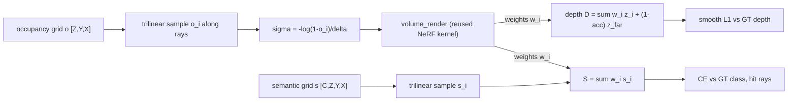

# A11.5d - 3D occupancy prediction

A semantic 3-D occupancy predictor holds a voxel grid where each cell carries an occupancy
probability and a class. Supervising it is volume rendering run backward: rays cast into the grid
accumulate occupancy into a rendered depth and a rendered semantic vector, and 2-D supervision (a
depth map and a per-pixel class map) pulls the 3-D field into agreement. This is how RenderOcc and
OccNeRF train an occupancy field without 3-D voxel labels, reusing the front-to-back alpha
compositing from the NeRF assignment unchanged.

Build the predictor and its rendering supervision: pillar extrusion that lifts a bird's-eye-view
(BEV) feature map to a voxel volume, the per-voxel classifier, the inverse-frequency class
weighting and weighted cross-entropy that counter the free-class imbalance, the occupied-class
mean-intersection-over-union metric, and the differentiable renderer that turns the occupancy grid
into per-ray depth and semantics.

Required reading before starting:
- Pan et al. 2024, "RenderOcc: Vision-Centric 3D Occupancy Prediction with 2D Rendering
  Supervision", [arXiv:2309.09502](https://arxiv.org/abs/2309.09502).
- Tian et al. 2023, "Occ3D: A Large-Scale 3D Occupancy Prediction Benchmark for Autonomous
  Driving", [arXiv:2304.14365](https://arxiv.org/abs/2304.14365).

## Lecture notes

### Why occupancy

A self-driving stack needs to know which 3-D regions are occupied and by what, including
categories a 3-D object detector never enumerates: construction debris, an overturned cart, an
animal, the irregular overhang of a truck bed. A bounding-box detector answers "where are the
known object types"; occupancy answers "which volumes of space are filled", the question a planner
needs in order to avoid collisions. The output is a voxel grid where each cell carries an
occupancy state and, in the semantic variant, a class.

Two lines of work converged on this formulation. The first is semantic scene completion, the task
of taking a partial observation of a scene and filling in both the geometry that was not observed
and a class label for every filled cell. MonoScene (Cao and de Charette 2021,
[arXiv:2112.00726](https://arxiv.org/abs/2112.00726)) showed a single image could be lifted to a
dense semantic voxel volume by projecting 2-D features along their lines of sight and completing
the unseen geometry with a 3-D network. The second is multi-camera surround perception. SurroundOcc
(Wei et al. 2023, [arXiv:2303.09551](https://arxiv.org/abs/2303.09551)) extended the completion
idea to a full camera rig and spelled out how dense occupancy labels are produced. The Occ3D
benchmark standardized the task into a 200x200x16-voxel, 18-class problem over nuScenes and Waymo,
and occupancy became a named subfield.

### Where the 3-D labels come from

No sensor measures occupancy. A lidar returns points on the surfaces its beams reached, so one
sweep gives a sparse shell of the visible side of every object and says nothing about the interior,
the far side, or anything in shadow. Turning that into a dense labeled voxel grid takes an offline
pipeline, roughly the one SurroundOcc and Occ3D describe. The lidar sweeps of a whole sequence are
aggregated into one point cloud using the ego poses, with moving objects accumulated in their own
object frames so that a driving car does not smear into a wall. The point-wise semantic labels come
along, and each voxel takes the majority class of the points that land inside it. A surface
reconstruction closes the holes that aggregation leaves. Finally the pipeline reasons about
visibility and marks the voxels no sensor ever saw as unknown, so that a loss can skip them instead
of training on a guess.

Every step costs something. The rig needs a lidar, the sequence has to be processed as a whole
rather than frame by frame, and the labels inherit any error in the ego poses and the object boxes.
The result is a derived dataset released separately from the raw sensor data, not something a
camera-only capture comes with.

That constraint motivates the rendering-supervision path. RenderOcc (Pan et al. 2024) and OccNeRF
(Zhang et al. 2023, [arXiv:2312.09243](https://arxiv.org/abs/2312.09243)) drop the 3-D labels and
supervise the voxel field with 2-D maps only: a depth map per camera, from a projected lidar sweep
or a depth network, and a per-pixel class map from a 2-D segmentation network. Both are per-frame
quantities that need no aggregation and no visibility reasoning. The field is rendered along the
camera rays, and the rendered depth and rendered class are compared against those 2-D maps. OccNeRF
pushes the same idea further and supervises geometry from photometric consistency between
neighboring frames, so the depth labels go away too.

The rest of these notes follow the pipeline in the order the assignment builds it: BEV features to
a voxel volume, a per-voxel classifier, the loss that survives the class imbalance, the metric, and
finally the differentiable renderer that makes 2-D supervision reach the 3-D field.

### Lifting BEV features to voxels

The voxel features start from a bird's-eye-view (BEV) feature map, the ego-centric top-down grid
built either by Lift-Splat-Shoot's depth-distribution splatting or by BEVFormer's query-pull
attention. It is a $[B, C, Y, X]$ tensor: one $C$-dimensional feature vector per ground-plane cell,
with the height axis already collapsed. Occupancy needs that axis back.

Pillar extrusion restores it with a 1x1 convolution. A 1x1 convolution is a linear map applied
independently at every spatial location, with one weight matrix shared across all locations: it
mixes channels and never touches neighbors, so it is a per-cell matrix multiply wearing a
convolution's name. Here the map is $\text{Conv2d}(C, C n_z, 1)$, so a BEV cell holding the feature
vector $f \in \mathbb{R}^{C}$ produces $Wf + b \in \mathbb{R}^{C n_z}$, and reshaping $[B, C n_z, Y,
X]$ to $[B, C, n_z, Y, X]$ reads those $C n_z$ numbers as one $C$-vector per height layer.

A BEV cell limits what the convolution can learn. A single cell holds no evidence about the height
its content sits at, since that information was destroyed when the height axis collapsed. The layer
learns a prior over height instead: which channel patterns usually belong near the ground and which
belong overhead, applied identically at every cell. That beats repeating one vector at every
height, because the $n_z$ slices can differ, but it is not a height distribution and nothing
normalizes it.

Keeping height in the first place is the alternative. TPVFormer (Huang et al. 2023,
[arXiv:2302.07817](https://arxiv.org/abs/2302.07817)) uses a tri-perspective view: the BEV plane
plus two planes perpendicular to it, one facing front and one facing side. A 3-D point queries all
three and sums what it reads, so the two vertical planes carry the height structure a single BEV
plane cannot represent, at three planes' worth of memory instead of a full voxel grid's.

### The per-voxel classifier

The voxel feature volume $[B, C, Z, Y, X]$ (channels first, $Z$ the height axis) goes through
`OccupancyHead`: two 1x1x1 3-D convolutions with a ReLU between them. Read as a per-voxel
operation, that is a two-layer MLP applied independently to every voxel's feature vector, with the
weights shared over all $Z Y X$ voxels. The ReLU, $\max(0, x)$ applied elementwise, keeps it two
layers rather than one: the composition of two linear maps is another linear map, so without a
nonlinearity between them the pair would collapse into a single $n_{\text{classes}} \times C$
matrix and the first convolution would be dead weight.

The output is $[B, n_{\text{classes}}, Z, Y, X]$: one score per class per voxel. Those scores are
logits, meaning unnormalized log-probabilities. Softmax,

$$\text{softmax}(s)_c = \frac{e^{s_c}}{\sum_{c'} e^{s_{c'}}},$$

turns a logit vector into a probability distribution over classes, and it is monotone, so the
predicted label is the argmax of the logits with or without it. Class 0 is free (unoccupied);
classes 1 and up are occupied categories.

### Class imbalance and the free-class collapse

Free voxels dominate. In a real Occ3D grid roughly 90-95% of voxels are free, and the rarest
occupied classes can be four orders of magnitude less frequent than the free class. An unweighted
cross-entropy trained on that grid predicts free everywhere and scores 95% voxel accuracy while
detecting nothing. This is the free-class collapse, and it is worth seeing why it happens, because
the reason also gives the fix and names its cost.

Cross-entropy is the classification loss used throughout the course: softmax the logits into a
distribution $q(\cdot \mid x)$ and charge $-\log q(c \mid x)$ for the true class $c$. Averaged over
enough data, it is minimized when the network reproduces the true conditional distribution,
$q(c \mid x) = p(c \mid x)$. That property makes it the right loss, and it is also the source of
the collapse. Bayes' rule splits the posterior into a likelihood and a prior,

$$p(c \mid x) \;\propto\; p(x \mid c)\, p(c),$$

and the prior $p(c)$ here is the class frequency in the grid: around $0.95$ for free against
perhaps $10^{-4}$ for a rare occupied class. Unless the features $x$ at a voxel are informative
enough to beat a factor of $10^4$, the posterior is largest at free for every voxel in the scene,
and the argmax that turns the posterior into a label reads free everywhere. The network is not
broken; it is reporting the correct posterior, and the correct posterior has a useless argmax.

Weighting the per-voxel loss by a factor $w_c$ that depends on the target class changes which
distribution the loss is minimized by. Minimizing $\sum_c p(c \mid x)\, w_c \, (-\log q(c \mid x))$
over distributions $q$ (a one-line Lagrange-multiplier problem) gives

$$q^\star(c \mid x) \;=\; \frac{w_c\, p(c \mid x)}{\sum_{c'} w_{c'}\, p(c' \mid x)}.$$

Choose $w_c = 1/p(c)$ and the prior cancels: $q^\star(c \mid x) \propto p(x \mid c)$, the
class-conditional likelihood. The trained argmax becomes the maximum-likelihood class instead of
the maximum-a-posteriori class, which is exactly the substitution of a uniform prior for the
empirical one. Inverse-frequency weighting is that substitution, with the class counts standing in
for $p(c)$.

Reading it that way also names the price. A maximum-likelihood decision ignores that free voxels
really are most of the grid, so it over-predicts the rare classes. In detection terms, recall of a
class (the fraction of its true voxels that the prediction finds) goes up and precision (the
fraction of the voxels predicted as that class that are correct) goes down. Weighting does not
manufacture information; it moves the operating point along that trade.

The implementation uses $w_c = 1/(\text{count}_c + \varepsilon)$ with $\varepsilon = 1$, so a class
absent from the batch gets a finite weight instead of dividing by zero, then rescales the vector so
the weights average to 1 (equivalently, sum to $n_{\text{classes}}$). The rescaling is scale-only
and changes neither the ordering nor the minimizer, for a reason visible in the reduction. The
class-weighted loss is the weighted mean

$$\mathcal{L} = \frac{\sum_v w_{t_v}\, \ell_v}{\sum_v w_{t_v}},$$

where $\ell_v$ is the per-voxel cross-entropy and $w_{t_v}$ is the weight of voxel $v$'s target
class. A common factor on every $w_c$ cancels between numerator and denominator exactly. The
rescaling therefore only keeps the loss value on the same scale as the unweighted loss, so a
learning rate tuned for one transfers to the other. This reduction is also what a weighted
`F.cross_entropy` computes; the plain $\sum_v w_{t_v}\ell_v / N$ reduction differs by a factor
$\sum_v w_{t_v} / N$ and would not match.

Inverse-frequency weighting is the simplest mitigation, and two stronger ones are standard.

Focal loss (Lin et al. 2017, [arXiv:1708.02002](https://arxiv.org/abs/1708.02002)) attacks the same
imbalance without counting classes. Multiply each voxel's cross-entropy by $(1 - p_t)^\gamma$, where
$p_t$ is the probability the model currently assigns to that voxel's true class and $\gamma > 0$
sets the strength. With $\gamma = 2$, a voxel already predicted at $p_t = 0.99$ contributes
$10^{-4}$ of its unfocused loss while one at $p_t = 0.1$ keeps $0.81$ of it. The easy voxels are
the confident ones, and in an imbalanced grid they are overwhelmingly the free ones, so the
gradient budget shifts to the hard voxels near object boundaries on its own.

The Lovasz-softmax loss (Berman et al. 2018) goes after the metric directly. IoU counts voxels, so
as a function of the logits it is piecewise constant: nudging a logit changes nothing until a
voxel's argmax flips, and then the metric jumps. Its gradient is zero wherever it exists, which
makes it unusable as a loss. A surrogate is a differentiable stand-in chosen so that lowering it
lowers the metric. The Lovasz-softmax loss builds one by treating the IoU loss as a function of the
*set* of misclassified voxels, which is a submodular set function, and taking its Lovasz
extension: the piecewise-linear interpolation of that set function from the corners of the unit
cube to its interior, which is convex precisely because the set function is submodular. Feeding it
the continuous per-voxel softmax errors instead of hard 0/1 memberships gives a loss with usable
gradients that still agrees with the IoU loss on hard predictions.

### Measuring occupancy

The dense metric is mean intersection-over-union over the occupied classes. For class $c$,

$$\text{IoU}_c = \frac{|\{\text{pred} = c\} \cap \{\text{target} = c\}|}{|\{\text{pred} = c\} \cup \{\text{target} = c\}|} = \frac{\text{TP}}{\text{TP} + \text{FP} + \text{FN}}.$$

Both false positives and false negatives sit in the denominator, so IoU cannot be improved by
trading one for the other, which is why it is reported instead of precision or recall alone. The
same trade the weighting argument above described, more detections at lower precision, moves TP and
FP together and can leave IoU flat or worse. The mean is taken over occupied classes only, since
including the free class would let the 95%-correct free prediction carry the average. A class
absent from both prediction and target has an empty union and is excluded from the mean rather than
scored 0, the standard mIoU convention.

Voxel-level mIoU has a flaw the field later corrected. It penalizes the exact depth at which an
occupied surface sits along a ray, and it does so twice: a surface predicted one voxel too near
makes those voxels false positives and the true voxels false negatives, so the class scores zero
IoU on both even though the rendered depth is off by one voxel width and a planner would not care.
The size of that penalty depends on the voxel size, so the same geometric error costs more on a
finer grid.

The fully-sparse occupancy predictor SparseOcc (Liu et al. 2023,
[arXiv:2312.17118](https://arxiv.org/abs/2312.17118)) introduced RayIoU to fix this by changing what
is counted. Cast a set of query rays through both the prediction and the ground truth, walk each
ray to its first occupied voxel, and record the class and the distance of that first hit. A ray is
a true positive when the two classes agree and the two distances agree within a distance tolerance;
otherwise it is a false positive for the predicted class and a false negative for the true one, and
IoU is computed over rays instead of voxels. The tolerance is in meters, so the score no longer
moves when the grid resolution changes, and a surface placed slightly too deep is scored as
slightly wrong instead of completely wrong. Occupied-class mIoU is the simpler dense metric built
here; RayIoU is the 2026 evaluation standard.

### Rendering supervision

The renderer is the reason 2-D maps can train a 3-D field, and it is the volume renderer from the
NeRF assignment run in the other direction. Three quantities carry over unchanged, by name: the
segment opacity $\alpha_i = 1 - e^{-\sigma_i \delta_i}$ for a sample of density $\sigma_i$ over a
segment of length $\delta_i$; the transmittance $T_i = \prod_{j<i}(1 - \alpha_j)$, the exclusive
product giving the fraction of light that reaches sample $i$ without being absorbed earlier; and
the compositing weight $w_i = T_i \alpha_i$, the probability that the ray is stopped exactly in
segment $i$. Any per-sample quantity $q_i$ composites to $\sum_i w_i q_i$. That sum is the
Porter-Duff "over" operator, which lays a layer carrying value $q$ at opacity $\alpha$ over a
background $B$ as $\alpha q + (1 - \alpha) B$, chained front to back across the $N$ samples of a
ray. The NeRF notes derive that chain, so it is not repeated here.

The difference is which side of the equation is unknown. NeRF has a field and wants pixels;
occupancy has pixels and wants the field. In estimation terms the renderer is the measurement
model, the voxel grid is the state, and training is a nonlinear least-squares fit of the state to
2-D measurements, solved by gradient descent through the measurement model instead of by
Gauss-Newton on an explicit Jacobian. Four things change with it.

The field is an explicit voxel grid, not an MLP. Evaluating it at a sample point is an
interpolation of stored numbers rather than a network forward pass, so each sample's gradient goes
to the eight voxels around it and nowhere else.

The field stores an occupancy probability, not a density. The two are the same quantity in
different coordinates. The segment opacity $\alpha_i = 1 - e^{-\sigma_i \delta_i}$ is already the
probability that the segment stops the ray, which is what "this segment is occupied" means: a solid
voxel absorbs the ray ($\alpha \to 1$), empty space passes it ($\alpha \to 0$). So a sampled
occupancy $o \in [0, 1)$ converts to the density that reproduces it over a segment of length
$\delta$ by inverting that equation,

$$\sigma = -\frac{\log(1 - o)}{\delta}, \qquad \text{so} \qquad 1 - e^{-\sigma \delta} = o.$$

The round trip is exact for every $\delta$, because the same $\delta$ that made $\sigma$ is the one
the renderer uses to make $\alpha$ again. That matters at the last sample, where the ray generator
sets $\delta_{N-1}$ to a huge constant so that a NeRF's final sample soaks up the remaining
transmittance: here the huge $\delta$ divides into $\sigma$ and multiplies back out, leaving
$\alpha_{N-1} = o$ and no forced opacity at the far end. The implementation clamps $1 - o$ to
$10^{-6}$ before the log, which caps $\sigma$ and makes $o = 1$ representable. Storing occupancy
rather than density is worth the conversion because $o$ is bounded in $[0, 1]$, so a sigmoid
parameterizes it directly, and because the consumer of an occupancy grid wants $o$, while $\sigma$
is an unbounded rate whose meaning depends on the segment length.

The composited quantity is depth and a class vector, not color. Rendered depth is

$$D = \sum_i w_i z_i + \Big(1 - \sum_i w_i\Big)\, z_{\text{far}},$$

the expected distance at which the ray terminates, with the leftover probability
$1 - \sum_i w_i = \prod_i (1 - \alpha_i)$ (the ray passing through everything) assigned to the far
plane. That leftover term sends a miss ray to $z_{\text{far}}$, matching the ground truth,
where a ray that hits no box is labeled $z_{\text{far}}$ by construction. Rendered semantics are
$S = \sum_i w_i s_i$, where $s_i$ is the interpolated per-class logit vector at sample $i$. Because
the blend happens in logit space, softmaxing the result gives the normalized weighted *geometric*
mean of the per-sample class distributions,

$$\text{softmax}\Big(\sum_i w_i s_i\Big)_c \;\propto\; \prod_i p_i(c)^{w_i},$$

since the per-sample normalizers do not depend on $c$. Depth blends arithmetically and semantics
blend geometrically; the second is more decisive, in that a sample confident that a class is wrong
can veto it for the whole ray.

The supervision is depth and class, not photometric error. The depth term is a smooth L1 (Huber)
loss: quadratic for errors below 1 m and linear above. A field initialized at occupancy $0.5$
everywhere, the value a zero logit grid gives, stops every ray within a few samples, so at step
zero the miss rays are wrong by most of the depth range. The linear regime bounds what those rays
contribute to the gradient instead of letting them dominate the batch. The semantic term is
cross-entropy on the rendered class vector, applied only to rays that hit something, since a ray
that leaves the scene has no first-hit class to supervise.



#### Sampling the grid between voxel centers

A sample at distance $z_i$ along a ray lands wherever it lands, essentially never on a voxel
center, so the field has to be read between centers. Trilinear interpolation does it with the eight
voxel centers surrounding the point: convert the point to fractional voxel indices, take the
fractional parts $(u, v, w) \in [0,1)^3$, and blend the eight corners with the products of the
per-axis linear weights, $(1-u)$ or $u$ against $(1-v)$ or $v$ against $(1-w)$ or $w$. The eight
products sum to 1, so the result is a weighted average, and it is linear in each axis separately.

Nearest-voxel lookup would be simpler and would train much worse. Each sample would read exactly
one voxel, so the only voxels a ray could ever change are the ones its sample points land inside; a
voxel just off to the side, or between two consecutive samples, would never receive a gradient and
would sit at its initialization. The dependence on position would also be a step function: two
sample points a hair apart on either side of a voxel face read entirely different values, and
moving a surface by a fraction of a voxel would be invisible to the loss. Trilinear interpolation
gives every sample a stake in eight voxels in proportion to proximity, so the rendered depth varies
continuously with the field, every voxel near a ray gets a share of the gradient, and the field can
slide a surface toward the right place instead of only switching fixed voxels on and off.

The interpolation itself is `F.grid_sample`, which has three conventions worth pinning down before
they cost an afternoon.

The axis order is reversed between the volume and the coordinates. The grid is fed as $[N, C, Z, Y,
X]$, which `grid_sample` reads as its $[N, C, D, H, W]$, so its depth axis $D$ is the voxel $Z$, its
height $H$ is $Y$, its width $W$ is $X$. But the coordinate tensor's last dimension is ordered
$(g_x, g_y, g_z)$ against the $(W, H, D)$ axes, the reverse. Each sample point's metric coordinate
is normalized to $[-1, 1]$ over its own axis bounds and stacked in that order:

$$g_x = 2\frac{p_x - x_0}{x_1 - x_0} - 1,\quad g_y = 2\frac{p_y - y_0}{y_1 - y_0} - 1,\quad g_z = 2\frac{p_z - z_0}{z_1 - z_0} - 1.$$

A wrong stack order silently transposes the field. With $Z = 8$ and $Y = X = 32$ a $(g_z, g_y,
g_x)$ stack still broadcasts to a valid-but-garbage sample, so the depth loss simply fails to
converge, and it fails in a way that looks like a tuning problem.

`align_corners=False` matches the voxel-center convention. With it, `grid_sample` maps a normalized
coordinate $g$ on an axis of $S$ cells to the fractional index
$(g+1)S/2 - 0.5$. Push the metric center of voxel $i$, which sits at $a + (i + 0.5)(b - a)/S$,
through the normalization above and it comes out at $g = 2(i + 0.5)/S - 1$, which maps back to
index $i$ exactly. That is the check: centers land on centers. With `align_corners=True` the
mapping is $g \mapsto (g+1)(S-1)/2$, so $g = -1$ is the center of the first cell rather than the
outer face of the grid, and the same normalization would be off by nothing at the middle of the
axis and by nearly half a voxel at each end. On $Z = 8$ that is a large fraction of the grid's
height.

`padding_mode="zeros"` returns 0 for any point outside $[-1, 1]$, which is the right physics here:
the stretch of a ray outside the grid is empty, contributes $\alpha = 0$, and is perfectly
transparent. A ray that misses the volume entirely accumulates no opacity at all, and the leftover
transmittance term in the depth formula sends it to $z_{\text{far}}$.

One naming quirk: `grid_sample` calls trilinear interpolation `mode="bilinear"` on a 5-D input. The
mode name is not updated for the extra dimension.

#### What depth supervision does not determine

Rendered depth is a mean: one number per ray, computed from a weight profile with $N$ degrees of
freedom. The depth loss therefore leaves almost all of those degrees of freedom free. A sharp spike
of weight at the correct distance and a broad low smear centered on the correct distance give the
same rendered depth and the same loss. Starting from a near-uniform initialization, which is
already a smear, gradient descent has no reason to condense one, and it does not condense it fully.

That is visible in the figures this assignment produces. The field that comes out of the depth loss
is a soft shell, not a surface one voxel thick: along a ray that hits a box, roughly fifteen of the
ninety-six samples carry non-negligible occupancy, with a median around 0.28 and a per-ray peak
averaging about 0.7, and the grid ends up with about 5% of its voxels above occupancy 0.5 against
2% truly occupied. The accumulated ray opacity,

$$\sum_i w_i \;=\; 1 - \prod_i (1 - \alpha_i),$$

is the quantity the depth loss does pin down: around 0.97 on rays that hit a box and around 0.02 on
rays that miss, because a dozen soft samples compound into a nearly opaque ray. The tests check
that accumulated opacity rather than any single voxel's occupancy, and the gap between the two is
the slack a depth-only loss leaves.

Two families of regularizer address that, both standard in the rendering-supervised occupancy and
radiance-field literature. An entropy regularizer works on the weights of each ray: normalize
$\{w_i\}$ into a distribution $\hat w_i$ and
add its Shannon entropy $-\sum_i \hat w_i \log \hat w_i$ to the loss. Entropy is maximal for a flat
profile and zero when all the mass sits on one sample, so minimizing it forces each ray to commit
to a single depth without prescribing which one. mip-NeRF 360's distortion loss (Barron et al.
2022, [arXiv:2111.12077](https://arxiv.org/abs/2111.12077)) has the same intent in a different
form, penalizing weight mass that is spread far apart along the ray. A total-variation regularizer
works on the field instead of the rays: add $\sum |o_v - o_{v'}|$ over neighboring voxel pairs. An
$\ell_1$ penalty on differences prefers a few large jumps to many small ones, where a squared
penalty would prefer the reverse, so its minimizer is piecewise constant, a solid object with a
sharp boundary rather than a haze. It is the same total-variation prior used for edge-preserving
image denoising.

More viewpoints help for the same structural reason: a voxel crossed by rays from two different
directions has to satisfy two depth constraints at once, and a smear that reproduces one direction's
depth is generally wrong for the other's.

### Where this goes

Production occupancy in 2026 is sparse. SparseOcc and its successors discard the more than 90% of
voxels that are empty and run convolution and attention only on the occupied set. A sparse 3-D
convolution stores the active sites as a list of coordinates plus features and computes outputs
only where the kernel actually reaches an active site, so cost scales with the number of occupied
voxels rather than with $Z Y X$; that is how a full-resolution grid fits in memory and runs in real
time. The libraries that implement it, MinkowskiEngine and spconv, are on this assignment's
forbidden-import list, because the dense grid is the exercise. The dense voxel grid plus
NeRF-density renderer here is the mechanism the sparse methods optimize away, not the current state
of the art.

Two further directions. Gaussian occupancy (GaussianOcc) swaps the NeRF density renderer for 3-D
Gaussian splatting, representing occupancy as a set of anisotropic Gaussians rendered by the
splatting rasterizer instead of a dense voxel field, which removes the empty-space sampling cost the
same way splatting removed it from NeRF. And 4-D occupancy world models (Drive-OccWorld) predict
future occupancy volumes conditioned on a planned ego trajectory, turning the static grid into a
forecasting target that a planner can query directly.

## The assignment

Fill these holes, in order. Each is one `NotImplementedError` with a matching test; the docstring in each file gives the signature, shapes, and constraints.

1. [`bev_to_voxel()`](occupancy.py) in `occupancy.py`
2. [`OccupancyHead.forward()`](occupancy.py) in `occupancy.py`
3. [`inverse_frequency_weights()`](occupancy.py) in `occupancy.py`
4. [`weighted_ce_loss()`](occupancy.py) in `occupancy.py`
5. [`occupancy_iou()`](occupancy.py) in `occupancy.py`
6. [`render_occupancy_rays()`](occupancy.py) in `occupancy.py`

### Running and validating

Activate the environment (`conda activate nanovision`), then:

```
make test     A=a11_5d_occupancy   # run the tests against the top-level files (the holes)
make verify   A=a11_5d_occupancy   # run the same tests against the reference solution/
make viz      A=a11_5d_occupancy   # render the figures from the reference solution
make viz-mine A=a11_5d_occupancy   # render the figures from your own code (holes filled)
```

`make test` runs the suite in `assignments/a11_5d_occupancy/tests/` against the top-level
`occupancy.py`, red until the holes are filled and green once correct. `make verify` runs the
identical suite against the reference `solution/` by setting `NANOVISION_IMPL=solution`, so it is
green from the start and shows the target. Run the tests in this order:
`test_bev_to_voxel`, `test_occupancy_head`, `test_loss`, `test_render_supervision`,
`test_forbidden_imports`.

The ground truth the rendering tests compare against is not produced by any renderer. The toy scene
places axis-aligned solid boxes in the grid and computes each ray's first-hit depth and class by
the ray-box slab intersection in closed form, so a passing run shows the alpha-compositing
quadrature converging to the hard box geometry rather than agreeing with itself.

What you should see when you run this. The grid is deliberately tiny: $Z=8$, $Y=32$, $X=32$,
$n_{\text{classes}}=4$ (free plus 3 occupied), about 8,000 voxels. `test_loss` measures the
free-class collapse: a single linear `Conv3d(C, n_classes, 1)` classifier (no deep head, so it
cannot memorize the labels) is trained from a shared init, once unweighted and once with
inverse-frequency weighting, and scored by occupied-class recall rather than IoU. This is the
precision-for-recall trade the weighting argument predicts, made visible: the weighted run
over-predicts the rare classes, which inflates the IoU union and can leave its IoU below the
unweighted run's even though the rare classes are now detected at all, so recall is the measurement
that isolates the point. The measured unweighted recall is about 0.19 and weighted recall about
0.76, a gap of about 0.57; precision moves the other way, from about 0.48 unweighted to about 0.06
weighted. `test_render_supervision` overfits the rendering path to a mean depth error around
0.23 m (under the 0.3 m threshold) with per-ray semantic accuracy 1.0 on hit rays.

`make viz` writes the occupancy slices and the rendered depth to `out/`. The occupancy comes out as
a soft shell rather than a hard surface, the outcome the notes above predict from a depth loss that
only constrains the mean of the weight profile: about fifteen of the ninety-six samples on a hit
ray carry non-negligible occupancy, their median is near 0.28 with the per-ray peak averaging about
0.7, and roughly 5% of the grid ends up above 0.5 against 2% truly occupied. The accumulated ray
opacity is the clean signal, separating hit rays (around 0.97) from miss rays (around 0.02), and
that is what the test checks.

These are toy artifacts on an 8,000-voxel grid; a real Occ3D grid is 200x200x16, 640,000 voxels
over 18 classes, shipped with visibility masks alongside the labels. The dense grid here isolates
the mechanism and says nothing about production accuracy, which uses a sparse layout, a denser
sample budget, multi-view consistency, and one of the sharpening regularizers described above.

## Further reading

- Cao and de Charette 2021, MonoScene, [arXiv:2112.00726](https://arxiv.org/abs/2112.00726), the
  single-image lift to a dense semantic voxel volume.
- Huang et al. 2023, TPVFormer, [arXiv:2302.07817](https://arxiv.org/abs/2302.07817), the BEV plane
  plus two perpendicular planes to recover height.
- Wei et al. 2023, SurroundOcc, [arXiv:2303.09551](https://arxiv.org/abs/2303.09551), multi-camera
  surround occupancy and how dense labels are derived from fused lidar.
- Tian et al. 2023, Occ3D, [arXiv:2304.14365](https://arxiv.org/abs/2304.14365), the standardized
  voxel-occupancy benchmark.
- Pan et al. 2024, RenderOcc, [arXiv:2309.09502](https://arxiv.org/abs/2309.09502), 2-D rendering
  supervision of a 3-D voxel field.
- Zhang et al. 2023, OccNeRF, [arXiv:2312.09243](https://arxiv.org/abs/2312.09243), NeRF-style
  rendering supervision without lidar labels.
- Liu et al. 2023, SparseOcc, [arXiv:2312.17118](https://arxiv.org/abs/2312.17118), fully sparse
  occupancy and the RayIoU metric.
- Lin et al. 2017, Focal loss, [arXiv:1708.02002](https://arxiv.org/abs/1708.02002), the
  confidence-based down-weighting of easy examples.
- Berman et al. 2018, The Lovasz-Softmax loss, the convex surrogate for the IoU objective.
- Barron et al. 2022, Mip-NeRF 360, [arXiv:2111.12077](https://arxiv.org/abs/2111.12077), the
  distortion loss that penalizes spread-out compositing weights.
